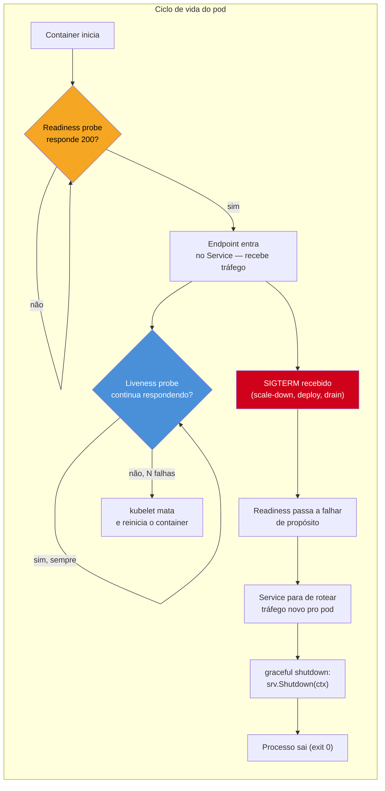

# Contrato com Kubernetes

> [!abstract] TL;DR
> Kubernetes não sabe nada sobre a lógica interna do seu binário Go — ele só enxerga um processo, algumas portas e alguns sinais. Para o cluster tratar seu processo como um cidadão de primeira classe, o binário precisa cumprir um **contrato**: expor um endpoint de **liveness** ("estou travado? me mate e recrie") e um de **readiness** ("estou pronto pra receber tráfego agora?"), ler configuração de **variáveis de ambiente** (populadas por `ConfigMap`/`Secret`) em vez de arquivo local fixo, e reagir a `SIGTERM` em vez de ignorá-lo. Nenhuma dessas exigências é imposta pelo compilador — é o **12-factor app** aplicado à borda entre o seu código e o orquestrador. Um binário que ignora esse contrato ainda compila, ainda roda — só que o cluster vai reiniciá-lo no momento errado, mandar tráfego pra ele antes da hora, ou perder a config na primeira atualização de `ConfigMap`.

## O pod que reinicia sem parar

Imagine um serviço Go que abre uma conexão com um banco de dados logo no `main()`, antes de qualquer outra coisa, e só depois disso começa a escutar HTTP. Em produção, sob Kubernetes, esse serviço entra num loop de `CrashLoopBackOff`: o pod sobe, o `kubelet` espera alguns segundos, decide que o processo está vivo (porque nada disse o contrário) e já começa a rotear tráfego real pra ele — só que a conexão com o banco ainda não terminou de abrir, então toda requisição volta erro 500. Pior: passado um tempo, o `kubelet` também decide, por conta própria, que esse pod parece "travado" — porque nenhum endpoint respondeu a tempo — e o mata, reiniciando o ciclo do zero.

Nada nisso é bug de lógica de negócio. É a ausência de um contrato explícito entre o processo Go e o orquestrador que o hospeda. Kubernetes não lê o código-fonte para adivinhar quando o processo terminou de inicializar — ele **pergunta**, batendo em um endpoint HTTP (ou executando um comando) numa cadência configurada. Se ninguém responde a essa pergunta, o `kubelet` assume o pior caso possível e age em cima disso: tráfego roteado cedo demais, ou reinício por suspeita de travamento.

O mesmo raciocínio vale para configuração. Um binário que lê `/etc/myapp/config.json` de um caminho fixo dentro da imagem Docker (nota anterior desta trilha) funciona perfeitamente... até alguém precisar trocar a URL do banco entre `staging` e `production` sem rebuildar a imagem inteira. Kubernetes resolve isso com `ConfigMap` e `Secret` — mas só se o processo Go souber ler config de fora de si mesmo, via variável de ambiente, em vez de assumir um caminho de arquivo gravado no binário.

## O que o cluster espera do processo



Três perguntas que o cluster faz continuamente, e que o processo Go precisa saber responder:

1. **"Você está pronto pra receber tráfego?"** — readiness probe. Antes do primeiro `200`, o `Service` do Kubernetes nem inclui o pod na lista de endpoints — zero tráfego chega até ele. Depois, se a readiness passar a falhar (banco caiu, dependência externa fora do ar), o pod é **removido temporariamente** da lista, sem ser reiniciado — só volta quando a readiness voltar a responder `200`.
2. **"Você ainda está vivo, ou travou?"** — liveness probe. Falhas consecutivas aqui levam o `kubelet` a **matar e recriar o container** — a suposição é que só um restart completo resolve um processo travado (deadlock, memory leak grave). É uma ferramenta mais bruta que a readiness, e por isso mais perigosa de configurar errado.
3. **"Onde está sua configuração?"** — não é uma pergunta feita via HTTP, mas via variáveis de ambiente injetadas no processo no momento em que o container sobe, a partir de `ConfigMap` (dados não sensíveis) e `Secret` (credenciais, tokens). O processo Go lê essas variáveis com `os.Getenv`/`os.LookupEnv` — sem caminho de arquivo fixo, sem valor hardcoded na imagem.

A [[05 - Graceful shutdown|nota anterior]] já cobriu em detalhe o mecanismo de capturar `SIGTERM` com `signal.Notify` e drenar requisições em voo com `srv.Shutdown(ctx)`. Aqui o que importa é o lugar que esse mecanismo ocupa dentro do contrato maior: `SIGTERM` é o evento que dispara o desligamento — mas o `kubelet` **também** para de mandar tráfego novo assim que decide encerrar o pod, e é a readiness probe que participa dessa decisão. Um processo que trata só o sinal, sem coordenar com a readiness, ainda pode receber uma última rajada de conexões durante os poucos segundos entre "decisão de encerrar" e "sinal efetivamente entregue".

## Casos práticos

### 1. Endpoints de liveness e readiness

O padrão mais simples: dois handlers HTTP, cada um respondendo com base numa pergunta diferente. Liveness responde sempre `200` a menos que o processo esteja genuinamente travado — não deve depender de recursos externos. Readiness, ao contrário, **deve** checar as dependências que importam para atender requisições de verdade.

```go
package main

import (
	"context"
	"database/sql"
	"encoding/json"
	"log/slog"
	"net/http"
	"sync/atomic"
	"time"
)

type App struct {
	db      *sql.DB
	pronto  atomic.Bool // liga depois que a inicialização termina
	drenando atomic.Bool // liga durante o shutdown, pra parar de aceitar tráfego novo
}

// livez responde sempre que o processo não está travado.
// Não consulta o banco — se dependesse do banco, uma falha no banco
// derrubaria o pod inteiro via restart, quando o problema é externo.
func (a *App) livez(w http.ResponseWriter, r *http.Request) {
	w.WriteHeader(http.StatusOK)
}

// readyz responde 200 só quando o processo pode atender tráfego de verdade.
func (a *App) readyz(w http.ResponseWriter, r *http.Request) {
	if a.drenando.Load() {
		// já recebemos SIGTERM: dizemos "não pronto" de propósito,
		// pra o Service parar de rotear tráfego novo antes do processo sair.
		http.Error(w, "shutting down", http.StatusServiceUnavailable)
		return
	}
	if !a.pronto.Load() {
		http.Error(w, "not ready", http.StatusServiceUnavailable)
		return
	}

	ctx, cancel := context.WithTimeout(r.Context(), 2*time.Second)
	defer cancel()
	if err := a.db.PingContext(ctx); err != nil {
		slog.Warn("readiness: banco indisponível", "erro", err)
		http.Error(w, "database unavailable", http.StatusServiceUnavailable)
		return
	}

	w.WriteHeader(http.StatusOK)
}
```

> [!warning] Liveness que consulta dependências externas é uma armadilha clássica
> Se `livez` também fizer `db.Ping()`, uma instabilidade momentânea no banco derruba **todos os pods do serviço ao mesmo tempo**, via restart em massa — porque o `kubelet` mata cada pod que falhar a liveness, e o banco fora do ar faz todos falharem juntos. O sintoma vira "reiniciar não resolve nada, o pod cai de novo em segundos" — porque o problema nunca esteve no processo Go, estava numa dependência que a liveness não deveria ter consultado. Regra prática: **liveness = "meu loop de eventos responde?"**, **readiness = "minhas dependências estão OK?"**.

Manifesto Kubernetes correspondente — os campos que o processo Go precisa satisfazer:

```yaml
livenessProbe:
  httpGet:
    path: /livez
    port: 8080
  initialDelaySeconds: 5
  periodSeconds: 10
  failureThreshold: 3
readinessProbe:
  httpGet:
    path: /readyz
    port: 8080
  periodSeconds: 5
  failureThreshold: 2
```

Cada campo do YAML tem um efeito direto sobre como o processo Go é tratado, e vale entender o que cada um controla antes de copiar valores de outro serviço sem pensar:

- **`initialDelaySeconds`** — quanto tempo o `kubelet` espera, depois do container subir, antes da **primeira** consulta à probe. Curto demais e o processo é julgado antes de terminar de inicializar (armadilha detalhada adiante).
- **`periodSeconds`** — intervalo entre consultas subsequentes. Menor detecta problemas mais rápido, mas gera mais tráfego de probe — geralmente irrelevante em volume, mas relevante se o handler fizer trabalho caro (por isso o `PingContext` com timeout curto no exemplo, não uma query pesada).
- **`failureThreshold`** — quantas falhas **consecutivas** até o `kubelet` agir (remover da readiness, ou matar via liveness). Um valor baixo (1 ou 2) tolera zero flakiness transitória; um valor mais alto absorve picos momentâneos sem overreagir.
- **`timeoutSeconds`** (não mostrado, default 1s) — quanto tempo a probe espera por resposta antes de contar como falha. Se `readyz` faz `PingContext` com timeout de 2s mas a probe do YAML só espera 1s, a probe **sempre** falha por timeout, mesmo com o banco saudável — os dois números precisam ser coerentes entre si.

Existe ainda um terceiro tipo de probe, o **`startupProbe`** (Kubernetes 1.16+), pensado exatamente para separar "ainda inicializando" de "travado depois de inicializado" — assunto retomado na seção de armadilhas.

### 2. Ligando readiness ao graceful shutdown

O detalhe que fecha o ciclo com a nota anterior: assim que o `SIGTERM` chega, o handler de shutdown liga a flag `drenando` **antes** de chamar `srv.Shutdown`, e espera um instante para dar tempo do `kubelet` reconsultar a readiness e remover o pod do `Service` antes de parar de aceitar conexões de verdade.

```go
func run() error {
	app := &App{}
	// ... inicialização de app.db, app.pronto.Store(true) ...

	mux := http.NewServeMux() // ServeMux novo, com roteamento por método — Go 1.22+
	mux.HandleFunc("GET /livez", app.livez)
	mux.HandleFunc("GET /readyz", app.readyz)

	srv := &http.Server{Addr: ":8080", Handler: mux}

	ctx, stop := signal.NotifyContext(context.Background(), os.Interrupt, syscall.SIGTERM)
	defer stop()

	go func() {
		if err := srv.ListenAndServe(); err != nil && err != http.ErrServerClosed {
			slog.Error("servidor encerrou com erro", "erro", err)
		}
	}()

	<-ctx.Done()
	app.drenando.Store(true) // readyz passa a responder 503 a partir de agora

	// dá tempo do kubelet reconsultar /readyz e remover o pod do Service
	// antes de de fato pararmos de aceitar conexões
	time.Sleep(3 * time.Second)

	shutdownCtx, cancel := context.WithTimeout(context.Background(), 25*time.Second)
	defer cancel()
	return srv.Shutdown(shutdownCtx)
}
```

> [!info] `signal.NotifyContext` (Go 1.16+) e `http.ServeMux` com padrão de método (Go 1.22+)
> `signal.NotifyContext` cancela um `context.Context` automaticamente ao receber o sinal — mais idiomático que gerenciar um `chan os.Signal` manualmente. `mux.HandleFunc("GET /livez", ...)` usa o roteamento por método e path introduzido no `net/http.ServeMux` da versão 1.22 — antes disso, era preciso checar `r.Method` dentro do handler.

### 3. Configuração via variável de ambiente (12-factor)

O [12-factor app](https://12factor.net/pt_br/config) — vocabulário nascido fora do mundo Go, mas que se tornou o padrão de fato para qualquer processo que roda em container — resume o terceiro fator numa frase: **"store config in the environment"**. A ideia central é separar config de código: a mesma imagem Docker, sem rebuild, roda em `staging` e `production` só trocando as variáveis de ambiente injetadas pelo `Deployment`.

```go
package config

import (
	"fmt"
	"os"
	"strconv"
	"time"
)

type Config struct {
	DatabaseURL   string
	Port          int
	ShutdownGrace time.Duration
}

func Load() (Config, error) {
	dbURL, ok := os.LookupEnv("DATABASE_URL")
	if !ok || dbURL == "" {
		return Config{}, fmt.Errorf("variável DATABASE_URL obrigatória e não definida")
	}

	port := 8080
	if v, ok := os.LookupEnv("PORT"); ok {
		p, err := strconv.Atoi(v)
		if err != nil {
			return Config{}, fmt.Errorf("PORT inválida: %w", err)
		}
		port = p
	}

	grace := 25 * time.Second
	if v, ok := os.LookupEnv("SHUTDOWN_GRACE"); ok {
		d, err := time.ParseDuration(v)
		if err != nil {
			return Config{}, fmt.Errorf("SHUTDOWN_GRACE inválida: %w", err)
		}
		grace = d
	}

	return Config{DatabaseURL: dbURL, Port: port, ShutdownGrace: grace}, nil
}
```

O `Deployment` popula essas variáveis a partir de duas fontes distintas — não sensível vai em `ConfigMap`, sensível vai em `Secret`:

```yaml
envFrom:
  - configMapRef:
      name: myapp-config   # PORT, SHUTDOWN_GRACE
  - secretRef:
      name: myapp-secrets  # DATABASE_URL (com credencial embutida)
```

> [!warning] `ConfigMap` montado como arquivo não recarrega sozinho no processo já rodando
> Quando um `ConfigMap` é montado como **volume** (em vez de virar variável de ambiente), o `kubelet` de fato atualiza o arquivo no disco do container quando o `ConfigMap` muda — mas isso não significa que o processo Go percebe a mudança. Sem alguém explicitamente reabrindo o arquivo (via `fsnotify`, por exemplo) ou reiniciando o processo, a config em memória continua a antiga. Variável de ambiente é ainda mais rígida: `os.Getenv` lê o valor definido na criação do processo — atualizar o `ConfigMap` depois **não** muda o que o processo já em execução enxerga; só um novo pod, criado depois da atualização, pega o valor novo. Isso é uma decisão consciente do 12-factor: config muda via **novo deploy**, não via mutação silenciosa de processo vivo.

### 4. Readiness que reporta cada dependência, não só um booleano

Em serviços com várias dependências (banco, cache, fila), um `readyz` que responde só `200`/`503` esconde **qual** dependência está falhando — força quem está debugando a olhar logs em vez de bater direto na causa. Um padrão comum é responder um corpo JSON com o detalhe por dependência, mantendo o status HTTP como a fonte de verdade que o `kubelet` de fato usa (ele não interpreta o corpo, só o código de status):

```go
type depStatus struct {
	Nome string `json:"nome"`
	OK   bool   `json:"ok"`
	Erro string `json:"erro,omitempty"`
}

type healthReport struct {
	Pronto       bool        `json:"pronto"`
	Dependencias []depStatus `json:"dependencias"`
}

func (a *App) readyzDetalhado(w http.ResponseWriter, r *http.Request) {
	ctx, cancel := context.WithTimeout(r.Context(), 2*time.Second)
	defer cancel()

	report := healthReport{Pronto: true}

	dbStatus := depStatus{Nome: "database"}
	if err := a.db.PingContext(ctx); err != nil {
		dbStatus.Erro = err.Error()
		report.Pronto = false
	} else {
		dbStatus.OK = true
	}
	report.Dependencias = append(report.Dependencias, dbStatus)

	w.Header().Set("Content-Type", "application/json")
	if !report.Pronto {
		w.WriteHeader(http.StatusServiceUnavailable)
	}
	json.NewEncoder(w).Encode(report)
}
```

Um `curl http://pod-ip:8080/readyz` num pod que se recusa a entrar no `Service` passa a responder algo acionável de imediato — `{"pronto":false,"dependencias":[{"nome":"database","ok":false,"erro":"dial tcp: connection refused"}]}` — em vez de forçar quem está investigando a caçar a causa nos logs da aplicação.

## Armadilhas comuns

> [!warning] `initialDelaySeconds` curto demais mata processos que ainda estão inicializando
> Se o binário Go abre uma conexão de banco, aquece um cache, ou faz qualquer trabalho de inicialização que passe de alguns segundos, e a liveness probe começa a ser consultada antes disso terminar, o `kubelet` pode matar o pod **antes mesmo dele terminar de subir** — um loop de `CrashLoopBackOff` causado inteiramente por configuração de probe, não por bug no código. A correção correta, desde Kubernetes 1.16, é um `startupProbe` dedicado:
>
> ```yaml
> startupProbe:
>   httpGet:
>     path: /readyz
>     port: 8080
>   periodSeconds: 2
>   failureThreshold: 30 # até 60s pra inicializar, sem contar como liveness falhando
> livenessProbe:
>   httpGet:
>     path: /livez
>     port: 8080
>   periodSeconds: 10
>   failureThreshold: 3 # só passa a valer depois que o startupProbe der 200 uma vez
> ```
>
> Enquanto o `startupProbe` não passar, o `kubelet` **suspende** a liveness e a readiness inteiramente — nenhuma das duas é sequer consultada. Isso separa dois problemas que `initialDelaySeconds` sozinho mistura: "quanto tempo a inicialização pode levar" (responsabilidade do `startupProbe`, com folga generosa) e "com que agressividade reagir a travamento depois de já estar rodando" (responsabilidade da liveness, que aí pode ficar bem mais rígida — `failureThreshold: 3` em vez de um `initialDelaySeconds` inflado pra acomodar o pior caso de boot).

> [!warning] Confundir `os.Getenv` com `os.LookupEnv` esconde erro de config
> `os.Getenv("DATABASE_URL")` retorna string vazia tanto quando a variável não existe quanto quando ela existe e está vazia de propósito — não dá pra distinguir os dois casos. `os.LookupEnv` retorna um segundo valor booleano (`ok`) que resolve essa ambiguidade. Para configuração obrigatória (como uma connection string), usar `LookupEnv` e falhar explicitamente no boot — via `log.Fatal` ou retornando erro de `main` — é bem melhor que deixar o processo subir com uma `DatabaseURL` vazia e só descobrir o problema na primeira query, em produção, sob carga.

> [!warning] Não confundir readiness com liveness na hora de decidir o que checar
> Colocar a checagem de banco na liveness (armadilha já citada acima) é o erro mais comum, mas o inverso também acontece: uma readiness que sempre responde `200` sem checar nada vira decorativa — o `Service` roteia tráfego pro pod mesmo quando ele não tem a menor condição de atendê-lo. O contrato só funciona se cada probe responder exatamente à pergunta que lhe cabe.

## Vindo de outra stack

| Conceito | Java (Spring Boot) | Node.js | Go |
|---|---|---|---|
| Readiness/liveness | Spring Boot Actuator (`/actuator/health/readiness`, `/actuator/health/liveness`) prontos de fábrica | sem padrão único — geralmente um endpoint Express manual | `net/http` puro; handler manual, como visto acima |
| Config via ambiente | `application.yml` + `@Value`/`@ConfigurationProperties`, com override por env var | `process.env`, geralmente via `dotenv` em dev | `os.Getenv`/`os.LookupEnv`, sem framework — a "mágica" fica a cargo do dev |
| Graceful shutdown | `server.shutdown=graceful` (Boot 2.3+) já cuida do drain automaticamente | `process.on('SIGTERM', ...)` manual, parecido com Go | `signal.NotifyContext` + `srv.Shutdown(ctx)`, como na nota anterior |

O ponto que mais surpreende quem vem do Spring Boot é a ausência de "biblioteca oficial de saúde" — não existe um equivalente direto ao Actuator na biblioteca padrão. `/livez` e `/readyz` em Go, na maioria dos serviços de produção, são handlers escritos à mão (como aqui) ou fornecidos por uma lib de terceiros — não há convenção imposta pelo compilador nem pela stdlib, só pela prática da comunidade.

## Como explicar em inglês

> A Go process running under Kubernetes has to honor a contract the cluster imposes from the outside: it must expose a **liveness** endpoint ("am I stuck? kill and recreate me if I stop answering") and a **readiness** endpoint ("can I actually serve traffic right now?"), and it must read configuration from **environment variables** rather than a fixed local file, since `ConfigMap` and `Secret` values are injected at container start, not hot-reloaded into a running process. None of this is enforced by the Go compiler — it's the **12-factor app** discipline applied at the boundary between your binary and the orchestrator. Get liveness wrong — checking an external dependency inside it — and a transient database blip triggers a mass restart across every pod. Get readiness wrong — never checking anything — and the `Service` keeps routing traffic to a pod that can't actually serve it. Tie readiness to your `SIGTERM` handler so it starts failing on purpose the moment shutdown begins, and the cluster stops sending new traffic before your graceful-shutdown drain even starts.

| Termo PT | Termo EN |
|---|---|
| sonda de vivacidade | liveness probe |
| sonda de prontidão | readiness probe |
| sonda de inicialização | startup probe |
| configuração via ambiente | config via environment |
| mapa de configuração | ConfigMap |
| drenar tráfego | drain traffic |
| prazo de encerramento | termination grace period |
| doze fatores | twelve-factor |

## O que vem a seguir

Este contrato assumiu, por simplicidade, que `DATABASE_URL` e afins chegam prontos via `ConfigMap`/`Secret` — mas não entrou no mérito de **como** um segredo chega até lá com segurança, nem no que muda quando a configuração cresce além de meia dúzia de variáveis soltas. A [[07 - Configuração e secrets em produção|próxima nota]] aprofunda exatamente esse ponto: hierarquia de fontes de config, rotação de secrets, e os padrões que evitam que uma credencial de banco acabe hardcoded ou versionada por engano.

## Veja também

- [[04 - Docker — imagens mínimas|04 — Docker — imagens mínimas]] — a imagem que o `kubelet` de fato executa
- [[05 - Graceful shutdown|05 — Graceful shutdown]] — o mecanismo de `SIGTERM` e `srv.Shutdown` que esta nota conecta ao ciclo de vida do pod
- [[07 - Configuração e secrets em produção|07 — Configuração e secrets em produção]] — próxima nota do galho
- [[03-Dominios/Tecnologia/Go/index|Trilha Go]]

## Fontes

- The Go Authors. *Package signal*. pkg.go.dev. https://pkg.go.dev/os/signal (acessado em 2026-07-18)
- The Go Authors. *Package net/http*. pkg.go.dev. https://pkg.go.dev/net/http (acessado em 2026-07-18)
- The Go Authors. *Package os*. pkg.go.dev. https://pkg.go.dev/os (acessado em 2026-07-18)
- Kubernetes Authors. *Configure Liveness, Readiness and Startup Probes*. kubernetes.io. https://kubernetes.io/docs/tasks/configure-pod-container/configure-liveness-readiness-startup-probes/ (acessado em 2026-07-18)
- The Twelve-Factor App. *III. Config*. 12factor.net. https://12factor.net/config (acessado em 2026-07-18)
- Kubernetes Authors. *Configure a Pod to Use a ConfigMap*. kubernetes.io. https://kubernetes.io/docs/tasks/configure-pod-container/configure-pod-configmap/ (acessado em 2026-07-18)
