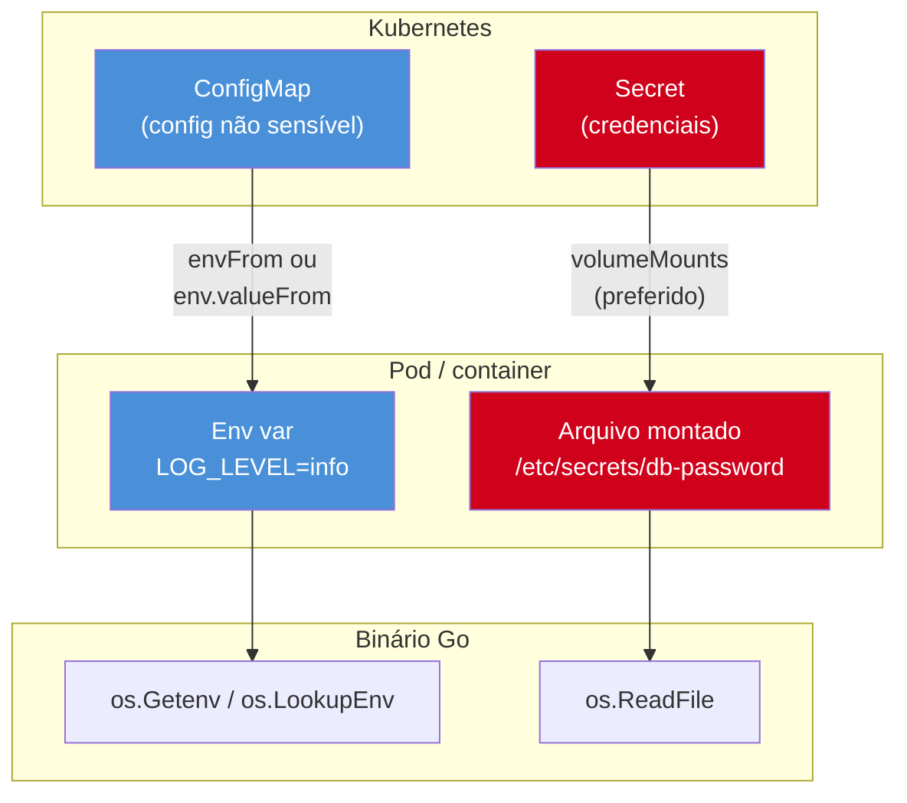
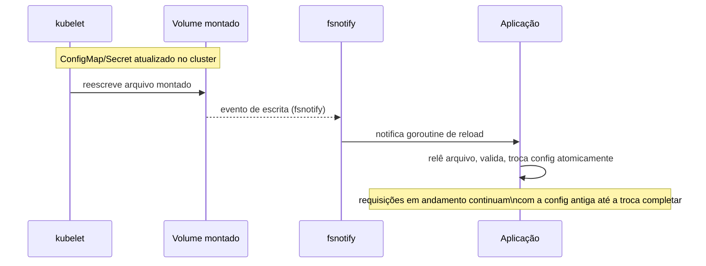

# Configuração e secrets em produção

> [!abstract] TL;DR
> Em produção, configuração vem de duas fontes bem diferentes e Go trata as duas com o mesmo punhado de ferramentas da standard library: **env vars** (`os.Getenv`, `os.LookupEnv`) para parâmetros não sensíveis, e **arquivos montados** (volumes do Kubernetes, geralmente em `/etc/secrets` ou `/var/run/secrets`) para credenciais — porque secrets em env var vazam fácil demais (aparecem em `/proc/<pid>/environ`, em crash dumps, em `docker inspect`, em qualquer log de painel que ecoa o ambiente inteiro). A segunda regra dura é **nunca logar o valor de um secret** — nem por acidente, quando `log/slog` serializa uma struct inteira e um campo sensível vai junto. A terceira é que configuração pode **mudar sem reiniciar o processo**: um `ConfigMap` do Kubernetes é atualizado, o arquivo montado muda no disco, e a aplicação — se estiver ouvindo — recarrega sem downtime, via `fsnotify` ou reload sob sinal. Esta nota fecha o ciclo: rotação e escaneamento de vulnerabilidade de secrets pertencem ao Galho 19; aqui o assunto é como o binário Go consome e recarrega config com segurança.

## O cenário: uma variável de ambiente vazou no Slack

Imagine o incidente mais chato e mais comum de produção: alguém rodou `kubectl describe pod` para debugar um problema de scheduling, colou a saída inteira num canal do Slack para pedir ajuda, e junto veio a seção `Environment:` do pod — com `DATABASE_PASSWORD=hunter2` visível para o canal inteiro. Ninguém fez nada de errado de propósito. O problema é estrutural: env vars são **legíveis por qualquer coisa que tenha acesso ao processo ou ao pod** — outro processo no mesmo container lendo `/proc/1/environ`, uma ferramenta de observabilidade que despeja o ambiente inteiro em uma trace, um `kubectl describe` displicente.

A pergunta que este cenário força é: config e secret deveriam viajar pelo mesmo canal? A resposta que a comunidade cloud-native convergiu, depois de incidentes como esse se repetirem em escala, é não. **Configuração não sensível** (nível de log, timeout de HTTP, feature flags, URL de um serviço interno) pode continuar em env var — é barato, é o padrão do [12-factor app](https://12factor.net/config), e não há segredo a proteger. **Secrets** (senha de banco, chave de API, certificado TLS) merecem um canal com superfície de exposição menor: um arquivo montado em disco, com permissões restritas, fora do `describe pod` e fora de qualquer trace de observabilidade que capture variáveis de ambiente por padrão.

## Duas fontes, dois mecanismos



O Kubernetes deixa você injetar um `Secret` como env var também (`env.valueFrom.secretKeyRef`) — a API permite, mas a prática recomendada evita esse caminho pelos motivos do cenário acima. Um `Secret` montado como **volume** vira um arquivo no filesystem do container, legível só por quem tem acesso ao container em si — não aparece em `describe pod`, não vaza em trace de observabilidade que captura `os.Environ()`, e pode ser **atualizado sem recriar o pod** (o kubelet reescreve o arquivo quando o `Secret` muda — voltamos nisso na seção de recarga).

### Lendo env var em Go

```go
package config

import (
	"fmt"
	"os"
	"strconv"
)

type Config struct {
	LogLevel   string
	HTTPPort   int
	Timeout    int // segundos
}

func Load() (Config, error) {
	cfg := Config{
		LogLevel: getEnvDefault("LOG_LEVEL", "info"),
	}

	portStr := getEnvDefault("HTTP_PORT", "8080")
	port, err := strconv.Atoi(portStr)
	if err != nil {
		return Config{}, fmt.Errorf("HTTP_PORT inválido: %w", err)
	}
	cfg.HTTPPort = port

	timeoutStr, ok := os.LookupEnv("REQUEST_TIMEOUT_SECONDS")
	if !ok {
		return Config{}, fmt.Errorf("REQUEST_TIMEOUT_SECONDS é obrigatória e não foi definida")
	}
	timeout, err := strconv.Atoi(timeoutStr)
	if err != nil {
		return Config{}, fmt.Errorf("REQUEST_TIMEOUT_SECONDS inválido: %w", err)
	}
	cfg.Timeout = timeout

	return cfg, nil
}

func getEnvDefault(key, fallback string) string {
	if v, ok := os.LookupEnv(key); ok {
		return v
	}
	return fallback
}
```

Repare na diferença entre `os.Getenv` e `os.LookupEnv`: `Getenv` devolve string vazia tanto para "variável não definida" quanto para "variável definida como vazio" — indistinguíveis. `LookupEnv` devolve o segundo valor booleano que resolve essa ambiguidade. Para config **obrigatória**, `LookupEnv` é a escolha certa — falhar rápido, com uma mensagem de erro clara, é muito melhor do que rodar com um timeout de zero segundos porque a variável nunca foi definida.

### Lendo secret de arquivo montado

```go
package config

import (
	"fmt"
	"os"
	"strings"
)

// LoadSecret lê um secret montado como arquivo. O Kubernetes monta
// cada chave do Secret como um arquivo separado dentro do diretório
// — ex.: /etc/secrets/db-password contém só a senha, sem quebra de linha
// extra na maioria dos casos, mas vale sempre aparar espaço em branco.
func LoadSecret(path string) (string, error) {
	data, err := os.ReadFile(path)
	if err != nil {
		return "", fmt.Errorf("lendo secret em %s: %w", path, err)
	}
	return strings.TrimSpace(string(data)), nil
}
```

```yaml
# Trecho do manifesto do Deployment — o Secret vira arquivo, não env var
volumeMounts:
  - name: db-credentials
    mountPath: /etc/secrets
    readOnly: true
volumes:
  - name: db-credentials
    secret:
      secretName: db-credentials
```

> [!info] `os.ReadFile` existe desde Go 1.16
> Antes disso era `ioutil.ReadFile`. Todo código Go moderno (1.16+) deveria usar `os.ReadFile`/`os.WriteFile` — o pacote `io/ioutil` está deprecated desde então, mesmo continuando a compilar por compatibilidade.

## Não logar secrets — o vazamento mais bobo e mais comum

A forma mais comum de vazar um secret em produção não é um ataque — é um `log.Printf("config carregada: %+v", cfg)` numa struct que tem um campo `Password`. `%+v` serializa **todos** os campos exportados, sem distinguir sensível de não sensível. Com `log/slog` (desde Go 1.21) o risco é o mesmo se você passar a struct inteira como atributo:

```go
type DBConfig struct {
	Host     string
	Port     int
	User     string
	Password string
}

// PERIGO: slog serializa todos os campos, inclusive Password
slog.Info("conectando ao banco", "config", dbConfig)
```

> [!warning] `slog.Info` com uma struct inteira loga tudo, secret incluído
> `slog` não sabe, por padrão, que `Password` é sensível — ele só vê um campo exportado como outro qualquer. O resultado sai no log estruturado (JSON, indexado por qualquer sistema de observabilidade downstream) e agora o secret está em texto plano em um sistema de logs que provavelmente tem retenção de meses e acesso mais amplo do que o Secret original do Kubernetes.

A defesa tem três camadas, do mais simples ao mais robusto:

**1. Nunca logar a struct de config inteira** — logar só os campos que você escolheu explicitamente:

```go
slog.Info("conectando ao banco",
	"host", dbConfig.Host,
	"port", dbConfig.Port,
	"user", dbConfig.User,
	// Password propositalmente omitido
)
```

**2. Implementar `LogValue()` para que o próprio tipo se redija** — a forma mais robusta, porque protege contra qualquer chamador que logue a struct inteira por descuido, presente ou futuro:

```go
import "log/slog"

type Secret string

// LogValue faz slog.Any tratar Secret como redigido sempre que
// aparecer em qualquer log estruturado, sem depender do chamador lembrar.
func (s Secret) LogValue() slog.Value {
	return slog.StringValue("[REDACTED]")
}

type DBConfig struct {
	Host     string
	Port     int
	User     string
	Password Secret
}

func main() {
	cfg := DBConfig{Host: "db.internal", Port: 5432, User: "app", Password: Secret("hunter2")}
	slog.Info("conectando ao banco", "config", cfg)
	// output: config redigido? NÃO por padrão — slog não desce
	// recursivamente em campos de struct sem LogValue no tipo do CAMPO.
	// Ver nota abaixo.
}
```

> [!warning] `LogValue()` só protege se o secret for logado como valor próprio, não dentro de uma struct plana
> `slog.Value.LogValue()` funciona quando o valor sensível é passado diretamente como atributo (`slog.Any("password", cfg.Password)`) ou quando `%v`/`String()` é chamado sobre ele — mas `slog` **não** invoca `LogValue()` de campos aninhados dentro de uma struct passada inteira via `"config", cfg`, porque o encoder de slog serializa a struct via reflection padrão, não recursivamente por campo. A defesa mais confiável continua sendo a camada 1: nunca passe a struct de config inteira para o logger — extraia campo a campo, ou implemente `LogValue()` no tipo `DBConfig` inteiro (não só em `Secret`), redigindo manualmente o que precisa ser omitido.

**3. Implementar `String()` e `GoString()` para bloquear até `fmt.Println`/`%+v` acidental**, cinturão e suspensório:

```go
func (s Secret) String() string   { return "[REDACTED]" }
func (s Secret) GoString() string { return "[REDACTED]" }
```

Com essas duas linhas, `fmt.Println(cfg.Password)`, `fmt.Printf("%v", cfg.Password)` e `fmt.Printf("%#v", cfg.Password)` imprimem `[REDACTED]` em vez do valor real — cobre o caminho de debug via `fmt`, que é justamente o vazamento mais casual: um dev colocando um `fmt.Println(cfg)` temporário para debugar localmente e esquecendo de remover antes do commit.

## Recarregando config sem reiniciar

Reiniciar o processo para toda mudança de config é caro em produção — cada restart é uma janela de indisponibilidade (mesmo que curta, com [[06 - Contrato com Kubernetes|graceful shutdown]] bem feito) e, em serviços com muito tráfego, um evento arriscado o suficiente para evitar. A alternativa é **observar** a config e recarregar em memória quando ela muda, sem derrubar o processo.



Kubernetes garante que a atualização de um `ConfigMap` ou `Secret` montado como volume se propaga para o arquivo no filesystem do container — normalmente em até um minuto (o kubelet sincroniza periodicamente), sem recriar o pod. O trabalho do lado da aplicação é **detectar** essa mudança e recarregar com segurança. A biblioteca padrão de fato para isso é [`fsnotify`](https://pkg.go.dev/github.com/fsnotify/fsnotify) — não faz parte da standard library, mas é o padrão de facto do ecossistema Go, mantida sob o guarda-chuva do projeto `golang/x`.

```go
package config

import (
	"log/slog"
	"sync/atomic"

	"github.com/fsnotify/fsnotify"
)

type AppConfig struct {
	LogLevel string
	Timeout  int
}

// Store guarda a config atual de forma segura para leitura concorrente
// via atomic.Pointer — trocar o ponteiro é atômico; leitores nunca veem
// um estado parcialmente atualizado.
type Store struct {
	current atomic.Pointer[AppConfig]
}

func (s *Store) Get() *AppConfig {
	return s.current.Load()
}

func (s *Store) set(cfg *AppConfig) {
	s.current.Store(cfg)
}

func WatchAndReload(path string, store *Store) error {
	watcher, err := fsnotify.NewWatcher()
	if err != nil {
		return err
	}

	if err := watcher.Add(path); err != nil {
		return err
	}

	go func() {
		defer watcher.Close()
		for {
			select {
			case event, ok := <-watcher.Events:
				if !ok {
					return
				}
				// Kubernetes reescreve o arquivo via symlink atômico —
				// o evento relevante costuma ser Create ou Write, não Remove.
				if event.Op&(fsnotify.Write|fsnotify.Create) != 0 {
					reload(path, store)
				}
			case err, ok := <-watcher.Errors:
				if !ok {
					return
				}
				slog.Error("erro no watcher de config", "erro", err)
			}
		}
	}()

	return nil
}

func reload(path string, store *Store) {
	newCfg, err := parseConfig(path)
	if err != nil {
		// Config inválida: mantém a config atual, só registra o erro.
		// Nunca aplicar uma config que falhou validação.
		slog.Error("falha ao recarregar config, mantendo a atual", "erro", err)
		return
	}
	store.set(newCfg)
	slog.Info("config recarregada com sucesso")
}

func parseConfig(path string) (*AppConfig, error) {
	// parse + validação real aqui — omitido por brevidade
	return &AppConfig{LogLevel: "info", Timeout: 30}, nil
}
```

> [!info] `atomic.Pointer[T]` genérico é de Go 1.19
> Antes disso, trocar um ponteiro de config de forma segura para concorrência exigia `atomic.Value` sem tipagem (`interface{}` por baixo, com type assertion manual em cada leitura) ou um `sync.RWMutex` guardando a struct. `atomic.Pointer[T]` (pacote `sync/atomic`, Go 1.19+) dá a mesma garantia de troca atômica com tipo estático — sem lock, sem assertion, sem risco de guardar o tipo errado.

> [!warning] Kubernetes reescreve o arquivo via symlink, não in-place
> O kubelet não sobrescreve o conteúdo do arquivo montado diretamente — ele cria um novo diretório com o conteúdo atualizado e troca um symlink para apontar para ele (o padrão *atomic symlink swap*, o mesmo truque usado por deploys atômicos em geral). Isso significa que um watcher ingênuo, escutando só o arquivo específico (`watcher.Add("/etc/secrets/db-password")`), pode perder o evento — o inode antigo simplesmente para de existir. A prática recomendada é dar `watcher.Add` no **diretório** que contém o arquivo, não no arquivo em si, e reagir a qualquer evento de `Create` dentro dele.

Para serviços mais simples, onde `fsnotify` é peso demais, existe uma alternativa mais grosseira e ainda assim legítima: recarregar sob **sinal**, tipicamente `SIGHUP` — a convenção histórica em daemons Unix para "releia sua config sem reiniciar", usada por `nginx`, `sshd` e boa parte dos serviços de infraestrutura clássicos:

```go
package main

import (
	"log/slog"
	"os"
	"os/signal"
	"syscall"
)

func main() {
	sigCh := make(chan os.Signal, 1)
	signal.Notify(sigCh, syscall.SIGHUP)

	go func() {
		for range sigCh {
			slog.Info("SIGHUP recebido, recarregando config")
			// reload(...) aqui
		}
	}()

	// resto da aplicação...
	select {}
}
```

`SIGHUP` exige alguém (um script de deploy, um sidecar, um operador manual) disparar `kill -HUP <pid>` depois de atualizar a config — é um mecanismo mais manual que o `fsnotify`, mas continua sendo preferível a reiniciar o pod inteiro, porque não interrompe conexões em andamento nem dispara o ciclo de [[06 - Contrato com Kubernetes|liveness/readiness probes]] de novo.

## Casos práticos: juntando tudo num `Config.Load()` de produção

```go
package config

import (
	"fmt"
	"log/slog"
	"os"
	"strconv"
	"strings"
)

type Secret string

func (s Secret) String() string   { return "[REDACTED]" }
func (s Secret) GoString() string { return "[REDACTED]" }

func (s Secret) LogValue() slog.Value {
	return slog.StringValue("[REDACTED]")
}

type Config struct {
	LogLevel   string
	HTTPPort   int
	DBHost     string
	DBPassword Secret
}

func Load() (Config, error) {
	var cfg Config
	var errs []string

	cfg.LogLevel = getEnvDefault("LOG_LEVEL", "info")
	cfg.DBHost = getEnvDefault("DB_HOST", "localhost")

	port, err := strconv.Atoi(getEnvDefault("HTTP_PORT", "8080"))
	if err != nil {
		errs = append(errs, fmt.Sprintf("HTTP_PORT inválido: %v", err))
	}
	cfg.HTTPPort = port

	// Secret vem de arquivo montado, não de env var.
	pwPath := getEnvDefault("DB_PASSWORD_FILE", "/etc/secrets/db-password")
	pw, err := os.ReadFile(pwPath)
	if err != nil {
		errs = append(errs, fmt.Sprintf("lendo secret DB_PASSWORD_FILE: %v", err))
	}
	cfg.DBPassword = Secret(strings.TrimSpace(string(pw)))

	if len(errs) > 0 {
		return Config{}, fmt.Errorf("config inválida: %s", strings.Join(errs, "; "))
	}

	return cfg, nil
}

func getEnvDefault(key, fallback string) string {
	if v, ok := os.LookupEnv(key); ok {
		return v
	}
	return fallback
}

func main() {
	cfg, err := Load()
	if err != nil {
		slog.Error("falha ao carregar config", "erro", err)
		os.Exit(1)
	}

	// Seguro: cfg.DBPassword nunca aparece em texto plano, mesmo
	// logando a struct inteira, porque LogValue()/String() redigem.
	slog.Info("config carregada", "config", cfg)
}
```

Acumular todos os erros de validação num `[]string` antes de retornar (em vez de sair no primeiro `os.Getenv` ausente) é uma escolha deliberada: quando a config está errada em produção, você quer ver **todos** os problemas de uma vez no log de inicialização — não corrigir um, redeployar, descobrir o próximo erro, redeployar de novo.

## Armadilhas comuns

> [!warning] Secret em `.env` versionado no git
> `.env` files são convenientes em desenvolvimento local, mas um `.env` com secret real, commitado por engano (aconteceu com `git add .` displicente inúmeras vezes na história de projetos open source), fica no histórico do git **para sempre** — mesmo depois de removido em um commit seguinte, `git log` e qualquer clone anterior ainda têm o valor. Sempre `.gitignore` para `.env`, e sempre um `.env.example` com chaves sem valores para documentar o que é esperado.

> [!warning] Confundir `ConfigMap` com `Secret` no Kubernetes
> Um `ConfigMap` é armazenado em texto plano no etcd — sem criptografia adicional por padrão. Um `Secret` é, por padrão, apenas **base64**, não criptografado (base64 não é cifra, é só uma codificação reversível sem chave nenhuma) — a criptografia em repouso do etcd é uma configuração separada do cluster (`EncryptionConfiguration`), não automática. Colocar uma senha de banco num `ConfigMap` por engano — porque "é só configuração" — é um erro comum e sério; sempre `Secret`, mesmo sabendo que a criptografia real depende de configuração adicional do cluster.

> [!warning] Reload parcial deixa o processo num estado inconsistente
> Se `reload()` aplica campo por campo diretamente na struct de config compartilhada (em vez de montar uma struct nova e trocar o ponteiro atomicamente, como no exemplo com `atomic.Pointer[T]`), uma goroutine lendo a config no meio da atualização pode ver metade dos campos novos e metade dos antigos — uma combinação que nunca existiu como config válida. A troca sempre deve ser **atômica**: monta a struct nova inteira, valida, e só então troca o ponteiro de uma vez.

## Vindo de outras stacks

| Vindo de | Em Go é assim |
|---|---|
| Spring Boot (`application.yml` + `@ConfigurationProperties`, refresh via Spring Cloud Config) | Sem framework de config embutido — `os.Getenv`/`os.ReadFile` manuais, ou uma lib como Viper; refresh manual via `fsnotify`/`SIGHUP`, não automático |
| Node.js (`process.env`, dotenv, `.env` carregado por convenção) | Mesma ideia com `os.Getenv`, mas sem carregamento automático de `.env` — se quiser isso em dev, é uma lib de terceiros (`godotenv`) |
| Python (`os.environ`, `python-decouple`, Pydantic Settings) | Equivalente direto em `os.Getenv`/`os.LookupEnv`; validação declarativa como Pydantic Settings não existe na stdlib — struct + validação manual, ou lib de terceiros |
| Kubernetes Secrets em qualquer stack | O mecanismo do cluster é o mesmo para todas as linguagens — a diferença é só como o runtime de cada uma lê o arquivo montado |

## Como explicar em inglês

> In production, configuration comes from two different channels, and the split matters for security. Non-sensitive settings (log level, timeouts, feature flags) travel as environment variables, read with `os.Getenv` or `os.LookupEnv`. Secrets — database passwords, API keys — should instead be mounted as files (a Kubernetes `Secret` mounted as a volume, not injected as an env var), because environment variables leak too easily: they show up in `kubectl describe pod`, in `/proc/<pid>/environ`, and in any observability tool that dumps the process environment. The second hard rule is never log a secret's value — implementing `LogValue()` (for `log/slog`) and `String()`/`GoString()` (for `fmt`) on a `Secret` type redacts it automatically, closing off the most common accidental leak: logging or printing a config struct wholesale. The third piece is reloading config without a restart — watching the mounted file with `fsnotify` (mindful that Kubernetes swaps files via an atomic symlink, so you watch the directory, not the file) or reacting to `SIGHUP`, then swapping the whole config atomically via `atomic.Pointer[T]` so no reader ever observes a half-updated state.

| Termo PT | Termo EN |
|---|---|
| variável de ambiente | environment variable |
| arquivo montado | mounted file |
| segredo / credencial | secret |
| redigir (ocultar em log) | redact |
| recarregar sem reiniciar | hot reload |
| troca atômica de ponteiro | atomic pointer swap |
| criptografia em repouso | encryption at rest |
| rotação de credencial | credential rotation |

## O que vem a seguir

Config carregada, secrets protegidos, reload funcionando — falta fechar o ciclo de como esse binário chega até o cluster de produção sem intervenção manual. A [[08 - Do commit ao deploy — CI-CD|nota 08]] percorre o pipeline inteiro: do `git push` ao pod rodando, cobrindo onde a imagem Docker (nota 04) é construída, como os build flags (nota 03) entram no pipeline, e como o mesmo cuidado com secrets desta nota se estende para as credenciais que o próprio pipeline de CI/CD precisa gerenciar.

## Veja também

- [[04 - Docker — imagens mínimas|04 — Docker — imagens mínimas]] — onde a imagem que recebe esses volumes montados é construída
- [[05 - Graceful shutdown|05 — Graceful shutdown]] — por que reiniciar o processo para toda mudança de config custa mais do que parece
- [[06 - Contrato com Kubernetes|06 — Contrato com Kubernetes]] — probes e o ciclo de vida do pod que um restart de config dispara
- [[08 - Do commit ao deploy — CI-CD|08 — Do commit ao deploy — CI/CD]] — próxima nota do galho
- [[03-Dominios/Tecnologia/Go/index|Trilha Go]]

## Fontes

- The Go Authors. *log/slog package documentation*. pkg.go.dev. https://pkg.go.dev/log/slog (acessado em 2026-07-18)
- The Go Authors. *sync/atomic package documentation — Pointer*. pkg.go.dev. https://pkg.go.dev/sync/atomic#Pointer (acessado em 2026-07-18)
- The Go Authors. *os package documentation*. pkg.go.dev. https://pkg.go.dev/os (acessado em 2026-07-18)
- fsnotify contributors. *fsnotify package documentation*. pkg.go.dev. https://pkg.go.dev/github.com/fsnotify/fsnotify (acessado em 2026-07-18)
- Kubernetes documentation. *Secrets*. kubernetes.io. https://kubernetes.io/docs/concepts/configuration/secret/ (acessado em 2026-07-18)
- Wiggins, Adam. *The Twelve-Factor App — Config*. 12factor.net. https://12factor.net/config (acessado em 2026-07-18)
