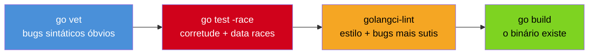
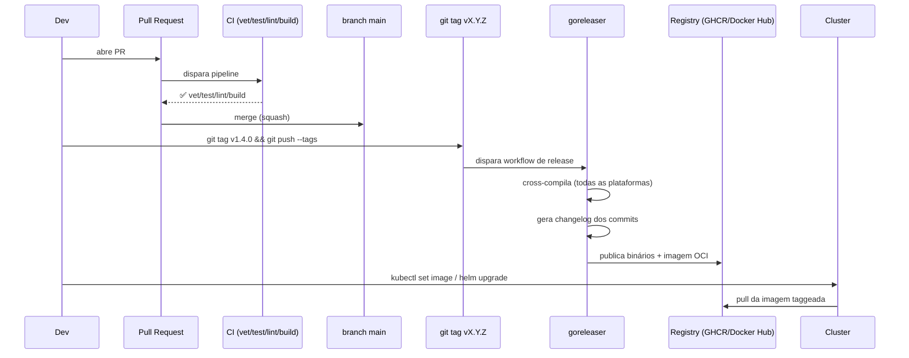

# Do commit ao deploy — CI/CD

> [!abstract] TL;DR
> Um pipeline de CI/CD em Go tem uma ordem canônica de checagens — `go vet` (bugs óbvios), `go test -race` (corretude + concorrência), `golangci-lint` (estilo e mais bugs), `go build` (o binário compila) — e cada etapa existe para pegar uma classe de erro que a etapa anterior não pega. **goreleaser** automatiza o que vem depois de tudo verde: cross-compilar para todas as plataformas-alvo, gerar changelog a partir dos commits, publicar binários e imagens de container, tudo disparado por uma **tag Git semver** (`v1.4.0`). Versionamento semântico não é figura de linguagem em Go — o próprio `go.mod` e o proxy de módulos (`go.dev/doc/modules/version-numbers`) dependem de `MAJOR.MINOR.PATCH` para resolver dependências e decidir se uma major nova precisa de um caminho de import diferente (`/v2`). O fio que costura tudo isso — do PR ao pod rodando em produção — é o assunto desta nota, a última do galho antes de Segurança.

## O pipeline que devia existir

Imagine o seguinte incidente, comum o bastante para soar familiar: sexta-feira, 17h, alguém fecha um PR pequeno — "corrige typo no log" — revisado em trinta segundos, porque quem ia revisar também queria ir embora. O merge dispara um script que faz `go build` e `scp` do binário pro servidor. Passa o fim de semana. Segunda de manhã, o serviço está derrubando 15% das requisições com um `nil pointer dereference` que um `go vet` teria pego em cinco segundos — ou que um teste com `-race` teria exposto antes mesmo do PR ser aberto.

O problema não foi a pressa de sexta-feira. Foi não ter um pipeline que tornasse essa pressa **segura**. CI/CD, nesse sentido, não é burocracia de processo — é a diferença entre "compilou na minha máquina" e "sabemos, com evidência automatizada, que este binário específico passa nas checagens que definimos como não-negociáveis antes de tocar produção".

Go tem uma vantagem estrutural aqui que outras linguagens não têm de graça: o toolchain já vem com as ferramentas de checagem embutidas. Não é preciso instalar um linter de terceiros só para ter *algo*; `go vet` está no binário `go` desde sempre, e `go test -race` é uma flag, não uma dependência externa. Isso barateia o pipeline mínimo — mas "mínimo" não é o mesmo que "suficiente", e esta nota percorre a distância entre os dois.

## As quatro etapas e o que cada uma pega



A ordem não é arbitrária — é do mais barato e mais fundamental para o mais caro e mais superficial:

**1. `go vet`** — parte do toolchain padrão, roda em segundos, e pega erros que *não são* erros de sintaxe (o compilador já barraria esses), mas são padrões que quase sempre indicam bug: um `Printf` com o número errado de argumentos para o verbo de formatação, uma struct copiada com `sync.Mutex` dentro dela (o que quebra a semântica do lock), um `context.Context` que não é o primeiro parâmetro de uma função exportada. `go vet ./...` roda em qualquer projeto Go sem instalar nada além do próprio Go.

**2. `go test -race`** — a flag `-race` ativa o **detector de race condition** do runtime Go, que instrumenta o binário de teste para pegar acessos concorrentes não sincronizados a memória compartilhada. Sem `-race`, `go test` roda os mesmos testes, mas cego para esse tipo de bug — um data race pode passar limpo mil vezes e só se manifestar em produção, sob carga real, num timing específico. Rodar com `-race` em CI é caro (o binário instrumentado é mais lento e usa mais memória — o próprio `go.dev/doc/articles/race_detector` recomenda não deixar `-race` ligado em produção, só em CI e testes locais), mas é exatamente o tipo de custo que vale pagar uma vez por PR em vez de uma vez em produção.

**3. `golangci-lint`** — um agregador que roda dezenas de linters em paralelo (`govet` de novo, mas também `staticcheck`, `errcheck`, `ineffassign`, `unused`, e por aí vai), com um único binário e um único arquivo de configuração. Não é parte do toolchain oficial do Go — é um projeto da comunidade, mas tornou-se o padrão de fato para lint em Go, a ponto de aparecer na maioria dos templates de CI publicados por times sérios.

**4. `go build`** — a etapa mais óbvia, mas que só faz sentido depois das três anteriores: compilar um binário que tem um data race silencioso ou um bug óbvio de `vet` não prova nada além de "o Go parseia sua sintaxe". `go build` (ou, melhor ainda em CI, `go build ./...` para compilar todos os pacotes, não só o `main`) é a última prova de que o código forma um binário coeso — e é essa etapa que alimenta o passo seguinte, o `goreleaser`.

> [!warning] `-race` exige CGO habilitado
> O detector de race depende de uma biblioteca em C (`libtsan`), então `go test -race` só funciona com `CGO_ENABLED=1` — o padrão na maioria dos runners de CI, mas não em builds cross-compiled com `CGO_ENABLED=0` (o assunto da nota 02 deste galho, para imagens `scratch`). Rode `-race` numa etapa de teste nativa, separada da etapa de build estático; misturar as duas configurações no mesmo job de CI é fonte comum de "por que meu `go test -race` não roda no runner Alpine?".

> [!question]- As quatro etapas rodam em sequência ou em paralelo?
> Depende do que se está otimizando. Em série (como no exemplo de GitHub Actions mais abaixo), cada `step` só roda se o anterior passar — o pipeline falha rápido (*fail fast*) na etapa mais barata, economizando os minutos que `go test -race` levaria num PR que já tem um erro óbvio de `vet`. Times com PRs muito frequentes às vezes preferem rodar `vet`, `lint` e `test` como `jobs` paralelos dentro do mesmo workflow — mais rápido no relógio de parede, mas gasta minutos de CI mesmo quando a primeira etapa já falharia. Não há resposta universal; a escolha é sobre o que é mais escasso no time: tempo de espera do dev ou orçamento de minutos de CI.

## Casos práticos

### 1. Um `main.go` real, com a versão injetada por `ldflags`

A nota 03 deste galho já cobriu build flags em detalhe — aqui o ponto é como essas flags se encaixam no pipeline. O binário precisa saber sua própria versão em tempo de execução, sem hardcoded no código-fonte:

```go
package main

import "fmt"

// version, commit e buildDate ficam vazios no código-fonte —
// o pipeline de CI/CD os preenche via -ldflags no momento do build.
var (
	version   = "dev"
	commit    = "none"
	buildDate = "unknown"
)

func main() {
	fmt.Printf("app version=%s commit=%s built=%s\n", version, commit, buildDate)
}
```

O comando de build, disparado pelo pipeline (não pelo dev local, que continua rodando `go run .` sem se preocupar com isso):

```bash
go build -ldflags "\
  -X main.version=$(git describe --tags --always) \
  -X main.commit=$(git rev-parse --short HEAD) \
  -X main.buildDate=$(date -u +%Y-%m-%dT%H:%M:%SZ)" \
  -o app .
```

`git describe --tags --always` resolve para a tag semver mais próxima (`v1.4.0`) ou, se não houver tag exata no commit, algo como `v1.4.0-3-gabc1234` — três commits depois da tag, no commit `abc1234`. Essa string vira o `version` que aparece em `/healthz`, em logs estruturados, e no `--version` da CLI — a mesma prática que fecha o círculo com a nota 06 (contrato com Kubernetes), onde a versão do binário costuma ir para um label do Deployment.

### 2. `golangci-lint` configurado

```yaml
# .golangci.yml
run:
  timeout: 5m

linters:
  enable:
    - govet
    - staticcheck
    - errcheck
    - ineffassign
    - unused
    - bodyclose   # detecta http.Response.Body não fechado
    - gosec       # heurísticas de segurança (complementa, não substitui, o govulncheck do galho 19)

issues:
  exclude-dirs:
    - vendor
```

> [!info] `staticcheck` como linter, não como analisador solto
> `staticcheck` existe como ferramenta standalone desde antes do `golangci-lint` popularizar, mas hoje a forma mais comum de usá-lo em CI é como um dos linters agregados dentro do `golangci-lint`, com um único binário instalado e uma única invocação — em vez de manter duas ferramentas de lint separadas no pipeline.

### 3. O pipeline inteiro, em GitHub Actions

```yaml
# .github/workflows/ci.yml
name: CI

on:
  pull_request:
  push:
    branches: [main]

jobs:
  test:
    runs-on: ubuntu-latest
    steps:
      - uses: actions/checkout@v4

      - uses: actions/setup-go@v5
        with:
          go-version: "1.23"
          cache: true

      - name: go vet
        run: go vet ./...

      - name: golangci-lint
        uses: golangci/golangci-lint-action@v6
        with:
          version: latest

      - name: test with race detector
        run: go test -race -covermode=atomic -coverprofile=coverage.out ./...

      - name: build
        run: go build ./...
```

Repare que cada etapa é um `step` separado, não um único `run` monolítico — isso importa porque o GitHub Actions reporta cada `step` individualmente na UI do PR. Um revisor vê imediatamente *qual* etapa falhou (lint? teste com race? build?) sem precisar abrir o log inteiro e procurar a linha vermelha.

### 4. Do merge à tag: onde o goreleaser entra



A separação é deliberada: **CI** roda em todo PR e todo push para `main` — é o portão de qualidade contínuo. **release** (o `goreleaser`) só roda quando uma tag semver é empurrada — é um evento discreto, decidido por um humano que escolhe conscientemente "isto aqui é uma versão publicável". Misturar os dois — publicar uma release a cada merge em `main` — tira do time o controle sobre *quando* uma versão nova existe no mundo, e polui o histórico de releases com todo commit trivial.

### 5. `goreleaser` configurado

```yaml
# .goreleaser.yaml
version: 2

builds:
  - env: [CGO_ENABLED=0]
    goos: [linux, darwin, windows]
    goarch: [amd64, arm64]
    ldflags:
      - -s -w
      - -X main.version={{.Version}}
      - -X main.commit={{.Commit}}
      - -X main.buildDate={{.Date}}

archives:
  - format: tar.gz
    name_template: >-
      {{ .ProjectName }}_{{ .Version }}_{{ .Os }}_{{ .Arch }}

changelog:
  sort: asc
  filters:
    exclude:
      - "^docs:"
      - "^test:"

dockers:
  - image_templates:
      - "ghcr.io/exemplo/app:{{ .Version }}"
      - "ghcr.io/exemplo/app:latest"
    dockerfile: Dockerfile
```

O comando que dispara isso, tipicamente dentro de um segundo workflow de CI (acionado só por tags, não por todo push):

```bash
goreleaser release --clean
```

`goreleaser` lê a tag Git atual (`v1.4.0`), popula `{{.Version}}` e `{{.Commit}}` nos templates acima — os mesmos `ldflags` do exemplo 1, agora gerados automaticamente em vez de escritos à mão — cross-compila para cada combinação de `goos`/`goarch` listada (reencontrando a cross-compilation nativa da nota 02 deste galho, só que orquestrada em lote), empacota, gera o changelog a partir das mensagens de commit desde a última tag, e publica tudo: os `.tar.gz` numa release do GitHub, a imagem de container no registry.

O changelog gerado por padrão agrupa commits por *conventional commits* — o prefixo `feat:`, `fix:`, `docs:`, `chore:` na mensagem de commit decide em qual seção da release notes aquela entrada cai:

```yaml
changelog:
  sort: asc
  groups:
    - title: "Novidades"
      regexp: '^feat'
      order: 0
    - title: "Correções"
      regexp: '^fix'
      order: 1
    - title: "Outros"
      order: 999
  filters:
    exclude:
      - "^docs:"
      - "^test:"
```

Isso só funciona, na prática, se o time padronizar a mensagem do commit de squash-merge (o único commit que sobrevive em `main`, se o repositório usa squash) — sem essa disciplina, todo commit cai em "Outros" e o changelog automático não tem informação nenhuma a mais que `git log --oneline`.

Antes de empurrar a tag de verdade, vale rodar o `goreleaser` em modo de simulação, que gera os artefatos localmente sem publicar nada — a forma mais barata de descobrir um `.goreleaser.yaml` quebrado sem gastar uma tag:

```bash
goreleaser release --snapshot --clean
```

> [!info] `goreleaser` não é do time do Go Authors
> Diferente de `go vet`/`go test`/`go build`, o `goreleaser` é um projeto open source independente (goreleaser.com), não parte do toolchain oficial. É, ainda assim, o padrão de fato para releases de binários Go — a ponto de aparecer em boa parte dos projetos Go relevantes no GitHub. Vale a distinção porque `go install goreleaser@latest` não é um comando do "core" do Go, é instalar uma ferramenta de terceiros como qualquer outra.

### 6. Fechando a porta dos fundos: branch protection

Todo o pipeline construído até aqui é inútil se alguém ainda pode dar `git push` direto em `main`, pulando o PR inteiro — o cenário de sexta-feira 17h da abertura desta nota não exige má-fé, só um caminho alternativo disponível sob pressão. GitHub (e a maioria das forjas Git) permite fechar esse caminho com uma regra de proteção de branch:

```yaml
# via API/Terraform, conceitualmente — a regra em si vive na configuração do repositório:
required_status_checks:
  strict: true          # branch precisa estar atualizada com main antes do merge
  contexts:
    - "test"             # o job "test" do workflow ci.yml precisa ter passado
required_pull_request_reviews:
  required_approving_review_count: 1
enforce_admins: true     # a regra vale até para quem tem permissão de admin
```

`enforce_admins: true` é o detalhe que mais times esquecem — sem ele, a regra de proteção vale para todo mundo *exceto* quem tem privilégio de admin, que é justamente quem, sob pressão de um incidente, mais provavelmente vai tentar pular a fila. Uma vez que `required_status_checks` aponta para o job `test` do workflow desta nota, o botão de merge do GitHub fica literalmente desabilitado até `go vet`, `golangci-lint`, `go test -race` e `go build` reportarem verde — o pipeline deixa de ser uma sugestão e vira um portão de fato.

### 7. Semver na prática: tag Git, `go.mod`, e o corte de major

```bash
# Patch: correção de bug, sem quebrar API pública
git tag v1.4.1 && git push --tags

# Minor: funcionalidade nova, retrocompatível
git tag v1.5.0 && git push --tags

# Major: quebra de API pública — Go exige um sinal explícito no import path
git tag v2.0.0 && git push --tags
```

Aqui mora uma regra de Go que não existe (nesse formato) em outras linguagens: a partir de `v2`, o **caminho de import muda**. Se o módulo é `github.com/exemplo/app`, a versão `v2.0.0` precisa declarar `module github.com/exemplo/app/v2` no `go.mod`, e todo import em código consumidor vira `import "github.com/exemplo/app/v2"`. Isso é o [Semantic Import Versioning](https://go.dev/blog/v2-go-modules), parte do design de módulos: como Go resolve dependências transitivas automaticamente (diferente de `npm`/Maven, que deixam o *dependency hell* de versões conflitantes para o resolvedor arbitrar em tempo de build), o próprio caminho de import vira parte da identidade da versão — dois majors diferentes do mesmo módulo podem coexistir no grafo de dependências de um projeto maior sem colidir, porque tecnicamente são "pacotes" com paths diferentes.

> [!info] `go.dev/doc/modules/version-numbers`
> A [documentação oficial de módulos](https://go.dev/doc/modules/version-numbers) formaliza a regra: `v0`/`v1` não exigem sufixo no path; `v2` em diante, exigem. Isso não é convenção de estilo — é imposto pelo `go mod` na resolução de dependências. Publicar `v2.0.0` sem ajustar o `module` no `go.mod` produz um módulo que o `go get` resolve incorretamente ou rejeita.

### 8. O último quilômetro: da imagem publicada ao pod rodando

`goreleaser` termina o trabalho dele publicando `ghcr.io/exemplo/app:v1.4.0`. Falta a etapa que realmente conecta este galho inteiro: fazer o cluster puxar essa imagem específica. Duas famílias de abordagem dominam a prática:

**Deploy imperativo**, direto de um step de CI — simples, mas menos auditável:

```bash
kubectl set image deployment/app app=ghcr.io/exemplo/app:v1.4.0 --record
kubectl rollout status deployment/app --timeout=120s
```

`kubectl rollout status` é o comando que fecha o loop com o contrato de Kubernetes da nota 06: ele espera ativamente até que o `readinessProbe` do novo pod reporte pronto, e só então o comando retorna com sucesso. Se o rollout travar — pod em `CrashLoopBackOff`, probe nunca fica verde — o comando expira no timeout e o step de CI falha, sinalizando o problema antes que um humano precise notar manualmente.

**GitOps**, onde o CI não fala com o cluster diretamente — só atualiza um arquivo de manifesto num repositório Git, e um operador dentro do cluster (Argo CD, Flux) observa esse repositório e aplica a mudança:

```bash
# o step de CI só edita e comita um YAML declarativo:
yq -i '.spec.template.spec.containers[0].image = "ghcr.io/exemplo/app:v1.4.0"' \
  deploy/production/deployment.yaml
git commit -am "deploy: app v1.4.0" && git push
# Argo CD/Flux, rodando dentro do cluster, detecta o commit e sincroniza
```

A diferença não é cosmética: no modelo GitOps, o cluster de produção nunca recebe credenciais de CI externas — o operador roda *dentro* do cluster e só *puxa* mudanças de um repositório Git que ele já tem permissão de ler. É uma superfície de ataque bem menor (nenhum runner de CI externo precisa de `kubectl` com acesso de escrita a produção), ao custo de uma indireção a mais para depurar quando algo não sincroniza. Qual dos dois modelos um time adota é decisão de arquitetura de plataforma, não algo que a linguagem Go determina — mas os dois dependem, igualmente, de tudo que vem antes nesta nota: uma tag semver confiável, gerada por um pipeline que já provou, com `vet`/`test -race`/`lint`/`build`, que o conteúdo daquela tag é o que se pretende rodar.

### 9. Paridade local: o mesmo pipeline, num `Makefile`

A forma mais eficaz de reduzir o atrito de "descobri que quebrei o lint só depois de abrir o PR" é dar ao dev, na própria máquina, os mesmos quatro comandos que o CI roda — sem exigir que decore a sequência:

```makefile
.PHONY: check
check: vet lint test build

vet:
	go vet ./...

lint:
	golangci-lint run

test:
	go test -race -covermode=atomic ./...

build:
	go build ./...
```

`make check` antes de todo `git push` pega, em segundos e localmente, o que de outra forma só apareceria minutos depois na UI do PR — e reforça algo estrutural: o pipeline de CI não é uma ferramenta separada do fluxo de desenvolvimento, é a mesma checagem, só que aplicada de forma obrigatória e auditável. Times que investem nesse `Makefile` (ou equivalente com `just`, ou um `Taskfile.yml`) relatam menos PRs rejeitados por CI e menos idas e vindas de revisão.

## Armadilhas comuns

> [!warning] Cache de módulos mal configurado deixa o pipeline lento sem avisar
> `actions/setup-go@v5` com `cache: true` já cuida do cache do `$GOPATH/pkg/mod` automaticamente — mas configurações mais antigas ou customizadas de CI, feitas à mão com `actions/cache@v4`, esquecem frequentemente a chave certa (deveria incluir o hash do `go.sum`) e acabam ou nunca acertando o cache (toda run baixa tudo de novo) ou, pior, acertando cache de um `go.sum` antigo e mascarando dependências desatualizadas.

> [!warning] `goreleaser release` sem `--clean` deixa artefatos de execuções anteriores
> Rodar `goreleaser release` localmente para testar, sem a flag `--clean` (ou a antiga `--rm-dist`, removida em v2), acumula binários de builds anteriores no diretório `dist/`, que podem acabar publicados junto com o build atual. `goreleaser release --clean` sempre limpa antes de gerar.

> [!warning] Tag mutável quebra a garantia que o semver promete
> Nada no Git impede `git tag -f v1.4.0` — reapontar uma tag existente para um commit diferente. Fazer isso depois que `v1.4.0` já foi publicado e possivelmente já foi resolvido por `go get` em algum consumidor quebra a premissa central do versionamento semântico: que `v1.4.0` identifica um e somente um conteúdo, para sempre. O proxy de módulos do Go (`proxy.golang.org`) de fato **cacheia** o conteúdo da primeira vez que uma versão é buscada — então mover a tag depois pode nem se propagar, dependendo de quem já resolveu aquela versão. Trate toda tag publicada como imutável; um erro se corrige com uma tag nova (`v1.4.2`), nunca reescrevendo uma antiga.

> [!warning] `-race` em CI não é o mesmo que `-race` em produção
> É tentador pensar "já que testamos com `-race`, vamos rodar em produção também, pra pegar mais bugs". Não faça isso: o overhead de CPU e memória do detector de race é grande o bastante (documentado no próprio `go.dev/doc/articles/race_detector`) para não ser viável sob carga real. `-race` é ferramenta de CI e de debugging local — o binário de produção compila sem essa flag.

## Lente cross-stack: o mesmo pipeline, ferramentas diferentes

| Etapa | Java (Maven/Gradle) | Node.js | Python | Go |
|---|---|---|---|---|
| Análise estática | Checkstyle/SpotBugs | ESLint | ruff/flake8 | `go vet` + `golangci-lint` |
| Testes + concorrência | JUnit + (sem detector de race nativo) | Jest + (sem detector nativo) | pytest + (sem detector nativo) | `go test -race` |
| Empacotamento | `mvn package` → `.jar` | `npm pack`/bundler | `build`/`twine` → wheel | `go build` → binário nativo |
| Automação de release | Maven Release Plugin / semantic-release | semantic-release | `python-semantic-release` | `goreleaser` |
| Onde a versão mora | `pom.xml`/`build.gradle` | `package.json` | `pyproject.toml` | tag Git + `-ldflags -X` |

O detector de race embutido é a diferença mais estrutural da tabela: Java, Node e Python não têm um equivalente de primeira classe no toolchain padrão para detectar acesso concorrente não sincronizado a memória compartilhada — Java tem ferramentas de terceiros mais limitadas (ex.: FindBugs com detecção parcial), mas nada do porte de `go test -race`, ligado por uma flag, cobrindo o programa inteiro. Isso reflete uma escolha de design: Go assume que concorrência (goroutines, channels) é parte do dia a dia da linguagem, então o tooling de detecção de race também precisa ser parte do dia a dia do pipeline — não um extra.

Quanto a onde a versão "mora": em Node e Python, o número de versão vive dentro de um arquivo de manifesto versionado (`package.json`, `pyproject.toml`), e ferramentas como `semantic-release` escrevem nesse arquivo automaticamente. Em Go, a versão canônica de um módulo é a **tag Git** — o `go.mod` só precisa saber sua própria major (para módulos v2+), não o número completo. É uma fonte de verdade a menos para sincronizar manualmente, mas também significa que "qual é a versão atual" só se responde olhando `git tag`, não abrindo um arquivo do repositório.

## Como explicar em inglês

> A Go CI/CD pipeline runs, in order, `go vet` (catches obvious footguns like malformed `Printf` verbs), `go test -race` (the built-in data race detector — no equivalent ships with Java, Node, or Python's standard tooling), `golangci-lint` (an aggregator running dozens of linters through one binary), and finally `go build`. Each stage is cheaper and more fundamental than the next, so failing fast on `vet` saves the cost of a full race-instrumented test run. Once everything's green and a semver tag is pushed (`v1.4.0`), **goreleaser** takes over: cross-compiling for every target platform, generating a changelog from commit history, and publishing binaries and container images — all driven by the tag, never by every merge to `main`. Go's module system ties semantic versioning directly to the import path: a major version bump past v1 requires appending `/v2` to the module path in `go.mod`, so two incompatible majors of the same module can coexist in a dependency graph without colliding. Treat every published tag as immutable — the module proxy caches content on first resolution, so moving a tag after the fact can silently fail to propagate.

| Termo PT | Termo EN |
|---|---|
| pipeline de integração contínua | continuous integration pipeline |
| detector de race | race detector |
| condição de corrida | race condition |
| versionamento semântico | semantic versioning |
| caminho de import | import path |
| tag imutável | immutable tag |
| changelog gerado | generated changelog |
| liberação / release | release |
| portão de qualidade | quality gate |

## O que vem a seguir

Este pipeline cobre corretude e liberação — mas deliberadamente não cobre uma pergunta que todo time em produção acaba fazendo: as dependências que `go build` está compilando têm alguma vulnerabilidade conhecida? `golangci-lint` com `gosec` pega heurísticas de código inseguro, mas não escaneia o grafo de módulos importados contra um banco de CVEs — isso é trabalho de uma ferramenta dedicada, `govet`... na verdade `govulncheck`, e é exatamente onde o próximo galho começa. O **Galho 19 — Segurança** assume o pipeline construído aqui como dado e adiciona a camada que falta: escaneamento de dependências, superfícies de ataque específicas de Go, e as práticas de hardening que fecham o ciclo de "código que compila e testa limpo" para "código seguro o bastante para produção".

## Veja também

- [[01 - O binário estático]] — o artefato que `go build` produz e que o pipeline empacota
- [[02 - Cross-compilation]] — `goos`/`goarch`, retomados aqui em lote pelo `goreleaser`
- [[03 - Build flags e versionamento]] — `-ldflags -X`, a técnica de injeção de versão usada nos exemplos desta nota
- [[04 - Docker — imagens mínimas]] — o `Dockerfile` que o `goreleaser` invoca na etapa `dockers`
- [[06 - Contrato com Kubernetes]] — onde a tag de imagem publicada aqui chega até o cluster
- [[07 - Configuração e secrets em produção]] — segredos do pipeline (tokens de registry, credenciais de deploy) seguem a mesma disciplina
- [[03-Dominios/Tecnologia/Go/index|Trilha Go]]

## Fontes

- The Go Authors. *Data Race Detector*. go.dev. https://go.dev/doc/articles/race_detector (acessado em 2026-07-18)
- The Go Authors. *Go Modules Reference — Version numbers*. go.dev. https://go.dev/doc/modules/version-numbers (acessado em 2026-07-18)
- The Go Authors. *Go Blog — Go Modules: v2 and Beyond*. go.dev. https://go.dev/blog/v2-go-modules (acessado em 2026-07-18)
- The Go Authors. *cmd/vet documentation*. pkg.go.dev. https://pkg.go.dev/cmd/vet (acessado em 2026-07-18)
- golangci-lint. *Documentation*. golangci-lint.run. https://golangci-lint.run/ (acessado em 2026-07-18)
- goreleaser. *Quick Start*. goreleaser.com. https://goreleaser.com/quick-start/ (acessado em 2026-07-18)
