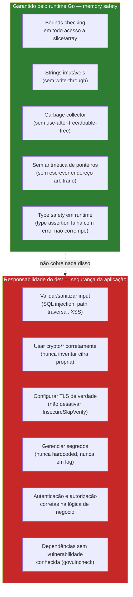

# Segurança em Go — o panorama

> [!abstract] TL;DR
> Go elimina de graça uma classe inteira de vulnerabilidades que dominou décadas de CVEs em C/C++: **buffer overflow clássico** não existe, porque todo acesso a slice/array é checado em runtime (`panic` em vez de sobrescrever memória vizinha). Strings são **imutáveis**, o coletor de lixo elimina *use-after-free* e *double-free*, e não há aritmética de ponteiros. Isso é *memory safety*, não *segurança da aplicação* — Go não te protege de SQL injection, path traversal, deserialização insegura, segredos hardcoded ou lógica de autorização furada. O runtime cuida da memória; o resto — validação de input, uso correto de `crypto/*`, gestão de segredos, TLS bem configurado — continua 100% responsabilidade do dev, e é o que o resto deste galho cobre nota a nota.

## O CVE que Go não deixa você escrever

Em 2014, o bug Heartbleed vazou memória privada de servidores TLS pelo mundo inteiro — a causa raiz era um *buffer over-read* em C: o código do OpenSSL confiava num campo de tamanho enviado pelo cliente sem checar contra o buffer real, e lia além do que devia. Não foi um bug exótico. Foi a mesma família de erro que produziu Morris Worm (1988), boa parte dos exploits de Windows dos anos 2000, e uma fração enorme da CVE database até hoje: **o programa acessa memória fora dos limites que ele mesmo alocou**.

Tente reproduzir esse tipo de bug em Go:

```go
buf := make([]byte, 4)
buf[10] = 1 // ???
```

Isso não compila silenciosamente escrevendo lixo na memória adjacente — o programa **entra em pânico** (`panic: runtime error: index out of range [10] with length 4`) e para ali, imediatamente, antes de tocar em um único byte fora do slice. Não é sorte, nem uma verificação que alguém lembrou de adicionar: é o comportamento garantido pela especificação da linguagem para **todo** acesso indexado, sempre.

A pergunta natural, vindo de C ou C++, é: isso não custa caro, checar limites toda vez? Custa — mas é um custo que o time de design do Go decidiu pagar deliberadamente, porque o preço da alternativa (memória corrompida silenciosamente, exploitável por um atacante) é ordens de grandeza maior. E o compilador ainda consegue eliminar boa parte dessas checagens via *bounds check elimination* quando prova estaticamente que o índice é seguro — então o custo real, na prática, costuma ser bem menor do que a intuição sugere.

## O que o runtime garante — e o que ele não garante



A distinção que este panorama existe para cravar: **memory safety** é uma propriedade da linguagem e do runtime — algo que Go garante estruturalmente, sem esforço extra do dev, para todo programa que compila. **Segurança da aplicação** é uma propriedade do que você constrói em cima — depende inteiramente das decisões que você toma linha a linha. Go zera a primeira categoria quase por completo (com uma ressalva: pacotes que usam `unsafe` ou `cgo` reabrem essa porta deliberadamente, fora do escopo desta nota). A segunda categoria, Go não zera nada — só te dá ferramentas melhores ou piores pra lidar com ela, que é justamente o assunto das próximas sete notas deste galho.

## Memory safety em detalhe: os quatro pilares

**1. Bounds checking automático.** Já visto acima — todo `slice[i]`, toda operação de `append` que estoura capacidade, toda leitura de array checa limites em runtime. Não existe um "modo unsafe" ligado por padrão como em C; para desligar essa proteção você precisa importar `unsafe` explicitamente, e isso é sempre um sinal visual de alerta em code review.

**2. Strings imutáveis.** Uma `string` em Go, uma vez criada, nunca muda de conteúdo. Não existe `s[0] = 'X'` — o compilador rejeita com `cannot assign to s[0] (neither addressable nor a map index expression)`. Qualquer "modificação" de string na verdade cria uma string nova:

```go
s := "hello"
// s[0] = 'H' // não compila

b := []byte(s) // converte para slice de bytes (mutável, é uma cópia)
b[0] = 'H'
s2 := string(b) // "Hello" — string nova, s original intocado
fmt.Println(s, s2) // hello Hello
```

Isso elimina uma categoria específica de bug: código que passa uma string para uma função e depois é surpreendido porque a função mutou o conteúdo por trás. Em C, uma `char*` é só um ponteiro para memória mutável — nada impede um `strcpy` mal calculado de estourar o buffer de destino. Em Go, `string` é, por construção, somente-leitura; a única forma de "escrever" é criar algo novo.

> [!info] Detalhe de implementação: `string` por baixo é um ponteiro + tamanho
> Uma string Go é internamente um par (ponteiro para os bytes, comprimento) — como um slice, mas sem capacidade separada e sem permissão de escrita através dele. Fatiar uma string (`s[2:5]`) não copia bytes: cria um novo par ponteiro+tamanho apontando pro meio do array original. Isso é rápido, mas tem uma pegadinha de memória: manter um substring pequeno de uma string gigante pode reter o array gigante inteiro na memória, porque o GC não sabe que só um pedaço é usado. É a mesma pegadinha que existe com *slicing* de slices — assunto que a trilha de fundamentos de Go já cobriu.

**3. Coletor de lixo elimina use-after-free e double-free.** Em C, `free(ptr)` seguido de outro acesso a `ptr` (*use-after-free*) ou de um segundo `free(ptr)` (*double-free*) são bugs de memória clássicos, e ambos são exploráveis — o atacante consegue, em muitos casos, transformar isso em execução de código arbitrário. Go não tem `free`. O GC rastreia referências vivas e só recicla memória quando prova que nada mais aponta pra ela. Não há como um `*Point` continuar "vivo" na sua variável enquanto o objeto que ele referenciava já foi liberado — se a variável existe, o GC garante que o que ela aponta ainda existe.

**4. Sem aritmética de ponteiros.** Em C, `ptr + 1` avança o ponteiro para o próximo elemento — e nada impede `ptr + 1000` apontar para memória completamente alheia, que o programa então lê ou escreve como se fosse dele. Go não permite essa operação em ponteiros comuns: `*Point + 1` é erro de compilação. Um `*Point` só pode apontar para o `Point` de onde veio (ou `nil`) — não existe deslocamento manual de endereço. A única fresta é o pacote `unsafe`, cujo próprio nome já avisa: sair dele é sair da garantia.

## Casos práticos: onde a garantia acaba

**Caso 1 — index out of range é `panic`, não corrupção silenciosa:**

```go
package main

import "fmt"

func acessar(nums []int, i int) (result int, err error) {
    defer func() {
        if r := recover(); r != nil {
            err = fmt.Errorf("acesso inválido: %v", r)
        }
    }()
    return nums[i], nil
}

func main() {
    nums := []int{1, 2, 3}
    v, err := acessar(nums, 10)
    fmt.Println(v, err) // 0 acesso inválido: runtime error: index out of range [10] with length 3
}
```

O `panic` é recuperável com `recover()` — mas repare que o programa nunca chega perto de ler ou escrever memória fora do slice. O pior caso é o processo terminar (se ninguém der `recover`), não memória corrompida silenciosamente que um atacante consiga controlar.

**Caso 2 — imutabilidade de string evita um bug clássico de aliasing:**

```go
package main

import "fmt"

func processar(token string) string {
    // qualquer coisa que "processar" fizer com token,
    // o chamador tem garantia de que o valor original não muda
    return token + "-processado"
}

func main() {
    original := "segredo-123"
    resultado := processar(original)
    fmt.Println(original)  // segredo-123 — imutável, garantido
    fmt.Println(resultado) // segredo-123-processado
}
```

Em linguagens com strings mutáveis (buffers de char em C, por exemplo), passar um "segredo" para uma função exige disciplina manual para garantir que a função não o altere por engano ou por má-fé. Em Go, essa garantia vem da linguagem — não é boa prática, é impossível fazer diferente.

**Caso 3 — `unsafe` existe, e é a fresta deliberada:**

```go
package main

import (
    "fmt"
    "unsafe"
)

func main() {
    x := 42
    p := unsafe.Pointer(&x)
    // a partir daqui, você está fora das garantias de memory safety do Go
    y := (*int)(p)
    fmt.Println(*y) // 42
}
```

> [!warning] `unsafe` e `cgo` reabrem tudo que este panorama descreveu
> O nome do pacote não é ironia. `unsafe.Pointer` permite conversões de tipo de ponteiro que o compilador normalmente rejeita, e código que usa `cgo` para chamar C está, por definição, chamando código sem as garantias de memory safety do Go. Nenhum dos dois é proibido — `unsafe` sustenta partes legítimas da stdlib (encoding binário de baixo nível, por exemplo) — mas ambos são sinais que merecem escrutínio extra em code review, porque é exatamente ali que os bugs de memória clássicos voltam a ser possíveis.

## Armadilhas comuns

> [!warning] "Go é seguro" não significa "minha aplicação é segura"
> É o mal-entendido mais caro deste panorama inteiro. Memory safety fecha uma porta enorme (a família de bugs que produziu Heartbleed, boa parte dos exploits de C/C++ históricos), mas deixa todas as outras completamente abertas: SQL injection por concatenar string em vez de usar `?` parametrizado, path traversal por não validar `..` num nome de arquivo recebido do usuário, segredo hardcoded no código-fonte, TLS mal configurado, dependência com CVE conhecida. Nenhuma dessas categorias tem relação com memory safety — e todas elas são tão comuns em Go quanto em qualquer outra linguagem, porque são erros de lógica de aplicação, não de gerência de memória.

> [!warning] `recover()` esconde o `panic`, não conserta a causa
> É tentador tratar todo `index out of range` com um `recover()` genérico e seguir em frente como se nada tivesse acontecido. Isso evita o crash, mas se o índice inválido veio de um cálculo errado (um índice negativo por overflow, por exemplo), a causa raiz continua lá — só não derruba mais o processo. Trate `recover()` como rede de segurança de último recurso (em servidores HTTP, por exemplo, para não derrubar todas as goroutines por causa de uma requisição malformada), não como substituto de validar o índice antes de usar.

> [!warning] Concorrência não é coberta por memory safety
> O `panic` em bounds checking não te protege de *data races* — duas goroutines lendo e escrevendo a mesma variável sem sincronização. Isso é *outra* categoria de bug, real e comum em Go, detectável com `go test -race`, mas fora do escopo desta nota (é assunto do galho de concorrência da trilha de fundamentos).

## Vindo de outras linguagens

| Linguagem | Memory safety | O que muda em Go |
|---|---|---|
| C / C++ | Nenhuma por padrão — `malloc`/`free` manuais, ponteiros irrestritos | Go elimina buffer overflow, use-after-free, double-free, aritmética de ponteiros — de graça, sem esforço |
| Java | GC + bounds checking, mas com `ArrayIndexOutOfBoundsException` como *exception* recuperável em qualquer ponto | Go usa `panic`/`recover`, mecanismo mais restrito e explícito — não há hierarquia de exceptions para capturar tipos específicos |
| Python | GC + bounds checking, strings imutáveis (igual Go) | Terreno bem familiar — a diferença real está em performance e em Python permitir `ctypes` com facilidade equivalente ao `unsafe` de Go |
| Node/JS | GC, mas arrays têm bounds checking "silencioso" (`arr[10]` retorna `undefined`, não erro) | Go é mais estrito: acesso fora do limite é `panic`, não um valor "vazio" que pode se propagar silenciosamente pelo programa |

## Como explicar em inglês

> Go's runtime guarantees memory safety by construction: every slice or array access is bounds-checked, so there's no classic buffer overflow — an out-of-bounds access triggers a recoverable `panic` instead of corrupting adjacent memory. Strings are immutable, the garbage collector rules out use-after-free and double-free, and there's no pointer arithmetic outside the `unsafe` package. This closes an entire historical class of vulnerabilities — the kind that produced bugs like Heartbleed in C. What it does *not* do is protect your application logic: SQL injection, path traversal, hardcoded secrets, misconfigured TLS, and vulnerable dependencies are all just as possible in Go as in any other language, because they're application-level mistakes, not memory-management ones. Memory safety is the runtime's job; everything else in this note's series — the standard crypto library, TLS configuration, input validation, secrets management, and dependency scanning — remains squarely the developer's responsibility.

| Termo PT | Termo EN |
|---|---|
| segurança de memória | memory safety |
| estouro de buffer | buffer overflow |
| checagem de limites | bounds checking |
| usar após liberar | use-after-free |
| liberação dupla | double-free |
| aritmética de ponteiros | pointer arithmetic |
| imutável | immutable |
| coletor de lixo | garbage collector |
| condição de corrida (dados) | data race |
| superfície de ataque | attack surface |

## O que vem a seguir

Memory safety é o piso — garantido, gratuito, e fora do seu controle (no bom sentido). A partir daqui, tudo é escolha do dev: a [[02 - crypto na stdlib|próxima nota]] entra na `crypto/*` da standard library — hashing, HMAC, cifra simétrica/assimétrica — e no primeiro erro comum de quem chega em Go vindo de outra stack: tentar inventar a própria primitiva criptográfica em vez de usar o que a stdlib já oferece, testado e revisado.

## Veja também

- [[02 - crypto na stdlib]] — próxima nota do galho
- [[03 - TLS em Go]]
- [[04 - Validação e sanitização de input]]
- [[05 - govulncheck e supply chain]]
- [[06 - Secrets e configuração segura]]
- [[07 - Secure coding patterns]]
- [[08 - AuthN e AuthZ em serviços Go]]
- [[03-Dominios/Tecnologia/Go/index|Trilha Go]]

## Fontes

- The Go Authors. *The Go Programming Language Specification — Index expressions*. go.dev. https://go.dev/ref/spec#Index_expressions (acessado em 2026-07-18)
- The Go Authors. *Effective Go — Strings*. go.dev. https://go.dev/doc/effective_go#strings (acessado em 2026-07-18)
- The Go Authors. *Package unsafe*. pkg.go.dev. https://pkg.go.dev/unsafe (acessado em 2026-07-18)
- The Go Authors. *A Tour of Go — Panic*. go.dev. https://go.dev/tour/methods/17 (acessado em 2026-07-18)
- Go by Example. *Panic*. gobyexample.com. https://gobyexample.com/panic (acessado em 2026-07-18)
- The Go Authors. *Go Wiki: Go Security Overview*. go.dev. https://go.dev/wiki/security-overview (acessado em 2026-07-18)
