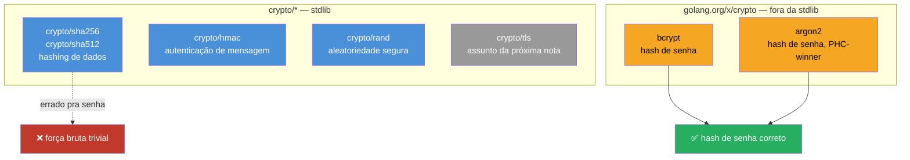
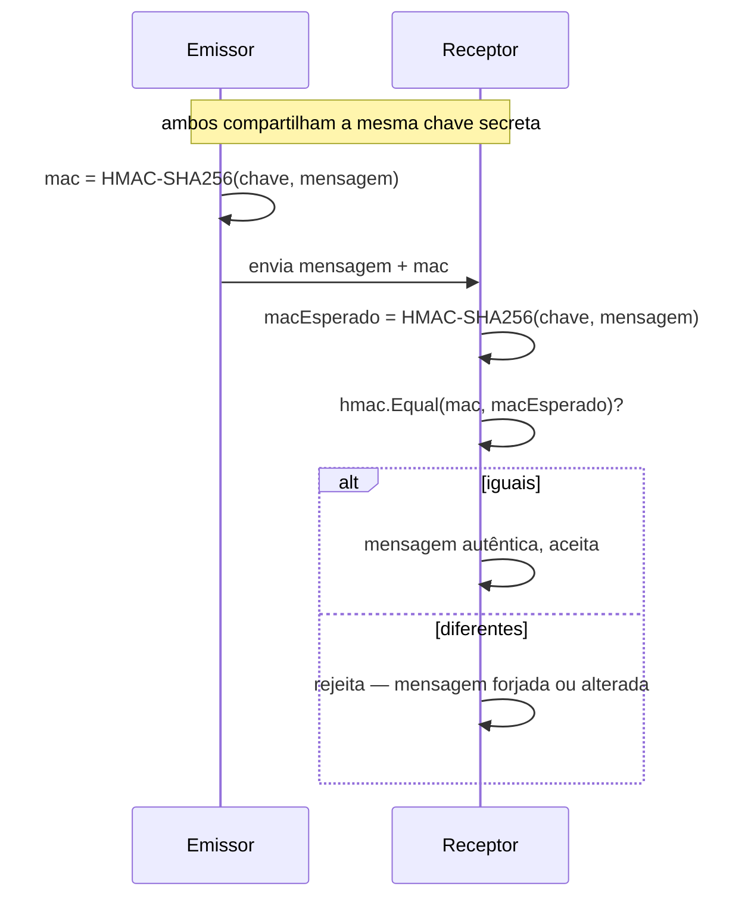

# crypto na stdlib

> [!abstract] TL;DR
> A stdlib de Go traz um pacote `crypto` guarda-chuva com implementações prontas — `crypto/sha256`, `crypto/hmac`, `crypto/rand` — para hashing, autenticação de mensagens e números aleatórios seguros. O que ela **não** traz é uma função de hash de senha adequada: `sha256.Sum256(senha)` é rápido demais e vira alvo fácil de força bruta em GPU. Para senhas, a ferramenta certa mora em `golang.org/x/crypto`, no pacote `bcrypt` (padrão de mercado, simples) ou `argon2` (vencedor da Password Hashing Competition, mais configurável). A regra que amarra tudo isto: **nunca implemente sua própria primitiva criptográfica** — escolha a função certa entre as que já existem, prontas e revisadas por especialistas.

## O problema: hash não é hash

Se você vem de uma linguagem qualquer e já ouviu "nunca guarde senha em texto plano, guarde o hash", a tentação natural é abrir `crypto/sha256`, chamar `Sum256` na senha e seguir em frente:

```go
package main

import (
    "crypto/sha256"
    "fmt"
)

func main() {
    senha := "minhaSenh4123"
    hash := sha256.Sum256([]byte(senha))
    fmt.Printf("%x\n", hash) // 64 caracteres hex
}
```

Compila, roda, produz um hash de aparência convincente. E é exatamente o tipo de erro que um consultor de sistemas legados encontra em produção com uma frequência desanimadora: **SHA-256 foi desenhado para ser rápido**, não para proteger senha. Rápido é ótimo para verificar integridade de um arquivo de 2 GB; é péssimo para senha, porque "rápido" também significa "barato de testar bilhões de vezes por segundo numa GPU". Uma senha de dicionário comum cai em minutos contra SHA-256 puro — o hash correto, cadastrado, sem colisão nenhuma, só que testado 10 bilhões de vezes por segundo até acertar.

A lição por trás disso é mais ampla que senha: **cada operação criptográfica tem uma primitiva própria**, escolhida a dedo pelos criptógrafos para as propriedades daquele problema específico. Hash de senha precisa ser **lento e caro de memória, de propósito** (para tornar força bruta cara). Hash de integridade de arquivo precisa ser **rápido**. Autenticação de mensagem precisa resistir a *timing attacks*. Confundir as três — usar a ferramenta errada porque "ei, todas fazem hash" — é a fonte mais comum de vulnerabilidade criptográfica em código de aplicação.

## O panorama de `crypto/*`



Repare na fronteira: tudo que fica embaixo de `crypto/` na stdlib é primitiva **genérica** — hash, MAC, aleatoriedade, TLS. Hash de senha propositalmente **não está na stdlib**. Isso não é descuido dos mantenedores — é uma escolha deliberada, porque algoritmos de hash de senha evoluem (o padrão de mercado de 2010 não é o de hoje) e a equipe do Go prefere manter esse território em `x/crypto`, onde pode iterar sem o compromisso de compatibilidade eterna que a stdlib carrega. `crypto/tls`, o outro morador de peso deste pacote, fica reservado para a [[03 - TLS em Go|próxima nota]] — aqui o foco é hashing, HMAC e senha.

## Hashing com `crypto/sha256`

Para o que SHA-256 *é* bom — verificar integridade, gerar identificadores determinísticos, compor outras primitivas — o uso é direto:

```go
package main

import (
    "crypto/sha256"
    "fmt"
)

func main() {
    dados := []byte("conteúdo de um arquivo, por exemplo")

    // Sum256 retorna [32]byte — um array de tamanho fixo, não slice
    soma := sha256.Sum256(dados)
    fmt.Printf("%x\n", soma)

    // Para streaming (arquivo grande, sem carregar tudo em memória):
    h := sha256.New()
    h.Write(dados)
    h.Write([]byte(" — mais dados, em outro Write"))
    fmt.Printf("%x\n", h.Sum(nil))
}
```

`sha256.New()` retorna um `hash.Hash` — uma interface da stdlib (`io.Writer` mais `Sum`/`Reset`/`Size`) que todo pacote de hash em `crypto/*` implementa. É por isso que trocar de `sha256` para `sha512` no código acima é, na prática, trocar só o pacote importado: a forma de uso (`New`, `Write`, `Sum`) é idêntica, porque o design do pacote foi pensado para ser plugável.

> [!info] SHA-1 e MD5 estão na stdlib, mas são armadilha
> `crypto/md5` e `crypto/sha1` existem e compilam sem aviso nenhum — mas ambos têm colisões conhecidas e publicadas (MD5 desde 2004, SHA-1 desde 2017, com o ataque [SHAttered](https://shattered.io/) do Google/CWI). Use-os apenas para compatibilidade com sistema legado que já os exige (checksum de protocolo antigo, por exemplo) — nunca para nada com implicação de segurança. Para hash novo, `sha256` é o piso mínimo razoável hoje.

## HMAC: autenticar, não só hashear

Hash sozinho responde "os dados mudaram?". Mas não responde "quem gerou esse hash?" — qualquer um com acesso aos dados recalcula o mesmo SHA-256, então um hash puro não prova autoria. Isso importa sempre que você precisa verificar que uma mensagem — um webhook recebido, um token assinado, um cookie — veio de quem diz ter vindo, e não foi forjada por um atacante que só observou o tráfego.

**HMAC** (*Hash-based Message Authentication Code*) resolve isso combinando o hash com uma chave secreta compartilhada: só quem tem a chave consegue gerar (ou verificar) o MAC correto.



```go
package main

import (
    "crypto/hmac"
    "crypto/sha256"
    "encoding/hex"
    "fmt"
)

var chaveSecreta = []byte("chave-compartilhada-fora-do-codigo")

func assinar(mensagem []byte) string {
    mac := hmac.New(sha256.New, chaveSecreta)
    mac.Write(mensagem)
    return hex.EncodeToString(mac.Sum(nil))
}

func verificar(mensagem []byte, macRecebidoHex string) bool {
    macEsperado := assinar(mensagem)

    // NUNCA compare com == — abre timing attack (ver armadilha abaixo)
    return hmac.Equal([]byte(macEsperado), []byte(macRecebidoHex))
}

func main() {
    payload := []byte(`{"evento":"pagamento_confirmado","id":42}`)

    assinatura := assinar(payload)
    fmt.Println("assinatura:", assinatura)

    fmt.Println("válido:", verificar(payload, assinatura))
    fmt.Println("válido (adulterado):", verificar([]byte(`{"evento":"pagamento_confirmado","id":99}`), assinatura))
}
```

`hmac.New(sha256.New, chaveSecreta)` recebe uma **função construtora** de hash (`sha256.New`, sem chamar) mais a chave — é assim que o mesmo `crypto/hmac` funciona com qualquer hash da stdlib, não só SHA-256. É o padrão de webhook do GitHub, Stripe e praticamente todo serviço que assina payloads HTTP: o cabeçalho `X-Hub-Signature-256` que você valida ao receber um webhook é, por baixo, exatamente este HMAC-SHA256.

> [!warning] `hmac.Equal`, nunca `==` ou `bytes.Equal`
> Comparar dois `[]byte` com `==` não compila (slice não é comparável) — mas `bytes.Equal` compila e parece razoável. O problema é que `bytes.Equal` (e `==` em arrays) para na **primeira diferença**, o que vaza timing: um atacante mede quanto tempo a comparação leva e infere, byte a byte, o MAC correto. `hmac.Equal` faz comparação em **tempo constante** — sempre percorre o array inteiro, independente de onde a diferença está — justamente para fechar esse canal lateral. A regra vale para qualquer comparação de segredo (token, MAC, hash de senha): tempo constante ou nada.

## Senhas: nem SHA-256, nem HMAC — bcrypt ou argon2

Chegamos ao ponto que abriu a nota. Nem hash simples nem HMAC resolvem o problema de senha, porque ambos são **rápidos demais**. O que se quer é o oposto: uma função **deliberadamente lenta e cara de memória**, para que testar bilhões de senhas candidatas fique caro demais para valer a pena — mesmo que o atacante roube o banco de dados inteiro de hashes.

Essa família de algoritmos vive fora da stdlib, em `golang.org/x/crypto` — o "extended standard library" mantido pela mesma equipe do Go, só que com ciclo de release independente.

```bash
go get golang.org/x/crypto/bcrypt
go get golang.org/x/crypto/argon2
```

### bcrypt: o padrão de facto, simples de usar

```go
package main

import (
    "fmt"
    "log"

    "golang.org/x/crypto/bcrypt"
)

func hashSenha(senha string) (string, error) {
    // custo 12 é um bom piso em 2026 — ajuste pra ~250ms na sua máquina de produção
    hash, err := bcrypt.GenerateFromPassword([]byte(senha), 12)
    if err != nil {
        return "", fmt.Errorf("gerar hash: %w", err)
    }
    return string(hash), nil
}

func verificarSenha(senha, hashArmazenado string) bool {
    err := bcrypt.CompareHashAndPassword([]byte(hashArmazenado), []byte(senha))
    return err == nil
}

func main() {
    hash, err := hashSenha("s3nh4-forte-do-usuario")
    if err != nil {
        log.Fatal(err)
    }
    fmt.Println(hash) // ex: $2a$12$N9qo8uLOickgx2ZMRZoMy...

    fmt.Println(verificarSenha("s3nh4-forte-do-usuario", hash)) // true
    fmt.Println(verificarSenha("senha-errada", hash))           // false
}
```

Dois detalhes que fazem bcrypt ser uma API deliberadamente difícil de usar errado:

1. O **salt vai embutido no próprio hash resultante** — `GenerateFromPassword` gera um salt aleatório automaticamente e o codifica junto na string de saída (`$2a$12$...`). Você nunca gerencia salt à mão, então não tem como esquecer de usar um ou reutilizar o mesmo salt para senhas diferentes (erro clássico de implementações caseiras).
2. `CompareHashAndPassword` — não `GenerateFromPassword` de novo e comparação de string — é a forma correta de verificar login. Ela extrai o salt do hash armazenado, recalcula, e compara em tempo constante por dentro. Reimplementar essa comparação manualmente é o tipo exato de "rolar sua própria cripto" que a próxima seção proíbe.

### argon2: mais configurável, vencedor da Password Hashing Competition

`argon2` (especificamente `argon2id`, a variante recomendada) ganhou a [Password Hashing Competition](https://www.password-hashing.competition/) de 2015 e é hoje a recomendação da [OWASP](https://cheatsheetseries.owasp.org/cheatsheets/Password_Storage_Cheat_Sheet.html) quando você pode configurar parâmetros de memória, não só de tempo:

```go
package main

import (
    "crypto/rand"
    "crypto/subtle"
    "encoding/base64"
    "fmt"

    "golang.org/x/crypto/argon2"
)

// Parâmetros recomendados pela OWASP como piso — ajuste ao hardware disponível
const (
    argonTime    = 1
    argonMemory  = 64 * 1024 // 64 MB
    argonThreads = 4
    argonKeyLen  = 32
)

func hashSenhaArgon2(senha string) (hash, salt []byte, err error) {
    salt = make([]byte, 16)
    if _, err := rand.Read(salt); err != nil { // crypto/rand, nunca math/rand
        return nil, nil, fmt.Errorf("gerar salt: %w", err)
    }

    hash = argon2.IDKey([]byte(senha), salt, argonTime, argonMemory, argonThreads, argonKeyLen)
    return hash, salt, nil
}

func verificarSenhaArgon2(senha string, hashArmazenado, salt []byte) bool {
    candidato := argon2.IDKey([]byte(senha), salt, argonTime, argonMemory, argonThreads, argonKeyLen)
    return subtle.ConstantTimeCompare(candidato, hashArmazenado) == 1
}

func main() {
    hash, salt, err := hashSenhaArgon2("s3nh4-forte-do-usuario")
    if err != nil {
        panic(err)
    }

    fmt.Println("hash (b64):", base64.StdEncoding.EncodeToString(hash))
    fmt.Println("válido:", verificarSenhaArgon2("s3nh4-forte-do-usuario", hash, salt))
}
```

Diferente de bcrypt, `argon2.IDKey` **não** embute salt no retorno nem faz comparação por você — você gerencia salt (com `crypto/rand`, nunca `math/rand`) e compara com `subtle.ConstantTimeCompare` manualmente. Mais trabalho, mais controle: útil quando a política de segurança exige ajustar o consumo de memória (para resistir a ataques com hardware especializado tipo GPU/ASIC, que bcrypt limita menos bem que argon2).

| | bcrypt | argon2id |
|---|---|---|
| Onde | `golang.org/x/crypto/bcrypt` | `golang.org/x/crypto/argon2` |
| Salt | embutido automaticamente | você gerencia |
| Comparação | `CompareHashAndPassword` pronta | `subtle.ConstantTimeCompare` manual |
| Custo ajustável | só tempo (`cost`) | tempo + memória + paralelismo |
| Quando escolher | caso comum, API mais simples | quando resistência a GPU/ASIC importa mais, ou compliance exige (PHC winner) |

> [!warning] `math/rand` para salt, chave ou token é vulnerabilidade
> `math/rand` gera números **pseudoaleatórios previsíveis** — ótimo para embaralhar uma lista de cartas num jogo, catastrófico para gerar salt, chave de sessão ou token de reset de senha. Com a semente (ou até só observando saídas suficientes), um atacante reconstrói a sequência inteira. `crypto/rand` lê do gerador de aleatoriedade do sistema operacional (`/dev/urandom` no Linux, CryptGenRandom no Windows) — é a única fonte aceitável para qualquer coisa com implicação de segurança. Desde o Go 1.20, `math/rand` até auto-semeia com uma fonte seguraaleatória por padrão (antes exigia `rand.Seed` manual), mas isso resolve só o problema de "toda execução gera a mesma sequência" — continua sendo criptograficamente inadequado para segredos.

## A regra de ouro: nunca role sua própria cripto

*"Don't roll your own crypto"* é o mantra mais repetido — e mais frequentemente ignorado — da segurança de aplicação. Não é elitismo de criptógrafo: é que projetar uma primitiva criptográfica nova, ou até combinar primitivas existentes de um jeito não revisado, produz vulnerabilidades sutis demais para um code review normal pegar. A lista de formas conhecidas de errar isso é longa e cheia de nomes de ataques reais:

- **Implementar seu próprio hash de senha** ("vou fazer SHA-256 três vezes seguidas, deve ficar lento o suficiente") — não fica; e mesmo que ficasse, perde as proteções de salt/timing que bcrypt/argon2 já resolveram.
- **Combinar criptografia e MAC na ordem errada** (encrypt-and-MAC em vez de encrypt-then-MAC) abre padding oracle attacks — a razão pela qual pacotes prontos como `crypto/cipher` com AEAD (`crypto/aes` + GCM) existem: fazem a ordem certa por você.
- **Comparar segredos com `==`** (visto acima com HMAC) vaza informação por timing.
- **Gerar "aleatoriedade" com `time.Now().UnixNano()`** como semente — previsível o suficiente para um atacante motivado reconstruir.

A alternativa correta, em toda essa lista, é sempre a mesma: **use a primitiva certa da stdlib ou de `x/crypto`, na forma que a documentação recomenda, sem desviar do caminho batido**. Isso vale mesmo — especialmente — quando a solução caseira parece mais simples de entender. Simplicidade de leitura não é a métrica que importa em cripto; resistência a décadas de criptoanálise adversarial é.

> [!question]- Por que confiar mais em `bcrypt.GenerateFromPassword` do que em código que eu mesmo entendo linha a linha?
> Porque a garantia de segurança de uma primitiva criptográfica não vem de você entender o código — vem de milhares de criptógrafos e atacantes terem tentado quebrá-la, publicamente, por anos, sem sucesso. `bcrypt` existe desde 1999, foi apresentado na USENIX, e segue sendo escrutinado. Seu código caseiro de três linhas nunca passou por esse processo — por mais que você entenda cada linha, ninguém verificou se a combinação resiste a um atacante motivado. "Eu entendo como funciona" e "isso é seguro" são afirmações completamente diferentes em criptografia.

## Vindo de outras linguagens

| Linguagem | Hash de senha idiomático | Observação |
|---|---|---|
| Java | `BCryptPasswordEncoder` (Spring Security) ou `Argon2PasswordEncoder` | Mesma dupla bcrypt/argon2; Spring Security escolhe por você se não configurar |
| Python | `bcrypt` (PyPI) ou `passlib` | `hashlib.sha256` para senha é o mesmo erro comum visto aqui |
| Node.js | pacote `bcrypt` ou `argon2` (npm) | `crypto.createHash('sha256')` do módulo nativo tem o mesmo problema — rápido demais para senha |

O padrão se repete em toda linguagem madura: a stdlib/runtime oferece hash genérico rápido, e uma biblioteca separada (às vezes de terceiros, às vezes semi-oficial) oferece a função lenta específica para senha. Go não é exceção — só é mais explícito sobre a fronteira, porque `x/crypto` é um repositório visivelmente separado da stdlib, em vez de mais um pacote instalável do mesmo jeito que qualquer dependência de terceiros.

## Como explicar em inglês

> Go's standard library ships `crypto/sha256`, `crypto/hmac`, and `crypto/rand` for hashing, message authentication, and secure randomness — but deliberately does **not** ship a password-hashing function. `sha256.Sum256` is fast by design, which makes it a poor fit for passwords: fast hashing means cheap brute-forcing. The right tools for passwords live in `golang.org/x/crypto` — `bcrypt`, the de facto standard with a simple API that embeds its own salt, or `argon2id`, the Password Hashing Competition winner, more configurable but requiring manual salt management and constant-time comparison via `crypto/subtle`. The overarching rule is the classic one: never roll your own crypto — always reach for a vetted primitive, used exactly as documented, rather than composing your own from scratch.

| Termo PT | Termo EN |
|---|---|
| hash de senha | password hashing |
| sal / salgar | salt / salting |
| comparação em tempo constante | constant-time comparison |
| autenticação de mensagem | message authentication |
| aleatoriedade criptograficamente segura | cryptographically secure randomness |
| ataque de canal lateral (temporização) | timing attack / side-channel attack |
| força bruta | brute force |
| primitiva criptográfica | cryptographic primitive |

## O que vem a seguir

`crypto/hmac` e `crypto/sha256` resolvem integridade e autenticação de dados em repouso ou em trânsito por canal já estabelecido — mas não resolvem o problema de **estabelecer** um canal seguro com alguém do outro lado da rede, sem que um atacante no meio consiga ler ou adulterar o tráfego. Esse é o trabalho de `crypto/tls`, e é dele que a [[03 - TLS em Go|próxima nota]] trata: handshake, certificados, `tls.Config` e as armadilhas mais comuns de configurar TLS em Go — incluindo a diferença entre o TLS terminado dentro do processo Go e o TLS terminado no load balancer, que volta a aparecer quando este galho cruzar com o Galho 18 de deploy.

## Veja também

- [[01 - Segurança em Go — o panorama|01 — Segurança em Go — o panorama]] — visão geral do galho, ponto de entrada
- [[03 - TLS em Go|03 — TLS em Go]] — próxima nota: `crypto/tls`, handshake e certificados
- [[04 - Validação e sanitização de input|04 — Validação e sanitização de input]] — outra frente de secure coding, complementar a esta
- [[06 - Secrets e configuração segura|06 — Secrets e configuração segura]] — onde a chave HMAC/o segredo de assinatura desta nota deveria efetivamente morar
- [[03-Dominios/Tecnologia/Go/index|Trilha Go]]

## Fontes

- The Go Authors. *Package crypto/hmac*. pkg.go.dev. https://pkg.go.dev/crypto/hmac (acessado em 2026-07-18)
- The Go Authors. *Package crypto/sha256*. pkg.go.dev. https://pkg.go.dev/crypto/sha256 (acessado em 2026-07-18)
- The Go Authors. *Package crypto/rand*. pkg.go.dev. https://pkg.go.dev/crypto/rand (acessado em 2026-07-18)
- The Go Authors. *Package bcrypt — golang.org/x/crypto*. pkg.go.dev. https://pkg.go.dev/golang.org/x/crypto/bcrypt (acessado em 2026-07-18)
- The Go Authors. *Package argon2 — golang.org/x/crypto*. pkg.go.dev. https://pkg.go.dev/golang.org/x/crypto/argon2 (acessado em 2026-07-18)
- OWASP Foundation. *Password Storage Cheat Sheet*. cheatsheetseries.owasp.org. https://cheatsheetseries.owasp.org/cheatsheets/Password_Storage_Cheat_Sheet.html (acessado em 2026-07-18)
