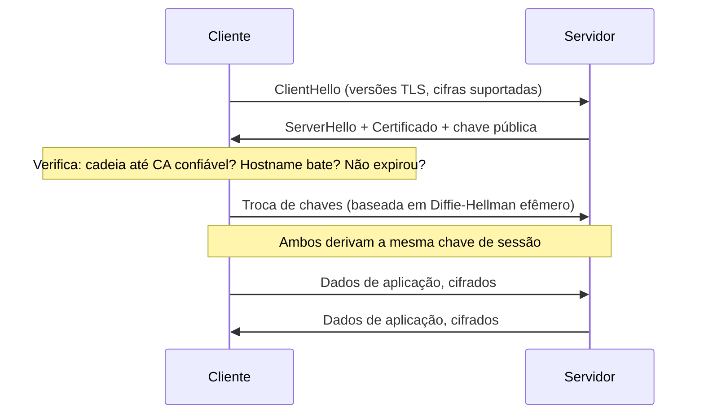
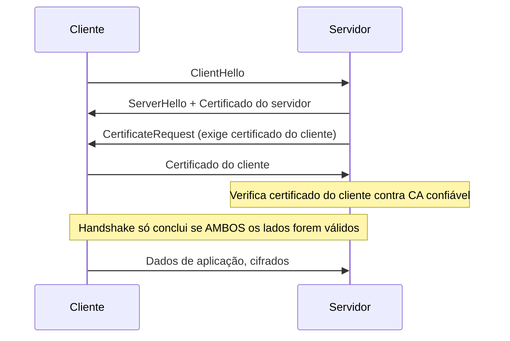

# TLS em Go

> [!abstract] TL;DR
> `net/http` fala HTTPS de graça — `http.ListenAndServeTLS(":443", "cert.pem", "key.pem", handler)` sobe um servidor TLS em uma linha. Por baixo, quem faz o trabalho pesado é o pacote `crypto/tls`: handshake, cifras, verificação de cadeia de certificados. O perigo não está em ligar TLS — está em **desligar partes dele sem perceber**: `InsecureSkipVerify: true` num `tls.Config` parece um atalho de desenvolvimento inofensivo e é, na prática, a forma mais comum de anular TLS inteiro em produção, porque desativa a verificação do certificado do outro lado. Este capítulo cobre `crypto/tls` na prática — servidor e cliente HTTPS, como a verificação de certificado realmente funciona, mTLS em visão geral, e a receita de um `tls.Config` correto para produção.

## O cadeado que ninguém olha de perto

Todo backend Go que fala HTTP externamente cedo ou tarde precisa falar **HTTPS** — seja servindo uma API pública, seja como cliente consumindo uma API de terceiros. A tentação é tratar isso como responsabilidade de infraestrutura: "o load balancer termina TLS, meu código Go só ouve HTTP puro atrás dele". Isso é verdade em boa parte dos deploys modernos — mas não sempre, e mesmo quando é verdade, **o lado cliente continua sendo seu**: toda vez que seu serviço Go chama outro serviço via `https://`, é o seu `http.Client` (e o `crypto/tls` por trás dele) que decide se aquele certificado é confiável.

E aqui mora o problema real: o Go padrão, sem nenhuma configuração especial, já verifica certificados corretamente. O jeito mais comum de introduzir uma vulnerabilidade de TLS em Go não é esquecer de configurar nada — é **configurar demais**, geralmente copiando um `tls.Config{InsecureSkipVerify: true}` de um Stack Overflow antigo para "resolver" um erro de certificado em desenvolvimento, e esse `Config` sobrevive até produção. A partir daqui, o objetivo é entender o suficiente de `crypto/tls` para nunca precisar desse atalho.

## O handshake, em visão de voo de pássaro

Antes de qualquer dado de aplicação trafegar, cliente e servidor negociam uma sessão segura — o **handshake TLS**. A versão simplificada, o suficiente para entender o que `crypto/tls` está fazendo por você:



Três coisas acontecem nesse handshake que qualquer dev Go precisa saber existir, mesmo sem implementar nenhuma delas manualmente:

1. **Negociação de versão e cifra** — cliente e servidor concordam em qual versão de TLS usar (Go 1.23+ recusa SSLv3 e TLS 1.0/1.1 por padrão no cliente; o mínimo padrão é TLS 1.2) e qual conjunto de algoritmos criptográficos ("cipher suite") vai proteger a sessão.
2. **Verificação de certificado** — o cliente confere se o certificado apresentado pelo servidor foi emitido por uma autoridade certificadora (CA) em que ele confia, se não expirou, e se o hostname da conexão bate com o que o certificado declara. É esta etapa, e só ela, que `InsecureSkipVerify` desliga.
3. **Derivação de chave de sessão** — usando troca de chaves efêmera (ECDHE, na prática, desde TLS 1.2+), ambos os lados chegam à mesma chave simétrica sem que ela nunca trafegue pela rede — é essa chave que cifra o tráfego de aplicação daí em diante.

Go implementa tudo isso em `crypto/tls`, e você quase nunca escreve handshake manualmente — ele acontece por baixo de `http.ListenAndServeTLS` e de `http.Client` sempre que a URL começa com `https://`.

## Servidor HTTPS: o caminho fácil

O jeito mais direto de servir HTTPS em Go usa `net/http` diretamente, sem tocar em `crypto/tls`:

```go
package main

import (
    "log"
    "net/http"
)

func main() {
    mux := http.NewServeMux()
    mux.HandleFunc("GET /saude", func(w http.ResponseWriter, r *http.Request) {
        w.Write([]byte("ok"))
    })

    log.Fatal(http.ListenAndServeTLS(":8443", "cert.pem", "key.pem", mux))
}
```

> [!info] `ServeMux` com padrões de método (Go 1.22+)
> `GET /saude` como padrão de rota — com verbo HTTP embutido — só funciona a partir do `net/http` do Go 1.22. Em versões anteriores, `mux.HandleFunc("/saude", ...)` não filtrava por método, e o filtro era responsabilidade manual do handler.

`ListenAndServeTLS` recebe o caminho de dois arquivos: o certificado (`cert.pem`, contendo a chave pública e, tipicamente, a cadeia até a CA intermediária) e a chave privada (`key.pem`). Para desenvolvimento local, é possível gerar um par autoassinado com `go run crypto/tls/generate_cert.go` (script que acompanha a stdlib) ou com `openssl`; em produção, esses arquivos vêm de uma CA real ou de um emissor automatizado como Let's Encrypt.

## Servidor com controle fino: `tls.Config`

Quando o padrão de `ListenAndServeTLS` não basta — e em produção, quase sempre não basta — o controle vem de um `*tls.Config` explícito, passado via `http.Server`:

```go
package main

import (
    "crypto/tls"
    "log"
    "net/http"
)

func main() {
    tlsConfig := &tls.Config{
        MinVersion: tls.VersionTLS12,
        CipherSuites: []uint16{
            tls.TLS_ECDHE_ECDSA_WITH_AES_128_GCM_SHA256,
            tls.TLS_ECDHE_RSA_WITH_AES_128_GCM_SHA256,
            tls.TLS_ECDHE_ECDSA_WITH_CHACHA20_POLY1305,
        },
    }

    srv := &http.Server{
        Addr:      ":8443",
        Handler:   http.DefaultServeMux,
        TLSConfig: tlsConfig,
    }

    log.Fatal(srv.ListenAndServeTLS("cert.pem", "key.pem"))
}
```

`MinVersion: tls.VersionTLS12` é a linha mais importante desse bloco: fixa o piso de negociação em TLS 1.2, recusando handshakes que tentem cair para versões mais antigas e vulneráveis. Desde Go 1.14, o **mínimo padrão do pacote já é TLS 1.2** — então essa linha, em código moderno, é redundância defensiva, não correção de um bug. `CipherSuites` restringe ainda mais, para os casos em que a política de segurança da organização exige uma lista explícita em vez de confiar na seleção automática do Go (que, para TLS 1.3, ignora `CipherSuites` por completo — as cifras de TLS 1.3 são fixas e sempre seguras).

## Cliente HTTPS: verificação por padrão

O lado cliente é, para a maioria dos casos, ainda mais simples — porque não precisa de configuração nenhuma:

```go
package main

import (
    "fmt"
    "io"
    "net/http"
)

func main() {
    resp, err := http.Get("https://api.exemplo.com/dados")
    if err != nil {
        panic(err)
    }
    defer resp.Body.Close()

    body, err := io.ReadAll(resp.Body)
    if err != nil {
        panic(err)
    }
    fmt.Println(string(body))
}
```

`http.Get` usa `http.DefaultClient`, que por sua vez usa `http.DefaultTransport` — e esse transporte já verifica o certificado do servidor contra o pool de CAs confiáveis do sistema operacional, sem uma linha de configuração de TLS. É o comportamento seguro por padrão que faz o `crypto/tls` de Go ser considerado sólido: você precisa **ativamente** desligar a verificação para ter um cliente inseguro — nunca é o padrão.

Quando o servidor de destino usa um certificado emitido por uma CA privada (comum em ambientes internos, staging, ou mTLS interno), o cliente precisa de um pool de certificados customizado:

```go
package main

import (
    "crypto/tls"
    "crypto/x509"
    "fmt"
    "net/http"
    "os"
)

func clienteComCAPrivada(caminhoCA string) (*http.Client, error) {
    caCert, err := os.ReadFile(caminhoCA)
    if err != nil {
        return nil, err
    }

    pool := x509.NewCertPool()
    if !pool.AppendCertsFromPEM(caCert) {
        return nil, fmt.Errorf("falha ao carregar CA em %s", caminhoCA)
    }

    transport := &http.Transport{
        TLSClientConfig: &tls.Config{
            RootCAs: pool,
        },
    }

    return &http.Client{Transport: transport}, nil
}
```

`RootCAs: pool` substitui o pool padrão do sistema operacional por um pool explícito contendo só a CA confiável para aquele ambiente. Isso é **radicalmente diferente** de `InsecureSkipVerify: true` — aqui a verificação continua ativa e rigorosa, só que contra uma lista de confiança diferente, escolhida por você. É a forma correta de resolver "meu cliente não confia nesse certificado" quando o certificado é legítimo mas emitido internamente.

> [!warning] `InsecureSkipVerify: true` desliga a verificação inteira, não só o "erro chato"
> ```go
> // NUNCA em produção:
> transport := &http.Transport{
>     TLSClientConfig: &tls.Config{InsecureSkipVerify: true},
> }
> ```
> Com essa flag, o cliente aceita **qualquer** certificado apresentado pelo servidor — expirado, autoassinado por qualquer um, emitido para outro hostname, ou ativamente forjado por um atacante fazendo man-in-the-middle. A conexão continua cifrada (a criptografia em si não desliga), mas a garantia de que você está falando com o servidor certo desaparece por completo. O único uso legítimo é teste automatizado local contra um certificado autoassinado conhecido — e mesmo aí, `RootCAs` com o certificado de teste é a alternativa mais correta.

## mTLS: quando os dois lados provam identidade

TLS comum autentica só um lado: o cliente verifica que o servidor é quem diz ser, mas o servidor normalmente não sabe nada sobre a identidade do cliente além do IP de origem. **mTLS** (mutual TLS) inverte essa assimetria: o servidor também exige e verifica um certificado do cliente durante o handshake.



Isso é o padrão em comunicação serviço-a-serviço dentro de uma malha de microsserviços (service mesh), onde não existe "usuário" no sentido tradicional — só serviços que precisam se autenticar mutuamente sem senha nem token. No lado servidor Go, mTLS é ligado configurando `ClientAuth` e `ClientCAs` no `tls.Config`:

```go
tlsConfig := &tls.Config{
    ClientAuth: tls.RequireAndVerifyClientCert,
    ClientCAs:  poolDeCAsDeClientesConfiaveis,
}
```

`tls.RequireAndVerifyClientCert` exige que o cliente apresente um certificado válido, emitido por uma das CAs em `ClientCAs` — sem isso, o handshake falha antes mesmo de qualquer requisição HTTP ser processada. Esta nota fica na visão geral: emissão e rotação de certificados de cliente, e a integração completa de mTLS com identidade de serviço, ganham profundidade quando cruzam com AuthN/AuthZ de serviços (nota 08 deste galho) e, num nível mais amplo de arquitetura, com a trilha de Auth e Identidade do grimório.

## Receita de um `tls.Config` correto para produção

Juntando as peças em uma configuração defensável, tanto para servidor quanto para cliente:

```go
func tlsConfigProducao() *tls.Config {
    return &tls.Config{
        MinVersion:               tls.VersionTLS12,
        PreferServerCipherSuites: true, // efeito só em TLS 1.2 e anteriores
        CurvePreferences: []tls.CurveID{
            tls.X25519,
            tls.CurveP256,
        },
    }
}
```

- `MinVersion: tls.VersionTLS12` — recusa handshakes com TLS 1.0/1.1, que carregam vulnerabilidades estruturais conhecidas (POODLE, BEAST, entre outras). É o piso padrão do Go desde 1.14, mas declarar explicitamente documenta a intenção.
- `PreferServerCipherSuites` — em TLS 1.2 e anteriores, faz o servidor escolher a cifra preferida em vez do cliente; não tem efeito em TLS 1.3, onde a negociação de cifra é fixa e sempre segura.
- `CurvePreferences` — prioriza curvas elípticas modernas (X25519 é mais rápida e considerada mais segura que P-256 em vários cenários) para a troca de chaves ECDHE.
- **Nunca** `InsecureSkipVerify: true` fora de teste local isolado.
- **Nunca** fixar `MaxVersion` abaixo do que a stdlib suporta — isso trava o servidor/cliente numa versão de TLS mais antiga desnecessariamente.

> [!warning] Certificado expirado não avisa antes — quebra em produção
> Ao contrário de muitos bugs de código, um certificado TLS expirado não aparece em nenhum teste local (que geralmente usa certificados de longa duração ou autoassinados sem checagem de data real contra um relógio de produção). O primeiro sintoma costuma ser um pico de erros `x509: certificate has expired or is not yet valid` em produção, à meia-noite de um certificado de 90 dias que ninguém rotacionou. Automatizar a rotação (Let's Encrypt com renovação automática, ou o gerenciamento do service mesh) evita esse incidente clássico.

## Vindo de outras linguagens

| Vindo de... | Em Go |
|---|---|
| Java (`SSLContext`, `TrustManager` customizado para pular verificação) | `tls.Config{InsecureSkipVerify: true}` — mesmo perigo, sintaxe mais direta de identificar em code review |
| Node.js (`NODE_TLS_REJECT_UNAUTHORIZED=0` ou `rejectUnauthorized: false`) | Mesmo efeito de `InsecureSkipVerify` — variável de ambiente vs. campo de struct, mesmo risco |
| Python (`requests.get(url, verify=False)`) | Mesmo padrão perigoso, mesmo idioma de "atalho de debug que vaza para produção" |

O padrão se repete em todo ecossistema: toda linguagem tem um jeito fácil de desligar verificação de certificado para "só rodar localmente", e em toda linguagem esse atalho é a causa mais comum de TLS quebrado em produção. Em Go, pelo menos, o campo se chama `InsecureSkipVerify` — o próprio nome já é um alerta, ao contrário de flags mais discretas como `verify=False`.

## Como explicar em inglês

> Go's `net/http` speaks HTTPS out of the box: `http.ListenAndServeTLS` starts a TLS server in one call, and `http.DefaultClient` verifies server certificates against the OS trust store with zero extra configuration. The `crypto/tls` package underneath handles the handshake — version and cipher negotiation, certificate chain verification, ephemeral key exchange. The most common way to break TLS in Go isn't forgetting configuration; it's over-configuring, usually by setting `InsecureSkipVerify: true` in a `tls.Config` to silence a certificate error during development, and having that config survive into production. That single field disables certificate verification entirely — the connection stays encrypted, but there's no guarantee you're talking to the right server. Mutual TLS (mTLS) extends the model so the server also verifies a client certificate, common in service-to-service communication inside a mesh, configured via `ClientAuth: tls.RequireAndVerifyClientCert`.

| Termo PT | Termo EN |
|---|---|
| aperto de mão / negociação | handshake |
| verificação de certificado | certificate verification |
| autoridade certificadora | certificate authority (CA) |
| cadeia de confiança | trust chain / chain of trust |
| pular verificação | skip verification |
| TLS mútuo | mutual TLS (mTLS) |
| conjunto de cifras | cipher suite |
| chave de sessão | session key |
| troca de chaves efêmera | ephemeral key exchange |

## O que vem a seguir

TLS protege dados em trânsito — mas nada nele impede que um input malformado, injetado por um usuário mal-intencionado, cause estrago do outro lado da conexão cifrada. A [[04 - Validação e sanitização de input|nota 04]] muda o foco de "o canal é seguro?" para "o dado que chega por esse canal é seguro?" — validação estrutural, sanitização, e os pontos onde Go facilita (ou não) essa disciplina.

## Veja também

- [[02 - crypto na stdlib|02 — crypto na stdlib]] — primitivas de hash e criptografia que `crypto/tls` usa por baixo
- [[04 - Validação e sanitização de input|04 — Validação e sanitização de input]] — próxima nota do galho
- [[08 - AuthN e AuthZ em serviços Go|08 — AuthN e AuthZ em serviços Go]] — onde mTLS volta a aparecer como mecanismo de identidade de serviço
- [[03-Dominios/Tecnologia/Go/index|Trilha Go]]

## Fontes

- The Go Authors. *Package tls*. pkg.go.dev. https://pkg.go.dev/crypto/tls (acessado em 2026-07-18)
- The Go Authors. *Package http*. pkg.go.dev. https://pkg.go.dev/net/http (acessado em 2026-07-18)
- The Go Blog. *Go 1.14 is released* (nota sobre TLS 1.3 e mínimo de versão). go.dev. https://go.dev/blog/go1.14 (acessado em 2026-07-18)
- The Go Authors. *Package x509*. pkg.go.dev. https://pkg.go.dev/crypto/x509 (acessado em 2026-07-18)
- Go by Example. *HTTP Servers*. gobyexample.com. https://gobyexample.com/http-servers (acessado em 2026-07-18)
