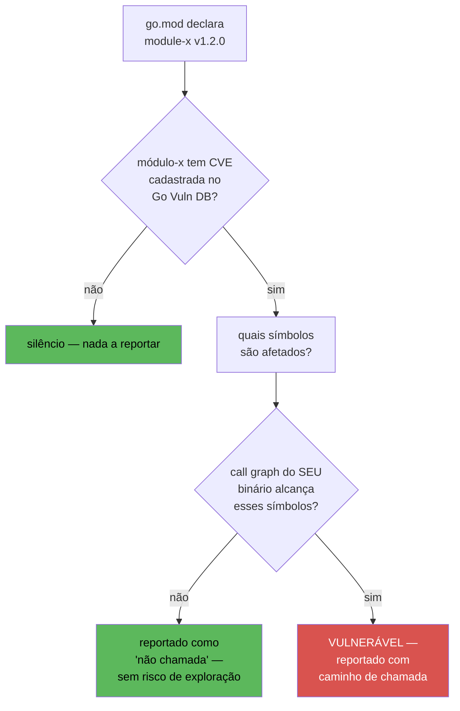
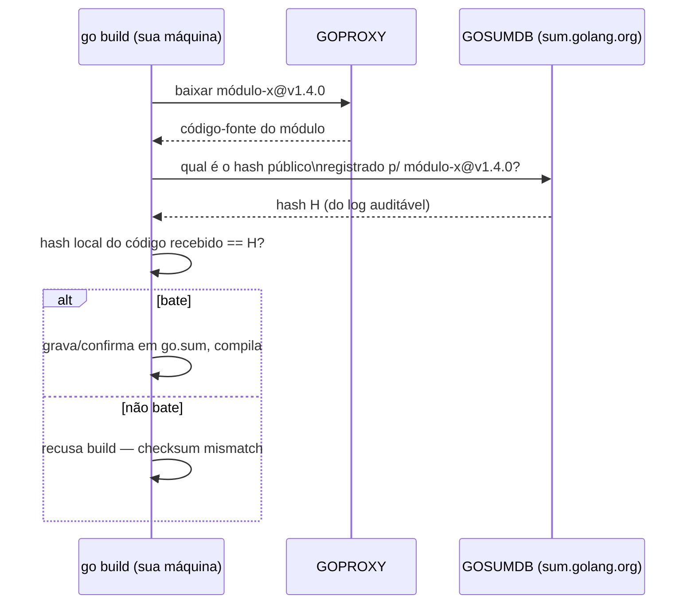
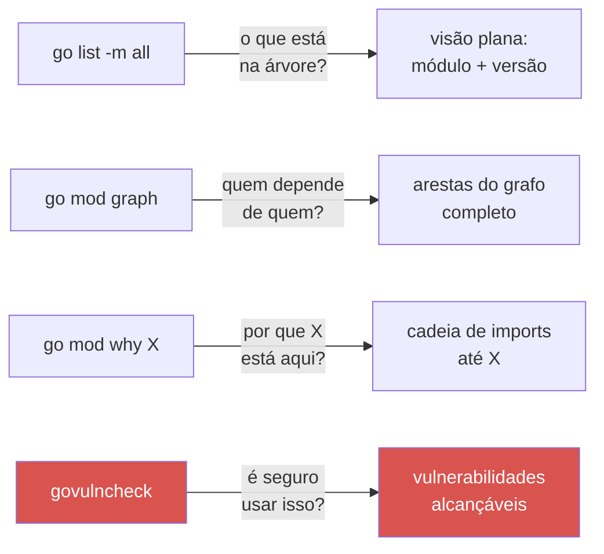

# govulncheck e supply chain

> [!abstract] TL;DR
> `go vet` acha bugs no seu código; `govulncheck` acha **vulnerabilidades conhecidas nas suas dependências** — mas só relata as que o seu código *de fato alcança* via análise de call graph, não toda CVE que existe no módulo importado. `go.sum` grava o hash criptográfico de cada versão de cada dependência baixada; sem ele (ou se ele for adulterado), `go build` recusa compilar. `GOSUMDB` (padrão `sum.golang.org`) é um log público e auditável que confirma que o hash que você recebeu é o mesmo que todo mundo recebeu — proteção contra um proxy comprometido servindo código malicioso silenciosamente. `GOPROXY` decide de onde os módulos vêm; `go mod why` e `go mod graph` respondem "por que essa dependência transitiva está aqui". Nenhuma dessas ferramentas troca julgamento por automação — mas juntas fecham boa parte do problema de *supply chain* em Go sem exigir nenhuma ferramenta de terceiros.

## O incidente que essas ferramentas evitam

Imagine o cenário: seu serviço em produção importa uma biblioteca de parsing de JSON de terceiros. Seis meses depois, um pesquisador de segurança publica uma CVE nessa biblioteca — um payload malicioso consegue causar um *denial of service* explorando uma função específica de parsing recursivo. Você lê o aviso, sente o estômago afundar, e faz a pergunta óbvia: **meu código chama essa função?**

Sem ferramenta nenhuma, a resposta exige grep manual, ler o changelog da CVE, rastrear imports à mão — um trabalho de detetive que ninguém faz de forma consistente sob pressão de um incidente. É exatamente esse trabalho que `govulncheck` automatiza: ele sabe quais funções da biblioteca têm a vulnerabilidade catalogada, constrói o *call graph* real do seu binário, e responde com precisão se o caminho de execução do seu programa realmente passa por ali.

Mas há uma segunda pergunta, anterior a essa: como você tem certeza de que o código da biblioteca que está compilado no seu binário é *exatamente* o código que o autor publicou — sem um caractere adulterado por um proxy comprometido no meio do caminho? Essa é a pergunta que `go.sum` e `GOSUMDB` respondem. As duas perguntas, juntas, são o essencial de *supply chain security* em Go: **o que estou rodando, e é seguro rodar isso?**

## govulncheck: vulnerabilidade alcançável, não vulnerabilidade presente

A maioria dos scanners de dependência (o `npm audit` do Node, o `pip-audit` do Python, o OWASP Dependency-Check de Java) funciona por correspondência de versão: "seu `package.json` declara `lodash@4.17.15`; existe uma CVE cadastrada para essa versão; logo, reporte". É simples, é rápido, e gera uma quantidade enorme de **falsos positivos práticos** — a CVE pode estar numa função que seu código nunca chama.

`govulncheck`, mantido pelo próprio time do Go, faz algo mais caro e mais preciso: ele constrói o **call graph** estático do seu binário — quem chama quem, a partir do seu `main` — e cruza isso com a base de dados de vulnerabilidades do Go (o [Go Vulnerability Database](https://go.dev/security/vuln/database), que cataloga não só *qual módulo* tem a vulnerabilidade, mas *quais símbolos* (funções, métodos) dentro dele são afetados.



Isso é o diferencial declarado explicitamente pelo próprio time do Go no [blog de anúncio](https://go.dev/blog/govulncheck): a ferramenta "só reporta vulnerabilidades que afetam de verdade seu código", reduzindo o ruído de vulnerabilidades presentes na dependência mas inalcançáveis no seu uso específico dela.

### Instalando e rodando

`govulncheck` não vem embutido no toolchain `go`, mas é mantido pelo mesmo time e distribuído como ferramenta instalável via `go install`:

```bash
go install golang.org/x/vuln/cmd/govulncheck@latest
```

> [!info] `go install` de ferramentas — padrão desde Go 1.16
> Instalar binários de ferramentas Go direto de um módulo remoto (`go install pacote@versão`) é o padrão desde Go 1.16 — antes disso, `go get` fazia o papel duplo de baixar dependência de projeto e instalar ferramenta, o que gerava confusão sobre efeitos colaterais em `go.mod`. Hoje `go install` é só para ferramentas; `go get` só mexe em dependências do módulo atual.

Com o binário instalado (tipicamente em `$GOPATH/bin` ou `$HOME/go/bin` — confira se está no seu `PATH`), rodar contra o módulo atual é um único comando:

```bash
govulncheck ./...
```

Uma saída típica, quando há vulnerabilidade alcançável:

```text
=== Symbol Results ===

Vulnerability #1: GO-2023-1234
    Denial of service via crafted input in recursive parser
  More info: https://pkg.go.dev/vuln/GO-2023-1234
  Module: github.com/exemplo/jsonparser
    Found in: github.com/exemplo/jsonparser@v1.4.0
    Fixed in: github.com/exemplo/jsonparser@v1.4.2
    Example traces found:
      #1: main.go:42:16: main.processarPayload calls
          jsonparser.ParseRecursive
```

O "Example traces" é a peça de ouro: ele mostra a linha exata do *seu* código que leva até a função vulnerável, exatamente o trabalho de detetive manual que a abertura desta nota descreveu.

> [!warning] Módulo listado ≠ código compilado no binário
> `govulncheck ./...` analisa o código-fonte alcançável a partir dos pacotes do módulo atual, não binários já compilados. Se você quer auditar um binário específico já buildado (por exemplo, um artefato de release antigo), use `govulncheck -mode=binary ./meu-binario` — o modo padrão analisa fonte, o modo binário faz *symbol matching* sobre o binário compilado, mais rápido mas com menos precisão de call graph.

### Integrando em CI

O uso real de `govulncheck` é contínuo, não pontual — rodar uma vez e esquecer não protege contra CVEs publicadas depois do seu último `go build`. Um passo de CI simples cobre isso:

```yaml
# .github/workflows/vulncheck.yml (trecho)
- name: Instalar govulncheck
  run: go install golang.org/x/vuln/cmd/govulncheck@latest

- name: Rodar govulncheck
  run: govulncheck ./...
```

`govulncheck` retorna código de saída não-zero quando encontra vulnerabilidade alcançável — suficiente para falhar o pipeline sem script adicional.

## go.sum: a prova de que o código não mudou debaixo de você

`go.mod` declara **quais** versões de módulo o seu projeto depende. `go.sum` grava **hashes criptográficos** — de cada versão de cada módulo (dependência direta, transitiva, e até versões que só foram *consideradas* durante a resolução) — para garantir que o conteúdo baixado hoje é byte-a-byte idêntico ao que foi baixado quando o `go.sum` foi gerado.

```text
github.com/exemplo/jsonparser v1.4.0 h1:aBcD3fGhIjKl...=
github.com/exemplo/jsonparser v1.4.0/go.mod h1:xYzW9pQrSt...=
```

Cada linha tem duas entradas: o hash do conteúdo do módulo (`h1:...`) e o hash só do `go.mod` daquele módulo. Isso importa porque o `go.mod` de uma dependência é lido *antes* de o módulo inteiro ser baixado (para resolver a árvore de versões via [minimal version selection](https://go.dev/ref/mod#minimal-version-selection)) — então ele precisa de checksum próprio, verificável mesmo antes do download completo.

Se alguém adulterar um pacote no cache local, num proxy intermediário, ou tentar substituir uma versão publicada por outra com o mesmo número, o hash não bate — e `go build` recusa a compilação com um erro do tipo `checksum mismatch`. Esse é o mecanismo central: `go.sum` transforma "confiar cegamente no proxy" em "verificar criptograficamente o que o proxy te deu".

> [!warning] `go.sum` faz parte do controle de versão — sempre
> É tentador tratar `go.sum` como arquivo gerado e ignorável (parecido com `package-lock.json` antes de times aprenderem a lição, ou `poetry.lock`). Não faça isso. Sem `go.sum` versionado, cada `git clone` seguido de `go build` fica sujeito a resolver dependências do zero, sem a mesma garantia de integridade que o time original tinha — e builds deixam de ser reprodutíveis bit a bit entre máquinas.

## GOSUMDB: quem garante que o hash em si não foi forjado

`go.sum` resolve "o código que baixei bate com o hash que tenho registrado" — mas isso só protege contra adulteração *depois* que o `go.sum` já existe. E se o primeiro `go mod tidy` que gerou aquele `go.sum`, na sua máquina, já recebeu um hash forjado de um proxy malicioso, na primeira vez que baixou o módulo?

É esse buraco que o **checksum database** — `sum.golang.org`, controlado por `GOSUMDB` — fecha. É um log público, append-only, baseado numa estrutura de [Merkle tree transparente](https://go.dev/blog/module-mirror-launch) (o mesmo princípio de design do Certificate Transparency, usado para certificados TLS): toda vez que o toolchain `go` baixa um módulo novo, ele consulta esse log público e confirma que o hash recebido é **o mesmo hash que qualquer outra pessoa no mundo, buscando o mesmo módulo na mesma versão, também recebeu**. Um proxy comprometido não consegue servir código malicioso de forma seletiva e silenciosa, porque o hash forjado ficaria divergente do hash público registrado no log — e o `go` recusaria.



Por padrão, `GOSUMDB=sum.golang.org` já vem ativo em qualquer instalação padrão do Go — a verificação acontece de forma transparente, sem configuração manual. Você só precisa saber que ela existe para entender *por que* certos erros de checksum acontecem, e para saber desligá-la deliberadamente (nunca por acidente) em cenários legítimos, como módulos privados internos que nunca deveriam ser publicados num log público:

```bash
# Desliga verificação globalmente — evite, exceto p/ debugging pontual
GONOSUMCHECK=1 go build

# Abordagem correta p/ módulos privados: excluir do checksum
# database sem desligar a verificação para o resto
GOPRIVATE=github.com/minhaempresa/* go build
GONOSUMCHECK=  # não necessário se GOPRIVATE já cobre o padrão
```

> [!info] `GOPRIVATE` e `GONOSUMDB` — a forma certa de lidar com módulos internos
> Empresas com módulos internos privados (nunca publicados, nunca deveriam aparecer num log público auditável) configuram `GOPRIVATE=github.com/suaempresa/*` (ou a variável mais granular `GONOSUMDB`/`GOSUMDB=off` restrita por padrão de import path). Isso instrui o toolchain a pular tanto o proxy público quanto a verificação via checksum database para esses módulos específicos — sem desligar a proteção para o resto das dependências, que continuam vindo de fontes públicas e auditáveis.

## GOPROXY: de onde o código realmente vem

`GOPROXY` decide o mecanismo de resolução de módulos: por padrão, desde Go 1.13, o valor é `https://proxy.golang.org,direct` — primeiro tenta o proxy público mantido pelo Google (que também funciona como cache imutável: uma vez que uma versão é publicada e servida, ela nunca muda, protegendo contra o autor original apagar ou reescrever uma tag depois), e se o proxy não tiver o módulo (por exemplo, é privado), cai para `direct` — buscar direto do VCS (Git, geralmente) declarado no import path.

```bash
go env GOPROXY
# https://proxy.golang.org,direct
```

Times corporativos costumam apontar `GOPROXY` para um proxy interno (Athens, JFrog Artifactory com suporte a Go, ou o Google Artifact Registry) que espelha o proxy público e adiciona controle de quais módulos são permitidos — uma camada extra de auditoria antes de qualquer dependência nova entrar no build.

> [!warning] `GOPROXY=direct` sozinho reabre a superfície de ataque que o proxy fecha
> Configurar `GOPROXY=direct` (sem o proxy público na frente) faz cada `go build` ir direto ao repositório Git de cada dependência — perdendo a garantia de imutabilidade do proxy público (uma tag Git *pode* ser deletada e recriada apontando para outro commit; uma versão já publicada no proxy público, não). Só faça isso deliberadamente, e normalmente combinado com um proxy interno próprio — nunca como forma de "simplificar" a configuração de rede sem entender a troca envolvida.

## Builds reprodutíveis: `-mod=readonly` e vendoring

Ter `go.sum` versionado só protege de verdade se o build também **recusar** seguir em frente quando `go.mod`/`go.sum` não batem com o que o código realmente importa. Desde Go 1.16, o comportamento padrão de `go build` e `go test` já é `-mod=readonly`: se compilar exigisse adicionar ou atualizar uma entrada em `go.mod` (por exemplo, porque alguém importou um pacote novo sem rodar `go mod tidy` antes), o build falha em vez de reescrever os arquivos silenciosamente.

```bash
go build ./...
# go: updates to go.mod needed, disabled by -mod=readonly
```

Esse erro, que costuma frustrar quem espera o comportamento antigo (`go.mod` sendo atualizado automaticamente por trás), é uma proteção deliberada: ninguém deveria descobrir que a árvore de dependências mudou só porque um build de CI passou silenciosamente diferente do que passou ontem. A correção correta é rodar `go mod tidy` localmente, revisar o diff de `go.mod`/`go.sum` como qualquer outra mudança de código, e só então commitar.

Para times que precisam de builds totalmente offline ou querem congelar uma cópia literal de cada dependência dentro do próprio repositório, `go mod vendor` copia o código-fonte de todas as dependências para uma pasta `vendor/` versionada — o `go build -mod=vendor` então nem consulta `GOPROXY` nem `GOSUMDB` em tempo de build, porque tudo já está local e já foi verificado no momento do `go mod vendor`. É uma troca: mais peso no repositório, em troca de reprodutibilidade que não depende de nenhum serviço externo estar no ar.

## Auditando dependências: quem trouxe o quê, e por quê

Com `go.sum` e `GOSUMDB` garantindo integridade, e `govulncheck` checando vulnerabilidades conhecidas, resta a pergunta de higiene contínua: **o que exatamente está na árvore de dependências, e alguma delas é desnecessária?**

**`go list -m all`** lista toda a árvore resolvida — módulo e versão final escolhida para cada um, direto e transitivo:

```bash
go list -m all
```

**`go mod graph`** mostra as arestas do grafo de dependência — quem depende de quem, útil pra rastrear de onde uma dependência transitiva indesejada está vindo:

```bash
go mod graph | grep jsonparser
# seuprojeto github.com/exemplo/jsonparser@v1.4.0
# github.com/outralib/util github.com/exemplo/jsonparser@v1.2.0
```

**`go mod why`** responde a pergunta mais direta de todas — "por que meu módulo importa isso, se eu nunca escrevi `import "..."` para ele diretamente?":

```bash
go mod why github.com/exemplo/jsonparser
# # github.com/exemplo/jsonparser
# seuprojeto
# github.com/outralib/util
# github.com/exemplo/jsonparser
```

A saída lê como uma cadeia de chamadas de import: `seuprojeto` importa `outralib/util`, que importa `jsonparser` — a dependência transitiva que apareceu "do nada" no seu `go.sum` tem uma origem rastreável, uma linha por vez.



Um hábito periódico simples — rodar `go list -m all`, `go mod graph` e `govulncheck ./...` como parte de revisão de dependências, não só de CI — pega tanto dependências transitivas inchando o binário à toa quanto vulnerabilidades novas publicadas depois do último deploy.

## Lente cross-stack

| Vindo de... | Equivalente | Diferença que importa |
|---|---|---|
| Node/npm | `npm audit` | `npm audit` casa por versão (CVE presente na dependência); `govulncheck` casa por call graph (CVE *alcançável* no seu código) — menos ruído, mais precisão |
| Python/pip | `pip-audit`, `safety` | Mesma lógica de correspondência por versão do `npm audit`; nenhum dos dois analisa call graph por padrão |
| Java/Maven | OWASP Dependency-Check | Também correspondência por versão/CPE; Java carece de um equivalente nativo mantido pela linguagem — `govulncheck` é first-party, integrado ao próprio time do Go |
| npm/`package-lock.json` | `go.sum` | Ambos travam hash por versão resolvida; mas Go acrescenta verificação *externa* via GOSUMDB — `package-lock.json` sozinho não tem um log público equivalente por padrão |

O ponto que mais salta: em Node e Python, checksum-database pública e auditável (estilo GOSUMDB) não é padrão de fábrica — existe como serviço de terceiros opcional (Sigstore, npm provenance mais recente). Em Go, é comportamento **padrão desde Go 1.13**, ligado sem nenhuma configuração extra.

## Como explicar em inglês

> `govulncheck` scans your dependency tree against the Go Vulnerability Database, but — unlike most scanners — it builds your program's actual call graph and only reports vulnerabilities your code can *reach*, cutting a lot of the noise that version-matching scanners like `npm audit` or `pip-audit` generate. Underneath, `go.sum` pins a cryptographic hash for every dependency version, so `go build` refuses to compile if the fetched code doesn't match what was recorded. `GOSUMDB` (`sum.golang.org` by default) goes one step further: it's a public, tamper-evident transparency log that confirms the hash you received is the same hash everyone else received for that exact module version — protection against a compromised proxy silently serving different code to different people. `GOPROXY` controls where modules are fetched from; internal proxies and `GOPRIVATE` handle private modules without disabling verification for everything else.

| Termo PT | Termo EN |
|---|---|
| vulnerabilidade alcançável | reachable vulnerability |
| grafo de chamadas | call graph |
| checksum / soma de verificação | checksum |
| banco de dados de checksum | checksum database |
| log transparente / auditável | transparency log |
| proxy de módulos | module proxy |
| módulo privado | private module |
| cadeia de suprimentos (de software) | (software) supply chain |
| árvore de dependências | dependency tree |

## O que vem a seguir

Integridade de dependência e verificação de vulnerabilidade resolvem "o código que estou rodando é confiável" — mas há uma categoria de segredo que nenhuma das duas ferramentas toca: chaves de API, credenciais de banco, tokens de terceiros, que o seu próprio código precisa carregar em runtime sem vazar em log, em repositório Git, ou em variável de ambiente mal protegida. A [[06 - Secrets e configuração segura|próxima nota]] entra nesse território — de `os.Getenv` ingênuo até integração com um cofre de segredos de verdade.

## Veja também

- [[01 - Segurança em Go — o panorama|01 — Segurança em Go — o panorama]] — visão geral do galho, onde supply chain se encaixa entre as demais frentes de segurança
- [[04 - Validação e sanitização de input|04 — Validação e sanitização de input]] — a outra metade de "o que entra no seu programa é seguro": dados vindos de fora, não dependências
- [[06 - Secrets e configuração segura|06 — Secrets e configuração segura]] — próxima nota do galho
- [[03-Dominios/Tecnologia/Go/index|Trilha Go]]

## Fontes

- The Go Authors. *govulncheck: Go's own vulnerability scanner*. go.dev/blog. https://go.dev/blog/govulncheck (acessado em 2026-07-18)
- The Go Authors. *govulncheck command reference*. pkg.go.dev. https://pkg.go.dev/golang.org/x/vuln/cmd/govulncheck (acessado em 2026-07-18)
- The Go Authors. *Go Vulnerability Database*. go.dev/security/vuln. https://go.dev/security/vuln/database (acessado em 2026-07-18)
- The Go Authors. *Go Modules Reference — Minimal version selection*. go.dev. https://go.dev/ref/mod#minimal-version-selection (acessado em 2026-07-18)
- The Go Authors. *Module Mirror, Index, and Checksum Database Launched*. go.dev/blog. https://go.dev/blog/module-mirror-launch (acessado em 2026-07-18)
- The Go Authors. *Go Modules Reference — Authenticating modules*. go.dev. https://go.dev/ref/mod#authenticating (acessado em 2026-07-18)
