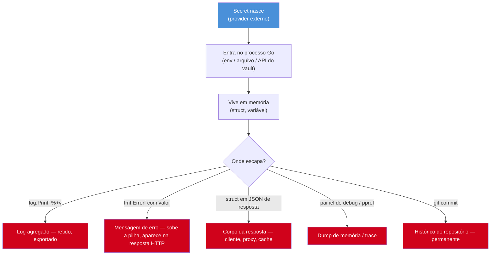
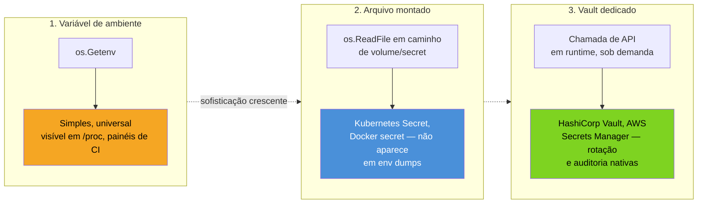

# Secrets e configuração segura

> [!abstract] TL;DR
> Um secret — chave de API, senha de banco, token JWT de assinatura — não é "mais um dado de configuração". É um dado cujo vazamento tem custo assimétrico: um `DB_HOST` errado quebra o deploy, uma `DB_PASSWORD` vazada compromete o banco inteiro, silenciosamente, talvez meses depois de vazar. Este capítulo trata de três disciplinas que juntas evitam esse vazamento em código Go: nunca hardcode um secret no fonte (nem "temporariamente"), garantir que ele nunca escorra por `log`, `error` ou stack trace, e escolher onde ele mora em runtime — variável de ambiente, arquivo montado, ou um vault dedicado — com rotação como parte do design, não como reboque tardio. O fio condutor é a **superfície de vazamento**: cada lugar onde o valor de um secret passa (variável, struct, log, string de erro, painel de observabilidade) é um ponto de escape em potencial, e o trabalho de configuração segura é minimizar quantos desses pontos existem.

## O cenário que expõe o problema

Você está debugando uma conexão de banco que falha em produção. Adiciona um log rápido:

```go
log.Printf("tentando conectar: %+v", cfg)
```

`cfg` é a struct de configuração inteira — host, porta, usuário, e a senha. `%+v` imprime todos os campos, com nome. O log vai para o agregador central, que a empresa inteira consulta, que fica retido por 90 dias, que às vezes é exportado para um bucket de backup com permissões mais largas do que deveria. A senha do banco de produção agora está em texto puro em pelo menos três sistemas que não são o banco de dados.

Ninguém decidiu "vamos vazar a senha". Foi uma consequência de tratar o secret como um campo de struct igual a qualquer outro — sujeito às mesmas regras de log, serialização e `fmt.Errorf` que `Host` ou `Port`. É esse ponto cego que este capítulo ataca: secrets precisam de tratamento **diferente** do resto da configuração, em cada camada onde passam.



Cada seta vermelha nesse diagrama é uma escolha de código que este capítulo mostra como evitar.

## Regra 1: nunca hardcode

A tentação mais óbvia — e a mais fácil de banir — é escrever o secret direto no fonte:

```go
// NUNCA:
const dbPassword = "S3nh4Super$ecreta2026"

func connect() (*sql.DB, error) {
    dsn := fmt.Sprintf("user=admin password=%s host=prod-db", dbPassword)
    return sql.Open("postgres", dsn)
}
```

Isso parece inofensivo em um protótipo local — "depois eu troco" — mas o secret entra no controle de versão no primeiro `git commit`, e um `git log -p` ou `git blame` de qualquer pessoa com acesso ao repositório o recupera para sempre, mesmo que uma reversão posterior "remova" a linha. Histórico de Git não esquece.

> [!warning] Rotacionar não apaga o passado — remover do fonte também não
> Se um secret foi commitado, trocar o valor no banco (rotacionar) resolve o problema daqui pra frente, mas o valor antigo continua legível no histórico do Git indefinidamente, a menos que alguém reescreva o histórico com `git filter-repo` ou similar — operação destrutiva, coordenada, e que a maioria dos times evita. A lição prática: tratar todo secret commitado como **comprometido permanentemente**, rotacionar imediatamente, e nunca assumir que "já apaguei" resolve.

`govulncheck` e ferramentas de SAST (nota anterior, [[05 - govulncheck e supply chain|05]]) não pegam secret hardcoded — isso é o trabalho de um *secret scanner* (`gitleaks`, `trufflehog`, ou o *secret scanning* nativo do GitHub), tipicamente rodando em CI, num commit hook, ou continuamente contra o repositório. Vale integrar um desses ao pipeline como parte do mesmo hábito de higiene que já existe para vulnerabilidades de dependência.

## Regra 2: nunca vazar em log ou erro

Mesmo sem hardcode, o secret ainda circula em memória — e qualquer `log.Printf`, `fmt.Errorf` ou serialização JSON ingênua pode imprimi-lo por acidente. O padrão mais confiável em Go é fazer o **tipo** do secret recusar a impressão, em vez de confiar que todo desenvolvedor vai lembrar de nunca logar aquele campo específico.

```go
// SecretString é um wrapper que impede impressão acidental do valor.
type SecretString string

// String satisfaz fmt.Stringer — chamado por %v, %s, Println, Printf.
func (s SecretString) String() string {
    return "[REDACTED]"
}

// GoString satisfaz fmt.GoStringer — chamado por %#v.
func (s SecretString) GoString() string {
    return "SecretString([REDACTED])"
}

// MarshalJSON evita que o valor vaze em corpos de resposta HTTP.
func (s SecretString) MarshalJSON() ([]byte, error) {
    return []byte(`"[REDACTED]"`), nil
}

// Reveal expõe o valor real — só chamado no ponto de uso (ex: DSN de conexão).
func (s SecretString) Reveal() string {
    return string(s)
}
```

```go
type Config struct {
    DBHost     string
    DBUser     string
    DBPassword SecretString
}

func main() {
    cfg := Config{
        DBHost:     "prod-db.internal",
        DBUser:     "admin",
        DBPassword: SecretString(os.Getenv("DB_PASSWORD")),
    }

    log.Printf("config carregada: %+v", cfg)
    // config carregada: {DBHost:prod-db.internal DBUser:admin DBPassword:[REDACTED]}

    dsn := fmt.Sprintf("host=%s user=%s password=%s",
        cfg.DBHost, cfg.DBUser, cfg.DBPassword.Reveal())
    // dsn só existe no ponto exato de uso — não é logado
}
```

O ganho é estrutural: `%+v` não tem como enxergar o valor real, porque `String()` intercepta a formatação antes que o campo bruto seja acessado — o mesmo mecanismo de `fmt.Stringer` que a nota 03 de [[03-Dominios/Tecnologia/Go/02 - Tipos, structs e métodos/03 - Métodos|Métodos]] usou para formatação customizada, aqui virado ao contrário: em vez de mostrar mais, mostra menos, deliberadamente. `.Reveal()` é o único caminho para o valor real — um nome explícito, fácil de auditar com um `grep -rn "\.Reveal("` no repositório inteiro para ver exatamente onde o secret é usado de fato.

> [!info] `log/slog` (Go 1.21+) tem `LogValuer` para o mesmo propósito
> A biblioteca de logging estruturado `log/slog`, estável desde Go 1.21, define a interface [`slog.LogValuer`](https://pkg.go.dev/log/slog#LogValuer): qualquer tipo com `LogValue() slog.Value` controla como aparece em `slog.Info`, `slog.Error` etc., de forma independente de `fmt.Stringer`. Vale implementar as duas interfaces no mesmo `SecretString` se o serviço usa `slog` — cada biblioteca de log tem seu próprio gancho de formatação, e `%+v` não cobre `slog` automaticamente.

```go
func (s SecretString) LogValue() slog.Value {
    return slog.StringValue("[REDACTED]")
}
```

O mesmo cuidado vale para **erros**. `fmt.Errorf` com `%w` ou `%v` propaga qualquer coisa que você colocar nos argumentos — inclusive um secret, se ele estiver por perto no escopo:

```go
// Perigoso: o erro carrega o DSN completo, senha inclusa, até onde for logado ou retornado
func connect(dsn string) (*sql.DB, error) {
    db, err := sql.Open("postgres", dsn)
    if err != nil {
        return nil, fmt.Errorf("falha ao conectar com dsn=%s: %w", dsn, err)
    }
    return db, nil
}
```

```go
// Seguro: o erro descreve o que falhou, sem ecoar o valor sensível
func connect(dsn string) (*sql.DB, error) {
    db, err := sql.Open("postgres", dsn)
    if err != nil {
        return nil, fmt.Errorf("falha ao conectar ao banco de dados: %w", err)
    }
    return db, nil
}
```

> [!warning] Erro que sobe até o cliente HTTP é a superfície de vazamento mais fácil de esquecer
> Um handler que faz `http.Error(w, err.Error(), 500)` sem filtrar devolve, ao cliente da API, qualquer coisa que estiver dentro de `err` — inclusive um DSN vazado de uma camada mais funda. Erros internos e erros voltados ao cliente precisam de tratamentos distintos: log interno detalhado (mas ainda sem secret cru), resposta externa genérica (`"internal server error"`, um código de rastreio). A nota [[03-Dominios/Tecnologia/Go/04 - Erros como valor/index|Galho 4, Erros como valor]] cobre a modelagem de erro em profundidade; aqui o ponto específico é não deixar um secret pegar carona nessa cadeia.

## Regra 3: onde o secret mora em runtime

Banido o hardcode e fechada a fuga por log/erro, resta a pergunta de origem: de onde o processo Go lê o secret quando inicia? Três padrões, em ordem crescente de sofisticação — e nenhum é universalmente "o certo"; a escolha depende do ambiente de deploy, já introduzido no galho de [[03-Dominios/Tecnologia/Go/18 - Cloud-native e produção/index|Cloud-native e produção]].



**1. Variável de ambiente** — o padrão mais comum, e o ponto de partida legítimo para a maioria dos serviços:

```go
dbPassword := SecretString(os.Getenv("DB_PASSWORD"))
if dbPassword == "" {
    log.Fatal("DB_PASSWORD não definida")
}
```

Simples, suportado por qualquer plataforma de deploy (Docker, Kubernetes, PaaS), sem dependência externa. A fraqueza: variáveis de ambiente de um processo são visíveis a qualquer coisa com acesso a `/proc/<pid>/environ` no mesmo host, aparecem inteiras em `docker inspect`, e vazam com frequência em logs de CI que imprimem o ambiente completo para debug. Adequado quando a superfície de acesso ao host/container já é razoavelmente controlada — não é uma falha grave, é um degrau abaixo das opções seguintes.

**2. Arquivo montado** — o secret chega como conteúdo de um arquivo, não como variável:

```go
data, err := os.ReadFile("/var/run/secrets/db-password")
if err != nil {
    log.Fatalf("não foi possível ler o secret: %v", err)
}
dbPassword := SecretString(strings.TrimSpace(string(data)))
```

Esse é o padrão de um Kubernetes Secret montado como volume, ou de Docker secrets. A vantagem sobre variável de ambiente: o conteúdo não aparece em `docker inspect` nem em um `env` genérico, e o orquestrador pode controlar permissões de arquivo (tipicamente `0400`, legível só pelo processo) de um jeito que uma variável de ambiente não permite.

**3. Vault dedicado** — o secret nunca fica parado em disco ou em variável; o processo o busca em runtime, sob demanda, via chamada de API a um serviço como HashiCorp Vault ou AWS Secrets Manager:

```go
// Esboço conceitual — a API real varia por vault (HashiCorp Vault, AWS
// Secrets Manager, GCP Secret Manager); o padrão de forma é o que importa aqui.
func loadDBPassword(ctx context.Context, client *vaultClient) (SecretString, error) {
    secret, err := client.ReadSecret(ctx, "secret/data/prod/db")
    if err != nil {
        return "", fmt.Errorf("falha ao ler secret do vault: %w", err)
    }
    return SecretString(secret.Data["password"].(string)), nil
}
```

O ganho real de um vault não é só "mais um lugar seguro pra guardar" — é rotação e auditoria **nativas**: o vault pode emitir credenciais de curta duração (um usuário de banco válido por uma hora, renovado automaticamente), e cada leitura de secret fica registrada em log de auditoria do próprio vault, sem que o serviço Go precise implementar nada disso. É a peça que fecha o ciclo de rotação — próxima seção.

> [!warning] Vault é infraestrutura, não biblioteca Go — este capítulo cobre só o formato da chamada
> HashiCorp Vault e AWS Secrets Manager são sistemas externos com operação própria (unseal, políticas de acesso, backend de storage) — configurá-los está fora do escopo de um capítulo sobre código Go. O que fica aqui é o formato de integração do lado do cliente: o processo Go troca uma leitura direta de `os.Getenv` por uma chamada de API autenticada, tipicamente com um token de curta duração injetado no ambiente de execução (Kubernetes ServiceAccount, IAM role) — não um segredo de longa duração usado para buscar outros segredos.

Para tornar o padrão menos abstrato, um exemplo com o SDK real da AWS (`aws-sdk-go-v2`), que segue exatamente essa forma — autenticação via IAM role do ambiente, não credencial estática embutida:

```go
import (
    "context"
    "encoding/json"

    "github.com/aws/aws-sdk-go-v2/config"
    "github.com/aws/aws-sdk-go-v2/service/secretsmanager"
)

func loadDBPasswordAWS(ctx context.Context, secretName string) (SecretString, error) {
    cfg, err := config.LoadDefaultConfig(ctx) // credenciais vêm do ambiente/IAM role, não do código
    if err != nil {
        return "", fmt.Errorf("falha ao carregar config da AWS: %w", err)
    }

    client := secretsmanager.NewFromConfig(cfg)
    out, err := client.GetSecretValue(ctx, &secretsmanager.GetSecretValueInput{
        SecretId: &secretName,
    })
    if err != nil {
        return "", fmt.Errorf("falha ao ler secret do Secrets Manager: %w", err)
    }

    var payload struct {
        Password string `json:"password"`
    }
    if err := json.Unmarshal([]byte(*out.SecretString), &payload); err != nil {
        return "", fmt.Errorf("secret com formato inesperado: %w", err)
    }
    return SecretString(payload.Password), nil
}
```

Repare que `config.LoadDefaultConfig` não recebe access key nem secret key como argumento — o SDK resolve a credencial a partir do ambiente de execução (variável de ambiente, arquivo `~/.aws/credentials`, ou, em produção, a IAM role anexada à instância/task/pod). É a mesma ideia de "credencial de curta duração emprestada pelo ambiente" que aparece com HashiCorp Vault e Kubernetes ServiceAccounts — o processo nunca guarda, ele próprio, um segredo de longa duração para buscar outros segredos.

| Onde mora | Rotação | Visibilidade indevida | Complexidade operacional |
|---|---|---|---|
| Variável de ambiente | Manual, exige restart | `/proc`, `docker inspect`, dumps de CI | Nenhuma |
| Arquivo montado | Manual ou orquestrada (K8s pode re-montar) | Menor — não aparece em env dumps | Baixa (depende do orquestrador) |
| Vault dedicado | Automática, credenciais de curta duração | Menor — nunca persiste em disco do host | Alta (opera o vault) |

## Rotação: o secret tem validade, não é permanente

Um secret que nunca rotaciona é um secret que, uma vez vazado — por um log antigo, um laptop roubado, um ex-funcionário — fica válido para sempre até alguém perceber o vazamento e trocar manualmente. Rotação é a prática de trocar o valor periodicamente, **antes** de qualquer vazamento suspeito, para que a janela de exposição de qualquer cópia vazada seja curta por padrão.

Do lado do código Go, o requisito prático de suportar rotação é simples de enunciar e fácil de esquecer na hora de implementar: **nunca ler o secret uma única vez no boot e guardá-lo estático para sempre**. Se a senha do banco muda enquanto o processo está de pé, o processo precisa de um jeito de pegar o valor novo sem reiniciar.

```go
type RotatingSecret struct {
    mu    sync.RWMutex
    value SecretString
}

func (r *RotatingSecret) Get() SecretString {
    r.mu.RLock()
    defer r.mu.RUnlock()
    return r.value
}

func (r *RotatingSecret) Set(v SecretString) {
    r.mu.Lock()
    defer r.mu.Unlock()
    r.value = v
}

// watchFile relê o arquivo periodicamente e atualiza o secret em memória —
// útil quando o orquestrador re-monta o arquivo com o valor novo, sem
// reiniciar o processo (padrão comum de Kubernetes Secret + volume).
func watchFile(ctx context.Context, path string, target *RotatingSecret, interval time.Duration) {
    ticker := time.NewTicker(interval)
    defer ticker.Stop()

    for {
        select {
        case <-ctx.Done():
            return
        case <-ticker.C:
            data, err := os.ReadFile(path)
            if err != nil {
                slog.Error("falha ao reler secret", "path", path, "err", err)
                continue
            }
            target.Set(SecretString(strings.TrimSpace(string(data))))
        }
    }
}
```

O padrão acima cobre arquivo montado. Com um vault dedicado, o equivalente é uma goroutine que renova a credencial antes de expirar (a maioria dos SDKs de vault já oferece isso pronto, como *lease renewal*). Com variável de ambiente pura, rotação **não** é possível sem restart do processo — outra razão prática, além de visibilidade, para preferir arquivo montado ou vault em serviços de produção que não toleram downtime a cada troca de senha.

> [!question]- Rotação automática vale a complexidade para todo serviço, mesmo um projeto pequeno?
> Não necessariamente. Para um serviço interno de baixo risco, rotação manual periódica (trimestral, por exemplo, coordenada por um processo humano) já reduz a janela de exposição de forma significativa em relação a "nunca rotacionar". O padrão de `RotatingSecret` com watch automático vale o investimento quando o serviço não pode aceitar downtime de restart, ou quando o secret protege algo de alto valor (dados de produção, credenciais com escopo amplo) — não é um requisito universal de todo `main.go`.

## Caso prático completo: as três regras juntas

Um programa pequeno, mas realista, mostra as três regras trabalhando em conjunto: nenhum secret hardcoded, `SecretString` fechando a fuga por log, e leitura com *fallback* — primeiro tenta arquivo montado (produção), cai para variável de ambiente (desenvolvimento local) — validando no boot em vez de descobrir a ausência do secret só na primeira query ao banco:

```go
package main

import (
    "fmt"
    "log/slog"
    "os"
    "strings"
)

type Config struct {
    DBHost     string
    DBUser     string
    DBPassword SecretString
}

// loadSecret tenta um arquivo montado primeiro (padrão de produção); se o
// arquivo não existir, cai para variável de ambiente (padrão de dev local).
func loadSecret(filePath, envVar string) (SecretString, error) {
    if data, err := os.ReadFile(filePath); err == nil {
        return SecretString(strings.TrimSpace(string(data))), nil
    }
    if v, ok := os.LookupEnv(envVar); ok && v != "" {
        return SecretString(v), nil
    }
    return "", fmt.Errorf("secret não encontrado nem em %s nem em %s", filePath, envVar)
}

func loadConfig() (Config, error) {
    dbPassword, err := loadSecret("/var/run/secrets/db-password", "DB_PASSWORD")
    if err != nil {
        return Config{}, fmt.Errorf("configuração inválida: %w", err)
    }

    return Config{
        DBHost:     os.Getenv("DB_HOST"),
        DBUser:     os.Getenv("DB_USER"),
        DBPassword: dbPassword,
    }, nil
}

func main() {
    cfg, err := loadConfig()
    if err != nil {
        slog.Error("falha ao carregar configuração", "err", err) // seguro: err nunca carrega o valor do secret
        os.Exit(1)
    }

    slog.Info("configuração carregada", "config", cfg)
    // configuração carregada config="{DBHost:... DBUser:... DBPassword:[REDACTED]}"
}
```

`os.LookupEnv` (em vez de `os.Getenv`) aparece aqui de propósito: `os.Getenv` não distingue "variável ausente" de "variável definida como string vazia" — os dois casos retornam `""`. `LookupEnv` devolve o segundo valor booleano (`ok`) que resolve essa ambiguidade, importante justamente na hora de decidir se um secret obrigatório está de fato configurado.

## Armadilhas comuns

> [!warning] `.env` commitado por engano
> Arquivos `.env` (usados por bibliotecas como [`godotenv`](https://pkg.go.dev/github.com/joho/godotenv) para carregar variáveis de ambiente em desenvolvimento local) são convenientes, mas viram um vazamento clássico quando alguém esquece de listá-los no `.gitignore` — ou pior, edita o `.env.example` (que deveria só ter chaves, sem valores) e cola um valor real "só para testar". Trate `.env` como se fosse hardcode: nunca no controle de versão, `.gitignore` desde o primeiro commit do repositório.

> [!warning] Secret capturado em closure e logado indiretamente
> Uma função anônima que captura `dbPassword` por closure e é passada para uma lib de terceiros pode acabar sendo logada por essa lib sem que o código do seu serviço tenha uma linha de log explícita chamando o problema. O `SecretString` com `String()`/`MarshalJSON` redefinidos protege mesmo nesse caso — porque a proteção está no **tipo**, não em disciplina de "lembrar de não logar aqui" espalhada pelo código.

> [!warning] Painel de debug (`pprof`, `expvar`) exposto em produção com config na memória
> `net/http/pprof` e `expvar`, ambos da stdlib, expõem estado interno do processo — incluindo, em alguns casos, valores capturados em heap dumps ou variáveis registradas via `expvar.Publish`. Nunca registre uma struct de config com secret bruto (não redigido) num `expvar`, e nunca deixe `/debug/pprof` acessível publicamente em produção — outro ponto de escape que não passa por `log` nem por `error`.

## Lente cross-stack: vindo de outras linguagens

| Vindo de | Em Go, o equivalente é |
|---|---|
| Java + Spring: `@Value("${db.password}")` injetado do `application.yml`, frequentemente combinado com Vault/Spring Cloud Config | `os.Getenv` ou leitura de arquivo montado, explícito no `main.go` — sem *dependency injection* mágica; a leitura do secret é uma linha de código visível |
| Node.js: `process.env.DB_PASSWORD`, geralmente sem wrapper de redaction — `console.log(config)` vaza a senha do mesmo jeito que `log.Printf("%+v", cfg)` vazaria em Go sem `SecretString` | Mesmo risco, mesma causa raiz; a diferença é que o compilador Go não ajuda aqui — a proteção é uma decisão de design (o wrapper), não algo automático |
| Python: `os.environ["DB_PASSWORD"]`, com bibliotecas como `python-decouple` ou `pydantic-settings` para tipagem de config | `os.Getenv` é o análogo direto; `SecretString` cobre o papel que `pydantic.SecretStr` cobre em Python — um tipo dedicado que redige na formatação (`repr`/`str`) por padrão |

A lição que atravessa as três linguagens é a mesma: nenhuma delas impede vazamento de secret por padrão. Java, Node e Python também dependem de disciplina explícita — biblioteca de redaction, tipo dedicado, ou revisão de código — porque `%+v`, `console.log` e `print` são igualmente cegos ao "valor sensível" em qualquer uma delas.

## Como explicar em inglês

> Secrets — database passwords, API keys, signing tokens — need handling that's structurally different from regular configuration, not just "extra care." Never hardcode a secret in source: once it lands in a Git commit, it stays recoverable in history forever, even after rotation. Prevent leakage through logs and errors by wrapping secrets in a dedicated type that overrides `String()`, `MarshalJSON()`, and (with `log/slog`) `LogValue()` to redact by default — that closes the leak at the type level instead of relying on every developer remembering not to log a specific field. For where the secret lives at runtime, there's a spectrum: environment variables are simplest but visible via `/proc` and CI dumps; mounted files (Kubernetes Secrets, Docker secrets) are more contained; a dedicated vault (HashiCorp Vault, AWS Secrets Manager) adds native rotation and audit logging, typically issuing short-lived credentials instead of long-lived ones. Rotation only works if the running process can pick up a new value without a restart — reading a secret once at boot and holding it static defeats rotation regardless of where it's stored.

| Termo PT | Termo EN |
|---|---|
| vazamento | leak / leakage |
| superfície de vazamento | leak surface |
| redigir / redação de valor sensível | redact / redaction |
| rotação de secret | secret rotation |
| credencial de curta duração | short-lived credential |
| arquivo montado | mounted file |
| variável de ambiente | environment variable |
| janela de exposição | exposure window |

## O que vem a seguir

Este capítulo tratou o secret como um dado isolado — como protegê-lo em trânsito e em repouso dentro do processo. Mas a segurança do código Go não se resume a proteger valores sensíveis: existe um conjunto mais amplo de padrões defensivos — do jeito certo de comparar hashes sem vazar timing, ao cuidado com concorrência insegura, ao design de APIs que fecham por padrão em vez de abrir. A [[07 - Secure coding patterns|nota 07]] reúne esses padrões, com o mesmo espírito deste capítulo: cada um fecha uma superfície de ataque concreta, não uma checklist abstrata.

## Veja também

- [[01 - Segurança em Go — o panorama|01 — Segurança em Go — o panorama]] — visão geral do galho, onde esta nota se encaixa
- [[04 - Validação e sanitização de input|04 — Validação e sanitização de input]] — a outra metade da superfície de ataque: dados que entram, não secrets que já estão dentro
- [[05 - govulncheck e supply chain|05 — govulncheck e supply chain]] — scanners de vulnerabilidade de dependência; secret scanning é uma ferramenta irmã, com foco diferente
- [[07 - Secure coding patterns|07 — Secure coding patterns]] — próxima nota do galho
- [[03-Dominios/Tecnologia/Go/18 - Cloud-native e produção/index|Galho 18, Cloud-native e produção]] — onde o secret é injetado no container/pod em runtime
- [[03-Dominios/Tecnologia/Go/04 - Erros como valor/index|Galho 4, Erros como valor]] — modelagem de erro em profundidade, retomada aqui só no ponto de vazamento
- [[03-Dominios/Tecnologia/Go/index|Trilha Go]]

## Fontes

- The Go Authors. *Package fmt*. pkg.go.dev. https://pkg.go.dev/fmt (acessado em 2026-07-18)
- The Go Authors. *Package log/slog*. pkg.go.dev. https://pkg.go.dev/log/slog (acessado em 2026-07-18)
- The Go Authors. *Package os*. pkg.go.dev. https://pkg.go.dev/os (acessado em 2026-07-18)
- The Go Authors. *Go Security Policy*. go.dev. https://go.dev/security/ (acessado em 2026-07-18)
- The Go Blog. *Working with Errors in Go 1.13*. go.dev. https://go.dev/blog/go1.13-errors (acessado em 2026-07-18)
- The Go Authors. *Package net/http/pprof*. pkg.go.dev. https://pkg.go.dev/net/http/pprof (acessado em 2026-07-18)
