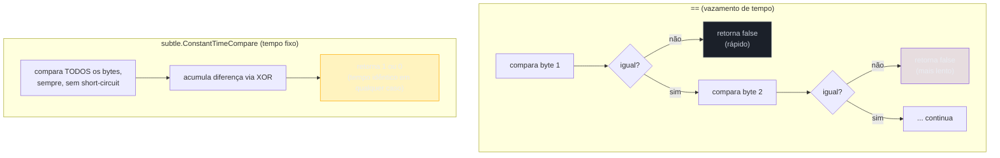
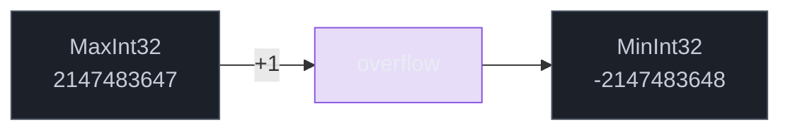
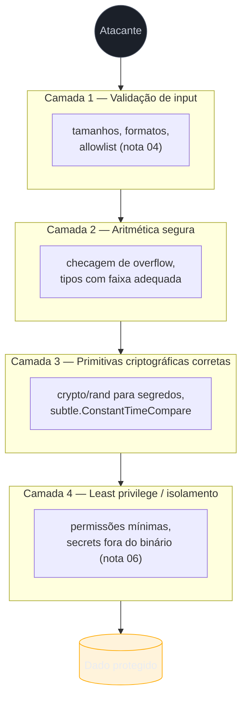

# Secure coding patterns

> [!abstract] TL;DR
> Comparar dois hashes com `==` parece inofensivo — mas vaza tempo, e tempo vaza segredo. `subtle.ConstantTimeCompare` compara em tempo constante, fechando esse canal lateral. Gerar um token de sessão com `math/rand` parece funcionar — mas o gerador é determinístico e previsível; segredos exigem `crypto/rand`, a fonte de entropia real do sistema operacional. Somar dois `int` que vêm de input do usuário parece seguro em Go — mas overflow silencioso (sem panic, sem erro) pode virar bypass de checagem de limite ou de alocação. Nenhuma dessas três armadilhas grita "bug" na hora de escrever o código: todas compilam, todas "funcionam" no caminho feliz, e todas falham exatamente quando um atacante decide testar o caminho infeliz. A defesa não é um único truque — é **defesa em profundidade**: várias camadas independentes, para que a falha de uma não derrube o sistema inteiro.

## O código que "funciona" e ainda assim é uma porta aberta

Imagine que você está revisando um pull request. A função autentica um usuário comparando o token que ele mandou com o token esperado, guardado no servidor:

```go
func autenticar(tokenRecebido, tokenEsperado string) bool {
    return tokenRecebido == tokenEsperado
}
```

Compila. Passa em todos os testes. Em code review, ninguém levanta a mão. E ainda assim, essa linha é uma vulnerabilidade conhecida, com nome próprio — **timing attack** — e histórico de exploração real contra sistemas de autenticação HMAC e comparação de senhas.

O problema não está na lógica — está no **tempo**. O operador `==` de string em Go compara byte a byte e **retorna assim que encontra a primeira diferença**. Se `tokenEsperado` começa com `"a1b2..."` e o atacante manda `"z9999..."`, a comparação falha no primeiro byte — rapidíssimo. Se o atacante mandar `"a1999..."` (acertando só o primeiro caractere), a comparação avança um byte a mais antes de falhar — um pouquinho mais lenta. Essa diferença de nanossegundos, medida sobre milhares de tentativas e com estatística suficiente para filtrar o ruído de rede, é **informação**: permite reconstruir o token esperado um caractere de cada vez, sem nunca precisar "adivinhar" a string inteira de uma vez.

É o mesmo princípio de um cofre de combinação mecânico ruim: se cada dígito certo produz um "clique" sutil diferente do errado, você não precisa testar todas as combinações — testa dígito por dígito, ouvindo o clique. `==` em string tem esse "clique". `subtle.ConstantTimeCompare` não tem.

## Comparação em tempo constante



O pacote [`crypto/subtle`](https://pkg.go.dev/crypto/subtle) existe exatamente para isso: operações cujo tempo de execução **não depende dos dados**, só do tamanho deles.

```go
package main

import (
    "crypto/subtle"
    "fmt"
)

func autenticar(tokenRecebido, tokenEsperado []byte) bool {
    return subtle.ConstantTimeCompare(tokenRecebido, tokenEsperado) == 1
}

func main() {
    esperado := []byte("segredo-de-32-bytes-aqui-ok!!!!!")
    recebido := []byte("segredo-de-32-bytes-aqui-ok!!!!!")

    fmt.Println(autenticar(recebido, esperado)) // true
}
```

Repare no detalhe da assinatura: `ConstantTimeCompare` devolve `int` (`1` para igual, `0` para diferente), não `bool` — resquício de uma API pensada para compor com outras primitivas de tempo constante do mesmo pacote (`ConstantTimeByteEq`, `ConstantTimeSelect`), não para ser "só um `Equal` mais lento". A comparação percorre **todos** os bytes de ambos os slices sempre, usando XOR bit a bit acumulado em vez de `if`s que fazem *short-circuit* — é por isso que o tempo de execução não entrega pista nenhuma sobre onde a diferença começou.

> [!warning] `ConstantTimeCompare` só é seguro se os slices tiverem o mesmo tamanho
> Se `len(x) != len(y)`, a função retorna `0` **imediatamente** — um `return` cedo, condicionado ao tamanho, não ao conteúdo. Isso não reabre o timing attack sobre o *conteúdo* (o atacante não aprende nada sobre os bytes), mas vaza o **tamanho** do segredo, que às vezes também é informação sensível. Prática recomendada: normalize os dois lados para um tamanho fixo antes de comparar — por exemplo, comparando hashes (que sempre têm o mesmo tamanho, ex.: 32 bytes de SHA-256) em vez do segredo cru.

Onde isso importa de verdade: comparar HMACs de webhooks, tokens CSRF, API keys, e — o caso mais citado na literatura — comparar hashes de senha quando você não está usando `bcrypt`/`argon2` (que já resolvem isso internamente). A regra prática: **qualquer comparação envolvendo segredo vs. valor fornecido pelo usuário** é candidata a `subtle.ConstantTimeCompare`, nunca a `==`.

> [!question]- Por que não usar `hmac.Equal` em vez de `subtle.ConstantTimeCompare` direto?
> Para comparar HMACs especificamente, [`hmac.Equal`](https://pkg.go.dev/crypto/hmac#Equal) é a escolha certa — é literalmente um wrapper fino sobre `subtle.ConstantTimeCompare`, com uma assinatura mais natural (`bool` em vez de `int`, dois `[]byte` em vez de exigir tamanhos casados manualmente) e o nome já documenta a intenção no call site. Use `subtle.ConstantTimeCompare` quando o valor não é um HMAC (é um token de sessão, uma API key) e não existe wrapper de domínio pronto.

## `crypto/rand` vs `math/rand`: duas fontes de aleatoriedade que não são intercambiáveis

Go tem dois pacotes com nomes quase idênticos e propósitos completamente diferentes — e essa proximidade de nome é, em si, uma armadilha de design que já causou vulnerabilidade real em produção.

```go
import "math/rand"

func gerarTokenInseguro() string {
    b := make([]byte, 16)
    rand.Read(b) // math/rand — NUNCA para segredos
    return fmt.Sprintf("%x", b)
}
```

Esse código compila, roda, e produz uma string de aparência aleatória. O problema é que `math/rand` é um **PRNG (pseudo-random number generator)** — determinístico por construção. Dado o mesmo *seed*, ele produz exatamente a mesma sequência de números, sempre. Isso é uma *feature* para simulações e testes reprodutíveis — e um desastre de segurança se o "número aleatório" vira token de sessão, chave de API ou nonce criptográfico: um atacante que descobre (ou consegue restringir) o espaço de seeds possíveis consegue **prever** a sequência inteira.

> [!info] Go 1.20 mudou o seed padrão de `math/rand`, mas não o tipo de garantia
> Até Go 1.19, `math/rand` sem `Seed()` explícito sempre começava do mesmo estado — gerando a mesma sequência a cada execução do programa, um problema ainda pior. Desde o [Go 1.20](https://go.dev/doc/go1.20#math/rand), o pacote se auto-semeia com uma fonte aleatória no início do programa, então a sequência muda a cada execução. Isso resolve o caso mais grosseiro (mesma sequência sempre), mas **não** torna `math/rand` seguro para segredos: o PRNG continua determinístico dado o seed, e sequências de PRNG de qualidade não-criptográfica são estatisticamente previsíveis com esforço suficiente. A recomendação da própria documentação do pacote não mudou: para qualquer coisa que precise ser imprevisível para um adversário, use `crypto/rand`.

A alternativa correta é [`crypto/rand`](https://pkg.go.dev/crypto/rand), que lê diretamente da fonte de entropia do sistema operacional — `/dev/urandom` no Linux, `CryptGenRandom`/`BCryptGenRandom` no Windows, `getentropy` no macOS. Não é um PRNG com seed melhor: é uma **CSPRNG (cryptographically secure PRNG)**, desenhada para que prever o próximo byte, mesmo conhecendo todos os anteriores, seja computacionalmente inviável.

```go
package main

import (
    "crypto/rand"
    "encoding/hex"
    "fmt"
)

func gerarTokenSeguro() (string, error) {
    b := make([]byte, 32) // 256 bits de entropia
    if _, err := rand.Read(b); err != nil {
        return "", fmt.Errorf("gerar token: %w", err)
    }
    return hex.EncodeToString(b), nil
}

func main() {
    token, err := gerarTokenSeguro()
    if err != nil {
        panic(err)
    }
    fmt.Println(token)
}
```

Dois detalhes que fazem diferença prática:

1. **`crypto/rand.Read` retorna `error`**, e não por formalidade. `math/rand.Read` nunca falha (é matemática pura, em memória); `crypto/rand.Read` depende de uma fonte de entropia do SO, que — embora raríssimo — pode falhar (sistema sem `/dev/urandom` acessível, sandbox restritivo). Ignorar esse erro com `_` é trocar "código não compila sem tratar" por "falha silenciosa exatamente no caminho que gera segredos".
2. **32 bytes (256 bits), não 16**. O tamanho do token não é estético — é o que determina quantas tentativas um atacante precisa para adivinhar por força bruta. 128 bits já é astronomicamente seguro contra brute-force hoje, mas 256 bits (o padrão para chaves simétricas modernas) dá margem para o futuro sem custo prático nenhum.

| | `math/rand` | `crypto/rand` |
|---|---|---|
| Tipo de gerador | PRNG determinístico | CSPRNG (fonte de entropia do SO) |
| Uso correto | simulações, testes, jitter de retry, sampling não-adversarial | tokens, chaves, nonces, IDs de sessão, sal de senha |
| API de leitura | `rand.Read(b) int, error` — erro nunca ocorre | `rand.Read(b) (int, error)` — erro deve ser tratado |
| Previsibilidade | previsível dado o seed/estado | inviável de prever computacionalmente |

> [!warning] `math/rand/v2` (Go 1.22) não resolve o problema — é o mesmo pacote, API nova
> O [Go 1.22 introduziu `math/rand/v2`](https://go.dev/blog/randv2), com API mais limpa e melhor performance, mas continua sendo um **PRNG não-criptográfico**. Trocar `math/rand` por `math/rand/v2` num gerador de token é trocar de nome sem trocar de garantia. A régua continua a mesma: se o valor protege algo (autenticação, autorização, integridade), é `crypto/rand`; se é só "parecer aleatório" sem adversário no meio, qualquer um dos dois `math/rand` serve.

## Overflow de inteiros: silencioso por design

A terceira armadilha é mais sutil porque não tem "pacote errado" para trocar — é uma propriedade do próprio tipo `int` em Go.

```go
package main

import (
    "fmt"
    "math"
)

func main() {
    var idade int8 = 127
    idade++
    fmt.Println(idade) // -128 — deu a volta, sem erro, sem panic

    var tamanho int32 = math.MaxInt32
    tamanho += 1
    fmt.Println(tamanho) // -2147483648
}
```

Go não faz *bounds checking* em aritmética de inteiros. Somar `MaxInt32 + 1` não gera erro de compilação, não gera panic em runtime — o valor simplesmente **dá a volta** (*wraps around*), reaparecendo do lado negativo do espectro. Isso é comportamento de complemento de dois, herdado diretamente do hardware, e é assim em praticamente toda linguagem de sistemas (C, C++, Rust em modo release) — mas quem vem de Python (`int` de precisão arbitrária, nunca estoura) ou Java (overflow também silencioso, mas menos discutido porque `int` é sempre 32 bits fixos) frequentemente não tem esse reflexo de desconfiança.



Por que isso é um problema de **segurança**, e não só de correção numérica? Porque overflow silencioso vira, com frequência, **bypass de checagem**. O exemplo clássico — presente em CVEs reais de outras linguagens de sistemas — é uma validação de tamanho antes de alocar memória:

```go
func alocarBuffer(tamanhoRequisitado int32, margem int32) []byte {
    total := tamanhoRequisitado + margem
    if total > limiteMaximo {
        panic("tamanho excede limite")
    }
    return make([]byte, total) // total pode ter "dado a volta" e ficar negativo/pequeno
}
```

Se `tamanhoRequisitado` for controlado (direta ou indiretamente) por um atacante e estiver perto de `MaxInt32`, `total` pode dar a volta para um número **negativo ou pequeno** — passando pela checagem `total > limiteMaximo` (que é `false` para um número negativo) e alocando um buffer muito menor do que o código downstream espera, abrindo espaço para um *buffer overflow* real na escrita subsequente.

A defesa concreta tem duas camadas complementares:

**1. Checar overflow antes de operar**, quando o valor vem de fonte não confiável:

```go
import "math"

func somarComChecagem(a, b int32) (int32, error) {
    if b > 0 && a > math.MaxInt32-b {
        return 0, fmt.Errorf("overflow: %d + %d excede int32", a, b)
    }
    if b < 0 && a < math.MinInt32-b {
        return 0, fmt.Errorf("underflow: %d + %d abaixo de int32", a, b)
    }
    return a + b, nil
}
```

**2. Preferir tipos com faixa maior para cálculos intermediários**, convertendo só na borda:

```go
func alocarBufferSeguro(tamanhoRequisitado int32, margem int32) ([]byte, error) {
    // aritmética em int64 evita o overflow de int32 no meio do caminho
    total := int64(tamanhoRequisitado) + int64(margem)
    if total < 0 || total > int64(limiteMaximo) {
        return nil, fmt.Errorf("tamanho inválido: %d", total)
    }
    return make([]byte, total), nil
}
```

> [!info] `math/bits` (desde Go 1.9) tem primitivas de overflow explícito para os casos mais quentes
> O pacote [`math/bits`](https://pkg.go.dev/math/bits) expõe `bits.Add64`, `bits.Mul64` e afins, que retornam o resultado **e** o carry/overflow como valor explícito, em vez de você reconstruir a lógica de checagem manualmente. É mais usado em código de baixo nível (implementações de criptografia, parsers binários) do que em lógica de aplicação comum, mas vale conhecer quando a aritmética é sensível o bastante para justificar a primitiva certa em vez de checagem ad hoc.

> [!warning] `go vet` e o compilador não pegam overflow de runtime
> Overflow em uma **constante** de compilação (`const x int8 = 200`) é erro de compilação — o compilador sabe o valor e recusa. Overflow em uma **variável** calculada em runtime (`var x int8 = a + b`, com `a` e `b` vindos de input) não é pego por `go vet`, `go build`, nem por padrão em testes. Ferramentas de análise estática mais agressivas (ex.: `gosec`, que a [[03-Dominios/Tecnologia/Go/19 - Segurança/05 - govulncheck e supply chain|nota 05]] já situou no ecossistema) sinalizam padrões suspeitos, mas não substituem checagem explícita em fronteiras de confiança — validação e sanitização de tamanhos de input, tema da [[03-Dominios/Tecnologia/Go/19 - Segurança/04 - Validação e sanitização de input|nota 04]], é a primeira linha de defesa antes mesmo da aritmética entrar em cena.

## Defesa em profundidade: por que uma camada nunca é suficiente

As três armadilhas acima têm um padrão em comum: cada uma, isolada, parece um detalhe menor — "só um `==`", "só um `rand.Read`", "só uma soma". Mas seguridade de sistema real não se constrói apostando que nenhuma camada individual vai falhar. Constrói-se assumindo que **alguma** vai falhar, e perguntando: o que segura o sistema quando isso acontecer?

**Defesa em profundidade** (*defense in depth*) é o princípio — não uma biblioteca, não um pacote — de empilhar controles independentes, de modo que a falha de um não vire comprometimento total.



Aplicado ao que este capítulo cobriu: mesmo que um dev esqueça `subtle.ConstantTimeCompare` numa rota nova, a **rate-limiting** na borda (fora do escopo desta nota, mas parte da mesma filosofia) reduz o número de tentativas que um atacante consegue fazer por segundo, tornando o timing attack impraticável mesmo sem a correção pontual. Mesmo que um `int32` estoure em algum ponto do código, uma checagem de tamanho **antes** da aritmética (validação de input, nota 04) já teria rejeitado o valor absurdo que causaria o overflow. Nenhuma camada é perfeita sozinha — a composição de várias é o que segura o sistema quando (não "se") uma delas falha.

> [!warning] Defesa em profundidade não é desculpa para relaxar em nenhuma camada
> Um erro comum de leitura do princípio é "já tenho WAF/rate-limit/isolamento de rede, então posso ser relaxado no código". É o oposto: cada camada existe **porque** as outras podem falhar, não porque uma torna as demais dispensáveis. `subtle.ConstantTimeCompare` continua obrigatório mesmo com rate-limiting — rate-limiting reduz a *velocidade* do ataque, não o *torna impossível* se o canal de tempo existir.

## Vindo de outra stack

| Linguagem | Comparação segura | Aleatoriedade segura | Overflow |
|---|---|---|---|
| Java | `MessageDigest.isEqual` (tempo constante desde JDK 6u17) | `java.security.SecureRandom` | `int`/`long` estouram silenciosamente, igual a Go; `Math.addExact` lança `ArithmeticException` |
| Python | `hmac.compare_digest` | `secrets` module (não `random`) | `int` de precisão arbitrária — overflow não existe para tipo nativo |
| Node.js | `crypto.timingSafeEqual` | `crypto.randomBytes` (não `Math.random`) | `Number` perde precisão acima de `2^53`; `BigInt` não estoura mas não faz *wraparound* como inteiro de tamanho fixo |

O padrão se repete em todo ecossistema maduro: **toda stack séria separa explicitamente "aleatório para propósito geral" de "aleatório para segredo"**, e todas têm uma API de comparação em tempo constante com nome próprio. Overflow silencioso de inteiro de tamanho fixo é a exceção que confirma a regra em Python (que simplesmente não tem esse tipo de inteiro) — Go, Java, C e Rust (em release) compartilham o mesmo comportamento de wraparound por herdarem o modelo de hardware.

## Como explicar em inglês

> Three code patterns that compile cleanly, pass every test on the happy path, and still open real vulnerabilities. First, comparing secrets with `==` leaks timing information — an attacker can reconstruct a token byte by byte by measuring how long a failed comparison takes. `subtle.ConstantTimeCompare` closes that channel by comparing every byte unconditionally, in constant time. Second, `math/rand` is a deterministic PRNG — fine for simulations, unsafe for anything an adversary shouldn't be able to predict, like session tokens or API keys. `crypto/rand` reads from the OS's actual entropy source and is the only correct choice for secrets. Third, Go's fixed-size integers silently wrap on overflow — no panic, no error — which can turn a size check into a bypass if attacker-controlled values are involved in the arithmetic before validation. None of these three are exotic: they're the default, easy-to-write version of the code, and the secure version requires a deliberate, informed choice every time. That's exactly why defense in depth matters — no single layer, however correct, should be the only thing standing between attacker and data.

| Termo PT | Termo EN |
|---|---|
| comparação em tempo constante | constant-time comparison |
| ataque de temporização | timing attack |
| canal lateral | side channel |
| gerador pseudo-aleatório | pseudo-random number generator (PRNG) |
| gerador criptograficamente seguro | cryptographically secure PRNG (CSPRNG) |
| estouro de inteiro | integer overflow |
| dar a volta / retornar ao início | wrap around |
| defesa em profundidade | defense in depth |
| menor privilégio | least privilege |

## O que vem a seguir

Este capítulo cobriu segurança **dentro** do código — comparação, aleatoriedade, aritmética. A próxima nota sobe um nível: como um serviço Go decide **quem** está falando com ele (autenticação) e **o que** essa identidade tem permissão de fazer (autorização). A [[08 - AuthN e AuthZ em serviços Go|nota 08]] entra em JWT, sessões, middleware de auth e RBAC — usando, aliás, `crypto/rand` e `subtle.ConstantTimeCompare` como peças do próprio mecanismo de autenticação, fechando o ciclo entre este capítulo e o próximo.

## Veja também

- [[04 - Validação e sanitização de input|04 — Validação e sanitização de input]] — a camada que barra dados absurdos antes que a aritmética precise lidar com eles
- [[05 - govulncheck e supply chain|05 — govulncheck e supply chain]] — `gosec` e análise estática mencionados aqui como complemento, não substituto, das checagens explícitas
- [[06 - Secrets e configuração segura|06 — Secrets e configuração segura]] — onde os tokens gerados com `crypto/rand` acabam guardados
- [[08 - AuthN e AuthZ em serviços Go|08 — AuthN e AuthZ em serviços Go]] — próxima nota do galho
- [[02 - crypto na stdlib|02 — crypto na stdlib]] — panorama de `crypto/*` que situa `crypto/rand` e `crypto/subtle` no ecossistema
- [[03-Dominios/Tecnologia/Go/index|Trilha Go]]

## Fontes

- The Go Authors. *Package subtle*. pkg.go.dev. https://pkg.go.dev/crypto/subtle (acessado em 2026-07-18)
- The Go Authors. *Package rand (crypto/rand)*. pkg.go.dev. https://pkg.go.dev/crypto/rand (acessado em 2026-07-18)
- The Go Authors. *Package hmac*. pkg.go.dev. https://pkg.go.dev/crypto/hmac (acessado em 2026-07-18)
- The Go Authors. *Go 1.20 Release Notes — math/rand*. go.dev. https://go.dev/doc/go1.20#math/rand (acessado em 2026-07-18)
- The Go Authors. *The Go Blog — The new math/rand/v2 package*. go.dev. https://go.dev/blog/randv2 (acessado em 2026-07-18)
- The Go Authors. *Package bits (math/bits)*. pkg.go.dev. https://pkg.go.dev/math/bits (acessado em 2026-07-18)
