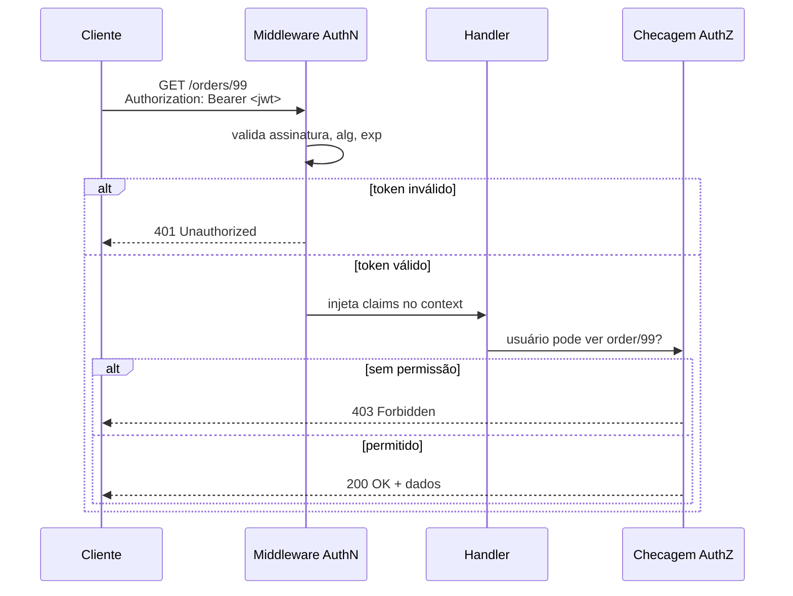
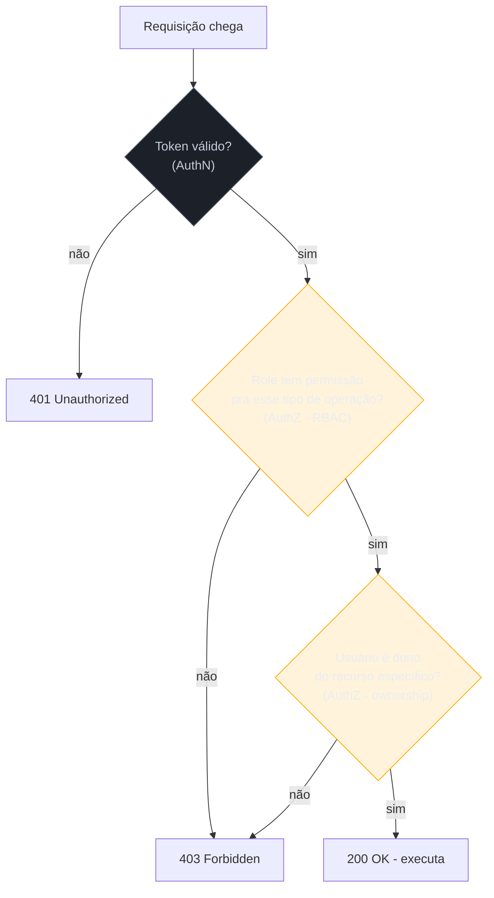

# AuthN e AuthZ em serviços Go

> [!abstract] TL;DR
> Autenticação (**quem é você**) e autorização (**o que você pode fazer**) são dois problemas distintos, e a maioria dos bugs de segurança em serviços Go nasce de confundi-los. Este capítulo cobre a parte que fica do lado do código Go, não do protocolo: validar um JWT recebido de forma correta (assinatura, `alg`, expiração — nunca `ParseUnverified`), plugar essa validação num middleware `net/http` que enriquece o `context.Context` com a identidade, e checar permissões com um RBAC simples baseado em roles/claims. O protocolo em si — OAuth 2.1, OIDC, fluxos de emissão de token, PKCE, refresh tokens — é assunto da trilha Auth e Identidade; aqui o token já chegou pronto na sua API, e a pergunta é "como eu valido isso sem abrir um buraco".

## O cenário: duas perguntas, um header

Um handler HTTP recebe uma requisição com `Authorization: Bearer eyJhbG...`. Duas perguntas separadas precisam de resposta antes de executar qualquer lógica de negócio:

1. **Quem está fazendo essa chamada?** (autenticação — *authentication*, AuthN)
2. **Essa pessoa pode fazer *isso* especificamente?** (autorização — *authorization*, AuthZ)

É tentador tratar as duas como uma coisa só — "se o token é válido, deixa passar" — mas isso é exatamente o erro que produz vulnerabilidades de *broken access control*, item consistentemente no topo do OWASP Top 10. Um token válido prova identidade. Não prova permissão. Um usuário autenticado como `user_42` tem um JWT perfeitamente válido; isso não significa que ele pode deletar o pedido `order_99` de outro usuário. Confundir "token válido" com "operação permitida" é o bug mais comum desta área — e ele nunca aparece nos testes felizes, só quando alguém tenta acessar o recurso errado de propósito.



Repare nos dois códigos de status diferentes: `401` quando a identidade não pôde ser estabelecida (token ausente, expirado, assinatura inválida); `403` quando a identidade foi estabelecida mas a operação é proibida. Devolver `401` para os dois casos é um erro comum que confunde clientes de API — e às vezes vaza informação (um `404` disfarçado de `401` para "recurso não existe" é diferente de "você não pode ver esse recurso").

## Validando um JWT corretamente

Um JSON Web Token é três partes separadas por `.` — header, payload, assinatura — cada uma codificada em Base64URL. A parte perigosa não é decodificar (isso é trivial); é **verificar a assinatura antes de confiar em qualquer claim do payload**. Um JWT não verificado é só um JSON que o cliente pode ter escrito à mão.

> [!warning] Nunca use `jwt.ParseUnverified` em código de produção
> A biblioteca `github.com/golang-jwt/jwt/v5` (sucessora mantida da antiga `dgrijalva/jwt-go`, hoje arquivada) expõe `ParseUnverified` — que decodifica o token **sem checar a assinatura**. Existe para depuração e inspeção, não para autenticação. Se seu middleware usa `ParseUnverified` e depois olha pro claim `role`, qualquer cliente pode forjar um token com `role: "admin"` e uma assinatura qualquer — o middleware nunca vai notar, porque nunca checou se a assinatura bate com a chave do servidor. Use sempre `jwt.Parse` (ou `ParseWithClaims`) passando uma `keyfunc` que devolve a chave real.

O segundo erro clássico de validação de JWT é confiar cegamente no campo `alg` do header. O algoritmo de assinatura vem *dentro* do token — controlado pelo emissor original, mas também visível (e, sem cuidado, manipulável) por quem constrói a requisição. Um ataque documentado contra bibliotecas JWT descuidadas é o **algorithm confusion**: o atacante troca o header para `alg: "none"` (token sem assinatura nenhuma) ou, em bibliotecas que misturam chaves simétricas e assimétricas, troca `RS256` por `HS256` e assina o token usando a **chave pública RSA do servidor** como se fosse uma chave secreta HMAC — chave pública essa que, por definição, é pública. Se o código de validação não fixar o algoritmo esperado, ele valida a assinatura falsa como se fosse legítima.

```go
package auth

import (
    "errors"
    "fmt"

    "github.com/golang-jwt/jwt/v5"
)

var chaveSecreta = []byte("troque-por-um-segredo-de-verdade-vindo-de-secret-manager")

type MinhasClaims struct {
    UserID string   `json:"sub"`
    Roles  []string `json:"roles"`
    jwt.RegisteredClaims
}

func ValidarToken(tokenString string) (*MinhasClaims, error) {
    claims := &MinhasClaims{}

    token, err := jwt.ParseWithClaims(tokenString, claims, func(t *jwt.Token) (interface{}, error) {
        // Trava o algoritmo esperado — recusa qualquer coisa que não seja HMAC.
        // Sem isso, um atacante pode forçar "alg: none" ou trocar RS256 por HS256.
        if _, ok := t.Method.(*jwt.SigningMethodHMAC); !ok {
            return nil, fmt.Errorf("algoritmo inesperado: %v", t.Header["alg"])
        }
        return chaveSecreta, nil
    }, jwt.WithValidMethods([]string{"HS256"}))

    if err != nil {
        return nil, fmt.Errorf("token inválido: %w", err)
    }
    if !token.Valid {
        return nil, errors.New("token não é válido")
    }

    return claims, nil
}
```

> [!info] `jwt.WithValidMethods` (golang-jwt v5)
> A partir da v5 de `golang-jwt/jwt`, o parser aceita `jwt.WithValidMethods([]string{"HS256"})` como opção explícita — reforço redundante e intencional sobre a checagem manual dentro da `keyfunc`. Duas camadas de defesa contra algorithm confusion são mais baratas que uma vulnerabilidade em produção.

Além da assinatura e do algoritmo, três claims temporais merecem checagem explícita — a biblioteca já valida `exp` (expiração) e `nbf` (*not before*) automaticamente ao usar `RegisteredClaims`, mas vale saber o que está sendo verificado por baixo:

- `exp` (*expiration*) — token expirado é rejeitado. Tokens de acesso de vida curta (minutos, não dias) limitam o estrago de um token vazado.
- `nbf` (*not before*) — token que ainda não é válido é rejeitado; raro na prática, mas existe.
- `iat` (*issued at*) — quando presente, ajuda a detectar tokens emitidos com timestamp suspeito, embora a biblioteca não rejeite automaticamente por isso.

> [!warning] Comparação de segredo HMAC não é o problema — comparação de token bruto, sim
> Se em algum ponto do seu código você comparar um token (ou um segredo derivado dele) usando `==` ou `bytes.Equal` fora do fluxo de verificação de assinatura da biblioteca — por exemplo, para checar uma API key estática — use `crypto/subtle.ConstantTimeCompare` (assunto da [[02 - crypto na stdlib]]) em vez de comparação direta, para não abrir um *timing attack*. A validação de assinatura HMAC dentro de `golang-jwt` já faz isso internamente; o risco aparece quando você reimplementa uma comparação de segredo à mão em outro lugar do serviço.

### `aud` e `iss`: validar para quem e de quem é o token

Assinatura correta e expiração não válida ainda deixam uma pergunta em aberto: esse token foi emitido *para o seu serviço*, por um emissor *em quem você confia*? Num ecossistema com vários serviços e um Identity Provider central (o cenário mais comum quando o token vem de fora, via OAuth/OIDC — trilha Auth e Identidade), um token emitido legitimamente para o serviço A pode, sem essas checagens, ser aceito também pelo serviço B — um problema conhecido como *token confusion* entre audiências.

```go
func ValidarTokenComAudienceEIssuer(tokenString, audienceEsperada, issuerEsperado string) (*MinhasClaims, error) {
    claims := &MinhasClaims{}

    token, err := jwt.ParseWithClaims(tokenString, claims, func(t *jwt.Token) (interface{}, error) {
        if _, ok := t.Method.(*jwt.SigningMethodHMAC); !ok {
            return nil, fmt.Errorf("algoritmo inesperado: %v", t.Header["alg"])
        }
        return chaveSecreta, nil
    },
        jwt.WithValidMethods([]string{"HS256"}),
        jwt.WithAudience(audienceEsperada), // rejeita token emitido para outro serviço
        jwt.WithIssuer(issuerEsperado),     // rejeita token emitido por emissor não confiável
    )

    if err != nil {
        return nil, fmt.Errorf("token inválido: %w", err)
    }
    if !token.Valid {
        return nil, errors.New("token não é válido")
    }
    return claims, nil
}
```

`jwt.WithAudience` e `jwt.WithIssuer` (golang-jwt v5) fazem a biblioteca rejeitar automaticamente tokens cujos claims `aud`/`iss` não batem com o esperado — sem isso, a validação checa só "esse token foi assinado por alguém que conhece a chave", o que num sistema com múltiplos consumidores da mesma chave (ou do mesmo IdP) não é suficiente para saber se o token era *para você*.

## Middleware de autenticação

Com a validação isolada numa função, o próximo passo é plugá-la num middleware `net/http` — a peça que intercepta toda requisição antes do handler, extrai o token, valida, e injeta a identidade no `context.Context` para os handlers downstream consumirem sem repetir a lógica.

```go
package auth

import (
    "context"
    "net/http"
    "strings"
)

type contextKey string

const claimsContextKey contextKey = "claims"

func MiddlewareAuth(next http.Handler) http.Handler {
    return http.HandlerFunc(func(w http.ResponseWriter, r *http.Request) {
        authHeader := r.Header.Get("Authorization")
        if authHeader == "" {
            http.Error(w, "authorization header ausente", http.StatusUnauthorized)
            return
        }

        partes := strings.SplitN(authHeader, " ", 2)
        if len(partes) != 2 || partes[0] != "Bearer" {
            http.Error(w, "formato esperado: Bearer <token>", http.StatusUnauthorized)
            return
        }

        claims, err := ValidarToken(partes[1])
        if err != nil {
            http.Error(w, "token inválido", http.StatusUnauthorized)
            return
        }

        // Claims validadas viajam no context — não em variável global,
        // não em campo de struct compartilhado entre goroutines/requisições.
        ctx := context.WithValue(r.Context(), claimsContextKey, claims)
        next.ServeHTTP(w, r.WithContext(ctx))
    })
}

func ClaimsDoContexto(ctx context.Context) (*MinhasClaims, bool) {
    claims, ok := ctx.Value(claimsContextKey).(*MinhasClaims)
    return claims, ok
}
```

> [!warning] `context.WithValue` com chave `string` crua é um bug de colisão esperando pra acontecer
> Se duas partes independentes do código usarem `context.WithValue(ctx, "claims", x)` com a mesma string literal como chave, uma pode sobrescrever silenciosamente o valor da outra — strings são comparadas por valor, então `"claims"` de um pacote colide com `"claims"` de outro. A convenção idiomática, usada acima, é declarar um tipo próprio e não-exportado (`type contextKey string`) só para as chaves de contexto do pacote — isso torna a chave de `auth` inconfundível com a de qualquer outro pacote, mesmo que o texto visível seja o mesmo.

O registro do novo `http.ServeMux` (desde Go 1.22) simplifica a composição de middleware com padrões de rota, mas o encadeamento em si continua sendo função-que-recebe-`http.Handler`-e-devolve-`http.Handler` — o padrão não mudou:

```go
mux := http.NewServeMux()
mux.HandleFunc("GET /orders/{id}", handlerVerPedido)

// Aplica o middleware de auth em cima do mux inteiro.
handler := MiddlewareAuth(mux)

http.ListenAndServe(":8080", handler)
```

> [!info] `http.ServeMux` com padrões de método e wildcards — Go 1.22
> `"GET /orders/{id}"` só funciona a partir do `net/http` do Go 1.22 — antes disso, o `ServeMux` padrão não distinguia método HTTP nem tinha wildcards de path (`{id}`), e era comum recorrer a um router de terceiros só por isso (`gorilla/mux`, `chi`). Com 1.22+, muitos serviços simples dispensam a dependência externa.

## RBAC simples: checando permissão depois da identidade

Uma vez que o middleware garantiu a identidade, a autorização é responsabilidade do **handler** (ou de outro middleware, mais específico por rota) — nunca do middleware genérico de autenticação, que não sabe nada sobre a regra de negócio de cada endpoint. RBAC (*Role-Based Access Control*) na sua forma mais simples é: cada usuário tem uma ou mais roles; cada operação exige uma role mínima; checa-se a interseção.

```go
package auth

import "slices"

// TemRole checa se as claims do usuário incluem a role exigida.
func TemRole(claims *MinhasClaims, roleExigida string) bool {
    return slices.Contains(claims.Roles, roleExigida)
}
```

> [!info] Pacote `slices` — stdlib desde Go 1.21
> `slices.Contains` substitui o laço manual `for _, r := range claims.Roles { if r == roleExigida {...} }` que era necessário antes de existir um pacote genérico de utilitários de slice na stdlib. Junto com `maps` (também 1.21), fechou uma lacuna que projetos preenchiam com `golang.org/x/exp/slices` ou implementações próprias.

Um middleware específico de rota, construído em cima de `MiddlewareAuth`, aplica a checagem antes do handler de negócio:

```go
func ExigeRole(roleExigida string, next http.HandlerFunc) http.HandlerFunc {
    return func(w http.ResponseWriter, r *http.Request) {
        claims, ok := ClaimsDoContexto(r.Context())
        if !ok {
            http.Error(w, "não autenticado", http.StatusUnauthorized)
            return
        }
        if !TemRole(claims, roleExigida) {
            http.Error(w, "sem permissão para essa operação", http.StatusForbidden)
            return
        }
        next(w, r)
    }
}

// Uso: só quem tem role "admin" chega no handler de fato.
mux.HandleFunc("DELETE /orders/{id}", ExigeRole("admin", handlerDeletarPedido))
```

RBAC por role resolve o caso "só admins podem deletar pedidos" — mas não resolve, sozinho, o caso mais comum e mais perigoso na prática: "o usuário `user_42` só pode ver *os próprios* pedidos, não os de `user_99`". Isso não é uma questão de role — os dois são `role: "user"` igualmente válida. É uma checagem de **ownership**, feita dentro do handler, comparando o `UserID` das claims com o dono do recurso buscado no banco:

```go
func handlerVerPedido(w http.ResponseWriter, r *http.Request) {
    claims, _ := ClaimsDoContexto(r.Context())
    pedidoID := r.PathValue("id")

    pedido, err := buscarPedido(pedidoID)
    if err != nil {
        http.Error(w, "pedido não encontrado", http.StatusNotFound)
        return
    }

    // Checagem de ownership: token válido não é suficiente,
    // precisa ser o dono do recurso (ou ter role que dispense a checagem).
    if pedido.UserID != claims.UserID && !TemRole(claims, "admin") {
        http.Error(w, "sem permissão para ver esse pedido", http.StatusForbidden)
        return
    }

    responderJSON(w, pedido)
}
```

> [!warning] Broken Object Level Authorization (BOLA/IDOR) — o bug mais comum em APIs REST
> Esquecer a checagem de ownership acima — validar só que o token é válido, sem confirmar que o recurso pertence a quem pede — é a causa mais comum de vazamento de dados em APIs REST, catalogada como *Broken Object Level Authorization* (API1 no OWASP API Security Top 10) e, historicamente, como IDOR (*Insecure Direct Object Reference*). O padrão de ataque é trivial: trocar `/orders/42` por `/orders/43` na URL e ver se o servidor devolve o pedido de outra pessoa. RBAC por role não protege contra isso — só a checagem explícita de ownership, por recurso, protege.



## Amarrando tudo: um serviço mínimo completo

Os pedaços anteriores fazem mais sentido vistos juntos, como o `main` de um serviço pequeno teria de fato — middleware de autenticação envolvendo o mux, `ExigeRole` protegendo a rota de escrita, checagem de ownership dentro do handler de leitura:

```go
package main

import (
    "log"
    "net/http"
)

func main() {
    mux := http.NewServeMux()

    mux.HandleFunc("GET /orders/{id}", handlerVerPedido)
    mux.HandleFunc("DELETE /orders/{id}", ExigeRole("admin", handlerDeletarPedido))

    // MiddlewareAuth roda para toda rota registrada no mux —
    // AuthN é transversal; AuthZ (role e ownership) é decidida por rota/handler.
    handler := MiddlewareAuth(mux)

    log.Println("ouvindo em :8080")
    if err := http.ListenAndServe(":8080", handler); err != nil {
        log.Fatal(err)
    }
}

func handlerDeletarPedido(w http.ResponseWriter, r *http.Request) {
    pedidoID := r.PathValue("id")
    if err := deletarPedido(pedidoID); err != nil {
        http.Error(w, "falha ao deletar", http.StatusInternalServerError)
        return
    }
    w.WriteHeader(http.StatusNoContent)
}
```

A ordem das camadas importa e é sempre a mesma: **AuthN primeiro (transversal, no middleware mais externo), AuthZ por role em seguida (middleware específico da rota, quando a regra é simples o bastante para isso), ownership por último (dentro do handler, porque só o handler sabe qual recurso específico está em jogo depois de consultar o banco)**. Inverter essa ordem — por exemplo, checar ownership antes de confirmar que o token é válido — desperdiça uma consulta ao banco para requisições que nem deveriam ter chegado lá, e em casos mais graves pode vazar a existência de um recurso (`404` vs `403`) para quem nem deveria estar autenticado.

## Vindo de outras linguagens

| Vindo de... | Em Go |
|---|---|
| Java/Spring Security (`@PreAuthorize`, filter chain declarativa) | Middleware explícito, sem anotação — cada checagem é uma chamada de função visível no código, não um aspecto tecido por framework |
| Node/Express (`passport.js`, middleware de terceiros) | `net/http` middleware é só `func(http.Handler) http.Handler` — o padrão é da stdlib, bibliotecas como `golang-jwt` cobrem só o parsing do token |
| Python/Django REST Framework (`permission_classes`) | Sem decorator declarativo padrão; a checagem de role/ownership é código Go explícito dentro do handler ou de um middleware de rota |

Nas três linguagens, o risco de BOLA/IDOR é o mesmo — é um erro de lógica de negócio, não de linguagem ou framework. Framework nenhum resolve sozinho "cheque se o usuário é dono do recurso"; isso é sempre código que alguém precisa escrever.

## A fronteira com a trilha Auth e Identidade

Esta nota parou deliberadamente na fronteira de "validar um token que já chegou pronto". Tudo que acontece **antes** disso — como o token foi emitido, o fluxo que o cliente seguiu para obtê-lo, e como um servidor de autorização decide o que colocar dentro do JWT — é o assunto inteiro da trilha Auth e Identidade: OAuth 2.1 e seus fluxos (Authorization Code com PKCE, Client Credentials), OpenID Connect por cima do OAuth para identidade (não só autorização), a diferença entre token de acesso e token de identidade (`id_token`), rotação e revogação de refresh tokens, e o papel de um Identity Provider como Keycloak coordenando tudo isso. Se o seu serviço Go só *recebe e valida* um JWT emitido por outro sistema — o caso mais comum em arquiteturas de microsserviços — este capítulo já cobre o que você precisa. Se o seu serviço *é* o servidor de autorização, ou precisa implementar um fluxo OAuth do zero, a trilha Auth e Identidade é o próximo destino, não esta nota.

## Como explicar em inglês

> Authentication answers "who are you"; authorization answers "what can you do" — conflating the two is the root cause of most access-control bugs. Validating a JWT correctly means verifying the signature against a trusted key, pinning the expected algorithm (never trusting the `alg` header blindly — that's how algorithm confusion attacks work), and checking `exp`/`nbf`. A `net/http` middleware wraps the handler chain, validates the bearer token, and injects the verified claims into the request's `context.Context` using an unexported key type to avoid collisions. Role-based access control (RBAC) checks whether a role is allowed to perform an operation class, but it does **not** replace an explicit ownership check per resource — skipping that check is Broken Object Level Authorization (BOLA/IDOR), one of the most common REST API vulnerabilities. Everything upstream of "a valid token arrived" — issuance flows, OAuth 2.1, OpenID Connect, refresh token rotation — belongs to identity and access management as a discipline, not to this service-level code.

| Termo PT | Termo EN |
|---|---|
| autenticação | authentication (AuthN) |
| autorização | authorization (AuthZ) |
| controle de acesso baseado em role | role-based access control (RBAC) |
| dono do recurso / posse | ownership |
| autorização quebrada em nível de objeto | Broken Object Level Authorization (BOLA) |
| referência direta insegura a objeto | Insecure Direct Object Reference (IDOR) |
| confusão de algoritmo | algorithm confusion |
| token de acesso | access token |
| claims | claims |
| middleware | middleware |

## O que vem a seguir

Esta é a última nota do Galho 19 — Segurança. As oito notas juntas cobriram o panorama (nota 01), a crypto de baixo nível da stdlib (nota 02), TLS em trânsito (nota 03), validação de input (nota 04), supply chain com `govulncheck` (nota 05), secrets e configuração (nota 06), *secure coding patterns* (nota 07) e, agora, AuthN/AuthZ em nível de aplicação. O próximo destino da trilha muda de eixo: o **Galho 20 — Go idiomático** deixa de olhar para "como não quebrar o serviço" e passa a olhar para "como escrever Go que outro dev Go reconhece como bem escrito" — convenções de projeto, `gofmt`/`golangci-lint`, organização de pacotes, e os idiomas que a comunidade convergiu ao longo de mais de uma década de linguagem em produção.

## Veja também

- [[01 - Segurança em Go — o panorama]] — mapa do galho inteiro, incluindo onde AuthN/AuthZ se encaixa no quadro geral
- [[02 - crypto na stdlib]] — `crypto/subtle.ConstantTimeCompare` e outras primitivas usadas aqui
- [[04 - Validação e sanitização de input]] — validar o corpo da requisição depois que a identidade já foi checada
- [[06 - Secrets e configuração segura]] — onde a chave de assinatura do JWT deveria morar de verdade (nunca em código)
- [[07 - Secure coding patterns]] — padrões defensivos gerais que se aplicam também a handlers de auth
- [[03-Dominios/Tecnologia/Go/index|Trilha Go]]

## Fontes

- golang-jwt maintainers. *golang-jwt/jwt — JSON Web Tokens for Go*. GitHub. https://github.com/golang-jwt/jwt (acessado em 2026-07-18)
- The Go Authors. *Package context*. pkg.go.dev. https://pkg.go.dev/context (acessado em 2026-07-18)
- The Go Authors. *Package net/http*. pkg.go.dev. https://pkg.go.dev/net/http (acessado em 2026-07-18)
- The Go Authors. *Package slices*. pkg.go.dev. https://pkg.go.dev/slices (acessado em 2026-07-18)
- The Go Authors. *Routing Enhancements for Go 1.22*. go.dev/blog. https://go.dev/blog/routing-enhancements (acessado em 2026-07-18)
- OWASP Foundation. *API Security Top 10 — API1:2023 Broken Object Level Authorization*. owasp.org. https://owasp.org/API-Security/editions/2023/en/0xa1-broken-object-level-authorization/ (acessado em 2026-07-18)
