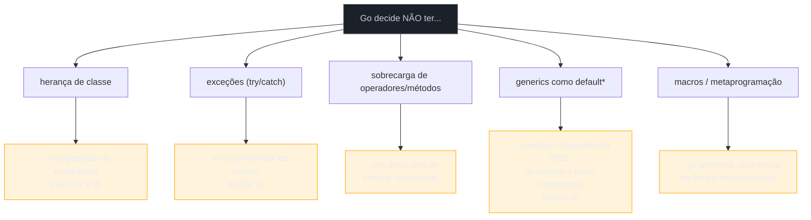
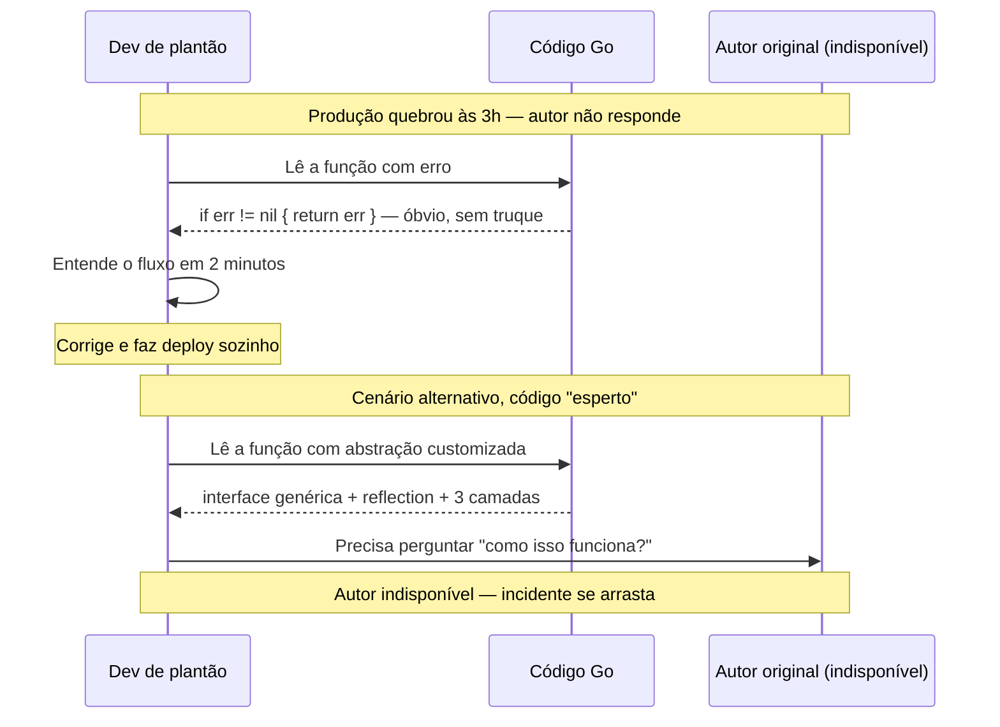

# Effective Go e a cultura

> [!abstract] TL;DR
> **Effective Go** é o documento que a própria equipe do Go escreveu para dizer, sem meias palavras, "é assim que se escreve Go" — e vale a pena lê-lo não como referência de sintaxe, mas como manifesto cultural. O eixo central é **"less is more"**: menos recursos de linguagem, menos abstrações, menos formas de fazer a mesma coisa — trocado por mais legibilidade e mais previsibilidade em times grandes. Isso não é modéstia técnica; é a mesma decisão de design que tirou herança, exceções, generics-por-padrão e sobrecarga de operadores da linguagem desde o dia 1. Quem chega de Java, Python ou Node e tenta escrever Go "esperto" — genérico demais, abstrato demais, com camadas de indireção "por precaução" — está lutando contra a cultura, não com ela. Este capítulo abre o galho de síntese: não introduz mecanismo novo, relê o que os 19 galhos anteriores já ensinaram sob a lente de **por que a comunidade escreve assim**.

## O e-mail que virou constituição

Em 2009, quando Go foi anunciado, praticamente ninguém sabia como "código Go idiomático" deveria parecer — não havia comunidade, não havia convenção estabelecida, só uma linguagem nova com decisões de design pouco usuais (sem herança, sem exceções, com `error` como valor de retorno comum). Rob Pike, um dos criadores, escreveu um documento longo chamado [Effective Go](https://go.dev/doc/effective_go) para preencher esse vazio: não um tutorial de sintaxe, mas um guia de **estilo e filosofia** — como nomear, como organizar, como pensar sobre concorrência, quando usar ponteiro, quando não.

Quinze anos depois, o documento envelheceu em alguns detalhes técnicos (a seção de generics não existia até 2022, por exemplo), mas o núcleo filosófico permanece a referência canônica. Não é coincidência que times de Go em produção — do Google ao menor startup — convirjam para um estilo parecido de código, mesmo sem nunca terem trabalhado juntos. Isso não acontece por acaso em outras linguagens: dois times de Java sênior podem produzir bases de código radicalmente diferentes — um usando Streams e Optional em toda parte, outro preferindo loops explícitos; um com hierarquias profundas de interface, outro composição plana. Em Go, a variação é muito menor. Por quê?

A resposta curta: porque a própria linguagem foi desenhada para restringir as escolhas, e o Effective Go documentou explicitamente **qual escolha é a certa** quando a linguagem permite mais de uma. Isso é o oposto de "linguagem minimalista, estilo livre" — é "linguagem minimalista, estilo também prescrito".

## O princípio central: less is more

Se o Effective Go tivesse que ser resumido numa frase, seria: **prefira o caminho simples, mesmo que o caminho esperto exista**. Não é um slogan vago — é uma decisão que se repete em cada canto da linguagem e da biblioteca padrão:



Cada "não" do lado esquerdo é uma feature que outra linguagem oferece e Go recusou — ou adiou por mais de uma década, no caso dos generics. E cada recusa não é ausência gratuita: é uma aposta de que o código sem aquele recurso é **mais fácil de ler seis meses depois**, por alguém que não o escreveu.

Rob Pike resumiu essa filosofia numa palestra de 2015 chamada [Simplicity is Complicated](https://go.dev/talks/2015/simplicity-is-complicated.slide): simplicidade não é fácil de alcançar — exige recusar recursos que *pareceriam* úteis no curto prazo, para preservar a legibilidade no longo prazo. É trabalho duro dizer não a uma feature. É fácil dizer sim.

> [!question]- Isso não é só falta de recursos, uma limitação real da linguagem?
> Foi uma crítica comum nos primeiros anos — "Go não tem X" soava como lacuna, não decisão. Mas o histórico desmente isso: generics **chegaram** (Go 1.18, 2022) depois de anos de design cuidadoso, exatamente para não repetir os erros que a equipe via em Java (type erasure) e C++ (templates que explodem tempo de compilação). A ausência inicial não era incapacidade — era prudência: só adicionar um recurso quando o ganho de expressividade supera claramente o custo de complexidade. O mesmo raciocínio vale para `error` como valor: não é que Go "não descobriu" exceções, é que a equipe as considerou e rejeitou deliberadamente, por razões documentadas no próprio [FAQ da linguagem](https://go.dev/doc/faq#exceptions).

## Clareza é o valor terminal, não um meio

Uma frase do Effective Go que resume o critério de decisão em qualquer dúvida de estilo: o código deve ser **claro para o leitor**, não impressionante para quem o escreveu. Isso soa banal até você comparar com o incentivo oposto, comum em outras culturas de linguagem: "esperteza" (*cleverness*) como sinal de competência. Um one-liner denso em Python, um encadeamento longo de `Stream` em Java, um `reduce` com três `.map()` aninhados em JavaScript — todos podem ser lidos como demonstração de domínio da linguagem.

Go trata esperteza como cheiro de código, não virtude. A comunidade tem até um ditado informal, atribuído a vários veteranos do projeto: **"clear is better than clever"**. Na prática, isso aparece em escolhas concretas:

```go
// "Esperto" — comprime tudo numa expressão, força quem lê a decifrar
func classificar(idade int) string {
    return map[bool]string{true: "menor", false: "maior"}[idade < 18]
}

// Idiomático — óbvio na primeira leitura, sem indireção
func classificar(idade int) string {
    if idade < 18 {
        return "menor"
    }
    return "maior"
}
```

A segunda versão "perde" em densidade — mais linhas, nenhum truque de tabela-como-dicionário-booleano. Mas ganha em algo que a cultura Go valoriza mais: qualquer dev, júnior ou sênior, lê a função e sabe o que ela faz sem parar para reconstruir a lógica. Esse é o teste real de "idiomático": **não é "usa a sintaxe mais nova", é "não obriga o leitor a pensar mais do que o problema exige"**.

> [!warning] Idiomático não é sinônimo de "curto"
> Um erro comum de quem está aprendendo Go é confundir "código idiomático" com "código com menos caracteres". Às vezes o idiomático é mais verboso — `if err != nil { return err }` repetido a cada chamada é mais longo que um `try/catch` único envolvendo dez chamadas, mas é a forma que a comunidade Go considera correta (Galho 4 cobriu o porquê). O critério não é contagem de linhas — é quanto esforço mental o leitor gasta para confiar no que o código faz.

## Simplicidade sobre esperteza, em três decisões cotidianas

O Effective Go dá conselhos concretos que valem relembrar juntos, porque formam um padrão:

**1. Prefira `if` cedo com retorno antecipado a `if/else` aninhado.** Reduz o nível de indentação e deixa o "caminho feliz" alinhado à margem esquerda — o olho não precisa rastrear chaves abrindo e fechando.

```go
// Aninhado — cada validação empurra o código pra direita
func processar(id string) error {
    if id != "" {
        if len(id) <= 36 {
            // ... lógica real, enterrada dois níveis
            return nil
        } else {
            return errors.New("id muito longo")
        }
    } else {
        return errors.New("id vazio")
    }
}

// Idiomático — sai cedo dos casos de erro, lógica real na margem
func processar(id string) error {
    if id == "" {
        return errors.New("id vazio")
    }
    if len(id) > 36 {
        return errors.New("id muito longo")
    }
    // ... lógica real, sem indentação extra
    return nil
}
```

**2. Prefira interfaces pequenas, definidas do lado de quem consome.** `io.Reader` tem um método. `io.Writer` tem um método. A biblioteca padrão inteira é construída sobre interfaces de um ou dois métodos, compostas quando necessário (`io.ReadWriter`) — não sobre interfaces gigantes que tentam prever todo uso futuro. Esse assunto já teve capítulo dedicado no Galho 3; aqui ele reaparece como instância do mesmo princípio maior: menos superfície, mais composição.

**3. Prefira `gofmt` sem debate.** Go tomou uma decisão radical para uma comunidade de programadores: **não existe escolha de estilo de formatação**. `gofmt` formata automaticamente, sem configuração de indentação, chaves, ou quebra de linha — e todo código Go do planeta passa por ele. Isso elimina uma categoria inteira de discussão em code review ("tabs ou espaços?", "chave na mesma linha?") que consome tempo real em outras comunidades.

> [!info] `gofmt` é parte da toolchain desde o Go 1.0
> Não é um linter externo opcional como Prettier ou Black — é o comando `go fmt`, embutido na própria instalação do Go, e a expectativa da comunidade é que rode automaticamente no save do editor (todo plugin sério de Go para VS Code, GoLand ou Vim faz isso). Código que não passou por `gofmt` é reconhecível à primeira vista por qualquer dev Go — e tratado como sinal de descuido, não como estilo pessoal legítimo.

## Vindo de outra stack

| Vindo de... | Reflexo comum | Ajuste Go |
|---|---|---|
| Java | Criar hierarquia de classes/interfaces "por precaução", pensando em extensibilidade futura | Comece concreto; extraia interface só quando um segundo consumidor real precisar dela |
| Python | Escrever uma linha densa (comprehension aninhada, `lambda` encadeado) por elegância | Prefira a versão em vários passos, com nomes — Go pune compressão que exige releitura |
| JavaScript/Node | Configurar formatação no `.prettierrc`, debater estilo em PR | `gofmt` já decidiu; não há configuração, não há debate |
| Qualquer OO clássica | Tratar "menos recursos de linguagem" como limitação a contornar | Tratar como restrição deliberada — o ganho é em legibilidade de time, não em poder expressivo individual |

Essa tabela não é exaustiva nem prescritiva fora de Go — é só o ponto de partida mais rápido para quem já tem reflexos de outra linguagem e precisa desaprender alguns antes de escrever Go que pareça Go.

## "A little copying is better than a little dependency"

Um segundo ditado da cultura Go, também atribuído a Rob Pike, incomoda quem vem de ecossistemas obcecados por DRY (*Don't Repeat Yourself*): **"um pouco de cópia é melhor que uma pequena dependência"**. A leitura ingênua soa como heresia de engenharia — não é isso que todo curso de boas práticas ensina a evitar? A leitura correta é mais estreita: quando duas funções de dez linhas são *quase* iguais, mas não exatamente, extrair uma abstração compartilhada geralmente custa mais do que aceita — porque agora existem dois chamadores acoplados a uma terceira peça, e qualquer mudança de comportamento em um lado ameaça quebrar o outro silenciosamente.

```go
// Duas funções "quase iguais" — o instinto de outras linguagens é unificar
func validarEmailUsuario(s string) error {
    if !strings.Contains(s, "@") {
        return errors.New("email inválido")
    }
    return nil
}

func validarEmailFornecedor(s string) error {
    if !strings.Contains(s, "@") {
        return errors.New("email de fornecedor inválido")
    }
    return nil
}
```

A tentação é criar `validarEmailGenerico(s string, contexto string) error` para eliminar a duplicação de três linhas. Em Go, a resposta idiomática costuma ser: **deixe as duas funções como estão**, a menos que uma terceira apareça e a duplicação vire um padrão real, não uma coincidência de três linhas. Isso não é preguiça — é reconhecer que abstração prematura tem custo próprio (mais um nome pra memorizar, mais um ponto de acoplamento), e esse custo só compensa quando o padrão se confirma na prática, não na intuição de quem escreveu a primeira função.

> [!question]- Isso não contradiz DRY, um princípio tratado como fundamental em quase toda formação de engenharia?
> Contradiz a leitura absolutista de DRY, não o princípio original — que já falava de duplicação de *conhecimento*, não de duplicação textual. Três linhas de validação repetidas duas vezes não duplicam conhecimento de domínio nenhum digno de um nome próprio; duplicam sintaxe. Go pesa o custo de uma dependência interna nova (mais uma função no vocabulário do pacote, mais um ponto que qualquer leitor precisa entender antes de seguir o fluxo) contra o custo de algumas linhas repetidas — e, na maioria dos casos pequenos, decide que a repetição é mais barata de ler. A régua muda quando a lógica repetida é genuinamente complexa (parsing, cálculo com regras de negócio) — aí sim a extração compensa, porque agora há conhecimento real sendo duplicado, não só sintaxe.

## Por que isso importa mais em times grandes que em código solo

O Effective Go não foi escrito para convencer um dev sozinho a preferir clareza — foi escrito dentro do Google, para uma base de código que hoje passa de dois bilhões de linhas, mantida por milhares de engenheiros que nunca se falam diretamente. Nesse contexto, a pergunta relevante nunca é "esse código é elegante?" — é **"alguém que nunca viu esse arquivo consegue debugá-lo às 3 da manhã, sob pressão, sem perguntar ao autor original?"**



Esse é o argumento de fundo por trás de toda escolha estilística do Effective Go: não é gosto estético, é **redução de custo operacional em escala**. Uma linguagem que torna difícil escrever código obscuro é uma linguagem que reduz o tempo médio de resolução de incidente — porque qualquer engenheiro do time, não só quem escreveu o código, consegue lê-lo sob pressão. É o mesmo motivo pelo qual `gofmt` não é opcional: em milhares de repositórios, uma convenção de formatação única elimina uma fricção que, multiplicada por escala, custa tempo de engenharia real.

## Como explicar em inglês

> Effective Go is the language team's own style guide, and its central thesis is "less is more": fewer language features, fewer ways to do the same thing, traded for readability and predictability across large teams. This isn't modesty — it's the same design bet behind Go's refusal of inheritance, exceptions, operator overloading, and (for over a decade) generics. The community's guiding phrase is "clear is better than clever": code should optimize for the reader's cognitive load, not for showing off language mastery. That shows up in concrete habits — early returns instead of nested conditionals, small consumer-defined interfaces instead of speculative abstraction, and `gofmt` removing formatting debates entirely by making them non-configurable. Developers coming from Java, Python, or Node tend to bring reflexes — premature abstraction, dense one-liners, bikeshedding over style — that fight against, rather than work with, Go's culture.

| Termo PT | Termo EN |
|---|---|
| Go idiomático | idiomatic Go |
| menos é mais | less is more |
| claro é melhor que esperto | clear is better than clever |
| esperteza (de código) | cleverness |
| retorno antecipado | early return |
| abstração prematura | premature abstraction |
| formatação automática | automatic formatting |

## O que vem a seguir

"Less is more" também vale para os nomes que você escolhe — e Go tem convenções fortes e pouco óbvias sobre nomeação de pacotes, variáveis e funções que fogem do que Java ou Python ensinam. A [[02 - Naming e organização|próxima nota]] entra nesse terreno: por que `err` e não `error1`, por que pacotes se chamam `http` e não `HttpUtils`, e como o nome de um identificador em Go carrega informação que, em outras linguagens, vem de um comentário ou de um prefixo.

## Veja também

- [[02 - Naming e organização]] — próxima nota do galho
- [[03 - Composição sobre herança na prática]] — aplica "less is more" à ausência de herança
- [[04 - Erros comuns de quem vem de OO]] — reflexos de outra stack que quebram a cultura Go
- [[07 - Escrevendo Go que não parece Java]] — síntese final do galho, fecha o arco aberto aqui
- [[03-Dominios/Tecnologia/Go/index|Trilha Go]]

## Fontes

- The Go Authors. *Effective Go*. go.dev. https://go.dev/doc/effective_go (acessado em 2026-07-18)
- The Go Authors. *Frequently Asked Questions (FAQ) — Design*. go.dev. https://go.dev/doc/faq (acessado em 2026-07-18)
- Rob Pike. *Simplicity is Complicated* (palestra, dotGo 2015). go.dev. https://go.dev/talks/2015/simplicity-is-complicated.slide (acessado em 2026-07-18)
- The Go Authors. *gofmt*. go.dev. https://pkg.go.dev/cmd/gofmt (acessado em 2026-07-18)
- The Go Authors. *A Tour of Go — Basics*. go.dev. https://go.dev/tour/basics/1 (acessado em 2026-07-18)
