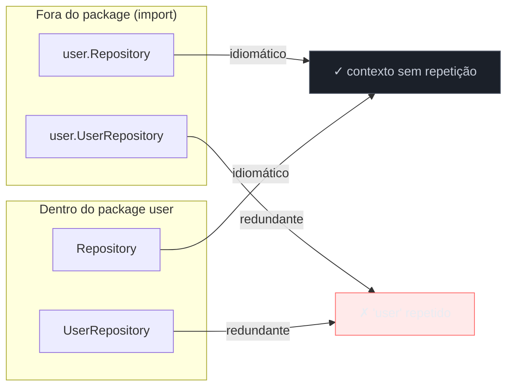
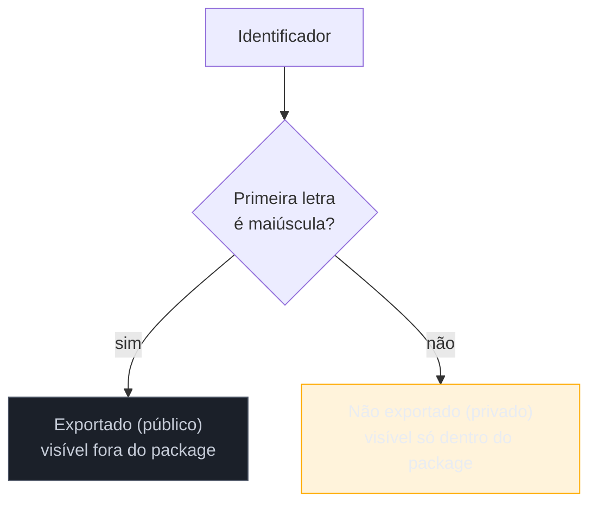

# Naming e organização

> [!abstract] TL;DR
> Go idiomático nomeia por **contexto do package**, não por auto-suficiência do identificador: dentro de `package point`, `X` e `Y` bastam, porque quem lê já escreve `point.X` — nomear `PointX` seria repetir informação que o próprio path do import já carrega. Go usa `MixedCaps` (ou `mixedCaps`) em vez de `snake_case`, e a **maiúscula inicial não é estilo — é a regra de exportação**: `Foo` é público, `foo` é privado ao package, sem `public`/`private` explícitos. Getters não levam prefixo `Get`: o campo `owner` vira o método `Owner()`, nunca `GetOwner()`. E nomes de package são curtos, minúsculos, sem underscore — o nome do package **é** parte do nome de tudo que ele exporta, então `strings.NewReplacer` já diz tudo; `stringutil.NewStringReplacer` estaria duplicando.

## O contexto já está ali — pare de repeti-lo

Imagine que você acabou de sair de um projeto Java grande, onde toda classe carrega prefixo por hábito: `UserRepository`, `UserService`, `UserValidator`, `UserController`. Faz sentido lá — em Java, o nome da classe é frequentemente a única pista de "com o que ela trabalha" quando você olha uma lista de imports ou um autocomplete solto.

Você chega em Go e escreve o mesmo reflexo:

```go
package user

type UserRepository struct{ /* ... */ }
type UserService struct{ /* ... */ }

func NewUserRepository() *UserRepository { /* ... */ }
```

Compila. Roda. E ainda assim, qualquer revisor Go experiente vai apontar o mesmo problema: **redundante**. Quem chama esse código de fora escreve `user.UserRepository` — o nome do package já apareceu, e agora `User` aparece de novo, colado no tipo. É o mesmo motivo por trás de piadas como "tela de ATM" (*Automated Teller Machine machine*) — a palavra se repete porque ninguém parou pra notar que o contexto ao redor já a dizia.

O [Effective Go](https://go.dev/doc/effective_go#package-names) é direto sobre isso: "o nome do pacote fornece o contexto para os nomes que ele contém". A versão idiomática:

```go
package user

type Repository struct{ /* ... */ }
type Service struct{ /* ... */ }

func NewRepository() *Repository { /* ... */ }
```

De fora, a chamada fica `user.Repository`, `user.Service`, `user.NewRepository()` — cada leitura já é auto-explicativa, sem palavra desperdiçada. De *dentro* do próprio package `user`, o ganho é ainda maior: lá dentro você nunca precisa do prefixo `user.` — é só `Repository`, ponto.



Essa é a lente que guia todo nome em Go: **um identificador nunca é lido isolado** — ele é sempre lido dentro de um package, seja o próprio (sem prefixo) ou um importado (com prefixo qualificado). Nomear pensando nisso é a diferença entre `io.Reader` (perfeito — "leitor de I/O", conciso e claro no ponto de uso) e um hipotético `io.IOReader` (redundante, ninguém escreve assim na stdlib).

> [!question]- E se o tipo precisar aparecer sem qualificação, por exemplo copiado e colado num teste?
> Aí o argumento muda — mas a stdlib mostra que Go aceita esse trade-off deliberadamente. `context.Context`, `http.Handler`, `json.Decoder`: nenhum desses repete o nome do package, mesmo sabendo que às vezes vai aparecer solto (`var ctx context.Context` é comum, mas ninguém escreveria `context.ContextValue`). A convenção prioriza o caso comum — código lido com o qualificador — sobre o caso raro de leitura fora de contexto.

## `MixedCaps`: a única convenção de capitalização que existe

Se você vem de Python (`snake_case` para funções e variáveis) ou de Ruby, o primeiro reflexo em Go é tentar `min_value`, `user_name`, `http_client`. Não compila — bom, compila, mas o `go vet` e qualquer linter reclamam, e a comunidade Go trata isso como erro de estilo tão básico quanto indentação errada em Python.

A regra, direto da especificação e do [Effective Go](https://go.dev/doc/effective_go#mixed-caps): Go usa `MixedCaps` ou `mixedCaps` — nunca underscore — para nomear identificadores multi-palavra.

```go
// Não idiomático (mas compila):
var user_name string
func get_http_client() *http.Client { /* ... */ }

// Idiomático:
var userName string
func getHTTPClient() *http.Client { /* ... */ }
```

Repare em `getHTTPClient`: siglas ficam **inteiramente maiúsculas ou inteiramente minúsculas**, nunca `Http` ou `getHttpClient`. `HTTP`, `URL`, `ID`, `API` — sempre em bloco. É por isso que a stdlib tem `http.Client`, `net/url.URL`, e por que um campo de identificador se chama `UserID`, nunca `UserId`. A [Google Go Style Guide](https://google.github.io/styleguide/go/decisions#initialisms) documenta essa convenção com uma lista de siglas comuns — útil de consultar quando bate a dúvida entre `Json` e `JSON` (é `JSON`).

`snake_case` não é proibido por regra de compilador — é proibido por convenção tão forte que quebrá-la sinaliza "não é Go nativo" a qualquer revisor. A única exceção tolerada, e mesmo assim rara, é em nomes de variáveis de teste geradas por ferramentas externas ou em constantes que espelham formato de arquivo externo (JSON com `snake_case`, por exemplo, ao fazer unmarshal — mas aí o `json:"..."` tag resolve sem forçar o nome do campo Go).

## Maiúscula inicial não é estilo — é a API pública

Aqui está a peça que mais surpreende quem vem de Java, C# ou TypeScript: Go **não tem** `public`, `private`, `protected`. A visibilidade de qualquer identificador — tipo, função, método, campo, variável, constante — é decidida por uma regra puramente sintática: **a primeira letra**.



```go
package config

type Settings struct {
    Timeout time.Duration // exportado — visível fora do package
    cache   map[string]any // não exportado — só dentro de config
}

func Load() *Settings { /* ... */ }  // exportado
func normalize(s string) string { /* ... */ } // não exportado
```

De fora, `config.Load()` e `config.Settings{}.Timeout` compilam. `config.normalize(...)` e `settings.cache` não compilam — o compilador recusa com `cache is not exported` (ou erro equivalente), não é uma convenção "de cavalheiros", é imposta pelo próprio *type checker*.

Isso muda a forma de pensar sobre design de API: em Java você decora com `public`/`private` depois de decidir a visibilidade; em Go, a decisão de visibilidade **é** o nome. Não existe "esqueci de marcar como privado" — o nome já é a marca. E não existe visibilidade intermediária tipo `protected` do Java (visível a subclasses) — Go não tem herança de classe, então a pergunta nem se coloca (o galho de composição, a [[03 - Composição sobre herança na prática|nota 03]], retoma esse ponto a fundo).

> [!warning] Exportar tudo "por segurança" é o oposto do idiomático
> É tentador, vindo de linguagens onde acessar um campo privado exige getter/setter explícito, simplesmente capitalizar tudo em Go para "não ter que pensar nisso depois". O efeito é o oposto do desejado: cada identificador exportado vira parte do contrato público do package — algo que consumidores externos podem passar a depender, e que você não pode mais renomear sem quebrar compatibilidade. A convenção Go é a inversa de "public by default": comece não exportado, exporte só o que precisa mesmo cruzar a fronteira do package. `go vet` e ferramentas de lint (assunto da [[05 - go vet, golangci-lint e ferramentas|nota 05]]) sinalizam identificadores exportados sem doc comment como um cheiro de API mal pensada.

## Sem `Get` em getters — o nome do campo já basta

Java e C# consagraram o padrão `getFoo()`/`setFoo()` como convenção universal de acesso encapsulado. Go rejeita metade dessa convenção explicitamente. O [Effective Go](https://go.dev/doc/effective_go#Getters) é direto:

> "Go doesn't provide automatic support for getters and setters. [...] if you have a field called `owner` (lower case, unexported), the getter method should be called `Owner` (upper case, exported), not `GetOwner`."

```go
type Server struct {
    owner string
    port  int
}

// Idiomático — sem prefixo Get:
func (s *Server) Owner() string {
    return s.owner
}

// Não idiomático — prefixo redundante:
func (s *Server) GetOwner() string {
    return s.owner
}

// Setter — aí sim, com Set:
func (s *Server) SetOwner(owner string) {
    s.owner = owner
}
```

`s.Owner()` já deixa claro, pela ausência de parênteses de argumento e pelo nome no `MixedCaps` de campo, que é um acessor. Adicionar `Get` não acrescenta informação — só ruído, e quebra a simetria elegante entre `owner` (campo privado) e `Owner()` (acessor público) que o par de capitalização já expressa sozinho.

Setters, por outro lado, **mantêm** o prefixo `Set` — porque aí a assimetria faz sentido: `Owner()` sem argumento é claramente leitura; um hipotético `Owner(novo string)` sem prefixo seria ambíguo (é leitura com parâmetro estranho, ou é escrita?). `SetOwner(novo string)` resolve a ambiguidade sem precisar de contexto adicional.

| | Convenção Java/C# | Convenção Go |
|---|---|---|
| Getter | `getOwner()` | `Owner()` |
| Setter | `setOwner(x)` | `SetOwner(x)` |
| Motivo do padrão | uniformidade sintática (todo acessor começa com verbo) | o par capitalização + ausência de prefixo já comunica o padrão |

> [!warning] Getters em Go muitas vezes nem deveriam existir
> Antes de escrever `Owner()`, pergunte se o campo não deveria simplesmente ser exportado direto (`Owner string`, maiúsculo). Getters fazem sentido quando há lógica de acesso (lazy loading, validação, campo derivado) — não como ritual automático "todo campo privado precisa de um getter público", hábito comum em Java por causa de frameworks e de convenção de JavaBeans. Em Go, se não há lógica nenhuma no acesso, exportar o campo é mais direto e mais idiomático que embrulhar em método.

## Nomes de package: curtos, minúsculos, sem underscore

O último nível de naming em Go — e talvez o mais visível de todos, porque aparece em todo `import` — é o nome do próprio package. O [Effective Go](https://go.dev/doc/effective_go#package-names) e o [blog oficial sobre package names](https://go.dev/blog/package-names) convergem nas mesmas regras:

- **Minúsculo, uma palavra só, sem underscore nem `mixedCaps`**: `bufio`, `strconv`, `net/http` (o path pode ter barra, mas cada componente é uma palavra minúscula), nunca `buf_io` ou `bufIO` ou `netHttp`.
- **Curto e evocativo**, não descritivo até o exagero: `strings`, não `stringutilities`; `os`, não `operatingsystem`.
- **O nome do package entra em todo identificador acessado de fora** — por isso `strings.NewReplacer`, não `strings.NewStringReplacer`; o "String" já está implícito em `strings.`.

```go
// Não idiomático:
package string_utils

func StringConcat(a, b string) string { return a + b }
// uso: string_utils.StringConcat(x, y) — repetitivo

// Idiomático:
package strs

func Concat(a, b string) string { return a + b }
// uso: strs.Concat(x, y) — enxuto
```

Repare que o exemplo idiomático nem precisou inventar um nome brilhante — só parou de repetir "string" em três lugares diferentes (nome do package, nome da função, e a palavra "string" dentro do nome da função) quando um bastava.

> [!info] `go vet` e `golangci-lint` cobrem parte disso automaticamente
> Ferramentas como `golangci-lint` (com o linter `revive` ou o antigo `golint`) detectam boa parte destas violações — sigla não uniforme (`Id` em vez de `ID`), getter com prefixo `Get`, package name com underscore. Elas não substituem entender o *porquê*, mas automatizam o *checar*. A [[05 - go vet, golangci-lint e ferramentas|nota 05]] deste galho cobre a ferramentagem em detalhe.

> [!warning] Nome de package plural é raro em Go
> Vindo de Java (`com.empresa.utils`, `models`, `services` — tudo plural por hábito) ou de convenções de pasta REST (`/users`, `/products`), o reflexo é nomear packages no plural. A stdlib Go prefere singular: `strings` e `errors` são exceções célebres (e mesmo assim, muita gente cita `strings` como contraexemplo do próprio guia); a norma dominante é `bytes`, não — espera, `bytes` também é plural. Na prática, a regra real é mais sutil que "sempre singular": o guia oficial recomenda evitar nomes genéricos tipo `util`, `common`, `helpers` (que viram "gaveta de miscelânea" sem coesão) mais do que bater na questão do plural. O critério que importa de fato: o nome deve descrever o que o package **oferece**, não uma categoria vaga do que ele **contém**.

## Vindo de outras linguagens

| Hábito de origem | Em Go |
|---|---|
| Java: `UserService`, `UserRepository` dentro de `package user` (redundante) | `Service`, `Repository` — o nome do package já dá o contexto |
| Java/C#: `public`/`private` explícitos | primeira letra maiúscula = exportado; regra sintática, não anotação |
| Java/C#: `getOwner()`/`setOwner(x)` | `Owner()` (sem `Get`) / `SetOwner(x)` (com `Set`) |
| Python: `snake_case` em toda variável e função | `MixedCaps`/`mixedCaps` sempre, sem underscore |
| Node/npm: nomes de pacote descritivos e compostos (`http-client-utils`) | package curto, uma palavra, sem hífen nem underscore |

## Como explicar em inglês

> Go naming leans hard on package context: since callers write `pkg.Name`, an identifier inside a package should never repeat the package's own name — `user.Repository`, not `user.UserRepository`. Capitalization has real semantics, not just style: Go has no `public`/`private` keywords, so an identifier's exported status is decided purely by whether its first letter is upper- or lowercase. Multi-word identifiers use `MixedCaps` or `mixedCaps`, never `snake_case`, and initialisms stay uniformly cased (`HTTP`, `ID`, `URL` — never `Http` or `Id`). Getters skip the `Get` prefix entirely: a field named `owner` gets an accessor named `Owner()`, not `GetOwner()` — the capitalization pair already signals "this is the exported accessor for that field." Setters keep `Set`, since dropping it there would be ambiguous. Package names themselves follow the same philosophy: short, lowercase, no underscores, and evocative enough that `strings.NewReplacer` reads naturally without ever needing the word "string" repeated inside the function name.

| Termo PT | Termo EN |
|---|---|
| identificador exportado | exported identifier |
| identificador não exportado | unexported identifier |
| nome de campo | field name |
| acessor / getter | accessor / getter |
| sigla | initialism |
| contexto do package | package context |
| convenção de nomenclatura | naming convention |
| redundância de nome | stuttering (name stutter) |

## O que vem a seguir

Naming e organização são a superfície mais visível do idiomatismo Go — a primeira coisa que um revisor nota antes mesmo de ler a lógica. Mas há uma camada mais estrutural embaixo: como Go modela relação entre tipos sem herança de classe, e por que tentar recriar hierarquia de herança em Go — hábito automático de quem vem de OO clássico — produz código que compila mas empurra contra a gramática da linguagem. A [[03 - Composição sobre herança na prática|nota 03]] entra nessa escolha de design a fundo, com o caso prático que mais aparece em code review: "por que não faço `Dog extends Animal`?".

## Veja também

- [[01 - Effective Go e a cultura|01 — Effective Go e a cultura]] — o documento-fonte por trás de boa parte destas convenções, e o porquê cultural de segui-las
- [[03 - Composição sobre herança na prática|03 — Composição sobre herança na prática]] — próxima nota do galho
- [[05 - go vet, golangci-lint e ferramentas|05 — go vet, golangci-lint e ferramentas]] — ferramentas que automatizam parte da checagem destas convenções
- [[03-Dominios/Tecnologia/Go/index|Trilha Go]]

## Fontes

- The Go Authors. *Effective Go — Names*. go.dev. https://go.dev/doc/effective_go#names (acessado em 2026-07-18)
- The Go Authors. *Effective Go — Getters*. go.dev. https://go.dev/doc/effective_go#Getters (acessado em 2026-07-18)
- The Go Authors. *Effective Go — Package names*. go.dev. https://go.dev/doc/effective_go#package-names (acessado em 2026-07-18)
- The Go Authors. *Package names*. go.dev/blog. https://go.dev/blog/package-names (acessado em 2026-07-18)
- Google. *Google Go Style Guide — Initialisms*. google.github.io. https://google.github.io/styleguide/go/decisions#initialisms (acessado em 2026-07-18)
- Go by Example. *Variables*. gobyexample.com. https://gobyexample.com/variables (acessado em 2026-07-18)
