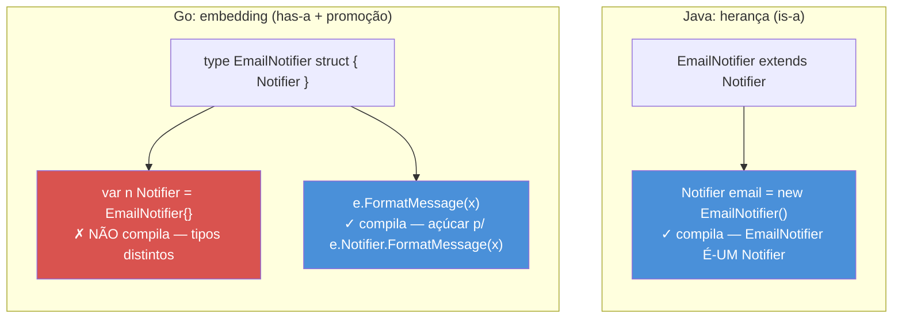
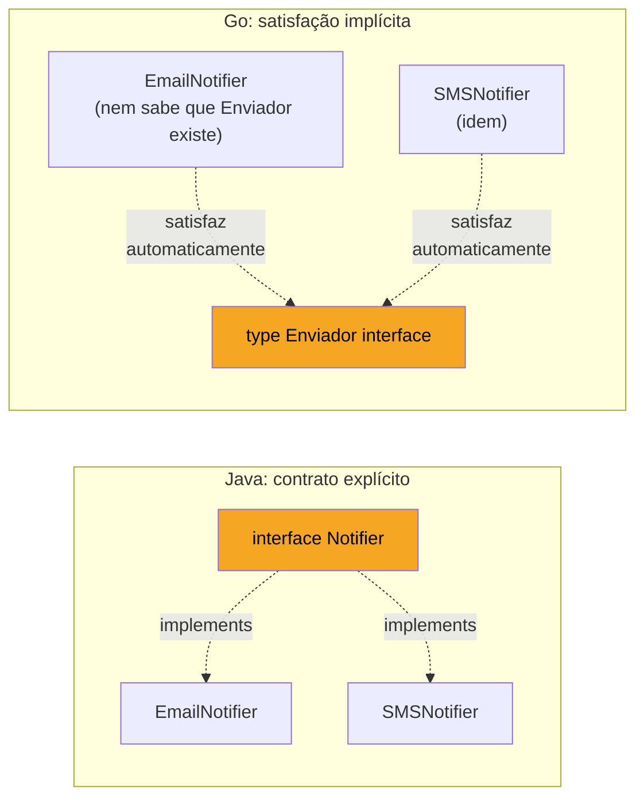

# Composição sobre herança na prática

> [!abstract] TL;DR
> Go não tem `extends`, `implements` nem hierarquia de classes — e isso não é uma lacuna a contornar, é a escolha de design central da linguagem. No lugar de herança, Go oferece dois mecanismos que se combinam: **embedding** (um struct "contém" outro e ganha seus métodos por promoção, sem `is-a` de verdade) e **interfaces pequenas, satisfeitas implicitamente** (comportamento definido pelo que um tipo *faz*, não pelo que ele *é*). Quem chega de Java tende a modelar `Dog extends Animal` e sofrer tentando replicar isso com embedding — o resultado é frágil porque embedding é composição disfarçada de herança visual, não a mesma coisa semanticamente. O padrão idiomático inverte a pergunta: em vez de "que hierarquia esse tipo pertence?", pergunte "que interface pequena esse ponto do código realmente precisa?".

## O reflexo de quem vem de OO clássico

Você acabou de migrar de Java para Go e o primeiro desafio real de design aparece: modelar um sistema de notificações com `EmailNotifier`, `SMSNotifier` e `PushNotifier`, todos compartilhando um pedaço de lógica comum (formatar a mensagem, registrar um log de envio).

Em Java, o reflexo é imediato: uma classe abstrata.

```java
abstract class Notifier {
    protected String formatMessage(String texto) { /* ... */ }
    protected void logEnvio(String destino) { /* ... */ }
    abstract void enviar(String destino, String texto);
}

class EmailNotifier extends Notifier {
    void enviar(String destino, String texto) { /* ... */ }
}
```

`EmailNotifier` *é um* `Notifier`. O compilador garante isso na declaração — `extends` é um contrato estático, verificado no momento em que a classe é escrita, e a relação vale para sempre, em qualquer lugar do programa.

Você tenta o mesmo desenho em Go, buscando o "equivalente" de `extends`:

```go
type Notifier struct {
    // campos comuns?
}

func (n Notifier) FormatMessage(texto string) string { /* ... */ return texto }
func (n Notifier) LogEnvio(destino string)            { /* ... */ }

type EmailNotifier struct {
    Notifier // embedding — "parece" herança
}

func (e EmailNotifier) Enviar(destino, texto string) { /* ... */ }
```

Compila. `EmailNotifier` ganha `FormatMessage` e `LogEnvio` de graça, promovidos do campo embutido `Notifier`. Visualmente é quase idêntico ao Java. E é exatamente aqui que a armadilha se fecha: **parece** herança, mas não se comporta como herança nos pontos que importam — e o resto desta nota é sobre onde essa diferença dói, e como desenhar em torno dela em vez de contra ela.

## Embedding não é herança: o que muda por baixo

A pergunta central: `EmailNotifier` "é um" `Notifier`, no sentido de Java? A resposta curta é não. Em Go, embedding é **composição com promoção sintática de métodos** — o compilador reescreve `e.FormatMessage(x)` como `e.Notifier.FormatMessage(x)` nos bastidores, mas `EmailNotifier` e `Notifier` continuam sendo dois tipos completamente distintos, sem relação de subtipagem alguma.



A consequência prática mais direta: em Java, você pode passar um `EmailNotifier` para qualquer lugar que espera `Notifier` — polimorfismo de subtipo, garantido pelo `extends`. Em Go, isso **não existe** por embedding:

```go
func processar(n Notifier) { /* ... */ }

e := EmailNotifier{}
processar(e) // erro de compilação:
// cannot use e (variable of type EmailNotifier) as Notifier value
```

`EmailNotifier` não satisfaz o "papel" de `Notifier` no sentido de atribuição direta, porque `Notifier` aqui é um **struct concreto**, não uma interface. Não há mecanismo de conversão implícita struct-para-struct em Go — nunca houve, e não é lacuna, é a linha que separa "reúso de implementação" (o que embedding faz) de "polimorfismo" (o que interfaces fazem). São dois problemas diferentes, e Go se recusa a resolvê-los com a mesma ferramenta.

> [!warning] Embedding de struct concreto não cria um supertipo
> Se o objetivo é "aceitar qualquer coisa que envie notificação", embedding de `Notifier` (struct) não resolve — ele só empresta métodos, não cria uma relação de tipo que o compilador reconheça em `func processar(n Notifier)`. O que resolve é uma **interface**, tratada na próxima seção.

## O que embedding resolve bem: reúso horizontal, sem hierarquia

Onde embedding brilha de verdade é em reúso de implementação **sem** a intenção de modelar uma taxonomia. O exemplo canônico da biblioteca padrão: `sync.Mutex` embutido para dar a um struct os métodos `Lock`/`Unlock` sem reescrevê-los:

```go
type Cache struct {
    sync.Mutex // embedding — Cache ganha Lock() e Unlock()
    dados map[string]string
}

func (c *Cache) Get(chave string) string {
    c.Lock()
    defer c.Unlock()
    return c.dados[chave]
}
```

`Cache` não "é um" `Mutex" — ninguém pensaria nisso como taxonomia. É pura composição: `Cache` *tem* um mutex, e pegar emprestado `Lock`/`Unlock` via embedding evita o boilerplate de `c.mutex.Lock()` em toda função. Esse é o uso idiomático: embedding para **delegar comportamento repetitivo e mecânico**, não para simular `is-a`.

O mesmo padrão aparece o tempo todo com embedding de **interfaces** (não estrutS) dentro de structs, para satisfazer parcialmente um contrato maior sem reimplementar tudo:

```go
type LoggingReader struct {
    io.Reader // embedding de interface
}

func (r LoggingReader) Read(p []byte) (int, error) {
    n, err := r.Reader.Read(p) // delega pro Reader embutido
    log.Printf("leu %d bytes", n)
    return n, err
}
```

`LoggingReader` embute a interface `io.Reader`, delega a chamada real e intercepta para logar — um wrapper que decora comportamento sem herdar hierarquia nenhuma. É o *decorator pattern* de Go, e não precisa de nome especial porque é só embedding fazendo o que embedding faz.

> [!info] Named struct types em Go 1.9+: aliases não mudam isso
> Desde a Go 1.9, `type X = Y` cria um **alias** (mesmo tipo, nome diferente) — diferente de `type X Y`, que cria um tipo novo e distinto. Aliases não interferem com a discussão desta nota: embedding continua sendo sobre composição de tipos distintos, alias é outro mecanismo (compatibilidade de renomeação em refactors grandes).

## Interfaces pequenas: o outro pilar

Se embedding resolve reúso de implementação, quem resolve polimorfismo — "aceitar qualquer coisa que se comporte de tal jeito" — são **interfaces**. E aqui a idiomaticidade tem uma regra que soa estranha para quem vem de Java: **prefira interfaces pequenas, de um ou dois métodos, definidas perto de quem as consome, não perto de quem as implementa**.

Voltando ao problema de notificação — o desenho idiomático não é uma hierarquia `Notifier` → `EmailNotifier`/`SMSNotifier`. É uma interface mínima:

```go
type Enviador interface {
    Enviar(destino, texto string) error
}

type EmailNotifier struct{ /* config SMTP */ }
func (e EmailNotifier) Enviar(destino, texto string) error { /* ... */ return nil }

type SMSNotifier struct{ /* config gateway SMS */ }
func (s SMSNotifier) Enviar(destino, texto string) error { /* ... */ return nil }

func processar(e Enviador, destino, texto string) error {
    return e.Enviar(destino, texto)
}
```

`EmailNotifier` e `SMSNotifier` não compartilham struct nenhum, não têm relação sintática entre si — e ainda assim ambos satisfazem `Enviador`, **implicitamente**, só por terem o método com a assinatura certa. `processar` não sabe, e não precisa saber, se recebeu um e-mail ou um SMS. É polimorfismo sem `extends`, sem `implements`, sem hierarquia.



Repare no detalhe que costuma escapar: `EmailNotifier` **nem precisa importar o pacote onde `Enviador` está declarado**. A satisfação de interface não é uma decisão do tipo que implementa — é uma constatação de quem *consome*. Isso inverte o fluxo de dependência de Java, onde a classe concreta precisa declarar `implements Notifier` e, portanto, depender do pacote da interface.

E daí vem a regra de ouro do design idiomático de interfaces, resumida no [Go Proverbs](https://go-proverbs.github.io/) de Rob Pike: **"the bigger the interface, the weaker the abstraction"**. A biblioteca padrão inteira é construída sobre interfaces de um método — `io.Reader` (`Read`), `io.Writer` (`Write`), `sort.Interface` (três métodos, e mesmo assim considerada "grande" para o padrão Go), `fmt.Stringer` (`String`). Quanto menor a interface, mais fácil qualquer tipo — inclusive tipos que você nem controla — a satisfaz sem esforço.

## O erro de importar hierarquia de Java para Go

O antipadrão mais comum de quem migra: desenhar uma interface `Animal` gigante, com todos os métodos que qualquer animal *poderia* precisar, e depois forçar cada tipo concreto a implementar tudo — o equivalente Go de uma classe base "Deus" com quinze métodos abstratos.

```go
// Antipadrão — interface "Java-like", grande e genérica demais
type Animal interface {
    Comer()
    Dormir()
    EmitirSom() string
    Mover()
    Reproduzir()
}

// EmailNotifier do exemplo anterior refeito do jeito errado:
type Notificador interface {
    Enviar(destino, texto string) error
    Formatar(texto string) string
    Logar(destino string)
    Validar(destino string) error
    Retry(tentativas int) error
}
```

Essa interface de cinco métodos força qualquer implementação nova — mesmo um `MockNotifier` de teste que só precisa de `Enviar` — a implementar (ou stubar) os outros quatro. É o mesmo problema que **Interface Segregation Principle** (o "I" do SOLID) já nomeia em OO clássico, só que em Go o custo de violar é sentido de forma mais direta: cada `struct` que quer satisfazer `Notificador` carrega peso morto.

O conserto idiomático é quebrar em interfaces de um método e compor no ponto de consumo, quando necessário:

```go
type Enviador interface {
    Enviar(destino, texto string) error
}

type Validador interface {
    Validar(destino string) error
}

// Quem precisa das duas capacidades compõe a interface no local de uso:
type NotificadorValidado interface {
    Enviador
    Validador
}

func processarComValidacao(nv NotificadorValidado, destino, texto string) error {
    if err := nv.Validar(destino); err != nil {
        return err
    }
    return nv.Enviar(destino, texto)
}
```

`NotificadorValidado` é ela mesma composição — de **interfaces**, dessa vez, via embedding de interface dentro de interface. O mesmo mecanismo sintático de embedding de struct, aplicado a um problema diferente: montar contratos maiores a partir de peças pequenas, só onde a combinação é de fato necessária.

> [!warning] Não declare a interface no pacote de quem implementa
> Reflexo de Java: colocar `Enviador` no mesmo pacote de `EmailNotifier`, "porque é lá que ele é implementado". Em Go, o padrão idiomático inverte isso — a interface deve morar **no pacote que a consome** (o `processar`, o cliente), não no pacote que a produz. Isso é literalmente o [Go Proverb](https://go-proverbs.github.io/) "accept interfaces, return structs": funções devem aceitar o tipo mais genérico que sirvam (uma interface pequena, definida perto de si) e retornar o tipo mais concreto que puderem (um struct real, não uma interface). Interfaces "de fábrica", pré-declaradas no pacote produtor "para o caso de alguém precisar", é um cheiro de design importado de Java que Go evita.

## Casos práticos: refazendo a hierarquia de Java em Go

**Cenário**: um sistema de processamento de pagamentos com `CreditCardPayment`, `PixPayment` e `BoletoPayment`. Em Java, a tentação é uma classe abstrata `Payment` com template method. Em Go, o desenho idiomático:

```go
package pagamento

import "fmt"

// Interface pequena, no pacote que consome.
type Processador interface {
    Processar(valorCentavos int) error
}

// Cada meio de pagamento é um tipo independente — sem hierarquia comum.
type CartaoCredito struct {
    Numero string
}

func (c CartaoCredito) Processar(valorCentavos int) error {
    fmt.Printf("cobrando R$%.2f no cartão %s\n", float64(valorCentavos)/100, c.Numero)
    return nil
}

type Pix struct {
    ChaveDestino string
}

func (p Pix) Processar(valorCentavos int) error {
    fmt.Printf("transferindo R$%.2f via Pix para %s\n", float64(valorCentavos)/100, p.ChaveDestino)
    return nil
}

// Função que consome a interface — não sabe, nem precisa saber, qual meio de pagamento é.
func Cobrar(p Processador, valorCentavos int) error {
    if valorCentavos <= 0 {
        return fmt.Errorf("valor inválido: %d", valorCentavos)
    }
    return p.Processar(valorCentavos)
}

func main() {
    _ = Cobrar(CartaoCredito{Numero: "**** 1234"}, 15000)
    _ = Cobrar(Pix{ChaveDestino: "fulano@banco.com"}, 5000)
}
```

Repare no que **não** existe: nenhum tipo base `Payment`, nenhum `abstract`, nenhum campo comum forçado em todo mundo. `CartaoCredito` e `Pix` são tipos totalmente independentes que só têm em comum a assinatura de `Processar`. Se depois surgir um `Boleto` com um campo `LinhaDigitavel` que os outros não têm, ele simplesmente declara o próprio struct e o próprio método — zero atrito com uma hierarquia que precisaria ser remodelada.

**Se houver comportamento genuinamente repetido** (não coincidência de assinatura, mas lógica idêntica), *aí* embedding entra — não para simular herança, mas para de fato compartilhar código:

```go
// Log de auditoria repetido em todo processador — candidato real a composição.
type auditoria struct {
    ultimoLog string
}

func (a *auditoria) registrar(msg string) {
    a.ultimoLog = msg
    fmt.Println("[audit]", msg)
}

type CartaoCredito struct {
    auditoria // embedding — reúso de implementação, não de taxonomia
    Numero    string
}

func (c *CartaoCredito) Processar(valorCentavos int) error {
    c.registrar(fmt.Sprintf("cobrança cartão %s", c.Numero))
    return nil
}
```

A diferença de intenção entre este `auditoria` embutido e o `Payment` abstrato de Java é sutil, mas decisiva: `auditoria` não define "o que `CartaoCredito` é" — define um pedaço de comportamento mecânico que várias coisas *não relacionadas* podem querer pegar emprestado. Não há pretensão de taxonomia nenhuma.

## Lente cross-stack: vindo de Java, C# ou Python

> [!info] Comparação não é pré-requisito — só um atalho para quem já pensa em termos de OO clássico
> | Vindo de... | Reflexo | Em Go, faça assim |
> |---|---|---|
> | Java/C# | `abstract class` + `extends` para hierarquia de tipos | Interface pequena + tipos concretos independentes; embedding só para reúso mecânico |
> | Java/C# | `implements Interface` explícito | Nada a declarar — satisfação implícita, verificada em tempo de compilação onde a interface é *usada* |
> | Java/C# | Interface "de fábrica" grande, no pacote da implementação | Interface pequena (1-2 métodos), declarada no pacote *consumidor* |
> | Python | *duck typing* dinâmico, checado em runtime (ou nem checado) | Mesma filosofia de "se anda como pato...", mas checada estaticamente pelo compilador — o melhor dos dois mundos |
> | Todos | `super.metodo()` para chamar implementação da classe pai | Não existe — se `EmailNotifier` embute `Notifier` e sobrescreve um método com o mesmo nome, `Notifier.FormatMessage` continua acessível via `e.Notifier.FormatMessage(...)`, explícito, sem palavra-chave especial |

## Armadilhas comuns

> [!warning] Confundir "promoção de método" com polimorfismo real
> `EmailNotifier` ganhar `FormatMessage` por embedding não significa que `EmailNotifier` pode ser usado onde `Notifier` (struct) é esperado. Promoção é conveniência de acesso a método; não cria relação de subtipo. Se você precisa de polimorfismo, a resposta é interface, nunca embedding de struct concreto.

> [!warning] Embedding múltiplo pode gerar ambiguidade silenciosa
> Se `EmailNotifier` embute dois tipos que ambos têm um método `Log()`, `e.Log()` não compila — `ambiguous selector e.Log`. Go não escolhe "o mais próximo" como em algumas linguagens com herança múltipla; exige que você desambigue explicitamente (`e.TipoA.Log()`). É um sintoma de que a composição ficou densa demais — geralmente sinal para repensar o desenho, não só para desambiguar.

> [!warning] Interface grande "por precaução" trava evolução
> Definir uma interface com todos os métodos que um tipo *poderia* precisar no futuro é o oposto do idiomático. Cada método a mais na interface é um método a mais que toda implementação futura (inclusive mocks de teste) precisa fornecer. Comece pequeno; componha interfaces maiores só no ponto de uso que realmente precisa da combinação.

## Como explicar em inglês

> Go has no class hierarchy, no `extends`, no `implements` — and that's a deliberate design choice, not a missing feature. Two mechanisms replace inheritance, and they solve different problems. **Embedding** lets one struct include another and get its methods promoted — that's implementation reuse, not subtyping: an `EmailNotifier` that embeds a `Notifier` struct still cannot be passed where a `Notifier` value is expected, because they remain distinct types with no compiler-recognized "is-a" relationship. **Interfaces**, satisfied implicitly by any type with the matching method set, are what give you real polymorphism — and the idiomatic style keeps them small (often a single method) and declares them in the *consuming* package, following the Go proverb "accept interfaces, return structs." The most common mistake for developers coming from Java or C# is porting an abstract-base-class mental model wholesale: building one large embedded struct or one large interface meant to represent a whole type hierarchy, instead of composing small, independent pieces only where the combination is actually needed.

| Termo PT | Termo EN |
|---|---|
| composição | composition |
| herança | inheritance |
| embedding | embedding |
| promoção de método | method promotion |
| satisfação implícita de interface | implicit interface satisfaction |
| interface pequena | small interface |
| relação is-a / has-a | is-a / has-a relationship |
| segregação de interface | interface segregation |
| polimorfismo | polymorphism |

## O que vem a seguir

Composição e interfaces pequenas resolvem a parte estrutural — mas o hábito de pensar em Java não some só porque o compilador aceita a sintaxe de embedding. A [[04 - Erros comuns de quem vem de OO|próxima nota]] cataloga os erros concretos e recorrentes de quem chega de linguagens OO clássicas: getters/setters desnecessários, exceptions onde deveria haver `error`, construtores `New*` mal desenhados, e outros reflexos que compilam mas soam "traduzidos" em vez de nativos.

## Veja também

- [[01 - Effective Go e a cultura|01 — Effective Go e a cultura]] — o pano de fundo cultural de onde vêm proverbs como "accept interfaces, return structs"
- [[02 - Naming e organização|02 — Naming e organização]] — convenções de nome que também moldam como interfaces pequenas são nomeadas (sufixo `-er`)
- [[04 - Erros comuns de quem vem de OO|04 — Erros comuns de quem vem de OO]] — próxima nota do galho
- [[03-Dominios/Tecnologia/Go/index|Trilha Go]]

## Fontes

- The Go Authors. *Effective Go — Embedding*. go.dev. https://go.dev/doc/effective_go#embedding (acessado em 2026-07-18)
- The Go Authors. *The Go Programming Language Specification — Interface types*. go.dev. https://go.dev/ref/spec#Interface_types (acessado em 2026-07-18)
- Rob Pike et al. *Go Proverbs*. go-proverbs.github.io. https://go-proverbs.github.io/ (acessado em 2026-07-18)
- The Go Authors. *A Tour of Go — Interfaces*. go.dev. https://go.dev/tour/methods/9 (acessado em 2026-07-18)
- Go by Example. *Interfaces*. gobyexample.com. https://gobyexample.com/interfaces (acessado em 2026-07-18)
