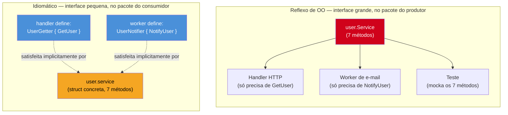
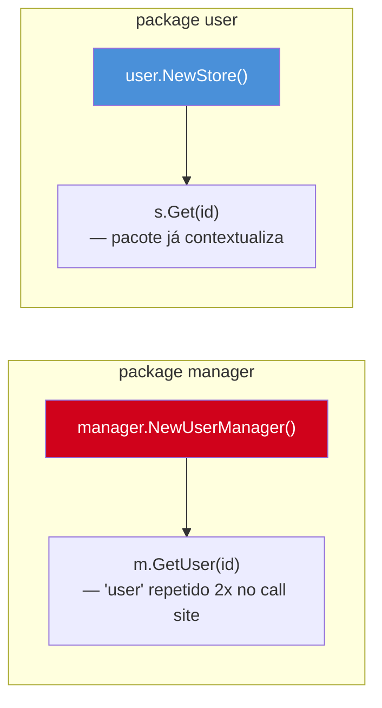
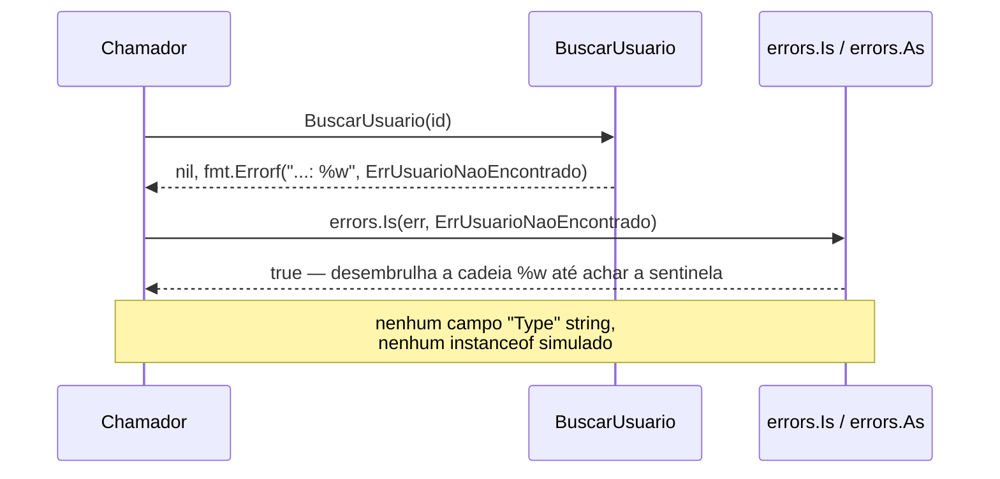

# Erros comuns de quem vem de OO

> [!abstract] TL;DR
> Cinco reflexos de OO clássica viram *code smell* em Go, e todos vêm do mesmo lugar: tentar recriar em Go o vocabulário arquitetural de Java/C#. Interfaces grandes definidas por quem produz o tipo (deviam ser pequenas e definidas por quem consome). Getters/setters para todo campo (Go usa campos exportados direto, ou métodos só quando há lógica real). Pacotes `manager`/`util`/`helper` (nome de pasta, não de responsabilidade — o pacote não diz o que ele *faz*). Ponteiros em toda struct "porque objetos são referência" (a maioria devia ser value, copiar é barato e mais seguro). E simular hierarquia de exceções com `errors.New` decorado (Go trata erro como valor comum, não como controle de fluxo à parte). Nenhum desses erros quebra o build — o compilador aceita todos — mas cada um empurra o código pra fora do idioma que o resto do ecossistema espera.

## O sintoma antes do diagnóstico

Imagine herdar um repositório Go escrito por um time que veio inteiro de Spring Boot. Primeira olhada no `go.mod`, tudo normal. Primeira olhada nos pacotes:

```
internal/
  manager/
    user_manager.go
    order_manager.go
  util/
    string_util.go
    date_util.go
  service/
    user_service.go
```

Segunda olhada num arquivo:

```go
type UserManager interface {
    GetUser(id string) (*User, error)
    CreateUser(u *User) error
    UpdateUser(u *User) error
    DeleteUser(id string) error
    ListUsers() ([]*User, error)
    ValidateUser(u *User) error
    NotifyUser(u *User, msg string) error
    // ... mais 12 métodos
}
```

Terceira olhada num struct:

```go
type User struct {
    id    string
    name  string
    email string
}

func (u *User) GetID() string      { return u.id }
func (u *User) SetID(id string)    { u.id = id }
func (u *User) GetName() string    { return u.name }
func (u *User) SetName(n string)   { u.name = n }
func (u *User) GetEmail() string   { return u.email }
func (u *User) SetEmail(e string)  { u.email = e }
```

Nada disso é erro de sintaxe. O `go build` passa limpo, os testes rodam. E ainda assim, qualquer dev Go experiente que abrir esse repositório vai sentir o mesmo desconforto: *isso compila, mas não é Go* — é Java traduzido token a token. As notas anteriores deste galho já estabeleceram o "porquê" filosófico (Effective Go, composição sobre herança). Esta nota é o catálogo prático: cinco reflexos específicos de quem vem de OO, o dano concreto que cada um causa, e a forma idiomática ao lado.

## Erro 1 — Interface grande, definida por quem produz

O reflexo de OO: se `UserService` tem 12 métodos públicos, a interface que o representa também tem 12 métodos — afinal, "interface = contrato completo da classe". E, como em Java a interface costuma morar perto da implementação, é natural declará-la no mesmo pacote que produz o tipo concreto.

```go
// user/service.go — pacote que PRODUZ o tipo
package user

type Service interface {
    GetUser(id string) (*User, error)
    CreateUser(u *User) error
    UpdateUser(u *User) error
    DeleteUser(id string) error
    ListUsers() ([]*User, error)
    ValidateUser(u *User) error
    NotifyUser(u *User, msg string) error
}

type service struct{ /* ... */ }

func (s *service) GetUser(id string) (*User, error)    { /* ... */ return nil, nil }
func (s *service) CreateUser(u *User) error             { /* ... */ return nil }
func (s *service) UpdateUser(u *User) error              { /* ... */ return nil }
func (s *service) DeleteUser(id string) error            { /* ... */ return nil }
func (s *service) ListUsers() ([]*User, error)           { /* ... */ return nil, nil }
func (s *service) ValidateUser(u *User) error            { /* ... */ return nil }
func (s *service) NotifyUser(u *User, msg string) error  { /* ... */ return nil }
```

Agora todo código que só precisa *ler* um usuário — um handler HTTP, por exemplo — é forçado a depender da interface de 7 métodos inteira, ou a mockar os 7 métodos num teste que só exercita `GetUser`. O acoplamento é maior do que o necessário, e a interface fica presa à evolução do produtor: adicionar `ArchiveUser` ao `service` real obriga a atualizar (ou pelo menos recompilar) todo mock existente.



A forma idiomática inverte as duas decisões ao mesmo tempo: a interface fica **pequena** — só os métodos que aquele consumidor específico usa — e é **declarada por quem consome**, não por quem produz. Isso é possível porque satisfação de interface em Go é implícita (o galho de interfaces já cobriu isso a fundo): o struct `service` nem precisa saber que `UserGetter` existe.

```go
// user/service.go — só o tipo concreto, sem interface nenhuma aqui
package user

type Service struct{ /* ... */ }

func (s *Service) GetUser(id string) (*User, error)   { /* ... */ return nil, nil }
func (s *Service) NotifyUser(u *User, msg string) error { /* ... */ return nil }
// ... resto dos métodos

// handler/http.go — o CONSUMIDOR declara só o que precisa
package handler

type UserGetter interface {
    GetUser(id string) (*user.User, error)
}

func NewHandler(users UserGetter) *Handler {
    return &Handler{users: users}
}
```

`*user.Service` satisfaz `handler.UserGetter` sem que `user` importe `handler` nem saiba que essa interface existe. O teste do handler agora mocka **um** método, não sete. Este é literalmente o "Interface Segregation" do SOLID, mas Go não precisa que você conheça o acrônimo — a satisfação implícita empurra você pra lá naturalmente, desde que você resista ao reflexo de centralizar a interface no pacote produtor.

> [!warning] "Go proverb": *the bigger the interface, the weaker the abstraction*
> É citação direta de Rob Pike (*Go Proverbs*, 2015). Uma interface com um método só (`io.Writer`, `io.Reader`) pode ser satisfeita por praticamente qualquer coisa — arquivo, buffer, conexão de rede, `bytes.Buffer` — e por isso é reutilizável em contextos que o autor original nunca imaginou. Uma interface com 12 métodos só é satisfeita pelo tipo que ela foi desenhada para descrever; na prática, vira um contrato de um-pra-um disfarçado de abstração.

## Erro 2 — Getters e setters para todo campo

O reflexo de OO, principalmente vindo de Java: campos são sempre `private`, e o acesso externo passa por `getX()`/`setX()` — encapsulamento por definição, independente de haver lógica alguma no meio.

```go
type Produto struct {
    nome  string
    preco float64
}

func (p *Produto) GetNome() string   { return p.nome }
func (p *Produto) SetNome(n string)  { p.nome = n }
func (p *Produto) GetPreco() float64 { return p.preco }
func (p *Produto) SetPreco(v float64) { p.preco = v }
```

Em Go isso não compra encapsulamento nenhum a mais do que exportar o campo direto — só adiciona quatro linhas de boilerplate por campo, sem nenhum ganho, porque não há lógica nenhuma nos métodos. E o próprio guia oficial é explícito sobre isso: o [Effective Go](https://go.dev/doc/effective_go#Getters) recomenda **não** prefixar getters com `Get` — se `owner` é um campo, o getter idiomático chama-se `Owner()`, não `GetOwner()`. A convenção de Go trata `Get` como ruído redundante: o próprio nome do método já deixa claro que é um acesso.

```go
// Idiomático — campo exportado, sem getter/setter algum
type Produto struct {
    Nome  string
    Preco float64
}

p := Produto{Nome: "Caneta", Preco: 2.5}
p.Preco = 3.0 // atribuição direta, sem SetPreco
```

Isso só muda quando o acesso **exige lógica real** — validação, cache, cálculo derivado, ou proteção de invariante. Nesse caso, sim, um método faz sentido — mas o campo por trás geralmente vira não-exportado, e o método ganha o nome do próprio conceito, sem prefixo:

```go
type Conta struct {
    saldo int64 // centavos — não exportado: só muda via método, com invariante
}

func (c *Conta) Saldo() int64 { return c.saldo }

func (c *Conta) Depositar(centavos int64) error {
    if centavos <= 0 {
        return fmt.Errorf("valor de depósito deve ser positivo: %d", centavos)
    }
    c.saldo += centavos
    return nil
}
```

`Saldo()` é um getter — mas só existe porque `saldo` é não-exportado por causa da invariante que `Depositar` protege. Não existe `SetSaldo(v int64)`: a única forma de mudar o saldo é passar pela regra de negócio. É a diferença entre encapsular *porque a linguagem exige* (Java) e encapsular *porque há algo de fato a proteger* (Go).

> [!info] Campo exportado (maiúscula) já É a API pública em Go
> Não existe `public`/`private` como palavra-chave. A visibilidade é decidida pela primeira letra do identificador: maiúscula exporta, minúscula não. Um campo `Nome` de um struct exportado já é, por definição, parte da API pública do pacote — não precisa de getter para "ser público", porque ele já é.

## Erro 3 — Pacotes `manager`, `util`, `helper`

O reflexo de OO: uma classe `UserManager` "gerencia" usuários, uma classe `StringUtils` "ajuda" com strings — nomes que descrevem uma categoria vaga de responsabilidade, não uma responsabilidade específica. Transpõe-se isso pra Go literalmente: `package manager`, `package util`.

O problema aparece na chamada, não na declaração. `manager.Manager` já é redundante — o nome do pacote deveria eliminar a necessidade de repetir "manager" no nome do tipo, mas como "manager" não diz nada sobre o domínio, ele acaba repetido:

```go
// Reflexo de OO
package manager

type UserManager struct{ /* ... */ }

func NewUserManager() *UserManager { /* ... */ return nil }

// no call site:
m := manager.NewUserManager()
m.UserManager.GetUser(id) // redundância visual: manager.User-Manager
```

`util` é ainda pior — não é um domínio, é uma gaveta de miscelânea onde qualquer função sem lar claro é jogada, até crescer um arquivo de 2 mil linhas sem coesão nenhuma entre as funções.

A nota 02 deste galho ("Naming e organização") já cobriu a regra de ouro: nome de pacote é **o que ele fornece**, não uma categoria genérica. Um pacote `user` com um tipo `Store` produz uma chamada que já é autoexplicativa sem repetir contexto:

```go
// Idiomático
package user

type Store struct{ /* ... */ }

func NewStore() *Store { /* ... */ return nil }

// no call site:
s := user.NewStore()
u, err := s.Get(id) // "user.Store.Get" — sem redundância, o pacote já contextualiza
```



> [!warning] `util`/`common`/`shared` são sintomas de responsabilidade não descoberta ainda
> Quando uma função "não tem onde morar" e vai parar em `util`, normalmente é sinal de que falta nomear o conceito que ela representa. `date_util.go` com uma função `FormatarDataBR(t time.Time) string` provavelmente devia virar um pacote `brdate` ou um método num tipo `Periodo` já existente no domínio — quase sempre há um nome melhor esperando, só exige mais dois segundos de reflexão do que jogar em `util`.

## Erro 4 — Pointer receiver e struct por ponteiro "por hábito de OO"

Em Java, C# ou Python, todo objeto não-primitivo é referência por padrão — não há escolha a fazer. Isso educa um reflexo: "structs são objetos, objetos são passados por referência, logo toda struct em Go devia ser `*Struct`, sempre, em toda função e todo campo".

```go
// Reflexo de OO — ponteiro em tudo, sem necessidade
type Ponto struct {
    X, Y int
}

func NovoPonto(x, y int) *Ponto {
    return &Ponto{X: x, Y: y}
}

func (p *Ponto) Somar(outro *Ponto) *Ponto {
    return &Ponto{X: p.X + outro.X, Y: p.Y + outro.Y}
}

func Distancia(a, b *Ponto) float64 {
    dx := a.X - b.X
    dy := a.Y - b.Y
    return math.Sqrt(float64(dx*dx + dy*dy))
}
```

`Ponto` são dois `int`s — 16 bytes. Passar por ponteiro não economiza cópia nenhuma que valha a pena (um ponteiro em si já ocupa 8 bytes numa máquina de 64 bits) e ainda **força alocação no heap** em qualquer caso onde o escape analysis do compilador não consiga provar que o ponteiro não sobrevive ao escopo — o [blog oficial sobre alocação](https://go.dev/doc/faq#stack_or_heap) explica que isso é decidido automaticamente, não pelo programador, mas usar ponteiro por hábito aumenta a chance de forçar a decisão pro lado mais caro. O galho 2 (Value vs pointer receiver) já cobriu o mecanismo completo; aqui o ponto é o reflexo comportamental: em Go, **value é o padrão sensato para structs pequenas e imutáveis**, e pointer é a exceção justificada — não o contrário.

```go
// Idiomático — value receiver, cópia é barata e mais segura (sem aliasing)
type Ponto struct {
    X, Y int
}

func NovoPonto(x, y int) Ponto {
    return Ponto{X: x, Y: y}
}

func (p Ponto) Somar(outro Ponto) Ponto {
    return Ponto{X: p.X + outro.X, Y: p.Y + outro.Y}
}

func Distancia(a, b Ponto) float64 {
    dx := a.X - b.X
    dy := a.Y - b.Y
    return math.Sqrt(float64(dx*dx + dy*dy))
}
```

A régua prática (retomando o galho 2, sem redefinir): pointer receiver se o método precisa **mutar** o receiver, se a struct é **grande** (o custo de copiar supera o de indireção — regra de bolso comum na comunidade é "maior que uns 3-4 words"), ou se a struct contém campos que **não devem ser copiados** (um `sync.Mutex`, por exemplo — copiar um mutex trancado é bug). Fora isso, value é a escolha default, e ela também evita uma classe inteira de bug: dois lugares do código compartilhando sem querer o mesmo ponteiro e um mutando o que o outro não esperava.

> [!warning] Ponteiro em campo de struct só quando o campo pode legitimamente ser ausente
> Outro reflexo de OO é declarar `type Pedido struct { Cliente *Cliente }` "porque objetos são referência". Se todo `Pedido` sempre tem um `Cliente`, use `Cliente Cliente` (value) — mais simples, sem risco de `nil` pointer dereference. Reserve o ponteiro em campo para quando `nil` é um estado **válido e distinto** de "tem valor zero" — por exemplo, um campo opcional que precisa diferenciar "não informado" de "informado como zero".

## Erro 5 — Simular hierarquia de exceptions

Em Java/Python/C#, erros são objetos que sobem por uma cadeia `throw`/`catch`, tipicamente organizados numa hierarquia de classes (`IOException` extends `Exception`, por exemplo) que o `catch` filtra por tipo. Quem vem dessa cultura tende a recriar a hierarquia com structs e um campo "tipo" para simular `instanceof`:

```go
// Reflexo de OO — hierarquia de "exceções" simulada com erro decorado
type AppError struct {
    Type    string // "NotFound", "Validation", "Internal"...
    Message string
    Cause   error
}

func (e *AppError) Error() string { return e.Message }

func BuscarUsuario(id string) (*User, error) {
    u, ok := db[id]
    if !ok {
        return nil, &AppError{Type: "NotFound", Message: "usuário não encontrado"}
    }
    return u, nil
}

// no chamador — comparação de string fazendo o papel de instanceof:
_, err := BuscarUsuario(id)
if appErr, ok := err.(*AppError); ok && appErr.Type == "NotFound" {
    // trata "not found"
}
```

Funciona, mas reintroduz — via um campo string chamado `Type` — exatamente o problema que a comparação `catch (NotFoundException e)` tinha: um switch disfarçado sobre uma string mágica, sem checagem do compilador se você digitar `"Notfound"` errado.

Go já tem o mecanismo idiomático pra isso, e o galho de erros deste vault já cobriu o mecanismo completo (`errors.Is`, `errors.As`, sentinel errors, wrapping com `%w`) — esta nota só nomeia o anti-pattern e aponta de volta. Em vez de um campo `Type` genérico, o idiomático é um **tipo de erro dedicado**, comparável com `errors.As`, ou uma **sentinela** comparável com `errors.Is`:

```go
// Idiomático — sentinel error + errors.Is, sem hierarquia nenhuma
var ErrUsuarioNaoEncontrado = errors.New("usuário não encontrado")

func BuscarUsuario(id string) (*User, error) {
    u, ok := db[id]
    if !ok {
        return nil, fmt.Errorf("buscar usuário %s: %w", id, ErrUsuarioNaoEncontrado)
    }
    return u, nil
}

// no chamador:
_, err := BuscarUsuario(id)
if errors.Is(err, ErrUsuarioNaoEncontrado) {
    // trata "not found" — comparação verificada em compile-time, sem string mágica
}
```



> [!warning] `panic`/`recover` não é `try`/`catch` — não use como controle de fluxo
> Outra tentação de quem vem de OO é usar `panic` onde usaria `throw`, e `recover` onde usaria `catch`, para "erros esperados" (usuário não encontrado, validação falhou). Isso inverte a convenção de Go: `panic` é reservado para estados **irrecuperáveis** (bug do próprio programa, invariante quebrada) — erro esperado e recuperável é sempre um `error` retornado como último valor. Um pacote que usa `panic` para "usuário não encontrado" força todo chamador a envolver a chamada em `recover`, algo que nenhuma outra biblioteca Go idiomática espera precisar fazer.

## Vindo de outra linguagem, em Go é assim

| Reflexo de OO | Em Go, o idiomático é |
|---|---|
| Interface grande, no pacote que implementa | Interface pequena, declarada por quem **consome** |
| `getX()`/`setX()` para todo campo | Campo exportado direto; método só com lógica real |
| `package manager` / `package util` | Pacote nomeado pelo que ele **fornece** (`user`, `billing`) |
| Ponteiro em toda struct "por hábito" | Value por padrão; ponteiro só com motivo (mutação, tamanho, campo não-copiável) |
| Hierarquia de exceções simulada com campo `Type` | `errors.Is`/`errors.As` com sentinelas ou tipos de erro dedicados |

Nenhuma dessas colunas é uma tradução 1:1 — é o mesmo motivo de sempre: Go não tem classes, não tem exceções, e trata interface como contrato do consumidor, não do produtor. Tentar mapear vocabulário de Java/C#/Python direto pra Go produz código que compila, mas que qualquer revisor Go vai sinalizar — e é exatamente esse sinalizar, feito de forma sistemática, que a próxima nota deste galho automatiza.

## Como explicar em inglês

> Five OO reflexes turn into Go anti-patterns because they all try to import Java/C#'s architectural vocabulary wholesale. Producer-defined, large interfaces bloat the contract every consumer has to satisfy — Go interfaces should be small and declared by the consumer, per Rob Pike's proverb "the bigger the interface, the weaker the abstraction." Getters and setters for every field are boilerplate with zero payoff, since Go has no `private` keyword — exported fields already are the public API; a method is only worth writing when there's real logic to protect. Packages named `manager` or `util` describe a vague category instead of what the package actually provides, producing redundant call sites like `manager.NewUserManager()`. Reaching for a pointer on every struct "because objects are references in my old language" ignores that value types are the sensible Go default for small, immutable data — pointers are the justified exception, not the rule. And simulating an exception hierarchy with a string `Type` field on a custom error struct reinvents `instanceof`-style switching with none of the compiler's help; Go's idiom is sentinel errors compared with `errors.Is`, or typed errors unwrapped with `errors.As`.

| Termo PT | Termo EN |
|---|---|
| interface grande | fat interface |
| interface pequena | narrow interface |
| pacote produtor / consumidor | producer package / consumer package |
| getter/setter | getter/setter |
| campo exportado | exported field |
| receiver de valor / ponteiro | value receiver / pointer receiver |
| erro sentinela | sentinel error |
| desembrulhar erro | unwrap error |
| hierarquia de exceções | exception hierarchy |

## O que vem a seguir

Identificar esses cinco anti-patterns manualmente, revisão a revisão, não escala — e é fácil deixar um `GetNome()` ou um `package util` passar despercebido num PR grande. A [[05 - go vet, golangci-lint e ferramentas|nota 05]] mostra como automatizar boa parte dessa detecção: `go vet` pega uma classe de erros estruturais, e `golangci-lint` — com linters como `revive` e `stylecheck` — sinaliza boa parte dos desvios de naming e organização vistos aqui antes mesmo do code review humano.

## Veja também

- [[01 - Effective Go e a cultura|01 — Effective Go e a cultura]] — o pano de fundo filosófico destes anti-patterns
- [[02 - Naming e organização|02 — Naming e organização]] — a regra completa de nomeação de pacotes retomada no Erro 3
- [[03 - Composição sobre herança na prática|03 — Composição sobre herança na prática]] — a alternativa idiomática à hierarquia de tipos que também motiva o Erro 1
- [[05 - go vet, golangci-lint e ferramentas|05 — go vet, golangci-lint e ferramentas]] — próxima nota do galho, automação da detecção
- [[03-Dominios/Tecnologia/Go/index|Trilha Go]]

## Fontes

- The Go Authors. *Effective Go — Getters*. go.dev. https://go.dev/doc/effective_go#Getters (acessado em 2026-07-18)
- The Go Authors. *Effective Go — Interfaces*. go.dev. https://go.dev/doc/effective_go#interfaces (acessado em 2026-07-18)
- The Go Authors. *Frequently Asked Questions (FAQ) — How do I know whether a variable is allocated on the heap or the stack?*. go.dev. https://go.dev/doc/faq#stack_or_heap (acessado em 2026-07-18)
- The Go Authors. *Effective Go — Package names*. go.dev. https://go.dev/doc/effective_go#package-names (acessado em 2026-07-18)
- Pike, Rob. *Go Proverbs*. go-proverbs.github.io (talk transcript hosted via go.dev community references). https://go-proverbs.github.io/ (acessado em 2026-07-18)
- pkg.go.dev. *Package errors*. https://pkg.go.dev/errors (acessado em 2026-07-18)
