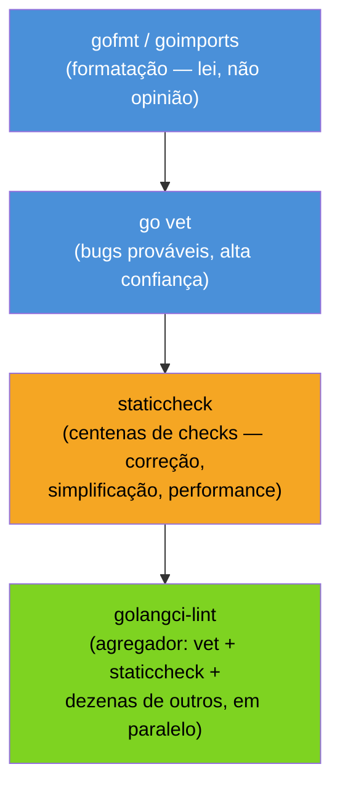
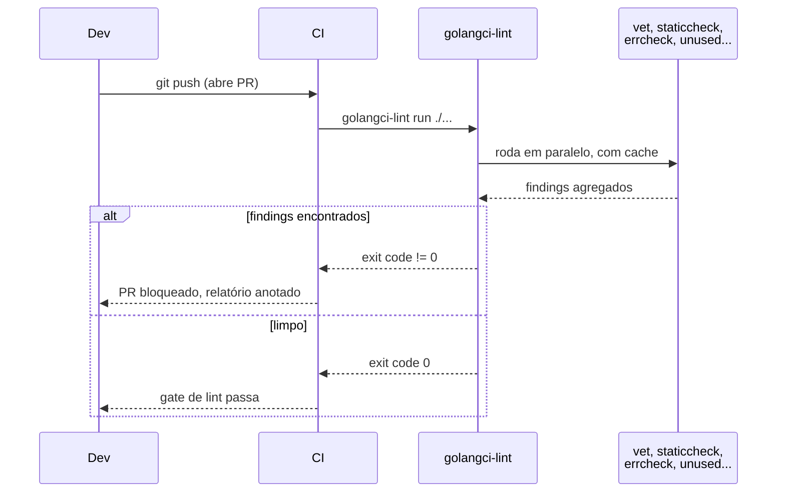

# go vet, golangci-lint e ferramentas

> [!abstract] TL;DR
> `go fmt`/`goimports` não são estilo — são **lei**: formatam o código numa forma canônica única, sem debate de time, e o CI deve rejeitar qualquer diff que fuja disso. `go vet`, incluído no toolchain, pega **bugs prováveis** que o compilador deixa passar (`Printf` com argumento errado, `sync.Mutex` copiado, `struct tag` mal escrita) — sinal de altíssima confiança, quase sem falso positivo. **staticcheck** vai além: centenas de checks de correção, simplificação e performance que `vet` não cobre. **golangci-lint** é o agregador que roda dezenas de linters — incluindo `vet` e `staticcheck` — em paralelo, com cache, num único binário e um `.golangci.yml` versionado. A skyline idiomática: `gofmt` sempre, `go vet` sempre, `golangci-lint run` no CI como gate, e nada disso como debate de PR — é ferramenta rodando, não opinião de revisor.

## O PR que devia ter sido rejeitado antes de existir

Imagine um code review em Go. O autor abriu um PR, o revisor comenta: "faltou vírgula depois do último campo do struct literal multi-linha", "essa chave devia estar na linha de baixo", "esse `if err != nil` tá com indentação diferente do resto do arquivo". Três comentários, três idas e vindas, zero relação com o que o código *faz*.

Esse ciclo é exatamente o que times Go aprenderam a eliminar estruturalmente, não por disciplina de revisor. Go embutiu um formatador oficial no próprio toolchain desde o dia 1 — `gofmt` — e a cultura da linguagem tratou "formatação é opinião de time" como problema resolvido, não como questão em aberto. Rob Pike resumiu isso numa frase que virou quase folclore da comunidade: "gofmt's style is no one's favorite, yet gofmt is everyone's favorite" — o estilo de ninguém, o favorito de todos, porque elimina o debate inteiro.

Mas formatação é só a camada mais visível. Um nível abaixo, existe uma classe de erro que compila limpo, passa nos testes que você lembrou de escrever, e ainda assim está errado: `fmt.Printf("%d itens", "cinco")` — verbo `%d` recebendo uma `string`. O compilador não reclama porque `Printf` é variádico com `interface{}`/`any` — qualquer tipo cabe na assinatura. Só em runtime, ao rodar aquele caminho de código específico, a saída vira `%!d(string=cinco)`. É exatamente esse buraco entre "compila" e "está correto" que `go vet` e o ecossistema de linters em volta dele existem para fechar — e é o assunto desta nota.

## O espectro: do formatador ao agregador



Cada camada resolve um problema diferente, e a ordem importa porque cada uma pressupõe a anterior:

- **`gofmt`/`goimports`** garante que todo `.go` do universo Go tenha a mesma forma canônica — recuo com tabs, chaves na mesma linha, imports organizados. Não há configuração de estilo para discutir.
- **`go vet`** examina a *árvore sintática* do código em busca de padrões que "parecem certos" para o compilador mas quase sempre são erro do programador. É parte do toolchain oficial — `go build` e `go test` já rodam um subconjunto de checks de `vet` automaticamente desde o Go 1.10, sem você pedir.
- **`staticcheck`** é uma ferramenta de terceiros (mas com selo de facto-padrão na comunidade) que faz análise estática muito mais ampla: detecta código morto, simplificações possíveis, erros de concorrência sutis, chamadas deprecated — categorias que `vet` deliberadamente deixa de fora por não quererem arriscar falso positivo.
- **`golangci-lint`** não implementa lint nenhum sozinho — ele **orquestra** dezenas de linters (`vet`, `staticcheck`, `errcheck`, `unused`, `gosimple`, e outros) rodando em paralelo com cache incremental, e devolve um relatório único. É a ferramenta que qualquer time Go de produção acaba rodando no CI.

## `go vet`: o detector de bugs prováveis

`go vet` já vem com o `go` — não precisa instalar nada:

```bash
go vet ./...
```

Ele não verifica estilo — verifica **correção provável**. A filosofia oficial, descrita na [documentação do comando](https://pkg.go.dev/cmd/vet), é conservadora de propósito: cada check só entra em `vet` se a taxa de falso positivo for próxima de zero. É por isso que `vet` roda automaticamente dentro de `go test` — os autores da linguagem confiam o suficiente nele para bloquear o fluxo padrão sem pedir permissão.

Os checks mais valiosos no dia a dia:

**1. `printf` — verbo de formatação incompatível com o argumento:**

```go
func relatorio(nome string, qtd int) {
    fmt.Printf("%s tem %s itens\n", nome, qtd) // vet: Printf format %s has arg qtd of wrong type int
}
```

`go vet` sabe ler a *string de formato* e casar cada verbo (`%s`, `%d`, `%f`...) com o tipo real do argumento correspondente — algo que só é possível porque `vet` entende a semântica de `fmt`, não só a sintaxe genérica de Go.

**2. `copylocks` — copiar um valor que contém `sync.Mutex` (ou outro tipo que não pode ser copiado):**

```go
type Contador struct {
    mu    sync.Mutex
    valor int
}

func processar(c Contador) { // vet: passes lock by value
    c.mu.Lock()
    defer c.mu.Unlock()
    c.valor++
}
```

Passar `Contador` por valor copia o `sync.Mutex` embutido — a cópia começa "destravada" independente do estado do mutex original, e cada goroutine passa a proteger uma trava diferente, silenciosamente quebrando a exclusão mútua que o código pensa que está garantindo. `vet` pega isso porque sabe que `sync.Mutex` implementa (implicitamente) um contrato de não-cópia via convenção de método com pointer receiver.

**3. `structtag` — struct tag mal formada, como a nota anterior deste galho já cobriu no contexto de `encoding/json`:**

```go
type Usuario struct {
    Nome string `json:"nome"`
    Tipo string `json: "tipo"` // vet: struct field tag `json: "tipo"` not compatible with reflect.StructTag.Get
}
```

O espaço depois de `json:` quebra o parsing que `reflect.StructTag.Get` faz — e o efeito é silencioso: o campo simplesmente não recebe a tag, sem panic, sem erro visível, só um comportamento errado em runtime que só aparece testando o JSON de saída.

> [!info] `go vet` embutido no `go test` desde 1.10
> Desde o Go 1.10, `go test` roda um subconjunto de checks de alta confiança de `vet` (`printf`, `atomic`, entre outros) automaticamente antes dos testes — sem flag, sem configuração. Se um `go test` falha com mensagem de `vet` em vez de teste, é esse mecanismo agindo.

## staticcheck: além do que `vet` ousa cobrir

`go vet` é deliberadamente conservador — recusa checks que possam gerar falso positivo. [staticcheck](https://staticcheck.dev/) não tem essa restrição, e cobre uma superfície muito maior: correção (`SA`, *staticcheck analysis*), simplificações (`S`), estilo (`ST`), e performance (`QF`, *quickfix*).

```bash
go install honnef.co/go/tools/cmd/staticcheck@latest
staticcheck ./...
```

Alguns exemplos do tipo de coisa que `staticcheck` pega e `vet` não:

```go
// SA4006: valor atribuído a err nunca é usado antes de ser sobrescrito
err := fazAlgo()
err = fazOutraCoisa() // a primeira atribuição foi inútil

// S1005: simplificação possível — descartar valor não usado
for _, valor := range slice {
    _ = valor // desnecessário; "for range slice" já basta se valor não é usado
}

// SA1019: uso de identificador deprecated
ioutil.ReadFile("config.json") // SA1019: ioutil.ReadFile is deprecated, use os.ReadFile
```

O último exemplo é especialmente valioso em bases de código que evoluem junto com a stdlib: `staticcheck` conhece as anotações `// Deprecated:` do próprio Go e avisa antes que a próxima migração de versão vire uma varredura manual.

## golangci-lint: o agregador que vira gate de CI

Rodar `go vet`, `staticcheck`, `errcheck`, `gosimple`, `unused` cada um separadamente — cada um com sua própria instalação, flags e formato de saída — não escala. [`golangci-lint`](https://golangci-lint.run/) resolve isso: um binário único, dezenas de linters embutidos, execução em paralelo com cache incremental (só relinta o que mudou), e configuração centralizada:

```bash
# instalação (binário pré-compilado, recomendado pelo próprio projeto)
go install github.com/golangci/golangci-lint/v2/cmd/golangci-lint@latest

golangci-lint run ./...
```

Configuração em `.golangci.yml` na raiz do repositório, versionada junto com o código — o mesmo princípio de "não é opinião de revisor, é ferramenta configurada uma vez":

```yaml
version: "2"
linters:
  enable:
    - errcheck    # erro retornado e ignorado sem checagem
    - govet       # engloba go vet
    - staticcheck # engloba staticcheck
    - unused      # variável/função/import declarado e nunca usado
    - gosimple    # simplificações de sintaxe
    - ineffassign # atribuição cujo valor nunca é lido
run:
  timeout: 5m
```



O ponto que faz `golangci-lint` valer a instalação, em vez de só rodar `go vet` e `staticcheck` na mão: ele já vem com `errcheck` habilitado por padrão em muitas configurações — o linter que pega `err` retornado e silenciosamente descartado, o erro mais comum e mais caro de código Go que "parece" tratar erro mas não trata:

```go
func salvar(dados []byte) {
    os.WriteFile("saida.txt", dados, 0644) // errcheck: Error return value is not checked
}
```

`go vet` não cobre isso — não é um padrão sintático arriscado, é uma omissão comportamental, categoria que fica fora do escopo conservador de `vet` por design.

### Automatizando de verdade: o gate no CI

O valor de `golangci-lint` só se realiza quando ele roda em toda mudança, não como comando que alguém lembra de digitar. Um workflow mínimo de GitHub Actions, usando a action oficial:

```yaml
# .github/workflows/lint.yml
name: lint
on: [push, pull_request]
jobs:
  golangci-lint:
    runs-on: ubuntu-latest
    steps:
      - uses: actions/checkout@v4
      - uses: actions/setup-go@v5
        with:
          go-version: "1.23"
      - uses: golangci/golangci-lint-action@v6
        with:
          version: v2.0
```

A `golangci-lint-action` oficial já resolve cache de módulos e do próprio linter entre execuções — a segunda rodada num PR com poucas mudanças costuma levar segundos, não minutos, porque só relinta o que o cache não cobre. O efeito organizacional é o que importa: nenhum PR com `go vet` reclamando ou `errcheck` apontando erro ignorado chega a *mergeable* — o gate falha antes de qualquer humano precisar comentar isso em revisão.

## `gofmt`/`goimports` como lei, não como convenção

Voltando à base da pirâmide: `gofmt` reformata a árvore sintática inteira para a forma canônica — não há flag de estilo, não há `.editorconfig` para debater. `goimports` faz o mesmo e ainda organiza e remove imports não usados automaticamente:

```bash
gofmt -l .          # lista arquivos fora do padrão (sem modificar)
gofmt -w .          # reescreve os arquivos no padrão
goimports -w .       # gofmt + organiza imports
```

Praticamente todo editor com suporte a Go (VS Code com a extensão oficial, GoLand, Vim com `vim-go`) roda `goimports` automaticamente a cada save — o efeito prático é que um dev Go raramente vê um diff de formatação sujo em revisão de código, porque a ferramenta já corrigiu antes do commit.

> [!warning] `gofmt -l` no CI não é opcional
> Um repositório sem checagem de `gofmt -l .` no pipeline eventualmente acumula arquivos fora do padrão — normalmente vindos de quem editou fora de um editor configurado, ou de merge de branches antigas. O gate correto é `test -z "$(gofmt -l .)"`: se a saída não é vazia, falha o build. Corrigir manualmente depois é sempre mais caro do que nunca deixar entrar.

> [!warning] `golangci-lint` sem `.golangci.yml` versionado gira as regras a cada instalação
> Sem um arquivo de configuração explícito no repositório, `golangci-lint` usa o conjunto de linters "default" da versão instalada — que muda entre versões da própria ferramenta. Dois devs com versões diferentes de `golangci-lint` instaladas localmente podem ver relatórios divergentes do mesmo código. Fixar `.golangci.yml` (e idealmente a versão do binário, via `go.mod` tool directive ou script de bootstrap) elimina essa deriva.

> [!warning] `//nolint` deve vir com justificativa, não como silenciador genérico
> `golangci-lint` aceita comentários `//nolint:errcheck` para suprimir um finding pontual. Usado sem critério, vira uma forma de acumular dívida técnica invisível — o linter aponta um problema real e o comentário só o esconde do relatório. A convenção saudável é `//nolint:errcheck // Close() em defer, erro já tratado no fluxo principal` — a razão junto, revisável no PR.

## Vindo de outras linguagens

| Linguagem | Ferramenta equivalente | Diferença de postura em Go |
|---|---|---|
| Java | Checkstyle + SpotBugs/PMD (múltiplos plugins, config extensa) | `gofmt` não tem opção de configurar estilo — é fixo por design |
| Python | `black` (formatador) + `ruff`/`flake8` (lint) + `mypy` (tipos) | `go vet` já é parte do toolchain oficial, não uma escolha de ecossistema entre várias |
| JavaScript/TypeScript | Prettier + ESLint (config `.eslintrc` extensa, plugins por projeto) | `golangci-lint` converge o ecossistema num único binário-agregador, em vez de múltiplas ferramentas independentes coordenadas por scripts |

A diferença de fundo não é técnica — é cultural. Em Java/JS, decidir "qual formatador, qual conjunto de regras de lint, qual nível de rigor" é uma decisão de arquitetura de projeto, revisitada em toda nova base de código. Em Go, a resposta para "qual formatador usar" é sempre `gofmt`, sem segunda pergunta — e a única decisão real de projeto é *qual* subconjunto de linters do `golangci-lint` habilitar em `.golangci.yml`.

## Como explicar em inglês

> Go treats formatting as settled, not stylistic: `gofmt` produces one canonical form and teams don't configure or debate it — Rob Pike's line, "gofmt's style is no one's favorite, yet gofmt is everyone's favorite," captures why. `go vet`, part of the official toolchain, catches high-confidence probable bugs — a `Printf` verb mismatched with its argument's type, a `sync.Mutex` copied by value, a malformed struct tag — and a subset of it already runs inside `go test` automatically. `staticcheck` goes further, covering hundreds of checks `vet` deliberately excludes to avoid false positives: dead code, possible simplifications, deprecated API usage. `golangci-lint` aggregates dozens of linters — including `vet` and `staticcheck` — into one fast, cached binary driven by a version-controlled `.golangci.yml`, and is what most production Go teams run as a CI gate. The idiomatic baseline: format is never a review comment, `go vet` is a near-zero-false-positive safety net, and `golangci-lint run` failing is exactly as blocking as a failing test.

| Termo PT | Termo EN |
|---|---|
| formatação canônica | canonical formatting |
| bug provável | probable bug |
| análise estática | static analysis |
| agregador de linters | linter aggregator |
| gate de CI | CI gate |
| falso positivo | false positive |
| dívida técnica invisível | hidden technical debt |
| linter (verificador de estilo/erros) | linter |

## O que vem a seguir

Ferramenta automatizada pega o que é mecânico — formatação, verbos de `Printf` errados, mutex copiado, erro ignorado. Mas boa parte do que separa código Go idiomático de código Go que só compila não cabe em regra de linter: é julgamento sobre nomes, sobre quando um erro merece contexto (`fmt.Errorf` com `%w`) versus quando é ruído, sobre se aquela interface deveria existir. A [[06 - Code review em Go|próxima nota]] entra exatamente nesse território — o que um revisor humano em Go procura que `golangci-lint` nunca vai encontrar sozinho.

## Veja também

- [[01 - Effective Go e a cultura|01 — Effective Go e a cultura]] — o documento-fonte de boa parte do que `vet`/`staticcheck` formalizam em regra automatizada
- [[02 - Naming e organização|02 — Naming e organização]] — convenções que `golangci-lint` não checa por regra, mas que revisão humana continua cobrindo
- [[04 - Erros comuns de quem vem de OO|04 — Erros comuns de quem vem de OO]] — vários dos exemplos ali (mutex copiado, erro ignorado) são exatamente o que `go vet`/`errcheck` detectam automaticamente
- [[06 - Code review em Go|06 — Code review em Go]] — próxima nota do galho
- [[03-Dominios/Tecnologia/Go/index|Trilha Go]]

## Fontes

- The Go Authors. *cmd/vet*. pkg.go.dev. https://pkg.go.dev/cmd/vet (acessado em 2026-07-18)
- The Go Authors. *Effective Go — Gofmt*. go.dev. https://go.dev/doc/effective_go#formatting (acessado em 2026-07-18)
- Dominik Honnef. *Staticcheck*. staticcheck.dev. https://staticcheck.dev/ (acessado em 2026-07-18)
- golangci-lint contributors. *golangci-lint documentation*. golangci-lint.run. https://golangci-lint.run/ (acessado em 2026-07-18)
- The Go Authors. *goimports*. pkg.go.dev. https://pkg.go.dev/golang.org/x/tools/cmd/goimports (acessado em 2026-07-18)
- The Go Blog. *Go 1.10 Release Notes — Testing*. go.dev. https://go.dev/doc/go1.10#test (acessado em 2026-07-18)

