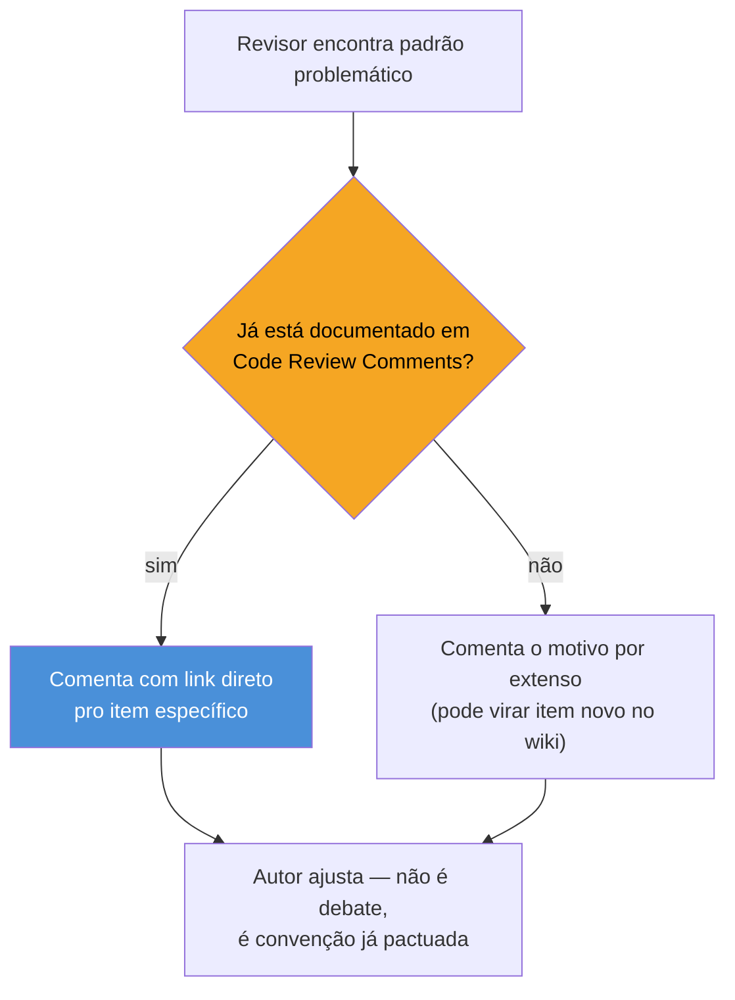
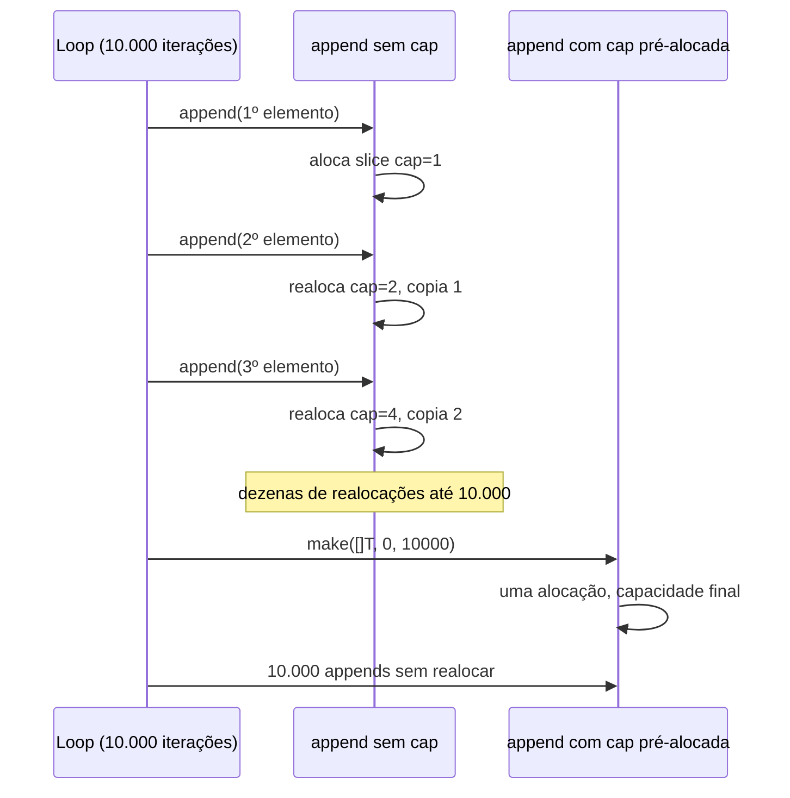

# Code review em Go

> [!abstract] TL;DR
> Existe um documento canônico — [Go Code Review Comments](https://go.dev/wiki/CodeReviewComments) — que funciona como o "checklist compartilhado" da comunidade Go: em vez de cada revisor inventar seu próprio gosto, todo mundo aponta pro mesmo link quando encontra o mesmo erro pela enésima vez. Os quatro focos que dominam um review Go real são: **erros tratados** (nunca `_ = err`), **nomes idiomáticos** (sem `Get`, sem stutter, `MixedCaps`), **interfaces declaradas no consumidor** (não no produtor) e **alocação desnecessária** (`append` sem capacidade, `strings.Split` em hot path, structs copiadas à toa). Comentário de review em Go raramente é estético — ele aponta pra uma convenção com link, e o padrão saudável de resposta é "ah, não sabia, ajusto" — não debate. A cultura de review é parte do porquê Go, apesar de sintaticamente pequeno, produz código que se lê igual em times diferentes.

## O comentário que se repete

Imagine um pull request com esta linha, aprovado sem review nenhum:

```go
func BuscarUsuario(id string) *Usuario {
    resultado, _ := db.Query("SELECT * FROM usuarios WHERE id = ?", id)
    defer resultado.Close()
    // ...
}
```

Um mês depois, em produção, a query começa a falhar silenciosamente — a tabela mudou de nome numa migration e ninguém percebeu, porque o erro foi descartado com `_`. O bug não é sutil de encontrar *depois* que já explodiu. É óbvio de barrar *antes*, num review de trinta segundos: "esse `_` no lugar do erro é o problema mais comum que revisor Go encontra". Não é opinião de estilo — é o tipo de erro que o [Go Code Review Comments](https://go.dev/wiki/CodeReviewComments) documenta explicitamente, porque aparece toda semana em todo repositório Go do mundo.

Isso é o cerne da cultura de review em Go: a linguagem é pequena, mas as formas de escrever *Go ruim que ainda compila* são bem conhecidas, catalogadas, e revisor experiente as reconhece de cabeça. Um review Go maduro não reinventa critério — ele aplica um checklist compartilhado, com nome e link, que qualquer novo membro do time pode ler em quinze minutos e já "falar a língua".

## O documento: Go Code Review Comments

O nome oficial é **Go Code Review Comments**, mantido no [wiki do próprio projeto Go](https://go.dev/wiki/CodeReviewComments). Não é um linter, não é gerado por ferramenta — é uma lista de convenções em prosa, cada item curto (um parágrafo, às vezes um exemplo de código), pensada pra ser **linkada dentro de um comentário de review**, não lida do início ao fim como manual.



O efeito prático é que revisor não precisa reescrever a justificativa a cada PR — cola `see https://go.dev/wiki/CodeReviewComments#error-strings` e segue em frente. Isso reduz o review a uma troca rápida, sem fricção pessoal: o comentário não é "eu acho que...", é "isso já é convenção documentada, ajusta". A diferença emocional é grande — ninguém discute gosto quando a régua é externa e nomeada.

> [!info] O documento evoluiu — parte virou `gofmt`/`go vet`, parte ficou em `golangci-lint`
> Vale notar que o Code Review Comments é anterior a boa parte do ferramental automatizado coberto na [[05 - go vet, golangci-lint e ferramentas]]. Historicamente, muita coisa que era "lembrete de revisor humano" hoje é pego por `go vet` ou por um linter do `golangci-lint` antes mesmo do PR abrir. O documento continua valioso para o que **não** dá pra automatizar totalmente — nomes, design de API, granularidade de interface — mas boa parte do "erro mecânico repetitivo" já devia ter sido pega por CI antes do humano nem abrir o diff.

## O que revisar: os quatro focos

### 1. Erros tratados — nunca descartados no silêncio

O item mais citado do documento inteiro. Go não tem exceções — um erro é um valor de retorno comum, e ignorá-lo é tão fácil quanto esquecer um `if`:

```go
// Reprovado em qualquer review Go sério
resultado, _ := db.Query(sql, id)

// Correto — trata ou propaga, nunca descarta em silêncio
resultado, err := db.Query(sql, id)
if err != nil {
    return fmt.Errorf("buscar usuário %s: %w", id, err)
}
```

O ponto não é só "cheque o erro" — é *o que fazer* com ele quando checado. Três padrões aceitáveis, na ordem de preferência que um revisor Go costuma cobrar:

1. **Tratar de verdade** — decidir um comportamento diferente conforme o erro (retry, fallback, log e segue).
2. **Envolver e propagar** com `%w` (desde Go 1.13, via [`fmt.Errorf`](https://pkg.go.dev/fmt#Errorf)) — preserva a cadeia pra quem chama poder usar `errors.Is`/`errors.As` depois.
3. **Propagar cru**, só quando a função já é uma casca fina que não agrega contexto nenhum.

O que nenhum revisor deixa passar: `_ = err`, `err != nil { log.Println(err) }` sem `return` (o código continua executando com estado inválido), ou `panic(err)` numa biblioteca de uso geral — pânico é decisão do chamador, não da biblioteca.

> [!warning] `if err != nil { log(err) }` sem `return` é pior que ignorar
> Parece cauteloso — "pelo menos logamos" — mas o fluxo continua executando com `resultado` possivelmente `nil` ou zero-value, produzindo um segundo erro (agora um `nil pointer dereference`) que mascara a causa raiz original no log. Revisor experiente pede pra escolher: ou trata e segue com um valor válido, ou retorna. Nunca os dois ao mesmo tempo sem decisão explícita.

### 2. Nomes idiomáticos

Nomear é a parte do review que mais depende de convenção compartilhada, porque Go não tem `IUsuario`/`UsuarioImpl` como muleta — o nome *é* a documentação. Os padrões que aparecem em quase todo review:

| Padrão problemático | Correção idiomática | Por quê |
|---|---|---|
| `GetNome()` | `Nome()` | Getter em Go não leva `Get` — [Effective Go](https://go.dev/doc/effective_go#Getters) já cravou isso; `obj.Nome()` já lê como getter sem prefixo |
| `user.UserID` | `user.ID` | *Stutter* — o nome do pacote/tipo já dá o contexto; repetir é ruído (`usuario.UsuarioID` lido de fora vira `pkg.usuario.UsuarioID`) |
| `usuario_service.go` com `func BuscarUsuarioPorId` | `usuario.go` com `func BuscarPorID` no pacote `usuario` | O pacote já é o namespace — função não precisa reafirmar o domínio no nome |
| `httpClient`, `jsonParser` | `Client`, `Parser` — dentro do pacote `http`/`json` | Idem: `http.Client`, não `http.HTTPClient` |
| `Id`, `Url`, `Http` | `ID`, `URL`, `HTTP` | Iniciais são tratadas como uma palavra maiúscula única — regra explícita do [Initialisms](https://go.dev/wiki/CodeReviewComments#initialisms) |
| `func Foo() (int, error)` sem doc comment em identificador exportado | `// Foo faz X e retorna Y.` acima da declaração | [`golint`](https://go.dev/wiki/CodeReviewComments#doc-comments)/`staticcheck` cobram doc comment começando com o próprio nome do identificador em tudo que é exportado |

A régua geral, puxada do [Effective Go](https://go.dev/doc/effective_go#names) e reforçada pelo Code Review Comments: nome curto perto de onde é usado, nome mais descritivo quanto mais longe do escopo de declaração — um `i` num loop de três linhas está ótimo; uma função exportada que vai ser lida em outro pacote merece nome completo.

### 3. Interfaces do lado do consumidor, não do produtor

Este é o item que mais separa quem só sabe *ler* Go de quem sabe *desenhar* API Go — e é onde o galho conecta direto com o que já foi estabelecido em [[03 - Composição sobre herança na prática]]. A pergunta de review não é "essa interface está bem definida" — é "essa interface deveria existir aqui, nesse pacote?".

```go
// Pacote produtor (armazenamento) — NÃO declara interface pra si mesmo
package storage

type PostgresStore struct{ /* ... */ }

func (s *PostgresStore) Salvar(u Usuario) error { /* ... */ return nil }
func (s *PostgresStore) Buscar(id string) (Usuario, error) { /* ... */ return Usuario{}, nil }

// Pacote consumidor — declara a interface do tamanho que PRECISA
package servico

type Salvador interface {
    Salvar(u Usuario) error
}

func Cadastrar(s Salvador, u Usuario) error {
    return s.Salvar(u)
}
```

`servico.Salvador` pede só `Salvar` — não `Buscar`, que `Cadastrar` nunca usa. Se `storage` tivesse declarado uma interface `Store` com os dois métodos e exigido que todo consumidor dependesse dela, `Cadastrar` estaria acoplado a um método que nunca chama, e qualquer teste de `Cadastrar` precisaria de um mock com `Buscar` implementado só pra satisfazer o tipo — puro ruído.

> [!question]- Isso não é o oposto do que Java/C# ensinam ("defina a interface junto da implementação")?
> É exatamente o oposto, e de propósito. Em Java, é comum `UserRepository` (interface) morar ao lado de `UserRepositoryImpl`, ambos no módulo de persistência — a interface documenta "o contrato que essa camada oferece". Em Go, a convenção — batizada de [*consumer-side interfaces*](https://go.dev/wiki/CodeReviewComments#interfaces) — inverte: quem **usa** dependência declara a forma mínima que precisa dela, no próprio pacote consumidor. `storage` nem sabe que `servico.Salvador` existe. A vantagem: interface pequena, fácil de mockar em teste, sem forçar todo consumidor a aceitar um contrato genérico que só um subconjunto deles usa de fato.

Um revisor Go pede reformulação sempre que encontra uma interface enorme (5+ métodos) declarada no pacote que a implementa, "pra ficar pronta pra quando alguém precisar" — especulação de interface antes de haver um segundo consumidor é o cheiro clássico que o [Effective Go](https://go.dev/doc/effective_go#interfaces_and_types) resume na frase mais citada da comunidade: *"the bigger the interface, the weaker the abstraction"*.

### 4. Alocação desnecessária

Go não esconde alocação atrás de sintaxe bonita — `make`, `append`, `new` estão todos ali, visíveis, e um revisor que entende o *runtime* pega padrões que custam caro em produção sem custar nada visível no código:

```go
// Reprovado — Split aloca um []string novo a cada chamada,
// dentro de um loop que roda milhares de vezes por segundo
for _, linha := range linhas {
    campos := strings.Split(linha, ",")
    processar(campos)
}

// Reprovado — append sem capacidade pré-alocada força
// realocações e cópias sucessivas conforme o slice cresce
var resultado []int
for _, v := range grande {
    resultado = append(resultado, v*2)
}

// Correto — capacidade conhecida de antemão, uma alocação só
resultado := make([]int, 0, len(grande))
for _, v := range grande {
    resultado = append(resultado, v*2)
}
```



Passar `struct` grande **por valor** em vez de por ponteiro, quando a struct é copiada em cada chamada de função ao longo de um hot path, é o mesmo tipo de comentário — não é erro, é custo evitável. A nota [[04 - Value vs pointer receiver]] (Galho 2) já estabeleceu quando ponteiro importa por mutação; aqui o motivo é puramente performance, sem mutação envolvida.

> [!warning] Otimização prematura também é problema de review — na direção contrária
> Um revisor Go maduro não pede `sync.Pool` ou `unsafe` em código que roda uma vez por request numa API interna de baixo tráfego. Profiling e ferramentas de medição (cobertas nos galhos de concorrência e ferramentas mais adiante na trilha) existem justamente pra medir *antes* de reescrever por instinto. O item "sem alocação boba" do Code Review Comments mira em padrões **óbvios e baratos de corrigir** — `Split` num loop quente, `append` sem `cap` — não em reescrever tudo pra evitar GC.

## Cultura de review: como o comentário costuma soar

A parte que não está em nenhum linter é o **tom**. Times Go maduros compartilham um padrão de comunicação em review que vale nomear, porque contrasta com o que costuma acontecer em code review de linguagens com mais "jeito certo de fazer" em aberto:

- **Comentário aponta pra convenção nomeada, não pra gosto pessoal.** "Isso não segue [Effective Go — Getters](https://go.dev/doc/effective_go#Getters)" pesa diferente de "eu prefiro sem `Get`".
- **Resposta esperada é ajuste rápido, não debate.** Quando a régua é um documento público e estável, discutir cada PR do zero é sinal de que alguém não leu o documento — não de que a convenção está errada.
- **`gofmt` tira brigas de formatação da mesa antes do review nem começar.** Como já visto na nota anterior, indentação e espaçamento nunca aparecem em comentário de review Go — o CI recusa o PR antes disso.
- **Revisor júnior aprende o vocabulário do documento e passa a citá-lo também.** É o mecanismo natural de como a convenção se propaga: não por treinamento formal, por repetição de comentários linkados.

Essa cultura é, em boa medida, um reflexo do próprio design da linguagem: Go tem poucas formas "certas" de fazer qualquer coisa, então o review converge rápido pra "isso segue o padrão documentado ou não" em vez de "isso é elegante ou não" — debate mais objetivo, mais rápido de fechar, e mais fácil de ensinar pra quem chega no time.

> [!info] "Golang, comparado a outras linguagens" — cross-stack em review
> Vindo de Java: review Java discute bastante *design pattern* (Factory, Strategy, Builder) — decisão de arquitetura em camadas. Review Go discute muito menos padrão de design (a linguagem já empurra pra composição simples) e muito mais **erro tratado + nome + tamanho de interface**, porque esses três cobrem a maior parte da superfície onde Go "ruim que compila" aparece. Vindo de Python: review Python tende a debater tipagem gradual (`mypy` opcional) e estilo de string formatting; em Go, ambos já são decididos pela linguagem (`gofmt`, tipagem estática obrigatória), então o review sobra pra semântica — o que o código *faz*, não como está formatado.

## Como explicar em inglês

> Go code review culture centers on a shared, named checklist — the **Go Code Review Comments** wiki page — rather than each reviewer's personal taste. The four recurring focuses are: **error handling** (never silently discard an error with `_`), **idiomatic naming** (no `Get` prefix on getters, no stuttering like `user.UserID`, correct initialisms like `ID`/`URL`), **consumer-side interfaces** (the package that *uses* a dependency declares the minimal interface it needs, not the package that implements it), and **avoiding needless allocation** (`strings.Split` in a hot loop, `append` without a pre-sized capacity). Comments in a mature Go review typically link straight to the relevant convention rather than argue from preference — and the expected response is a quick fix, not a debate, precisely because the standard is external and well documented. `gofmt` already removes formatting disagreements from the table before review even starts, which is part of why Go reviews tend to focus on semantics over style.

| Termo PT | Termo EN |
|---|---|
| interface do lado do consumidor | consumer-side interface |
| iniciais / siglas (ID, URL) | initialisms |
| repetição de nome (stutter) | stuttering |
| doc comment | doc comment |
| checklist compartilhado | shared checklist |
| alocação desnecessária | needless allocation |
| capacidade pré-alocada | pre-allocated capacity |
| propagar erro | propagate/wrap an error |

## O que vem a seguir

Este capítulo tratou o review como *filtro* — o que um revisor humano (ou uma convenção nomeada) pega antes do merge. A [[07 - Escrevendo Go que não parece Java]] fecha o galho virando essa lente pra dentro: como reconhecer, no seu próprio código, os sinais de que você ainda está pensando em getters/setters, hierarquia de classes e builders fluentes — e reescrever a mesma intenção do jeito que um revisor Go, com o checklist desta nota na cabeça, esperaria ver desde a primeira versão do PR.

## Veja também

- [[01 - Effective Go e a cultura]] — a fonte primária de boa parte das convenções que o Code Review Comments cristaliza em checklist
- [[02 - Naming e organização]] — aprofunda os padrões de nome que este capítulo só resume em tabela
- [[03 - Composição sobre herança na prática]] — por que interfaces pequenas no consumidor são a base do design idiomático de Go
- [[04 - Erros comuns de quem vem de OO]] — armadilhas de tratamento de erro, retomadas aqui só sob a ótica de review
- [[05 - go vet, golangci-lint e ferramentas]] — o que já é pego automaticamente antes do humano precisar comentar
- [[07 - Escrevendo Go que não parece Java]] — próxima nota do galho
- [[03-Dominios/Tecnologia/Go/index|Trilha Go]]

## Fontes

- The Go Authors. *Go Code Review Comments*. go.dev wiki. https://go.dev/wiki/CodeReviewComments (acessado em 2026-07-18)
- The Go Authors. *Effective Go*. go.dev. https://go.dev/doc/effective_go (acessado em 2026-07-18)
- The Go Authors. *The Go Blog — Error handling and Go*. go.dev. https://go.dev/blog/error-handling-and-go (acessado em 2026-07-18)
- The Go Authors. *The Go Blog — Working with errors in Go 1.13*. go.dev. https://go.dev/blog/go1.13-errors (acessado em 2026-07-18)
- pkg.go.dev. *fmt package — Errorf*. https://pkg.go.dev/fmt#Errorf (acessado em 2026-07-18)
- Go by Example. *Slices*. gobyexample.com. https://gobyexample.com/slices (acessado em 2026-07-18)
