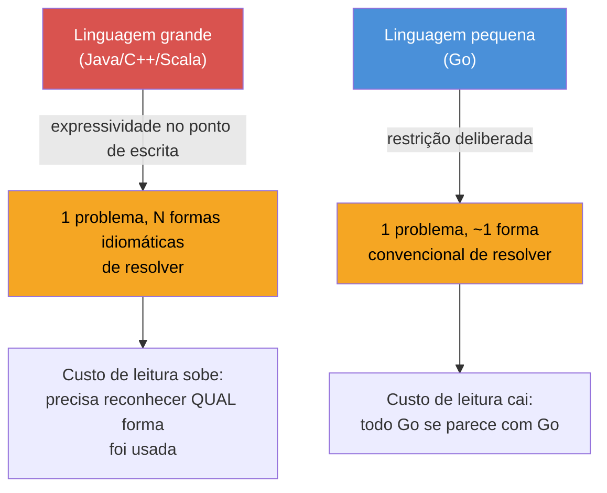
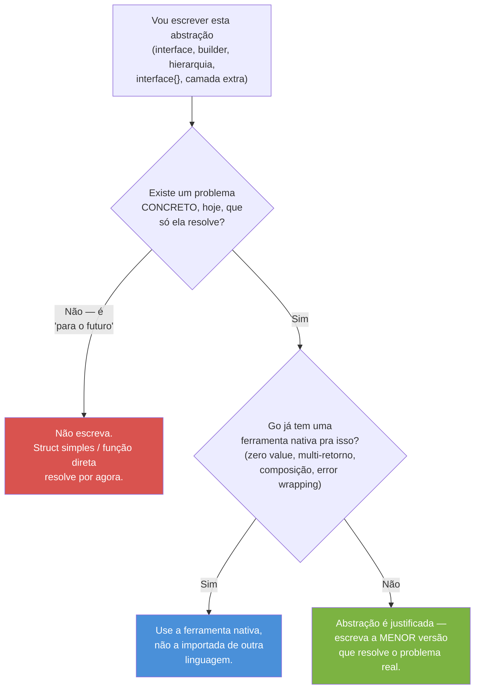

# Escrevendo Go que não parece Java

> [!abstract] TL;DR
> Código Go que "parece Java" compila e funciona — mas denuncia, linha a linha, que quem escreveu ainda pensa em outra linguagem e só troca a sintaxe. O sintoma comum é **resistir ao tamanho pequeno da linguagem**: recriar hierarquia onde bastava composição, builder onde bastava struct literal, `Optional<T>` onde bastava zero value, factory onde bastava `New`. O "Go way" não é um conjunto de regras extras — é o oposto: **usar menos** do que a linguagem oferece, deixar as ~25 keywords fazerem o trabalho, e resolver problemas com o vocabulário que já está lá (interfaces pequenas, erros como valor, `defer`, composição). Um sênior em Go se reconhece menos pelo que ele sabe fazer e mais pelo que ele *evita* fazer.

## O sintoma antes do diagnóstico

Pega este trecho — compila, roda, passa em `go vet`:

```go
type AbstractRepository interface {
    FindByID(id string) (interface{}, error)
    Save(entity interface{}) error
}

type BaseService struct {
    repo AbstractRepository
}

func NewBaseService(repo AbstractRepository) *BaseService {
    return &BaseService{repo: repo}
}

func (s *BaseService) Process(id string) (interface{}, error) {
    entity, err := s.repo.FindByID(id)
    if err != nil {
        return nil, err
    }
    return entity, nil
}

type UserService struct {
    *BaseService
}

func NewUserService(repo AbstractRepository) *UserService {
    return &UserService{BaseService: NewBaseService(repo)}
}
```

Nada aqui está *errado* — é sintaticamente Go válido. Mas cada peça carrega uma decisão importada de outro lugar: `AbstractRepository` com nome de interface Java (o prefixo `Abstract`, o `interface{}` fazendo o papel de generics mal resolvido), uma hierarquia `BaseService` → `UserService` via embedding simulando herança, um `Process` que devolve `interface{}` porque "é genérico" em vez de devolver o tipo concreto que ele sempre teve em mãos. Um dev Go sênior olha isso e não vê um bug — vê **fricção**: código que trabalha contra a gramática da linguagem em vez de com ela.

Essa é a pergunta que fecha o galho inteiro: depois de aprender naming (nota 01), composição (nota 03), os erros clássicos de quem vem de OO (nota 04), ferramental de lint (nota 05) e como revisar isso tudo em código review (nota 06) — o que sobra? Sobra reconhecer o *padrão* por trás de todos os sintomas específicos. E o padrão é sempre o mesmo: **tentar fazer a linguagem parecer maior do que ela é**.

## O mecanismo: por que Go resiste a crescer

Go tem, de propósito, um vocabulário pequeno — 25 palavras reservadas, sem `class`, sem `extends`, sem generics até 2022, sem exceptions, sem sobrecarga de método. Rob Pike descreveu essa escolha em termos quase provocativos: Go foi desenhada para programadores que a comunidade Google via chegando de C++ e Java sem tempo (ou paciência) para dominar um sistema de tipos elaborado — a aposta era que uma linguagem *simples de ler*, mesmo que *verbosa de escrever*, ganha em times grandes, com rotatividade, ao longo de anos.



Essa restrição tem uma consequência direta sobre o que "escrever Go idiomático" significa na prática: não é aprender mais uma feature, é **resistir à tentação de simular, com o pouco que Go oferece, o muito que outra linguagem oferecia**. Interfaces em Go não têm `implements` porque a linguagem quer satisfação estrutural, não porque "esqueceram" de implementar a keyword. Não há `Optional<T>` porque zero values e múltiplo retorno (`valor, ok := m[chave]`) já resolvem o problema sem precisar de um tipo genérico wrapper. Não há herança porque composição (`type Server struct { *http.Server; logger *slog.Logger }`) cobre reuso de comportamento sem as armadilhas do diamond problem.

O ganho não é estético. É que, num time com rotatividade, código Go escrito por dez pessoas diferentes converge para formas parecidas — porque a linguagem oferece poucas formas para começo de conversa. Simular abstrações de outra linguagem quebra essa convergência: agora o time precisa aprender não só Go, mas a variante particular de "Go-que-parece-Java" que um dev decidiu introduzir.

> [!question]- Isso não é só questão de estilo, sem consequência real?
> Tem consequência mensurável: cada camada de indireção artificial (interface com um único implementador, `interface{}` no lugar de tipo concreto, hierarquia de embedding profunda) é uma parada a mais que o leitor precisa fazer para entender o fluxo — e, no caso de `interface{}`/`any` mal usado, é também uma perda de checagem em tempo de compilação que só aparece como `panic` em runtime. O custo não é filosófico; é o tempo de revisão de PR e o número de bugs que só o teste (ou o cliente) encontra.

## As cinco resistências do Go idiomático

Sintetizando as notas anteriores do galho num vocabulário só, um sênior em Go resiste, de forma consistente, a cinco impulsos que vêm de OO clássica:

### 1. Resistir a criar hierarquia onde bastava composição

Java ensina "modele o domínio com herança": `Animal` → `Cachorro` → `CachorroDePolicia`. Go não tem ferramenta para isso — e a ausência é proposital. A nota 03 já mostrou como embedding resolve reuso sem hierarquia rígida:

```go
// Não: hierarquia simulada via embedding profundo
type Base struct{}
type Middle struct{ Base }
type Leaf struct{ Middle }

// Sim: composição direta, plana, sem árvore de "é-um"
type Logger struct{ prefix string }
type Server struct {
    logger Logger
    router *http.ServeMux
}
```

`Server` não "é um" `Logger` — ele *tem* um `Logger`. A diferença parece sutil, mas evita a armadilha central que a nota 04 documentou: métodos promovidos por embedding profundo ficam difíceis de rastrear (`s.Info(...)` — vindo de onde, exatamente, na cadeia?). Um sênior mantém a árvore de composição rasa, quase sempre um nível só.

### 2. Resistir a interfaces grandes e antecipadas

Java (via C#, via UML de curso de faculdade) ensina a desenhar a interface primeiro, ampla, "para cobrir os casos futuros". Go faz o oposto — a comunidade formalizou isso no aforismo "the bigger the interface, the weaker the abstraction", atribuído a Rob Pike:

```go
// Não-idiomático: interface ampla, definida antes de qualquer consumidor real
type Repository interface {
    FindByID(id string) (User, error)
    FindByEmail(email string) (User, error)
    Save(u User) error
    Delete(id string) error
    List(filter Filter) ([]User, error)
}

// Idiomático: o CONSUMIDOR declara só o que usa
type UserFinder interface {
    FindByID(id string) (User, error)
}

func Greet(f UserFinder, id string) (string, error) {
    u, err := f.FindByID(id)
    if err != nil {
        return "", err
    }
    return "Olá, " + u.Name, nil
}
```

`io.Reader` — um método, `Read([]byte) (int, error)` — é o exemplo canônico dessa filosofia: minúsculo, e por isso satisfeito por dezenas de tipos completamente diferentes na standard library (arquivo, socket, buffer, `strings.Reader`). Interfaces em Go moram perto de quem *consome*, não perto de quem implementa — e nascem pequenas, quase sempre com um método só.

### 3. Resistir a `interface{}`/`any` como substituto de tipo concreto ou generics

Antes de Go 1.18, `interface{}` era a única saída para código "genérico" — e virou hábito usá-lo em lugares onde um tipo concreto já bastava. Depois de generics (Go 1.18), esse hábito ficou ainda mais claramente um cheiro:

> [!info] Generics — Go 1.18 (mar/2022)
> `func Map[T, U any](s []T, f func(T) U) []U` substitui boa parte do uso legítimo de `interface{}` para "funciona com qualquer tipo". O pacote `slices` (Go 1.21) e `cmp` já entregam boa parte disso pronto — `slices.Contains`, `slices.Sort`, `cmp.Compare` — sem precisar reinventar.

```go
// Não-idiomático: interface{} onde o tipo já era conhecido
func Process(data interface{}) interface{} {
    v := data.(User) // type assertion às cegas — panic se vier outra coisa
    return v.Name
}

// Idiomático: tipo concreto, sem indireção nenhuma
func Process(u User) string {
    return u.Name
}

// Idiomático, quando de fato precisa ser genérico:
func Map[T, U any](s []T, f func(T) U) []U {
    out := make([]U, len(s))
    for i, v := range s {
        out[i] = f(v)
    }
    return out
}
```

`any` (alias de `interface{}` desde Go 1.18) continua tendo uso legítimo — `encoding/json`, `fmt.Println`, containers verdadeiramente heterogêneos. O sintoma não-idiomático é usá-lo por reflexo, como "genérico de pobre", quando o tipo concreto ou um parâmetro de tipo já resolveria com checagem em tempo de compilação.

### 4. Resistir a builders e factories onde struct literal resolve

Java precisa de builder para lidar com muitos parâmetros opcionais e imutabilidade. Go tem **campos nomeados no struct literal** — o problema que o builder resolve em Java já vem resolvido de fábrica:

```go
// Não-idiomático: builder pattern importado sem necessidade
type ServerBuilder struct {
    host string
    port int
}

func NewServerBuilder() *ServerBuilder { return &ServerBuilder{port: 8080} }
func (b *ServerBuilder) Host(h string) *ServerBuilder { b.host = h; return b }
func (b *ServerBuilder) Port(p int) *ServerBuilder     { b.port = p; return b }
func (b *ServerBuilder) Build() *Server                { return &Server{Host: b.host, Port: b.port} }

srv := NewServerBuilder().Host("localhost").Port(9000).Build()

// Idiomático: struct literal com campos nomeados — sem classe auxiliar nenhuma
type Server struct {
    Host string
    Port int
}

srv := Server{Host: "localhost", Port: 9000} // ordem livre, campos omitidos = zero value
```

Quando existe validação real na construção (não só atribuição de campo), a resposta idiomática é uma função `New` simples — não um builder fluente:

```go
func NewServer(host string, port int) (*Server, error) {
    if port <= 0 {
        return nil, fmt.Errorf("porta inválida: %d", port)
    }
    return &Server{Host: host, Port: port}, nil
}
```

### 5. Resistir a `try/catch` mental — erro é valor, não exceção disfarçada

O galho de erros já cobriu isso em profundidade em outro lugar da trilha; aqui cabe só o resumo síntese, porque é o hábito mais persistente de quem vem de Java: tratar `error` como um `Exception` que "só não tem `catch`". Isso produz código que ignora o retorno de erro esperando que "algo" pare o fluxo — e nada para:

```go
// Não-idiomático: erro tratado como decoração, ignorado na prática
func Load(path string) *Config {
    data, _ := os.ReadFile(path) // erro descartado — se falhar, data é nil e o programa segue
    var cfg Config
    json.Unmarshal(data, &cfg)   // json.Unmarshal de nil só piora o diagnóstico
    return &cfg
}

// Idiomático: erro é valor de retorno comum, verificado no ponto de origem
func Load(path string) (*Config, error) {
    data, err := os.ReadFile(path)
    if err != nil {
        return nil, fmt.Errorf("lendo config %s: %w", path, err)
    }
    var cfg Config
    if err := json.Unmarshal(data, &cfg); err != nil {
        return nil, fmt.Errorf("parseando config %s: %w", path, err)
    }
    return &cfg, nil
}
```

Não existe atalho para isso além de checar `if err != nil` a cada chamada que retorna erro — e é exatamente essa verbosidade repetitiva que faz Go parecer "cansativo" pra quem chega de uma linguagem com exceptions. A resposta da comunidade não foi adicionar exceptions; foi aceitar a verbosidade como o preço de erros visíveis no fluxo de controle, em vez de invisíveis até estourarem em runtime.

## A sexta resistência: pacotes como "namespace de classe"

Vale destacar separadamente porque é mais estrutural que as cinco anteriores — não é um padrão de código, é a organização do projeto inteiro. Quem vem de Java tende a organizar pacotes por **camada técnica**: `controllers/`, `services/`, `repositories/`, `models/`, `dtos/` — o layout clássico de qualquer projeto Spring. Em Go, esse layout produz um cheiro específico: pacotes que só existem para agrupar tipos pela *natureza técnica* deles, não pelo *domínio* que resolvem.

```
// Não-idiomático: pacotes por camada (calcado em Spring/Java EE)
myapp/
  controllers/
    order_controller.go
    user_controller.go
  services/
    order_service.go
    user_service.go
  repositories/
    order_repository.go
    user_repository.go
  models/
    order.go
    user.go

// Idiomático: pacotes por domínio, cada um com seus tipos, sua lógica, seu acesso a dado
myapp/
  order/
    order.go       // type Order, validação, regras de negócio
    store.go        // persistência de Order
    handler.go       // HTTP handler de Order
  user/
    user.go
    store.go
    handler.go
```

A justificativa não é estética — é sobre **acoplamento cíclico**. No layout por camada, `services` importa `repositories` e `models`, `controllers` importa `services` — e é comum, à medida que o projeto cresce, `models` precisar de algo que só `services` tem, criando um ciclo que o compilador Go recusa terminantemente (Go não permite import cíclico entre pacotes, ponto final, sem meio-termo como em outras linguagens). O layout por domínio evita o problema na origem: cada pacote de domínio é relativamente autocontido, e as dependências entre pacotes tendem a fluir numa direção só, definida pelo próprio negócio.

> [!question]- Isso significa que `handler.go`, `store.go` e `service.go` num mesmo pacote violam separação de responsabilidades?
> Não — a separação continua existindo, só que dentro do pacote, por **arquivo** e por **tipo**, não por diretório. `type OrderHandler struct{...}`, `type OrderStore struct{...}` e a lógica de domínio em `Order` continuam sendo peças distintas, com responsabilidades distintas — só compartilham o mesmo pacote porque tratam do mesmo assunto. É a mesma lição do naming (nota 02): Go prefere nomes curtos e específicos ao contexto do pacote (`order.Handler`, não `order.OrderHandler`) — a camada técnica vira parte do *nome do tipo*, não parte do *caminho do diretório*.

## Reconhecendo o padrão em tempo real

As seis resistências compartilham uma pergunta de verificação única, que vale internalizar como reflexo de leitura de código — inclusive o próprio, antes de abrir um PR:



Esse fluxograma resume, em forma de pergunta, o que as notas 01 a 06 do galho ensinaram em separado: naming correto, composição no lugar de herança, os erros clássicos de quem vem de OO, ferramental que pega parte disso automaticamente (`golangci-lint`), e o julgamento humano de code review para pegar o resto. Um sênior não decora as seis resistências como checklist — ele internaliza a pergunta única e a aplica sem esforço consciente, do mesmo jeito que um revisor experiente "sente" quando um PR tem cheiro de over-engineering antes mesmo de nomear qual regra específica foi violada.

## Caso prático: o mesmo problema, duas vezes

Um exemplo fechado, de ponta a ponta, ajuda a ver as cinco resistências trabalhando juntas. O problema: validar e processar um pedido, registrando cada etapa.

```go
// ── Versão "Go que parece Java" ──────────────────────────────

type AbstractValidator interface {
    Validate(entity interface{}) (bool, interface{})
}

type OrderValidatorImpl struct{}

func NewOrderValidatorImpl() AbstractValidator {
    return &OrderValidatorImpl{}
}

func (v *OrderValidatorImpl) Validate(entity interface{}) (bool, interface{}) {
    order, ok := entity.(*Order)
    if !ok {
        return false, "tipo inválido"
    }
    if order.Total <= 0 {
        return false, "total inválido"
    }
    return true, nil
}

type OrderProcessor struct {
    validator AbstractValidator
}

func (p *OrderProcessor) Process(entity interface{}) interface{} {
    ok, err := p.validator.Validate(entity)
    if !ok {
        return err
    }
    return "processado"
}
```

```go
// ── Versão idiomática ────────────────────────────────────────

type Order struct {
    ID    string
    Total float64
}

var ErrTotalInvalido = errors.New("total do pedido deve ser positivo")

func Validate(o Order) error {
    if o.Total <= 0 {
        return fmt.Errorf("pedido %s: %w", o.ID, ErrTotalInvalido)
    }
    return nil
}

func Process(o Order, log *slog.Logger) error {
    if err := Validate(o); err != nil {
        return fmt.Errorf("processando pedido: %w", err)
    }
    log.Info("pedido processado", "id", o.ID, "total", o.Total)
    return nil
}
```

> [!info] log/slog — Go 1.21 (ago/2023)
> A versão idiomática usa `*slog.Logger` — logging estruturado nativo, sem dependência externa (`zap`, `logrus`). Antes de 1.21, era comum ver justamente o tipo de indireção artificial da versão "Java" — uma interface `Logger` própria só para poder trocar de biblioteca de log — porque não havia opção padrão boa o bastante. Com `slog` na standard library, boa parte dessa camada de abstração deixou de ter razão de existir.

A segunda versão tem menos linhas, zero `interface{}`, zero type assertion, e o compilador pega qualquer tipo errado em `Order` na hora de compilar — não em runtime. Não é "mais simples porque é menos código"; é mais simples porque **cada abstração que sumiu não estava resolvendo problema nenhum que a linguagem não resolvesse sozinha**.

## Armadilhas comuns

> [!warning] Confundir "idiomático" com "menos código a qualquer custo"
> Reduzir linhas não é o objetivo — é consequência. Um one-liner ilegível não é mais idiomático que uma função clara de 15 linhas. A régua certa é "essa abstração resolve um problema real que existe hoje?", não "quantos caracteres eu economizei?".

> [!warning] Aplicar o "Go way" como dogma contra qualquer abstração
> Nem toda interface é over-engineering, nem todo `struct` com um método só é desnecessário. O ponto não é "nunca abstrair" — é abstrair **quando o consumidor já existe e precisa**, não antecipando um futuro hipotético. Interfaces continuam sendo a ferramenta certa para desacoplar testes de I/O real, por exemplo — o problema é a interface ampla, especulativa, definida antes de qualquer consumidor concreto.

> [!warning] Copiar padrão de outra linguagem porque "resolveu lá"
> Um padrão ser bom em Java (Dependency Injection via container, Builder, Factory Method, Singleton via `static`) não significa que Go precisa da mesma solução. Go geralmente já resolve o problema *que motivou* o padrão de um jeito mais direto — a pergunta certa não é "como faço builder em Go?", é "que problema esse builder resolvia, e Go já resolve isso de outra forma?".

## Lente cross-stack: o mesmo problema, resposta diferente

| Problema | Java | Go idiomático |
|---|---|---|
| Reuso de comportamento | herança de classe (`extends`) | composição / embedding raso |
| Parâmetro opcional / muitos campos | Builder pattern | struct literal com campos nomeados |
| Polimorfismo | interface ampla + `implements` explícito | interface pequena, satisfação implícita, definida no consumidor |
| "Genérico de qualquer tipo" | `Object`, depois `<T>` | tipo concreto; `any`/generics só quando necessário |
| Fluxo de erro excepcional | `throw`/`try`/`catch` | `error` como retorno comum, `if err != nil` |
| Injeção de dependência | container DI (Spring) | passar dependência explícita no construtor/função — sem framework |
| Singleton | `static` + padrão Singleton | variável de pacote, ou `sync.Once` quando precisa de inicialização preguiçosa |

A tabela não é "Go é melhor" — é "Go resolve o mesmo problema com peças diferentes, e trazer as peças de Java sem perguntar se Go já tem resposta própria é a origem de quase todo código não-idiomático".

## Como explicar em inglês

> Writing idiomatic Go isn't about learning more syntax — it's about resisting the urge to rebuild, with Go's small vocabulary, the abstractions a bigger language gave you for free. The tell is almost always the same: class hierarchies simulated through deep embedding, wide interfaces defined before any real consumer exists, `interface{}`/`any` standing in for a concrete type or a generic parameter, builder patterns where a named-field struct literal already does the job, and errors treated as decoration instead of values checked at the call site. None of this is stylistic preference — a small, consistently-used vocabulary is what lets Go code written by different people, over years, still read the same way. A senior Go developer is recognized less by what they can build and more by what they refuse to import from another language's playbook.

| Termo PT | Termo EN |
|---|---|
| Go idiomático | idiomatic Go |
| linguagem pequena (deliberada) | small (deliberate) language |
| interface ampla / especulativa | wide / speculative interface |
| satisfação estrutural | structural satisfaction |
| composição sobre herança | composition over inheritance |
| erro como valor | error as a value |
| tipo genérico de pobre | poor man's generic |
| cheiro de código | code smell |

## O que vem a seguir

Este galho fechou o ciclo de escrever e revisar Go como um sênior — da cultura (Effective Go) até reconhecer, sem checklist, o padrão por trás de código que "compila mas não é Go". O que falta agora é uma coisa diferente: **defender esse conhecimento sob pressão de entrevista**, onde perguntas de sistema, live coding e questões conceituais testam se o que foi internalizado sobrevive a um quadro branco. O [[03-Dominios/Tecnologia/Go/index|Galho 21 — Preparação para entrevista de Go]] fecha a trilha inteira com esse foco.

## Veja também

- [[01 - Effective Go e a cultura]] — a fonte primária do "Go way" que este capítulo sintetiza
- [[02 - Naming e organização]] — a primeira camada de idiomaticidade, no nome antes do design
- [[03 - Composição sobre herança na prática]] — aprofunda a resistência #1 deste capítulo
- [[04 - Erros comuns de quem vem de OO]] — cada armadilha aqui citada em detalhe próprio
- [[05 - go vet, golangci-lint e ferramentas]] — como automatizar parte desta detecção
- [[06 - Code review em Go]] — aplicar este julgamento em código de outra pessoa
- [[03-Dominios/Tecnologia/Go/index|Trilha Go]]

## Fontes

- The Go Authors. *Effective Go*. go.dev. https://go.dev/doc/effective_go (acessado em 2026-07-18)
- Pike, Rob. *Go Proverbs*. go-proverbs.github.io (talk transcript hospedado em go.dev/blog). https://go.dev/blog/toward-go2 (acessado em 2026-07-18)
- The Go Authors. *Tutorial: Getting started with generics*. go.dev. https://go.dev/doc/tutorial/generics (acessado em 2026-07-18)
- The Go Authors. *log/slog package documentation*. pkg.go.dev. https://pkg.go.dev/log/slog (acessado em 2026-07-18)
- The Go Authors. *slices package documentation*. pkg.go.dev. https://pkg.go.dev/slices (acessado em 2026-07-18)
- Go by Example. *Struct Embedding*. gobyexample.com. https://gobyexample.com/struct-embedding (acessado em 2026-07-18)
