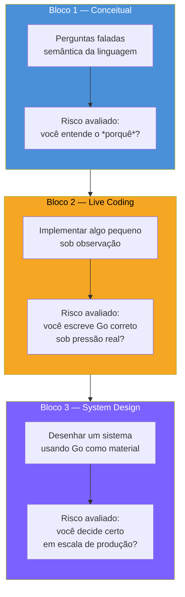
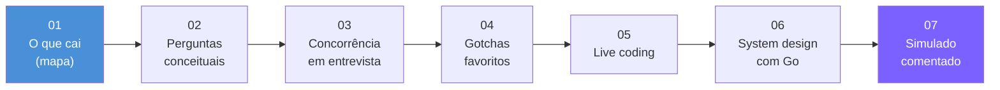

# O que cai numa entrevista de Go

> [!abstract] TL;DR
> Uma entrevista técnica de Go raramente é uma prova de sintaxe — é uma prova de **modelo mental**. O entrevistador quer ver se você entende *por que* Go faz as coisas do jeito que faz (goroutines em vez de threads, `error` em vez de exceção, composição em vez de herança), não se você decorou a assinatura de `sync.WaitGroup`. O formato típico tem três blocos, quase sempre nesta ordem: **conceitual** (perguntas faladas sobre semântica da linguagem), **live coding** (implementar algo pequeno, correto e idiomático, sob observação), e **system design** (desenhar um sistema usando Go como material de construção, não como assunto em si). Este galho cobre os três, mais os gotchas que todo entrevistador de Go tem no bolso. Esta nota é o mapa: o que esperar, como cada bloco é avaliado, e por onde as próximas seis notas do galho passam.

## O momento em que a entrevista muda de assunto

Imagine a cena: você está numa call, já respondeu bem sobre slices e arrays, e o entrevistador digita um link de compartilhamento de tela. "Beleza, agora implementa um rate limiter simples." Sem aviso prévio de que era essa a virada — do papo conceitual para o teclado ligado.

Esse corte é o padrão, não o acaso. Quem entrevista para vaga de Go — em startups do Vale do Silício, em empresas remote-first, em qualquer lugar que usa Go em produção — está avaliando três coisas fundamentalmente diferentes, e sabe que nenhuma delas prevê bem as outras duas. Um candidato pode explicar goroutines com fluência de professor e travar ao escrever um `select` de verdade sob pressão de tempo. Outro pode escrever código limpo isoladamente e não saber decompor um sistema em serviços quando o problema cresce. A entrevista de Go bem desenhada testa as três camadas porque cada uma captura um risco de contratação diferente.

O erro mais caro de quem se prepara mal não é não saber Go — é treinar só uma das três camadas (geralmente a conceitual, por ser a mais fácil de estudar em livro) e chegar despreparado para as outras duas.

## O mapa: três blocos, três riscos diferentes



Cada bloco mede um risco de contratação distinto — e é por isso que raramente um substitui o outro numa entrevista bem estruturada.

### Bloco 1 — Conceitual: "você entende o porquê?"

São perguntas faladas, sem editor de código aberto (ou com editor aberto só para rascunhar um trecho de duas linhas). O entrevistador pergunta coisas como "qual a diferença entre um `nil` slice e um slice vazio?", "quando um erro deveria ser envolvido com `%w` em vez de `%v`?", "o que acontece se você fizer append num slice que compartilha array com outro?".

O que está sendo medido aqui não é memorização — é se você **internalizou o modelo mental** de Go o suficiente para explicar consequências, não só definições. Um candidato que decorou "slice é um struct com ponteiro, len e cap" mas não consegue prever o que acontece quando dois slices compartilham array subjacente decorou a resposta errada — decorou a definição em vez do modelo. A [[02 - Perguntas conceituais clássicas|nota 02]] deste galho cataloga as perguntas que mais se repetem nessa categoria.

### Bloco 2 — Live coding: "você escreve Go correto sob pressão?"

Aqui o teclado liga. O problema costuma ser pequeno de propósito — não é um algoritmo de doutorado, é algo do tamanho de "implemente um cache LRU thread-safe" ou "escreva uma função que processa uma lista de itens em paralelo com um limite de concorrência". O tamanho pequeno é deliberado: o entrevistador não está testando se você resolve problemas difíceis contra o relógio, está testando se o Go que sai da sua cabeça sob observação é **idiomático** — se você usa `error` do jeito certo, se fecha canais no lugar certo, se não deixa uma goroutine vazando.

É o bloco onde mais candidatos experientes em outras linguagens tropeçam: escrever Go que "funciona" é fácil depois de uma semana de tutorial; escrever Go que um revisor sênior aprovaria sem comentário é outra prova. A [[04 - Os gotchas favoritos|nota 04]] e a [[05 - Live coding em Go|nota 05]] deste galho cobrem, respectivamente, os erros clássicos que vazam nesse momento e como estruturar a sessão para não travar.

### Bloco 3 — System design: "você decide certo em escala de produção?"

O bloco mais avançado, e o que menos tem a ver com sintaxe de Go propriamente dita. O problema típico é "desenhe um sistema de encurtador de URLs" ou "como você estruturaria um serviço de notificações que processa um milhão de eventos por hora" — e Go entra como **material de construção**, não como assunto. O entrevistador quer ver se você sabe onde uma goroutine pool cabe, onde `context.Context` carrega cancelamento através de um pipeline, onde um `channel` vira backpressure real, e onde nenhuma dessas ferramentas resolve nada porque o gargalo está no banco de dados, não na linguagem.

> [!warning] System design de Go não é system design genérico com sotaque
> Um erro comum de quem já treinou system design "genérico" (o tipo de pergunta agnóstica de linguagem, comum em entrevistas de qualquer stack) é chegar no bloco de Go e recitar o mesmo roteiro sem amarrar as decisões às primitivas concretas da linguagem. Quando a pergunta é "system design com Go", o entrevistador espera ouvir `goroutine`, `channel`, `context`, `worker pool` — não só "load balancer" e "cache distribuído" em abstrato.

## Um exemplo concreto do Bloco 2

Para tirar o Bloco 2 do abstrato, vale ver o tamanho e o formato de um problema típico. Um pedido comum de live coding é algo como "implemente um worker pool que processa uma lista de tarefas com um limite de N goroutines simultâneas". Não é um problema de estrutura de dados exótica — é pequeno, de propósito, para caber em quinze ou vinte minutos de tela compartilhada:

```go
package main

import (
	"context"
	"fmt"
	"sync"
)

// Task é o trabalho a processar; Result é o que sai do lado de cá.
type Task struct {
	ID int
}

type Result struct {
	TaskID int
	Output string
}

// processarTarefas roda até `limite` goroutines simultâneas, respeitando
// cancelamento via ctx, e devolve os resultados por um channel.
func processarTarefas(ctx context.Context, tasks []Task, limite int) <-chan Result {
	results := make(chan Result, len(tasks))
	sem := make(chan struct{}, limite) // semáforo via channel com buffer

	var wg sync.WaitGroup
	for _, t := range tasks {
		select {
		case <-ctx.Done():
			// cancelamento pedido: para de despachar tarefas novas
			continue
		default:
		}

		wg.Add(1)
		sem <- struct{}{} // ocupa uma vaga do semáforo

		go func(task Task) {
			defer wg.Done()
			defer func() { <-sem }() // libera a vaga ao terminar

			select {
			case <-ctx.Done():
				return
			case results <- Result{TaskID: task.ID, Output: fmt.Sprintf("processado #%d", task.ID)}:
			}
		}(t)
	}

	go func() {
		wg.Wait()
		close(results) // sinaliza "acabou" para quem consome o channel
	}()

	return results
}

func main() {
	ctx := context.Background()
	tasks := []Task{{ID: 1}, {ID: 2}, {ID: 3}, {ID: 4}, {ID: 5}}

	for r := range processarTarefas(ctx, tasks, 2) {
		fmt.Println(r.Output)
	}
}
```

O que um avaliador procura aqui não é "funcionou" — é a lista de sinais idiomáticos da seção anterior, todos presentes de propósito neste exemplo: o `context.Context` como primeiro parâmetro (convenção estabelecida pelo [Go blog sobre `context`](https://go.dev/blog/context)), o `defer` cuidando da liberação do semáforo mesmo em caminho de erro, o `close(results)` feito por quem escreve no channel (nunca por quem lê — regra que a [[03 - Concorrência em entrevista|nota 03]] retoma), e o cancelamento verificado nos dois pontos onde importa: antes de despachar trabalho novo e dentro de cada goroutine.

> [!warning] O erro mais comum neste tipo de exercício é o channel sem buffer certo
> Um `results := make(chan Result)` sem buffer, combinado com `close` antes de todo consumidor ler, trava o programa inteiro em deadlock — o tipo de erro que passa despercebido em testes rápidos e explode na frente do entrevistador. Dimensionar o buffer (`len(tasks)` aqui) ou garantir que o consumo aconteça em paralelo à produção é exatamente o tipo de detalhe que separa "compilou" de "está correto".

## Como Go é avaliado — o que pesa mais do que parece

Um jeito útil de pensar sobre a avaliação: o entrevistador de Go quase sempre trabalha com um checklist implícito de **sinais idiomáticos**, mais do que com "a resposta certa" no sentido de prova escolar. Alguns sinais que pesam de forma desproporcional ao esforço de demonstrá-los:

- **Tratamento de erro explícito e sem atalho.** Um `if err != nil { return err }` esquecido, ou um `_ = err` silenciando erro sem justificativa, é o tipo de coisa que um entrevistador sênior de Go nota instantaneamente — porque é exatamente o hábito que separa quem trabalhou de verdade com Go em produção de quem só passou pelo tour da linguagem.
- **Concorrência sem vazamento.** Abrir uma goroutine sem pensar em como ela termina (ou é cancelada) é o gotcha mais citado em relatos de entrevista de Go — mais adiante, a [[03 - Concorrência em entrevista|nota 03]] entra fundo nisso.
- **Composição em vez de reflexo de herança.** Candidatos vindos de Java/C# às vezes tentam recriar hierarquias de classe via embedding forçado. Um entrevistador de Go percebe rápido quando a solução deveria ter sido uma interface pequena satisfeita implicitamente, não uma cadeia de embedding imitando `extends`.
- **Comunicação do raciocínio, não só o resultado.** Em entrevista remota — o cenário mais comum hoje, inclusive para vagas internacionais — narrar o raciocínio em voz alta importa tanto quanto o código final, porque é o único sinal que o entrevistador tem do seu processo de decisão.

> [!info] Contexto de versão
> As perguntas e o código deste galho assumem **Go 1.23+** — a versão estável mais recente na maior parte dos processos seletivos atuais. Onde uma feature for recente o bastante para ainda causar surpresa (`for range` sobre inteiro desde 1.22, `range` sobre função desde 1.23, correção da semântica de variável de loop em 1.22, `slices`/`maps` na standard library desde 1.21), a nota específica do galho sinaliza isso com um callout `[!info]` próprio.

## O mapa da preparação: as sete notas deste galho



O galho segue a progressão natural de uma preparação real: primeiro o terreno conceitual clássico (nota 02), depois o tópico que mais separa júnior de sênior em Go — concorrência sob pressão de entrevista (nota 03) —, depois os gotchas que aparecem tanto no bloco conceitual quanto no live coding (nota 04). As três últimas notas sobem de fase para Magus: como conduzir a sessão de live coding do início ao fim sem travar (nota 05), como estruturar um system design usando Go como material de construção (nota 06), e um simulado comentado que costura tudo — as três camadas, numa sessão só, com comentário linha a linha do que um avaliador estaria procurando (nota 07).

Este galho não redefine conceitos de linguagem, concorrência ou design que já foram estabelecidos nos galhos anteriores da trilha — ele **aponta de volta** para eles sempre que uma pergunta de entrevista depende de um mecanismo já coberto. O papel dele é outro: simular a pressão e o formato reais de uma entrevista, e consolidar o que os vinte galhos anteriores já ensinaram em respostas prontas para serem faladas em voz alta, sob relógio, numa call.

## Lente cross-stack: o que muda de verdade entre linguagens

| Vindo de... | Na entrevista de Go, a diferença que mais pega |
|---|---|
| Java | Não existe "pergunta de OO clássica" (herança, polimorfismo por classe) — o equivalente é sobre composição e satisfação implícita de interface; goroutine substitui thread/`ExecutorService` como o tópico pesado de concorrência |
| Python | O bloco conceitual cobra tipagem estática e `error` explícito onde Python cobraria duck typing e exceções; live coding em Go pune bugs de concorrência que o GIL do CPython simplesmente não deixa acontecer |
| Node/JavaScript | A pergunta "como você lida com operação assíncrona" muda de Promise/`async-await` sobre um único thread para goroutine/channel sobre múltiplos threads reais — modelo mental diferente, não só sintaxe diferente |

Essa tabela não é pré-requisito para nada do galho — é só um atalho para quem já carrega intuição forte de outra stack e quer saber onde recalibrar primeiro.

## Como explicar em inglês

> A typical Go interview has three distinct rounds, usually in this order: a **conceptual round** — spoken questions about language semantics, checking whether you understand *why* Go works the way it does, not just what the syntax looks like; a **live coding round** — a small, focused problem where the interviewer watches whether the Go you write under pressure is idiomatic, especially around error handling and goroutine lifecycle; and a **system design round** — a broader design problem where Go is the building material (goroutines, channels, `context.Context`, worker pools), not the subject itself. The signal interviewers weigh most heavily is often invisible in a study plan: explicit error handling with no shortcuts, concurrency that doesn't leak, and composition used instead of Java-style inheritance patterns. Preparing for one round only — usually the conceptual one, because it's the easiest to study from a book — is the most common and costly mistake candidates make.

| Termo PT | Termo EN |
|---|---|
| entrevista conceitual | conceptual round / trivia round |
| live coding | live coding |
| desenho de sistema | system design |
| sinal idiomático | idiomatic signal |
| vazamento de goroutine | goroutine leak |
| composição | composition |
| satisfação implícita de interface | implicit interface satisfaction |
| gotcha | gotcha |
| simulado | mock interview |

## O que vem a seguir

Com o mapa dos três blocos estabelecido, a próxima parada é o bloco conceitual em detalhe — as perguntas clássicas que aparecem com mais frequência em relatos reais de entrevista de Go, do tipo "qual a diferença entre `nil` slice e slice vazio" até "quando usar `defer` custa performance de verdade". A [[02 - Perguntas conceituais clássicas|nota 02]] cataloga essas perguntas com a resposta que um entrevistador sênior espera ouvir — e o porquê por trás de cada uma.

## Veja também

- [[02 - Perguntas conceituais clássicas|02 — Perguntas conceituais clássicas]] — próxima nota do galho
- [[03 - Concorrência em entrevista|03 — Concorrência em entrevista]]
- [[04 - Os gotchas favoritos|04 — Os gotchas favoritos]]
- [[05 - Live coding em Go|05 — Live coding em Go]]
- [[06 - System design com Go|06 — System design com Go]]
- [[07 - Simulado comentado|07 — Simulado comentado]]
- [[03-Dominios/Tecnologia/Go/index|Trilha Go]]

## Fontes

- The Go Authors. *A Tour of Go*. go.dev. https://go.dev/tour (acessado em 2026-07-18)
- The Go Authors. *Effective Go*. go.dev. https://go.dev/doc/effective_go (acessado em 2026-07-18)
- The Go Authors. *The Go Programming Language Specification*. go.dev. https://go.dev/ref/spec (acessado em 2026-07-18)
- The Go Blog. *Go 1.22 Release Notes — for loop semantics*. go.dev. https://go.dev/blog/loopvar-preview (acessado em 2026-07-18)
- The Go Blog. *Go Concurrency Patterns: Context*. go.dev. https://go.dev/blog/context (acessado em 2026-07-18)
- The Go Authors. *Go Wiki: Go Code Review Comments*. go.dev. https://go.dev/wiki/CodeReviewComments (acessado em 2026-07-18)
