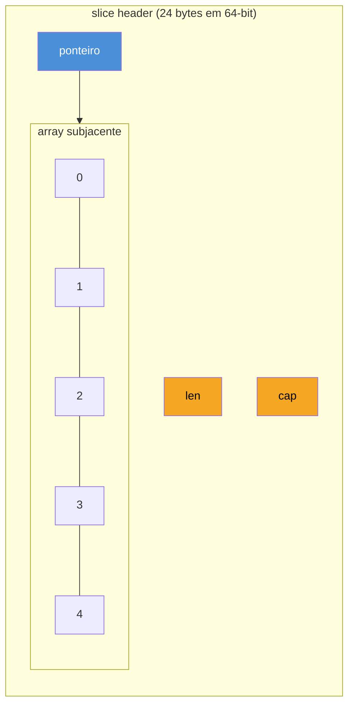
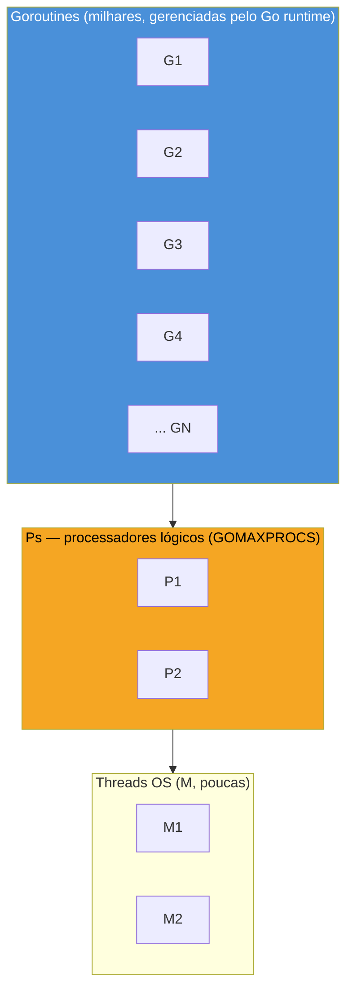

# Perguntas conceituais clássicas

> [!abstract] TL;DR
> Seis perguntas caem em praticamente toda entrevista de Go, e todas testam a mesma coisa: se você entende o **modelo mental**, não só a sintaxe. `slice vs array` mede se você sabe que slice é um struct com ponteiro+len+cap sobre um array por baixo. `value vs pointer receiver` mede se você entende cópia vs mutação. `interface satisfaction` mede se você já saiu do hábito de procurar `implements`. `goroutine vs thread` mede se você sabe por que Go escala pra milhões de unidades concorrentes onde threads OS travariam em milhares. `defer` mede se você entende LIFO e o momento de avaliação dos argumentos. `zero values` mede se você sabe que Go nunca deixa uma variável "indefinida". Cada resposta abaixo vem no formato que funciona em entrevista: uma frase de abertura que já entrega a resposta, seguida do porquê.

## Por que estas seis, e não outras

Imagine um entrevistador técnico com trinta minutos e uma lista mental de "coisas que separam quem escreveu três tutoriais de quem manteve um serviço Go em produção". Ele não vai perguntar sintaxe de `for` — isso qualquer um decora em uma tarde. Ele vai perguntar as coisas que **só doem depois que você é mordido por elas**: o slice que compartilhou array com outro e corrompeu dado silenciosamente; o método com value receiver que devia ter sido pointer e a mutação simplesmente não "pegou"; a goroutine que você lançou sem pensar e que, multiplicada por dez mil, não afundou o processo (ao contrário do que aconteceria com dez mil threads OS).

Essas seis perguntas são o denominador comum de quase toda entrevista de Go em empresa que leva a linguagem a sério — de startup a big tech. A nota anterior mapeou o terreno geral; esta desce ao nível de **pergunta e resposta modelo**, no formato que você vai de fato usar ao vivo.

## 1. Slice vs array

**Resposta modelo:** "Array tem tamanho fixo no tipo — `[5]int` e `[10]int` são tipos diferentes, incompatíveis. Slice é uma view dinâmica sobre um array: um struct de três campos — ponteiro pro array subjacente, `len` e `cap`. Passar um array por valor copia todos os elementos; passar um slice copia só o struct de três campos, mas o array continua compartilhado."



O gotcha clássico que todo entrevistador espera testar em seguida: dois slices derivados do mesmo array, via `s[1:3]`, compartilham memória — escrever em um afeta o outro, até que um `append` force realocação.

```go
original := []int{1, 2, 3, 4, 5}
janela := original[1:3] // [2, 3], compartilha array com original

janela[0] = 99
fmt.Println(original) // [1 99 3 4 5] — mutação vazou pro original
```

> [!warning] `append` pode ou não realocar — depende da capacity
> Se `cap(janela) > len(janela)`, `append(janela, x)` escreve **dentro** do array compartilhado, afetando `original` de forma silenciosa. Se a capacity já estiver esgotada, Go aloca um array novo e a partir daí os dois slices divergem. Esse comportamento condicional — "às vezes muta o original, às vezes não" — é a armadilha mais citada em entrevista de Go, e a [[04 - Os gotchas favoritos|nota 04]] deste galho dedica uma seção inteira a ela.

## 2. Value vs pointer receiver

**Resposta modelo:** "Value receiver recebe uma **cópia** do valor — qualquer mutação dentro do método morre ali. Pointer receiver recebe o **endereço** do valor original — mutações persistem. A regra prática da comunidade: se qualquer método do tipo precisa de pointer receiver (pra mutar, ou porque o struct é grande e copiar é caro), use pointer receiver em **todos** os métodos daquele tipo, por consistência — mesmo nos que não mutam nada."

```go
type Contador struct {
    total int
}

func (c Contador) IncrementaCopia() {
    c.total++ // muta a cópia local, não o original
}

func (c *Contador) Incrementa() {
    c.total++ // muta o valor apontado por c
}

func main() {
    c := Contador{}
    c.IncrementaCopia()
    fmt.Println(c.total) // 0 — a mutação não vazou

    c.Incrementa()
    fmt.Println(c.total) // 1 — pointer receiver, mutação real
}
```

O detalhe que separa quem só decorou a regra de quem entende o mecanismo: `c.Incrementa()` compila mesmo com `c` sendo um valor comum (não um ponteiro), porque o compilador insere `(&c).Incrementa()` automaticamente quando `c` é endereçável. Essa conveniência é unilateral — o inverso, chamar método de value receiver a partir de um ponteiro, também funciona (`(*p).Metodo()` vira `p.Metodo()`), mas **não** funciona se `c` vier de um mapa, porque valores de mapa não são endereçáveis.

## 3. Interface satisfaction

**Resposta modelo:** "Go não tem `implements`. Um tipo satisfaz uma interface simplesmente por ter, no seu method set, todos os métodos que a interface declara — sem nenhuma declaração explícita de intenção. É satisfação **estrutural**, decidida em tempo de compilação pelo compilador comparando as duas listas de assinaturas."

```go
type Escritor interface {
    Escrever(dado string) error
}

type Log struct{}

func (l Log) Escrever(dado string) error {
    fmt.Println("LOG:", dado)
    return nil
}

func Publicar(e Escritor) {
    e.Escrever("evento registrado")
}

func main() {
    Publicar(Log{}) // Log satisfaz Escritor — nenhuma linha declarou isso
}
```

`Log` nunca menciona `Escritor` em nenhum lugar. O compilador descobre a satisfação no ponto de uso — `Publicar(Log{})` — comparando o method set de `Log` com o que `Escritor` exige. Essa é a resposta que costuma render uma pergunta de acompanhamento: "e se eu quiser garantir isso em tempo de compilação, sem esperar o ponto de uso?" A resposta é o idioma de asserção de interface em variável descartada:

```go
var _ Escritor = Log{} // se Log deixar de satisfazer Escritor, isso não compila
```

> [!info] Interfaces vazias e `any`
> Desde Go 1.18, `any` é alias de `interface{}` — a interface que todo tipo satisfaz trivialmente, porque não exige método nenhum. Aparece o tempo todo em código genérico e em assinaturas como `json.Unmarshal(data []byte, v any) error`.

## 4. Goroutine vs thread

**Resposta modelo:** "Goroutine é uma unidade de concorrência gerenciada pelo **runtime do Go**, não pelo sistema operacional. Sua stack inicial é de ~2KB (contra megabytes de uma thread OS) e cresce dinamicamente. O runtime multiplexa milhares — ou milhões — de goroutines sobre um número pequeno de threads OS reais, usando um scheduler M:N (M goroutines sobre N threads OS)."



```go
func main() {
    var wg sync.WaitGroup
    for i := 0; i < 10000; i++ {
        wg.Add(1)
        go func() {
            defer wg.Done()
            // trabalho leve
        }()
    }
    wg.Wait()
}
```

Dez mil threads OS reais derrubariam a maioria dos sistemas por exaustão de memória e overhead de context switch do kernel. Dez mil goroutines é rotina — o custo de criação e de troca de contexto é ordens de magnitude menor, porque acontece inteiramente em user space, gerenciado pelo scheduler do Go (o modelo GMP: Goroutine, Machine/thread OS, Processor lógico).

> [!info] `go func()` e a variável de loop (Go 1.22+)
> Antes do Go 1.22, capturar a variável do `for` dentro de uma closure lançada com `go` era a armadilha número um de concorrência em entrevista — todas as goroutines viam a *mesma* variável compartilhada. Desde a 1.22, cada iteração do `for` tem sua própria cópia da variável, e o bug desapareceu por padrão. Vale mencionar isso na entrevista — mostra que você acompanha a evolução da linguagem, não só decorou um gotcha histórico.

## 5. Defer

**Resposta modelo:** "`defer` agenda uma chamada de função para rodar quando a função **envolvente** retornar — não quando o bloco onde o `defer` está termina. Múltiplos `defer`s empilham e executam em ordem **LIFO** (o último `defer` registrado roda primeiro). Os **argumentos** da chamada diferida são avaliados no momento do `defer`, não no momento da execução."

```go
func processar() {
    fmt.Println("início")
    defer fmt.Println("defer 1")
    defer fmt.Println("defer 2")
    defer fmt.Println("defer 3")
    fmt.Println("fim")
}
// saída: início, fim, defer 3, defer 2, defer 1
```

O gotcha de avaliação de argumentos é o que mais separa quem entendeu de quem decorou:

```go
func exemplo() {
    x := 1
    defer fmt.Println("valor capturado:", x) // x avaliado AGORA, vale 1
    x = 2
    fmt.Println("valor final:", x) // 2
}
// saída: valor final: 2 / valor capturado: 1
```

`x` é copiado para dentro da chamada diferida no instante do `defer` — a mudança posterior de `x` não é vista. O uso mais citado em entrevista, e o mais comum em código real, é liberar recursos de forma garantida mesmo em caminho de erro:

```go
func lerArquivo(caminho string) error {
    f, err := os.Open(caminho)
    if err != nil {
        return err
    }
    defer f.Close() // roda mesmo se o código abaixo retornar erro no meio

    // ... leitura ...
    return nil
}
```

> [!warning] `defer` dentro de laço acumula, não executa a cada iteração
> `for _, f := range arquivos { defer f.Close() }` só fecha todos os arquivos quando a função **inteira** retornar — não a cada iteração. Em laços longos, isso segura recursos abertos até o fim, podendo estourar limite de file descriptors. A correção comum é extrair o corpo do laço para uma função separada, onde o `defer` de fato limita o escopo.

## 6. Zero values

**Resposta modelo:** "Go nunca deixa uma variável declarada sem valor. Toda declaração sem inicialização explícita recebe o **zero value** do seu tipo: `0` para numéricos, `\"\"` para string, `false` para bool, `nil` para ponteiro/slice/map/channel/func/interface, e um struct com todos os campos no próprio zero value, recursivamente."

```go
var i int        // 0
var s string      // ""
var b bool         // false
var p *int         // nil
var sl []int       // nil (mas len(sl) == 0 funciona sem pânico)
var m map[string]int // nil (leitura funciona; escrita entra em pânico)

type Config struct {
    Nome   string
    Porta  int
    Ativo  bool
}
var c Config // Config{Nome: "", Porta: 0, Ativo: false}
```

O gotcha mais citado é a assimetria entre slice e map nil:

```go
var sl []int
fmt.Println(len(sl)) // 0 — OK, não entra em pânico
sl = append(sl, 1)    // OK — append em slice nil funciona, aloca sob demanda

var m map[string]int
fmt.Println(m["chave"]) // 0 — leitura em map nil retorna zero value, sem pânico
m["chave"] = 1           // PÂNICO: assignment to entry in nil map
```

Slice nil é "usável de graça" para leitura e até `append`; map nil é usável para leitura, mas **entra em pânico ao tentar escrever**. É a pergunta de acompanhamento clássica depois de "o que é zero value" — testa se você já foi mordido por isso em produção ou só decorou a definição.

> [!info] Zero value é parte do design de "sem valores indefinidos"
> Diferente de C, onde uma variável não inicializada contém lixo de memória, o zero value de Go é uma garantia da especificação: nenhuma variável fica em estado indeterminado. Isso também explica por que `struct{}` (a struct vazia, zero bytes) é o tipo idiomático para canais/mapas usados só como sinalização — o zero value dela já é o valor completo e único que existe.

## Erros comuns nas respostas

Além de acertar o conteúdo, vale conhecer os tropeços mais frequentes que entrevistadores relatam ouvir — porque evitar cada um deles já é metade do trabalho de soar sênior:

- **Confundir slice com array e dizer que são a mesma coisa "com nome diferente".** São tipos com semântica de cópia completamente distinta — array copia todos os elementos por valor, slice copia só o header de três campos. Tratar os dois como sinônimos é o sinal mais rápido de que a resposta foi decorada, não entendida.
- **Explicar pointer receiver só como "otimização de performance".** É também — e às vezes principalmente — sobre **identidade**: um método que precisa mutar o estado do receiver *precisa* de pointer receiver, independente de tamanho do struct. Falar só em performance sugere que você nunca precisou mutar nada de verdade.
- **Dizer que Go tem `implements` "só que implícito".** Isso mistura dois conceitos que interessa manter separados na resposta: `implements` em Java é uma declaração estática que o compilador verifica contra uma promessa explícita; satisfação em Go não tem promessa nenhuma — é pura correspondência estrutural, descoberta no ponto de uso.
- **Chamar goroutine de "thread leve" sem explicar o porquê.** A frase não está errada, mas sozinha soa a chavão decorado. Completar com o número aproximado (~2KB de stack inicial, crescimento dinâmico, scheduler M:N) é o que demonstra que você sabe o mecanismo por trás da frase.
- **Esquecer que `defer` avalia argumentos imediatamente.** É o erro mais comum nesta lista — candidatos acertam "roda no fim da função, em LIFO" mas erram a pergunta de acompanhamento sobre quando os argumentos são capturados, porque essa parte não aparece nos tutoriais introdutórios.
- **Dizer que toda variável não inicializada em Go "é nil".** Só ponteiro, slice, map, channel, func e interface têm `nil` como zero value. `int` é `0`, `string` é `""`, `bool` é `false` — misturar isso sugere familiaridade rasa com o sistema de tipos.

## Lente cross-stack

| Vindo de | Em Go é assim |
|---|---|
| Java (`ArrayList` vs array `[]`) | Slice combina o melhor dos dois: cresce como `ArrayList`, mas o array subjacente é contíguo e tipado como array cru — sem boxing |
| Java (`this` implícito) | Receiver é explícito e nomeado por você (`p Point`, não `this`) — nunca aparece de graça dentro do método |
| Java/C# (`implements Interface`) | Satisfação é estrutural e implícita — nenhuma declaração conecta tipo e interface |
| Java (`Thread`, `ExecutorService`) | Goroutine é ordens de magnitude mais barata; o scheduler M:N do runtime substitui o gerenciamento manual de thread pool |
| Python/JS (`try/finally`) | `defer` é o equivalente Go — mas roda no retorno da função inteira, não do bloco, e empilha em LIFO |
| Java (`null` explosivo) | Zero value nunca é "indefinido" — é um valor concreto e previsível, mesmo que `nil` para tipos de referência |

## Como explicar em inglês

> These six questions test whether you understand Go's mental model, not just its syntax. A slice is a three-field header — pointer, length, capacity — over an underlying array, which explains why slicing shares memory and why `append` sometimes mutates the original and sometimes doesn't, depending on remaining capacity. A value receiver copies the receiver; a pointer receiver lets a method mutate the original — and the community convention is to pick one style per type and stick with it across all its methods. Interface satisfaction in Go is structural: a type satisfies an interface simply by having the right method set, with no `implements` keyword anywhere. Goroutines are cheap, runtime-managed concurrency units — starting around 2KB of stack, multiplexed by Go's M:N scheduler onto a handful of OS threads — which is why spawning ten thousand of them is routine, unlike ten thousand OS threads. `defer` schedules a call for when the enclosing function returns, not when the current block ends, runs multiple defers in LIFO order, and evaluates its arguments immediately, at the point of the `defer` statement. And every Go variable gets a well-defined zero value on declaration — there's no such thing as an uninitialized variable in Go, though a nil slice and a nil map behave asymmetrically: the slice tolerates writes via `append`, the map panics.

| Termo PT | Termo EN |
|---|---|
| valor zero | zero value |
| receptor por valor | value receiver |
| receptor por ponteiro | pointer receiver |
| satisfação de interface | interface satisfaction |
| conjunto de métodos | method set |
| capacidade (de slice) | capacity |
| ordem LIFO | LIFO order |
| endereçável | addressable |
| escalonador | scheduler |

## O que vem a seguir

As seis perguntas desta nota são o "conceitual puro" — o que testa entendimento estático da linguagem. A próxima camada de dificuldade em entrevista é dinâmica: o que acontece quando várias goroutines competem por um recurso ao mesmo tempo. A [[03 - Concorrência em entrevista|nota 03]] entra nesse terreno — race condition, `sync.Mutex`, `sync.WaitGroup`, deadlock, e o padrão de detectar tudo isso com `go run -race` antes que o entrevistador precise apontar.

## Veja também

- [[01 - O que cai numa entrevista de Go|01 — O que cai numa entrevista de Go]] — mapa do galho, panorama de todas as fases
- [[03 - Concorrência em entrevista|03 — Concorrência em entrevista]] — próxima nota, aprofunda goroutine/channel em cenário de entrevista
- [[04 - Os gotchas favoritos|04 — Os gotchas favoritos]] — expande o gotcha de slice/array e outros, com mais exemplos
- [[03-Dominios/Tecnologia/Go/index|Trilha Go]]

## Fontes

- The Go Authors. *The Go Programming Language Specification*. go.dev. https://go.dev/ref/spec (acessado em 2026-07-18)
- The Go Authors. *Effective Go*. go.dev. https://go.dev/doc/effective_go (acessado em 2026-07-18)
- The Go Authors. *A Tour of Go — Slices*. go.dev. https://go.dev/tour/moretypes/7 (acessado em 2026-07-18)
- The Go Authors. *Go Blog — Go Slices: usage and internals*. go.dev. https://go.dev/blog/slices-intro (acessado em 2026-07-18)
- The Go Authors. *Go Blog — Loopvar preview in Go 1.22*. go.dev. https://go.dev/blog/loopvar-preview (acessado em 2026-07-18)
- Go by Example. *Defer*. gobyexample.com. https://gobyexample.com/defer (acessado em 2026-07-18)
