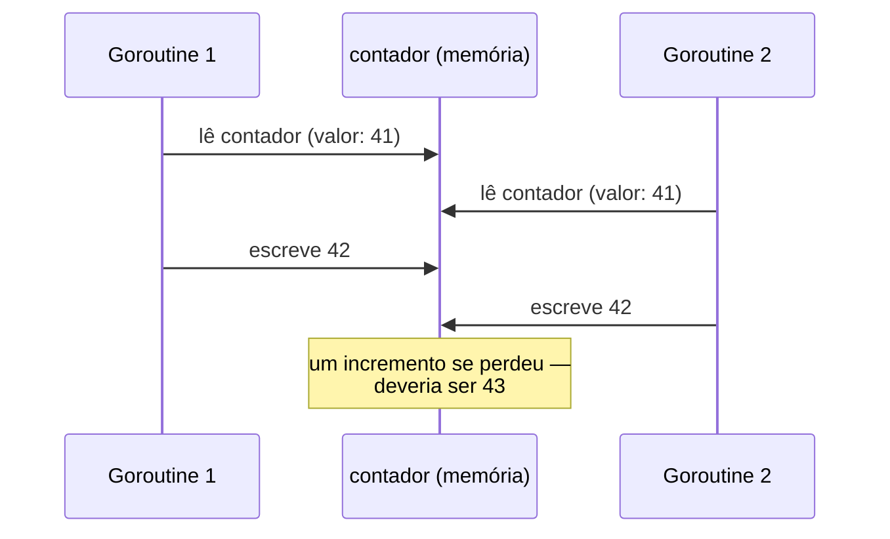
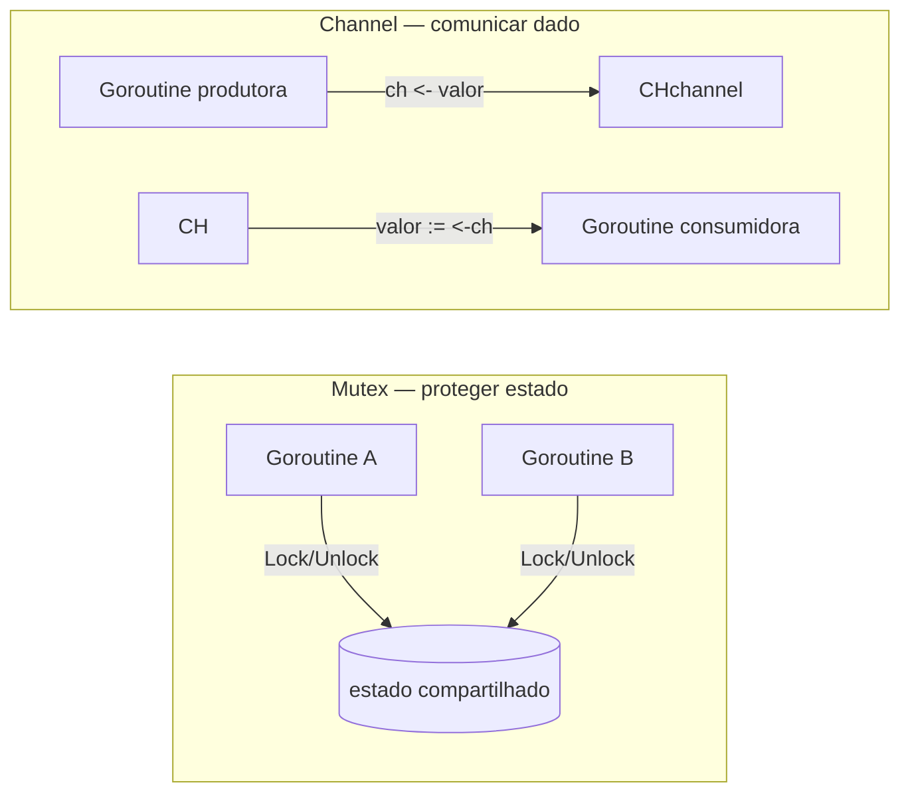

# Concorrência em entrevista

> [!abstract] TL;DR
> Entrevista de Go quase sempre testa concorrência com um problema pequeno e uma pergunta armadilha: "por que isso trava?", "por que a race não aparece no teste normal?", "channel ou mutex aqui?". As perguntas recorrentes são cinco: **deadlock** (canal sem receptor, `WaitGroup.Add` fora de ordem), **race condition** (variável compartilhada sem proteção — só o `-race` detector pega), **channels vs mutex** (comunicar dado vs proteger estado), **WaitGroup** (esperar N goroutines terminarem sem saber o resultado de cada uma) e **context** (cancelamento e timeout propagados por uma árvore de chamadas). O que o entrevistador mede não é se você decora a sintaxe — é se você **verbaliza o raciocínio**: identificar o dado compartilhado, nomear o mecanismo de sincronização antes de escrever código, e explicar em voz alta por que aquela escolha evita a race ou o deadlock.

## O cenário que abre toda entrevista de concorrência em Go

Você recebe um pedaço de código assim, num compartilhamento de tela, e a pergunta é "o que está errado aqui?":

```go
func main() {
    var contador int
    var wg sync.WaitGroup

    for i := 0; i < 1000; i++ {
        wg.Add(1)
        go func() {
            defer wg.Done()
            contador++
        }()
    }

    wg.Wait()
    fmt.Println(contador) // esperado: 1000
}
```

O código compila. Roda sem pânico. Na maioria das execuções imprime um número perto de 1000, mas quase nunca exatamente 1000 — às vezes 987, às vezes 994. Isso não é bug de lógica: é uma **data race**. `contador++` não é uma operação atômica — é ler, somar 1, escrever de volta. Com 1000 goroutines competindo por essa sequência de três passos, duas goroutines podem ler o mesmo valor antes de qualquer uma escrever o resultado, e um incremento "some".

O reflexo errado de quem nunca fez essa pergunta antes é rodar o programa umas cinco vezes, ver `1000` em todas, e concluir que está correto. Isso é a cilada central: races são **não-determinísticas**. Elas dependem do agendamento do runtime, do número de CPUs, da carga da máquina — o mesmo binário pode passar limpo em produção por meses e falhar só sob uma combinação específica de tráfego. Um entrevistador que pede pra você "rodar mentalmente" esse código está testando exatamente se você sabe que "parece funcionar" não é prova de correção em concorrência.

## O detector de race: a ferramenta que resolve a discussão

Antes de qualquer debate de "eu acho que é race", Go tem uma resposta objetiva: `go run -race main.go` ou `go test -race ./...`. O *race detector* instrumenta o binário para rastrear acessos concorrentes a memória compartilhada e aponta, com stack trace de ambas as goroutines envolvidas, exatamente onde a race acontece.



> [!info] `-race` desde Go 1.1, mas vale nomear em qualquer entrevista
> O race detector é antigo (Go 1.1, 2013) mas continua sendo a resposta certa sempre que a pergunta for "como você teria pego isso antes de produção?". Citar `-race` explicitamente — e explicar que ele tem custo de CPU/memória e por isso roda em CI, não em produção — é o tipo de detalhe que separa quem decorou "usar mutex" de quem entende o ciclo de vida do problema.

O fix mais direto para o `contador++` acima é um `sync.Mutex` protegendo a seção crítica, ou trocar por `sync/atomic`:

```go
func main() {
    var contador int64
    var wg sync.WaitGroup

    for i := 0; i < 1000; i++ {
        wg.Add(1)
        go func() {
            defer wg.Done()
            atomic.AddInt64(&contador, 1)
        }()
    }

    wg.Wait()
    fmt.Println(contador) // sempre 1000
}
```

## Channels vs mutex: a pergunta conceitual que nunca falta

A frase mais citada em qualquer discussão de concorrência em Go é do próprio Rob Pike, ecoando um provérbio mais antigo da comunidade:

> "Do not communicate by sharing memory; instead, share memory by communicating."

Na prática, isso separa dois problemas que parecem o mesmo problema, mas não são:

- **Mutex protege estado compartilhado** — várias goroutines acessando a mesma variável, e você precisa garantir que só uma mexa nela por vez. O `contador++` acima é esse caso: não há "mensagem" nenhuma sendo passada, só uma variável sendo lida e escrita por muita gente.
- **Channel comunica um dado (ou um sinal) de uma goroutine para outra** — um *pipeline* onde uma goroutine produz e outra consome, ou um sinal de "terminei" que precisa atravessar uma fronteira de concorrência.



A resposta que soa madura numa entrevista não é "sempre use channel, é mais idiomático" (isso é meia-verdade repetida sem entender) — é: **se o problema é proteger acesso a uma variável simples, mutex é mais direto e mais barato**; se o problema é mover dados entre goroutines com papéis diferentes (produtor/consumidor, pipeline, fan-out/fan-in), channel modela isso melhor porque a sincronização e a transferência do dado acontecem no mesmo ato.

| Situação | Ferramenta | Por quê |
|---|---|---|
| Contador compartilhado, cache em memória, mapa acessado por várias goroutines | `sync.Mutex` / `sync.RWMutex` | Não há "mensagem", só estado a proteger |
| Resultado de um worker precisa chegar em quem espera | `channel` | O valor *é* a comunicação |
| Sinalizar "pode continuar" / "terminei" sem payload | `channel` (`chan struct{}`) ou `context.Done()` | Sinal, não dado |
| Contador simples, sem lógica composta | `sync/atomic` | Mais barato que mutex para uma operação atômica isolada |

> [!warning] "Sempre use channel" é a resposta errada de quem decorou a frase sem entender
> Rob Pike nunca disse "nunca use mutex". A biblioteca padrão do próprio Go usa `sync.Mutex` extensivamente — inclusive dentro da implementação de `map` seguro para concorrência em pacotes internos. Repetir o provérbio sem saber quando ele se aplica é um sinal vermelho para quem entrevista: mostra que você memorizou uma citação, não que você entende o trade-off.

## Deadlock: os dois formatos que mais aparecem

Deadlock em Go quase sempre aparece de duas formas na entrevista — vale reconhecer as duas de cara.

**Formato 1 — channel sem buffer, sem receptor do outro lado:**

```go
func main() {
    ch := make(chan int) // unbuffered
    ch <- 42              // bloqueia para sempre — ninguém está lendo
    fmt.Println(<-ch)     // nunca chega aqui
}
```

Um channel sem buffer (`make(chan int)`) só aceita um envio (`ch <- 42`) quando existe, **naquele exato momento**, uma goroutine pronta para receber (`<-ch`). Aqui não existe nenhuma outra goroutine — a `main` tenta enviar e travar. O runtime do Go detecta esse caso específico (nenhuma goroutine consegue progredir) e mata o programa com `fatal error: all goroutines are asleep - deadlock!`, em vez de travar silenciosamente para sempre. Isso é uma proteção do runtime, não uma garantia geral — deadlocks parciais (onde *algumas* goroutines ainda progridem) não são detectados assim.

O fix mais simples: rodar o envio numa goroutine separada, ou dar buffer ao channel se o padrão do problema permitir:

```go
func main() {
    ch := make(chan int, 1) // buffer de 1 — envio não bloqueia até o buffer encher
    ch <- 42
    fmt.Println(<-ch) // 42
}
```

**Formato 2 — `WaitGroup.Add` fora de ordem, ou `Wait` chamado antes de todo `Add`:**

```go
func main() {
    var wg sync.WaitGroup

    for i := 0; i < 5; i++ {
        go func() {
            wg.Add(1) // ERRADO: Add dentro da goroutine
            defer wg.Done()
            fmt.Println("trabalhando")
        }()
    }

    wg.Wait() // pode retornar antes de todas as 5 chamarem Add — race no contador interno
}
```

O bug aqui é sutil: `wg.Wait()` pode ser chamado pela `main` antes que **qualquer** goroutine tenha executado `wg.Add(1)` — o agendador não garante ordem entre a goroutine principal e as filhas recém-criadas. Se isso acontecer, o contador interno do `WaitGroup` ainda está zerado, `Wait()` retorna imediatamente, e o programa termina achando que processou tudo — quando pode não ter processado nada. Pior: se algumas goroutines já chamaram `Add` e outras não, o comportamento vira uma race genuína no próprio contador do `WaitGroup`, que a documentação oficial marca como uso indevido.

A regra que resolve isso de vez, e que vale dizer em voz alta na entrevista: **`Add` sempre no goroutine que dispara, nunca dentro da goroutine disparada** — porque `Add` precisa "reservar a vaga" antes de a goroutine sequer começar a correr.

```go
func main() {
    var wg sync.WaitGroup

    for i := 0; i < 5; i++ {
        wg.Add(1) // certo: Add antes de disparar, no loop que cria a goroutine
        go func() {
            defer wg.Done()
            fmt.Println("trabalhando")
        }()
    }

    wg.Wait() // agora garantido: as 5 chamadas de Add já aconteceram antes daqui
}
```

> [!warning] `WaitGroup` não carrega resultado nenhum
> `WaitGroup` só sabe contar "quantas goroutines ainda faltam terminar" — não tem como devolver o valor calculado por cada uma. Se a entrevista pedir "espere N workers e colete o resultado de cada um", `WaitGroup` sozinho não resolve: ou cada goroutine escreve num channel de resultados (buffered com capacidade N, ou lido em paralelo por outra goroutine), ou escreve numa slice/mapa protegido por mutex. Citar essa limitação de cara evita ficar preso tentando forçar `WaitGroup` a fazer o que ele não faz.

## Context: cancelamento e timeout propagados

O terceiro tópico que aparece com frequência crescente — puxado por serviços HTTP e gRPC em produção — é `context.Context`. O cenário típico: uma função dispara uma chamada de rede ou uma goroutine de longa duração, e o chamador precisa poder **cancelar** essa operação (o request do cliente caiu, um timeout estourou) sem esperar ela terminar sozinha.

```go
func buscar(ctx context.Context, url string) ([]byte, error) {
    req, err := http.NewRequestWithContext(ctx, "GET", url, nil)
    if err != nil {
        return nil, err
    }
    resp, err := http.DefaultClient.Do(req)
    if err != nil {
        return nil, err // se ctx cancelou, err já reflete isso
    }
    defer resp.Body.Close()
    return io.ReadAll(resp.Body)
}

func main() {
    ctx, cancel := context.WithTimeout(context.Background(), 2*time.Second)
    defer cancel() // sempre chamar cancel, mesmo em sucesso — libera recursos internos do context

    dados, err := buscar(ctx, "https://exemplo.com/api")
    if err != nil {
        fmt.Println("falhou ou cancelou:", err)
        return
    }
    fmt.Println(len(dados))
}
```

O ponto que costuma virar pergunta de acompanhamento é: como uma goroutine de longa duração **reage** a um cancelamento, se ela não está dentro de uma chamada de rede pronta para isso? A resposta é o padrão `select` sobre `ctx.Done()`:

```go
func trabalhar(ctx context.Context, resultados chan<- int) {
    for i := 0; ; i++ {
        select {
        case <-ctx.Done():
            fmt.Println("cancelado:", ctx.Err())
            return
        case resultados <- i * i:
            time.Sleep(100 * time.Millisecond)
        }
    }
}
```

`ctx.Done()` retorna um channel que **fecha** quando o context é cancelado ou o timeout expira — e um channel fechado é sempre lido imediatamente (retorna o zero-value), o que faz o `case <-ctx.Done()` "ganhar" a corrida do `select` assim que o cancelamento acontece. `ctx.Err()` então diz o motivo: `context.Canceled` (alguém chamou `cancel()`) ou `context.DeadlineExceeded` (o timeout estourou).

> [!info] `context.Context` desde Go 1.7 (2016); `http.NewRequestWithContext` desde Go 1.13
> `context` já é maduro, mas vale citar a versão certa se a entrevista pedir uma API específica: `http.NewRequestWithContext` só existe a partir do Go 1.13 — antes disso, a forma idiomática era `req.WithContext(ctx)` depois de criar o request. Um entrevistador sênior pode perguntar isso só para ver se você sabe distinguir "always available" de "disponível desde tal versão".

> [!warning] Context não é lugar para passar dado de negócio
> `context.WithValue` existe, mas a documentação oficial é explícita: use para dados de escopo de request (trace ID, deadline, credenciais de autenticação de infraestrutura) — nunca para parâmetros de função. Se a entrevista mostrar `ctx.Value("usuarioID")` sendo usado para passar um argumento de negócio comum, é uma âncora certa para apontar o antipadrão: torna a assinatura da função mentirosa (esconde uma dependência real) e perde checagem de tipo, porque `Value` retorna `any`.

## Como raciocinar em voz alta

O entrevistador não está cronometrando a digitação do código — está ouvindo o processo. A sequência que funciona bem, nessa ordem:

1. **Nomeie o dado compartilhado.** "Essa variável `contador` é lida e escrita por várias goroutines — isso é uma seção crítica." Dizer isso antes de escrever qualquer `sync.Mutex{}` mostra que você identificou o problema, não só decorou a solução.
2. **Escolha o mecanismo e justifique.** "Isso é proteção de estado, não comunicação — vou usar mutex" ou "isso é um resultado que precisa viajar de uma goroutine pra outra, vou usar channel". Uma frase, não um parágrafo.
3. **Rode mentalmente o pior caso, não o caso feliz.** "Se duas goroutines chegarem exatamente ao mesmo tempo aqui, o que acontece?" — é essa pergunta que revela race conditions e deadlocks antes de rodar o código.
4. **Cite a ferramenta de verificação.** "Eu rodaria isso com `go test -race` antes de confiar." Isso fecha o raciocínio mostrando que você sabe que intuição não basta em concorrência.
5. **Se travar, verbalize o travamento.** "Não tenho certeza se isso desalinha o `WaitGroup` — deixa eu pensar no pior caso de ordenação" é uma resposta muito melhor, aos olhos de quem entrevista, do que ficar em silêncio tentando lembrar a sintaxe exata.

Esse roteiro vale tanto para um live coding quanto para uma pergunta puramente conceitual ("como você evitaria uma race nesse cenário?") — o conteúdo técnico é o mesmo dos [[02 - Perguntas conceituais clássicas|conceitos da nota anterior]], só que aplicado sob a pressão de "pensar em voz alta enquanto o relógio corre".

## Vindo de Java/Node/Python, em Go é assim

| Conceito | Java | Node.js | Python | Go |
|---|---|---|---|---|
| Unidade de concorrência | Thread (pesada, do SO) | Event loop + callback/Promise (single-thread) | Thread (GIL limita paralelismo real) ou `asyncio` | Goroutine (leve, multiplexada pelo runtime em threads do SO) |
| Proteger estado compartilhado | `synchronized`, `ReentrantLock` | Raramente necessário — single-thread | `threading.Lock` | `sync.Mutex` |
| Comunicar entre unidades | `BlockingQueue`, `CompletableFuture` | `Promise`, `EventEmitter` | `queue.Queue`, `asyncio.Queue` | `channel` (nativo da linguagem, não biblioteca) |
| Cancelamento/timeout propagado | `Future.cancel()`, nenhum padrão único | `AbortController` | `asyncio.CancelledError` | `context.Context` — convenção pervasiva em toda a stdlib e ecossistema |
| Detecção de race | Nenhuma ferramenta padrão embutida | N/A na maioria dos casos (single-thread) | GIL mascara boa parte das races de dado | `go run -race` — instrumentação embutida no toolchain |

O detalhe que mais surpreende quem vem de Node é que Go **não** é single-threaded por padrão: goroutines rodam de fato em paralelo em máquinas multi-core, então races de dado são um risco real de dia um — não algo que só aparece com `Worker Threads` explícitos como em Node.

## Armadilhas comuns

> [!warning] Fechar um channel duas vezes gera pânico
> `close(ch)` chamado duas vezes no mesmo channel produz `panic: close of closed channel`. Em código com múltiplos produtores, a regra prática é: só o produtor "dono" fecha o channel, nunca o consumidor, e nunca mais de um produtor.

> [!warning] Enviar para um channel fechado também é pânico
> `ch <- valor` depois de `close(ch)` produz `panic: send on closed channel`. Ler de um channel fechado, por outro lado, é seguro — devolve o zero-value imediatamente (`v, ok := <-ch` com `ok == false` avisa que o channel está fechado e vazio).

> [!warning] Capturar a variável de loop dentro de uma goroutine — corrigido no Go 1.22
> Em versões anteriores ao Go 1.22, `for i := range itens { go func() { usa(i) }() }` capturava a **mesma variável** `i` em todas as goroutines, e todas viam o valor final do loop. Desde o [Go 1.22](https://go.dev/blog/loopvar-preview), cada iteração ganha sua própria cópia de `i` automaticamente — o bug clássico desapareceu por padrão. Ainda vale saber explicar o comportamento antigo: entrevistadores mais experientes gostam de perguntar "isso ainda é um problema hoje?" para ver se você acompanha mudanças de linguagem, não só decorou um "gotcha" desatualizado.

## Como explicar em inglês

> Concurrency questions in Go interviews cluster around five recurring problems: **deadlocks** (an unbuffered channel with no receiver, or `WaitGroup.Add` called out of order), **data races** (shared state mutated without synchronization — invisible until you run with `-race`), the **channels-vs-mutex** trade-off (communicating a value versus protecting shared state), `sync.WaitGroup` for waiting on N goroutines without collecting per-goroutine results, and `context.Context` for propagating cancellation and timeouts down a call tree. What interviewers actually evaluate isn't syntax recall — it's whether you can name the shared resource out loud, state which synchronization primitive fits and why, and reason through the worst-case interleaving before writing any code. Citing `go test -race` unprompted is a strong signal: it shows you know that a clean test run proves nothing about race-freedom.

| Termo PT | Termo EN |
|---|---|
| condição de corrida | data race |
| impasse | deadlock |
| seção crítica | critical section |
| canal sem buffer | unbuffered channel |
| cancelamento propagado | propagated cancellation |
| detector de race | race detector |
| pensar em voz alta | think out loud / reason aloud |
| pior caso de intercalação | worst-case interleaving |

## O que vem a seguir

Deadlock, race e channel resolvem a classe "vai travar ou vai correr errado" — mas existe uma segunda classe de pegadinhas em Go que não tem nada a ver com concorrência: erros de slice compartilhada, `nil` interface que não é `nil`, shadowing de variável de erro, `defer` em loop. A [[04 - Os gotchas favoritos|próxima nota]] cataloga esses gotchas clássicos — o tipo de pergunta "o que esse código imprime?" que aparece tanto quanto deadlock, mas testa um ângulo completamente diferente da linguagem.

## Veja também

- [[01 - O que cai numa entrevista de Go|01 — O que cai numa entrevista de Go]] — mapa geral do galho, onde concorrência entra como um dos eixos recorrentes
- [[02 - Perguntas conceituais clássicas|02 — Perguntas conceituais clássicas]] — perguntas de "explique o conceito", complemento teórico direto desta nota
- [[04 - Os gotchas favoritos|04 — Os gotchas favoritos]] — próxima nota do galho
- [[03-Dominios/Tecnologia/Go/index|Trilha Go]]

## Fontes

- The Go Authors. *The Go Memory Model*. go.dev. https://go.dev/ref/mem (acessado em 2026-07-18)
- The Go Authors. *Effective Go — Concurrency*. go.dev. https://go.dev/doc/effective_go#concurrency (acessado em 2026-07-18)
- The Go Authors. *Go Blog — Fixing For Loops in Go 1.22*. go.dev. https://go.dev/blog/loopvar-preview (acessado em 2026-07-18)
- pkg.go.dev. *Package context*. pkg.go.dev. https://pkg.go.dev/context (acessado em 2026-07-18)
- pkg.go.dev. *Package sync*. pkg.go.dev. https://pkg.go.dev/sync (acessado em 2026-07-18)
- Go by Example. *Select*. gobyexample.com. https://gobyexample.com/select (acessado em 2026-07-18)
