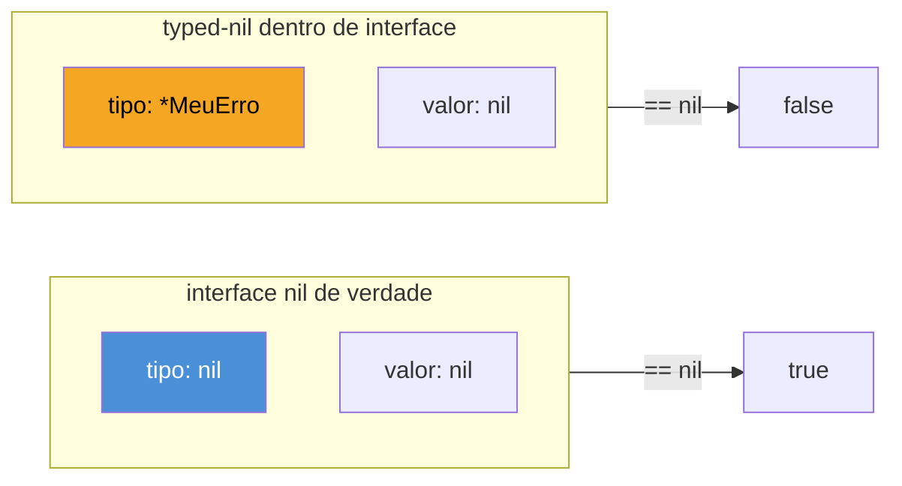
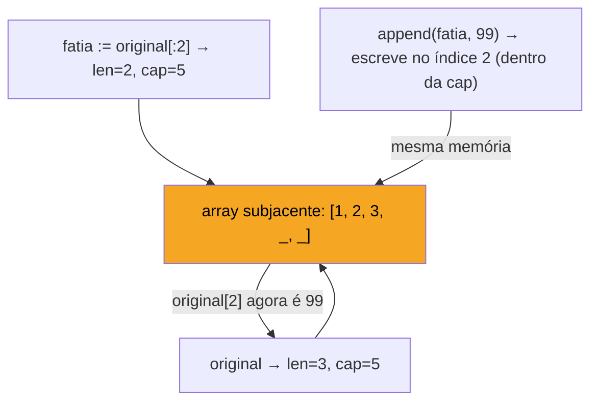

# Os gotchas favoritos

> [!abstract] TL;DR
> Todo entrevistador de Go tem um punhado de perguntas-armadilha favoritas, e quase todas testam a mesma coisa: você entende o que acontece **por baixo** da sintaxe confortável, ou só decorou o "jeito certo" de escrever? Os seis clássicos são: **nil interface vs typed-nil** (uma interface não-nil que aponta pra um ponteiro nil), **slice aliasing no `append`** (dois slices compartilhando array subjacente sem avisar), **loop variable capture** (closures pegando a mesma variável antes do Go 1.22), **`defer` dentro de laço** (empilha em vez de executar, e some recursos até o fim da função), **ordem de iteração de map** (aleatória de propósito, desde sempre) e **comparação de structs** (`==` funciona só se todo campo for comparável). Nenhum desses é "pegadinha de decoreba" — cada um revela um mecanismo real da linguagem que aparece em produção.

## Por que essas seis e não outras

Se você já fez as notas anteriores deste galho, viu conceitos amplos — memória, concorrência, interfaces. Esta nota é diferente: é uma lista curada dos gotchas que **repetem** em entrevista após entrevista, porque cada um tem uma característica em comum — o código **compila**, às vezes até **parece certo** numa primeira leitura, e falha (ou se comporta de um jeito não óbvio) só em runtime. É exatamente o tipo de bug que sobrevive a code review superficial e vira incidente em produção — por isso interessa tanto pra quem contrata.

Vamos por ordem de "quão silenciosamente isso te morde".

## 1. Nil interface vs typed-nil

Este é, disparado, o gotcha mais citado em qualquer lista "Go interview questions". A pergunta clássica: por que esse código imprime `false`?

```go
package main

import "fmt"

type MeuErro struct{}

func (e *MeuErro) Error() string { return "deu ruim" }

func fazAlgo() error {
    var p *MeuErro = nil
    return p // devolve um *MeuErro nil, mas como error
}

func main() {
    err := fazAlgo()
    fmt.Println(err == nil) // false!
}
```

A resposta mora na representação interna de uma interface: por baixo, todo valor de interface é um par **(tipo, valor)**. Quando você escreve `var err error`, sem atribuir nada, o par é `(nil, nil)` — tipo nenhum, valor nenhum. Isso sim é uma interface nil de verdade.

Mas `fazAlgo()` não devolve isso. Devolve `p`, que é um ponteiro nil — só que **tipado**: `*MeuErro`. Ao entrar na interface `error`, o par vira `(*MeuErro, nil)` — tipo presente, valor nil. E a comparação `err == nil` só é `true` quando **os dois** lados do par são nil. Tipo presente já basta pra falhar.



> [!warning] A regra prática que resolve isso
> Nunca declare uma variável de tipo concreto ponteiro e devolva-a como interface sem checar antes. Se a função pode devolver "sem erro", devolva `nil` literal, não uma variável de ponteiro que *pode* ser nil:
> ```go
> func fazAlgo() error {
>     var p *MeuErro
>     if algumaCondicao {
>         p = &MeuErro{}
>     }
>     if p == nil {
>         return nil // devolve interface nil de verdade
>     }
>     return p
> }
> ```
> A [FAQ oficial do Go](https://go.dev/doc/faq#nil_error) documenta esse exato caso como a razão número um de confusão com `nil` na linguagem.

Esse mecanismo não é peculiaridade de `error` — vale pra **qualquer** interface. `error` só é onde a maioria tropeça primeiro, porque `if err != nil` é o idioma mais repetido de todo código Go.

## 2. Slice aliasing e o `append` traiçoeiro

Um slice é um struct de três campos — ponteiro pro array subjacente, `len`, `cap` (a [[03-Dominios/Tecnologia/Go/05 - Coleções e dados/05 - O modelo de memória de slices — len, cap e aliasing|nota 06 do galho 1]] cobriu isso em detalhe). O gotcha de entrevista explora o que acontece quando dois slices **compartilham** o mesmo array, e um `append` decide, silenciosamente, se continua compartilhando ou não.

```go
original := make([]int, 3, 5) // len=3, cap=5
original[0], original[1], original[2] = 1, 2, 3

fatia := original[:2]      // len=2, cap=5 — mesmo array subjacente
fatia = append(fatia, 99)  // cabe na capacidade sobrando (5), não realoca

fmt.Println(original) // [1 2 99] — original[2] foi sobrescrito!
```

`fatia` tinha `cap=5` herdado de `original` (a capacidade não é limitada pelo `len` do slice-pai, só pelo array subjacente). Como `append` só realoca quando **não cabe** na capacidade restante, `fatia = append(fatia, 99)` escreveu no índice 2 do array compartilhado — o mesmo índice que `original[2]` está lendo. `original` muda mesmo sem ninguém tocar em `original` diretamente.



> [!warning] "Copiei o slice, então é seguro mexer nele" — não necessariamente
> `b := a` copia o **struct do slice** (ponteiro, len, cap) — não o array. `b` e `a` continuam apontando pro mesmo array subjacente. Só `copy(dst, src)` (ou `append([]T{}, src...)`) produz um array novo de verdade. Isso pega em entrevista quando pedem "escreva uma função que recebe um slice e devolve uma cópia modificada sem afetar o original" — a resposta ingênua (`novo := s`) não isola nada.

O antídoto de produção, quando você precisa garantir isolamento: `full slice expression` (`original[:2:2]`, o terceiro índice trava a capacidade no valor de `len`), forçando qualquer `append` subsequente a realocar em vez de reaproveitar espaço.

## 3. Loop variable capture — o gotcha que o Go 1.22 matou (quase)

Até o Go 1.21, este era talvez o gotcha número um em entrevista, porque quebrava o intuito óbvio de qualquer dev vindo de outra linguagem:

```go
funcs := make([]func(), 0, 3)
for i := 0; i < 3; i++ {
    funcs = append(funcs, func() {
        fmt.Println(i)
    })
}
for _, f := range funcs {
    f()
}
// Go ≤ 1.21: imprime 3, 3, 3
// Go ≥ 1.22: imprime 0, 1, 2
```

Antes da 1.22, `i` era **uma única variável**, reutilizada a cada iteração — todas as três closures capturavam a mesma célula de memória, e no momento em que rodam (depois do loop terminar), `i` já vale 3.

> [!info] Mudança de semântica no Go 1.22
> A partir do Go 1.22 (lançado em fevereiro de 2024), cada iteração de `for` cria uma **nova instância** da variável de controle — o [release note oficial](https://go.dev/blog/loopvar-preview) documenta a mudança. O código acima passou a imprimir `0, 1, 2` sem precisar de nenhuma correção manual.

Mas cuidado: entrevistador experiente ainda pergunta isso, porque (a) muito código de produção roda em `go.mod` fixado abaixo de 1.22, e (b) a captura problemática também morde fora de loop `for` clássico, em qualquer situação de variável reaproveitada:

```go
// Padrão de correção pré-1.22, ainda válido e útil de saber de cor:
for i := 0; i < 3; i++ {
    i := i // sombreia: cria uma cópia local por iteração
    go func() {
        fmt.Println(i)
    }()
}
```

Esse `i := i` parece redundante até você entender exatamente o que resolve: sombrear a variável do loop com uma cópia nova, escopada à iteração. É o mesmo padrão citado na [[03-Dominios/Tecnologia/Go/21 - Preparação para entrevista de Go/03 - Concorrência em entrevista|nota anterior]] quando o assunto é goroutine dentro de loop — a variante concorrente deste mesmo gotcha, e ainda mais perigosa porque a saída fica não-determinística em vez de sempre errada do mesmo jeito.

## 4. `defer` dentro de laço — empilha, não executa

`defer` adia a execução até o **retorno da função** — não até o fim do bloco onde foi declarado. Isso é surpreendente a primeira vez que você põe um `defer` dentro de um `for`:

```go
func processarArquivos(nomes []string) error {
    for _, nome := range nomes {
        f, err := os.Open(nome)
        if err != nil {
            return err
        }
        defer f.Close() // NÃO fecha ao fim da iteração — só ao fim da função
        // ... processa f ...
    }
    return nil // todos os arquivos só fecham AQUI
}
```

Se `nomes` tiver 10.000 entradas, você abre 10.000 file descriptors e só libera todos no fim da função — em muitos sistemas, isso estoura o limite de descritores abertos (`too many open files`) muito antes de chegar no último arquivo. `defer` empilha (LIFO) e só dispara quando a função **inteira** retorna, não a cada volta do laço.

> [!warning] O fix clássico: função anexa por iteração
> ```go
> func processarArquivos(nomes []string) error {
>     for _, nome := range nomes {
>         if err := processarUm(nome); err != nil {
>             return err
>         }
>     }
>     return nil
> }
>
> func processarUm(nome string) error {
>     f, err := os.Open(nome)
>     if err != nil {
>         return err
>     }
>     defer f.Close() // agora fecha ao fim de CADA chamada de processarUm
>     // ... processa f ...
>     return nil
> }
> ```
> Extrair o corpo do laço pra uma função própria faz o `defer` valer por iteração, porque cada chamada tem seu próprio retorno de função.

## 5. Ordem de iteração de map — aleatória de propósito

```go
m := map[string]int{"a": 1, "b": 2, "c": 3}
for k, v := range m {
    fmt.Println(k, v)
}
// ordem diferente a cada execução — inclusive dentro do mesmo processo, entre loops distintos
```

Quem espera ordem de inserção (como um `dict` do Python 3.7+, ou um `LinkedHashMap` do Java) leva um susto: Go **randomiza deliberadamente** a ordem de iteração de map desde o início. A [especificação da linguagem](https://go.dev/ref/spec#For_statements) é explícita: "The iteration order over maps is not specified and is not guaranteed to be the same from one iteration to the next." O runtime do Go de fato embaralha a ordem de partida a cada `range`, justamente pra impedir que qualquer código dependa dela por acidente.

> [!warning] Por que isso importa em entrevista (e em produção)
> Se a resposta esperada de uma pergunta envolve iterar um map e produzir saída determinística — string formatada, JSON, log — a resposta certa **sempre** ordena as chaves primeiro:
> ```go
> chaves := make([]string, 0, len(m))
> for k := range m {
>     chaves = append(chaves, k)
> }
> sort.Strings(chaves)
> for _, k := range chaves {
>     fmt.Println(k, m[k])
> }
> ```
> Interessante notar: `fmt.Println(m)` (o mapa inteiro, direto) **já ordena** as chaves automaticamente pra você — é comportamento do pacote `fmt`, não do `range`. A pegadinha específica é sobre `for range`, não sobre formatação.

## 6. Comparação de structs — `==` funciona só até certo ponto

Structs em Go são comparáveis com `==` **se e somente se todos os campos forem comparáveis**. Isso funciona sem drama na maioria dos casos:

```go
type Ponto struct{ X, Y int }

p1 := Ponto{1, 2}
p2 := Ponto{1, 2}
fmt.Println(p1 == p2) // true — compara campo a campo
```

Mas quebra, em tempo de **compilação**, assim que um campo é slice, map ou função — tipos que Go não sabe comparar por valor:

```go
type Registro struct {
    Nome string
    Tags []string // slice: não comparável
}

r1 := Registro{"a", []string{"x"}}
r2 := Registro{"a", []string{"x"}}
fmt.Println(r1 == r2) // erro de compilação:
// invalid operation: r1 == r2 (struct containing []string cannot be compared)
```

O erro aparece em tempo de compilação — o que é uma bênção comparado a linguagens onde a mesma tentativa falha silenciosamente em runtime, ou compara por referência sem avisar. Mas a pergunta de entrevista costuma ir além: "como você compararia dois `Registro` por valor, então?" A resposta idiomática usa `reflect.DeepEqual` ou, em código moderno, o pacote `slices`:

```go
import (
    "reflect"
    "slices"
)

igual := r1.Nome == r2.Nome && slices.Equal(r1.Tags, r2.Tags)
// ou, mais genérico e mais lento:
igual = reflect.DeepEqual(r1, r2)
```

> [!info] Pacote `slices`, Go 1.21+
> `slices.Equal` (e o análogo `maps.Equal` para maps) entrou na standard library no Go 1.21, dentro do esforço de trazer pra `slices`/`maps` operações que antes exigiam laços manuais ou `reflect.DeepEqual`. `slices.Equal` é tipado e mais rápido que `reflect.DeepEqual` porque não paga o custo de reflection — prefira-o sempre que souber os tipos concretos em tempo de compilação.

> [!warning] `reflect.DeepEqual` também tem sua própria armadilha com nil
> `reflect.DeepEqual(nil, []int{})` é `false` — um slice `nil` e um slice vazio não-nil são "diferentes" pra `DeepEqual`, mesmo que `len()` de ambos seja 0 e a maioria do código trate os dois como equivalentes. Mais um lugar onde nil em Go exige atenção redobrada — o mesmo espírito do gotcha #1 desta nota, em roupagem diferente.

## O roteiro de resposta que funciona em entrevista

Os seis gotchas têm uma estrutura de resposta em comum, e vale internalizar o roteiro — não decorar as respostas, mas o **formato** de uma boa resposta, porque o entrevistador está avaliando raciocínio, não recall:

1. **Nomeie o comportamento observado** — "esse código imprime X, o que parece contraintuitivo porque Y".
2. **Explique o mecanismo por baixo** — não "é assim que Go funciona", mas o *porquê* estrutural (par tipo/valor da interface, capacidade do array subjacente, etc.).
3. **Mostre a correção idiomática** — a comunidade Go já convergiu numa forma canônica de evitar cada um desses seis; recitá-la de cabeça sinaliza experiência real, não teoria lida na véspera.
4. **Cite a fonte, se vier à cabeça** — mencionar que a ordem de map "é comportamento documentado na especificação, não bug" muda a percepção do entrevistador sobre sua profundidade, mesmo sem citar a URL exata.

Um erro comum de quem estuda esses gotchas só pra decorar: recitar a "pegadinha" sem conseguir explicar o mecanismo quando o entrevistador pergunta "por quê?" logo em seguida — e ele quase sempre pergunta. Sem o passo 2, a resposta soa a flashcard, não a compreensão.

## Lente cross-stack: de onde vem a surpresa

| Vindo de | Gotcha que mais surpreende | Por quê |
|---|---|---|
| Java | nil interface / typed-nil | `null` em Java é um valor único, sem "tipo carregado junto"; a ideia de um ponteiro nil "disfarçado" de não-nil dentro de uma interface não tem equivalente direto |
| Python/JS | slice aliasing no `append` | listas dinâmicas do Python sempre copiam a estrutura ao fatiar (`lista[:2]` cria lista nova); slice de Go é uma *view*, não uma cópia |
| Java/Python | ordem de map | `LinkedHashMap` (Java) e `dict` do Python 3.7+ preservam ordem de inserção por garantia de linguagem; Go faz o oposto de propósito |
| C#/Java | comparação de struct com slice/map | em C#/Java, comparar objetos por referência sempre "funciona" (ainda que errado); Go recusa compilar em vez de deixar passar silenciosamente |

## Como explicar em inglês

> Go's classic interview gotchas share a pattern: the code compiles, often looks correct, and fails silently at runtime because it exposes a mechanism most developers never had to think about explicitly. The most notorious is the **nil interface vs typed-nil** trap: an interface value is internally a (type, value) pair, so a nil pointer wrapped inside an interface produces `(type, nil)` — which is not equal to a true nil interface `(nil, nil)`. Slices add **aliasing** surprises, since `append` only reallocates when capacity runs out, meaning two slices can silently share (and overwrite) the same backing array. Pre-1.22 Go also famously reused a single loop variable across iterations, capturing the wrong value in closures — fixed by per-iteration semantics in Go 1.22. Rounding out the list: `defer` inside a loop stacks up until the enclosing function returns rather than firing per iteration; map iteration order is deliberately randomized by the runtime; and struct equality with `==` only compiles when every field is comparable, forcing `reflect.DeepEqual` or `slices.Equal` for structs containing slices or maps.

| Termo PT | Termo EN |
|---|---|
| interface nil vs ponteiro nil tipado | nil interface vs typed-nil |
| compartilhamento de array subjacente | slice aliasing |
| captura de variável de laço | loop variable capture |
| adiar execução (empilhado) | deferred execution (stacked) |
| ordem de iteração não garantida | unspecified iteration order |
| campo comparável | comparable field |
| descritor de arquivo | file descriptor |

## O que vem a seguir

Os seis gotchas desta nota são o tipo de pergunta que testa profundidade em cinco minutos de conversa. Mas entrevistas de Go raramente param na teoria — a etapa seguinte, quase sempre, é ver você escrever código ao vivo, sob pressão de tempo, com o entrevistador observando cada decisão. A [[05 - Live coding em Go|próxima nota]] entra nesse terreno: os exercícios de live coding mais comuns (parsing, concorrência com worker pool, manipulação de string), o que os avaliadores realmente observam além do código funcionar, e como narrar seu raciocínio em inglês enquanto digita.

## Veja também

- [[01 - O que cai numa entrevista de Go|01 — O que cai numa entrevista de Go]] — mapa geral do que este galho cobre
- [[02 - Perguntas conceituais clássicas|02 — Perguntas conceituais clássicas]] — perguntas de teoria que frequentemente antecedem estes gotchas
- [[03 - Concorrência em entrevista|03 — Concorrência em entrevista]] — a variante concorrente do gotcha de loop variable capture (goroutine dentro de loop) em profundidade
- [[05 - Live coding em Go|05 — Live coding em Go]] — próxima nota do galho
- [[03-Dominios/Tecnologia/Go/05 - Coleções e dados/05 - O modelo de memória de slices — len, cap e aliasing|Galho 1, nota 06]] — mecanismo completo de slice, len/cap/aliasing, pré-requisito do gotcha #2
- [[03-Dominios/Tecnologia/Go/index|Trilha Go]]

## Fontes

- The Go Authors. *Go FAQ — Why is my nil error value not equal to nil?*. go.dev. https://go.dev/doc/faq#nil_error (acessado em 2026-07-18)
- The Go Authors. *The Go Programming Language Specification — For statements*. go.dev. https://go.dev/ref/spec#For_statements (acessado em 2026-07-18)
- The Go Authors. *Fixing For Loops in Go 1.22*. go.dev/blog. https://go.dev/blog/loopvar-preview (acessado em 2026-07-18)
- The Go Authors. *The Go Programming Language Specification — Comparison operators*. go.dev. https://go.dev/ref/spec#Comparison_operators (acessado em 2026-07-18)
- pkg.go.dev. *Package slices*. https://pkg.go.dev/slices (acessado em 2026-07-18)
- Go by Example. *Slices*. gobyexample.com. https://gobyexample.com/slices (acessado em 2026-07-18)
