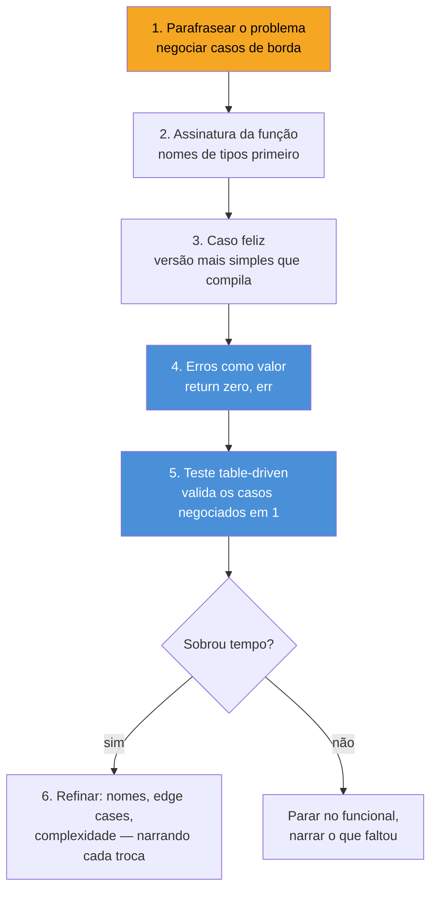

# Live coding em Go

> [!abstract] TL;DR
> Live coding em Go não testa se você sabe a sintaxe — testa se você resolve um problema **em voz alta**, sob relógio, escrevendo código que um revisor sênior reconheceria como idiomático. O roteiro que funciona: (1) parafraseie o problema e negocie os casos de borda antes de digitar uma linha; (2) escreva a versão mais simples que resolve o caso feliz; (3) trate erro como valor de retorno, nunca como exceção disfarçada; (4) adicione um teste table-driven — é o formato que todo entrevistador Go espera ver; (5) narre cada decisão ("vou usar um `map[string]int` aqui porque preciso de lookup O(1)"). O erro mais caro não é sintático — é **ficar em silêncio** enquanto pensa, ou tentar generics/goroutines num problema que não pede nenhum dos dois.

## O cenário: 45 minutos, uma tela compartilhada, um silêncio desconfortável

Imagine a call. O entrevistador compartilha um link do CoderPad ou abre o VS Code com Live Share. Ele diz: "implemente uma função que recebe uma lista de transações e retorna o saldo por conta, ignorando transações inválidas." Aí ele encosta na cadeira e espera.

Esse momento — os primeiros 15 segundos de silêncio — é onde a maioria dos candidatos perde pontos que nunca vão recuperar no resto da entrevista. Não porque não sabem Go. Porque tratam o silêncio como tempo de pensar sozinho, quando na verdade é tempo de **negociar o problema em voz alta**. Um entrevistador sênior não está cronometrando se você digita rápido — está observando se você faz as perguntas que ele faria antes de escrever uma linha de produção: o que é uma "transação inválida"? Valor negativo? Conta inexistente? O que acontece se a lista vier vazia? Preciso lidar com concorrência, ou é sequencial?

Isso não é peculiaridade de Go — é qualquer entrevista técnica de qualquer linguagem. O que muda em Go é o que vem **depois** da negociação: a linguagem empurra você, estruturalmente, para um estilo de resolução específico. Não há `try/except` para esconder o caso de erro embaixo do tapete. Não há `null` implícito escondendo um ponteiro que pode não existir. Go força você a decidir, explicitamente, o que fazer quando algo dá errado — e é exatamente essa decisão explícita, feita em voz alta, que o entrevistador quer ver.

## O mecanismo: o loop de live coding em Go



Repare que testar (passo 5) não é o último item da lista — é o penúltimo, antes do refinamento. Isso é deliberado: em Go, um teste table-driven bem escrito **é** a prova de que você entendeu os casos de borda que negociou no passo 1. Se o entrevistador pedir "e se a lista vier vazia?", a resposta ideal não é uma frase — é adicionar uma linha na tabela de testes e rodar.

## Passo 1 — Abordar o problema: negociar antes de digitar

O entrevistador raramente dá a especificação completa de propósito. É teste. Antes de tocar no teclado, feche o espaço de casos de borda em voz alta:

> "Deixa eu confirmar: recebo `[]Transacao`, cada uma com `Conta string` e `Valor float64`. 'Inválida' significa `Valor` zero, negativo, ou `Conta` vazia — os três? E se duas transações forem pro mesmo `Conta`, eu somo? E a saída é `map[string]float64`, conta → saldo?"

Três frases, dez segundos, e agora você e o entrevistador concordam sobre o que "correto" significa. Sem isso, é comum escrever 20 linhas de código perfeitamente compiláveis que resolvem o problema errado.

> [!warning] Não comece a codar antes de escrever a assinatura da função
> Escrever `func SaldoPorConta(txs []Transacao) map[string]float64` — ou, melhor ainda, decidir se ela também deveria retornar um `error` — antes de qualquer lógica é o próximo passo natural depois da negociação. A assinatura é onde as decisões da conversa viram tipos concretos. Se você não sabe ainda o tipo de retorno, ainda não terminou de negociar o problema.

## Passo 2 e 3 — Escrever idiomático sob pressão: caso feliz primeiro

O reflexo de quem estudou algoritmos é tentar a solução ótima de cara. Sob pressão de tempo, isso é armadilha: você gasta 20 minutos numa abstração elegante que não compila, e sobra pouco tempo para testes. A prática que funciona é o oposto — a **versão mais simples que resolve o caso feliz**, compilando a cada poucas linhas:

```go
type Transacao struct {
    Conta string
    Valor float64
}

func SaldoPorConta(txs []Transacao) map[string]float64 {
    saldos := make(map[string]float64)
    for _, tx := range txs {
        saldos[tx.Conta] += tx.Valor
    }
    return saldos
}
```

Isso compila, resolve o caso feliz, e leva menos de dois minutos para escrever narrando cada linha. Só depois — e só se a negociação do passo 1 exigiu — você adiciona filtro de inválidas:

```go
func SaldoPorConta(txs []Transacao) map[string]float64 {
    saldos := make(map[string]float64)
    for _, tx := range txs {
        if tx.Conta == "" || tx.Valor == 0 {
            continue // transação inválida, ignorada conforme combinado
        }
        saldos[tx.Conta] += tx.Valor
    }
    return saldos
}
```

Narre o `continue`: "estou pulando aqui em vez de early-return porque quero continuar processando o resto da lista — só essa transação é descartada." Uma frase assim mostra ao entrevistador que a decisão foi deliberada, não acidental.

> [!info] `for _, tx := range txs` em Go 1.22+
> Até a versão 1.21, a variável de loop `tx` era **reutilizada** a cada iteração — capturá-la numa goroutine ou closure sem copiá-la manualmente (`tx := tx`) era um dos bugs clássicos de entrevista. Desde o **Go 1.22**, cada iteração do `for...range` cria uma variável nova, então esse gotcha específico só se aplica a quem roda uma versão mais antiga. Mesmo assim, é seguro mencionar em voz alta que você sabe da história — mostra profundidade sem precisar do código extra.

## Passo 4 — Tratar erros como valor, não como exceção disfarçada

O reflexo de quem vem de Java, Python ou JS é usar `panic`/`recover` como se fosse `try/catch`. Isso é o erro mais visível que um entrevistador Go observa — porque `panic` em Go é reservado para bugs de programação (índice fora do array, ponteiro nulo desreferenciado), não para condições esperadas como "conta não encontrada" ou "arquivo não existe".

A forma idiomática: erro é um **valor de retorno comum**, checado explicitamente, imediatamente após a chamada:

```go
func Saldo(saldos map[string]float64, conta string) (float64, error) {
    valor, ok := saldos[conta]
    if !ok {
        return 0, fmt.Errorf("conta %q não encontrada", conta)
    }
    return valor, nil
}
```

Repare em duas convenções que vale narrar em voz alta, porque um entrevistador sênior está procurando exatamente por elas:

- O **zero value** (`0`) acompanha o erro no retorno — não `-1` como sentinela, não `nil` de um tipo que não é ponteiro. Quando `error != nil`, o valor junto não deve ser usado pelo chamador; convenção, não imposição do compilador.
- `fmt.Errorf` com `%q` (aspas automáticas em volta da string) em vez de concatenação manual — outro detalhe pequeno que sinaliza fluência.

Se o problema pedir encadeamento de erros de camadas diferentes, `%w` embrulha o erro original preservando a cadeia — assunto que a [[03-Dominios/Tecnologia/Go/04 - Erros como valor/index|trilha de Erros como valor]] cobre a fundo, mas que vale citar de memória numa entrevista:

```go
func processar(conta string) error {
    _, err := Saldo(saldos, conta)
    if err != nil {
        return fmt.Errorf("processar conta %s: %w", conta, err)
    }
    return nil
}
```

> [!warning] `if err != nil { return err }` repetido não é "código feio" — é o idioma
> Quem vem de linguagens com exceções estranha a quantidade de `if err != nil` espalhada pelo código e tenta "limpar" com um helper genérico que engole o erro ou com `panic`/`recover` disfarçado de try/catch. Em entrevista, resistir a essa tentação é sinal de maturidade em Go: o padrão repetitivo é deliberado — cada chamada que pode falhar é um ponto de decisão visível no fluxo de controle, não um efeito colateral escondido.

## Passo 5 — Testar com table-driven tests

Esse é o formato que praticamente todo entrevistador Go espera ver, porque é o padrão dominante na comunidade e aparece na própria documentação oficial (`go.dev/wiki/TableDrivenTests`). A ideia: uma slice (ou map) de casos, cada um com entrada e saída esperada, percorrida por um único loop de `t.Run`:

```go
func TestSaldoPorConta(t *testing.T) {
    casos := []struct {
        nome string
        txs  []Transacao
        want map[string]float64
    }{
        {
            nome: "soma transações da mesma conta",
            txs: []Transacao{
                {Conta: "joao", Valor: 100},
                {Conta: "joao", Valor: 50},
            },
            want: map[string]float64{"joao": 150},
        },
        {
            nome: "ignora transação com conta vazia",
            txs: []Transacao{
                {Conta: "", Valor: 100},
                {Conta: "maria", Valor: 30},
            },
            want: map[string]float64{"maria": 30},
        },
        {
            nome: "lista vazia retorna map vazio",
            txs:  nil,
            want: map[string]float64{},
        },
    }

    for _, c := range casos {
        t.Run(c.nome, func(t *testing.T) {
            got := SaldoPorConta(c.txs)
            if len(got) != len(c.want) {
                t.Fatalf("tamanho: got %d, want %d", len(got), len(c.want))
            }
            for conta, valor := range c.want {
                if got[conta] != valor {
                    t.Errorf("conta %s: got %v, want %v", conta, got[conta], valor)
                }
            }
        })
    }
}
```

Cada linha da tabela nasce diretamente de uma pergunta feita no passo 1 — "e se a lista vier vazia?" virou um caso de teste, não uma suposição não verificada. Esse mapeamento explícito ("esse caso de teste cobre a pergunta que fizemos há dez minutos") é uma das poucas frases que fazem um entrevistador anotar "excelente" no formulário de avaliação.

> [!info] `t.Run` e subtests (desde Go 1.7)
> `t.Run(c.nome, func(t *testing.T) {...})` cria um **subtest** nomeado — aparece individualmente no output (`go test -v` mostra `TestSaldoPorConta/soma_transações...`), e um `t.Fatalf` dentro dele não aborta os outros casos da tabela. Sem `t.Run`, uma falha num caso mataria o teste inteiro antes de rodar os seguintes — perdendo sinal justamente na hora que mais importa, o meio de uma entrevista.

## Comunicar decisões: narrar é parte da entrega

Um erro comum de quem programa bem sozinho, mas mal em par, é tratar a narração como "atraso" — ficar calado, resolver rápido, só falar quando termina. Isso inverte a métrica que o entrevistador está de fato medindo. Frases curtas, ditas no momento da decisão, valem mais do que o código perfeito em silêncio:

- "Vou usar `map[string]float64` em vez de `[]Transacao` de retorno porque a pergunta pede saldo *por conta* — lookup por chave é o formato natural."
- "Estou retornando erro em vez de logar e continuar, porque prefiro deixar o chamador decidir o que fazer com a falha."
- "Isso é O(n) — um loop pela lista inteira. Dá para melhorar se o requisito mudar para consultas repetidas, mas por agora é suficiente."

Cada frase é uma âncora que o entrevistador usa para avaliar seu raciocínio, não só o resultado. Em entrevistas remotas — sem quadro branco, sem gesto, só a tela e a voz — essas frases carregam o peso que, numa sala presencial, um aceno de cabeça ou uma seta desenhada carregaria.

> [!warning] Silêncio de mais de 20-30 segundos é um sinal ruim, mesmo pensando corretamente
> Um entrevistador remoto não vê sua cara pensativa nem sabe se você está travado ou raciocinando. "Deixa eu pensar um segundo em como estruturar isso" é uma frase de três segundos que resolve o problema — narra o silêncio antes que ele vire desconfortável.

## Erros a evitar ao vivo

> [!warning] Puxar generics ou goroutines sem o problema pedir
> Ver um `map` e imediatamente propor uma versão genérica com `func SomarChaves[K comparable, V constraints.Ordered](...)`, ou paralelizar um loop de dez elementos com goroutines e um `sync.WaitGroup`, sinaliza o oposto de senioridade numa entrevista: complexidade não pedida, difícil de testar sob o relógio, e que geralmente introduz um bug de concorrência bobo (`data race` no map, por exemplo) bem na frente do avaliador. Regra prática: só generalize ou paralelize se o entrevistador perguntar "e se precisasse escalar para milhões de itens?" — e mesmo assim, narre a troca antes de escrever.

> [!warning] Ignorar `go vet` e erros de compilação óbvios
> Em ambientes de live coding sem autocomplete forte, é comum digitar `fmt.Println(saldo)` esquecendo de importar `"fmt"`, ou comparar `float64` com `==` sem considerar imprecisão de ponto flutuante. Rodar mentalmente "isso compila?" antes de declarar a função pronta evita a cena desconfortável de descobrir um erro de digitação com o entrevistador olhando.

> [!warning] Testar só o caso feliz e declarar vitória
> Escrever a função, rodar uma vez com `fmt.Println` mostrando o resultado certo, e passar para o próximo problema sem nenhum teste automatizado é a forma mais comum de deixar pontos na mesa. O `t.Run` com dois ou três casos — incluindo pelo menos um caso de borda explicitamente negociado no passo 1 — é o mínimo esperado, não um "bônus se sobrar tempo".

> [!warning] Nomear variáveis genéricas demais (`data`, `result`, `temp`) num problema pequeno
> Em Go idiomático, nomes curtos são aceitáveis e até preferidos para escopos curtos (`i`, `tx`, `err`) — mas `data` ou `result` não comunicam nada sobre o domínio do problema. `saldos` diz mais que `result` num problema sobre saldo de contas; o custo de digitar três caracteres a mais é irrelevante perto do sinal que passa.

## Vindo de outras linguagens, o que muda no live coding

| Vindo de | No reflexo antigo | Em Go, faça assim |
|---|---|---|
| Java | `try { ... } catch (Exception e)` para qualquer falha esperada | `if err != nil { return err }` — erro é valor, não controle de fluxo por exceção |
| Python | `assert` ou `raise` solto para validar entrada | `if cond { return zero, fmt.Errorf(...) }` — retorno explícito, sem interromper a pilha |
| JavaScript/TS | `try/catch` em volta de `JSON.parse`, `null` como "vazio" | zero value tipado (`""`, `0`, slice `nil`) + `error` explícito quando a ausência é uma falha real |
| Qualquer OO | Classe com método privado de validação chamado no construtor | função construtora (`NewX`) que retorna `(X, error)` — [[03-Dominios/Tecnologia/Go/02 - Tipos, structs e métodos/06 - O idioma do construtor|padrão New]] do Galho 2 |

A tabela não é pré-requisito — é um atalho mental para quem, no meio da pressão de uma entrevista, sente o dedo puxando para a sintaxe da linguagem anterior.

## Como explicar em inglês

> Live coding in Go isn't really testing syntax — it's testing whether you can solve a problem out loud, under a clock, in code a senior reviewer would call idiomatic. The pattern that works: paraphrase the problem and negotiate edge cases before typing anything; write the simplest version that handles the happy path; treat errors as ordinary return values, never as disguised exceptions; add a table-driven test, since that's the format every Go interviewer expects; and narrate each decision as you make it. The most expensive mistake isn't a syntax slip — it's going silent while you think, or reaching for generics and goroutines on a problem that needs neither.

| Termo PT | Termo EN |
|---|---|
| entrevista de live coding | live coding interview |
| caso feliz | happy path |
| caso de borda | edge case |
| teste dirigido por tabela | table-driven test |
| tratamento de erro | error handling |
| erro como valor | error as value |
| narrar a decisão | think out loud / narrate the decision |
| valor zero | zero value |
| pensar em voz alta | think out loud |

## O que vem a seguir

Resolver um problema isolado de live coding é uma habilidade — desenhar um **sistema** inteiro em Go, com as escolhas de arquitetura que um entrevistador de nível sênior espera ouvir (onde entra concorrência, como estruturar pacotes, que trade-offs de persistência fazer), é outra completamente diferente. A [[06 - System design com Go|nota 06]] entra nesse terreno: como usar o vocabulário de Go — goroutines, channels, interfaces pequenas — para responder perguntas de design de sistema sem cair no genérico "eu usaria um load balancer" que qualquer candidato de qualquer linguagem também diria.

## Veja também

- [[01 - O que cai numa entrevista de Go|01 — O que cai numa entrevista de Go]] — mapa geral do que este galho cobre
- [[02 - Perguntas conceituais clássicas|02 — Perguntas conceituais clássicas]] — o vocabulário conceitual que sustenta as decisões narradas aqui
- [[03 - Concorrência em entrevista|03 — Concorrência em entrevista]] — quando goroutines e channels *são* a resposta certa, ao contrário do que este capítulo alerta para não fazer sem necessidade
- [[04 - Os gotchas favoritos|04 — Os gotchas favoritos]] — os mesmos gotchas de loop variable, nil map e slice aliasing que podem aparecer no meio de um live coding
- [[06 - System design com Go|06 — System design com Go]] — próxima nota do galho
- [[03-Dominios/Tecnologia/Go/index|Trilha Go]]

## Fontes

- The Go Authors. *Table-driven tests*. go.dev wiki. https://go.dev/wiki/TableDrivenTests (acessado em 2026-07-18)
- The Go Authors. *Effective Go — Errors*. go.dev. https://go.dev/doc/effective_go#errors (acessado em 2026-07-18)
- The Go Authors. *Testing package documentation*. pkg.go.dev. https://pkg.go.dev/testing (acessado em 2026-07-18)
- The Go Authors. *Go 1.22 Release Notes — Changes to the language (loop var semantics)*. go.dev. https://go.dev/doc/go1.22#language (acessado em 2026-07-18)
- The Go Blog. *Error handling and Go*. go.dev. https://go.dev/blog/error-handling-and-go (acessado em 2026-07-18)
- Go by Example. *Testing*. gobyexample.com. https://gobyexample.com/testing (acessado em 2026-07-18)
