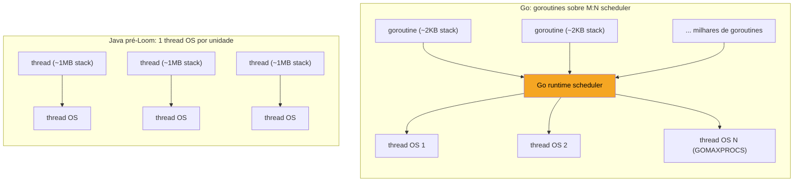
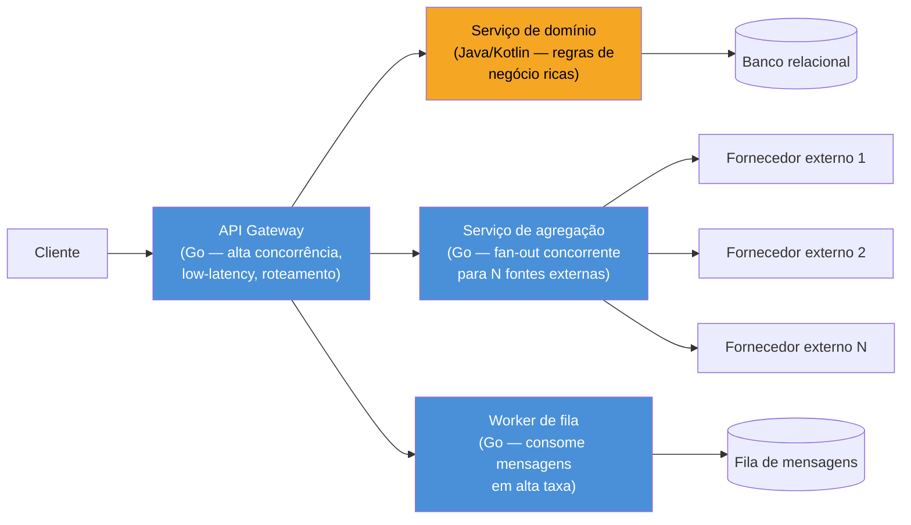

# System design com Go

> [!abstract] TL;DR
> Numa entrevista de system design, "vamos usar Go" só convence se você souber justificar — não recitar "Go é rápido". A justificativa forte tem três pernas: **modelo de concorrência** (goroutines baratas, `sync`/canais explícitos — ideal para I/O paralelo massivo, proxies, agregadores), **runtime previsível** (binário estático, footprint de memória baixo, sem JIT warmup, GC pausas curtas — bom para cold start em serverless/containers) e **simplicidade operacional** (deploy de um binário, sem VM de linguagem para tunar). O trade-off honesto: Go perde para Java/Node em ecossistema de frameworks maduros (ORMs ricos, DI containers, bibliotecas de domínio) e para Node em velocidade de prototipagem de CRUD simples. Go brilha em **infra e serviços de alta concorrência** — proxies, gateways, workers de fila, ferramentas CLI, sidecars — e é mais fraco em produtos com lógica de negócio complexa e mutável, onde a expressividade de Java/Kotlin (generics maduros, anotações, frameworks tipo Spring) reduz boilerplate. Numa entrevista, articule a escolha por *requisito*, não por preferência de linguagem.

## O cenário que expõe a pergunta errada

Imagine a entrevista chegando neste ponto: você acabou de desenhar um sistema de agregação de preços — um serviço que recebe uma requisição, dispara chamadas para 12 fornecedores externos em paralelo, espera o mais lento com timeout, e devolve o menor preço. O entrevistador pergunta: "que linguagem você usaria para implementar esse serviço, e por quê?"

A resposta fraca é "Go, porque é rápido". Rápido comparado a quê? Node também é assíncrono e não-bloqueante. Java com virtual threads (Project Loom, desde o JDK 21) também lida bem com I/O concorrente hoje. "Rápido" sem especificar o eixo de comparação é a mesma armadilha genérica de responder "escalável" sem dizer escalável em quê.

A resposta forte nomeia o **requisito específico** do cenário e conecta a uma característica real da linguagem: "esse serviço faz fan-out de 12 chamadas de I/O e precisa de um timeout agregado — é o caso de uso onde o modelo de concorrência do Go, com goroutines e um `context.Context` propagado por toda a árvore de chamadas, dá o controle mais direto sobre cancelamento, sem a complexidade de callback/promise chaining ou de configurar um thread pool." Essa frase, sozinha, já mostra que você sabe *por que* Go entra em jogo — e o resto da nota constrói o vocabulário para sustentar frases assim sob perguntas de acompanhamento.

## O mecanismo: o que realmente diferencia o modelo de concorrência

O argumento técnico central para Go em system design não é sintaxe — é **custo por unidade de concorrência**. Uma goroutine nasce com uma stack de ~2KB (crescendo sob demanda, até um limite configurável), contra a stack fixa de ~1MB de uma thread de SO tradicional em Java (pré-Loom). Isso significa a diferença entre suportar dezenas de milhares de unidades de concorrência simultâneas versus alguns milhares.



O Go runtime multiplexa milhares de goroutines sobre um número pequeno de threads de SO (controlado por `GOMAXPROCS`, por padrão igual ao número de CPUs) — um scheduler M:N cooperativo que suspende uma goroutine automaticamente quando ela bloqueia em I/O, canal ou mutex, e retoma outra no mesmo thread. Isso é o que torna barato escrever `go fazAlgo()` doze vezes num loop sem pensar em pool de threads.

O segundo pilar é `context.Context` — o mecanismo que carrega timeout, cancelamento e valores de requisição por toda a árvore de chamadas concorrentes, de forma explícita e propagada manualmente (sem thread-local mágico):

```go
func buscarMenorPreco(ctx context.Context, fornecedores []string) (float64, error) {
    ctx, cancel := context.WithTimeout(ctx, 800*time.Millisecond)
    defer cancel()

    resultados := make(chan float64, len(fornecedores))
    for _, f := range fornecedores {
        go func(fornecedor string) {
            preco, err := consultarFornecedor(ctx, fornecedor)
            if err != nil {
                return // context cancelado ou erro do fornecedor — ignora
            }
            select {
            case resultados <- preco:
            case <-ctx.Done():
            }
        }(f)
    }

    menor := math.MaxFloat64
    recebidos := 0
    for recebidos < len(fornecedores) {
        select {
        case p := <-resultados:
            if p < menor {
                menor = p
            }
            recebidos++
        case <-ctx.Done():
            if menor == math.MaxFloat64 {
                return 0, ctx.Err()
            }
            return menor, nil // devolve o melhor que já chegou
        }
    }
    return menor, nil
}
```

> [!info] Loop var por goroutine desde Go 1.22
> Repare em `go func(fornecedor string) { ... }(f)` — passar `f` como parâmetro em vez de capturar a variável do `range` por closure. Até o Go 1.21, capturar `f` direto do laço era um bug clássico (todas as goroutines viam o último valor). Desde o **Go 1.22**, a variável de loop é recriada a cada iteração, e o padrão de "passar como argumento" deixou de ser estritamente necessário — mas continua sendo o jeito mais legível de deixar a intenção explícita, e é o padrão que você ainda vai ver na maioria do código de produção e em qualquer entrevistador que aprendeu Go antes de 2024.

Esse trecho de código é, na prática, o argumento de system design inteiro compactado: fan-out com `go`, timeout agregado com `context.WithTimeout`, e um `select` que devolve o melhor resultado parcial em vez de falhar tudo se um fornecedor for lento. Em Java pré-Loom, o equivalente exigiria um `ExecutorService`, um `CompletableFuture.anyOf`/`allOf` cuidadosamente orquestrado, e cancelamento manual via `Future.cancel` — mais peças móveis, mais chance de vazar uma thread esquecida no pool.

## Quando propor Go — e quando não

A pergunta certa numa entrevista não é "Go é melhor?" — é "que características deste sistema pedem o que Go oferece?". Três sinais que pesam a favor:

**1. I/O-bound com alta concorrência e baixa latência por unidade.** Proxies, API gateways, agregadores, sidecars (o próprio Envoy é escrito em C++, mas boa parte do ecossistema de sidecars leves — como o `linkerd2-proxy` original antes da reescrita em Rust, ou ferramentas tipo Traefik e Caddy — nasceu em Go justamente por isso). Se o sistema passa a maior parte do tempo esperando rede, e o número de conexões concorrentes é alto (milhares a milhões), o custo por goroutine vence o custo por thread.

**2. Infraestrutura e ferramentas de plataforma.** Kubernetes, Docker, Terraform, Prometheus, etcd — a lista de ferramentas de infra escritas em Go não é coincidência: binário único estático, sem runtime externo para instalar, cross-compilation trivial (`GOOS=linux GOARCH=arm64 go build`), startup instantâneo. Se a pergunta da entrevista é "como você distribuiria um CLI ou um agente que roda em milhares de máquinas de cliente", Go tem uma resposta operacional que Java (JVM precisa estar instalada, ou empacotada com GraalVM native-image) e Node (precisa do runtime Node instalado) não têm de graça.

**3. Serviços com startup rápido e footprint de memória previsível** — relevante em contextos serverless (cold start) ou em clusters densamente empacotados onde `GOMAXPROCS` e o coletor de lixo (GC concorrente, pausas tipicamente sub-milissegundo desde o Go 1.5+, mais o controle fino de `GOMEMLIMIT`) dão previsibilidade sem a fase de warm-up de JIT que penaliza a JVM nos primeiros segundos.

E os sinais que pesam **contra** Go, que você precisa admitir quando aparecerem — recusar-se a ver o trade-off do lado oposto é o que faz a resposta soar como propaganda, não engenharia:

- **Lógica de domínio complexa e volátil.** Sistemas com regras de negócio ricas, que mudam com frequência e se beneficiam de expressividade (herança controlada, generics avançados, injeção de dependência declarativa) tendem a ficar mais verbosos em Go. Não porque Go seja "pior", mas porque a filosofia da linguagem — poucos mecanismos, explícitos, sem "mágica" — trafega composição e interfaces pequenas onde Java trafega frameworks e anotações.
- **Ecossistema de bibliotecas de domínio.** Se o sistema depende pesado de ORMs maduros com migrations automáticas, frameworks de admin, bibliotecas de relatório complexas — o ecossistema Java (Spring) e até Node (Prisma, NestJS) tem mais peças prontas. Go tende a "reinventar" bibliotecas mais magras (`sqlx`, `sqlc`) que dão controle, mas custam mais linhas.
- **Times já profundos em outra stack.** Trade-off organizacional, não técnico: se o time inteiro já domina Java/Kotlin e o sistema não tem um requisito de concorrência massiva ou operação de infra, trocar de linguagem por "Go é mais rápido" raramente compensa o custo de ramp-up e a perda de bibliotecas já dominadas.

## Trade-offs frente a Java e Node — o quadro que sustenta a resposta em entrevista

| Eixo | Go | Java (moderno, com virtual threads) | Node.js |
|---|---|---|---|
| Modelo de concorrência | Goroutines M:N, stack ~2KB, `context` explícito | Virtual threads (Loom, JDK 21+) aproximam o custo; pré-Loom, 1 thread OS por unidade | Single-threaded event loop; paralelismo real exige *worker threads* ou processos |
| Startup / cold start | Instantâneo, binário estático | JIT warm-up penaliza os primeiros segundos (mitigável com GraalVM native-image) | Rápido, mas single-thread limita throughput de CPU-bound |
| GC | Concorrente, pausas sub-ms na maioria dos casos, `GOMEMLIMIT` desde 1.19 | Maduro (G1, ZGC), pausas baixas, mais tunáveis | V8 GC, geralmente transparente, menos controle fino |
| Deploy / operação | Binário único, sem runtime externo | Precisa da JVM (ou native-image) | Precisa do runtime Node instalado |
| Expressividade de domínio | Deliberadamente mínima — sem herança, generics chegaram só na 1.18 | Alta — anotações, DI, generics maduros, Spring | Alta — tipagem dinâmica (ou TS opcional) acelera prototipagem |
| Ecossistema de frameworks | Magro por design — bibliotecas, não frameworks | Muito maduro (Spring, Micronaut, Quarkus) | Muito maduro (Express, NestJS, Fastify) |
| Onde ganha claramente | Proxies, gateways, infra, workers de alta concorrência | Sistemas corporativos com domínio rico e equipe já Java | APIs I/O-bound simples, prototipagem rápida, times full-stack JS/TS |

Numa entrevista, esse quadro não deve ser recitado de cor — ele é o *material bruto* para uma resposta de 30 segundos que soa como julgamento de engenheiro sênior: "para este serviço, o gargalo é I/O concorrente com timeout agregado; isso favorece o modelo de goroutines do Go sobre threads tradicionais de Java, e sobre o event loop single-thread do Node, que exigiria orquestrar `Promise.all` com timeout manual e ainda serializaria qualquer trabalho de CPU que aparecesse no meio do caminho."

> [!info] Virtual threads mudaram o cálculo — mas não o zeraram
> Desde o **JDK 21** (Project Loom, setembro de 2023), Java tem *virtual threads*: unidades de concorrência leves, multiplexadas sobre um pool pequeno de threads de plataforma, com custo de criação muito mais próximo de uma goroutine do que de uma thread tradicional. Isso reduz — mas não elimina — o argumento de "Go é o único jeito barato de ter 100 mil unidades de concorrência". Um entrevistador atualizado vai testar se você sabe disso; ignorar virtual threads numa comparação Go-vs-Java em 2026 é um sinal de pesquisa desatualizada, não de domínio de Go.

## Articulando a escolha: o roteiro de resposta

Quando a pergunta "por que Go aqui?" aparecer, um roteiro de três frases costuma sustentar bem sob perguntas de acompanhamento:

1. **Nomeie o requisito, não a linguagem.** "Este componente faz fan-out de N chamadas de I/O com timeout agregado e precisa escalar para milhares de requisições concorrentes por instância."
2. **Conecte ao mecanismo, não ao hype.** "Goroutines dão essa concorrência a um custo de memória por unidade muito menor que threads de SO tradicionais, e `context.Context` propaga cancelamento por toda a árvore de chamadas sem eu precisar orquestrar callbacks manualmente."
3. **Admita o trade-off do lado oposto.** "Se este serviço tivesse regras de negócio ricas e mutáveis em vez de ser majoritariamente I/O e orquestração, eu reconsideraria — Java com Spring ou mesmo Node com TypeScript dariam mais velocidade de iteração em lógica de domínio complexa."

A terceira frase é a que separa quem decorou "Go é rápido" de quem pensa em trade-offs de verdade — e é justamente o tipo de frase que um entrevistador sênior está escutando para calibrar seu nível.

> [!warning] Não proponha Go "porque é a linguagem que eu sei"
> Se a motivação real for familiaridade pessoal, diga isso explicitamente em vez de forçar uma justificativa técnica fraca ("Go escala melhor" para um serviço CRUD simples de baixo tráfego é um argumento vazio). Um entrevistador que pressiona "mas por que não Node aqui, que teria menos boilerplate?" vai desmontar rápido uma justificativa inflada — e isso pesa mais contra você do que simplesmente dizer "eu escolheria com base na stack que o time já domina, e Go se aplicaria se o gargalo fosse concorrência de I/O".

## Onde Go encaixa no desenho de um sistema maior

Numa entrevista de system design que não é "escreva o backend inteiro em Go", mas sim "desenhe a arquitetura", Go tende a aparecer em papéis específicos dentro de um sistema poliglota — não como escolha única de ponta a ponta:



O padrão que se repete em desenhos reais: Go nas bordas de alta concorrência (gateway, agregação, workers de fila, sidecars) e a linguagem de domínio (Java, Kotlin, ou até Go mesmo, se o time já está confortável) no núcleo de regras de negócio. Reconhecer esse padrão numa entrevista — em vez de propor "tudo em Go" ou "tudo em Java" — é o que sinaliza pensamento de arquitetura, não preferência de linguagem.

> [!warning] Cuidado com "Go é mais rápido, ponto" como argumento de performance bruta
> Em benchmarks de CPU-bound puro, Go compilado é geralmente mais rápido que Node (interpretado/JIT via V8) mas comparável a Java bem otimizado (JIT do HotSpot, depois de aquecido, chega perto de código nativo em muitos casos). A vantagem real de Go raramente é "mais rápido em CPU" — é "mais barato por unidade de concorrência em I/O" e "mais previsível em footprint e startup". Confundir os dois eixos numa entrevista é o erro mais comum de quem tenta usar Go como argumento de performance genérica.

## Como explicar em inglês

> When a system design interview asks "why Go here?", the strong answer names the *requirement* before the language: high-fan-out I/O with aggregate timeouts, thousands of concurrent lightweight units, or infrastructure tooling that needs a single static binary with no runtime to install. Go's goroutines multiplex over a small number of OS threads at roughly 2KB per unit, which is what makes massive I/O concurrency cheap — and `context.Context` propagates cancellation and deadlines explicitly through the whole call tree, without orchestrating callback chains. The honest trade-off: Java's virtual threads (since JDK 21) narrow that concurrency-cost gap, and both Java and Node still win on ecosystem maturity for rich, frequently-changing business logic — ORMs, admin frameworks, dependency injection. Go tends to sit at the edges of a larger system — gateways, aggregation services, queue workers, infrastructure sidecars — rather than owning the whole stack end to end. The signal a senior interviewer is listening for isn't "Go is fast" — it's whether you can name the requirement, connect it to the actual mechanism, and admit where the opposite choice would win.

| Termo PT | Termo EN |
|---|---|
| fan-out | fan-out |
| timeout agregado | aggregate timeout |
| custo por unidade de concorrência | cost per unit of concurrency |
| footprint de memória | memory footprint |
| binário estático | static binary |
| cold start | cold start |
| lógica de domínio | domain logic |
| trade-off | trade-off |
| escolha de arquitetura | architectural decision |
| virtual threads | virtual threads |

## O que vem a seguir

Articular *quando* propor Go é meio caminho — a outra metade é sobreviver a uma pergunta de system design inteira, sob pressão de tempo, com o entrevistador cutucando premissas. A [[07 - Simulado comentado|nota 07]] fecha o galho com um simulado completo, comentado ponto a ponto: uma pergunta de system design real, a resposta esperada, e os desvios mais comuns que fazem um candidato perder pontos mesmo sabendo Go tecnicamente.

## Veja também

- [[01 - O que cai numa entrevista de Go|01 — O que cai numa entrevista de Go]] — mapa geral do que este galho cobre
- [[02 - Perguntas conceituais clássicas|02 — Perguntas conceituais clássicas]] — o vocabulário conceitual (goroutines, channels, interfaces) que sustenta os argumentos desta nota
- [[03 - Concorrência em entrevista|03 — Concorrência em entrevista]] — aprofunda o mecanismo de goroutines/channels usado aqui como argumento de system design
- [[05 - Live coding em Go|05 — Live coding em Go]] — nota anterior do galho, sobre a etapa de codificação ao vivo
- [[07 - Simulado comentado|07 — Simulado comentado]] — próxima nota, simulado completo de entrevista
- [[03-Dominios/Tecnologia/Go/index|Trilha Go]]

## Fontes

- The Go Authors. *Effective Go — Concurrency*. go.dev. https://go.dev/doc/effective_go#concurrency (acessado em 2026-07-18)
- The Go Authors. *Go 1.22 Release Notes — For loop variable scoping*. go.dev. https://go.dev/doc/go1.22#language (acessado em 2026-07-18)
- The Go Authors. *Go 1.19 Release Notes — Soft memory limit (GOMEMLIMIT)*. go.dev. https://go.dev/doc/go1.19#runtime (acessado em 2026-07-18)
- pkg.go.dev. *Package context*. pkg.go.dev. https://pkg.go.dev/context (acessado em 2026-07-18)
- The Go Blog. *Go Concurrency Patterns: Context*. go.dev. https://go.dev/blog/context (acessado em 2026-07-18)
- Oracle. *JEP 444: Virtual Threads*. openjdk.org. https://openjdk.org/jeps/444 (acessado em 2026-07-18)
