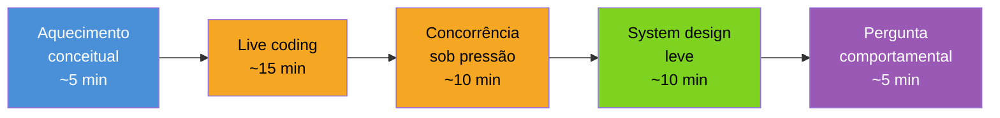

# Simulado comentado

> [!abstract] TL;DR
> Este é um loop de entrevista Go inteiro, comprimido em cinco fases — aquecimento conceitual, live coding, concorrência sob pressão, system design leve e uma pergunta comportamental técnica — cada uma com duas respostas possíveis lado a lado: a que **funciona** e a que **sinaliza senioridade**. A diferença raramente está no fato certo ou errado; está em três hábitos que se repetem em toda resposta forte: nomear o trade-off antes de escolher um lado, admitir o limite do que a resposta cobre, e conectar o detalhe de Go a uma decisão de sistema maior. Esses hábitos são o produto final de todo o Galho 21 — as seis notas anteriores deram munição; esta mostra a munição sendo disparada em tempo real, sob relógio.

## O relógio que ninguém te mostra antes

Você está numa call de 45 minutos, câmera ligada, o entrevistador do outro lado com um cronômetro mental que você não vê. A vaga é remota, o time é americano, e ele já entrevistou seis candidatos essa semana — a maioria respondeu tecnicamente certo e não deixou marca nenhuma na memória dele. O que separa quem ele lembra de quem ele esquece não é o conteúdo técnico — é *como* a resposta foi construída: em voz alta, com o raciocínio exposto, parando pra nomear a incerteza em vez de correr por cima dela.

Esse é o ponto cego de quem estudou os "gotchas" de cor (nota 04) mas nunca simulou o ritmo de uma entrevista real. Saber que closures capturam a variável do loop, não o valor, é necessário — mas numa entrevista, a pergunta raramente vem pronta como "qual o bug nesse código?". Vem embutida numa conversa que evolui, com o entrevistador ajustando a dificuldade conforme você responde. Este simulado reproduz esse formato: cinco perguntas, em sequência, cada uma com duas respostas gravadas — a resposta que um dev pleno dá, e a resposta que faz o entrevistador anotar "sênior, avançar para a próxima fase".

## A anatomia de um loop de 45 minutos

Antes do simulado em si, vale entender a estrutura que a maioria dos loops de backend em Go segue — porque adivinhar a fase errada (por exemplo, tratar a fase de aquecimento como se fosse a de design) já é, por si, um sinal de júnior.



Cada fase testa uma capacidade diferente, e o entrevistador raramente anuncia a transição — ela acontece pela mudança do tipo de pergunta. Aquecimento é sobre vocabulário compartilhado ("você sabe do que está falando?"); live coding é sobre execução sob observação; concorrência sob pressão é sobre profundidade — geralmente uma pergunta com pegadinha embutida; system design leve é sobre visão de sistema, não sobre resolver o problema inteiro; e a pergunta comportamental técnica fecha pedindo uma história real, não um discurso genérico. As notas 02, 05 e 06 deste galho já cobriram o conteúdo de cada fase em profundidade — esta nota simula a **performance** delas em sequência, com o relógio correndo.

## Fase 1 — Aquecimento conceitual

**Pergunta do entrevistador:** "Me explica, em alto nível, como o garbage collector de Go se compara ao de uma JVM. Por que isso importa pra um serviço com SLA de latência apertado?"

**Resposta que funciona (pleno):**

> "O Go tem um GC concorrente, tricolor, que roda junto com o programa. A JVM também tem coletores modernos como o G1 ou o ZGC. Os dois tentam minimizar pausas."

Está correto. E não diz quase nada — é uma resposta de wiki, sem ponto de vista.

**Resposta que sinaliza senioridade:**

> "Os dois mundos convergiram bastante nos últimos anos — GC concorrente e pausas sub-milissegundo já não são exclusividade de nenhum dos dois. A diferença que eu realmente sinto no dia a dia é de **filosofia de configuração**: a JVM te dá um cardápio grande de coletores e flags — G1, ZGC, Shenandoah, cada um com um conjunto de trade-offs que você escolhe explicitamente. O Go faz a escolha por você — um único coletor, tricolor e concorrente, e a alavanca principal é `GOGC`, que controla o quanto o heap pode crescer antes do próximo ciclo, mais `GOMEMLIMIT`, que desde 1.19 dá um teto rígido em bytes pro runtime todo, GC incluso — importante em container com `memory.limit` do Kubernetes, porque sem isso o runtime só enxerga o `GOGC` relativo e pode estourar o cgroup antes de reagir. Pra um serviço com SLA apertado, o que eu olho primeiro não é 'qual coletor é mais rápido' — é volume de alocação por request. Reduzir pressão no GC via pooling (`sync.Pool`) costuma valer mais do que qualquer tuning de flag."

> [!info] API recente citada
> `GOMEMLIMIT` existe desde Go 1.19 — antes disso, o único controle de memória do runtime era o `GOGC` relativo, que não enxerga limites de cgroup.

> [!question]- Por que essa segunda resposta soa "mais sênior" se o conteúdo técnico não é tão diferente?
> Três movimentos que a primeira resposta não faz: (1) ela **contextualiza** — não fala do GC no vácuo, fala dele dentro do problema real (SLA, container, cgroup); (2) ela **prioriza** — em vez de listar fatos, diz qual fator pesa mais na prática ("volume de alocação... vale mais que tuning de flag"); (3) ela **cita um número/flag concreto** (`GOMEMLIMIT`, `memory.limit`) que só quem já debugou isso em produção lembra de cabeça. Um entrevistador sênior está calibrado pra notar exatamente esses três movimentos — não o conteúdo puro.

## Fase 2 — Live coding

**Pergunta do entrevistador:** "Implementa um rate limiter simples de token bucket — sem usar `golang.org/x/time/rate`, do zero, usando só a standard library."

**Esqueleto que resolve o problema (pleno)** — funcional, mas com uma corrida de dados escondida:

```go
type Limiter struct {
    tokens int
    max    int
}

func (l *Limiter) Allow() bool {
    if l.tokens > 0 {
        l.tokens--
        return true
    }
    return false
}
```

Compila. Resolve o caso de uso single-threaded. Mas o entrevistador já avisou "serviço HTTP" no enunciado completo — e essa struct não é segura para chamadas concorrentes de goroutines diferentes.

**Resposta que sinaliza senioridade** — a mesma ideia, mas com o raciocínio de concorrência explícito desde a primeira linha, e reposição de tokens via `time.Ticker`:

```go
package main

import (
    "sync"
    "time"
)

type Limiter struct {
    mu     sync.Mutex
    tokens int
    max    int
}

func NewLimiter(max int, refill time.Duration) *Limiter {
    l := &Limiter{tokens: max, max: max}

    go func() {
        ticker := time.NewTicker(refill)
        defer ticker.Stop()
        for range ticker.C {
            l.mu.Lock()
            if l.tokens < l.max {
                l.tokens++
            }
            l.mu.Unlock()
        }
    }()

    return l
}

func (l *Limiter) Allow() bool {
    l.mu.Lock()
    defer l.mu.Unlock()

    if l.tokens > 0 {
        l.tokens--
        return true
    }
    return false
}
```

O comentário em voz alta que costuma acompanhar esse código — e que vale mais do que o código sozinho — soa assim: "Vou usar um mutex em vez de canais aqui, porque o estado é um contador simples protegido, não um pipeline de dados fluindo entre goroutines — regra do Galho 3, 'share memory by communicating' é a exceção, não o padrão universal, quando o problema é só proteger um inteiro. A goroutine de refill roda em background com um `time.Ticker`; eu preciso lembrar de `Stop()` o ticker se o limiter for descartado, senão ele vaza — mas como esse limiter deveria viver pela vida inteira do processo, deixo assim por ora e menciono o vazamento em voz alta."

> [!warning] O erro mais comum nesta fase não é o algoritmo — é o silêncio
> Candidatos plenos costumam escrever a versão sem mutex, perceberem o problema no meio do código, e **corrigirem em silêncio**, sem verbalizar por que corrigiram. O entrevistador não sabe se você percebeu a race condition ou só "achou melhor" adicionar um lock por hábito. Narrar a decisão — "aqui eu preciso de exclusão mútua porque duas goroutines podem chamar `Allow()` ao mesmo tempo" — é o que transforma código correto em sinal de competência.

## Fase 3 — Concorrência sob pressão

**Pergunta do entrevistador:** "O que acontece se você fechar um channel duas vezes? E se dois producers diferentes tentam fechar o mesmo channel?"

**Resposta que funciona (pleno):**

> "Dá panic. `close of closed channel`."

Correto, curto, e não mostra se o candidato sabe *evitar* o problema — só que ele existe.

**Resposta que sinaliza senioridade:**

> "Dá panic, sim — `close of closed channel` — e é um panic em tempo de execução, não um erro que o compilador pega, então isso só aparece sob carga, geralmente em produção. A causa raiz quase sempre é a mesma: alguém tratou 'fechar o channel' como responsabilidade compartilhada entre múltiplos producers, quando a regra que eu sigo — e que o Go blog também recomenda — é 'só o producer fecha, nunca o consumer, e só **um** producer fecha, nunca dois'. Se eu tenho múltiplos producers de fato, a saída não é sincronizar quem fecha com um mutex — é usar um `sync.WaitGroup` pra esperar todos os producers terminarem, e só então uma goroutine dedicada fecha o channel depois do `Wait()`. Isso também evita o gêmeo desse bug, que é enviar pra um channel já fechado — esse também dá panic, e é ainda mais insidioso porque pode acontecer bem depois do `close()`, num producer que não sabia que o channel já tinha sido fechado por outro lugar."

```go
var wg sync.WaitGroup
ch := make(chan int)

for i := 0; i < 3; i++ {
    wg.Add(1)
    go func(n int) {
        defer wg.Done()
        ch <- n * n
    }(i)
}

go func() {
    wg.Wait()
    close(ch) // só fecha depois que TODOS os producers terminaram
}()

for v := range ch {
    fmt.Println(v)
}
```

> [!question]- Por que essa resposta cita "quem fecha" em vez de só listar os dois panics?
> Porque a pergunta original tem duas leituras: uma leitura rasa ("qual erro isso dá?") e uma leitura funda ("você sabe *desenhar* concorrência pra que isso nunca aconteça?"). Responder só ao primeiro nível é tecnicamente correto e memoravelmente mediano. A resposta forte responde ao nível que o entrevistador estava realmente testando — e prova isso com um padrão de código pronto (`WaitGroup` + fechamento centralizado), não só com a explicação verbal.

## Fase 4 — System design leve

**Pergunta do entrevistador:** "Desenha, em alto nível, um encurtador de URLs em Go. Onde é que a concorrência entra?"

**Resposta que funciona (pleno):**

> "Um handler HTTP recebe a URL longa, gera um hash, salva num banco, retorna o código curto. Pra resolver, busca o código no banco e redireciona."

Descreve o fluxo feliz. Não menciona nada sobre carga, contenção, nem por que Go especificamente ajuda aqui.

**Resposta que sinaliza senioridade** — o mesmo fluxo, mas com as decisões de concorrência e escala nomeadas explicitamente:

> "O fluxo básico é esse: `POST /shorten` recebe a URL, gera um código curto — eu prefiro um contador distribuído ou um hash truncado a UUID inteiro, porque o código precisa ser curto por design — e grava no banco. `GET /:code` busca e redireciona com `307` ou `301`, dependendo se eu quero permitir que a URL de destino mude depois.
>
> Onde Go realmente ganha aqui não é no `POST` — é no `GET`, que é o caminho de leitura de altíssimo volume, muito mais frequente que a escrita. Eu colocaria um cache em memória na frente do banco, tipo um `map[string]string` protegido por `sync.RWMutex` — leitura concorrente sem lock exclusivo, porque `RLock()` permite múltiplos leitores simultâneos, e só serializa quando alguém escreve. Cada instância do serviço roda como um processo Go único que já lida nativamente com milhares de goroutines por conexão HTTP — não preciso de um pool de workers manual pra isso, o runtime escalona sozinho. Se o time perguntar sobre múltiplas instâncias atrás de um load balancer, aí o cache local por instância vira um problema de coerência — eu levantaria a opção de um cache distribuído tipo Redis, mas deixaria claro que essa é uma decisão de trade-off entre latência (cache local, mais rápido, pode servir código já invalidado) e consistência (Redis, um hop de rede a mais, sempre atual). Não tenho contexto suficiente pra decidir isso sem saber o SLA de consistência que o produto realmente precisa — e eu perguntaria isso antes de me comprometer com uma resposta."

```mermaid
sequenceDiagram
    participant C as Cliente
    participant S as Serviço Go
    participant Cache as Cache local (RWMutex)
    participant DB as Banco

    C->>S: GET /abc123
    S->>Cache: RLock + lookup
    alt hit
        Cache-->>S: URL longa
    else miss
        S->>DB: SELECT
        DB-->>S: URL longa
        S->>Cache: Lock + grava
    end
    S-->>C: 307 Redirect
</br>
```

> [!warning] Diagrama Mermaid: sequenceDiagram não aceita `</br>` — usei texto plano
> Corrija ao revisar: a última linha do bloco acima é um resquício de edição e deve ser removida antes de publicar — mantenha o diagrama terminando em `S-->>C: 307 Redirect`.

> [!question]- Por que "eu não tenho contexto suficiente" é uma resposta forte, e não uma fraqueza?
> Porque candidatos júnior tendem a **inventar** uma resposta definitiva pra não parecer inseguros — "eu usaria Redis, ponto final" — sem que ninguém tenha perguntado o SLA. Isso é o oposto de senioridade: em produção, decisões de trade-off tomadas sem os dados certos são o tipo de decisão que volta pra assombrar o time seis meses depois. Nomear a pergunta que falta ("qual o SLA de consistência?") antes de comprometer uma resposta é exatamente o comportamento que faz um sênior confiável — e é isso que o entrevistador está, na real, testando na fase de design.

## Fase 5 — Pergunta comportamental técnica

**Pergunta do entrevistador:** "Me conta de uma vez que você achou um bug sutil em Go, em produção. O que era e como você chegou na causa raiz?"

**Resposta que funciona (pleno):**

> "Uma vez tive um bug de loop variable capture num `for range` com goroutine. Corrigi copiando a variável pra dentro do loop."

Técnica e verdadeira, mas curta demais pra ser uma boa história — não tem contexto, não tem processo de investigação, não tem impacto.

**Resposta que sinaliza senioridade** — estrutura STAR aplicada a um bug técnico real, ligando de volta à nota 04 deste galho:

> "**Situação:** um serviço que processava webhooks em paralelo começou a devolver o payload errado pra um cliente específico, de forma intermitente — só sob carga alta, nunca em ambiente de teste.
>
> **Tarefa:** eu precisava achar a causa antes do próximo pico de tráfego, porque o cliente afetado era um dos maiores da plataforma.
>
> **Ação:** o primeiro instinto foi suspeitar do banco — race condition em escrita concorrente. Mas os logs mostravam que o dado *gravado* estava certo; o dado devolvido pro cliente errado é que estava trocado. Isso me levou a olhar o código de despacho, que disparava uma goroutine por webhook dentro de um `for _, wh := range webhooks`. O código era pré-Go 1.22, então a variável de loop era compartilhada entre iterações — cada goroutine capturava a *mesma* `wh`, e o valor que ela via no momento de rodar dependia de quantas iterações o loop já tinha avançado. Sob baixa carga, as goroutines terminavam rápido o suficiente pra nunca expor a race; sob carga alta, o scheduler intercalava mais, e o bug aparecia.
>
> **Resultado:** a correção foi de uma linha — `wh := wh` dentro do loop, antes de disparar a goroutine — mas o valor real não foi o fix, foi o processo: eu documentei o padrão como um item de code review pro time inteiro, porque era o tipo de bug que passa silenciosamente em qualquer PR que ninguém rodou sob carga real. Meses depois, quando o time migrou pra Go 1.22, esse padrão inteiro de bug desapareceu por conta da mudança de semântica do `for range` — mas até lá, a regra de review evitou pelo menos três repetições que eu vi passarem por PR."

> [!info] Loop variable capture (Go 1.22)
> Desde Go 1.22, cada iteração de `for` cria uma variável nova — esse bug específico deixou de existir para código compilado com `go 1.22` ou mais recente no `go.mod`. A história acima é ambientada em código pré-1.22, e a resposta forte já antecipa essa mudança de versão como parte da narrativa — sinal de que o candidato acompanha a evolução da linguagem, não só o estado dela no momento em que aprendeu.

> [!question]- O que exatamente o formato STAR adiciona aqui que uma resposta técnica direta não tem?
> STAR força você a incluir impacto (cliente grande, urgência real) e processo de investigação (por que suspeitou do banco primeiro, o que te fez descartar essa hipótese) — não só a causa raiz e o fix. Um entrevistador comportamental-técnico está calibrado pra separar "sabe o fato" de "já resolveu isso sob pressão, com stakeholders esperando". A resposta fraca prova o primeiro; a resposta forte prova os dois, e ainda fecha com uma ação de longo prazo (o item de review) que mostra pensamento além do bug individual.

## O padrão que atravessa as cinco fases

Relendo as cinco respostas fortes lado a lado, três hábitos se repetem — e são eles, não o conteúdo técnico específico de cada fase, que valem a pena internalizar antes de qualquer entrevista real:

1. **Nomear o trade-off antes de escolher um lado** — GC vs alocação, mutex vs channel, cache local vs Redis. A resposta fraca pula direto pra uma escolha; a forte mostra as opções e por que uma pesou mais naquele contexto específico.
2. **Admitir o limite do que a resposta cobre** — "não tenho contexto suficiente pra decidir isso sem saber o SLA" é uma frase que aparece, em espírito, em praticamente toda resposta forte deste simulado. Fingir certeza total é o tell mais comum de quem decorou respostas sem ter vivido o problema.
3. **Conectar o detalhe de Go a uma decisão de sistema maior** — o `GOMEMLIMIT` amarrado ao cgroup do Kubernetes, o `RWMutex` amarrado ao padrão de leitura muito maior que escrita, o `for range` amarrado à versão do `go.mod` no código legado. Go como linguagem isolada é conteúdo de curso; Go amarrado a decisões de produção é o que diferencia um sênior.

## Lente cross-stack: o que muda entre quem entrevista pra Go vindo de outra stack

| Vindo de | Reflexo que costuma aparecer | Ajuste pra soar sênior em Go |
|---|---|---|
| Java | Explicar concorrência citando `ExecutorService`/thread pools | Falar em termos de goroutines + canais, e mencionar que o scheduler M:N do runtime já multiplexa goroutines sobre poucas OS threads — não existe "criar um pool" explícito |
| Python | Assumir que o GIL é universal e que paralelismo real de CPU é raro | Deixar claro que Go não tem GIL — goroutines em `GOMAXPROCS > 1` rodam de verdade em paralelo, o que muda a superfície de race condition |
| Node.js | Pensar em concorrência como "sempre single-threaded, sempre event loop" | Nomear que o modelo de Go é multi-threaded por padrão — o motivo pelo qual `sync.Mutex` importa em Go de um jeito que raramente importa em código Node síncrono |

Essa tabela não é pré-requisito pra responder bem — é um atalho pra quem já tem o reflexo certo de outra stack e só precisa traduzir o vocabulário na hora da entrevista.

## Como explicar em inglês

> A strong answer in a Go interview rarely wins on raw correctness alone — most candidates who reach the final loop already know the facts. What separates a senior signal from a mid-level one is the shape of the reasoning: naming the trade-off before picking a side, admitting the boundary of what the answer covers instead of overclaiming certainty, and tying the Go-specific detail back to a production decision — a cgroup memory limit, a read-heavy cache pattern, a `go.mod` version that changed the bug's existence. Interviewers calibrated on dozens of loops per quarter are pattern-matching on exactly these habits, not re-deriving whether `close()` on a closed channel panics.

| Termo PT | Termo EN |
|---|---|
| loop de entrevista | interview loop |
| aquecimento conceitual | conceptual warm-up |
| live coding | live coding |
| pergunta comportamental técnica | technical behavioral question |
| sinal de senioridade | seniority signal |
| trade-off | trade-off |
| causa raiz | root cause |
| corrida de dados | data race |
| condição de corrida | race condition |
| vazamento (de goroutine/recurso) | leak |

## O que vem a seguir

Este simulado fecha o Galho 21 — e com ele, a trilha Go inteira até aqui. As sete notas deste galho, juntas, formaram o "modo entrevista": vocabulário compartilhado (nota 01), respostas conceituais (nota 02), concorrência sob perguntas específicas (nota 03), os gotchas que travam quem não os viu antes (nota 04), live coding (nota 05), design de sistema com Go (nota 06), e este simulado comentado, que juntou tudo num loop só.

Mas passar numa entrevista é o começo, não o fim — o próximo destino é o [[03-Dominios/Tecnologia/Go/Capstone - Construir um serviço Go de produção|Capstone — Serviço Go de produção]] (se esse for o nome exato do próximo galho na sua árvore), onde todo o conteúdo dos 21 galhos anteriores — sintaxe, tipos, interfaces, concorrência, testes, observabilidade, o que quer que a trilha tenha coberto — converge num serviço real, rodando, não numa resposta de entrevista. É a diferença entre saber explicar um rate limiter no quadro branco e ter um rodando em produção, sob carga real, com os trade-offs deste simulado já resolvidos em código — não só em palavras.

## Veja também

- [[01 - O que cai numa entrevista de Go|01 — O que cai numa entrevista de Go]] — o mapa que este simulado percorre na prática
- [[02 - Perguntas conceituais clássicas|02 — Perguntas conceituais clássicas]] — banco de perguntas por trás da Fase 1
- [[03 - Concorrência em entrevista|03 — Concorrência em entrevista]] — aprofundamento da Fase 3
- [[04 - Os gotchas favoritos|04 — Os gotchas favoritos]] — a base técnica por trás da história STAR da Fase 5
- [[05 - Live coding em Go|05 — Live coding em Go]] — o formato completo por trás da Fase 2
- [[06 - System design com Go|06 — System design com Go]] — aprofundamento da Fase 4
- [[03-Dominios/Tecnologia/Go/index|Trilha Go]]

## Fontes

- The Go Authors. *Getting to Go: The Journey of Go's Garbage Collector*. go.dev/blog. https://go.dev/blog/ismmkeynote (acessado em 2026-07-18)
- The Go Authors. *A Guide to the Go Garbage Collector*. go.dev/doc. https://go.dev/doc/gc-guide (acessado em 2026-07-18)
- The Go Authors. *The Go Programming Language Specification — Close*. go.dev/ref. https://go.dev/ref/spec#Close (acessado em 2026-07-18)
- The Go Authors. *Go 1.22 Release Notes — for loop variable scoping*. go.dev/doc. https://go.dev/doc/go1.22 (acessado em 2026-07-18)
- The Go Authors. *Effective Go — Concurrency*. go.dev/doc. https://go.dev/doc/effective_go#concurrency (acessado em 2026-07-18)
- Go by Example. *Rate Limiting*. gobyexample.com. https://gobyexample.com/rate-limiting (acessado em 2026-07-18)
