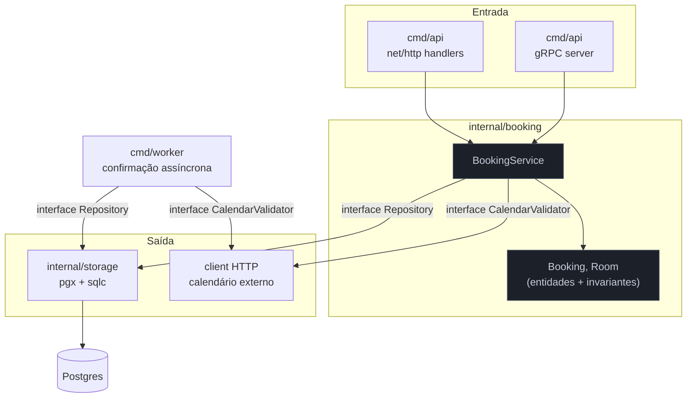
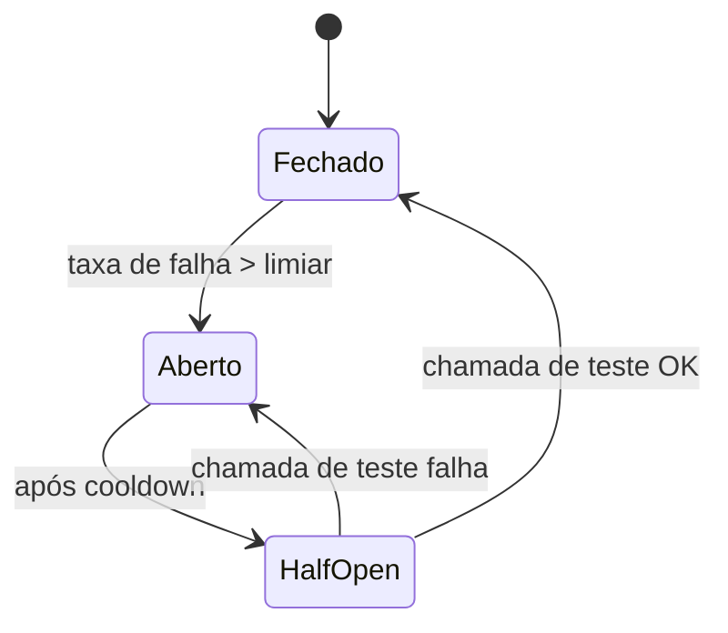

# Capstone — Construir um serviço Go de produção

> [!abstract] TL;DR
> Este capstone constrói, camada por camada, um serviço Go real: uma **API de reservas** (`bookly`) que expõe HTTP externo e gRPC interno, persiste em Postgres via `pgx`/`sqlc`, processa confirmações em background com um worker orientado a `context`, resiste a falhas de dependências externas com timeout/circuit breaker/retry, expõe observabilidade completa (`slog` estruturado, `pprof`, métricas Prometheus, tracing OTel), tem suíte de testes table-driven + integração com Testcontainers, builda como binário estático num container distroless, desliga com graceful shutdown, roda sob um contrato Kubernetes de probes e limites, e passa por `govulncheck` antes de qualquer deploy. Cada decisão de arquitetura é justificada como um sênior justificaria em revisão de design — não "porque é assim que se faz", mas "porque o problema em questão pede isso, e aqui está o trade-off". Os 21 galhos da [[03-Dominios/Tecnologia/Go/index|Trilha Go]] aparecem costurados no lugar exato onde cada um resolve um problema concreto do serviço.

## O projeto: `bookly`, um serviço de reservas

Imagine que você acabou de entrar como o dev sênior de Go de um time que precisa substituir uma planilha compartilhada por um serviço real de **reservas de salas** (pense Calendly simplificado, para salas de reunião internas de uma empresa média — 500 salas, picos de 200 reservas/minuto em horário de abertura de agenda). O time já tem Kubernetes, Postgres gerenciado e um coletor OpenTelemetry rodando — sua tarefa não é decidir a infra do zero, é entregar um serviço que se encaixa nela e aguenta produção.

### Requisitos funcionais

- Criar, consultar, listar e cancelar reservas (`Booking`) de uma sala (`Room`) num intervalo de tempo.
- Rejeitar reservas conflitantes (duas reservas não podem se sobrepor na mesma sala).
- Confirmar a reserva de forma assíncrona: ao criar, o cliente recebe `202 Accepted` com um ID; um worker em background valida a reserva contra um serviço externo de calendário corporativo e marca como `confirmed` ou `rejected`.
- Expor a mesma operação de consulta de disponibilidade também via gRPC, para consumo por outro serviço interno (o front-end de agendamento em lote) que já fala protobuf com o resto do parque.

### Requisitos não-funcionais

- P99 de leitura abaixo de 100ms sob carga normal.
- Nenhuma reserva perdida silenciosamente se o serviço externo de calendário cair — falha precisa ser visível (métrica, log, e a reserva marcada como `pending` até resolver, nunca como sucesso fantasma).
- Shutdown limpo: nenhuma requisição em voo é abortada num deploy — rolling update do Kubernetes não pode gerar erro 5xx para o cliente.
- Observabilidade suficiente para responder, sem adivinhar, "por que essa reserva específica demorou 3 segundos?" — em produção, sem redeploy.
- Binário publicado como imagem Docker mínima, sem shell, sem pacote de gerenciador de pacotes, superfície de ataque reduzida.

Nenhum desses requisitos é decorativo: cada um vira uma decisão de arquitetura nas seções seguintes, e cada decisão aponta para o galho da trilha que a sustenta.

## Decisões de arquitetura, justificadas

Um projeto real não começa pelo código — começa pelas perguntas que um revisor sênior faria antes de aprovar o design. Aqui estão as que importam para o `bookly`, com a resposta e o porquê.

### Por que `cmd/` + `internal/`, e não um `main.go` na raiz?

O layout do repositório segue a convenção não-oficial, mas quase universal em Go de produção, descrita no [Standard Go Project Layout](https://github.com/golang-standards/project-layout):

```
bookly/
├── cmd/
│   ├── api/            # main.go do processo HTTP+gRPC
│   └── worker/         # main.go do processo de confirmação assíncrona
├── internal/
│   ├── booking/        # domínio: entidades, regras de negócio
│   ├── httpapi/         # camada HTTP: handlers, middleware, roteamento
│   ├── grpcapi/         # camada gRPC: server, interceptors
│   ├── storage/         # repository: pgx + sqlc
│   ├── worker/          # confirmação assíncrona
│   ├── config/          # carregamento de configuração
│   └── observability/   # slog, otel, prometheus wiring
├── migrations/
├── proto/
├── Dockerfile
├── go.mod
└── go.sum
```

A escolha de `cmd/` com dois subdiretórios (`api`, `worker`) em vez de um único `main.go` reflete um requisito real: API e worker escalam de forma diferente (a API escala com tráfego HTTP/gRPC, o worker escala com fila de confirmações pendentes) e um time de produção quer poder subir réplicas independentes de cada um no Kubernetes. Dois binários, um módulo — sem duplicar código de domínio.

`internal/` é a peça que mais separa Go de outras linguagens aqui: qualquer pacote sob esse diretório é **inacessível de fora do módulo** — não por convenção, por imposição do compilador (galho 1, sobre pacotes e módulos). Isso significa que `internal/booking` pode expor um tipo `Booking` rico, com invariantes fortes, sem medo de que outro time importe o pacote e dependa de detalhes de implementação que você queria livre para mudar. Comparado a Java, onde o equivalente mais próximo é uma convenção de visibilidade de pacote reforçada por ferramentas externas (module-info.java do JPMS, raramente adotado à risca), `internal/` é gratuito e garantido pelo próprio `go build`.

### Por que camadas explícitas em vez de um framework tipo Rails/NestJS?

Go não tem um framework "batteries-included" dominante como Rails ou Spring Boot — e essa ausência é uma escolha cultural, não uma lacuna. `net/http` da stdlib, desde a versão 1.22 (2024), já tem roteamento com padrões (`GET /rooms/{id}`) suficiente para a maioria dos serviços; a comunidade prefere compor bibliotecas pequenas e substituíveis (roteador, middleware, validação) a herdar as convenções de um framework monolítico. O `bookly` segue essa cultura: a camada HTTP é fina — decodifica request, chama o service, codifica response — e toda regra de negócio mora em `internal/booking`, testável sem subir um servidor HTTP.

Essa separação é a mesma arquitetura hexagonal (ports & adapters) que o galho de **microservices e arquitetura** cobre em detalhe: `internal/booking` define interfaces (`Repository`, `CalendarValidator`) que `internal/storage` e um client HTTP externo implementam — o domínio não sabe se está falando com Postgres ou com um mock em teste.



### Por que injeção de dependência manual, sem um container de DI?

Um dev vindo de Spring ou NestJS espera um container de injeção de dependência com anotações. Go não tem — e a comunidade em geral rejeita a ideia, porque o custo de indireção (reflection em runtime, resolução de grafo escondida) não paga o benefício num ecossistema onde `main.go` já é curto o bastante para fazer *wiring* manual, explícito, visível de cima a baixo:

```go
// cmd/api/main.go — wiring manual, sem magia
func main() {
    cfg := config.Load()
    pool := storage.NewPool(cfg.DatabaseURL)
    repo := storage.NewBookingRepository(pool)
    cal := calendar.NewClient(cfg.CalendarBaseURL, cfg.CalendarTimeout)
    svc := booking.NewService(repo, cal)

    httpServer := httpapi.NewServer(svc, cfg.HTTPAddr)
    grpcServer := grpcapi.NewServer(svc)
    // ...
}
```

Ferramentas como o [Wire](https://github.com/google/wire) do Google existem para gerar esse wiring automaticamente quando o grafo cresce demais para revisar a olho — mas o ponto de partida idiomático, e o que o `bookly` usa aqui por ainda ser pequeno, é construtor explícito (galho 2, sobre construtores de struct) passado como argumento, sem reflection nenhuma. Cada dependência de `BookingService` é uma **interface** definida pelo próprio pacote consumidor — o padrão "aceite interfaces, retorne structs concretos" que o galho de interfaces e composição estabelece como o eixo central do desacoplamento em Go.

### Por que configuração via `struct` + variáveis de ambiente, sem YAML?

Seguindo os [Twelve-Factor App](https://12factor.net/config) (fator III), configuração vem de variáveis de ambiente, nunca de arquivo commitado — o mesmo YAML de config muda por ambiente (dev/staging/produção) e é fonte clássica de segredo vazado em repositório. `internal/config` expõe um struct tipado, populado uma vez na inicialização, e falha rápido (fail-fast) se uma variável obrigatória faltar — em vez de deixar o serviço subir com um `DATABASE_URL` vazio e falhar de forma confusa na primeira query:

```go
type Config struct {
    HTTPAddr        string
    GRPCAddr        string
    DatabaseURL     string
    CalendarBaseURL string
    CalendarTimeout time.Duration
    ShutdownTimeout time.Duration
}

func Load() Config {
    cfg := Config{
        HTTPAddr:        env("HTTP_ADDR", ":8080"),
        GRPCAddr:        env("GRPC_ADDR", ":9090"),
        DatabaseURL:     mustEnv("DATABASE_URL"),
        CalendarBaseURL: mustEnv("CALENDAR_BASE_URL"),
        CalendarTimeout: envDuration("CALENDAR_TIMEOUT", 2*time.Second),
        ShutdownTimeout: envDuration("SHUTDOWN_TIMEOUT", 15*time.Second),
    }
    return cfg
}
```

`mustEnv` faz `log.Fatal` — ou melhor, `os.Exit(1)` depois de um log estruturado — se a variável não existir. Falhar na inicialização é sempre preferível a falhar na primeira requisição de um cliente real.

## Camada HTTP: handler, decodificação, resposta

A camada HTTP usa `net/http` puro (Go 1.22+, com roteamento por padrão de método+path nativo — sem depender de Gin/Chi para o roteamento básico, embora o galho de **net/http e frameworks web** cubra quando um roteador de terceiros compensa, tipicamente por middleware pronto e melhor ergonomia de grupos de rota):

```go
// internal/httpapi/bookings.go
func (s *Server) handleCreateBooking(w http.ResponseWriter, r *http.Request) {
    ctx := r.Context()

    var req createBookingRequest
    if err := json.NewDecoder(r.Body).Decode(&req); err != nil {
        writeError(w, http.StatusBadRequest, "corpo inválido")
        return
    }

    if err := req.Validate(); err != nil {
        writeError(w, http.StatusUnprocessableEntity, err.Error())
        return
    }

    b, err := s.svc.CreateBooking(ctx, req.toDomain())
    switch {
    case errors.Is(err, booking.ErrConflict):
        writeError(w, http.StatusConflict, "sala já reservada nesse intervalo")
        return
    case err != nil:
        s.log.ErrorContext(ctx, "criar reserva falhou", "erro", err)
        writeError(w, http.StatusInternalServerError, "erro interno")
        return
    }

    w.Header().Set("Location", "/bookings/"+b.ID.String())
    writeJSON(w, http.StatusAccepted, toResponse(b))
}
```

Note o `errors.Is(err, booking.ErrConflict)` — o handler nunca inspeciona texto de erro; ele compara contra um **erro sentinela** exportado pelo domínio, exatamente o padrão que o galho de **erros como valor** estabelece: erro em Go é um valor comum, comparável, que atravessa camadas sem perder identidade (diferente de exceptions que carregam stack trace mas exigem `catch` por tipo). O `ctx := r.Context()` que abre o handler é o fio condutor de todo o serviço — todo `Request` HTTP já chega com um `context.Context` vinculado ao ciclo de vida da conexão, e é esse mesmo `ctx` que se propaga até a query no Postgres e a chamada ao serviço de calendário, carregando prazo e cancelamento (galho de **sincronização e context**).

O middleware de request-ID e logging estruturado envolve toda a cadeia:

```go
func withRequestID(next http.Handler) http.Handler {
    return http.HandlerFunc(func(w http.ResponseWriter, r *http.Request) {
        id := uuid.NewString()
        ctx := context.WithValue(r.Context(), requestIDKey{}, id)
        w.Header().Set("X-Request-ID", id)
        next.ServeHTTP(w, r.WithContext(ctx))
    })
}
```

## Camada gRPC interna

O consumidor interno (o serviço de agendamento em lote) fala protobuf, não JSON — sinal claro de que gRPC é a ferramenta certa aqui, não HTTP+JSON: chamada interna, alto volume, contrato tipado ponta a ponta, sem a fricção de serializar/desserializar JSON em cada hop. O `.proto` define o contrato:

```protobuf
// proto/bookly/v1/availability.proto
service AvailabilityService {
  rpc CheckAvailability(CheckAvailabilityRequest) returns (CheckAvailabilityResponse);
}

message CheckAvailabilityRequest {
  string room_id = 1;
  google.protobuf.Timestamp start = 2;
  google.protobuf.Timestamp end = 3;
}
```

O server gRPC reaproveita o **mesmo** `BookingService` de domínio que o handler HTTP usa — é a prova de que a separação em camadas funcionou: dois protocolos de transporte, uma regra de negócio, sem duplicação.

```go
func (s *GRPCServer) CheckAvailability(ctx context.Context, req *pb.CheckAvailabilityRequest) (*pb.CheckAvailabilityResponse, error) {
    available, err := s.svc.CheckAvailability(ctx, req.RoomId, req.Start.AsTime(), req.End.AsTime())
    if err != nil {
        return nil, status.Errorf(codes.Internal, "checar disponibilidade: %v", err)
    }
    return &pb.CheckAvailabilityResponse{Available: available}, nil
}
```

O interceptor de observabilidade do server gRPC injeta trace context e loga cada RPC — mesmo padrão do middleware HTTP, agora na forma que o galho de **gRPC e protobuf** define como *unary interceptor*.

## Camada de domínio: regras sem framework

`internal/booking` é onde vive a regra que mais importa para o negócio — duas reservas não podem se sobrepor. Ela não sabe nada de HTTP, gRPC, ou SQL:

```go
type Repository interface {
    Create(ctx context.Context, b Booking) error
    HasOverlap(ctx context.Context, roomID string, start, end time.Time) (bool, error)
    Get(ctx context.Context, id uuid.UUID) (Booking, error)
}

type CalendarValidator interface {
    Validate(ctx context.Context, b Booking) error
}

type Service struct {
    repo Repository
    cal  CalendarValidator
}

func NewService(repo Repository, cal CalendarValidator) *Service {
    return &Service{repo: repo, cal: cal}
}

var ErrConflict = errors.New("reserva conflita com outra existente")

func (s *Service) CreateBooking(ctx context.Context, b Booking) (Booking, error) {
    overlap, err := s.repo.HasOverlap(ctx, b.RoomID, b.Start, b.End)
    if err != nil {
        return Booking{}, fmt.Errorf("checar sobreposição: %w", err)
    }
    if overlap {
        return Booking{}, ErrConflict
    }
    b.Status = StatusPending
    if err := s.repo.Create(ctx, b); err != nil {
        return Booking{}, fmt.Errorf("persistir reserva: %w", err)
    }
    return b, nil
}
```

`fmt.Errorf("...: %w", err)` em vez de retornar `err` cru — cada camada adiciona contexto sem perder a cadeia de causa, que `errors.Is`/`errors.As` sabe desembrulhar mais tarde. Esse hábito é exatamente o que separa código Go júnior (retorna `err` sem contexto, ou pior, engole com `if err != nil { return nil }`) de sênior.

Os testes do domínio são table-driven, puros — nenhum Postgres real, `Repository` e `CalendarValidator` viram fakes/mocks em memória (galho de **testes**):

```go
func TestCreateBooking(t *testing.T) {
    tests := []struct {
        name       string
        existing   bool
        wantErr    error
    }{
        {name: "sem conflito", existing: false, wantErr: nil},
        {name: "com conflito", existing: true, wantErr: ErrConflict},
    }
    for _, tt := range tests {
        t.Run(tt.name, func(t *testing.T) {
            repo := &fakeRepo{hasOverlap: tt.existing}
            svc := NewService(repo, &fakeCalendar{})
            _, err := svc.CreateBooking(context.Background(), Booking{RoomID: "r1"})
            if !errors.Is(err, tt.wantErr) && tt.wantErr != nil {
                t.Fatalf("esperava %v, obteve %v", tt.wantErr, err)
            }
        })
    }
}
```

## Persistência: pgx + sqlc

`database/sql` da stdlib é o denominador comum, mas `pgx` — o driver Postgres nativo — expõe o protocolo binário completo e um pool de conexões (`pgxpool`) mais eficiente que o padrão `database/sql`. O `bookly` usa `pgx` diretamente (não via `database/sql`), e `sqlc` para gerar código Go tipado a partir de SQL escrito à mão — decisão deliberada contra um ORM tipo GORM: o time quer **ver o SQL real** que roda contra o banco, não uma abstração que gera queries N+1 silenciosamente. Esse trade-off (SQL explícito + geração de código vs. ORM) é o tema central do galho de **persistência**.

```sql
-- queries/bookings.sql
-- name: HasOverlap :one
SELECT EXISTS (
    SELECT 1 FROM bookings
    WHERE room_id = $1
      AND status != 'cancelled'
      AND tsrange(start_time, end_time) && tsrange($2::timestamptz, $3::timestamptz)
) AS overlaps;

-- name: CreateBooking :exec
INSERT INTO bookings (id, room_id, start_time, end_time, status)
VALUES ($1, $2, $3, $4, $5);
```

`sqlc generate` produz `HasOverlap(ctx, params) (bool, error)` tipado — sem `interface{}`, sem reflection em runtime, erro de coluna vira erro de compilação, não de produção às 3h da manhã. O adapter em `internal/storage` implementa a interface `booking.Repository` chamando o código gerado:

```go
type BookingRepository struct {
    q *sqlc.Queries
}

func (r *BookingRepository) HasOverlap(ctx context.Context, roomID string, start, end time.Time) (bool, error) {
    return r.q.HasOverlap(ctx, sqlc.HasOverlapParams{
        RoomID: roomID,
        Column2: start,
        Column3: end,
    })
}
```

O pool é configurado com limites explícitos — `MaxConns`, `MinConns`, `MaxConnLifetime` — porque um pool sem teto é a causa mais comum de um Postgres derrubado por um serviço Go que "só" abriu conexão demais sob pico.

## Worker: confirmação assíncrona orientada a `context`

O segundo binário (`cmd/worker`) consome reservas `pending`, valida contra o calendário externo, e atualiza o status. Ele roda num loop com `context.Context` como eixo de cancelamento — o mesmo mecanismo que a camada HTTP usa para propagar prazo, agora usado para propagar **shutdown**:

```go
func (w *Worker) Run(ctx context.Context) error {
    ticker := time.NewTicker(2 * time.Second)
    defer ticker.Stop()

    for {
        select {
        case <-ctx.Done():
            w.log.Info("worker encerrando", "motivo", ctx.Err())
            return ctx.Err()
        case <-ticker.C:
            w.processPending(ctx)
        }
    }
}

func (w *Worker) processPending(ctx context.Context) {
    pending, err := w.repo.ListPending(ctx, 50)
    if err != nil {
        w.log.ErrorContext(ctx, "listar pendentes falhou", "erro", err)
        return
    }

    var wg sync.WaitGroup
    sem := make(chan struct{}, 10) // limita concorrência a 10 validações simultâneas

    for _, b := range pending {
        wg.Add(1)
        sem <- struct{}{}
        go func(b booking.Booking) {
            defer wg.Done()
            defer func() { <-sem }()
            w.confirm(ctx, b)
        }(b)
    }
    wg.Wait()
}
```

O `select` sobre `ctx.Done()` e o ticker é o padrão canônico do galho de **channels e select**; o `sem := make(chan struct{}, 10)` é um *semáforo* implementado com um channel bufferizado, técnica coberta no mesmo galho para limitar fan-out sem depender de bibliotecas externas. `sync.WaitGroup` garante que o loop não avança para o próximo tick antes de todas as goroutines da leva atual terminarem — evitando que o worker acumule goroutines indefinidamente sob atraso do calendário externo (galho de **goroutines e o scheduler**, sobre o custo — pequeno, mas não zero — de cada goroutine em voo).

## Resiliência: timeout, retry, circuit breaker

O calendário externo é a dependência menos confiável do sistema — está fora do controle do time, tem histórico de latência alta em horário de pico. Três mecanismos, em camadas, protegem o `bookly` dela:

**Timeout por chamada**, sempre derivado do `context` recebido, nunca um `time.Sleep` solto:

```go
func (c *CalendarClient) Validate(ctx context.Context, b booking.Booking) error {
    ctx, cancel := context.WithTimeout(ctx, c.timeout)
    defer cancel()

    req, _ := http.NewRequestWithContext(ctx, http.MethodPost, c.baseURL+"/validate", body(b))
    resp, err := c.httpClient.Do(req)
    if err != nil {
        return fmt.Errorf("chamar calendário: %w", err)
    }
    defer resp.Body.Close()
    // ...
}
```

**Retry com backoff exponencial e jitter**, só para erros transitórios (timeout, 5xx) — nunca para 4xx, que indicam erro do próprio pedido e só se repetiriam:

```go
func withRetry(ctx context.Context, maxAttempts int, fn func() error) error {
    var err error
    for attempt := 0; attempt < maxAttempts; attempt++ {
        if err = fn(); err == nil {
            return nil
        }
        if !isRetryable(err) {
            return err
        }
        backoff := time.Duration(attempt+1) * 200 * time.Millisecond
        jitter := time.Duration(rand.Int63n(int64(backoff / 2)))
        select {
        case <-time.After(backoff + jitter):
        case <-ctx.Done():
            return ctx.Err()
        }
    }
    return err
}
```

**Circuit breaker**, para parar de bater numa dependência já sabidamente fora do ar em vez de acumular timeouts em fila: quando a taxa de falha do `CalendarClient` cruza um limiar, o breaker abre e falha rápido por um período de resfriamento, liberando o worker para marcar reservas como `pending` sem gastar 2 segundos de timeout por tentativa. Bibliotecas como [sony/gobreaker](https://github.com/sony/gobreaker) implementam a máquina de estados clássica (fechado → aberto → half-open); a decisão de arquitetura aqui é **onde** o breaker fica — em torno do `CalendarClient`, não em torno do repositório Postgres, porque só a dependência de rede instável e fora do seu controle justifica o padrão.



## Observabilidade: `slog`, `pprof`, Prometheus, OTel

Um serviço em produção sem observabilidade é uma caixa preta que só fala quando já caiu. O `bookly` instrumenta três eixos, cada um respondendo a uma pergunta diferente:

**Logs estruturados** com `log/slog` (stdlib desde Go 1.21) — nunca `fmt.Println`, sempre pares chave-valor que um coletor consegue indexar:

```go
logger := slog.New(slog.NewJSONHandler(os.Stdout, &slog.HandlerOptions{Level: slog.LevelInfo}))
logger.InfoContext(ctx, "reserva criada",
    "booking_id", b.ID,
    "room_id", b.RoomID,
    "trace_id", traceIDFrom(ctx),
)
```

**Profiling sob demanda** com `net/http/pprof`, montado num endpoint separado, nunca exposto publicamente — só acessível via port-forward interno no Kubernetes:

```go
go func() {
    log.Println(http.ListenAndServe("localhost:6060", nil)) // importa net/http/pprof em blank
}()
```

Quando o P99 do requisito não-funcional degradar em produção, `go tool pprof http://localhost:6060/debug/pprof/profile?seconds=30` responde "onde o tempo de CPU foi gasto" sem precisar reproduzir localmente — a mesma ferramenta que o galho de **runtime interno** usa para explicar escape analysis e GC.

**Métricas Prometheus**, expostas em `/metrics`, cobrindo os quatro sinais de ouro (latência, tráfego, erros, saturação):

```go
var bookingsCreated = prometheus.NewCounterVec(
    prometheus.CounterOpts{Name: "bookly_bookings_created_total"},
    []string{"status"},
)
var requestDuration = prometheus.NewHistogramVec(
    prometheus.HistogramOpts{Name: "bookly_http_request_duration_seconds"},
    []string{"method", "path", "status"},
)
```

**Tracing distribuído** com OpenTelemetry — cada requisição HTTP entra com um span raiz, que se propaga pelo `context.Context` até a query no Postgres e a chamada ao calendário, permitindo ver, num único trace, onde os 3 segundos de latência realmente foram gastos (a pergunta que o requisito não-funcional de observabilidade exige responder sem adivinhar). Os três pilares — logs, métricas, traces — mais o profiling sob demanda são o assunto completo do galho de **observabilidade**; aqui eles convergem no mesmo `ctx` que já carrega prazo (resiliência) e cancelamento (worker).

## Testes: table-driven + integração com Testcontainers

O domínio (`internal/booking`) tem cobertura table-driven pura, sem infraestrutura — já mostrado acima. A camada `internal/storage`, que fala Postgres de verdade, é testada com [Testcontainers for Go](https://golang.testcontainers.org/): sobe um Postgres real em Docker no início da suíte, roda as migrations, testa contra o banco de fato — nunca um mock de SQL, que mente sobre comportamento real de constraint e índice:

```go
func TestBookingRepository_HasOverlap(t *testing.T) {
    ctx := context.Background()
    pgContainer, err := postgres.Run(ctx, "postgres:16-alpine")
    if err != nil {
        t.Fatal(err)
    }
    defer pgContainer.Terminate(ctx)

    pool := connectAndMigrate(t, pgContainer)
    repo := storage.NewBookingRepository(pool)

    // arrange: insere uma reserva 10h-11h
    // act: pergunta se 10h30-11h30 sobrepõe
    // assert: true
}
```

Benchmarks (`go test -bench`) cobrem o hot path de `HasOverlap` sob carga, e o próprio `go test -race` roda em CI sobre a suíte do worker — nenhuma goroutine concorrente entra em produção sem ter passado pelo detector de race. Tudo isso é o escopo do galho de **testes**.

## Build estático, Docker distroless, graceful shutdown, contrato K8s

O binário compila estático, sem CGO, cross-compilado para `linux/amd64` a partir de qualquer máquina de dev — a marca registrada de Go que elimina a classe inteira de problema "funciona na minha máquina, falta uma `.so` no container":

```dockerfile
FROM golang:1.23 AS build
WORKDIR /src
COPY go.mod go.sum ./
RUN go mod download
COPY . .
RUN CGO_ENABLED=0 GOOS=linux go build -ldflags="-s -w" -o /bookly ./cmd/api

FROM gcr.io/distroless/static-debian12
COPY --from=build /bookly /bookly
USER nonroot:nonroot
ENTRYPOINT ["/bookly"]
```

`distroless/static` não tem shell, não tem gerenciador de pacotes, não tem praticamente nada além do binário e certificados TLS — superfície de ataque mínima, exatamente o requisito não-funcional de segurança de imagem. Esse pipeline completo (build estático, multi-stage, distroless) é o assunto do galho de **cloud-native e produção**.

**Graceful shutdown**, para atender ao requisito de zero 5xx num rolling update — o servidor escuta `SIGTERM` (o sinal que o Kubernetes envia antes de matar um pod), para de aceitar conexão nova, e espera as em voo terminarem dentro de um prazo:

```go
func main() {
    // ... wiring ...
    srv := &http.Server{Addr: cfg.HTTPAddr, Handler: router}

    go func() {
        if err := srv.ListenAndServe(); err != nil && !errors.Is(err, http.ErrServerClosed) {
            log.Fatal(err)
        }
    }()

    stop := make(chan os.Signal, 1)
    signal.Notify(stop, syscall.SIGTERM, syscall.SIGINT)
    <-stop

    ctx, cancel := context.WithTimeout(context.Background(), cfg.ShutdownTimeout)
    defer cancel()
    if err := srv.Shutdown(ctx); err != nil {
        log.Printf("shutdown forçado: %v", err)
    }
}
```

O **contrato Kubernetes** que faz esse mecanismo funcionar de verdade tem três peças que precisam concordar: `terminationGracePeriodSeconds` do pod maior que `ShutdownTimeout` do processo; uma **readiness probe** que falha assim que o `SIGTERM` chega (removendo o pod do balanceamento antes de fechar conexões); e uma **liveness probe** separada, que só reinicia o pod se ele travar de verdade, não em qualquer soluço passageiro de dependência externa — confundir as duas é a causa mais comum de *crash loop* desnecessário em produção.

## Segurança: validação, TLS, `govulncheck`

Toda entrada externa passa por validação explícita antes de tocar o domínio — nunca confiar que o JSON decodificado já está bem formado:

```go
func (r createBookingRequest) Validate() error {
    if r.RoomID == "" {
        return errors.New("room_id obrigatório")
    }
    if r.End.Before(r.Start) || r.End.Equal(r.Start) {
        return errors.New("end deve ser depois de start")
    }
    if r.End.Sub(r.Start) > 8*time.Hour {
        return errors.New("reserva não pode passar de 8 horas")
    }
    return nil
}
```

O tráfego entre o `bookly` e o calendário externo roda sobre TLS 1.2+ (via `crypto/tls`, configurando `MinVersion` explicitamente no `http.Transport` — nunca confiar no default silencioso da stdlib mudar entre versões de Go sem revisão). E antes de qualquer deploy, `govulncheck ./...` roda em CI, comparando as dependências do módulo contra o banco de vulnerabilidades conhecidas do próprio time Go — pega CVEs em bibliotecas transitivas que um `go.sum` sozinho não sinaliza. Esse conjunto — validação de entrada, TLS explícito, scanning de vulnerabilidade contínuo — é o escopo do galho de **segurança**.

## Checklist de produção

Antes deste serviço merecer tráfego real, cada item abaixo precisa estar marcado — não como burocracia, mas porque cada um corresponde a um requisito da seção de abertura:

- [ ] `cmd/api` e `cmd/worker` compilam com `CGO_ENABLED=0`, cross-compilados para `linux/amd64`.
- [ ] Imagem Docker final é `distroless`, roda como `nonroot`, sem shell.
- [ ] `SIGTERM` dispara graceful shutdown; readiness probe cai antes do shutdown começar.
- [ ] `terminationGracePeriodSeconds` do manifesto K8s é maior que o `ShutdownTimeout` do processo.
- [ ] Pool de conexões Postgres tem `MaxConns`/`MaxConnLifetime` explícitos — nunca ilimitado.
- [ ] Toda chamada de rede externa carrega timeout derivado de `context.WithTimeout`.
- [ ] Retry só em erros transitórios, com backoff exponencial + jitter; nunca retry cego.
- [ ] Circuit breaker em torno da dependência externa menos confiável (calendário).
- [ ] Logs em `slog` estruturado (JSON), nunca `fmt.Println`; nenhum dado sensível em log.
- [ ] `/metrics` expõe latência, tráfego, erros e saturação (os 4 sinais de ouro).
- [ ] Tracing OTel propaga um `trace_id` por requisição, ponta a ponta, incluindo o worker.
- [ ] `/debug/pprof` existe mas **não** está exposto fora da rede interna.
- [ ] Suíte de testes cobre domínio (table-driven, sem infra) e storage (Testcontainers, Postgres real).
- [ ] `go test -race ./...` roda em CI sobre qualquer pacote com goroutine.
- [ ] `govulncheck ./...` roda em CI e bloqueia merge em CVE crítico.
- [ ] Toda entrada externa (HTTP body, gRPC request) passa por validação antes de tocar o domínio.
- [ ] `internal/` protege o domínio de import externo indevido — nenhum pacote de fora do módulo importa `internal/booking`.
- [ ] Erros de domínio são sentinelas (`errors.Is`) ou tipos (`errors.As`) — nunca comparação de string.
- [ ] Configuração vem 100% de variáveis de ambiente; nenhum segredo commitado.

## Como explicar em inglês

> This capstone builds `bookly`, a room-booking service, to stitch together everything the Go track covers: an `internal/`-guarded domain package exposes narrow interfaces (`Repository`, `CalendarValidator`) that both an HTTP handler and a gRPC server call into — same business logic, two transports, zero duplication. Persistence uses `pgx` and `sqlc`-generated code instead of an ORM, so the SQL that actually runs against Postgres stays visible and type-checked at compile time. A separate worker binary polls for pending bookings and confirms them against an external calendar, using `context.Context` for both per-call timeouts and clean shutdown, a buffered channel as a semaphore to bound concurrent validations, and a circuit breaker around the flakiest external dependency so the service fails fast instead of piling up goroutines on a dead calendar API. Observability covers all three pillars — structured `slog` logs, Prometheus metrics for the four golden signals, and OpenTelemetry traces that follow a single request from the HTTP handler through the database call and into the worker — plus on-demand `pprof` profiling kept off the public network. The service ships as a statically linked, CGO-free binary in a distroless container, shuts down gracefully on `SIGTERM` within a Kubernetes-aware grace period, and every dependency gets scanned with `govulncheck` before deploy. Nothing here is decorative — each decision traces back to a concrete non-functional requirement stated up front, the way a senior engineer would justify it in a design review.

| Termo PT | Termo EN |
|---|---|
| serviço de produção | production service |
| camada de domínio | domain layer |
| injeção de dependência manual | manual dependency injection |
| interruptor de circuito | circuit breaker |
| desligamento gradual | graceful shutdown |
| binário estático | statically linked binary |
| imagem sem distro | distroless image |
| sonda de prontidão / vivacidade | readiness / liveness probe |
| varredura de vulnerabilidade | vulnerability scanning |
| sinais de ouro (observabilidade) | golden signals |

## Veja também

- [[03-Dominios/Tecnologia/Go/index|Trilha Go]] — MOC com os 21 galhos costurados neste capstone
- [[03-Dominios/Tecnologia/Go/01 - Fundamentos e sintaxe/index|Galho 1 — Fundamentos e sintaxe]] — pacotes/módulos, `internal/`, ponteiros: base de todo o layout do `bookly`
- [[03-Dominios/Tecnologia/Go/02 - Tipos, structs e métodos/index|Galho 2 — Tipos, structs e métodos]] — construtores explícitos e value/pointer semantics usados em `booking.Service` e `Config`
- Galho 3 (Interfaces e composição) — `Repository`/`CalendarValidator` como interfaces implícitas que desacoplam domínio de infraestrutura
- Galho 4 (Erros como valor) — `ErrConflict`, `errors.Is`/`errors.As`, `fmt.Errorf("%w", ...)` usados em toda a camada de domínio e handlers
- Galho 7-9 (Goroutines, channels/select, sincronização e context) — o worker inteiro, do `select` de shutdown ao semáforo via channel bufferizado
- Galho 10-13 (net/http, persistência, gRPC, mensageria) — as três formas de I/O externo do serviço
- Galho 14 (Microservices e arquitetura) — o layout `cmd/`+`internal/` e a arquitetura hexagonal por trás das camadas
- Galho 15-16 (Testes, observabilidade) — table-driven + Testcontainers, e os três pilares de observabilidade
- Galho 17 (Runtime interno) — o que `pprof` e o GC revelam quando o P99 do checklist degrada
- Galho 18-19 (Cloud-native e produção, Segurança) — Dockerfile distroless, contrato K8s, `govulncheck`

## Fontes

- The Go Authors. *Effective Go*. go.dev. https://go.dev/doc/effective_go (acessado em 2026-07-18)
- Kubernetes. *Configure Liveness, Readiness and Startup Probes*. kubernetes.io. https://kubernetes.io/docs/tasks/configure-pod-container/configure-liveness-readiness-startup-probes/ (acessado em 2026-07-18)
- The Twelve-Factor App. *III. Config*. 12factor.net. https://12factor.net/config (acessado em 2026-07-18)
- golang-standards. *Standard Go Project Layout*. GitHub. https://github.com/golang-standards/project-layout (acessado em 2026-07-18)
- sqlc-dev. *sqlc Documentation*. docs.sqlc.dev. https://docs.sqlc.dev (acessado em 2026-07-18)
- jackc. *pgx — PostgreSQL Driver and Toolkit for Go*. GitHub. https://github.com/jackc/pgx (acessado em 2026-07-18)
- Testcontainers. *Testcontainers for Go*. golang.testcontainers.org. https://golang.testcontainers.org (acessado em 2026-07-18)
- sony. *gobreaker — Circuit Breaker in Go*. GitHub. https://github.com/sony/gobreaker (acessado em 2026-07-18)
- Google. *govulncheck*. pkg.go.dev. https://pkg.go.dev/golang.org/x/vuln/cmd/govulncheck (acessado em 2026-07-18)
- OpenTelemetry. *Go Getting Started*. opentelemetry.io. https://opentelemetry.io/docs/languages/go/getting-started/ (acessado em 2026-07-18)
- The Go Authors. *log/slog package documentation*. pkg.go.dev. https://pkg.go.dev/log/slog (acessado em 2026-07-18)
