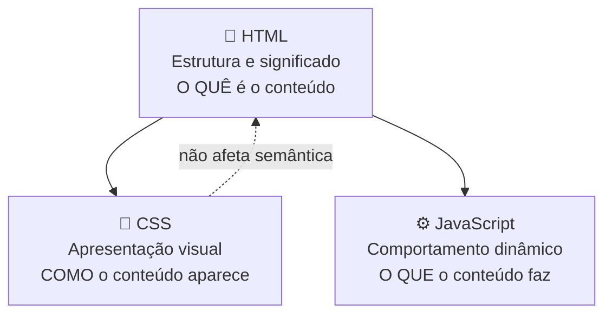
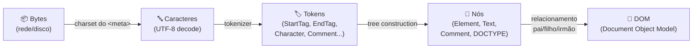
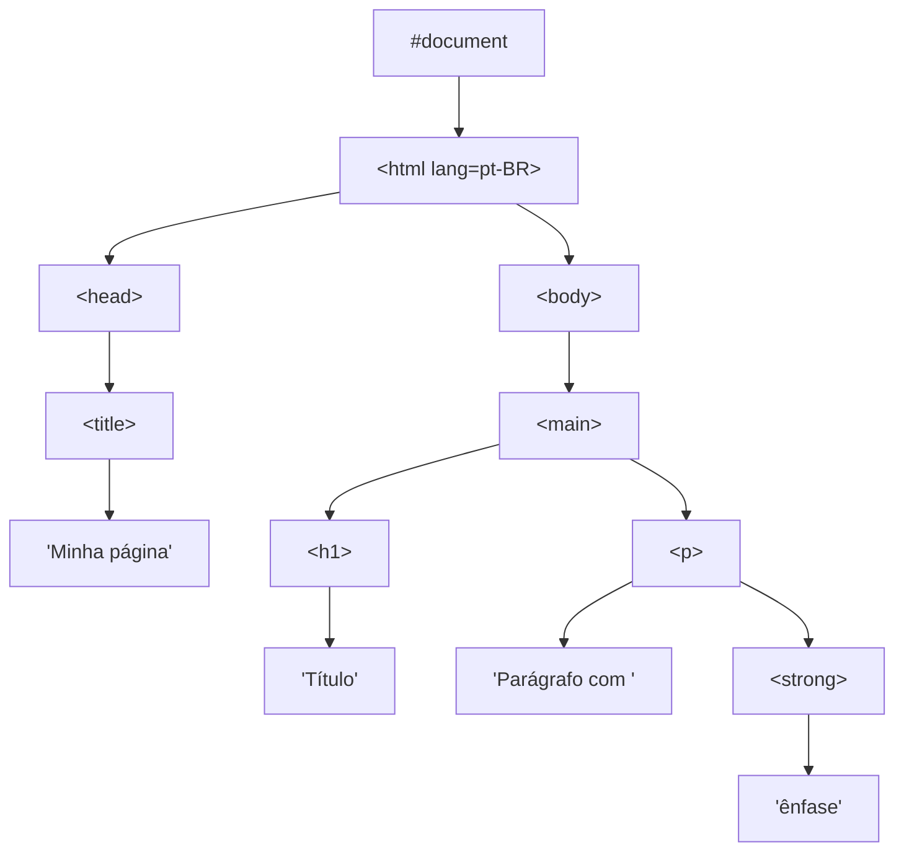
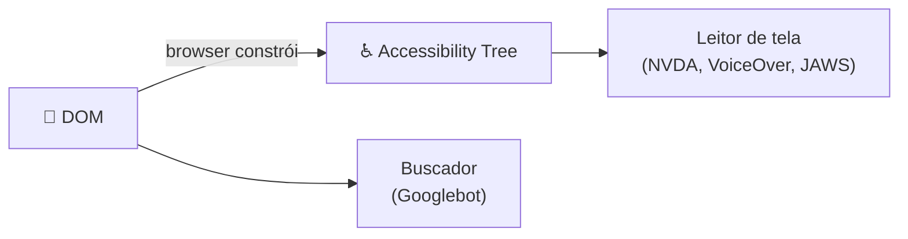
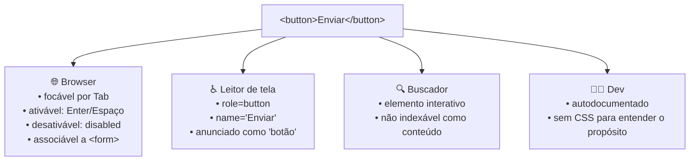
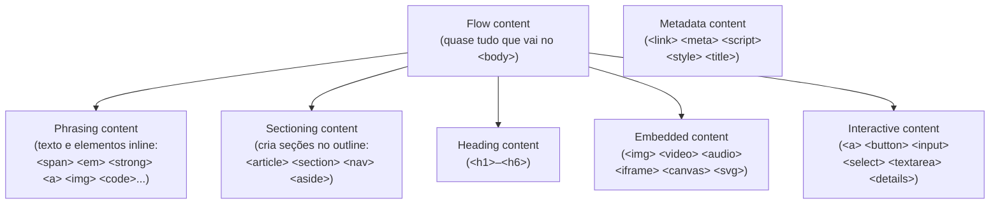
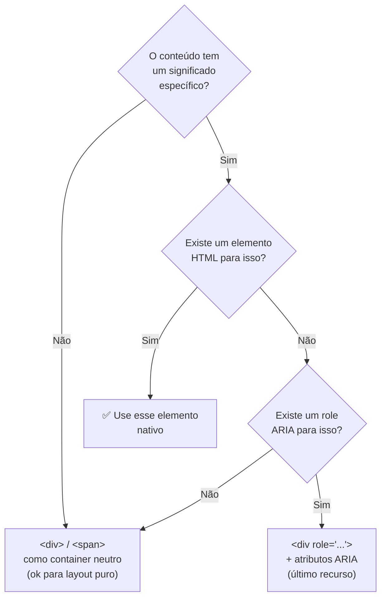
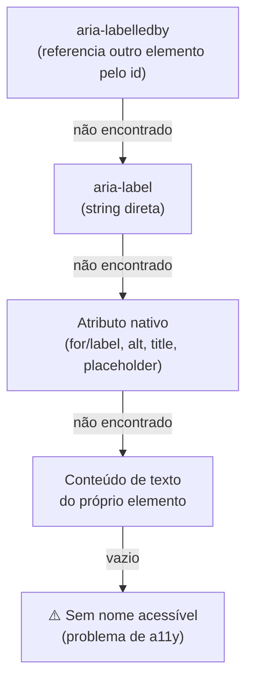

# O modelo mental do HTML: semântica, árvore e o browser

> [!abstract] TL;DR
> HTML é uma linguagem de **marcação de significado**, não de aparência. O browser transforma texto em uma árvore de nós (o DOM), constrói paralelamente uma **árvore de acessibilidade**, e cada elemento que você escolhe carrega um contrato semântico — de a11y, SEO e comportamento — antes de uma linha de CSS ou JS existir. Usar `<div>` quando existe um elemento mais específico é abrir mão desse contrato de graça.

---

## Por que começar pelo modelo mental?

Você já viu código assim?

```html
<div class="header">
  <div class="nav">
    <div class="nav-item" onclick="go('/')">Home</div>
  </div>
</div>
<div class="content">
  <div class="article">
    <div class="title">Meu post</div>
  </div>
</div>
```

Funciona. Aparece certo no browser. Mas é como construir uma casa inteira com tijolos genéricos e escrever "PORTA" na parede com caneta permanente. Do lado de fora parece uma porta. Para um cego, um robô de busca ou uma pessoa navegando só com teclado — é uma parede.

HTML não é sobre fazer as coisas aparecerem. É sobre **dizer o que as coisas são**.

---

## O que é HTML, de verdade

**HTML (HyperText Markup Language)** é uma linguagem de marcação — você *anota* o conteúdo com tags que comunicam seu significado. Não é uma linguagem de programação (não tem lógica, loops ou variáveis). É um contrato declarativo entre você, o browser e qualquer coisa que leia seu documento.

As três camadas da web têm responsabilidades distintas:



A separação não é estética. Ela garante que:
- Um leitor de tela navegue sem CSS
- Um bot de busca entenda hierarquia sem executar JS
- Um usuário de teclado interaja sem mouse

Quando você quebra essa separação — estilo inline, markup com lógica — você acopla as três camadas e perde as garantias de cada uma.

---

## Como o browser transforma texto em árvore

Quando o browser recebe um arquivo HTML (ou um stream de bytes vindo da rede), ele executa um pipeline de transformação antes de renderizar qualquer pixel:



**Tokenização** converte a sequência de caracteres em unidades discretas: uma `<StartTag>` com seus atributos, uma `<EndTag>`, um trecho de `Character` data, etc.

**Tree construction** usa uma pilha de elementos abertos para montar a árvore: quando encontra `<article>`, empilha; quando encontra `</article>`, desempilha e fecha o nó.

O resultado — o **DOM (Document Object Model)** — é uma árvore de objetos em memória. Uma representação simplificada:



> [!info] DOM ≠ HTML
> O DOM é a representação **viva** em memória, não o arquivo HTML. O browser pode modificar o DOM: adiciona `<tbody>` implícito em tabelas sem ele, fecha tags não fechadas, move elementos para o lugar "certo" conforme a spec. O que você inspeciona no DevTools é o DOM, não o HTML original.

---

## A árvore de acessibilidade: o DOM que os leitores de tela enxergam

Existe uma segunda árvore, construída em paralelo ao DOM, que a maioria dos devs ignora: a **árvore de acessibilidade (accessibility tree)**.



A árvore de acessibilidade é uma versão simplificada do DOM onde cada nó tem:
- **Role** — o que o elemento *é* (button, link, heading, navigation...)
- **Name** — como ele é anunciado ("Enviar", "Menu principal"...)
- **State** — condição atual (expanded, checked, disabled...)
- **Properties** — metadados (nível do heading, posição em lista...)

É aqui que a semântica vira acessibilidade concreta. Quando você escreve `<button>Enviar</button>`, a árvore de acessibilidade ganha um nó com `role=button`, `name="Enviar"`. Um leitor de tela anuncia: *"Enviar, botão"*. Quando você escreve `<div class="btn">Enviar</div>`, a árvore de acessibilidade ganha um nó com `role=generic` e texto "Enviar" — sem indicação de que é interativo.

Você pode inspecionar a árvore de acessibilidade no DevTools do Chrome (aba Accessibility) ou Firefox (Accessibility Inspector).

---

## O algoritmo de parsing é permissivo por design

O HTML5 define um algoritmo de parsing **error-recovery determinístico**. Isso significa que HTML inválido não falha — o browser corrige e continua. Dois browsers diferentes processando o mesmo HTML inválido produzem o mesmo DOM.

Exemplos do que o browser corrige silenciosamente:

```html
<!-- Sem DOCTYPE -->
html sem doctype aqui

<!-- Tags não fechadas -->
<p>Parágrafo sem fechar
<p>Segundo parágrafo

<!-- Aninhamento proibido -->
<p>
  <div>Isso é inválido mas o browser move o div pra fora</div>
</p>

<!-- table sem tbody -->
<table>
  <tr><td>célula</td></tr>
</table>
<!-- browser insere <tbody> automaticamente -->
```

> [!warning] HTML válido ≠ HTML semântico
> Você pode ter HTML perfeitamente válido (passa no validador W3C) mas completamente a-semântico — como o exemplo com `<div>` para tudo. Validade é necessária mas não suficiente. Semântica é o objetivo real.

A consequência prática: nunca confie no "mas funciona no browser" como prova de que está certo. O browser está sendo gentil. Use `validator.w3.org` para checar erros reais.

---

## Semântica: o contrato embutido em cada elemento

Cada elemento HTML carrega significado implícito consumido por múltiplos agentes:



Compare a diferença para replicar esse comportamento num `<div>`:

```html
<!-- O que <button> dá de graça -->
<button type="submit">Enviar</button>

<!-- O que você precisa escrever para replicar num <div> -->
<div
  role="button"
  tabindex="0"
  aria-label="Enviar"
  onkeydown="if(e.key==='Enter'||e.key===' ')submit()"
  onclick="submit()"
  class="btn"
>
  Enviar
</div>
<!-- E ainda vai esquecer: disabled, form association,
     :focus-visible, submit em forms, right-click menu... -->
```

Esse padrão se repete em todos os elementos nativos. `<a href>` gerencia histórico e target. `<input type="email">` abre teclado de email em mobile e valida formato. `<details>` implementa accordion sem JS. Cada elemento é uma funcionalidade que você não precisa implementar.

> [!tip] A regra de ouro
> Antes de usar `<div>` ou `<span>`, pergunte: *existe um elemento HTML que já descreve isso?* Se sim, use-o. `<div>` e `<span>` são containers neutros — elementos de **último recurso**, não de primeiro.

---

## O custo da div-ite

"Div-ite" é o hábito de usar `<div>` para tudo. Os custos são mensuráveis:

| Consequência | Por quê acontece |
|---|---|
| **Inacessível** | Sem roles semânticas, leitores de tela não identificam landmarks nem elementos interativos |
| **SEO fraco** | Buscadores inferem relevância de `<h1>`, `<article>`, `<nav>` — não de classes CSS |
| **CSS frágil** | Seletores viram `.header .nav .item .link` — acoplados à estrutura visual, não ao significado |
| **JS verboso** | Você reimplementa comportamento que elementos nativos já têm (foco, teclado, estados) |
| **Manutenção cara** | Outro dev (ou você em 6 meses) precisa ler CSS para entender o que cada `<div>` representa |
| **Performance** | Custom widgets JS são maiores e mais lentos que elementos nativos do browser |

---

## Categorias de conteúdo: nem todo elemento vai em qualquer lugar

O HTML5 aboliu a distinção binária "block vs inline" do HTML4. Essa distinção ainda existe no CSS (é CSS `display` que define block vs inline), mas o HTML usa um sistema mais rico de **categorias de conteúdo**.



As categorias determinam onde um elemento pode aparecer e o que pode conter. Aninhamentos inválidos clássicos:

```html
<!-- ❌ <p> é phrasing content — não pode conter <div> (flow) -->
<p>
  Texto
  <div>Isso quebra o modelo de conteúdo</div>
</p>
<!-- O browser move o <div> pra fora do <p> silenciosamente -->

<!-- ❌ <a> é interactive — não pode conter outro interactive content -->
<a href="/x">
  <button>Clique</button>
</a>

<!-- ❌ <ul> só pode conter <li> diretamente -->
<ul>
  <div>Item errado</div>
</ul>

<!-- ✅ corretos -->
<p>Texto com <strong>ênfase</strong> e <a href="/x">link</a>.</p>
<button><span>Ícone</span> Texto do botão</button>
```

> [!note] Por que isso importa além da teoria?
> O browser corrije erros de aninhamento conforme a spec, mas o DOM resultante pode ser diferente do que você escreveu — e isso causa bugs CSS e JS difíceis de rastrear. Além disso, ferramentas como linters HTML, SSR frameworks e parsers de e-mail (que são muito mais rígidos) não fazem error recovery.

---

## Semântico vs presentacional: o mapa de decisão

Ao escrever markup, a pergunta não é "como isso vai parecer?" mas "o que isso **é**?":



Tabela de conversão rápida:

| Conteúdo | Errado | Certo |
|---|---|---|
| Botão que executa ação | `<div class="btn">` | `<button>` |
| Link de navegação | `<div onclick="go()">` | `<a href="...">` |
| Cabeçalho da página | `<div class="header">` | `<header>` |
| Navegação principal | `<div class="nav">` | `<nav>` |
| Conteúdo principal | `<div class="content">` | `<main>` |
| Artigo auto-contido | `<div class="post">` | `<article>` |
| Texto importante | `<div class="bold">` | `<strong>` |
| Data/hora | `<span class="date">26/06` | `<time datetime="2026-06-26">26/06</time>` |
| Campo de formulário | `<div contenteditable>` | `<input>` ou `<textarea>` |
| Listagem de itens | `<div class="list">` | `<ul>` / `<ol>` |

---

## O que acontece depois do DOM: eventos de ciclo de vida

O parsing do HTML dispara eventos que o JavaScript usa para saber quando é seguro agir sobre o DOM:

```mermaid
sequenceDiagram
    participant Browser
    participant DOM
    participant JS

    Browser->>DOM: Inicia parsing do HTML
    Browser->>DOM: Encontra &lt;script defer&gt;
    Note over Browser: Download do script em paralelo
    Browser->>DOM: Constrói DOM completo
    DOM-->>JS: DOMContentLoaded 🔔
    Note over JS: Scripts defer executam aqui
    Browser->>Browser: Carrega imagens, CSS externo, fontes
    Browser-->>JS: load 🔔
    Note over JS: Página 100% carregada
```

Por que isso importa:
- **`DOMContentLoaded`** — DOM pronto, mas imagens e CSS externo podem ainda não ter carregado. Momento certo para manipulação de DOM que não depende de mídia.
- **`load`** — tudo carregado, incluindo imagens. Bom para medir tamanhos reais (`getBoundingClientRect`).
- **`<script defer>`** vs **`<script async>`** vs **`<script type="module">`** — cada um interfere diferente no parsing. Coberto em profundidade na nota 10 (Performance).

A posição do `<script>` no HTML determina quando ele bloqueia o parser. Um `<script>` no `<head>` sem `defer`/`async` para o parsing inteiro até terminar de executar — daí a velha convenção de colocar scripts antes de `</body>`.

---

## HTML4, XHTML e HTML5: por que a spec é assim

Para entender algumas decisões do HTML5, ajuda saber de onde viemos:

| Era | Característica marcante | Problema |
|-----|------------------------|----------|
| **HTML 4.01** (1999) | Tags de apresentação (`<font>`, `<center>`, `<b>`), parsing permissivo | Mistura estrutura e apresentação |
| **XHTML 1.0** (2000) | HTML com sintaxe XML estrita (tags fechadas, lowercase, `xml:lang`) | Um erro de sintaxe quebrava a página inteira; browsers nunca serviram como `application/xhtml+xml` de verdade |
| **HTML5** (2014/living standard) | Parser error-recovery determinístico, APIs (Canvas, Video, localStorage), elementos semânticos, `<!DOCTYPE html>` simples | — |

O HTML5 aprendeu com o fracasso do XHTML: rigor absoluto na web não funciona porque quebra sites legados e usuários pagam o preço. Por isso o parser HTML5 tem error-recovery — mas a spec define *exatamente* como o browser deve corrigir cada erro, garantindo interoperabilidade.

O `<!DOCTYPE html>` do HTML5 é intencionalmente mínimo. A versão antiga era:
```html
<!DOCTYPE HTML PUBLIC "-//W3C//DTD HTML 4.01 Transitional//EN"
  "http://www.w3.org/TR/html4/loose.dtd">
```

O HTML5 aboliu a referência ao DTD porque o parser não é mais baseado em SGML. `<!DOCTYPE html>` serve apenas para dizer ao browser "use modo padrão, não modo quirks".

> [!info] Living Standard
> Desde 2019, HTML5 é oficialmente o **HTML Living Standard**, mantido pelo WHATWG (não mais pelo W3C). Não há mais versões numeradas — é um documento vivo. A referência canônica é `html.spec.whatwg.org`.

---

## O nome "acessível": como o browser calcula

A árvore de acessibilidade precisa de um **nome acessível** para cada nó — é o que o leitor de tela anuncia. O browser aplica o **Accessible Name and Description Computation** (ACCNAME spec) na seguinte ordem de prioridade:



Exemplos concretos:

```html
<!-- Nome: "Fechar" (aria-label tem prioridade sobre conteúdo) -->
<button aria-label="Fechar">×</button>

<!-- Nome: "Nome completo" (via <label for>) -->
<label for="name">Nome completo</label>
<input id="name" type="text">

<!-- ⚠️ Sem nome — leitor de tela anuncia "botão" sem contexto -->
<button><svg>...</svg></button>

<!-- Nome: "Logo da empresa" (alt da imagem) -->


<!-- Nome vazio intencional — imagem decorativa, ignorada pelo leitor de tela -->

```

Entender essa hierarquia explica por que `aria-label` substitui o conteúdo de texto (perigoso se você colocar um label diferente do que está visível) e por que `aria-labelledby` é preferível quando você pode apontar para texto já existente na UI.

---

## HTML e o que vem depois

Este modelo mental — HTML como contrato de significado, DOM como árvore de nós, árvore de acessibilidade paralela — é a fundação de tudo que vem a seguir:

- **Nota 02** usa esses conceitos para entender *por que* `<header>` existe separado de `<div class="header">`, e como a hierarquia de headings cria o outline do documento
- **Notas 07–08** (WCAG e ARIA) partem do fato de que semântica correta *é* acessibilidade gratuita — ARIA só entra onde HTML semântico não chega
- **Nota 09** (SEO) explica como os buscadores consomem exatamente essa árvore semântica para entender relevância e hierarquia
- **Nota 10** (Performance) parte do fato de que o browser constrói DOM e CSSOM em paralelo — e que scripts bloqueiam esse processo

E nas camadas vizinhas do stack:
- O [[03-Dominios/Tecnologia/CSS/index|CSS]] percorre a árvore DOM via seletores para aplicar estilos
- A [[03-Dominios/Tecnologia/Plataforma Web/index|Plataforma Web]] expõe o DOM como API JavaScript para manipulação programática
- O [[03-Dominios/Tecnologia/React/index|React]] compila JSX em chamadas que criam nós dessa mesma árvore (e mantém um Virtual DOM para reconciliação)

---

> [!question] Para fixar
> 1. Qual a diferença entre o arquivo HTML e o DOM que o browser constrói? Cite um caso onde eles diferem.
> 2. Por que `<button>` é preferível a `<div role="button" tabindex="0">` mesmo sendo ambos "acessíveis"?
> 3. Um `<p>` pode conter um `<div>`? O que o browser faz se você tentar?
> 4. `` pertence a qual categoria de conteúdo? E `<nav>`? Por que isso importa para o aninhamento?
> 5. O que a árvore de acessibilidade tem que o DOM não tem?

---

## Veja também

- [[03-Dominios/Tecnologia/HTML/02 - Landmark elements e documento estruturado|02 — Landmark elements e documento estruturado]] — próxima nota
- [[03-Dominios/Tecnologia/CSS/index|CSS]] — a camada de apresentação visual
- [[03-Dominios/Tecnologia/Plataforma Web/index|Plataforma Web]] — DOM programático e árvore de acessibilidade em JS
- [[03-Dominios/Tecnologia/JavaScript/index|JavaScript]] — comportamento e manipulação do DOM
- [[03-Dominios/Tecnologia/React/index|React]] — Virtual DOM e reconciliação
