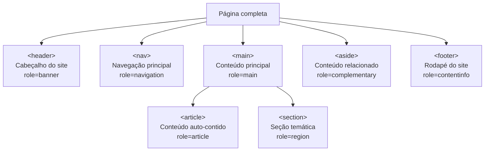
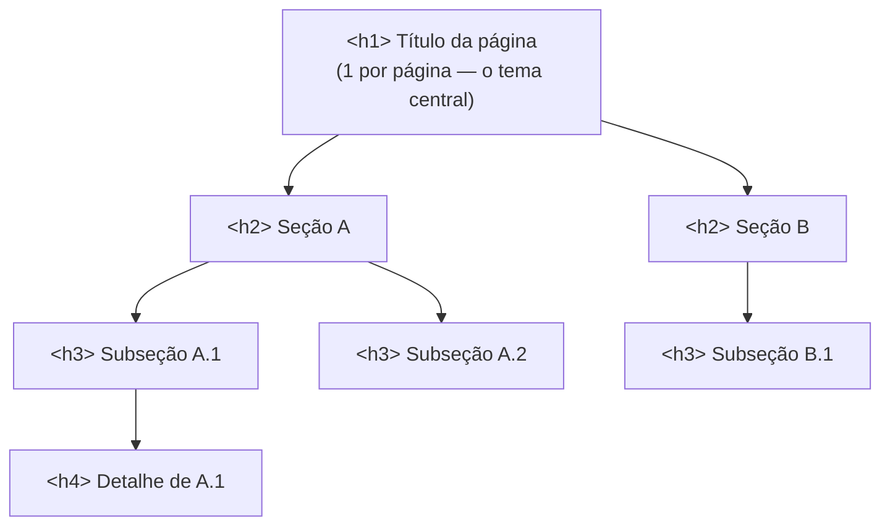

# Landmark elements e documento estruturado

> [!abstract] TL;DR
> Um documento HTML bem estruturado começa em `<!DOCTYPE html>` e constrói um mapa de regiões com **landmark elements** (`<header>`, `<nav>`, `<main>`, `<article>`, `<section>`, `<aside>`, `<footer>`). Cada landmark é uma seção navegável pelo teclado sem JS. A **hierarquia de headings** (`h1`→`h6`) cria o outline do documento — a tabela de conteúdos que leitores de tela e buscadores usam para entender estrutura e relevância.

---

## A estrutura mínima de um documento

Antes de qualquer conteúdo, um documento HTML precisa dessas cinco linhas:

```html
<!DOCTYPE html>
<html lang="pt-BR">
<head>
  <meta charset="UTF-8">
  <meta name="viewport" content="width=device-width, initial-scale=1.0">
  <title>Título da página</title>
</head>
<body>
  <!-- conteúdo aqui -->
</body>
</html>
```

Cada linha tem uma razão específica:

| Linha | O que faz | Se omitir |
|---|---|---|
| `<!DOCTYPE html>` | Ativa o modo padrão do browser | Browser entra em "quirks mode" — CSS se comporta diferente (box model do IE5) |
| `lang="pt-BR"` | Declara o idioma principal | Leitores de tela usam a pronúncia errada; Google pode penalizar relevância regional |
| `charset="UTF-8"` | Declara codificação de caracteres | Caracteres acentuados viram `ção` (mojibake) |
| `viewport` | Impede zoom-out em mobile | Página aparece miniaturizada em smartphones — CLS clássico do mobile |
| `<title>` | Nome da aba e resultado de busca | Aba mostra URL; Google usa URL como título no resultado de busca |

O `<html lang>` é especialmente importante: leitores de tela como NVDA e VoiceOver usam o `lang` para selecionar o mecanismo de síntese de voz correto. Uma página em português com `lang="en"` será pronunciada com sotaque americano — incompreensível para usuários com deficiência visual que dependem de síntese de fala.

> [!tip] lang no nível de elemento
> Se parte do conteúdo estiver em outro idioma, você pode anotar: `<blockquote lang="en">`. O leitor de tela muda a pronúncia só para aquele trecho.

---

## O que são landmark elements

**Landmark elements** são elementos HTML5 que definem regiões de interesse em uma página — como capítulos em um livro. Eles têm dois papéis simultâneos:

1. **Semântico** — comunicam a finalidade da região para browsers, buscadores e ferramentas de acessibilidade
2. **Navegacional** — leitores de tela permitem navegar diretamente entre landmarks (tecla `D` no NVDA, `W` no JAWS)



A regra de ouro: **uma página deveria fazer sentido como uma lista de landmarks**. Se alguém viu só `header > nav, main > article, footer`, deveria entender o mapa da página.

---

## Cada landmark em detalhe

### `<header>` — cabeçalho

`<header>` representa conteúdo introdutório — logo, título, navegação de topo, mecanismo de busca. **Pode aparecer múltiplas vezes**: como cabeçalho do site (dentro de `<body>`, vira `role=banner`) ou como cabeçalho de um `<article>` ou `<section>` (vira `role=generic`, não é landmark).

```html
<!-- header do site — role=banner (landmark) -->
<body>
  <header>
    <a href="/" aria-label="Ir para a home"></a>
    <nav aria-label="Principal">...</nav>
  </header>
</body>

<!-- header de artigo — NÃO é landmark -->
<article>
  <header>
    <h2>Título do artigo</h2>
    <time datetime="2026-06-27">27 de junho de 2026</time>
    <address><a href="/autor/joao">João Silva</a></address>
  </header>
  ...
</article>
```

### `<nav>` — navegação

`<nav>` marca **blocos de navegação** — links para outras páginas ou seções da mesma página. Não todo grupo de links precisa de `<nav>`; use para navegação *principal*, *secundária*, *breadcrumbs* e paginação.

```html
<!-- Múltiplos <nav> na mesma página: diferenciar com aria-label -->
<nav aria-label="Principal">
  <ul>
    <li><a href="/">Home</a></li>
    <li><a href="/about">Sobre</a></li>
    <li><a href="/blog">Blog</a></li>
  </ul>
</nav>

<nav aria-label="Breadcrumb" aria-current="page">
  <ol>
    <li><a href="/">Home</a></li>
    <li><a href="/blog">Blog</a></li>
    <li>Artigo atual</li>
  </ol>
</nav>
```

> [!warning] Não use `<nav>` para todo grupo de links
> Rodapé com 20 links de política de privacidade, termos e sitemap não precisa de `<nav>`. Reserve `<nav>` para navegação *primária* — caso contrário você polui a lista de landmarks e prejudica quem navega por eles.

### `<main>` — conteúdo principal

`<main>` marca o conteúdo **único e central** da página — o que diferencia esta URL de todas as outras. Só deve haver **um `<main>` visível por página**.

```html
<body>
  <header>...</header>
  <nav>...</nav>

  <main>
    <!-- tudo que é específico desta página -->
    <h1>Título da página</h1>
    ...
  </main>

  <aside>...</aside>
  <footer>...</footer>
</body>
```

Em aplicações de página única (SPA) que mostram/escondem seções, use `hidden` para desativar o `<main>` não ativo em vez de ter múltiplos `<main>` visíveis.

### `<article>` — conteúdo auto-contido

`<article>` é para conteúdo que **faz sentido sozinho** — se você extraísse e publicasse em outro lugar, ainda faria sentido. Testes: post de blog? artigo de notícia? comentário? widget de previsão do tempo? produto em e-commerce? Todos são `<article>`.

```html
<main>
  <h1>Blog</h1>

  <article>
    <header>
      <h2><a href="/post/1">Primeiro post</a></h2>
      <time datetime="2026-06-20">20 de junho de 2026</time>
    </header>
    <p>Resumo do post...</p>
    <footer>
      <a href="/post/1">Leia mais</a>
    </footer>
  </article>

  <article>
    <header>
      <h2><a href="/post/2">Segundo post</a></h2>
      ...
    </header>
    ...
  </article>
</main>
```

`<article>` pode se aninhar: um artigo com seção de comentários onde cada comentário é um `<article>` dentro do `<article>` principal.

### `<section>` — seção temática

`<section>` agrupa conteúdo com um **tema comum** dentro de uma página ou artigo. A regra prática: **`<section>` sempre tem um heading** (`<h1>`–`<h6>`) como primeiro filho ou logo no início. Se não tem heading, provavelmente é um `<div>`.

```html
<article>
  <h2>Como fazer café</h2>

  <section>
    <h3>Ingredientes</h3>
    <ul>...</ul>
  </section>

  <section>
    <h3>Modo de preparo</h3>
    <ol>...</ol>
  </section>

  <section>
    <h3>Dicas avançadas</h3>
    <p>...</p>
  </section>
</article>
```

> [!info] `<section>` vs `<div>`
> - `<div>`: container de estilo puro, sem significado semântico. Use para agrupar elementos por razões visuais/CSS.
> - `<section>`: agrupamento temático com heading. Contribui para o outline do documento.
>
> Na dúvida: se você precisaria dar um título ao grupo, é `<section>`. Se é só para aplicar um `class` de CSS, é `<div>`.

### `<aside>` — conteúdo relacionado

`<aside>` marca conteúdo que é **relacionado mas secundário** ao conteúdo principal que o cerca. Sidebars, notas explicativas, publicidade, perfil do autor, artigos relacionados.

```html
<main>
  <article>
    <h1>Sobre café</h1>
    <p>O café é...</p>

    <aside>
      <h3>Sabia que?</h3>
      <p>O Brasil é o maior produtor mundial de café.</p>
    </aside>

    <p>Continua o artigo...</p>
  </article>
</main>

<!-- aside no nível da página: sidebar -->
<aside aria-label="Artigos relacionados">
  <h2>Veja também</h2>
  <ul>...</ul>
</aside>
```

### `<footer>` — rodapé

Como `<header>`, `<footer>` pode aparecer como rodapé do site (dentro de `<body>`, vira `role=contentinfo`) ou como rodapé de um `<article>`/`<section>` (sem role de landmark).

```html
<!-- footer do site — role=contentinfo (landmark) -->
<footer>
  <nav aria-label="Links institucionais">
    <ul>
      <li><a href="/privacy">Privacidade</a></li>
      <li><a href="/terms">Termos</a></li>
    </ul>
  </nav>
  <p><small>&copy; 2026 Empresa XYZ</small></p>
</footer>

<!-- footer de artigo — NÃO é landmark -->
<article>
  ...
  <footer>
    <p>Publicado por <a href="/autor/joao">João Silva</a></p>
    <p>Tags: <a href="/tag/html">HTML</a>, <a href="/tag/web">Web</a></p>
  </footer>
</article>
```

---

## A hierarquia de headings: o outline do documento

Os elementos `<h1>` a `<h6>` criam a **hierarquia de headings** — a estrutura de tópicos e subtópicos do documento. Pense neles como os capítulos e seções de um livro.



**Regras que importam:**

1. **Um `<h1>` por página** — o tema central da URL. Em frameworks como Next.js, onde o layout contém headings, coordene para o `<h1>` estar no conteúdo da página, não no layout compartilhado.
2. **Não pule níveis** — `h1 → h3` (sem h2) confunde leitores de tela e o outline do documento. Pode *voltar* (h3 → h2 após uma seção), mas não pule para frente.
3. **Hierarquia de estrutura, não de estilo** — se você quer um título visualmente pequeno, use CSS. Não use `<h4>` porque "fica menor" — isso quebra a estrutura.

```html
<!-- ❌ Errado: pulo de nível -->
<h1>Página</h1>
<h3>Subseção</h3> <!-- sem h2 antes -->

<!-- ❌ Errado: heading para estilo -->
<h4 class="small-title">Não quero heading grande aqui</h4>

<!-- ✅ Certo -->
<h1>Página</h1>
<h2>Seção</h2>
<h3>Subseção</h3>
<p class="caption-title">Título visual pequeno (não é heading estrutural)</p>
```

Por que a hierarquia importa além de a11y? Buscadores interpretam `<h1>` e `<h2>` como sinais de relevância. O texto em `<h1>` tem mais peso semântico do que o mesmo texto em `<p>`.

---

## Exemplo completo: página real com landmarks corretos

```html
<!DOCTYPE html>
<html lang="pt-BR">
<head>
  <meta charset="UTF-8">
  <meta name="viewport" content="width=device-width, initial-scale=1.0">
  <title>Blog de Tecnologia — MedEspecialista</title>
  <meta name="description" content="Artigos sobre desenvolvimento web moderno.">
</head>
<body>

  <a href="#main" class="skip-link">Pular para o conteúdo</a>

  <header>
    <a href="/" aria-label="Home — MedEspecialista">
      
    </a>
    <nav aria-label="Principal">
      <ul>
        <li><a href="/">Home</a></li>
        <li><a href="/blog" aria-current="page">Blog</a></li>
        <li><a href="/sobre">Sobre</a></li>
      </ul>
    </nav>
  </header>

  <main id="main">
    <h1>Blog de Tecnologia</h1>

    <section aria-labelledby="recentes-title">
      <h2 id="recentes-title">Artigos recentes</h2>

      <article>
        <header>
          <h3><a href="/post/html-semantico">HTML Semântico na prática</a></h3>
          <time datetime="2026-06-27">27 de junho de 2026</time>
        </header>
        <p>Por que usar os elementos certos importa para a11y e SEO...</p>
        <footer>
          <a href="/post/html-semantico">Leia o artigo</a>
        </footer>
      </article>

      <article>
        <header>
          <h3><a href="/post/css-grid">CSS Grid: o guia definitivo</a></h3>
          <time datetime="2026-06-20">20 de junho de 2026</time>
        </header>
        <p>Grid e Flexbox lado a lado — quando usar cada um...</p>
        <footer>
          <a href="/post/css-grid">Leia o artigo</a>
        </footer>
      </article>
    </section>
  </main>

  <aside aria-labelledby="sidebar-title">
    <h2 id="sidebar-title">Tags populares</h2>
    <ul>
      <li><a href="/tag/html">HTML</a></li>
      <li><a href="/tag/css">CSS</a></li>
    </ul>
  </aside>

  <footer>
    <nav aria-label="Links do rodapé">
      <ul>
        <li><a href="/privacidade">Privacidade</a></li>
        <li><a href="/termos">Termos de uso</a></li>
      </ul>
    </nav>
    <p><small>&copy; 2026 MedEspecialista. Todos os direitos reservados.</small></p>
  </footer>

</body>
</html>
```

Pontos a notar neste exemplo:
- **Skip link** (`Pular para o conteúdo`) — o primeiro link da página, visível ao foco do teclado, pula direto para `<main>`. Essencial para usuários de teclado que não querem tabular por toda a navegação em cada página.
- **`aria-current="page"`** — marca o link ativo na navegação para leitores de tela.
- **`aria-labelledby`** em `<section>` e `<aside>` — quando há múltiplos landmarks do mesmo tipo, labels os diferenciam.
- **Hierarquia h1→h2→h3** — preservada sem pulos.
- **`<time datetime>`** — a data legível para humanos + o formato ISO para máquinas.

---

## Mapa de landmarks e roles de acessibilidade

| Elemento | Role implícita | Condição |
|---|---|---|
| `<header>` (filho de `<body>`) | `banner` | Landmark |
| `<header>` (filho de `<article>`, `<section>`, etc.) | `generic` | Não é landmark |
| `<nav>` | `navigation` | Sempre landmark |
| `<main>` | `main` | Sempre landmark (só um visível) |
| `<article>` | `article` | — |
| `<section>` com accessible name | `region` | Landmark se tiver `aria-label` ou `aria-labelledby` |
| `<section>` sem accessible name | `generic` | Não é landmark |
| `<aside>` (filho de `<body>`) | `complementary` | Landmark |
| `<aside>` (aninhado) | `complementary` | Landmark (mas evitar aninhamento profundo) |
| `<footer>` (filho de `<body>`) | `contentinfo` | Landmark |
| `<footer>` (filho de `<article>`, etc.) | `generic` | Não é landmark |

---

> [!question] Para fixar
> 1. Por que `lang="pt-BR"` no `<html>` afeta a experiência de usuários cegos?
> 2. Uma página tem dois `<nav>`. Como você os diferencia para leitores de tela?
> 3. Qual é a diferença prática entre `<section>` e `<div>`? Quando cada um?
> 4. Um `<section>` sem heading tem qual role? E com heading?
> 5. Você tem `h1 → h3` no seu documento sem nenhum `h2`. O que está errado e como corrigir?

---

## Veja também

- [[03-Dominios/Tecnologia/HTML/01 - O modelo mental do HTML - semântica, árvore e o browser|01 — O modelo mental do HTML]] — anterior
- [[03-Dominios/Tecnologia/HTML/03 - Elementos de conteúdo - texto, listas e inline semântico|03 — Elementos de conteúdo: texto, listas e inline semântico]] — próxima
- [[03-Dominios/Tecnologia/HTML/07 - Acessibilidade I - fundamentos WCAG e navegação por teclado|07 — Acessibilidade I]] — headings e skip links em profundidade
- [[03-Dominios/Tecnologia/HTML/09 - SEO técnico e metadados|09 — SEO técnico]] — como `<title>` e `<meta>` são usados por buscadores
