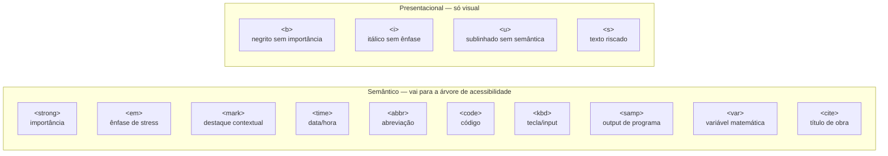

# Elementos de conteúdo: texto, listas e inline semântico

> [!abstract] TL;DR
> O conteúdo de um documento HTML vive em elementos de texto, listas, citações e elementos inline. A distinção entre **semântico** (`<strong>`, `<em>`, `<time>`) e **presentacional** (`<b>`, `<i>`) determina o que vai para a árvore de acessibilidade. Tabelas existem para dados relacionais — não para layout. Cada escolha de elemento é uma informação para leitores de tela, buscadores e desenvolvedores futuros.

---

## Parágrafos e quebras de linha

O `<p>` é o elemento de fluxo de texto mais básico — um bloco de texto que representa um parágrafo. Browsers inserem margem vertical entre parágrafos por padrão (controlável por CSS).

```html
<p>
  Este é um parágrafo. Texto corre continuamente até
  a quebra natural do fluxo.
</p>

<p>Este é o próximo parágrafo.</p>
```

O `<br>` (line break) força uma quebra de linha *dentro* de um bloco de texto — não cria novo parágrafo. Seu uso deve ser restrito a casos onde a quebra é semanticamente significativa:

```html
<!-- ✅ Casos válidos para <br> -->
<address>
  Rua das Flores, 123<br>
  Bairro Jardim<br>
  São Paulo, SP
</address>

<p>
  Duas estradas divergiram em uma floresta amarelada,<br>
  E eu tomei aquela menos percorrida.
</p>

<!-- ❌ Usar <br> para espaçamento vertical — use CSS margin/padding -->
<p>Primeiro parágrafo</p>
<br>
<br>
<p>Segundo parágrafo com espaço artificial</p>
```

> [!warning] `<br>` não é espaçamento
> `<br>` para criar espaço visual entre blocos é um cheiro de que você deveria usar CSS `margin` no elemento pai. `<br>` deve comunicar que a quebra de linha em si tem significado (endereço, poesia, letra de música).

---

## Listas: `<ul>`, `<ol>` e `<dl>`

HTML tem três tipos de lista, cada um para um caso de uso distinto.

### `<ul>` — lista não ordenada

Itens onde a **ordem não importa**. Browser renderiza com bullet (`•`) por padrão (controlável por CSS).

```html
<ul>
  <li>React</li>
  <li>Vue</li>
  <li>Svelte</li>
</ul>
```

### `<ol>` — lista ordenada

Itens onde a **sequência tem significado**. Browser numera automaticamente. Atributos úteis:

```html
<!-- start: começa do número que você quiser -->
<ol start="3">
  <li>Terceiro passo</li>
  <li>Quarto passo</li>
</ol>

<!-- reversed: contagem decrescente -->
<ol reversed>
  <li>Campeão</li>
  <li>Vice-campeão</li>
  <li>Terceiro lugar</li>
</ol>

<!-- type: estilo de marcador (i, I, a, A) -->
<ol type="a">
  <li>Alternativa A</li>
  <li>Alternativa B</li>
</ol>
```

> [!tip] `<ol>` ou `<ul>`?
> Teste: se você reordenar os itens e o significado mudar, é `<ol>` (passos de uma receita, ranking). Se a ordem é arbitrária, é `<ul>` (lista de ingredientes, menu de navegação).

### `<dl>` — lista de definição

Pares **termo/descrição**. Frequentemente subutilizada, mas ideal para glossários, metadados de artigos, FAQs, dicionários de dados.

```html
<!-- Glossário -->
<dl>
  <dt>DOM</dt>
  <dd>Document Object Model — representação em árvore do documento HTML em memória.</dd>

  <dt>ARIA</dt>
  <dd>Accessible Rich Internet Applications — especificação de atributos para acessibilidade.</dd>
</dl>

<!-- Metadados de artigo -->
<dl>
  <dt>Publicado em</dt>
  <dd><time datetime="2026-06-27">27 de junho de 2026</time></dd>

  <dt>Categoria</dt>
  <dd><a href="/cat/frontend">Frontend</a></dd>

  <dt>Tempo de leitura</dt>
  <dd>8 minutos</dd>
</dl>

<!-- Um dt pode ter múltiplos dd -->
<dl>
  <dt>Sinônimos de "grande"</dt>
  <dd>enorme</dd>
  <dd>gigantesco</dd>
  <dd>vasto</dd>
</dl>
```

**Regras de aninhamento em listas:**
- `<ul>` e `<ol>` só podem ter `<li>` como filhos diretos
- `<li>` pode conter qualquer flow content (incluindo outra lista aninhada)
- `<dl>` só pode ter `<dt>`, `<dd>` e `<div>` como filhos diretos

```html
<!-- Lista aninhada — correto -->
<ul>
  <li>
    Frontend
    <ul>
      <li>HTML</li>
      <li>CSS</li>
    </ul>
  </li>
  <li>Backend</li>
</ul>

<!-- ❌ Errado — <p> diretamente em <ul> -->
<ul>
  <p>Isso é inválido</p>
</ul>
```

---

## Citações e referências

### `<blockquote>` e `<cite>`

```html
<!-- blockquote para citação longa -->
<blockquote cite="https://www.w3.org/TR/html52/">
  <p>
    A missão do HTML é ser a linguagem de publicação da World Wide Web.
  </p>
</blockquote>

<!-- cite para o título da obra (não o autor!) -->
<p>
  A ideia foi desenvolvida no livro
  <cite>The Design of Everyday Things</cite>
  de Don Norman.
</p>

<!-- Combinando: citação com fonte -->
<figure>
  <blockquote>
    <p>
      Não bastam boas intenções — é preciso o design certo.
    </p>
  </blockquote>
  <figcaption>
    — Don Norman, <cite>The Design of Everyday Things</cite>
  </figcaption>
</figure>
```

> [!info] `<cite>` é para títulos, não para autores
> `<cite>` marca o título de uma obra (livro, artigo, filme, música). Para o nome do autor, use `<span>` ou nenhum elemento especial. Esta é uma confusão comum.

### `<q>` — citação curta inline

Para citações curtas dentro de um parágrafo, `<q>` adiciona automaticamente as aspas (controlável por CSS com `quotes`):

```html
<p>
  Como disse Alan Turing: <q>Machines take me by surprise with great frequency.</q>
</p>
<!-- Renderiza: ...Turing: "Machines take me by surprise with great frequency." -->
```

---

## `<figure>` e `<figcaption>`

`<figure>` encapsula conteúdo auto-contido com legenda opcional — imagem, diagrama, bloco de código, vídeo, citação. A legenda vai em `<figcaption>`.

```html
<!-- Imagem com legenda -->
<figure>
  
  <figcaption>Figura 1: Estrutura de árvore do DOM para um documento com header, main e footer.</figcaption>
</figure>

<!-- Bloco de código com legenda -->
<figure>
  <pre><code class="language-html">
&lt;button type="submit"&gt;Enviar&lt;/button&gt;
  </code></pre>
  <figcaption>Exemplo de botão semântico em HTML.</figcaption>
</figure>

<!-- Citação com fonte -->
<figure>
  <blockquote>
    <p>Any application that can be written in JavaScript, will eventually be written in JavaScript.</p>
  </blockquote>
  <figcaption>— Jeff Atwood, <cite>The Principle of Least Power</cite> (2007)</figcaption>
</figure>
```

`<figure>` é movível — pode aparecer no meio do texto, no final da página, em uma barra lateral — sem perder o sentido. Essa autonomia é o que o diferencia de um `<div>` com imagem.

---

## Elementos inline semânticos

A diferença entre **semântico** (comunica significado) e **presentacional** (comunica aparência):



### Semânticos — cobertura completa

**`<strong>`** — importância, seriedade ou urgência. Leitores de tela podem enfatizar a voz.
```html
<p><strong>Atenção:</strong> este formulário não pode ser desfeito.</p>
```

**`<em>`** — ênfase de stress que muda o significado da frase.
```html
<p>Eu <em>nunca</em> disse que ela roubou o dinheiro.</p>
<!-- vs: Eu nunca disse que <em>ela</em> roubou o dinheiro. -->
<!-- (a ênfase muda o sentido completamente) -->
```

**`<mark>`** — destaque contextual, como marcador amarelo de texto. Relevante no contexto atual (resultado de busca, trecho referenciado).
```html
<p>
  Resultado da busca por "semântico":
  O HTML <mark>semântico</mark> melhora acessibilidade e SEO.
</p>
```

**`<time>`** — data e/ou hora. O atributo `datetime` fornece o formato legível por máquina.
```html
<time datetime="2026-06-27">27 de junho de 2026</time>
<time datetime="2026-06-27T14:30">27 de junho às 14h30</time>
<time datetime="PT2H30M">2 horas e 30 minutos</time>
<time datetime="2026-W26">Semana 26 de 2026</time>
```

**`<abbr>`** — abreviação ou acrônimo. `title` fornece a expansão (tooltip no hover, anunciada por leitores de tela).
```html
<p>
  O <abbr title="Document Object Model">DOM</abbr> é construído pelo browser
  durante o parsing do <abbr title="HyperText Markup Language">HTML</abbr>.
</p>
```

**`<code>`** — código inline. Para blocos, use dentro de `<pre>`.
```html
<p>Use <code>querySelector()</code> para selecionar elementos do DOM.</p>

<pre><code>
const button = document.querySelector('button[type="submit"]');
button.addEventListener('click', handleSubmit);
</code></pre>
```

**`<kbd>`** — input de teclado ou tecla.
```html
<p>Pressione <kbd>Ctrl</kbd>+<kbd>C</kbd> para copiar.</p>
<p>Digite <kbd>:wq</kbd> para salvar e sair do Vim.</p>
```

**`<samp>`** — saída de um programa ou sistema.
```html
<p>O terminal exibiu: <samp>Error: Cannot find module 'express'</samp></p>
```

**`<var>`** — variável em expressão matemática ou de programação.
```html
<p>A equação é <var>E</var> = <var>m</var><var>c</var>².</p>
<p>O loop usa a variável <var>i</var> como índice.</p>
```

**`<address>`** — informações de contato do autor ou organização. Geralmente dentro de `<footer>`.
```html
<address>
  Escrito por <a href="/autor/joao">João Silva</a>.<br>
  Contato: <a href="mailto:joao@exemplo.com">joao@exemplo.com</a>
</address>
```

### Presentacionais — quando (e só quando) usar

**`<b>`** — negrito sem importância semântica (nome de produto, palavra-chave em resumo).
```html
<!-- Palavras-chave em revisão sem ênfase especial -->
<p>Este artigo aborda <b>HTML semântico</b>, <b>acessibilidade</b> e <b>SEO</b>.</p>
```

**`<i>`** — itálico sem ênfase (termo técnico, nome científico, pensamento, voz alternativa).
```html
<p>O método é chamado de <i>progressive enhancement</i>.</p>
<p>A espécie <i>Homo sapiens</i> surgiu há cerca de 300 mil anos.</p>
```

**`<u>`** — sublinhado sem link (ortografia, nome próprio em chinês). Raro — sublinhado remete a link para usuários.
```html
<p>Verifique a grafia: <u>acessibilidade</u>.</p>
```

**`<s>`** — texto que não é mais preciso/relevante (preço riscado, item removido).
```html
<p>De <s>R$ 199,00</s> por R$ 99,00.</p>
```

---

## Tabelas: dados relacionais, nunca layout

`<table>` existe para dados **tabulares** — informações com relacionamento de linhas e colunas. **Nunca use tabelas para layout de página** (isso era prática do HTML4, é inacessível e frágil).

### Estrutura semântica de uma tabela acessível

```html
<table>
  <caption>Comparação de frameworks JavaScript em 2026</caption>

  <thead>
    <tr>
      <th scope="col">Framework</th>
      <th scope="col">Downloads/semana</th>
      <th scope="col">Tamanho (gzip)</th>
      <th scope="col">Licença</th>
    </tr>
  </thead>

  <tbody>
    <tr>
      <th scope="row">React</th>
      <td>25 milhões</td>
      <td>42 KB</td>
      <td>MIT</td>
    </tr>
    <tr>
      <th scope="row">Vue</th>
      <td>5 milhões</td>
      <td>33 KB</td>
      <td>MIT</td>
    </tr>
  </tbody>

  <tfoot>
    <tr>
      <td colspan="4">Fonte: npm stats, junho 2026</td>
    </tr>
  </tfoot>
</table>
```

**Por que cada elemento:**
- **`<caption>`** — título da tabela, lido pelo leitor de tela antes das células. Equivalente ao `alt` da imagem.
- **`<thead>`** / **`<tbody>`** / **`<tfoot>`** — semântica estrutural que permite leitores de tela anunciar o cabeçalho em cada linha em tabelas longas.
- **`<th>`** — célula de cabeçalho. O atributo `scope="col"` indica que encabeça uma coluna; `scope="row"` indica que encabeça uma linha.
- **`scope`** — essencial para acessibilidade: diz ao leitor de tela qual `<th>` corresponde a qual `<td>`.

> [!warning] Tabelas para layout quebram leitores de tela
> Leitores de tela leem tabelas célula por célula, anunciando posição (linha 2, coluna 3). Um layout de página com tabela transforma a experiência numa sequência aleatória de fragmentos.

---

> [!question] Para fixar
> 1. Qual a diferença semântica entre `<strong>` e `<b>`? E entre `<em>` e `<i>`?
> 2. Quando usar `<ul>` vs `<ol>`? Dê dois exemplos de cada.
> 3. O que o atributo `datetime` em `<time>` fornece que o conteúdo de texto não fornece?
> 4. `<dl>` / `<dt>` / `<dd>` — para que servem? Dê um exemplo além de glossário.
> 5. Por que tabelas não devem ser usadas para layout? O que acontece com leitores de tela?

---

## Veja também

- [[03-Dominios/Tecnologia/HTML/02 - Landmark elements e documento estruturado|02 — Landmark elements e documento estruturado]] — anterior
- [[03-Dominios/Tecnologia/HTML/04 - Links, imagens e mídia|04 — Links, imagens e mídia]] — próxima
- [[03-Dominios/Tecnologia/HTML/07 - Acessibilidade I - fundamentos WCAG e navegação por teclado|07 — Acessibilidade I]] — `<abbr>`, `<time>` e outros em contexto de a11y
- [[03-Dominios/Tecnologia/CSS/index|CSS]] — controle visual de listas, tabelas e tipografia
