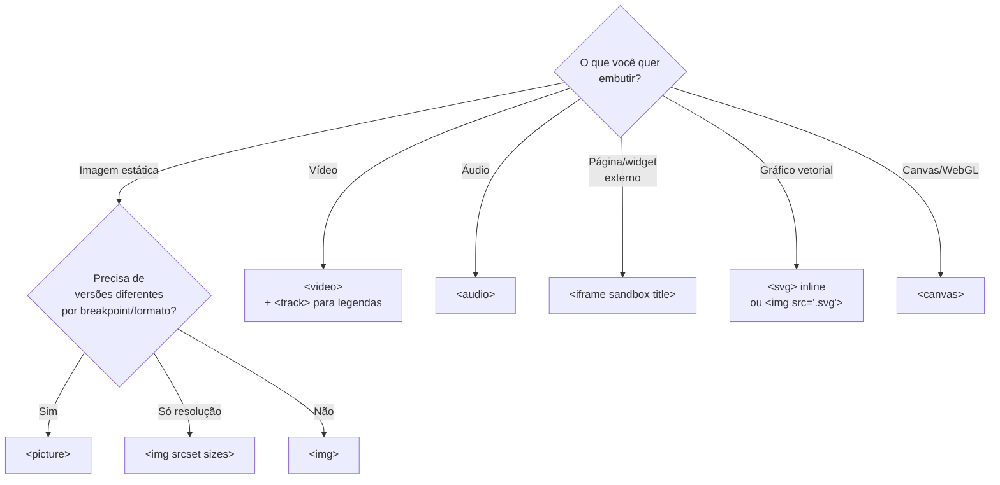

# Links, imagens e mídia

> [!abstract] TL;DR
> Links (`<a>`), imagens (``) e mídia (`<video>`, `<audio>`, `<iframe>`) são os elementos que conectam e enriquecem documentos HTML. Cada um carrega decisões de **segurança** (`rel="noopener noreferrer"`), **acessibilidade** (`alt`, `title`, legendas) e **performance** (`loading="lazy"`, `width`/`height`, `srcset`). A maioria dos bugs nessa área vem de atributos esquecidos — não de código errado.

---

## `<a>` — o elemento de link

O elemento âncora `<a>` cria hiperlinks — a essência do HyperText. Quando tem `href`, é um link. Sem `href`, é um placeholder (sem comportamento de link, mas com outros atributos como `name` em contextos legados).

### `href`: tipos de URL

```html
<!-- URL absoluta — para sites externos -->
<a href="https://developer.mozilla.org">MDN Web Docs</a>

<!-- URL relativa — para páginas do mesmo site -->
<a href="/sobre">Sobre nós</a>
<a href="../artigos/html">Artigo sobre HTML</a>
<a href="contato">Contato</a>   <!-- relativo ao diretório atual -->

<!-- Âncora — link para seção na mesma página -->
<a href="#introducao">Ir para introdução</a>
<h2 id="introducao">Introdução</h2>

<!-- Âncora em outra página -->
<a href="/guia#instalacao">Guia de instalação</a>

<!-- mailto — abre cliente de e-mail -->
<a href="mailto:contato@exemplo.com">Envie um e-mail</a>
<a href="mailto:contato@exemplo.com?subject=Dúvida&body=Olá">E-mail com subject</a>

<!-- tel — discagem em mobile -->
<a href="tel:+5511999999999">(11) 99999-9999</a>

<!-- Download de arquivo -->
<a href="/relatorio-2026.pdf" download>Baixar relatório (PDF)</a>
<a href="/foto.jpg" download="minha-foto.jpg">Baixar com nome específico</a>
```

### `target` e segurança

`target="_blank"` abre o link em nova aba. O problema: por padrão, a nova aba pode acessar `window.opener` da página de origem — vetor de ataque de tab-napping (a página de destino redireciona a aba de origem para um phishing).

```html
<!-- ❌ Inseguro — target="_blank" sem rel -->
<a href="https://site-externo.com" target="_blank">Site externo</a>

<!-- ✅ Seguro — rel obrigatório com _blank -->
<a href="https://site-externo.com" target="_blank" rel="noopener noreferrer">
  Site externo
</a>
```

- **`noopener`** — a nova aba não tem acesso a `window.opener`. Impede tab-napping.
- **`noreferrer`** — inclui `noopener` + não envia o header `Referer` para o destino. Privacidade adicional.

> [!tip] Regra prática
> Toda vez que você usar `target="_blank"`, adicione `rel="noopener noreferrer"` imediatamente. Alguns linters HTML (e ferramentas de a11y) apontam esse problema automaticamente.

### Links e acessibilidade

O texto do link deve fazer sentido **fora de contexto** — leitores de tela oferecem a opção de listar todos os links da página.

```html
<!-- ❌ Texto de link sem contexto -->
<p>Para saber mais sobre HTML semântico, <a href="/html">clique aqui</a>.</p>
<p>Acesse o guia <a href="/guia">aqui</a>.</p>

<!-- ✅ Texto descritivo -->
<p>Saiba mais em <a href="/html">nosso guia de HTML semântico</a>.</p>
<p><a href="/guia">Guia completo de acessibilidade</a></p>
```

Para ícones ou imagens como link, use `aria-label`:

```html
<!-- Link com ícone apenas — precisa de aria-label -->
<a href="https://github.com/joao" aria-label="Perfil no GitHub" target="_blank" rel="noopener noreferrer">
  <svg aria-hidden="true"><!-- ícone do GitHub --></svg>
</a>

<!-- Logo como link para home -->
<a href="/" aria-label="Ir para a página inicial">
  
</a>
```

### `aria-current` — link ativo na navegação

```html
<nav aria-label="Principal">
  <ul>
    <li><a href="/">Home</a></li>
    <li><a href="/blog" aria-current="page">Blog</a></li>  <!-- página atual -->
    <li><a href="/sobre">Sobre</a></li>
  </ul>
</nav>
```

---

## `` — imagens

### O atributo `alt`: a regra mais importante

O `alt` descreve o conteúdo da imagem para quem não a vê — usuário de leitor de tela, imagem quebrada, bot de busca, conexão lenta.

```html
<!-- ✅ Imagem de conteúdo: alt descritivo -->


<!-- ✅ Imagem decorativa: alt vazio (leitor de tela ignora) -->


<!-- ❌ alt com nome do arquivo (inútil) -->


<!-- ❌ alt com "imagem de" (redundante — leitor de tela já anuncia "imagem") -->


<!-- ✅ correto -->

```

**Regra para `alt` vazio:** se a imagem for puramente decorativa (não acrescenta informação ao conteúdo), use `alt=""`. O leitor de tela a ignora completamente. Sem o `alt=""`, o leitor de tela pode anunciar o nome do arquivo — que é inútil.

### `width` e `height`: prevenção de CLS

CLS (Cumulative Layout Shift) é uma métrica de performance que mede quanto a página "pula" durante o carregamento. Imagens sem `width` e `height` causam CLS: o browser não reserva espaço até a imagem carregar, então o conteúdo ao redor se move.

```html
<!-- ❌ Sem dimensões: causa CLS -->


<!-- ✅ Com dimensões: browser reserva o espaço antes de carregar -->

```

Os valores de `width` e `height` devem ser as dimensões intrínsecas da imagem (em pixels). O CSS pode redimensionar depois — o que importa é o **aspect ratio** que o browser calcula para reservar o espaço.

```css
/* CSS que funciona junto com width/height no HTML */
img {
  max-width: 100%;
  height: auto; /* mantém aspect ratio ao redimensionar */
}
```

### `loading` e `decoding`: performance

```html
<!-- loading="lazy": só carrega quando a imagem está próxima do viewport -->


<!-- loading="eager": carrega imediatamente (padrão) -->
<!-- Use para a imagem acima do fold (hero, logo) -->


<!-- decoding="async": decodificação não bloqueia o thread principal -->


<!-- fetchpriority: dica de prioridade para o browser -->
 <!-- LCP candidate -->

```

---

## `` responsivo: `srcset` e `sizes`

Uma única imagem raramente serve bem para todos os dispositivos. `srcset` e `sizes` permitem que o browser escolha a imagem mais adequada para cada contexto.

### Descritores de largura (`w`) — para resolução adaptativa

```html

```

**Como funciona:**
1. O browser avalia os `sizes` (regras de media query → largura que a imagem vai ocupar)
2. Multiplica pela densidade de pixels do dispositivo
3. Escolhe a imagem mais próxima em `srcset`

`src` é o fallback para browsers que não suportam `srcset` (praticamente nenhum hoje, mas necessário para HTML válido).

### Descritores de densidade (`x`) — para display HiDPI

```html
<!-- Alternativa mais simples: 1x e 2x para telas Retina -->

```

---

## `<picture>` — arte-direção

`<picture>` permite servir imagens **completamente diferentes** por breakpoint (não só resoluções diferentes da mesma imagem) ou por **formato suportado**.

```html
<!-- Arte-direção: imagem diferente por viewport -->
<picture>
  <source media="(max-width: 600px)" srcset="produto-mobile.jpg">
  <source media="(max-width: 1200px)" srcset="produto-tablet.jpg">
  
</picture>

<!-- Formato moderno com fallback -->
<picture>
  <source type="image/avif" srcset="foto.avif">
  <source type="image/webp" srcset="foto.webp">
  
</picture>

<!-- Combinando formato e arte-direção -->
<picture>
  <source
    media="(max-width: 600px)"
    type="image/webp"
    srcset="foto-mobile.webp 400w, foto-mobile@2x.webp 800w"
  >
  <source
    media="(max-width: 600px)"
    srcset="foto-mobile.jpg 400w, foto-mobile@2x.jpg 800w"
  >
  <source
    type="image/webp"
    srcset="foto-desktop.webp 800w, foto-desktop@2x.webp 1600w"
  >
  
</picture>
```

> [!info] `<picture>` vs `srcset` em ``
> - **`srcset` em ``**: mesmo conteúdo, resoluções diferentes. O browser escolhe a melhor.
> - **`<picture>`**: conteúdos diferentes por contexto (breakpoint, formato). Você controla explicitamente o que aparece quando.

---

## `<video>` e `<audio>`

### `<video>`

```html
<video
  controls
  width="800"
  height="450"
  preload="metadata"
  poster="thumbnail.jpg"
>
  <source src="video.webm" type="video/webm">
  <source src="video.mp4" type="video/mp4">

  <!-- Legendas — essencial para acessibilidade -->
  <track kind="captions" src="legendas-pt.vtt" srclang="pt-BR" label="Português" default>
  <track kind="captions" src="legendas-en.vtt" srclang="en" label="English">
  <track kind="descriptions" src="descricoes.vtt" srclang="pt-BR" label="Audiodescrição">

  <!-- Fallback para browsers muito antigos -->
  <p>Seu browser não suporta vídeo HTML5. <a href="video.mp4">Baixe o vídeo</a>.</p>
</video>
```

**Atributos importantes:**
- `controls` — exibe os controles nativos do browser (play, pause, volume, fullscreen)
- `autoplay` — inicia automaticamente (exige `muted` para funcionar na maioria dos browsers; use com cautela — prejudica a11y)
- `muted` — sem áudio ao iniciar
- `loop` — repete em loop
- `poster` — imagem exibida antes do vídeo iniciar (substitui primeiro frame)
- `preload` — `"none"` (não pré-carrega), `"metadata"` (só metadados), `"auto"` (carrega tudo)
- `<track kind="captions">` — legendas. **Obrigatório para acessibilidade** (WCAG 1.2.2)

### `<audio>`

```html
<audio controls preload="metadata">
  <source src="podcast.ogg" type="audio/ogg">
  <source src="podcast.mp3" type="audio/mpeg">
  <p>Seu browser não suporta áudio HTML5. <a href="podcast.mp3">Baixe o arquivo</a>.</p>
</audio>
```

---

## `<iframe>` — conteúdo embutido

`<iframe>` emite um documento externo dentro da página. Casos de uso comuns: embed de mapa, vídeo do YouTube, formulário externo.

```html
<!-- YouTube embed -->
<iframe
  width="560"
  height="315"
  src="https://www.youtube.com/embed/VIDEO_ID"
  title="Título do vídeo — obrigatório para a11y"
  loading="lazy"
  allow="accelerometer; autoplay; clipboard-write; encrypted-media; gyroscope; picture-in-picture"
  allowfullscreen
  referrerpolicy="strict-origin-when-cross-origin"
></iframe>

<!-- Google Maps -->
<iframe
  src="https://maps.google.com/maps?q=São+Paulo&output=embed"
  title="Mapa mostrando localização em São Paulo"
  width="600"
  height="450"
  loading="lazy"
></iframe>

<!-- Iframe de terceiro potencialmente não confiável: sandbox -->
<iframe
  src="https://widget-externo.com"
  title="Widget de cotação"
  sandbox="allow-scripts allow-same-origin"
  referrerpolicy="no-referrer"
></iframe>
```

**Atributos críticos:**
- **`title`** — obrigatório para acessibilidade. Leitores de tela anunciam: "iframe: Título do vídeo". Sem `title`, anunciam a URL — inútil.
- **`loading="lazy"`** — adia o carregamento até o iframe estar próximo do viewport (especialmente útil para embeds pesados como YouTube).
- **`sandbox`** — restringe o que o iframe pode fazer. Por padrão (sem valor), bloqueia tudo. Adicione permissões só quando necessário:
  - `allow-scripts` — executa JavaScript
  - `allow-forms` — envia formulários
  - `allow-same-origin` — cookies e localStorage (necessário para alguns widgets)
  - `allow-popups` — abre novas janelas

> [!warning] Segurança com iframes
> Embeds de terceiros sem `sandbox` podem executar código no contexto da sua página. Embeds de fontes confiáveis (YouTube, Google Maps) geralmente não precisam de sandbox — mas widgets de terceiros desconhecidos, sim.

---

## Mapa de decisão: qual elemento de mídia usar



---

> [!question] Para fixar
> 1. Por que `rel="noopener noreferrer"` é necessário com `target="_blank"`? O que acontece sem ele?
> 2. Quando usar `alt=""` (vazio) em vez de um texto descritivo?
> 3. Por que é obrigatório especificar `width` e `height` em ``? O que acontece se você omitir?
> 4. Qual a diferença entre `srcset` com descritores `w` e descritores `x`?
> 5. Qual a diferença entre `<picture>` e ``? Quando usar cada um?
> 6. Por que `<iframe>` precisa do atributo `title`?

---

## Veja também

- [[03-Dominios/Tecnologia/HTML/03 - Elementos de conteúdo - texto, listas e inline semântico|03 — Elementos de conteúdo]] — anterior
- [[03-Dominios/Tecnologia/HTML/05 - Formulários I - estrutura e elementos|05 — Formulários I]] — próxima
- [[03-Dominios/Tecnologia/HTML/10 - Performance em HTML - resource hints e critical path|10 — Performance]] — `fetchpriority`, `preload` e estratégias de carregamento
- [[03-Dominios/Tecnologia/CSS/index|CSS]] — `object-fit`, `aspect-ratio` e controle visual de imagens
- [[03-Dominios/Tecnologia/Plataforma Web/index|Plataforma Web]] — Intersection Observer para lazy loading customizado
