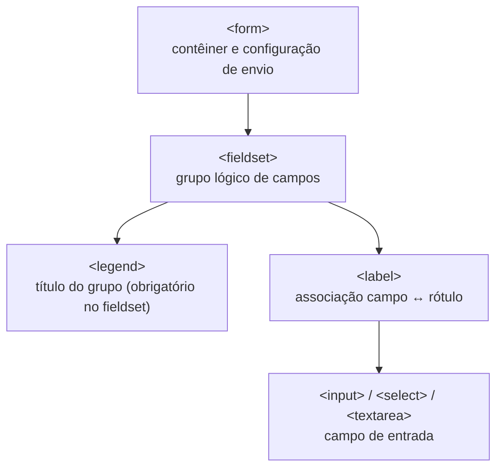
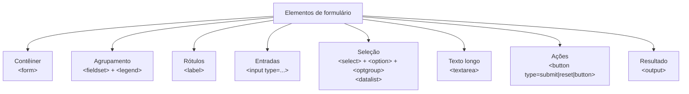

# Formulários I: estrutura e elementos

> [!abstract] TL;DR
> Formulários HTML são o principal mecanismo de entrada de dados na web. A estrutura semântica (`<form>`, `<fieldset>`, `<legend>`, `<label>`) e os tipos de `<input>` certos fazem a maior parte do trabalho de UX e acessibilidade automaticamente — teclado mobile adaptado, validação nativa, associação de label, estados de foco. Ignorar a semântica e implementar tudo em JS é recriar o que o browser já oferece, pior.

---

## A estrutura de um formulário semântico

Um formulário bem construído tem três camadas de organização:



Exemplo de formulário completo com semântica correta:

```html
<form action="/cadastro" method="POST" novalidate autocomplete="on">

  <fieldset>
    <legend>Dados pessoais</legend>

    <div class="field">
      <label for="nome">Nome completo <span aria-hidden="true">*</span></label>
      <input
        type="text"
        id="nome"
        name="nome"
        required
        autocomplete="name"
        aria-required="true"
      >
    </div>

    <div class="field">
      <label for="email">E-mail <span aria-hidden="true">*</span></label>
      <input
        type="email"
        id="email"
        name="email"
        required
        autocomplete="email"
        inputmode="email"
      >
    </div>
  </fieldset>

  <fieldset>
    <legend>Preferências</legend>

    <div class="field">
      <label for="plano">Plano</label>
      <select id="plano" name="plano" required>
        <option value="">Selecione um plano...</option>
        <option value="basico">Básico — R$ 29/mês</option>
        <option value="pro">Pro — R$ 79/mês</option>
        <option value="enterprise">Enterprise — R$ 299/mês</option>
      </select>
    </div>

    <div class="field">
      <label>
        <input type="checkbox" name="newsletter" value="sim">
        Receber novidades por e-mail
      </label>
    </div>
  </fieldset>

  <div class="actions">
    <button type="submit">Criar conta</button>
    <button type="button" onclick="resetForm()">Limpar</button>
  </div>

</form>
```

---

## `<form>` — o contêiner

`<form>` define o contêiner e configura como os dados serão enviados.

```html
<form
  action="/endpoint"       <!-- URL para onde enviar -->
  method="POST"            <!-- GET ou POST -->
  enctype="multipart/form-data"  <!-- necessário para upload de arquivo -->
  autocomplete="on"        <!-- habilita autocompletar do browser -->
  novalidate               <!-- desabilita validação nativa do browser (use JS customizado) -->
>
```

**`method`:**
- `GET` — dados vão na URL (`/busca?q=html&page=2`). Use para buscas, filtros — ações não destrutivas e que fazem sentido ser compartilháveis via URL.
- `POST` — dados vão no corpo da requisição. Use para criação, atualização, envio de dados sensíveis, uploads.

**`enctype`** (só importa com `method="POST"`):
- `application/x-www-form-urlencoded` — padrão. Dados codificados como query string no corpo.
- `multipart/form-data` — obrigatório quando o formulário tem `<input type="file">`.
- `text/plain` — raramente usado.

**`novalidate`** desabilita a validação nativa do browser para o formulário inteiro. Use quando você quer implementar sua própria UX de validação (mas ainda pode usar a Constraint Validation API — nota 06).

---

## `<fieldset>` e `<legend>` — agrupamento semântico

`<fieldset>` agrupa campos relacionados. `<legend>` é o título do grupo — obrigatório quando há `<fieldset>`.

```html
<!-- Caso clássico: etapas de um formulário longo -->
<fieldset>
  <legend>Passo 1: Informações pessoais</legend>
  <!-- campos -->
</fieldset>

<fieldset>
  <legend>Passo 2: Endereço de entrega</legend>
  <!-- campos -->
</fieldset>

<!-- Grupos de radio/checkbox — fieldset é especialmente importante aqui -->
<fieldset>
  <legend>Método de pagamento</legend>

  <label>
    <input type="radio" name="pagamento" value="cartao">
    Cartão de crédito
  </label>
  <label>
    <input type="radio" name="pagamento" value="pix">
    PIX
  </label>
  <label>
    <input type="radio" name="pagamento" value="boleto">
    Boleto bancário
  </label>
</fieldset>
```

Por que `<fieldset>` + `<legend>` é essencial para radio/checkbox: leitores de tela anunciam o `<legend>` antes de cada opção dentro do grupo. Sem isso, o usuário ouve "Cartão de crédito, radio button, 1 de 3" sem saber *que escolha* está fazendo.

> [!tip] `<fieldset>` pode ser desabilitado
> `<fieldset disabled>` desabilita todos os controles dentro do grupo de uma vez — sem precisar adicionar `disabled` em cada campo individualmente. Útil para formulários multi-passo onde etapas anteriores são travadas.

---

## `<label>` — associação campo ↔ rótulo

`<label>` é o elemento mais subutilizado de formulários. Além de exibir o texto do rótulo, ele:
- Aumenta a área clicável do campo (clicar no label foca o input)
- Associa o rótulo ao campo para leitores de tela
- Fornece o nome acessível do campo

**Duas formas de associação:**

```html
<!-- 1. Explícita: for="id" do input -->
<label for="email">E-mail</label>
<input type="email" id="email" name="email">

<!-- 2. Implícita: envolvendo o input -->
<label>
  E-mail
  <input type="email" name="email">
</label>
```

**Qual usar?** Forma explícita (`for`/`id`) é mais robusta e amplamente suportada — permite que o label e o input estejam em partes diferentes do markup. Forma implícita é conveniente para checkboxes e radios.

```html
<!-- ✅ Checkbox com label envolvendo: área de clique maior -->
<label>
  <input type="checkbox" name="termos" required>
  Aceito os <a href="/termos">termos de uso</a>
</label>

<!-- ❌ Placeholder como substituto de label — não faça isso -->
<input type="email" placeholder="Digite seu e-mail">
<!-- placeholder some quando o usuário começa a digitar,
     não é anunciado por todos os leitores de tela,
     contraste geralmente baixo -->

<!-- ✅ Label + placeholder como dica complementar -->
<label for="email">E-mail corporativo</label>
<input type="email" id="email" name="email" placeholder="nome@empresa.com">
```

> [!warning] Placeholder não é substituto de label
> Placeholder some ao digitar. Usuários de leitor de tela não contam com placeholder como nome acessível de forma confiável. Contraste de placeholder é frequentemente insuficiente (WCAG recomenda evitar dependência de placeholder para informação crítica). **Sempre use `<label>`.**

---

## `<input>` — todos os tipos modernos

O atributo `type` define o comportamento do campo: validação implícita, teclado mobile, aparência nativa, valor enviado.

### Texto e variantes

```html
<!-- text: padrão, texto livre -->
<input type="text" name="nome" autocomplete="name">

<!-- email: valida formato, teclado @ em mobile -->
<input type="email" name="email" autocomplete="email">

<!-- tel: teclado numérico em mobile (não valida formato) -->
<input type="tel" name="telefone" autocomplete="tel" pattern="[0-9]{10,11}">

<!-- url: valida formato de URL, teclado com / em mobile -->
<input type="url" name="site" autocomplete="url">

<!-- search: aparência de busca (X para limpar, em alguns browsers) -->
<input type="search" name="q" role="searchbox" aria-label="Buscar">

<!-- password: oculta o texto *)
<input type="password" name="senha" autocomplete="current-password" minlength="8">
```

### Números e faixas

```html
<!-- number: só aceita números, com spinners -->
<input type="number" name="quantidade" min="1" max="100" step="1" value="1">

<!-- range: slider visual -->
<input
  type="range"
  name="volume"
  min="0"
  max="100"
  step="5"
  value="50"
  aria-label="Volume"
>
<!-- range não exibe o valor atual — você precisa de JS + <output> -->
<output for="volume" id="volume-display">50</output>
```

### Data e hora

```html
<!-- date: date picker nativo (formato ISO no value) -->
<input type="date" name="nascimento" min="1900-01-01" max="2026-12-31">

<!-- time: seletor de hora -->
<input type="time" name="horario" min="09:00" max="18:00" step="900"> <!-- step em segundos -->

<!-- datetime-local: data e hora combinadas (sem timezone) -->
<input type="datetime-local" name="reuniao">

<!-- month: seletor de mês/ano -->
<input type="month" name="vencimento">

<!-- week: seletor de semana -->
<input type="week" name="semana">
```

> [!note] Suporte e UX de date pickers
> `type="date"` e parentes têm boa cobertura nos browsers modernos, mas aparência varia muito entre sistemas operacionais. Projetos que precisam de consistência visual usam date pickers JavaScript (mas devem manter o `<input type="date">` como base acessível).

### Seleção e arquivos

```html
<!-- checkbox: seleção múltipla independente -->
<label>
  <input type="checkbox" name="skills" value="html">
  HTML
</label>
<label>
  <input type="checkbox" name="skills" value="css">
  CSS
</label>

<!-- radio: seleção única dentro de um grupo (mesmo name) -->
<fieldset>
  <legend>Experiência</legend>
  <label>
    <input type="radio" name="nivel" value="junior">
    Júnior (0–2 anos)
  </label>
  <label>
    <input type="radio" name="nivel" value="pleno">
    Pleno (2–5 anos)
  </label>
  <label>
    <input type="radio" name="nivel" value="senior">
    Sênior (5+ anos)
  </label>
</fieldset>

<!-- file: upload de arquivo -->
<label for="avatar">Foto de perfil</label>
<input
  type="file"
  id="avatar"
  name="avatar"
  accept="image/jpeg,image/png,image/webp"
  multiple           <!-- permite múltiplos arquivos -->
>

<!-- hidden: envia valor sem campo visível (tokens CSRF, IDs) -->
<input type="hidden" name="csrf_token" value="abc123...">

<!-- color: color picker nativo -->
<input type="color" name="cor_favorita" value="#3b82f6">
```

---

## `<select>`, `<option>` e `<optgroup>`

```html
<label for="pais">País</label>
<select id="pais" name="pais" required autocomplete="country">
  <!-- Opção vazia como prompt -->
  <option value="">Selecione um país</option>

  <!-- Agrupamento com optgroup -->
  <optgroup label="América do Sul">
    <option value="BR">Brasil</option>
    <option value="AR">Argentina</option>
    <option value="CL">Chile</option>
  </optgroup>

  <optgroup label="América do Norte">
    <option value="US">Estados Unidos</option>
    <option value="CA">Canadá</option>
    <option value="MX">México</option>
  </optgroup>
</select>

<!-- Seleção múltipla -->
<label for="linguagens">Linguagens (segure Ctrl para múltiplas)</label>
<select id="linguagens" name="linguagens" multiple size="5">
  <option value="js">JavaScript</option>
  <option value="ts">TypeScript</option>
  <option value="py">Python</option>
  <option value="java">Java</option>
  <option value="go">Go</option>
</select>
```

**`<datalist>`** — sugestões de autocompletar sem restringir o valor:

```html
<label for="cidade">Cidade</label>
<input type="text" id="cidade" name="cidade" list="cidades-sugeridas">
<datalist id="cidades-sugeridas">
  <option value="São Paulo">
  <option value="Rio de Janeiro">
  <option value="Belo Horizonte">
  <option value="Porto Alegre">
</datalist>
<!-- Diferente de <select>: usuário pode digitar qualquer valor -->
```

---

## `<textarea>` — texto multilinha

```html
<label for="mensagem">Mensagem</label>
<textarea
  id="mensagem"
  name="mensagem"
  rows="5"
  cols="40"
  maxlength="500"
  placeholder="Escreva sua mensagem aqui..."
  required
></textarea>
<!-- rows e cols definem o tamanho inicial — CSS pode sobrescrever -->
<!-- resize: both/horizontal/vertical/none via CSS -->
```

---

## `<button>` — tipos e comportamento

```html
<!-- submit: envia o formulário associado (padrão quando type é omitido) -->
<button type="submit">Enviar cadastro</button>

<!-- reset: reseta todos os campos do formulário para valores iniciais -->
<button type="reset">Limpar formulário</button>

<!-- button: ação JavaScript arbitrária, NÃO envia o formulário -->
<button type="button" onclick="handleAction()">Visualizar prévia</button>
```

> [!warning] Sempre declare `type` em `<button>`
> O `type` padrão de `<button>` é `"submit"`. Um `<button>` sem `type` dentro de um `<form>` vai submeter o formulário ao ser clicado — inclusive aquele botão "Cancelar" que você queria que só fechasse um modal. Seja explícito.

**Conectar button a form por id** (button fora do `<form>`):

```html
<form id="meu-form" action="/enviar" method="POST">
  <input type="text" name="nome">
</form>

<!-- Em outra parte do DOM, mas associado ao form pelo form="" -->
<button type="submit" form="meu-form">Enviar</button>
```

---

## `<output>` — resultado calculado

`<output>` exibe o resultado de uma computação baseada nos campos do formulário:

```html
<form oninput="resultado.value = parseInt(a.value) + parseInt(b.value)">
  <label>
    Valor A: <input type="number" name="a" id="a" value="0">
  </label>
  +
  <label>
    Valor B: <input type="number" name="b" id="b" value="0">
  </label>
  =
  <output name="resultado" for="a b">0</output>
</form>
```

---

## Mapa de elementos de formulário



---

> [!question] Para fixar
> 1. Quando usar `method="GET"` vs `method="POST"` em um formulário? Dê um exemplo de cada.
> 2. Por que `<fieldset>` + `<legend>` é especialmente importante para grupos de radio buttons?
> 3. Qual a diferença entre label explícita (`for`/`id`) e label implícita (envolvendo o input)? Quando preferir cada uma?
> 4. Por que `placeholder` não pode substituir `<label>`?
> 5. O que acontece se um `<button>` não tiver `type` declarado?

---

## Veja também

- [[03-Dominios/Tecnologia/HTML/04 - Links, imagens e mídia|04 — Links, imagens e mídia]] — anterior
- [[03-Dominios/Tecnologia/HTML/06 - Formulários II - validação nativa e UX|06 — Formulários II: validação nativa e UX]] — próxima
- [[03-Dominios/Tecnologia/HTML/08 - ARIA - roles, states, properties e live regions|08 — ARIA]] — aria-required, aria-invalid em formulários
- [[03-Dominios/Tecnologia/React/Ecossistema/06 - Formulários com React Hook Form e Zod|React: Formulários com React Hook Form e Zod]] — formulários em React
