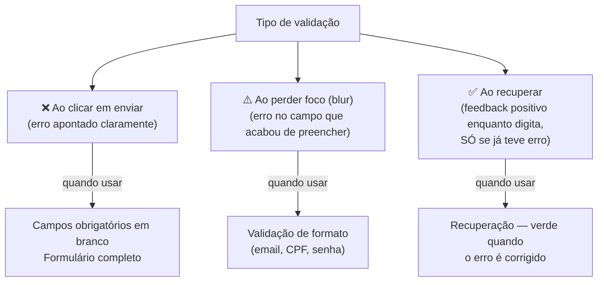

# Formulários II: validação nativa e UX

> [!abstract] TL;DR
> O browser tem um sistema de validação nativo poderoso — atributos de constraint (`required`, `pattern`, `min`, `max`), **Constraint Validation API** (`checkValidity()`, `setCustomValidity()`) e pseudo-classes CSS (`:valid`, `:invalid`, `:user-invalid`). Usado corretamente, reduz JS de validação a zero para casos comuns e garante comportamento acessível. A chave é entender quando validar (não antes do usuário terminar de digitar), como exibir erros (visível, associado ao campo, claro) e quando a validação nativa não é suficiente.

---

## Atributos de validação: o sistema nativo

O HTML define um conjunto de **atributos de constraint** que o browser verifica automaticamente antes de permitir o envio do formulário.

### `required` — campo obrigatório

```html
<!-- required: campo não pode estar vazio -->
<input type="text" name="nome" required>
<input type="email" name="email" required>
<select name="plano" required>
  <option value="">Selecione...</option>
  <option value="pro">Pro</option>
</select>
<textarea name="bio" required></textarea>

<!-- Para checkbox, required significa que deve estar marcado -->
<label>
  <input type="checkbox" name="termos" required>
  Aceito os termos de uso
</label>
```

### `pattern` — regex de validação

```html
<!-- pattern: expressão regular que o valor deve satisfazer -->
<input
  type="text"
  name="cep"
  pattern="\d{5}-?\d{3}"
  title="CEP no formato 12345-678 ou 12345678"
  placeholder="12345-678"
>

<input
  type="text"
  name="cpf"
  pattern="\d{3}\.?\d{3}\.?\d{3}-?\d{2}"
  title="CPF no formato 000.000.000-00"
>

<!-- type="email" já tem validação de formato embutida -->
<!-- pattern acrescenta restrições extras -->
<input
  type="email"
  name="email_corporativo"
  pattern="[a-z0-9._%+\-]+@empresa\.com\.br"
  title="Use seu e-mail corporativo @empresa.com.br"
>
```

> [!warning] `title` em campos com `pattern`
> O `title` é a mensagem exibida pelo browser quando o `pattern` falha. Sempre defina — sem ele, o browser exibe uma mensagem genérica inútil como "Please match the requested format".

### Limites de comprimento e valor

```html
<!-- Texto: comprimento de caracteres -->
<input type="text" name="usuario" minlength="3" maxlength="20">
<textarea name="bio" minlength="50" maxlength="500"></textarea>

<!-- Número: faixa de valores -->
<input type="number" name="quantidade" min="1" max="99" step="1">

<!-- Date: faixa de datas -->
<input type="date" name="data_evento" min="2026-06-27" max="2027-12-31">

<!-- Range: valores mínimos e máximos do slider -->
<input type="range" name="avaliacao" min="1" max="5" step="1">
```

**`step`** define os valores válidos entre `min` e `max`:

```html
<!-- step="1": só inteiros (padrão para number) -->
<input type="number" name="pessoas" min="1" max="10" step="1">

<!-- step="0.01": até 2 casas decimais (útil para preços) -->
<input type="number" name="preco" min="0" max="9999.99" step="0.01">

<!-- step="900" em time = a cada 15 minutos (900 segundos) -->
<input type="time" name="horario" min="09:00" max="18:00" step="900">

<!-- step="any": qualquer valor decimal -->
<input type="number" name="peso" min="0" step="any">
```

### `autocomplete` — autopreenchimento inteligente

`autocomplete` instrui o browser e gerenciadores de senha a preencherem o campo corretamente. Usar os valores canônicos certos melhora drasticamente a UX em mobile.

```html
<!-- Valores canônicos mais comuns (seção 4.10.18.7 do HTML Living Standard) -->
<input type="text"     autocomplete="name">               <!-- nome completo -->
<input type="text"     autocomplete="given-name">         <!-- primeiro nome -->
<input type="text"     autocomplete="family-name">        <!-- sobrenome -->
<input type="email"    autocomplete="email">
<input type="tel"      autocomplete="tel">
<input type="url"      autocomplete="url">

<!-- Senhas — distinção importante -->
<input type="password" autocomplete="current-password">   <!-- login -->
<input type="password" autocomplete="new-password">       <!-- cadastro/troca -->
<input type="text"     autocomplete="username">

<!-- Endereço -->
<input type="text"     autocomplete="street-address">
<input type="text"     autocomplete="address-line1">
<input type="text"     autocomplete="address-line2">
<input type="text"     autocomplete="address-level2">     <!-- cidade -->
<input type="text"     autocomplete="address-level1">     <!-- estado -->
<input type="text"     autocomplete="postal-code">
<input type="text"     autocomplete="country">

<!-- Pagamento -->
<input type="text"     autocomplete="cc-number">          <!-- número do cartão -->
<input type="text"     autocomplete="cc-name">            <!-- nome no cartão -->
<input type="text"     autocomplete="cc-exp">             <!-- validade MM/AA -->
<input type="text"     autocomplete="cc-csc">             <!-- CVV -->
```

> [!tip] `autocomplete="off"` raramente funciona como esperado
> Browsers modernos e gerenciadores de senha frequentemente ignoram `autocomplete="off"` para campos de senha e login (por razões de segurança do usuário). Se você está tentando impedir o autopreenchimento de campos sensíveis de negócio (não credenciais), isso provavelmente não funcionará de forma confiável.

### `inputmode` — teclado certo em mobile

`inputmode` diz ao dispositivo qual teclado exibir — independente do `type`:

```html
<!-- inputmode="numeric": teclado numérico (0-9), sem e/E/+/- do type="number" -->
<input type="text" inputmode="numeric" pattern="\d*" name="pin">

<!-- inputmode="decimal": teclado numérico com separador decimal -->
<input type="text" inputmode="decimal" name="valor">

<!-- inputmode="email": teclado com @ e . fáceis -->
<input type="text" inputmode="email" name="email_alternativo">

<!-- inputmode="tel": teclado de telefone -->
<input type="text" inputmode="tel" name="telefone">

<!-- inputmode="url": teclado com / e .com -->
<input type="url" inputmode="url" name="site">

<!-- inputmode="search": teclado com tecla "buscar" em vez de "return" -->
<input type="search" inputmode="search" name="q">

<!-- inputmode="none": sem teclado virtual (para pickers customizados com JS) -->
<input type="text" inputmode="none" id="date-picker">
```

---

## A Constraint Validation API

O browser expõe uma API JavaScript para interagir com o sistema de validação nativo. Isso permite validação customizada sem abandonar as garantias de acessibilidade do sistema nativo.

### `checkValidity()` e `reportValidity()`

```javascript
const form = document.querySelector('#meu-form');
const emailInput = document.querySelector('#email');

// checkValidity(): verifica sem exibir mensagens
if (!emailInput.checkValidity()) {
  console.log('E-mail inválido:', emailInput.validity);
}

// reportValidity(): verifica E exibe as mensagens nativas do browser
if (!form.reportValidity()) {
  // O browser exibiu as mensagens de erro automaticamente
  return;
}
```

### O objeto `ValidityState`

Cada input tem um `validity` — um objeto com flags booleanas que descrevem *por que* o campo é inválido:

```javascript
const input = document.querySelector('#cpf');
const v = input.validity;

console.log(v.valid);           // true se tudo ok
console.log(v.valueMissing);    // true se required e vazio
console.log(v.typeMismatch);    // true se type errado (ex: email sem @)
console.log(v.patternMismatch); // true se pattern falhou
console.log(v.tooShort);        // true se menor que minlength
console.log(v.tooLong);         // true se maior que maxlength
console.log(v.rangeUnderflow);  // true se menor que min
console.log(v.rangeOverflow);   // true se maior que max
console.log(v.stepMismatch);    // true se não múltiplo de step
console.log(v.customError);     // true se setCustomValidity() foi chamado com mensagem não vazia
console.log(v.badInput);        // true se input parcial inválido (ex: "abc" em type="number")
```

### `setCustomValidity()` — validação customizada

```javascript
const cpf = document.querySelector('#cpf');

cpf.addEventListener('blur', () => {
  const valor = cpf.value;

  if (!isValidCPF(valor)) {
    // Define mensagem customizada — isso marca o campo como inválido
    cpf.setCustomValidity('CPF inválido. Verifique os dígitos.');
  } else {
    // Limpa o erro customizado — campo volta a ser válido (se atendeu os outros constraints)
    cpf.setCustomValidity('');
  }
});

function isValidCPF(cpf) {
  // ... lógica de validação de CPF
}
```

> [!warning] `setCustomValidity('')` para limpar
> Se você chama `setCustomValidity('mensagem de erro')`, o campo fica inválido **permanentemente** até você chamar `setCustomValidity('')` (string vazia). Esquecer isso é um bug sutil comum.

### Combinando validação nativa + customizada com UX consistente

```html
<form id="cadastro" novalidate>
  <div class="field">
    <label for="email">E-mail</label>
    <input type="email" id="email" name="email" required autocomplete="email">
    <span class="error-msg" id="email-error" role="alert" aria-live="polite"></span>
  </div>
  <button type="submit">Cadastrar</button>
</form>
```

```javascript
const form = document.querySelector('#cadastro');
const emailInput = document.querySelector('#email');
const emailError = document.querySelector('#email-error');

function validateEmail() {
  emailInput.setCustomValidity(''); // limpa erro customizado antes de revalidar

  if (emailInput.validity.valueMissing) {
    showError(emailInput, emailError, 'E-mail é obrigatório.');
  } else if (emailInput.validity.typeMismatch) {
    showError(emailInput, emailError, 'Digite um e-mail válido (ex: nome@empresa.com).');
  } else {
    clearError(emailInput, emailError);
  }
}

function showError(input, errorEl, message) {
  errorEl.textContent = message;
  input.setAttribute('aria-invalid', 'true');
  input.setAttribute('aria-describedby', errorEl.id);
}

function clearError(input, errorEl) {
  errorEl.textContent = '';
  input.removeAttribute('aria-invalid');
  input.removeAttribute('aria-describedby');
}

// Valida ao perder foco (não ao digitar — não puna antes de terminar)
emailInput.addEventListener('blur', validateEmail);
// Revalida ao digitar (mas só se já teve erro — feedback imediato de recuperação)
emailInput.addEventListener('input', () => {
  if (emailInput.getAttribute('aria-invalid') === 'true') validateEmail();
});

form.addEventListener('submit', (e) => {
  e.preventDefault();
  validateEmail(); // valida todos os campos
  if (form.querySelector('[aria-invalid="true"]')) return; // para se houver erros
  // ... enviar formulário
});
```

---

## Pseudo-classes CSS de validação

O CSS tem pseudo-classes que refletem o estado de validação dos campos:

```css
/* :valid / :invalid — aplica SEMPRE, inclusive antes de interação */
input:valid { border-color: green; }
input:invalid { border-color: red; }
/* PROBLEMA: campo obrigatório começa inválido — fica vermelho sem o usuário ter feito nada */

/* :user-valid / :user-invalid (Safari 16.5+, Chrome 119+, Firefox 88+) */
/* Só aplica APÓS interação do usuário — solução para o problema acima */
input:user-valid { border-color: green; }
input:user-invalid { border-color: red; }

/* :placeholder-shown — campo com placeholder visível (campo vazio) */
input:placeholder-shown { /* campo ainda não preenchido */ }

/* :required / :optional */
input:required { /* ... */ }
input:optional { /* ... */ }

/* :disabled / :enabled */
input:disabled { opacity: 0.5; cursor: not-allowed; }

/* :read-only / :read-write */
input:read-only { background: #f5f5f5; }

/* :focus-visible — foco via teclado (não mouse) */
input:focus-visible { outline: 2px solid #3b82f6; }
```

**O problema de `:invalid` e a solução:**

```css
/* ❌ Campo vermelho desde o início (antes de o usuário interagir) */
input:invalid { border-color: red; }

/* ✅ Solução 1: :user-invalid (browsers modernos) */
input:user-invalid { border-color: red; }

/* ✅ Solução 2: classe via JS adicionada após submit ou blur */
input.touched:invalid { border-color: red; }

/* ✅ Solução 3: só após tentativa de submit */
form.submitted input:invalid { border-color: red; }
```

---

## UX de formulários: quando e como mostrar erros

A forma de exibir erros afeta tanto a UX quanto a acessibilidade.



**Regra**: não puna o usuário antes de ele terminar. Mostrar "e-mail inválido" enquanto ele ainda está digitando `jo` é agressivo. Mostre ao sair do campo (`blur`). Ao recuperar (digitar no campo com erro), mostre feedback imediato.

### Anatomia de uma mensagem de erro acessível

```html
<div class="field">
  <label for="email">
    E-mail
    <span aria-hidden="true">*</span>  <!-- asterisco visual, escondido do leitor -->
  </label>

  <input
    type="email"
    id="email"
    name="email"
    required
    aria-required="true"          <!-- redundante, mas amplamente suportado -->
    aria-invalid="true"           <!-- adicionar via JS quando há erro -->
    aria-describedby="email-error" <!-- aponta para a mensagem de erro -->
    autocomplete="email"
  >

  <span
    id="email-error"
    role="alert"                  <!-- live region: lido imediatamente ao aparecer -->
    class="error-msg"
  >
    Digite um e-mail válido, como nome@empresa.com.
  </span>
</div>
```

**Por que cada atributo:**
- `aria-invalid="true"` — anuncia ao leitor de tela que o campo está inválido
- `aria-describedby="email-error"` — associa a mensagem de erro ao campo; leitor de tela lê o erro junto com o campo
- `role="alert"` — a mensagem é lida imediatamente ao aparecer no DOM (live region assertiva)

---

## `disabled` vs `readonly` vs `aria-disabled`

Três formas de "desativar" um campo, com comportamentos muito diferentes:

| Atributo | Editável? | Enviado? | Focável? | Leitor de tela |
|---|---|---|---|---|
| `disabled` | ❌ Não | ❌ Não | ❌ Não | "dimmed" ou ignorado |
| `readonly` | ❌ Não | ✅ Sim | ✅ Sim | lido normalmente |
| `aria-disabled="true"` | ✅ Sim | ✅ Sim | ✅ Sim | anunciado como "dimmed" |

```html
<!-- disabled: campo bloqueado, valor NÃO enviado -->
<input type="text" name="plano" value="Pro" disabled>
<!-- Se você precisa que o valor seja enviado, use hidden + disabled visual -->

<!-- readonly: campo visível e copiável, valor enviado -->
<input type="text" name="codigo" value="ABC-123-XYZ" readonly>

<!-- aria-disabled: visualmente desabilitado, mas ainda focável e interativo -->
<!-- Use quando você quer manter o campo no tab order mas bloquear ação -->
<button type="submit" aria-disabled="true" onclick="return false">
  Enviar (complete todos os campos primeiro)
</button>
```

---

> [!question] Para fixar
> 1. Qual a diferença entre `checkValidity()` e `reportValidity()`?
> 2. Por que `:invalid` causa problemas de UX e como `:user-invalid` resolve?
> 3. Quando mostrar mensagens de erro: ao digitar, ao perder foco ou ao enviar? Por quê?
> 4. Qual a diferença entre `disabled` e `readonly`? Quando usar cada um?
> 5. O que `setCustomValidity('')` (string vazia) faz? Por que é importante chamar antes de revalidar?

---

## Veja também

- [[03-Dominios/Tecnologia/HTML/05 - Formulários I - estrutura e elementos|05 — Formulários I]] — anterior
- [[03-Dominios/Tecnologia/HTML/07 - Acessibilidade I - fundamentos WCAG e navegação por teclado|07 — Acessibilidade I]] — próxima
- [[03-Dominios/Tecnologia/HTML/08 - ARIA - roles, states, properties e live regions|08 — ARIA]] — aria-invalid, aria-describedby e live regions em profundidade
- [[03-Dominios/Tecnologia/React/Ecossistema/06 - Formulários com React Hook Form e Zod|React: Formulários com React Hook Form e Zod]] — validação no ecossistema React
