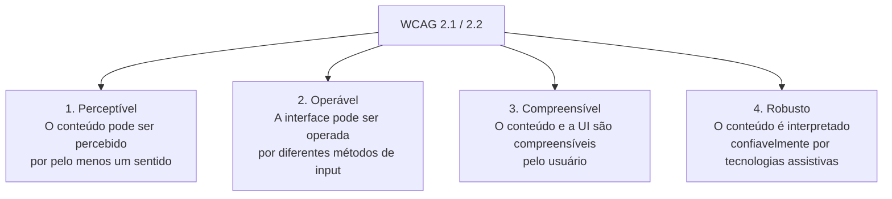
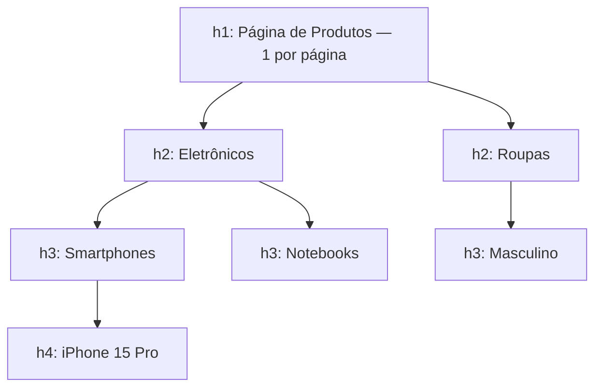
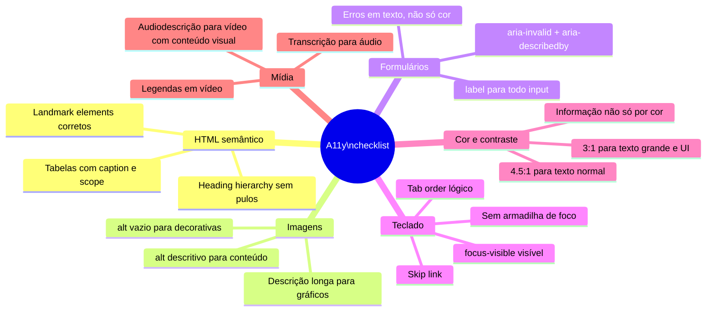

# Acessibilidade I: fundamentos WCAG e navegação por teclado

> [!abstract] TL;DR
> Acessibilidade web (a11y) é o conjunto de práticas que torna a web usável por pessoas com diferentes capacidades. Os **4 princípios WCAG** (Perceptível, Operável, Compreensível, Robusto) são o framework padrão, com WCAG 2.1 AA como baseline de mercado. A primeira linha de defesa é HTML semântico — leitores de tela, navegação por teclado e contraste adequado vêm quase de graça com markup correto. Só quando o HTML nativo não alcança é que ARIA entra.

---

## Por que acessibilidade importa

A web foi criada para ser universal — o primeiro servidor HTTP tinha arquivos de texto servidos para qualquer dispositivo. Com o avanço visual da web, essa universalidade foi se perdendo. Acessibilidade é o esforço de recuperá-la.

**Quem se beneficia:**

| Grupo | Dificuldade | Tecnologia assistiva |
|---|---|---|
| Deficiência visual (cegueira) | Não enxerga a tela | Leitor de tela (NVDA, JAWS, VoiceOver) |
| Baixa visão | Visão reduzida | Ampliador de tela, alto contraste |
| Daltonismo | Cores confusas | Filtros de cor, contraste aumentado |
| Deficiência motora | Não usa mouse | Navegação por teclado, switch access |
| Deficiência auditiva | Não ouve áudio/vídeo | Legendas, transcrições |
| Deficiência cognitiva | Dificuldade de processamento | Linguagem clara, estrutura previsível |
| Lesão temporária | Braço quebrado, etc. | Teclado, voz |
| Contexto situacional | Luz solar forte, mãos ocupadas | Alto contraste, voz |

> [!info] "Disability" é um espectro situacional
> A Microsoft Inclusive Design usa o conceito de "disability spectrum": permanente (cegueira), temporária (olho operado) e situacional (tela sob sol forte). As soluções de a11y beneficiam todos os três. Um bom contraste ajuda quem é daltônico, quem está com a tela sob sol e quem usa monitor velho.

---

## Os 4 princípios WCAG: POUR

**WCAG (Web Content Accessibility Guidelines)** é publicada pelo W3C e define critérios de sucesso em três níveis: A (mínimo), AA (padrão de mercado), AAA (máximo/específico).

Os critérios são organizados em 4 princípios:



### 1 — Perceptível

Informação e componentes da UI devem ser apresentáveis de formas que o usuário possa perceber.

**Critérios-chave:**
- **1.1.1 Conteúdo não-textual (A):** toda imagem, ícone e gráfico tem alternativa textual (`alt`, `aria-label`, legenda)
- **1.2.2 Legendas (vídeo pré-gravado) (A):** todo vídeo com áudio tem legenda sincronizada
- **1.3.1 Informação e relações (A):** estrutura é transmitida por markup (headings, listas, tabelas com headers) — não só por aparência visual
- **1.4.3 Contraste mínimo (AA):** texto normal 4.5:1, texto grande (18pt ou 14pt bold) 3:1
- **1.4.4 Redimensionamento de texto (AA):** texto pode ser ampliado a 200% sem perda de conteúdo
- **1.4.10 Reflow (AA):** conteúdo não exige scroll horizontal a 320px de largura

### 2 — Operável

Componentes da UI e navegação devem ser operáveis.

**Critérios-chave:**
- **2.1.1 Teclado (A):** toda funcionalidade acessível via teclado (sem timing específico)
- **2.1.2 Sem armadilha de teclado (A):** o foco de teclado pode entrar e sair de qualquer componente
- **2.4.1 Desvio de blocos (A):** mecanismo para pular blocos repetidos (skip link)
- **2.4.3 Ordem do foco (A):** a ordem de foco preserva significado e operabilidade
- **2.4.7 Foco visível (AA):** o componente focado tem indicador de foco visível

### 3 — Compreensível

Informação e operação da UI devem ser compreensíveis.

**Critérios-chave:**
- **3.1.1 Idioma da página (A):** o idioma principal é declarado (`lang` no `<html>`)
- **3.2.2 Ao inserir dados (A):** mudar um campo não causa mudança de contexto inesperada
- **3.3.1 Identificação de erros (A):** erros de input identificados e descritos em texto
- **3.3.2 Labels e instruções (A):** campos de input têm labels ou instruções

### 4 — Robusto

Conteúdo deve ser robusto o suficiente para ser interpretado por tecnologias assistivas variadas.

**Critérios-chave:**
- **4.1.1 Parsing (A):** HTML sem erros de aninhamento ou atributos duplicados
- **4.1.2 Nome, role, valor (A):** para todo componente da UI, nome e role são determinados programaticamente; estados e propriedades podem ser definidos pelo usuário e notificados a tecnologias assistivas

---

## Hierarquia de headings como estrutura de navegação

Leitores de tela permitem navegar entre headings — é como um usuário vidente usaria uma tabela de conteúdos.



**Regras:**
1. **Um `<h1>` por página** — o tema central
2. **Não pule níveis na descida** — `h1 → h3` sem `h2` cria lacunas
3. **Ordem lógica de leitura** — o outline deve fazer sentido como tabela de conteúdos
4. **Use CSS para tamanho, não heading para aparência** — não use `h4` porque "fica menor"

```html
<!-- ❌ Errado: pulo de nível -->
<h1>Loja Online</h1>
<h4>Eletrônicos</h4>  <!-- deveria ser h2 -->

<!-- ❌ Errado: heading por aparência -->
<h5 class="section-subtitle">Detalhe visual</h5>

<!-- ✅ Certo -->
<h1>Loja Online</h1>
<h2>Eletrônicos</h2>
  <h3>Smartphones</h3>
    <h4>iPhone 15 Pro</h4>
<h2>Roupas</h2>
```

---

## Skip links: pulando conteúdo repetido

Todo usuário de teclado que navega entre páginas é forçado a tabular por toda a navegação de cabeçalho antes de chegar ao conteúdo principal — em cada página. Um skip link resolve isso.

```html
<!-- Primeiro elemento do <body>: visível ao receber foco via teclado -->
<body>
  <a href="#main-content" class="skip-link">Pular para o conteúdo principal</a>

  <header>
    <nav><!-- Muitos links de navegação --></nav>
  </header>

  <main id="main-content" tabindex="-1">
    <!-- tabindex="-1" permite receber foco programático -->
    <h1>Título da página</h1>
    ...
  </main>
</body>
```

```css
/* Visível apenas quando focado por teclado */
.skip-link {
  position: absolute;
  top: -100px;
  left: 0;
  padding: 8px 16px;
  background: #000;
  color: #fff;
  z-index: 9999;
  text-decoration: none;
}

.skip-link:focus {
  top: 0;
}
```

---

## Navegação por teclado: como funciona

A maioria dos usuários de leitor de tela navega principalmente por teclado. Entender a mecânica é essencial para construir UIs navegáveis.

### Teclas fundamentais

| Tecla | Ação |
|---|---|
| `Tab` | Próximo elemento focável |
| `Shift + Tab` | Elemento focável anterior |
| `Enter` | Ativa link ou botão de submit; expande |
| `Space` | Ativa botão, checkbox; rola página |
| `Arrow keys` | Navega dentro de componentes (radio group, select, tab panel) |
| `Esc` | Fecha modal, menu, popover |

### O que é naturalmente focável (no tab order)

```html
<!-- Focáveis por padrão — no tab order sem intervenção -->
<a href="...">Link</a>
<button>Botão</button>
<input type="text">
<select>...</select>
<textarea></textarea>
<details>...</details>
```

### `tabindex` — controlando o tab order

```html
<!-- tabindex="0": adiciona elemento ao tab order natural (ordem do DOM) -->
<div role="button" tabindex="0" onclick="handleClick()">
  Botão customizado (use <button> quando possível)
</div>

<!-- tabindex="-1": focável programaticamente, mas fora do tab order -->
<!-- Útil para elementos que recebem foco via JS (modal, skip link target) -->
<div id="modal-content" tabindex="-1">
  Conteúdo do modal
</div>
<script>
  document.getElementById('modal-content').focus();
</script>

<!-- tabindex positivo (1, 2, 3...): EVITAR — define ordem absoluta,
     quebra a ordem natural do DOM e é difícil de manter -->
<input tabindex="3" type="text">  <!-- ❌ não faça isso -->
```

> [!warning] `tabindex` positivo: anti-pattern
> `tabindex="1"`, `tabindex="2"` etc. parecem úteis para controlar a ordem, mas criam problemas sérios: qualquer elemento com tabindex positivo recebe foco ANTES de todos os elementos com tabindex="0", independente de sua posição no DOM. Isso quebra a expectativa do usuário. Corrija a ordem no HTML em vez de usar tabindex positivo.

---

## `:focus-visible` — indicador de foco correto

O indicador de foco (outline) comunica ao usuário de teclado onde está o foco. Escondê-lo é um dos erros de a11y mais comuns.

```css
/* ❌ Anti-pattern clássico: remove foco para todos */
* { outline: none; }
button:focus { outline: none; }

/* ❌ Remove foco mas sem substituto visível */
.btn:focus { outline: 0; box-shadow: none; }

/* ✅ :focus-visible: foco visível só via teclado (não via clique) */
:focus-visible {
  outline: 2px solid #3b82f6;
  outline-offset: 2px;
  border-radius: 2px;
}

/* Remove o foco visual ao clicar (não via teclado) */
:focus:not(:focus-visible) {
  outline: none;
}

/* Customização por componente — preservando a acessibilidade */
.btn:focus-visible {
  outline: 3px solid #3b82f6;
  outline-offset: 3px;
}

.nav-link:focus-visible {
  outline: 2px solid white;
  background: rgba(255,255,255,0.1);
}
```

`:focus-visible` usa heurísticas do browser para determinar se o foco foi ativado por teclado (mostra outline) ou por clique/touch (não mostra). Isso resolve o trade-off entre "outline feio ao clicar" e "outline necessário ao tabular".

---

## Texto alternativo: a arte de descrever imagens

Já cobrimos `alt` na nota 04. Vale aprofundar os casos complexos:

```html
<!-- Imagem funcional (logo como link) — descreva a função, não a aparência -->
<a href="/" aria-label="Ir para a home">
  
  <!-- alt do logo = nome da empresa, não "logo azul com ícone de médico" -->
</a>

<!-- Imagem complexa (gráfico, diagrama) — alt curto + descrição longa -->
<figure>
  
  <figcaption id="grafico-desc">
    Crescimento de 15% no Q1, 28% no Q2, 12% no Q3 e 35% no Q4,
    totalizando 90% de crescimento anual. Maior pico em dezembro (festividades).
  </figcaption>
</figure>

<!-- Ícone decorativo dentro de botão com texto — alt vazio ou aria-hidden -->
<button>
  <svg aria-hidden="true" focusable="false"><!-- ícone de busca --></svg>
  Buscar
</button>

<!-- Ícone sem texto — aria-label no botão, aria-hidden no ícone -->
<button aria-label="Buscar">
  <svg aria-hidden="true" focusable="false"><!-- ícone de busca --></svg>
</button>
```

> [!tip] `focusable="false"` em SVG
> Em alguns browsers antigos (IE11, Edge Legacy), SVGs inline recebem foco por teclado mesmo sem `tabindex`. `focusable="false"` previne isso para SVGs decorativos.

---

## Contraste de cor: WCAG mínimos

**Contraste mínimo (WCAG AA):**
- Texto normal (< 18pt regular, < 14pt bold): **4.5:1**
- Texto grande (≥ 18pt regular, ≥ 14pt bold): **3:1**
- Componentes de UI e estados (bordas de input, ícones): **3:1**

```css
/* Exemplos de pares de cores com contraste adequado */

/* Preto (#000) sobre branco (#fff): 21:1 — ✅ excelente */
.text { color: #000000; background: #ffffff; }

/* Branco (#fff) sobre azul primário típico (#3b82f6): 4.6:1 — ✅ AA */
.btn-primary { color: #ffffff; background: #3b82f6; }

/* Texto cinza claro (#9ca3af) sobre branco — CHECAR */
/* #9ca3af sobre #fff: 2.5:1 — ❌ falha WCAG AA para texto normal */
.placeholder { color: #9ca3af; } /* problema! */

/* Alternativa: #6b7280 sobre #fff: 4.6:1 — ✅ */
.secondary-text { color: #6b7280; }
```

**Ferramentas para verificar contraste:**
- **WebAIM Contrast Checker** — inserir hexadecimais e verificar
- **axe DevTools** (extensão browser) — analisa a página inteira
- **Figma a11y plugins** — verificação direto no design
- Chrome DevTools → Elements → Computed → Accessibility

---

## O checklist de a11y que a entrevista espera



---

> [!question] Para fixar
> 1. O que significa WCAG AA? Qual o nível mínimo recomendado para produtos comerciais?
> 2. Por que `:focus-visible` é preferível a `:focus` para indicadores de foco?
> 3. Quais são os 4 princípios WCAG? Dê um exemplo de critério para cada um.
> 4. Por que skip links importam para usuários de teclado?
> 5. Um botão com ícone sem texto precisa de quê para ser acessível? Como implementar?
> 6. Qual o contraste mínimo WCAG AA para texto normal? E para botões (componentes de UI)?

---

## Veja também

- [[03-Dominios/Tecnologia/HTML/06 - Formulários II - validação nativa e UX|06 — Formulários II]] — anterior
- [[03-Dominios/Tecnologia/HTML/08 - ARIA - roles, states, properties e live regions|08 — ARIA]] — próxima
- [[03-Dominios/Tecnologia/HTML/02 - Landmark elements e documento estruturado|02 — Landmarks]] — estrutura de navegação
- [[03-Dominios/Tecnologia/CSS/index|CSS]] — `:focus-visible`, contraste e design acessível
