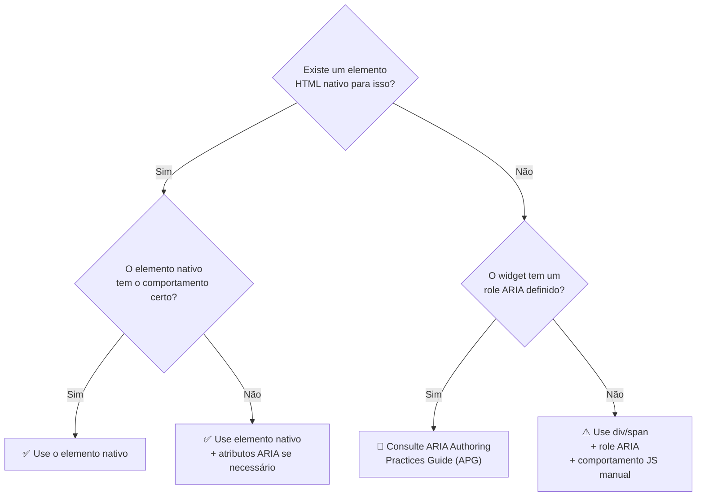
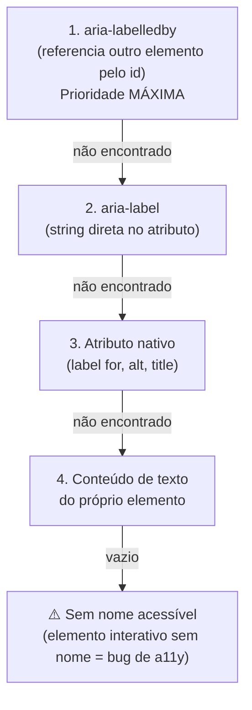

# ARIA: roles, states, properties e live regions

> [!abstract] TL;DR
> **ARIA (Accessible Rich Internet Applications)** é uma especificação de atributos que preenche as lacunas onde o HTML nativo não chega — widgets customizados, regiões que atualizam dinamicamente, widgets complexos como tabs e modais. O primeiro princípio: **"Nenhum ARIA é melhor do que ARIA ruim."** Use HTML semântico nativo sempre que possível. ARIA entra só quando o elemento correto não existe ou o widget customizado é inevitável.

---

## O primeiro princípio do ARIA

> *No ARIA is better than bad ARIA.*
> — WAI-ARIA Authoring Practices Guide

HTML semântico nativo tem comportamento correto embutido: `<button>` é focável, ativável por teclado, anunciado como "botão" pelo leitor de tela. Quando você adiciona `role="button"` a um `<div>`, precisa replicar todo esse comportamento manualmente — e provavelmente vai errar alguma coisa.

ARIA nunca adiciona comportamento — só comunicação para tecnologias assistivas. `role="button"` não faz o `<div>` ser ativável por teclado (você ainda precisa de `tabindex="0"` e listener de Enter/Espaço). O browser já sabe como tratar `<button>` — você não precisa do ARIA.



---

## As cinco regras de uso do ARIA

A especificação define regras de uso que devem ser seguidas na ordem:

1. **Use HTML nativo** se ele expressar o papel e semântica desejados
2. **Não mude a semântica nativa** — `<h2 role="tab">` é confuso (é um heading ou uma tab?)
3. **Todos os controles ARIA interativos** devem ser utilizáveis por teclado
4. **Não use** `role="presentation"` ou `aria-hidden="true"` em elemento que pode receber foco
5. **Todos os elementos interativos** devem ter um nome acessível

---

## Roles: o que o elemento é

Roles ARIA definem o tipo de um elemento — seu papel na interface. Há quatro categorias:

### Roles de landmark (regiões de navegação)

Equivalentes semânticos a elementos HTML5 — mas você pode usá-los quando o elemento HTML não está disponível:

| Role | Equivalente HTML | Quando usar o role |
|---|---|---|
| `banner` | `<header>` (filho de body) | Quando você não pode usar `<header>` |
| `navigation` | `<nav>` | Quando você não pode usar `<nav>` |
| `main` | `<main>` | Quando você não pode usar `<main>` |
| `complementary` | `<aside>` | — |
| `contentinfo` | `<footer>` (filho de body) | — |
| `search` | `<search>` (HTML 2023) | Regiões de busca (sem equivalente em HTML5) |
| `region` | `<section>` com accessible name | — |
| `form` | `<form>` | — |

```html
<!-- Role de landmark — só quando HTML nativo não é possível -->
<div role="navigation" aria-label="Principal">
  <!-- Em vez de <nav aria-label="Principal"> -->
</div>

<!-- role="search" — sem equivalente HTML comum -->
<div role="search">
  <label for="busca">Buscar no site</label>
  <input type="search" id="busca" name="q">
  <button type="submit">Buscar</button>
</div>
```

### Roles de widget (componentes interativos)

Quando você constrói um componente customizado que não tem equivalente HTML:

```html
<!-- Tabs -->
<div role="tablist" aria-label="Seções do produto">
  <button role="tab" id="tab-descricao" aria-selected="true" aria-controls="panel-descricao">
    Descrição
  </button>
  <button role="tab" id="tab-specs" aria-selected="false" aria-controls="panel-specs" tabindex="-1">
    Especificações
  </button>
</div>
<div role="tabpanel" id="panel-descricao" aria-labelledby="tab-descricao">
  <p>Conteúdo da descrição...</p>
</div>
<div role="tabpanel" id="panel-specs" aria-labelledby="tab-specs" hidden>
  <p>Especificações técnicas...</p>
</div>

<!-- Switch (toggle) -->
<button role="switch" aria-checked="true" onclick="toggle(this)">
  Notificações por e-mail
</button>

<!-- Slider customizado -->
<div
  role="slider"
  aria-valuemin="0"
  aria-valuemax="100"
  aria-valuenow="50"
  aria-valuetext="50%"
  aria-label="Volume"
  tabindex="0"
>
```

### Roles de estrutura (organização do conteúdo)

```html
<!-- Quando uma lista de elementos não é nav nem ul/ol -->
<div role="list">
  <div role="listitem">Item 1</div>
  <div role="listitem">Item 2</div>
</div>

<!-- Dica de ferramenta -->
<button aria-describedby="tooltip-info">
  Ajuda
</button>
<div role="tooltip" id="tooltip-info">
  Clique para ver mais informações sobre sua conta.
</div>

<!-- Separador visual -->
<hr role="separator" aria-orientation="horizontal">
```

### `role="presentation"` e `role="none"`

Remove a semântica nativa do elemento sem adicionar nova:

```html
<!-- Tabela usada para layout (anti-pattern, mas às vezes legado) -->
<table role="presentation">
  <tr>
    <td><!-- coluna de layout --></td>
    <td><!-- coluna de layout --></td>
  </tr>
</table>

<!-- Lista cujos bullets são puramente visuais -->
<ul role="presentation">
  <li>Item que não é semanticamente uma lista</li>
</ul>
```

---

## Nomes acessíveis: a hierarquia de `aria-label` e companhia

Todo elemento interativo deve ter um **nome acessível** — o texto que o leitor de tela anuncia. A especificação define uma ordem de prioridade:



### `aria-label` — nome direto no atributo

```html
<!-- Botão icon-only: aria-label fornece o nome -->
<button aria-label="Fechar modal">
  <svg aria-hidden="true"><!-- × --></svg>
</button>

<!-- Campo de busca sem label visível -->
<input type="search" aria-label="Buscar produtos" name="q">

<!-- Múltiplos landmarks do mesmo tipo — diferenciar com aria-label -->
<nav aria-label="Principal">...</nav>
<nav aria-label="Breadcrumb">...</nav>
<nav aria-label="Rodapé">...</nav>
```

> [!warning] `aria-label` sobrescreve o conteúdo de texto
> Se um `<button>` tem `aria-label="Fechar"` mas o texto visível é "Cancelar", o leitor de tela anuncia "Fechar" e o usuário vidente lê "Cancelar" — experiências divergentes. Use `aria-label` só quando não há texto visível para o elemento.

### `aria-labelledby` — referência a outro elemento

```html
<!-- Referencia um elemento existente na página como label -->
<h2 id="secao-contato">Entre em contato</h2>
<section aria-labelledby="secao-contato">
  <!-- O leitor de tela anuncia a section como "Entre em contato, region" -->
  <form>...</form>
</section>

<!-- Combinar múltiplos elementos -->
<span id="btn-prefix">Excluir</span>
<button aria-labelledby="btn-prefix produto-nome">
  <svg aria-hidden="true"><!-- ícone de lixeira --></svg>
</button>
<span id="produto-nome">iPhone 15 Pro</span>
<!-- Leitor de tela anuncia: "Excluir iPhone 15 Pro, botão" -->
```

### `aria-describedby` — descrição complementar

Diferente de `aria-labelledby` (nome), `aria-describedby` fornece uma **descrição adicional** — anunciada após o nome:

```html
<!-- Senha com requisitos -->
<label for="senha">Senha</label>
<input
  type="password"
  id="senha"
  aria-describedby="senha-requisitos"
  required
>
<p id="senha-requisitos">
  Mínimo 8 caracteres, incluindo letras e números.
</p>
<!-- Leitor de tela anuncia: "Senha, editar texto. Mínimo 8 caracteres, incluindo letras e números." -->

<!-- Campo com erro -->
<input
  type="email"
  id="email"
  aria-invalid="true"
  aria-describedby="email-erro"
>
<span id="email-erro" role="alert">
  E-mail inválido. Use o formato nome@empresa.com.
</span>
```

---

## States: a condição atual do elemento

States mudam com frequência e refletem o estado dinâmico da UI. O JavaScript deve atualizá-los quando o estado muda.

```html
<!-- aria-expanded: acordeão, menu dropdown, treeview -->
<button
  aria-expanded="false"
  aria-controls="menu-dropdown"
  onclick="toggleMenu(this)"
>
  Menu ▼
</button>
<ul id="menu-dropdown" hidden>
  <li><a href="/">Home</a></li>
</ul>
<!-- JavaScript deve: mudar aria-expanded, remover/adicionar hidden -->

<!-- aria-checked: checkbox customizado, switch -->
<div
  role="checkbox"
  aria-checked="false"
  tabindex="0"
  onclick="toggle(this)"
  onkeydown="if(event.key===' ')toggle(this)"
>
  Aceitar termos
</div>
<!-- Preferível usar <input type="checkbox"> — mas se precisar do widget customizado -->

<!-- aria-selected: tabs, listbox -->
<button role="tab" aria-selected="true">Aba 1</button>
<button role="tab" aria-selected="false" tabindex="-1">Aba 2</button>

<!-- aria-pressed: toggle button -->
<button aria-pressed="false" onclick="this.setAttribute('aria-pressed', this.getAttribute('aria-pressed')==='true' ? 'false' : 'true')">
  Negrito
</button>

<!-- aria-disabled: visualmente desabilitado, mas ainda focável -->
<button aria-disabled="true">Salvar (preencha todos os campos)</button>

<!-- aria-invalid + aria-required em formulários -->
<input
  type="email"
  required
  aria-required="true"    <!-- redundante com required nativo, mas melhora suporte antigo -->
  aria-invalid="false"    <!-- atualizar para true via JS quando houver erro -->
>

<!-- aria-hidden: remove da árvore de acessibilidade -->
<div aria-hidden="true">
  <!-- Conteúdo puramente decorativo que confundiria leitores de tela -->
  <svg><!-- ícone decorativo --></svg>
</div>
```

> [!warning] `aria-hidden="true"` em elemento focável
> Nunca coloque `aria-hidden="true"` em um elemento que pode receber foco (como um `<button>` ou `<a>`). O usuário de leitor de tela chega ao elemento via Tab, mas o leitor não anuncia nada — armadilha de foco invisível.

---

## Properties: metadados mais estáticos

Properties mudam menos que states — geralmente definidas no carregamento e raramente atualizadas:

```html
<!-- aria-haspopup: indica que o elemento controla um popup/menu -->
<button aria-haspopup="menu" aria-expanded="false">
  Opções
</button>

<!-- aria-controls: aponta para o elemento controlado -->
<button aria-expanded="false" aria-controls="painel-detalhes">
  Ver detalhes
</button>
<div id="painel-detalhes" hidden>...</div>

<!-- aria-owns: declara relação de propriedade (quando DOM não reflete) -->
<!-- Use quando o elemento filho não está no DOM dentro do elemento pai -->
<div role="listbox" aria-owns="opcao-1 opcao-2 opcao-3">...</div>

<!-- aria-level: nível de heading em widget de árvore -->
<div role="treeitem" aria-level="2">Subitem</div>

<!-- aria-posinset / aria-setsize: posição em lista virtual -->
<!-- Para listas que carregam sob demanda (virtualização) -->
<div role="option" aria-posinset="5" aria-setsize="100">Item 5 de 100</div>
```

---

## Live regions: atualizações dinâmicas

Live regions anunciam mudanças no DOM para leitores de tela — sem que o usuário precise navegar até o elemento. Essencial para notificações, toasts, loading states, resultados de busca.

### `aria-live`

```html
<!-- aria-live="polite": anuncia quando o usuário estiver livre -->
<!-- Para: status de loading, mensagens de sucesso, contadores -->
<div aria-live="polite" aria-atomic="true">
  <!-- Conteúdo adicionado aqui via JS é anunciado -->
  <p id="status"></p>
</div>

<!-- aria-live="assertive": anuncia imediatamente, interrompendo o leitor -->
<!-- Para: erros críticos, alertas urgentes -->
<div aria-live="assertive" aria-atomic="true">
  <p id="erro-critico"></p>
</div>
```

### `role="status"` e `role="alert"`

Atalhos para live regions com políticas predefinidas:

```html
<!-- role="status" = aria-live="polite" + aria-atomic="true" -->
<div role="status">
  <p id="msg-sucesso"></p>
</div>

<!-- role="alert" = aria-live="assertive" + aria-atomic="true" -->
<div role="alert">
  <p id="msg-erro"></p>
</div>

<!-- Toast notification — inicialmente vazio, JS adiciona conteúdo -->
<div role="status" id="toast" class="toast" aria-live="polite">
</div>
```

```javascript
function showToast(message) {
  const toast = document.getElementById('toast');
  // Limpar antes de adicionar (força o leitor de tela a re-anunciar)
  toast.textContent = '';
  // Timeout mínimo para garantir que o leitor de tela perceba a mudança
  setTimeout(() => {
    toast.textContent = message;
  }, 100);
}

showToast('Item adicionado ao carrinho com sucesso.');
```

### `aria-atomic` e `aria-relevant`

```html
<!-- aria-atomic="true": anuncia a região inteira quando qualquer parte muda -->
<div role="status" aria-atomic="true">
  <span id="itens">3</span> itens no carrinho
  <!-- Quando "3" muda para "4", anuncia "4 itens no carrinho" -->
</div>

<!-- aria-atomic="false" (padrão): anuncia só o que mudou -->
<div role="log" aria-live="polite" aria-atomic="false">
  <!-- Cada nova mensagem de log é anunciada individualmente -->
</div>

<!-- aria-relevant: o que disparar o anúncio -->
<!-- "additions text" (padrão): novos nós e mudanças de texto -->
<!-- "removals": quando conteúdo é removido -->
<!-- "all": qualquer mudança -->
<div aria-live="polite" aria-relevant="additions text">
```

---

## Anti-padrões clássicos de ARIA

```html
<!-- ❌ ARIA redundante em elemento nativo -->
<button role="button">Clique</button>  <!-- role="button" é redundante -->
<nav role="navigation">...</nav>       <!-- role="navigation" é redundante -->
<h2 role="heading" aria-level="2">    <!-- completamente desnecessário -->

<!-- ❌ Mudar a semântica de elemento nativo de forma confusa -->
<h2 role="tab">Título que é tab?</h2>  <!-- heading ou tab? Confuso -->
<input type="text" role="button">     <!-- input que age como botão? Use button -->

<!-- ❌ aria-label em elemento não-interativo sem contexto -->
<div aria-label="Seção importante">   <!-- div não é landmark — o label não aparece -->
  Conteúdo
</div>
<!-- Solução: use <section aria-label="Seção importante"> -->

<!-- ❌ aria-hidden em elemento com filhos focáveis -->
<div aria-hidden="true">
  <button>Botão que some do leitor mas recebe Tab</button>  <!-- armadilha! -->
</div>

<!-- ❌ Placeholder como aria-label -->
<input type="email" aria-label="nome@email.com" placeholder="nome@email.com">
<!-- aria-label do tipo "nome@email.com" não descreve o campo — é um exemplo de valor -->
<!-- Correto: aria-label="E-mail" ou melhor: <label> -->

<!-- ❌ Conteúdo informativo em aria-label com ícone -->
<button aria-label="Ajuda (?)">?</button>
<!-- O texto "(?)" fica visível mas aria-label o sobrescreve com "Ajuda (?)" -->
<!-- Correto: limpe o texto ou use aria-label="Ajuda" -->
```

---

## Padrões de widget com ARIA

A ARIA Authoring Practices Guide (APG) define padrões completos para widgets comuns. Aqui o núcleo de dois dos mais pedidos em entrevista:

### Modal (Dialog)

```html
<!-- Preferível: <dialog> nativo (nota 11) -->
<!-- Quando usar ARIA: browsers muito antigos ou UI library customizada -->

<div
  role="dialog"
  aria-modal="true"
  aria-labelledby="modal-title"
  aria-describedby="modal-desc"
  tabindex="-1"
  id="meu-modal"
>
  <h2 id="modal-title">Confirmar exclusão</h2>
  <p id="modal-desc">Esta ação não pode ser desfeita.</p>
  <button onclick="confirmDelete()">Excluir</button>
  <button onclick="closeModal()">Cancelar</button>
</div>
```

JavaScript necessário para modal ARIA correto:
1. Mover foco para o modal ao abrir (`modal.focus()`)
2. Prender foco dentro do modal (focus trap)
3. Fechar com Esc
4. Restaurar foco para o elemento que abriu o modal ao fechar

### Tabs

```html
<div>
  <!-- Tablist: contém os tabs -->
  <div role="tablist" aria-label="Detalhes do produto">

    <!-- Tab ativo: aria-selected="true" -->
    <button
      role="tab"
      id="tab-1"
      aria-selected="true"
      aria-controls="panel-1"
    >
      Descrição
    </button>

    <!-- Tab inativo: tabindex="-1" (navegação por setas, não Tab) -->
    <button
      role="tab"
      id="tab-2"
      aria-selected="false"
      aria-controls="panel-2"
      tabindex="-1"
    >
      Avaliações
    </button>

  </div>

  <!-- Panels: um visível por vez -->
  <div role="tabpanel" id="panel-1" aria-labelledby="tab-1">
    <p>Conteúdo da descrição...</p>
  </div>
  <div role="tabpanel" id="panel-2" aria-labelledby="tab-2" hidden>
    <p>Avaliações dos clientes...</p>
  </div>
</div>
```

O padrão de teclado para tabs: **Tab** para entrar no tablist, **Setas ←→** para navegar entre tabs, **Enter/Space** para ativar.

---

> [!question] Para fixar
> 1. Qual o primeiro princípio do ARIA? Em que situações ARIA é necessário?
> 2. Qual a diferença entre `aria-label` e `aria-labelledby`? Quando preferir cada um?
> 3. Qual a diferença entre `aria-label` e `aria-describedby`?
> 4. Por que `aria-hidden="true"` em elemento com `<button>` filho é um bug grave?
> 5. Qual a diferença entre `role="status"` e `role="alert"`? Dê um exemplo de uso de cada.
> 6. No padrão de tabs com ARIA, por que os tabs inativos têm `tabindex="-1"`?

---

## Veja também

- [[03-Dominios/Tecnologia/HTML/07 - Acessibilidade I - fundamentos WCAG e navegação por teclado|07 — Acessibilidade I]] — anterior
- [[03-Dominios/Tecnologia/HTML/09 - SEO técnico e metadados|09 — SEO técnico e metadados]] — próxima
- [[03-Dominios/Tecnologia/HTML/11 - HTML APIs nativas modernas|11 — HTML APIs modernas]] — `<dialog>` nativo (alternativa ao dialog ARIA)
- [[03-Dominios/Tecnologia/HTML/06 - Formulários II - validação nativa e UX|06 — Formulários II]] — aria-invalid, aria-describedby em formulários
