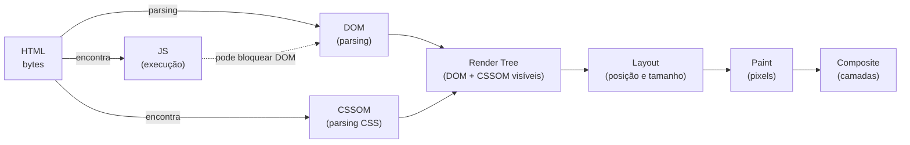
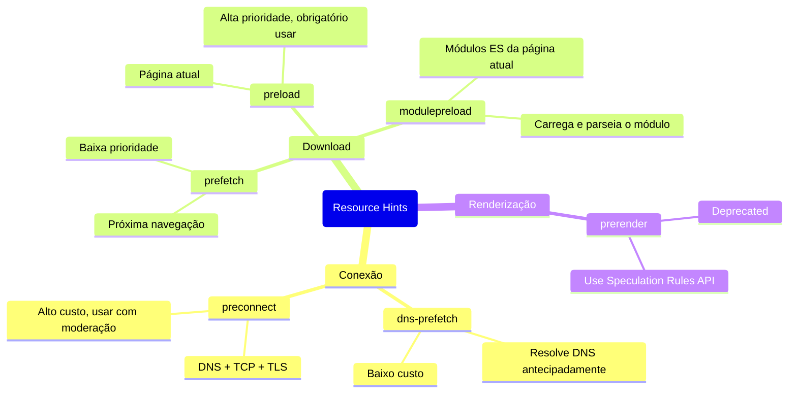

# Performance em HTML: resource hints e critical path

> [!abstract] TL;DR
> O browser não precisa esperar o HTML inteiro para começar a trabalhar — mas por padrão ele bloqueia no CSS e scripts. Entender o **critical rendering path** (HTML → DOM → CSSOM → Render Tree → Layout → Paint) é saber onde cada recurso atrasa a primeira pintura. **Resource hints** (`preload`, `preconnect`, `prefetch`, `modulepreload`, `dns-prefetch`) são as ferramentas para dizer ao browser o que buscar antes de precisar — antecipando a rede para reduzir latência percebida.

---

## O critical rendering path

O browser percorre uma sequência obrigatória antes de exibir algo na tela:



### Bloqueadores de renderização

Por padrão, dois tipos de recurso **bloqueiam a renderização** (render-blocking):

**CSS**: o browser não constrói a Render Tree sem o CSSOM completo. Qualquer `<link rel="stylesheet">` no `<head>` bloqueia a pintura até terminar de baixar e parsear o CSS.

**`<script>` sem atributos**: quando o parser encontra `<script>`, para de construir o DOM, executa o script, depois continua. Razão histórica: scripts podem modificar o DOM via `document.write`.

```html
<!-- ❌ Script bloqueante — para o parser aqui -->
<head>
  <script src="analytics.js"></script>
</head>

<!-- ✅ async: baixa em paralelo, executa quando pronto (sem ordem garantida) -->
<script src="analytics.js" async></script>

<!-- ✅ defer: baixa em paralelo, executa APÓS o DOM estar pronto (mantém ordem) -->
<script src="app.js" defer></script>
```

Diferença entre `async` e `defer`:

```mermaid
gantt
    title Script loading: async vs defer
    dateFormat X
    axisFormat %s

    section async
    HTML parsing      :0, 4
    Download script   :1, 3
    Execute (interrompe parsing) :3, 4

    section defer
    HTML parsing (completo)  :0, 5
    Download script   :1, 3
    Execute (após parsing)   :5, 6
```



| Atributo | Quando executa | Mantém ordem? | Quando usar |
|---|---|---|---|
| nenhum | Ao encontrar — bloqueia parser | — | Quase nunca |
| `async` | Assim que baixar | Não | Scripts independentes (analytics, ads) |
| `defer` | Após DOM completo | Sim | Scripts que dependem do DOM |
| `type="module"` | Como `defer` (padrão) | Sim | Módulos ES |

---

## Resource hints: antecipando a rede

Resource hints são declarações no `<head>` que instruem o browser a iniciar trabalho de rede antes que o recurso seja descoberto no fluxo normal de parsing.



---

## `preload` — "vou precisar deste recurso agora"

`preload` instrui o browser a baixar o recurso com **alta prioridade**, antes que o parser o descubra naturalmente. É uma promessa: você declara que vai usar o recurso — se não usar, é um aviso de console e bandwith desperdiçado.

```html
<!-- Fonte critical — font-display: swap não elimina o FOUT sem preload -->
<link
  rel="preload"
  href="/fonts/inter-variable.woff2"
  as="font"
  type="font/woff2"
  crossorigin
>

<!-- CSS crítico (raramente necessário — CSS já é alta prioridade) -->
<link rel="preload" href="/css/critical.css" as="style">

<!-- Imagem hero acima do fold — maior impacto no LCP -->
<link
  rel="preload"
  href="/imagens/hero.webp"
  as="image"
  fetchpriority="high"
>

<!-- Script crítico que será usado imediatamente -->
<link rel="preload" href="/js/app.js" as="script">
```

O atributo `as` é obrigatório — define a prioridade de fetch e o cache correto:

| `as` | Recurso | Content-Type esperado |
|---|---|---|
| `font` | Fontes web | `font/woff2`, `font/woff` |
| `style` | Folhas de estilo | `text/css` |
| `script` | JavaScript | `application/javascript` |
| `image` | Imagens | `image/*` |
| `fetch` | JSON / API | Qualquer |
| `document` | Iframe | `text/html` |
| `video` | Vídeo | `video/*` |

> [!warning] `crossorigin` em fontes é obrigatório
> Fontes são sempre buscadas com CORS. Sem `crossorigin`, o browser faz dois downloads: um para o preload (sem CORS) e outro para o uso real (com CORS). O preload é desperdiçado.

---

## `preconnect` — "vou me conectar a este servidor"

`preconnect` abre a conexão TCP + TLS com um servidor externo antes de saber qual recurso buscar:

```html
<!-- CDN de fontes — o preconnect abre a conexão para o servidor de fontes -->
<link rel="preconnect" href="https://fonts.gstatic.com" crossorigin>
<link rel="preconnect" href="https://fonts.googleapis.com">

<!-- CDN de imagens externas -->
<link rel="preconnect" href="https://cdn.meusite.com">

<!-- API que será chamada logo no carregamento -->
<link rel="preconnect" href="https://api.meusite.com">
```

O custo de uma conexão HTTPS (DNS + TCP + TLS) é tipicamente **200–500ms** em conexões lentas. Preconnect elimina essa latência.

> [!tip] Limite preconnect a 2-3 servidores
> Cada preconnect mantém uma conexão aberta que consome recursos no browser e no servidor. Use apenas para servidores que definitivamente serão acessados no carregamento da página. Para servidores usados mais tarde na sessão, prefira `dns-prefetch`.

---

## `dns-prefetch` — resolução DNS antecipada

Resolve apenas o DNS (sem abrir a conexão TCP/TLS) — mais barato que `preconnect`:

```html
<!-- Terceiros que serão acessados, mas não na carga inicial -->
<link rel="dns-prefetch" href="https://analytics.google.com">
<link rel="dns-prefetch" href="https://cdn.cookielaw.org">
```

Quando usar `dns-prefetch` vs `preconnect`:

| Situação | Melhor opção |
|---|---|
| Recurso crítico usado logo no carregamento | `preconnect` |
| Recurso usado após interação do usuário | `dns-prefetch` |
| Muitos domínios de terceiros (>3) | `dns-prefetch` para os não-críticos |
| Browsers antigos que não suportam `preconnect` | `dns-prefetch` como fallback |

```html
<!-- Padrão comum: preconnect + dns-prefetch como fallback -->
<link rel="preconnect" href="https://fonts.gstatic.com" crossorigin>
<link rel="dns-prefetch" href="https://fonts.gstatic.com">
```

---

## `prefetch` — "o usuário provavelmente vai para lá"

`prefetch` baixa um recurso com baixa prioridade, em idle time, para **a próxima navegação**:

```html
<!-- Próxima página provável — baixada em background -->
<link rel="prefetch" href="/proxima-aula.html">

<!-- JS da rota seguinte em uma SPA -->
<link rel="prefetch" href="/js/checkout.js" as="script">

<!-- Imagem da próxima slide de um carrossel -->
<link rel="prefetch" href="/slides/slide-2.webp" as="image">
```

O browser pode ignorar `prefetch` dependendo da conexão (Data Saver mode, 2G).

Diferença crítica entre `preload` e `prefetch`:
- `preload`: recurso **necessário agora**, alta prioridade, cache imediato
- `prefetch`: recurso **para depois**, baixa prioridade, pode ser ignorado

---

## `modulepreload` — módulos ES

`modulepreload` é específico para módulos ES — além de baixar, parseia e compila o módulo antecipadamente:

```html
<!-- Módulo principal e suas dependências estáticas -->
<link rel="modulepreload" href="/js/app.js">
<link rel="modulepreload" href="/js/utils.js">
<link rel="modulepreload" href="/js/components/header.js">
```

Sem `modulepreload`, o browser só descobre as dependências de um módulo após baixar e parsear o módulo pai — criando **waterfall** de requisições:

```
Sem modulepreload:
app.js → (parseia) → descobre utils.js → baixa utils.js → ...

Com modulepreload:
app.js + utils.js + header.js (em paralelo)
```

---

## `fetchpriority` — ajuste fino de prioridade

`fetchpriority` permite ajustar a prioridade de um recurso individual sem mudar quando ele é carregado:

```html
<!-- Imagem hero: aumentar prioridade para melhorar LCP -->


<!-- Preload da imagem hero: alta prioridade -->
<link
  rel="preload"
  href="/hero.webp"
  as="image"
  fetchpriority="high"
>

<!-- Imagens abaixo do fold: baixar prioridade -->


<!-- Script third-party: reduzir impacto no carregamento principal -->
<script src="https://analytics.js" async fetchpriority="low"></script>
```

---

## `loading="lazy"` — carregamento preguiçoso de imagens e iframes

```html
<!-- Imagens abaixo do fold: só baixa quando próximas à viewport -->


<!-- Iframes: embeds de vídeo, mapas -->
<iframe
  src="https://www.youtube.com/embed/abc123"
  loading="lazy"
  title="Apresentação do produto"
  width="560"
  height="315"
></iframe>
```

> [!warning] Nunca use `loading="lazy"` na imagem hero (LCP)
> A imagem acima do fold deve carregar com prioridade máxima. `loading="lazy"` atrasa o download até a imagem estar próxima da viewport — que para a imagem hero é agora, mas o browser só descobre isso tarde demais. Resultado: LCP pior, não melhor.

---

## `<link rel="preload">` para fontes: o fluxo completo

O problema das fontes web sem preload:

```
1. Browser baixa HTML
2. Browser baixa CSS
3. Browser parseia CSS → encontra @font-face
4. Browser AGORA sabe que precisa da fonte → inicia download
   (300-500ms depois do início)
5. Renderiza com fonte substituta → depois troca (FOUT)
```

Com preload:
```
1. Browser baixa HTML → encontra <link rel="preload"> para a fonte
2. Browser inicia download da fonte EM PARALELO com o CSS
3. Quando chega no @font-face, a fonte já está (ou quase) no cache
4. Fonte disponível muito mais cedo → menos FOUT
```

```html
<!-- 1. Preload no <head> -->
<link
  rel="preload"
  href="/fonts/inter-var.woff2"
  as="font"
  type="font/woff2"
  crossorigin
>

<!-- 2. CSS com font-display apropriado -->
<style>
  @font-face {
    font-family: 'Inter';
    src: url('/fonts/inter-var.woff2') format('woff2');
    font-weight: 100 900;
    /* swap: mostra fallback imediatamente, troca quando a fonte chegar */
    font-display: swap;
  }
</style>
```

Valores de `font-display`:

| Valor | Comportamento | Quando usar |
|---|---|---|
| `auto` | Deixa o browser decidir | Nunca use |
| `block` | Texto invisível até 3s | Evitar (FOIT) |
| `swap` | Fallback imediato, troca quando pronto | Textos de conteúdo |
| `fallback` | Invisível 100ms, depois fallback, troca se rápida | Fontes de UI |
| `optional` | 100ms invisível, depois fallback — sem troca | Performance max |

---

## Core Web Vitals e HTML

Os três Core Web Vitals do Google medem experiência real do usuário e impactam ranking:

| Métrica | O que mede | Bom | HTML mais relevante |
|---|---|---|---|
| **LCP** (Largest Contentful Paint) | Tempo até o maior elemento visível | < 2.5s | `fetchpriority="high"` na imagem hero, `preload` de fontes |
| **INP** (Interaction to Next Paint) | Responsividade a interações | < 200ms | `defer` em scripts grandes, não bloquear main thread |
| **CLS** (Cumulative Layout Shift) | Estabilidade visual | < 0.1 | `width`/`height` explícito em imagens e vídeos |

CLS — o problema de dimensões explícitas:

```html
<!-- ❌ Sem dimensões: browser não reserva espaço, layout shift quando a imagem carrega -->


<!-- ✅ Com width/height: browser calcula aspect ratio e reserva o espaço -->


<!-- CSS moderno garante responsividade sem quebrar o aspect ratio -->
<style>
  img { max-width: 100%; height: auto; }
</style>
```

---

> [!question] Para fixar
> 1. Qual a diferença entre `async` e `defer`? Em qual caso cada um é mais adequado?
> 2. Por que é necessário adicionar `crossorigin` em `<link rel="preload">` para fontes?
> 3. Qual a diferença entre `preload` e `prefetch`? O que acontece se você usar `prefetch` para o recurso crítico da página atual?
> 4. Por que `loading="lazy"` na imagem hero piora o LCP em vez de melhorar?
> 5. O que é CLS e como `width`/`height` explícitos em imagens previnem esse problema?
> 6. Quando usar `preconnect` vs `dns-prefetch`?

---

## Veja também

- [[03-Dominios/Tecnologia/HTML/09 - SEO técnico e metadados|09 — SEO técnico e metadados]] — anterior
- [[03-Dominios/Tecnologia/HTML/11 - HTML APIs nativas modernas|11 — HTML APIs nativas modernas]] — próxima
- [[03-Dominios/Tecnologia/HTML/04 - Links, imagens e mídia|04 — Links, imagens e mídia]] — `srcset`, `sizes`, `loading` em imagens responsivas
