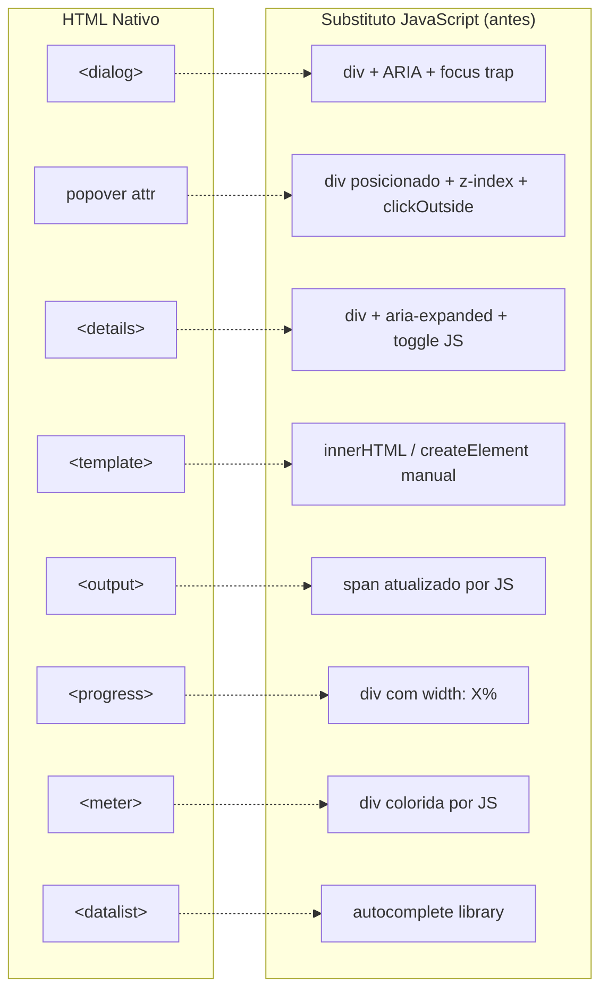

# HTML APIs nativas modernas

> [!abstract] TL;DR
> O HTML 5.x e as especificações mais recentes entregaram funcionalidades que antes dependiam obrigatoriamente de JavaScript: modais nativos (`<dialog>`), popovers declarativos (atributo `popover`), disclosure widgets (`<details>/<summary>`), templates reutilizáveis (`<template>`), e outros. Usar o nativo quando possível não é apenas elegância — é acessibilidade, comportamento de teclado e foco gerenciados pelo browser, sem linha de código adicional.

---

## `<dialog>` — modal nativo

O elemento `<dialog>` é a alternativa nativa ao padrão de div-com-role-dialog-e-focus-trap construído manualmente com ARIA (nota 08). O browser gerencia foco, sobreposição, e acessibilidade.

```html
<dialog id="confirmar-exclusao" aria-labelledby="dialog-titulo">
  <h2 id="dialog-titulo">Confirmar exclusão</h2>
  <p>Esta ação não pode ser desfeita.</p>
  <div class="actions">
    <button id="btn-confirmar">Excluir</button>
    <button id="btn-cancelar">Cancelar</button>
  </div>
</dialog>

<button id="btn-abrir">Abrir diálogo</button>
```

```javascript
const dialog = document.getElementById('confirmar-exclusao');
const btnAbrir = document.getElementById('btn-abrir');
const btnCancelar = document.getElementById('btn-cancelar');
const btnConfirmar = document.getElementById('btn-confirmar');

// showModal(): modal verdadeiro com backdrop, foco capturado, Escape fecha
btnAbrir.addEventListener('click', () => dialog.showModal());

// show(): diálogo não-modal (sem backdrop, sem foco capturado)
// btnAbrir.addEventListener('click', () => dialog.show());

btnCancelar.addEventListener('click', () => dialog.close());

// close() aceita um returnValue
btnConfirmar.addEventListener('click', () => dialog.close('confirmado'));

// Evento disparado quando o dialog fecha (qualquer forma)
dialog.addEventListener('close', () => {
  console.log(dialog.returnValue); // 'confirmado' ou '' (Escape)
});

// Fechar clicando no backdrop (o backdrop não é filho do dialog)
dialog.addEventListener('click', (e) => {
  if (e.target === dialog) dialog.close();
});
```

O `<dialog>` com `showModal()` entrega automaticamente:
- **Top-layer**: renderizado acima de qualquer z-index (sem hacks de z-index)
- **Foco automático**: foco vai para o primeiro elemento focável dentro do dialog
- **Focus trap**: Tab fica preso dentro do dialog
- **Escape fecha**: comportamento nativo de teclado
- **Backdrop nativo**: estilizável via `::backdrop` pseudo-element

```css
dialog {
  border: none;
  border-radius: 8px;
  padding: 2rem;
  max-width: min(90vw, 480px);
}

dialog::backdrop {
  background: rgb(0 0 0 / 0.5);
  backdrop-filter: blur(4px);
}
```

> [!info] `<dialog>` vs ARIA dialog
> Prefira sempre `<dialog>` nativo. O padrão ARIA (nota 08) deve ser reservado para quando você está usando uma biblioteca de UI que não expõe o elemento `<dialog>` diretamente.

---

## Atributo `popover` — tooltips e menus declarativos

O atributo `popover` (HTML Living Standard, 2023) permite criar popovers — elementos que aparecem sobre o conteúdo — sem JavaScript, apenas com atributos declarativos:

```html
<!-- Controle: botão com popovertarget -->
<button popovertarget="meu-popover">Abrir menu</button>

<!-- Popover: auto fecha ao clicar fora ou apertar Escape -->
<div id="meu-popover" popover>
  <p>Conteúdo do popover</p>
  <button popovertargetaction="hide" popovertarget="meu-popover">Fechar</button>
</div>
```

### Tipos de popover

```html
<!-- popover="auto" (padrão): fecha ao clicar fora ("light dismiss") -->
<div id="menu-dropdown" popover="auto">
  <ul>
    <li><a href="/perfil">Meu perfil</a></li>
    <li><a href="/config">Configurações</a></li>
    <li><button>Sair</button></li>
  </ul>
</div>

<!-- popover="manual": não fecha automaticamente — requer JS ou botão explícito -->
<div id="notificacao-toast" popover="manual">
  <p>Item adicionado ao carrinho!</p>
</div>
```

```javascript
// Controle via JavaScript
const toast = document.getElementById('notificacao-toast');

// Mostrar
toast.showPopover();

// Esconder
toast.hidePopover();

// Alternar
toast.togglePopover();

// Auto-fechar após 3 segundos
toast.showPopover();
setTimeout(() => toast.hidePopover(), 3000);

// Evento disparado ao abrir/fechar
toast.addEventListener('toggle', (e) => {
  console.log(e.newState); // 'open' ou 'closed'
});
```

O popover também vai para o **top-layer** — sem problemas de z-index, sem precisar mover o elemento no DOM.

### Âncora posicionada (`anchor positioning`)

CSS Anchor Positioning (2024) permite posicionar o popover relativo ao seu botão de controle:

```css
/* Botão é a âncora */
#btn-menu {
  anchor-name: --btn-menu;
}

/* Popover posicionado abaixo do botão */
#dropdown-menu {
  position-anchor: --btn-menu;
  top: anchor(bottom);
  left: anchor(left);
  position-area: bottom span-right;
}
```

---

## `<details>` e `<summary>` — disclosure nativo

O par `<details>/<summary>` é o disclosure widget nativo — o "accordion" sem JavaScript:

```html
<!-- Padrão básico -->
<details>
  <summary>Ingredientes</summary>
  <ul>
    <li>2 xícaras de farinha</li>
    <li>1 colher de fermento</li>
  </ul>
</details>

<!-- Aberto por padrão -->
<details open>
  <summary>Termos de uso</summary>
  <p>Ao usar este serviço, você concorda com...</p>
</details>

<!-- FAQ com múltiplos details -->
<section aria-label="Perguntas frequentes">
  <details>
    <summary>Como cancelar minha assinatura?</summary>
    <p>Acesse Configurações → Assinatura → Cancelar plano.</p>
  </details>

  <details>
    <summary>Quais formas de pagamento são aceitas?</summary>
    <p>Cartão de crédito, débito e PIX.</p>
  </details>
</section>
```

```javascript
// Detectar abertura/fechamento
const details = document.querySelector('details');

details.addEventListener('toggle', (e) => {
  console.log(details.open ? 'abriu' : 'fechou');
});

// Fechar todos os outros ao abrir um (accordion behavior)
document.querySelectorAll('details').forEach(d => {
  d.addEventListener('toggle', () => {
    if (d.open) {
      document.querySelectorAll('details').forEach(other => {
        if (other !== d) other.open = false;
      });
    }
  });
});
```

Estilização do marcador padrão:

```css
/* Remove o triângulo padrão */
details > summary {
  list-style: none;
  cursor: pointer;
}

details > summary::-webkit-details-marker {
  display: none;
}

/* Ícone customizado */
details > summary::after {
  content: '▼';
  transition: transform 0.2s;
}

details[open] > summary::after {
  transform: rotate(180deg);
}
```

> [!info] `name` em `<details>` — accordion nativo (2024)
> O atributo `name` agrupa múltiplos `<details>` em um accordion — apenas um pode estar aberto por vez:
> ```html
> <details name="faq"><summary>Pergunta 1</summary>...</details>
> <details name="faq"><summary>Pergunta 2</summary>...</details>
> ```
> Suporte ainda limitado (Chrome 120+, Firefox 130+) — verifique antes de usar em produção.

---

## `<template>` e HTML clonável

O elemento `<template>` contém HTML que não é renderizado nem executado — serve como molde para ser clonado via JavaScript:

```html
<!-- Template não aparece na página — não executa scripts, não baixa imagens -->
<template id="card-produto">
  <article class="card">
    
    <div class="card-body">
      <h3 class="card-titulo"></h3>
      <p class="card-preco"></p>
      <button class="card-btn">Adicionar ao carrinho</button>
    </div>
  </article>
</template>
```

```javascript
const template = document.getElementById('card-produto');

function criarCard(produto) {
  // Clona o conteúdo do template (true = clonagem profunda)
  const clone = template.content.cloneNode(true);

  // Preenche os dados
  clone.querySelector('.card-imagem').src = produto.imagem;
  clone.querySelector('.card-imagem').alt = produto.nome;
  clone.querySelector('.card-titulo').textContent = produto.nome;
  clone.querySelector('.card-preco').textContent = `R$ ${produto.preco}`;
  clone.querySelector('.card-btn').addEventListener('click', () => {
    adicionarAoCarrinho(produto.id);
  });

  return clone;
}

// Usar para renderizar lista de produtos
const produtos = await fetch('/api/produtos').then(r => r.json());
const lista = document.getElementById('lista-produtos');

produtos.forEach(p => lista.appendChild(criarCard(p)));
```

`<template>` é o fundamento dos Web Components — o Shadow DOM usa templates para encapsular markup.

---

## `<output>` — resultado calculado

O `<output>` representa o resultado de um cálculo ou ação do usuário — semanticamente diferente de um `<span>`:

```html
<form oninput="resultado.value = Number(a.value) + Number(b.value)">
  <label for="a">Primeiro número:</label>
  <input id="a" name="a" type="number" value="0">

  <label for="b">Segundo número:</label>
  <input id="b" name="b" type="number" value="0">

  <output name="resultado" for="a b">0</output>
</form>
```

O atributo `for` em `<output>` espelha o `for` do `<label>` — lista os IDs dos controles que contribuem para o resultado. Leitores de tela anunciam o `<output>` como uma "live region" implícita.

---

## `<meter>` e `<progress>` — escalas e progresso

```html
<!-- <progress>: progresso de tarefa (determinado ou indeterminado) -->

<!-- Determinado: valor e max conhecidos -->
<label for="upload">Upload:</label>
<progress id="upload" value="70" max="100">70%</progress>

<!-- Indeterminado: sem value (spinner de loading) -->
<progress id="carregando">Carregando...</progress>

<!-- <meter>: escala de medição com faixas semânticas -->

<!-- Uso de disco: 8GB de 20GB usados -->
<label for="uso-disco">Uso de disco:</label>
<meter id="uso-disco"
  value="8"
  min="0"
  max="20"
  low="12"
  high="16"
  optimum="4"
>8 de 20 GB</meter>
```

Atributos semânticos do `<meter>`:
- `low`: abaixo deste valor é considerado baixo
- `high`: acima deste valor é considerado alto
- `optimum`: valor considerado ótimo
- O browser aplica cores automaticamente (verde/amarelo/vermelho) baseadas nesses limiares

---

## `<datalist>` — autocomplete nativo

```html
<label for="cidade">Cidade:</label>
<input id="cidade" list="cidades" name="cidade" autocomplete="off">

<datalist id="cidades">
  <option value="São Paulo">
  <option value="Rio de Janeiro">
  <option value="Belo Horizonte">
  <option value="Salvador">
  <option value="Brasília">
</datalist>
```

`<datalist>` combina entrada livre (o usuário pode digitar qualquer coisa) com sugestões (as `<option>`) — diferente de `<select>` que força escolha da lista. Suportado em todos os browsers modernos desde 2015.

---

## Lazy loading nativo e Intersection Observer

`loading="lazy"` (nota 10) é implementado internamente pelo browser usando a Intersection Observer API — que também está disponível para JavaScript:

```javascript
// Padrão básico — ideal para lazy load de componentes
const observer = new IntersectionObserver(
  (entries) => {
    entries.forEach(entry => {
      if (entry.isIntersecting) {
        // Elemento entrou na viewport
        const el = entry.target;
        el.classList.add('visivel');

        // Parar de observar após primeiro trigger
        observer.unobserve(el);
      }
    });
  },
  {
    rootMargin: '0px 0px 200px 0px', // Aciona 200px antes de entrar na viewport
    threshold: 0.1                    // 10% do elemento visível
  }
);

// Observar todos os elementos com data-lazy
document.querySelectorAll('[data-lazy]').forEach(el => observer.observe(el));
```

---

## Resumo das APIs e seus substitutos JavaScript



---

> [!question] Para fixar
> 1. Qual a diferença entre `dialog.show()` e `dialog.showModal()`? O que cada um entrega automaticamente?
> 2. Quando usar `popover="auto"` vs `popover="manual"`?
> 3. Como `<details name="grupo">` muda o comportamento de um conjunto de accordions?
> 4. Por que `<template>` não renderiza seu conteúdo? Como acessar esse conteúdo via JavaScript?
> 5. Qual a diferença semântica entre `<progress>` e `<meter>`?
> 6. Cite uma vantagem de `<dialog>` nativo sobre o padrão de `role="dialog"` + ARIA manual.

---

## Veja também

- [[03-Dominios/Tecnologia/HTML/10 - Performance em HTML - resource hints e critical path|10 — Performance em HTML]] — anterior
- [[03-Dominios/Tecnologia/HTML/12 - HTML em entrevista|12 — HTML em entrevista]] — próxima (capstone)
- [[03-Dominios/Tecnologia/HTML/08 - ARIA - roles, states, properties e live regions|08 — ARIA]] — ARIA dialog manual (quando `<dialog>` não está disponível)
- [[03-Dominios/Tecnologia/HTML/06 - Formulários II - validação nativa e UX|06 — Formulários II]] — `<datalist>` como alternativa ao autocomplete customizado
