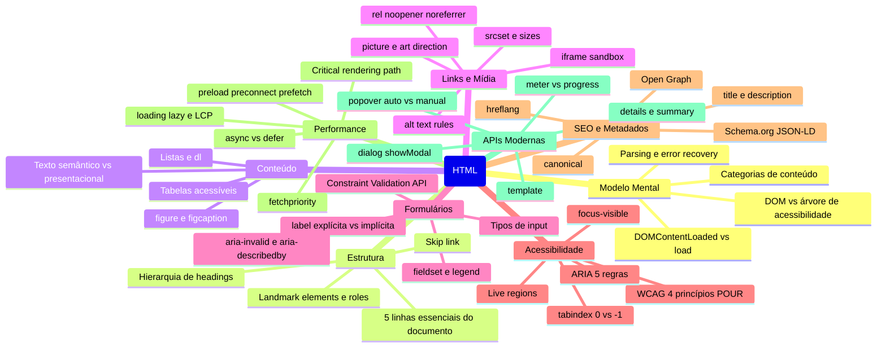

# HTML em entrevista

> [!abstract] TL;DR
> Este capstone sintetiza os padrões de raciocínio que aparecem em entrevistas de frontend — do nível pleno ao staff. A regra de ouro: HTML não é cosmético. Cada decisão de markup tem implicações em acessibilidade, SEO, performance e comportamento do browser. Entrevistadores experientes sondam *por que* você escolheu um elemento, não *o que* ele faz.

---

## Mapa mental do galho



---

## As 10 perguntas mais frequentes em entrevista

### 1. Qual a diferença entre HTML semântico e `<div>`/`<span>`?

**A pergunta por baixo**: você entende que HTML comunica significado, não apenas estrutura visual?

A resposta esperada vai além de "div não tem significado":
- O browser expõe a árvore de acessibilidade baseada nos elementos HTML — `<nav>` vira `role=navigation`, `<button>` vira um controle focável e ativável. `<div>` não expõe nada.
- Leitores de tela usam landmarks para navegação rápida — um usuário de NVDA pode pular diretamente para o `<main>` pressionando uma tecla.
- O SEO usa headings, alt text e estrutura de documento como sinais de relevância.
- `<div>` e `<span>` são válidos — mas são o último recurso, não o padrão.

### 2. Como você tornaria este componente acessível?

*[Entrevistador mostra um dropdown ou autocomplete implementado com `<div>`]*

Framework de resposta:
1. Perguntar: existe um equivalente HTML nativo? (`<select>`, `<details>`, `<dialog>`)
2. Se nativo não serve: identificar o role ARIA do widget (APG)
3. Declarar o que o ARIA exige: role + states necessários (`aria-expanded`, `aria-selected`)
4. Identificar o que JavaScript precisa fazer: comportamento de teclado
5. Nomear o elemento: `aria-label` ou `<label>` associada

### 3. Por que `<label>` é importante e como usá-la corretamente?

Dois mecanismos:
```html
<!-- Explícita: for aponta para o id do input -->
<label for="email">E-mail</label>
<input id="email" type="email">

<!-- Implícita: input dentro do label -->
<label>
  E-mail
  <input type="email">
</label>
```

O que `<label>` entrega:
- Clique no label foca o input (área de clique maior, especialmente em mobile)
- Leitores de tela anunciam o texto do label ao focar o input
- Sem label, o leitor de tela anuncia "editar texto" — sem contexto

Anti-padrões:
- `placeholder` como substituto de label: desaparece ao digitar, baixo contraste
- `aria-label` como substituto: funciona para leitores de tela, mas não aumenta área de clique

### 4. Quando usar `<button>` vs `<a>`?

Regra simples:
- **`<a>`**: navega para outro lugar (URL, âncora) — semântica "vá para"
- **`<button>`**: realiza uma ação no contexto atual — semântica "faça isso"

Implicações:
- `<a>` sem `href` não é focável por padrão
- `<button>` é ativável por Enter e Espaço; `<a>` apenas por Enter
- Link tem `role="link"`; botão tem `role="button"` — leitores de tela anunciam diferente
- Use `<button type="button">` em forms para não disparar submit acidentalmente

### 5. O que é o Critical Rendering Path?

Sequência do browser até exibir pixels:
1. HTML → parser → **DOM**
2. CSS (encontrado no HTML) → parser → **CSSOM**
3. DOM + CSSOM → **Render Tree** (só elementos visíveis)
4. Render Tree → **Layout** (posição e tamanho)
5. Layout → **Paint** (pixels)
6. Paint → **Composite** (camadas)

Onde HTML influencia a performance:
- `<script>` sem atributos bloqueia o parser (solução: `defer` ou `async`)
- CSS é render-blocking (solução: inline crítico, preload do restante)
- Imagens sem `width`/`height` causam CLS (layout shift)
- `loading="lazy"` na imagem hero piora o LCP

### 6. O que é `<meta name="viewport">` e por que é necessário?

```html
<meta name="viewport" content="width=device-width, initial-scale=1">
```

Sem ela, browsers mobile simulam uma viewport de ~980px e fazem zoom-out — o site fica minúsculo. `width=device-width` instrui o browser a usar a largura real do dispositivo como viewport.

O que não fazer:
```html
<!-- ❌ Bloqueia zoom do usuário — viola WCAG 1.4.4 -->
<meta name="viewport" content="width=device-width, initial-scale=1, user-scalable=no">
```

### 7. Qual a diferença entre `async` e `defer`?

Ambos baixam o script em paralelo sem bloquear o parser HTML. A diferença é quando executam:
- `async`: executa assim que o download termina — pode ser antes ou depois do DOM estar pronto. Scripts `async` não respeitam ordem de declaração.
- `defer`: executa após o DOM estar pronto, antes do evento `DOMContentLoaded`. Mantém ordem de declaração.

Quando usar:
- Analytics, ads, scripts independentes: `async`
- Scripts que dependem do DOM ou de outros scripts: `defer`
- Módulos ES (`type="module"`): comportamento de `defer` por padrão

### 8. Explique `preload` vs `prefetch` vs `preconnect`

| Hint | Prioridade | Quando usar |
|---|---|---|
| `preload` | Alta | Recurso crítico para a página atual (fontes, hero image) |
| `prefetch` | Baixa | Recurso para a próxima navegação |
| `preconnect` | Conexão | Estabelece TCP+TLS com servidor que será acessado |
| `dns-prefetch` | Muito baixa | Resolve apenas DNS — mais barato que preconnect |

Pegadinha comum: usar `prefetch` para recurso crítico atual → browser trata como baixa prioridade → recurso chega tarde.

### 9. Qual a diferença entre `aria-label` e `aria-labelledby`?

Ambos fornecem o nome acessível de um elemento, mas:
- `aria-label`: string direta no atributo — use quando não há texto visível para nomear o elemento
- `aria-labelledby`: referencia um elemento existente pelo id — o texto do elemento referenciado se torna o nome

```html
<!-- aria-label: botão icon-only sem texto visível -->
<button aria-label="Fechar">
  <svg aria-hidden="true"><!-- × --></svg>
</button>

<!-- aria-labelledby: section nomeada pelo heading já existente -->
<h2 id="secao-contato">Entre em contato</h2>
<section aria-labelledby="secao-contato">...</section>
```

Hierarquia de precedência: `aria-labelledby` > `aria-label` > atributo nativo (alt, title) > texto do elemento.

### 10. O que é WCAG e quais os 4 princípios?

WCAG (Web Content Accessibility Guidelines) — o padrão internacional de acessibilidade web. O nível AA é requisito legal em muitos contextos (ADA nos EUA, LBI no Brasil).

Os 4 princípios (POUR):
1. **Perceptível**: informação deve ser percebível por todos os sentidos disponíveis — texto alternativo, legendas, contraste
2. **Operável**: interface operável por teclado, sem limites de tempo, sem conteúdo que cause convulsões
3. **Compreensível**: linguagem legível, comportamento previsível, prevenção de erros em formulários
4. **Robusto**: interpretável por tecnologias assistivas — HTML válido, ARIA correto, roles semânticas

---

## Perguntas de design de componente

### "Construa um accordion acessível"

Solução mínima com HTML nativo (preferida):
```html
<details>
  <summary>Pergunta 1</summary>
  <p>Resposta...</p>
</details>
```

Com `name` para comportamento de accordion (um por vez):
```html
<details name="faq">
  <summary>Pergunta 1</summary>
  <p>Resposta...</p>
</details>
<details name="faq">
  <summary>Pergunta 2</summary>
  <p>Resposta...</p>
</details>
```

Solução ARIA quando UI library impede uso de `<details>`:
```html
<div>
  <button
    aria-expanded="false"
    aria-controls="panel-1"
    id="heading-1"
  >
    Pergunta 1
  </button>
  <div
    id="panel-1"
    role="region"
    aria-labelledby="heading-1"
    hidden
  >
    Resposta...
  </div>
</div>
```

### "Construa um modal acessível"

Solução nativa (preferida):
```html
<dialog id="modal" aria-labelledby="modal-titulo">
  <h2 id="modal-titulo">Título do modal</h2>
  <p>Conteúdo...</p>
  <button>Fechar</button>
</dialog>
```

O `showModal()` entrega: focus trap, Escape, backdrop, top-layer.

O que mencionar mesmo sem pedir: `dialog.returnValue` para saber como foi fechado, `::backdrop` para estilizar o fundo.

### "Como você implementaria lazy loading de imagens?"

Primeiro nível: `loading="lazy"` nativo:
```html

```

Segundo nível (para controle fino): Intersection Observer API para acionar carregamento antes da viewport, com `rootMargin`.

O que evitar: nunca `loading="lazy"` na imagem hero — piora o LCP.

---

## Armadilhas clássicas de entrevista

### `div` clicável sem role

```html
<!-- ❌ -->
<div onclick="comprar()">Comprar</div>

<!-- Problemas:
  - Não focável por teclado (tab não para)
  - Não ativável por Enter/Espaço
  - Leitor de tela não anuncia como controle
-->

<!-- ✅ -->
<button onclick="comprar()">Comprar</button>
```

### Título de página duplicado

```html
<!-- ❌ Todas as páginas com o mesmo title -->
<title>MeuSite</title>

<!-- ✅ -->
<title>Checkout — MeuSite</title>
<title>Produto: Teclado Mecânico — MeuSite</title>
```

### `aria-hidden` em elemento focável

```html
<!-- ❌ Armadilha de foco: usuário de teclado chega lá, leitor não anuncia nada -->
<div aria-hidden="true">
  <button>Ação</button>
</div>

<!-- ✅ Se o conteúdo é decorativo, remova o foco também -->
<div aria-hidden="true" inert>
  <button tabindex="-1">Ação</button>
</div>
```

### `` sem alt

```html
<!-- ❌ Leitor de tela lê o src completo: "produto-12345-abc.jpg" -->


<!-- ✅ Descritivo para imagens informativas -->


<!-- ✅ Vazio para decorativas -->

```

### Input sem label

```html
<!-- ❌ Leitor de tela anuncia apenas "editar texto" -->
<input type="email" placeholder="seu@email.com">

<!-- ✅ -->
<label for="email">E-mail</label>
<input id="email" type="email" placeholder="seu@email.com">
```

---

## Checklist final antes de entregar qualquer componente

```markdown
Estrutura
☐ Headings em hierarquia correta (não pular níveis)
☐ Landmarks usados (nav, main, header, footer, aside)
☐ Skip link presente se houver nav repetitiva

Formulários
☐ Todos os inputs têm <label> associado (for/id)
☐ Grupos com fieldset + legend
☐ Erros com aria-invalid + aria-describedby
☐ Botão de submit com type="submit" explícito

Imagens
☐ Alt text em todas as imagens (descritivo ou vazio se decorativa)
☐ width/height declarados (prevenção de CLS)
☐ loading="lazy" apenas abaixo do fold

Links e botões
☐ <a> para navegação, <button> para ação
☐ rel="noopener noreferrer" em target="_blank"
☐ Texto descritivo (não "clique aqui")

Performance
☐ Scripts com defer ou async
☐ Fontes críticas com preload + crossorigin
☐ Imagem hero com fetchpriority="high"

Acessibilidade
☐ Controles interativos têm nome acessível
☐ aria-hidden="true" nunca em elemento focável
☐ Contraste mínimo 4.5:1 (texto normal) ou 3:1 (texto grande)
☐ Teclado funciona em todos os fluxos principais

Metadados
☐ <title> único e descritivo (50–60 chars)
☐ meta description (150–160 chars)
☐ <html lang> correto
☐ <meta viewport> presente
```

---

> [!question] Para fixar — revisão geral
> 1. Você recebe um formulário com três `<div>` clicáveis no lugar de botões. Quais são todos os problemas disso e qual a solução mínima e a solução correta?
> 2. Descreva o critical rendering path e aponte dois lugares onde o HTML pode bloquear a renderização.
> 3. Qual a diferença entre `<button>` e `<a>` em termos de acessibilidade, semântica e comportamento de teclado?
> 4. Um componente de tabs usa `role="tab"`, `aria-selected`, e `tabindex="-1"` nos tabs inativos. Por que `tabindex="-1"` é necessário nos inativos?
> 5. O que é `font-display: swap` e por que não resolve completamente o FOUT sem `<link rel="preload">`?

---

## Veja também

- [[03-Dominios/Tecnologia/HTML/01 - O modelo mental do HTML - semântica, árvore e o browser|01 — O modelo mental do HTML]] — início do galho
- [[03-Dominios/Tecnologia/HTML/07 - Acessibilidade I - fundamentos WCAG e navegação por teclado|07 — Acessibilidade I]] — WCAG em profundidade
- [[03-Dominios/Tecnologia/HTML/08 - ARIA - roles, states, properties e live regions|08 — ARIA]] — ARIA em profundidade
- [[03-Dominios/Tecnologia/HTML/10 - Performance em HTML - resource hints e critical path|10 — Performance em HTML]] — critical path em profundidade
- [[03-Dominios/Tecnologia/CSS/index|CSS]] — próximo galho do stack web
