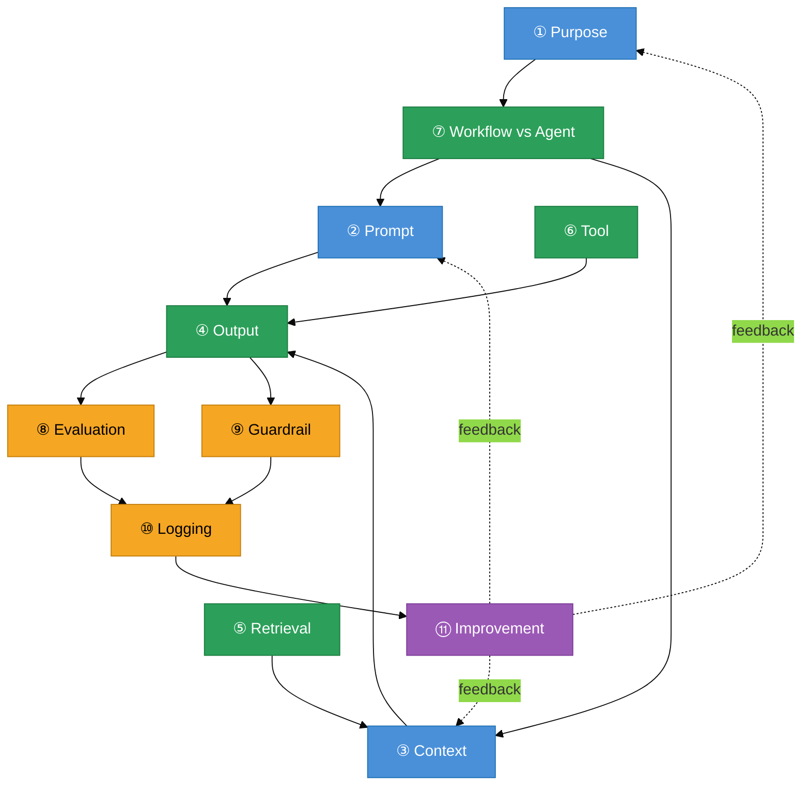

# As 11 camadas — visão geral

> [!abstract] TL;DR
> Um sistema de IA em produção se monta em onze camadas: **Purpose, Prompt, Context, Output, Retrieval, Tool, Workflow vs Agent, Evaluation, Guardrail, Logging, Improvement**. As três primeiras definem o que o sistema é, como se comporta e o que sabe. As quatro do meio executam — produzem output, puxam conhecimento, chamam tools, escolhem entre caminho fixo e agent. As três seguintes controlam — medem, restringem, registram. A última fecha o loop e transforma o sistema one-off em sistema que aprende. Esta nota é o mapa; cada camada tem sua própria nota nesta trilha.

## Por que a maioria dos demos de IA não vai a produção

> [!question]- O que faz um demo funcionar mas não ir pra produção?
> Demos usam casos de sucesso selecionados, sem borda, sem ambiguidade, sem usuário adversarial. Produção é exatamente o contrário: casos de borda são a maioria, usuários testam limites, e "parece bom" não é critério mensurável. O que falta não é modelo melhor — é o **sistema** ao redor do modelo.

Você viu a demo: o chatbot responde perguntas com fluência, o executivo fica impressionado, o time fica animado. Três meses depois, o projeto está no freezer. O que deu errado?

Quase sempre é a mesma coisa: o time construiu *modelo chamando coisas* — mas não construiu o *sistema*. O modelo responde, mas não há critério de sucesso definido (então não há como saber se está funcionando). Não há guardrail (então o modelo pode prometer coisas que o negócio não pode entregar). Não há logging (então quando algo der errado em produção, não existe trace para debugar). Não há melhoria estruturada (então cada ajuste é tentativa-e-erro cega).

Um **AI engineering stack** é o conjunto de decisões que transforma esse demo em sistema confiável. São onze camadas. Cada uma responde uma pergunta específica e produz um **artefato concreto** — um documento, um schema, uma rubrica, um arquivo de configuração. Juntos, formam o blueprint do sistema antes de uma linha de código ser escrita.

A formalização das 11 camadas usada nesta trilha vem da série *Become an AI Engineer* do @hooeem. Outras taxonomias existem — Lilian Weng fala de planning/memory/tool use; Anthropic fala de building blocks/workflows/agents — mas as 11 camadas têm a virtude de serem **operacionais**: cada uma é um template que você preenche, não um conceito que você aprecia.

## As camadas, em uma frase cada

| # | Camada | Pergunta que responde | Artefato produzido |
|---|--------|-----------------------|-------------------|
| 1 | **Purpose** | O que esse sistema é, pra quem, e o que ele NÃO faz | Documento de escopo versionado |
| 2 | **Prompt** | Como o modelo deve se comportar | System prompt versionado |
| 3 | **Context** | O que o modelo precisa saber pra decidir bem | Template de contexto por execução |
| 4 | **Output** | Em que formato o modelo entrega a resposta | Schema + seções obrigatórias |
| 5 | **Retrieval** | Quando puxar informação externa, de quais fontes | Política de retrieval + hierarquia de fontes |
| 6 | **Tool** | O que o modelo pode fazer (ações no mundo) | Catálogo de tools + política de aprovação |
| 7 | **Workflow vs Agent** | Caminho fixo ou descoberto dinamicamente? | Diagrama de fluxo ou loop agentic |
| 8 | **Evaluation** | Como saber se o output está bom | Rubrica de avaliação + dataset de regressão |
| 9 | **Guardrail** | O que o sistema NÃO pode fazer; quando parar | Kill switches + regras de escalação |
| 10 | **Logging** | O que registrar de cada run pra debugar e melhorar | Schema de trace + backend de logs |
| 11 | **Improvement** | Como o sistema evolui a partir do que aprende | Cadência de revisão + changelog de prompts |

## Como as camadas se conectam

*Azul = definição do sistema · Verde = execução · Âmbar = controle · Roxo = evolução.*

Como ler o grafo:

1. **Purpose** vem primeiro porque sem critério de escopo, qualquer outra decisão é opinião pessoal.
2. **Workflow vs Agent** é a bifurcação arquitetural — define se o restante do stack monta um pipeline fixo ou um loop autônomo. É a segunda decisão, não a sétima.
3. **Prompt, Context, Retrieval, Tool** alimentam a geração. **Output** é o que sai do outro lado.
4. **Evaluation** e **Guardrail** rodam em paralelo sobre o output: uma mede qualidade, a outra checa segurança.
5. **Logging** captura tudo que passou pelas camadas anteriores.
6. **Improvement** lê os logs e retroalimenta as camadas de definição — fechando o loop.

A seta de *feedback* pontilhada vinda do Improvement para Purpose, Prompt e Context é o que separa um sistema estático de um sistema que aprende.

## A ordem de construção na prática

A numeração canônica é a ordem de *dependência lógica* — não a ordem de construção. Construir nessa ordem evita retrabalho:

**1. Purpose primeiro, sempre.** Sem saber o que o sistema é e o que ele não faz, qualquer outra camada pode ser construída de qualquer jeito. O `not_in_scope` da Purpose é o que permite recusar pedido fora de escopo — sem ele, você aceita tudo.

**2. Workflow vs Agent segundo.** Esta decisão define a arquitetura inteira. Pipeline fixo (workflow) tem uma engenharia; loop autônomo (agent) tem outra. Reverter essa decisão no meio do projeto é caro.

**3. Output terceiro.** Sabendo o que sai, você sabe o que precisa entrar. Definir o schema do output antes do system prompt evita prompts que prometem formatos que o modelo vai ignorar.

**4. Prompt + Context juntos, em quarto.** Instrução de comportamento (Prompt) + o que o modelo precisa saber pra esta execução específica (Context). Prompt é estático; Context muda a cada chamada.

**5. Retrieval + Tool se necessário.** Entram apenas se o sistema precisa de fontes externas ou de ações no mundo. Sistemas simples de Q&A talvez não precisem de nenhum dos dois.

**6. Evaluation + Guardrail antes de qualquer ambiente compartilhado.** Sem rubrica de qualidade, você não sabe o que está medindo. Sem guardrail, você não sabe o que está prevenindo. Esses dois não são "pra depois".

**7. Logging antes do primeiro usuário real.** Log pós-incidente é tão útil quanto airbag depois do acidente.

**8. Improvement após a primeira semana de dados reais.** Qualquer melhoria antes disso é chute. Melhoria baseada em dados reais é sistema vivo.

## O stack por nível de maturidade do time

Nem todo time precisa das 11 camadas no dia 1. A pergunta é: o que é inegociável para o seu nível atual de maturidade?

| Nível | O que montar | O que pode esperar |
|-------|--------------|--------------------|
| **Protótipo / PoC** | Purpose + Prompt + Output | Retrieval, Tool, Workflow, Evaluation completa, Guardrail, Logging, Improvement |
| **Piloto (10–50 usuários internos)** | + Evaluation básica (rubrica + 20 exemplos) + Guardrail mínimo + Logging de erros | Improvement Loop, Retrieval avançado |
| **Beta aberto** | + Logging completo (trace por run) + Guardrail com kill switch de custo + Evaluation automatizada | Improvement Loop baseado em dados (ainda poucos) |
| **Produção** | Stack completo. Improvement Loop rodando com dados reais | Nada é opcional em produção |

A coluna "O que pode esperar" não significa "não precisa" — significa "ainda não tem dados para calibrar". Você vai adicionar Retrieval Layer quando souber quais lacunas de contexto causam respostas ruins; vai adicionar Improvement Loop quando tiver 2+ semanas de logs reais.

O erro clássico é inverter: construir Improvement Loop antes de ter Logging, ou construir Retrieval antes de ter Purpose. Cada camada herda artefatos das anteriores — construir na ordem errada é retrabalho garantido.

## Casos práticos

### Cenário 1 — O sistema sem blueprint

Time de e-commerce lança um assistente de atendimento com um prompt genérico ("seja útil e amigável"). Sem Purpose Layer, o sistema não tem `not_in_scope` — quando um usuário pede desconto fora da política, o modelo improvisa. Sem Evaluation, "parece bom" é o critério de qualidade. Sem Guardrail, o modelo às vezes promete coisas que a empresa não pode entregar. Sem Logging, quando o cliente reclama que "o atendente disse que poderia trocar sem nota fiscal", não há trace para reproduzir e auditar.

Resultado: rollback após três semanas, reputação de suporte degradada, time desmotivado.

### Cenário 2 — O blueprint antes do código

Mesmo time, segunda tentativa. Semana 1: Purpose Layer define `primary_job` ("responder dúvidas de rastreamento e trocas"), `not_in_scope` (descontos acima de 10% escalam para humano), `success_criteria` (resolve sem escalar em ≥80% dos casos). Semana 2: Output schema + Prompt + Context template definidos como artefatos versionados em Git. Semana 3: Evaluation com rubrica de 5 dimensões + 50 tickets históricos como dataset de regressão. Guardrail com kill switch de custo e palavras proibidas. Logging configurado antes do primeiro beta user.

Mês 2: Improvement Loop com os primeiros dados reais → identificou que 30% das escalações vinham de uma categoria específica → adicionou `known_failure_modes` no Context → escalações dessa categoria caíram 60%.

## O que o stack não é

Vale demarcar o que as 11 camadas **não** são, para não aplicar onde não cabe:

**Não é um processo de desenvolvimento.** As 11 camadas são decisões arquiteturais, não fases de sprint. Você pode iterar dentro de cada camada enquanto o sistema está rodando. A Prompt Layer pode mudar na semana 3 sem tocar na Tool Layer.

**Não é obrigatório ser sequencial na execução.** A ordem de *dependência* é rígida (Purpose antes de Prompt, Logging antes de Improvement). A ordem de *implementação* pode ter paralelismo: dois engenheiros construindo Retrieval e Tool Layer em paralelo é perfeitamente normal.

**Não substitui arquitetura de software.** O stack define o que o sistema de IA precisa ser; a arquitetura de software define como o sistema vai ser construído (serviços, APIs, banco de dados, deploy). São camadas ortogonais. Um sistema de IA pode rodar num monolito Django, num conjunto de funções serverless, ou num cluster Kubernetes — o AI Engineering Stack é agnóstico a isso.

**Não escala linearmente para cada feature.** Se você tem um sistema de IA com 5 features diferentes (busca, geração de relatório, extração de dados, atendimento, alertas), cada feature pode ter Purpose e Evaluation distintos — mas elas podem compartilhar a mesma Tool Layer, o mesmo backend de Logging, e o mesmo Improvement Loop. O stack se aplica ao sistema, não a cada feature individualmente.

## Armadilhas comuns

> [!warning] Começar pelo Prompt Layer
> O erro mais frequente: a primeira reunião de arquitetura vira uma discussão sobre "como escrever o system prompt". A resposta certa é: você não escreve o system prompt sem ter a Purpose Layer fechada. O Prompt herda o `primary_job` da Purpose. Sem Purpose, você escreveu um prompt sem critério — e vai reescrevê-lo dez vezes porque não há como avaliar se ficou bom.

> [!warning] Pular as três camadas de controle
> Evaluation, Guardrail e Logging formam um bloco. Você pode lançar sem Retrieval (se o sistema não precisa de fontes externas). Não pode lançar sem o bloco de controle. Sem Evaluation não há critério de qualidade; sem Guardrail não há limite de dano; sem Logging não há como diagnosticar o próximo incidente. As três juntas são o que transforma demo em produto.

> [!warning] Confundir Context Layer com Retrieval Layer
> Context Layer é *o que você monta* pra cada execução: goal da sessão, audience, histórico de decisões, modos de falha conhecidos. Retrieval Layer é *o mecanismo* que buscou parte desse conteúdo em fontes externas. Um documento puxado de um vector DB é Context — o pipeline de busca é Retrieval. Camadas distintas, decisões distintas, artefatos distintos.

> [!warning] Improvement sem Logging
> "Vamos melhorar o prompt" sem dados de log é chute disfarçado de melhoria. O Improvement Loop só funciona quando há scores de avaliação, guardrails disparados, latência e custo de runs anteriores para analisar. Improvement Layer lê Logging Layer — sem a segunda configurada, a primeira não tem o que ler.

## Como explicar em inglês

The **AI Engineering Stack** is an 11-layer framework for building LLM-powered systems that actually hold up in production. Each layer answers a specific architectural question and produces a concrete artifact — a versioned document, a schema, a rubric, or a configuration file. The three control layers (Evaluation, Guardrail, Logging) are the difference between a demo and a product: without a quality rubric, you can't measure success; without guardrails, you can't limit damage; without logging, you can't debug incidents after they happen.

The 11-layer taxonomy comes from the *Become an AI Engineer* series. Other frameworks exist — Anthropic speaks of building blocks, workflows, and agents; Lilian Weng speaks of planning, memory, and tool use — but the 11-layer approach is **operational**: each layer is a template you fill out, not a concept you admire.

**In a technical interview**, you might say:

> "When designing an LLM-powered system, I use an 11-layer stack framework: Purpose defines what the system does and what it explicitly doesn't do; Prompt and Context carry behavioral instructions and per-call knowledge; Output, Retrieval, Tool, and Workflow/Agent handle execution. The three control layers — Evaluation, Guardrail, Logging — are non-negotiable before any real user touches the system. Improvement closes the loop. The order matters: you write the Prompt after the Purpose, not before, because the Prompt inherits its constraints from the Purpose's scope definition."

| PT | EN |
|----|----|
| Camada de propósito | Purpose Layer |
| Camada de prompt | Prompt Layer |
| Camada de contexto | Context Layer |
| Camada de saída | Output Layer |
| Camada de recuperação | Retrieval Layer |
| Camada de ferramentas | Tool Layer |
| Fluxo de trabalho vs Agente | Workflow vs Agent |
| Camada de avaliação | Evaluation Layer |
| Camada de guardrail | Guardrail Layer |
| Camada de logging | Logging Layer |
| Camada de melhoria | Improvement Layer |
| Blueprint do sistema | System blueprint |
| Escopo fora do sistema | Out of scope |
| Critério de sucesso | Success criterion / success criteria |

## O que vem a seguir

A primeira camada a montar é a Purpose Layer — não por ordem numérica, mas porque ela é a única que não pode herdar nada de nenhuma outra camada. Todo o restante do stack — o que o Prompt instrui, o que a Evaluation mede, o que a Guardrail proíbe — herda do que a Purpose define.

- [[02 - Purpose Layer — o que o sistema é]] — como definir o que o sistema é (e o que não é)
- [[08 - Workflow vs Agent Layer]] — a bifurcação arquitetural, segunda decisão a tomar
- [[13 - Setup completo — do zero ao sistema de produção]] — todas as 11 camadas num exemplo concreto

## Veja também

- [[Context Engineering]] — trilha completa da Context Layer
- [[Anatomia de Agents]] — Tool Layer e Workflow vs Agent em profundidade
- [[RAG e Vector Databases]] — Retrieval Layer em profundidade
- [[Evaluation]] — Evaluation Layer em profundidade
- [[Segurança e Guardrails]] — Guardrail Layer em profundidade
- [[Observability]] — Logging Layer em profundidade

## Fontes

- **@hooeem** — *Become an AI Engineer (thread)*, chapter #18 "Building your AI engineering stack". X/Twitter, 2025.
- **Anthropic** — [*Building effective agents*](https://www.anthropic.com/engineering/building-effective-agents) (2024). Taxonomia building blocks → workflows → agents.
- **Lilian Weng** — [*LLM-powered Autonomous Agents*](https://lilianweng.github.io/posts/2023-06-23-agent/) (2023). Planning + memory + tool use como componentes de agent.

