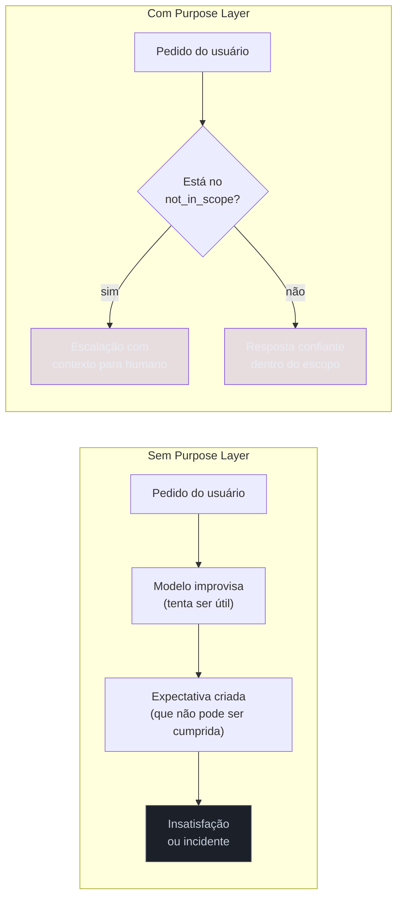

# Purpose Layer — o que o sistema é

> [!abstract] TL;DR
> A Purpose Layer é o documento fundador do sistema de IA — o único que não herda de nenhuma outra camada. Ela define quatro dimensões: o que o sistema faz (`primary_job`), pra quem (`target_user`), o que ele **não** faz (`not_in_scope`) e o critério mensurável de sucesso (`success_criteria`). Toda decisão de Prompt, Evaluation e Guardrail herda o que está aqui. Sem Purpose Layer fechada, você não está escrevendo um system prompt — está improvisando.

## O problema que a Purpose Layer resolve

> [!question]- Por que o campo `not_in_scope` importa mais do que o `primary_job`?
> Porque o `primary_job` define o que o sistema tenta fazer — e o modelo vai tentar, com ou sem esse campo. O `not_in_scope` é o que dá ao sistema o direito de recusar. Sem ele, cada pedido fora de escopo vira improvisação: o modelo tenta ajudar de alguma forma, cria expectativas que não podem ser cumpridas, e deixa o usuário mais insatisfeito do que se tivesse ouvido "isso não é comigo" desde o início.

Pergunte a cinco pessoas do mesmo time o que o sistema de IA faz. Se você receber cinco respostas diferentes, o sistema não tem Purpose Layer — cada pessoa construiu a sua parte baseada na interpretação que fez de uma reunião de kick-off.

O resultado é um sistema que tenta fazer tudo: aceita pedidos fora do escopo porque não sabe que estão fora, improvisa respostas em situações para as quais não foi projetado, e não tem como ser avaliado porque "ser útil" não é critério mensurável. Quando algo der errado, ninguém sabe se o problema é o modelo, o prompt, ou o escopo indefinido.

A Purpose Layer força uma decisão antes do código: **o que este sistema é** — e o que ele não é. O campo `not_in_scope` é o mais valioso do documento. É o que dá ao sistema o direito de dizer "não" com confiança e escalar para um humano em vez de improvisar uma resposta incorreta.



## O que é esta camada

A Purpose Layer é o **documento de escopo** do sistema — versionado como spec de produto, não como anotação de reunião. O template mínimo:

```yaml
purpose:
  type: "qa_bot | workflow | agent | pipeline | assistant"
  primary_job: "tarefa principal em uma frase com verbo no infinitivo"
  target_user: "persona concreta, não 'todo mundo'"
  not_in_scope:
    - "o que este sistema NÃO faz"
    - "o que escala para humano ou outro sistema"
  success_criteria:
    - "métrica mensurável 1"
    - "métrica mensurável 2"
```

O campo `type` categoriza o sistema pelo **papel** que desempenha, não pela tecnologia. "GPT-4 com RAG" não é um tipo de sistema; `qa_bot` é.

## Decisões-chave

**1. Descrever o propósito, não a tecnologia.** O `primary_job` deve dizer o que o sistema faz pela perspectiva do usuário. "Assistente com LLM" não é um propósito — é uma implementação. "Responder dúvidas de rastreamento de pedidos para clientes pós-compra" é. A diferença importa: o propósito pode permanecer estável enquanto a tecnologia muda de GPT-4 para Claude para fine-tuning. Teste de aceite: um usuário leigo entenderia o propósito sem saber nada de IA?

**2. `not_in_scope` é tão importante quanto `primary_job`.** A maioria dos times preenche o que o sistema faz e esquece de definir o que ele não faz. O `not_in_scope` é o que permite ao sistema recusar pedidos fora do escopo com confiança — sem ele, qualquer pedido inesperado vira improvisação do modelo. A regra de ouro: se o time vai responder "não é com este sistema", coloque no `not_in_scope`.

**3. Persona única vs múltiplas.** Tentar servir analista, gerente e estagiário com o mesmo sistema produz prompts mornos que não atendem bem nenhum dos três. Se dois perfis de usuário surgem com necessidades distintas, são dois sistemas — ou dois modos explícitos com contextos separados.

**4. `success_criteria` precisa ser mensurável antes do código.** "Ser útil" não é critério — é esperança. "Resolver o problema sem escalar em ≥80% das interações" é. Ter a métrica antes do desenvolvimento significa que a Evaluation Layer vai medir algo acordado, não algo inventado depois do go-live.

**5. Versionar como documento de produto.** A Purpose Layer muda quando o produto muda — escopo novo, usuário novo, restrição legal nova. Sem versionamento (Git, pelo menos), você perde o histórico de por que o escopo mudou. Mudança no escopo é uma decisão de produto — não uma edição silenciosa no system prompt.

## Casos práticos

### Cenário 1 — O sistema que negocia o que não pode

Assistente de atendimento de e-commerce sem `not_in_scope`. Um usuário pede reembolso para produto comprado há 45 dias (política: 30 dias). O modelo, instruído a ser "útil", improvisa: "posso verificar se há exceção para o seu caso". Não há — o sistema não tem autoridade para isso. Mas o usuário agora tem uma expectativa criada pelo modelo. Quando o suporte humano nega, o cliente fica mais insatisfeito do que se tivesse recebido um "não" direto desde o início.

A causa raiz: sem `not_in_scope`, o sistema não sabe que "negociar exceções à política de devolução" está fora do seu papel.

### Cenário 2 — O documento que evita dez reescritas de prompt

Mesmo time, segunda tentativa — Purpose Layer fechada antes de qualquer prompt:

```yaml
purpose:
  type: "qa_bot"
  primary_job: "responder dúvidas de rastreamento e política de devolução padrão"
  target_user: "clientes pós-compra acessando via chat no site"
  not_in_scope:
    - "negociar exceções à política de devolução (escala para humano)"
    - "processar estornos ou créditos (sistema legado separado)"
    - "reclamações de qualidade de produto (escala para pós-venda)"
  success_criteria:
    - "resolve a dúvida sem escalar em ≥80% dos casos"
    - "escalações incluem contexto suficiente para o humano continuar sem repetir"
```

Com esse documento aprovado: o system prompt tem um critério — instrui o modelo a reconhecer pedidos no `not_in_scope` e escalar com contexto. A Evaluation sabe o que medir. A Guardrail sabe o que bloquear. O Improvement Loop sabe o que é "melhoria". O time inteiro fala a mesma língua.

## Quando revisar a Purpose Layer

A Purpose Layer **deve** ser revisada — mas não a cada sprint. A regra é: revisar quando houver mudança de produto, não mudança de prompt.

Gatilhos que justificam revisão:

- Novo segmento de usuário (persona diferente exige contexto diferente → talvez sistema separado)
- Restrição legal ou regulatória nova (ex: LGPD, norma setorial) que altera o `not_in_scope`
- O Improvement Loop identificou que um caso de uso cresceu e agora merece ser `primary_job` em vez de edge case
- O sistema vai atender volume 10× maior — escala às vezes muda as suposições de `success_criteria`

Gatilhos que **não** justificam revisão (só prompt):

- O modelo está respondendo de forma estranha → Prompt Layer, não Purpose
- A busca no RAG está imprecisa → Retrieval Layer
- O custo por run aumentou → Tool Layer ou Logging + otimização

A Purpose Layer estável e bem-definida é o que permite que as outras camadas evoluam sem retrabalho. Cada revisão de Purpose deve ser tratada como uma decisão de produto: aprovada com o mesmo rigor de um PRD, não silenciosa.

## Armadilhas comuns

> [!warning] Descrever a tecnologia em vez do propósito
> "Um chatbot com GPT-4 e RAG" descreve implementação, não sistema. O problema: a implementação pode mudar completamente (RAG → fine-tuning, GPT-4 → Claude) — o propósito não muda. Escreva o `primary_job` como se a tecnologia fosse invisível. Se o propósito depende da tech stack, ele está errado.

> [!warning] Omitir o `not_in_scope`
> `not_in_scope` vazio é a causa raiz de scope creep em sistemas de IA. Sem ele, cada nova funcionalidade parece razoável ("o sistema já faz X, por que não Y também?"). Com ele, a resposta é objetiva: "Y não está no escopo — precisamos revisar a Purpose Layer antes de decidir." O documento transforma discussão de opinião em decisão documentada.

> [!warning] `success_criteria` subjetivos
> "Responder bem" e "ser útil" não são critérios — são desejos. A Evaluation Layer não consegue medir "útil" de forma consistente e replicável. O mínimo aceitável: taxa de sucesso com threshold definido antes do go-live. Sem isso, você não sabe quando o sistema está bom o suficiente para ir à produção — e vai ao ar antes de estar pronto.

## Como explicar em inglês

The Purpose Layer is the founding document of an AI system — the only layer that doesn't inherit from any other. It defines what the system does (`primary_job`), who it's for (`target_user`), what it explicitly does not do (`not_in_scope`), and the measurable definition of success (`success_criteria`). Every downstream layer — Prompt, Evaluation, Guardrail — inherits constraints from what Purpose defines. Without a closed Purpose Layer, you're not writing a system prompt; you're writing a wish list.

The most underrated field is `not_in_scope`: it gives the system the right to say "no" confidently and escalate to a human with context instead of improvising. Teams that skip it end up with models that over-promise — not because the model is bad, but because it was never told it could refuse.

**In a technical interview**, you might say:

> "Before writing any prompt, I close the Purpose Layer: primary_job, target_user, not_in_scope, and success_criteria. The not_in_scope field is the most important — it gives the system the right to say 'that's not for this system' and escalate with context instead of improvising an answer. Without it, every out-of-scope request becomes model improvisation, which creates expectations the system can't fulfill. With it, the whole team has the same mental model of what the system is — and what it isn't."

| PT | EN |
|----|----|
| Camada de propósito | Purpose Layer |
| Propósito principal | Primary job |
| Usuário-alvo | Target user |
| Fora de escopo | Not in scope / out of scope |
| Critério de sucesso | Success criterion |
| Escalar para humano | Escalate to human |
| Documento de escopo | Scope document |
| Persona do usuário | User persona |

## O que vem a seguir

Com o `primary_job` e o `not_in_scope` definidos, a próxima decisão mais importante é a bifurcação arquitetural em [[08 - Workflow vs Agent Layer]]: o sistema vai seguir um caminho fixo ou descobrir o caminho dinamicamente a cada execução? Essa decisão define a arquitetura inteira antes de você escrever uma linha de prompt.

Na sequência numérica, a próxima camada é o [[03 - Prompt Layer]] — que herda o `primary_job` da Purpose e o transforma em comportamento: role, padrões, ações permitidas, proibições, comportamento sob incerteza.

- [[03 - Prompt Layer]] — herda o `primary_job` e instrui o comportamento
- [[08 - Workflow vs Agent Layer]] — bifurcação arquitetural a decidir antes do prompt
- [[Spec-Driven Development]] → [[04 - Fase Specify]] — como formalizar specs completas de sistema

## Onde aprofundar

- **[[Spec-Driven Development]]** — a Fase Specify é a versão completa e formalizada da Purpose Layer; [[04 - Fase Specify]] monta o documento passo a passo com exemplos de cada campo.

## Veja também

- [[01 - As 11 camadas — visão geral]] — panorama do stack e ordem de construção
- [[03 - Prompt Layer]] — herda o `primary_job`
- [[08 - Workflow vs Agent Layer]] — a bifurcação que a Purpose define
- [[09 - Evaluation Layer]] — usa `success_criteria` como rubrica

## Fontes

- **@hooeem** — *Become an AI Engineer*, chapter #18, Step 1 (Purpose layer template). X/Twitter, 2025.
- **Anthropic** — [*Building effective agents*](https://www.anthropic.com/engineering/building-effective-agents) (2024). Seção sobre definir escopo e critérios antes da arquitetura.


