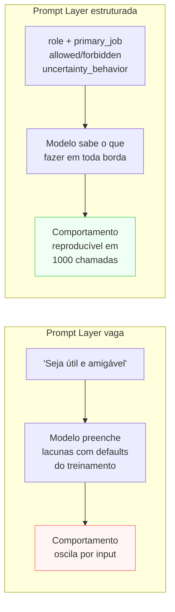

# Prompt Layer

> [!abstract] TL;DR
> A Prompt Layer define **como o modelo deve se comportar** — não o que ele sabe (isso é Context Layer), nem o que ele entrega (isso é Output Layer). Aqui ficam: role, `primary_job` herdado da Purpose, padrões de qualidade, ações permitidas, ações proibidas, comportamento sob incerteza e estilo de raciocínio. É o system prompt tratado como **artefato versionado**, não como bloco de texto improvisado. Quando bem feita, estabiliza o comportamento do modelo em mil chamadas diferentes; quando mal feita, o sistema oscila a cada mudança de input.

## O problema que a Prompt Layer resolve

"Seja útil, amigável e preciso." Isso é um system prompt? É — mas é tão vago que o modelo vai preencher o restante com os defaults do treino. Para uma aplicação genérica talvez seja suficiente. Para um sistema em produção que precisa de comportamento consistente e auditável, não é.

O que acontece sem Prompt Layer bem estruturada: o modelo decide sozinho qual é o role (às vezes vira assistente entusiasmado, às vezes vira especialista formal), inventa critérios de qualidade que não foram definidos, e quando não sabe a resposta, pode inventar ao invés de escalá-la. Cada novo sistema prompt escrito para cobrir um novo caso é um sinal de que o original não tinha estrutura.

A Prompt Layer transforma intenção em especificação. O campo `uncertainty_behavior` — o que fazer quando o modelo não sabe — é um dos mais importantes e raramente preenchido. Sem ele, o modelo decide por conta própria o que fazer nas bordas. Nas bordas é onde os incidentes acontecem.



## O que é esta camada

A Prompt Layer materializa **comportamento desejado** em texto. É o lugar onde "queremos um assistente cuidadoso e direto" vira instruções que o modelo segue de forma reprodutível.

Template mínimo (adaptado do thread @hooeem):

```yaml
role: "<quem o modelo é nesta interação>"
primary_job: "<herda do Purpose Layer — não reescrever>"
primary_standard: "<o critério principal pelo qual o modelo se autoavalia>"
allowed_actions:
  - "<ação permitida 1>"
  - "<ação permitida 2>"
forbidden_actions:
  - "<proibição 1 — comportamento a evitar>"
  - "<proibição 2>"
uncertainty_behavior: "<o que fazer quando não sabe: perguntar / avisar / escalar>"
reasoning_style: "<conciso | exploratório | step-by-step | ...>"
```

> [!question]- `forbidden_actions` no Prompt vs Guardrail Layer: qual a diferença?
> O Prompt Layer **pede** comportamento ao modelo. O `forbidden_actions` aqui é uma instrução — o modelo pode ignorá-la sob pressão de jailbreak ou em edge cases incomuns. A Guardrail Layer **impõe** comportamento por código fora do modelo (regex, classificador, validador) — não depende do modelo obedecer. As duas trabalham juntas: Prompt reduz frequência de comportamentos indesejados; Guardrail elimina os que passaram. Ver [[10 - Guardrail Layer]].

## Decisões-chave

**1. Role específico vs genérico.** "Você é um assistente útil" é zero informação — o modelo vai preencher o resto com os padrões do treinamento. "Você é editor sênior de uma revista de tecnologia que prioriza clareza sobre abrangência e ceticismo sobre entusiasmo" molda decisões reais: quando o modelo está em dúvida entre ser abrangente ou ser claro, escolhe claro. Um role específico reduz variância de comportamento.

**2. Tom do `uncertainty_behavior`.** Três comportamentos comuns: **(a) ask back** — pede esclarecimento antes de responder (bom para tarefas abertas); **(b) flag and proceed** — responde com aviso de baixa confiança (bom para perguntas com resposta aproximada); **(c) stop and escalate** — recusa e encaminha para humano (bom para domínios de alto risco). A escolha define a UX nas bordas — que é justamente onde os usuários mais precisam de consistência.

**3. Tamanho do system prompt.** Prompt longo gasta tokens em **toda** chamada. Um system prompt de 2000 tokens chamado 10.000 vezes por dia é 20 milhões de tokens de contexto/dia só de overhead. Use prompt caching quando disponível. E primeiro: prune o que não muda comportamento — instruções decorativas que o modelo seguiria de qualquer forma são desperdício.

**4. Few-shot vs zero-shot.** Adicionar 2-3 exemplos de input→output no system prompt geralmente eleva qualidade mais do que reescrever as instruções. Custa tokens, mas é a alavanca de melhor ROI quando o modelo "quase acerta mas com formato errado". Coloque os exemplos como últimas seções antes do `</instructions>` — proximidade com a chamada importa.

**5. Versionamento como código.** O system prompt é um artefato de produto. Trate como código: arquivo separado no repositório, diff em PR, número de versão no nome do arquivo (`system_prompt_v1.2.txt`). A Logging Layer precisa registrar qual versão rodou em cada chamada — sem isso, você não sabe se uma melhoria de qualidade veio do novo prompt ou do novo contexto.

## Anatomia de um system prompt eficaz

Um system prompt bem estruturado tem seções na ordem que o modelo lê — do mais geral para o mais específico:

```
[IDENTIDADE]
Role e primary_job — quem o modelo é e o que faz

[PADRÕES]
primary_standard — o critério de autoavaliação
Qualidade esperada, nível de detalhe, tom

[PERMISSÕES E LIMITES]
allowed_actions — o que pode fazer
forbidden_actions — o que não pode, em nenhuma circunstância

[BORDAS E INCERTEZA]
uncertainty_behavior — o que fazer quando não sabe
Comportamento sob ambiguidade de input

[SAÍDA]
Ponteiro para Output Layer (formato esperado)
Few-shot examples se necessário

[METADADOS]
Número de versão (para correlação nos logs)
Data de vigência
```

Cada seção tem uma função clara. O modelo lê o prompt inteiro antes de gerar — então a ordem importa para dar contexto antes das restrições. Identidade primeiro estabelece o frame; restrições depois fazem sentido dentro do frame.

### Exemplo trabalhado — do template vazio ao system prompt completo

Para ver a anatomia funcionando de ponta a ponta, vale preencher o template inteiro para um caso concreto — um assistente de triagem de suporte técnico — e comparar com a versão minimalista do Cenário 3 mais adiante.

Preenchendo cada seção da anatomia, na ordem em que o modelo lê:

```yaml
# [IDENTIDADE]
role: "Assistente de triagem de suporte técnico da plataforma X"
primary_job: "identificar a categoria do problema relatado e o próximo passo correto —
              resolver diretamente, pedir mais informação, ou encaminhar para humano"

# [PADRÕES]
primary_standard: "precisão sobre velocidade — melhor admitir incerteza do que
                   responder rápido e errado sobre dinheiro ou dados de conta"

# [PERMISSÕES E LIMITES]
allowed_actions:
  - "responder dúvidas cobertas pela documentação de produto fornecida"
  - "pedir informação adicional quando o relato do usuário for ambíguo"
forbidden_actions:
  - "afirmar políticas de reembolso, cobrança ou dados de conta não confirmados
     explicitamente nos documentos fornecidos"
  - "prometer prazos que não estão documentados"

# [BORDAS E INCERTEZA]
uncertainty_behavior: "stop and escalate: quando a pergunta envolver política financeira,
                       reembolso ou dado de conta não confirmado nos documentos, responder
                       'não tenho essa informação confirmada — vou encaminhar para um
                       atendente humano' e parar"

# [SAÍDA]
# formato: ver Output Layer — resposta curta + categoria + próximo passo estruturado

# [METADADOS]
# versão: triagem_suporte_v1.0 — vigente desde 2026-07-01
```

A diferença entre este template preenchido e a frase solta "seja útil e preciso" não é extensão — é que cada seção responde a uma pergunta que o modelo, de outra forma, teria que adivinhar: quem sou (identidade), pelo que sou julgado (padrão), o que posso e não posso fazer (permissões), o que faço quando não sei (bordas). Um role bem escrito sem `uncertainty_behavior` ainda deixa a borda mais perigosa do sistema em aberto — é exatamente essa lacuna que o Cenário 3 explora abaixo.

## Casos práticos

### Cenário 1 — O prompt que cresce sem parar

Assistente de Q&A jurídico. Toda vez que o modelo responde de forma incorreta, o time adiciona uma nova instrução ao system prompt: "nunca cite o artigo X sem citar o Y", "sempre avise se a lei mudou recentemente", "não responda sobre direito penal sem avisar que não é advogado"... Após seis meses, o prompt tem 4.000 tokens e ainda oscila.

O problema não é o tamanho — é que cada instrução foi adicionada para cobrir um caso específico sem um princípio subjacente. Sem `primary_standard` ("aplica sempre o princípio da cautela máxima em respostas sobre consequências legais"), cada novo caso requer nova instrução.

### Cenário 2 — Role + uncertainty_behavior + versão

Mesmo assistente, reconstruído:

```yaml
role: "Consultor jurídico de triagem que identifica a área de direito relevante e 
      orienta sobre próximos passos — sem substituir advogado"
primary_job: "identificar área jurídica e orientar próximos passos para consulta"
primary_standard: "cautela máxima — prefira reconhecer limite a especular sobre consequências legais"
uncertainty_behavior: "stop and escalate: 'não tenho informação suficiente pra orientar 
                       este caso com segurança. Recomendo consulta com advogado especializado em [área].'"
forbidden_actions:
  - "afirmar qual será o resultado de um processo"
  - "citar legislação sem verificar se ainda está em vigor"
```

Com esse template, o model sabe o que fazer nas bordas — e as bordas são a maioria dos casos jurídicos difíceis.

### Cenário 3 — O prompt minimalista que inventa resposta em vez de escalar

Um time sobe rápido um assistente interno de suporte técnico. O system prompt em produção é este:

```yaml
role: "Assistente de suporte técnico da plataforma X"
primary_job: "responder dúvidas de usuários sobre a plataforma"
reasoning_style: "conciso"
```

Sem `uncertainty_behavior`, sem `forbidden_actions`. Funciona bem em testes manuais — as perguntas do time interno são as óbvias, o modelo responde certo. Em produção, um usuário pergunta se pode cancelar um pagamento já processado e ser reembolsado automaticamente. Isso não está em nenhum documento que o modelo tenha visto. Sem instrução sobre o que fazer diante do desconhecido, o modelo **completa o padrão mais provável**: gera uma resposta plausível e afirmativa — "sim, o reembolso é processado em até 5 dias úteis" — porque é o tipo de frase que estatisticamente segue perguntas desse formato. Não existe política de reembolso automático. O usuário aciona o suporte humano cobrando o prazo, e ninguém sabe de onde veio a promessa.

O bug não está no modelo "alucinando por conta própria" — está no campo que faltou. Um `uncertainty_behavior: "stop and escalate: quando a pergunta envolver política financeira, reembolso ou dados de conta não confirmados nos documentos fornecidos, responda 'não tenho essa informação confirmada — vou encaminhar para um atendente humano' e pare"` fecha exatamente essa lacuna: troca "completar o padrão" por "declarar o limite". A correção não foi reescrever o role nem adicionar mais regras soltas — foi preencher o único campo do template que já existia para isso.

> [!danger] P1 em produção — prompt sem `uncertainty_behavior`
> Esse é o padrão de incidente mais comum de Prompt Layer malfeita: não é o modelo "mentindo" — é a ausência de uma instrução explícita para a borda que faz o modelo tratar "eu não sei" como "eu preciso preencher algo plausível". Toda Prompt Layer que vai para produção precisa responder, antes do primeiro deploy: *o que o modelo faz quando a pergunta sai do que os documentos cobrem?* Se a resposta não está escrita no prompt, ela vai ser inventada pelo modelo — e nem sempre da forma que você esperaria.

## Armadilhas comuns

> [!warning] Não versionar o system prompt
> System prompt sem versão é sistema sem histórico de decisões. Quando o comportamento muda depois de uma "pequena edição", você não sabe o que mudou e por quê. Trate o system prompt como código de produção: Git, PR, revisão, versão semântica. A Logging Layer vai precisar do número de versão para correlacionar problemas com mudanças.

> [!warning] Confundir Prompt Layer com Context Layer
> O system prompt define **comportamento estático** — o role, os padrões, o que é permitido. O que muda a cada chamada (goal da sessão, histórico de decisões, documentos relevantes) é Context Layer. Misturar os dois no system prompt cria um prompt que precisa ser atualizado a cada chamada — o que anula o benefício do prompt caching e encarece cada requisição.

> [!warning] Forbidden_actions como única linha de defesa
> Uma instrução no system prompt é um pedido ao modelo, não uma garantia. Sob pressão de jailbreak, instruções de contexto longo, ou edge cases incomuns, modelos podem violar `forbidden_actions`. Se a consequência de violar uma regra é grave (dados sensíveis expostos, ações irreversíveis), a regra precisa estar na Guardrail Layer — não só no Prompt.

## Como explicar em inglês

The Prompt Layer is where you translate desired behavior into text that the model follows consistently. It defines the model's role, the primary job inherited from the Purpose Layer, quality standards, allowed and forbidden actions, and what to do under uncertainty. The key insight: the Prompt Layer *asks* for behavior — it does not *guarantee* it. For guaranteed enforcement, use the Guardrail Layer. Think of the Prompt as shaping 95% of cases correctly; the Guardrail catches the remaining 5%.

The `uncertainty_behavior` field is the most underrated — it defines what the model does at the edges, which is where incidents happen. A model told "if you don't know, say so clearly and escalate" behaves very differently from one told "do your best with available information."

**In a technical interview**, you might say:

> "I treat the system prompt as a versioned artifact, not a block of text. It has a clear structure: identity, quality standard, allowed actions, forbidden actions, uncertainty behavior. The `uncertainty_behavior` field is the one most teams skip — and it's the one that determines what happens when a user asks something the system wasn't designed to handle. I version the prompt in Git, the logging layer records which version ran per call, and the Improvement Loop compares performance across versions. Without versioning, you can't tell if a quality improvement came from the new prompt or from something else."

| PT | EN |
|----|----|
| Camada de prompt | Prompt Layer |
| Prompt de sistema | System prompt |
| Instruções de comportamento | Behavioral instructions |
| Ações permitidas | Allowed actions |
| Ações proibidas | Forbidden actions |
| Comportamento sob incerteza | Uncertainty behavior |
| Estilo de raciocínio | Reasoning style |
| Versionamento de prompt | Prompt versioning |
| Poucos exemplos | Few-shot examples |
| Zero exemplos | Zero-shot |

## O que vem a seguir

Com o comportamento do modelo definido no Prompt, a próxima decisão é o que o modelo **sabe** sobre esta execução específica: goal da sessão, audience, contexto do projeto, histórico de decisões. Isso é responsabilidade da Context Layer — montada dinamicamente a cada chamada, enquanto o Prompt permanece estático.

A distinção é importante: mudar o que o modelo sabe não exige mudar o prompt. Isso mantém o sistema estável e o prompt cacheável.

- [[04 - Context Layer]] — o que o modelo precisa saber nesta execução
- [[10 - Guardrail Layer]] — onde `forbidden_actions` são impostos por código
- [[Context Engineering]] — a trilha completa de como montar contexto dinâmico

## Onde aprofundar

- **[[Context Engineering]]** — especialmente [[01 - De prompt engineering a context engineering]] para entender onde a Prompt Layer se posiciona no panorama maior.
- **[[Prompt Engineering]]** — trilha dedicada a técnicas avançadas (CoT, ToT, few-shot, role prompting).

## Veja também

- [[02 - Purpose Layer — o que o sistema é]] — `primary_job` vem de lá
- [[04 - Context Layer]] — comportamento (aqui) vs conhecimento (lá)
- [[10 - Guardrail Layer]] — `forbidden_actions` aqui é aspiracional; lá é imposto
- [[11 - Logging Layer]] — precisa do número de versão do prompt em cada log

## Fontes

- **@hooeem** — *Become an AI Engineer*, chapter #18, Step 2 (Prompt layer template). X/Twitter, 2025.
- **Anthropic** — [*Prompt engineering overview*](https://docs.anthropic.com/en/docs/build-with-claude/prompt-engineering/overview). Estrutura recomendada de system prompt.
- **Anthropic** — [*Prompt caching*](https://docs.anthropic.com/en/docs/build-with-claude/prompt-caching). Custo de system prompts longos e como mitigar.
