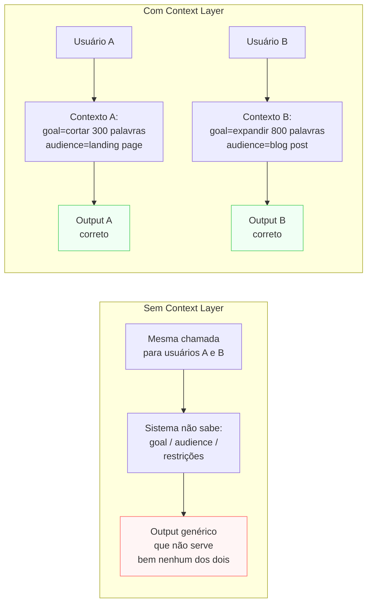

# Context Layer

> [!abstract] TL;DR
> A Context Layer responde **o que o modelo precisa saber** para tomar boas decisões nesta tarefa específica. Diferente do Prompt Layer (que define comportamento estático), o contexto é montado **dinamicamente** a cada execução: goal da sessão, audience, histórico de decisões, material de suporte, restrições e modos de falha conhecidos. É a camada onde Context Engineering vive — e onde o *context rot* surge quando a janela enche com informação que não importa mais.

## O problema que a Context Layer resolve

> [!question]- Qual a diferença entre Context Layer e Retrieval Layer?
> Context Layer é **o que você monta** para cada execução: goal da sessão, audience, histórico de decisões, material de suporte. Retrieval Layer é **o mecanismo** que buscou parte desse conteúdo em fontes externas. Um documento puxado de um vector DB é **Context** — o pipeline de busca que o trouxe é **Retrieval**. A confusão entre as duas leva a colocar lógica de busca no contexto (tornando-o inflexível) ou a não definir o que fazer com o conteúdo recuperado.

Imagine dois usuários fazendo a mesma pergunta ao mesmo sistema: "Revisar este texto". Para o usuário A, "revisar" significa cortar para 300 palavras (restrição de landing page). Para o usuário B, "revisar" significa expandir para 800 palavras (post de blog). O Prompt Layer não pode cobrir os dois — o comportamento correto depende do contexto de cada chamada.

Esse é o problema fundamental da Context Layer: o modelo precisa tomar decisões situadas — baseadas em quem está pedindo, para quê, com que restrições — mas essas informações mudam a cada execução. Empacotar tudo no system prompt faria o prompt crescer infinitamente. Ignorar essas informações faz o modelo trabalhar às cegas.



A Context Layer é a camada que resolve isso: define **o que vai no contexto de cada chamada** — e, igualmente importante, o que não vai. Uma janela de contexto cheia de informação irrelevante é tecnicamente igual a uma janela vazia do ponto de vista do modelo. *Context rot* — contexto que já era relevante mas não é mais — é a forma mais comum de degradar a qualidade de um sistema em produção.

## O que é esta camada

A Context Layer é o **ambiente informacional** montado para o modelo a cada execução. Não é estática como o system prompt, nem exige uma busca como a Retrieval Layer — é o conjunto curado de informação que **esta** tarefa específica precisa.

Template mínimo (adaptado do thread @hooeem):

```yaml
context:
  goal: "<objetivo específico desta sessão — o que o usuário quer conseguir>"
  audience: "<pra quem o output vai — influencia tom e profundidade>"
  project_context: "<estado do projeto, restrições, decisões já tomadas>"
  source_material: "<documentos ou dados relevantes; pode ser referência por id>"
  preferences: "<padrões da casa, exemplos a evitar, tom preferido>"
  constraints: "<limites de tokens, prazo, formato obrigatório>"
  decision_history: "<decisões anteriores que ainda valem — especialmente em agents>"
  known_failure_modes: "<onde sistemas anteriores erraram neste domínio>"
```

A diferença prática com o Prompt Layer: o **Prompt** é o mesmo em mil chamadas; o **Context** muda a cada chamada (ou a cada sessão). Ambos vivem na janela de contexto, mas com papéis distintos.

## Decisões-chave

**1. O que persiste vs o que é transiente.** Contexto tem três horizontes de vida: **(a) persistente** — preferências do usuário, configurações de projeto, regras da casa (duram meses); **(b) por sessão** — decision history, goal da sessão (duram horas); **(c) por turn** — source material específico, instrução imediata (duram uma chamada). Misturar horizontes na mesma camada sem distinção faz o contexto crescer com o que deveria ter expirado.

**2. Pull vs push.** Empurrar todo material potencialmente relevante de uma vez infla a janela e produz *context rot*. Puxar sob demanda (JIT retrieval — busca o documento quando o modelo pede, não antes) preserva atenção e mantém a janela enxuta. A escolha depende de previsibilidade: se você sabe que o documento X vai ser necessário em 90% das chamadas, empurre. Se não sabe, espere o modelo pedir.

**3. Compressão vs fidelidade.** Um documento longo pode ser passado ao modelo de três formas: (a) bruto (máxima fidelidade, máximo custo de tokens); (b) resumido por outro LLM (perde nuance, economiza tokens); (c) indexado para retrieval (acessa trechos sob demanda). A escolha depende de quanto cada nuance importa para a tarefa — e do orçamento de tokens.

**4. Decision history em sessões longas.** Em fluxos multi-turno ou agents autônomos, o histórico de decisões já tomadas é parte do contexto. Sem ele, o agent pode "esquecer" o que já tentou e repetir o mesmo erro — ou contradizer uma decisão anterior. O `decision_history` é o mecanismo formal de memória de curto prazo do sistema.

**5. Known failure modes como contexto preventivo.** Listar onde o sistema costuma errar — "anteriormente, este modelo confundiu X com Y neste domínio" — reduz recorrência sem mudar o sistema prompt. É auto-prompt-engineering situado: dá ao modelo informação sobre as bordas perigosas desta execução específica.

## Casos práticos

### Cenário 1 — Context rot que degrada um assistente de código

Assistente de pair programming que recebe o histórico completo da conversa como contexto. Depois de 40 turnos, o contexto inclui discussões sobre abordagens descartadas, código que foi reescrito e comentários sobre bugs já corrigidos. O modelo começa a sugerir a abordagem descartada no turno 5 — porque ela está mais próxima do limit do que a abordagem atual no turno 38.

O problema: sem limpeza periódica do contexto, o histórico inteiro vira ruído. Context rot acontece quando contexto relevante no passado deixa de ser relevante no presente — mas continua ocupando espaço na janela.

### Cenário 2 — Contexto dinâmico bem estruturado

Sistema de geração de conteúdo de marketing. A cada chamada, o contexto monta dinamicamente:

```yaml
context:
  goal: "gerar variação B do email de boas-vindas para teste A/B"
  audience: "leads enterprise que se inscreveram na demo do produto"
  project_context: "campanha Q3, foco em ROI, evitar promessas de tempo de implementação"
  source_material: "[id: brief_q3_enterprise]"
  preferences: "tom: confiante mas não agressivo; sem jargão de startup"
  constraints: "máximo 150 palavras; call-to-action único no final"
  decision_history: "variação A usou 'Bem-vindo à revolução'; evitar esse tom"
  known_failure_modes: "modelos tendem a usar 'potencializar' e 'ecossistema' — evitar"
```

Com esse contexto, o modelo sabe exatamente o que esta execução específica precisa — sem sobrepor o system prompt com especificidades que variam por campanha.

## Quando o contexto degrada — sinais práticos

*Context rot* não é um evento — é uma degradação gradual. Os sinais chegam antes de o sistema quebrar:

**Regressão a padrões antigos.** Em sessões longas ou agents com muitos turnos, o modelo começa a sugerir abordagens que foram explicitamente rejeitadas 10 turnos atrás. O histórico de decisões (`decision_history`) não foi atualizado ou está muito no início da janela para ser considerado.

**Inconsistência de persona.** O modelo responde como "assistente jurídico cauteloso" na primeira metade da sessão e como "especialista confiante" na segunda. Contexto de role foi diluído por conteúdo adicional empilhado na janela.

**Output genérico apesar de contexto rico.** O modelo ignora restrições específicas que foram passadas como contexto (`constraints: "máximo 150 palavras"`). Indicativo de que o contexto específico está enterrado no meio de contexto genérico — o modelo não está lendo até lá.

**Latência crescente sem carga adicional.** Sessões longas com contexto acumulado aumentam o tempo de inferência proporcionalmente ao tamanho da janela. Se a latência subiu mas a carga de usuários não mudou, o contexto provavelmente cresceu.

A estratégia de mitigação: compressão periódica (similar ao `/compact` do Claude Code), expiração por horizonte temporal, e limpar o contexto a cada unidade de trabalho concluída.

## Armadilhas comuns

> [!warning] Context rot não gerenciado
> Em sistemas de produção com sessões longas, o contexto cresce sem curadoria. Contexto do turno 3 que era relevante pode se tornar ruído no turno 30 — mas continua consumindo tokens e desviando atenção. Sistemas sem estratégia de compressão ou expiração de contexto degradam em qualidade à medida que as sessões ficam mais longas. Solução: defina horizontes de vida para cada campo do contexto; remova o que expirou antes de cada chamada.

> [!warning] Confundir Context Layer com Retrieval Layer
> Context Layer é **o que você monta** para cada execução: goal, audience, histórico de decisões. Retrieval Layer é **o mecanismo** que buscou parte desse conteúdo em fontes externas. Um documento puxado de um vector DB é Context — o pipeline de busca é Retrieval. A confusão leva a colocar lógica de retrieval no Context (tornando-o inflexível) ou a não definir o que fazer com o conteúdo recuperado.

> [!warning] Source material sempre bruto
> Passar documentos longos no contexto sem compressão é o caminho mais rápido para encher a janela com ruído. Um relatório de 50 páginas passado bruto vai consumir a maioria dos tokens disponíveis — e o modelo vai dar atenção desigual às diferentes partes. Para documentos longos, considere: sumário executivo + retrieval sob demanda dos detalhes.

## Como explicar em inglês

The Context Layer is the dynamic information environment assembled for the model at each execution. Unlike the Prompt Layer (which defines static behavior), context changes with every call: the session's goal, the audience, relevant source material, decision history, and known failure modes. The key challenge is curation — a context window full of irrelevant information performs the same as an empty one. Context rot (past-relevant information that's no longer relevant) is the most common quality degradation pattern in long-running production systems.

**In a technical interview**, you might say:

> "The Context Layer is what I mount dynamically per execution: the session goal, audience, relevant constraints, decision history, and known failure modes for this domain. The Prompt Layer is static and defines behavior; the Context Layer is dynamic and defines situation. The key engineering challenge is context rot — old decisions, abandoned approaches, and outdated material that accumulates in the window and dilutes the signal. I handle it with explicit horizons: persistent (user preferences, project rules), session-level (current goal, decisions made this session), and per-turn (specific source material). At the end of each major work unit, I compress or clear the session-level context."

| PT | EN |
|----|----|
| Camada de contexto | Context Layer |
| Apodrecimento de contexto | Context rot |
| Contexto dinâmico | Dynamic context |
| Histórico de decisões | Decision history |
| Modos de falha conhecidos | Known failure modes |
| Janela de contexto | Context window |
| Material de suporte | Source material |
| Compressão de contexto | Context compression |
| Busca sob demanda | Just-in-time (JIT) retrieval |

## O que vem a seguir

Com o contexto montado, o modelo tem o que precisa para produzir output. A próxima camada define **o que o output deve ser**: formato, schema, seções obrigatórias, e como o modelo deve estruturar a resposta. Output Layer vem antes de decidir qual o melhor prompt — porque saber o que sai é o que informa o que precisa entrar.

Para explorar como puxar conteúdo externo para o contexto dinamicamente, a Retrieval Layer cobre o mecanismo de busca e as políticas de quando e como recuperar.

- [[05 - Output Layer]] — o formato do que o modelo entrega
- [[06 - Retrieval Layer]] — como puxar conteúdo externo para o contexto
- [[Context Engineering]] — trilha completa: pipelines, compressão, camadas

## Onde aprofundar

- **[[Context Engineering]]** — trilha inteira (16 notas). Especialmente [[04 - Context pipelines — montagem dinâmica]] e [[05 - Camadas de contexto — persistente, temporal, transiente]].
- **[[Anatomia dos LLMs]]** → [[06 - A janela de contexto]] — o limite físico que a Context Layer gerencia.

## Veja também

- [[03 - Prompt Layer]] — comportamento (lá) vs conhecimento (aqui)
- [[05 - Output Layer]] — o contexto informa o output
- [[06 - Retrieval Layer]] — uma das fontes que alimenta o contexto
- [[08 - Workflow vs Agent Layer]] — agents têm gestão de contexto mais complexa

## Fontes

- **@hooeem** — *Become an AI Engineer*, chapter #18, Step 3 (Context layer template). X/Twitter, 2025.
- **Anthropic** — [*Effective context engineering for AI agents*](https://www.anthropic.com/engineering/effective-context-engineering-for-ai-agents) (2025).
- **Karpathy, Andrej** — *Tweet on context engineering* (jun 2025). "LLM é a CPU, janela de contexto é a RAM, você é o OS que gerencia os dois."


