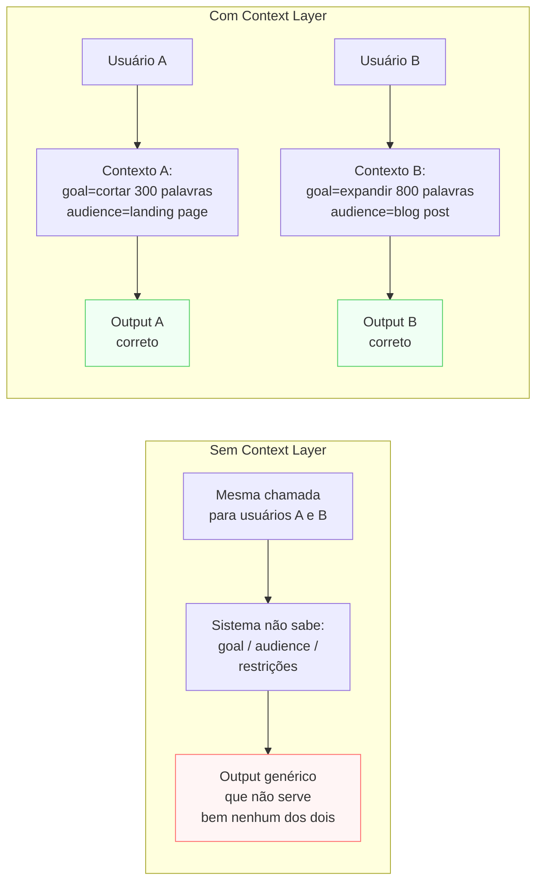
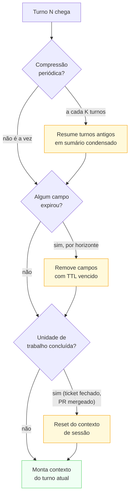

# Context Layer

> [!abstract] TL;DR
> A Context Layer responde **o que o modelo precisa saber** para tomar boas decisões nesta tarefa específica. Diferente do Prompt Layer (que define comportamento estático), o contexto é montado **dinamicamente** a cada execução: goal da sessão, audience, histórico de decisões, material de suporte, restrições e modos de falha conhecidos. É a camada onde Context Engineering vive — e onde o *context rot* surge quando a janela enche com informação que não importa mais.

## O problema que a Context Layer resolve

> [!question]- Qual a diferença entre Context Layer e Retrieval Layer?
> Context Layer é **o que você monta** para cada execução: goal da sessão, audience, histórico de decisões, material de suporte. Retrieval Layer é **o mecanismo** que buscou parte desse conteúdo em fontes externas. Um documento puxado de um vector DB é **Context** — o pipeline de busca que o trouxe é **Retrieval**. A confusão entre as duas leva a colocar lógica de busca no contexto (tornando-o inflexível) ou a não definir o que fazer com o conteúdo recuperado.

Imagine dois usuários fazendo a mesma pergunta ao mesmo sistema: "Revisar este texto". Para o usuário A, "revisar" significa cortar para 300 palavras (restrição de landing page). Para o usuário B, "revisar" significa expandir para 800 palavras (post de blog). O Prompt Layer não pode cobrir os dois — o comportamento correto depende do contexto de cada chamada.

Esse é o problema fundamental da Context Layer: o modelo precisa tomar decisões situadas — baseadas em quem está pedindo, para quê, com que restrições — mas essas informações mudam a cada execução. Empacotar tudo no system prompt faria o prompt crescer infinitamente. Ignorar essas informações faz o modelo trabalhar às cegas.



A Context Layer é a camada que resolve isso: define **o que vai no contexto de cada chamada** — e, igualmente importante, o que não vai. Uma janela de contexto cheia de informação irrelevante é tecnicamente igual a uma janela vazia do ponto de vista do modelo. *Context rot* — contexto que já era relevante mas não é mais — é a forma mais comum de degradar a qualidade de um sistema em produção.

## O que é esta camada

A Context Layer é o **ambiente informacional** montado para o modelo a cada execução. Não é estática como o system prompt, nem exige uma busca como a Retrieval Layer — é o conjunto curado de informação que **esta** tarefa específica precisa.

Template mínimo (adaptado do thread @hooeem):

```yaml
context:
  goal: "<objetivo específico desta sessão — o que o usuário quer conseguir>"
  audience: "<pra quem o output vai — influencia tom e profundidade>"
  project_context: "<estado do projeto, restrições, decisões já tomadas>"
  source_material: "<documentos ou dados relevantes; pode ser referência por id>"
  preferences: "<padrões da casa, exemplos a evitar, tom preferido>"
  constraints: "<limites de tokens, prazo, formato obrigatório>"
  decision_history: "<decisões anteriores que ainda valem — especialmente em agents>"
  known_failure_modes: "<onde sistemas anteriores erraram neste domínio>"
```

A diferença prática com o Prompt Layer: o **Prompt** é o mesmo em mil chamadas; o **Context** muda a cada chamada (ou a cada sessão). Ambos vivem na janela de contexto, mas com papéis distintos.

## Decisões-chave

**1. O que persiste vs o que é transiente.** Contexto tem três horizontes de vida: **(a) persistente** — preferências do usuário, configurações de projeto, regras da casa (duram meses); **(b) por sessão** — decision history, goal da sessão (duram horas); **(c) por turn** — source material específico, instrução imediata (duram uma chamada). Misturar horizontes na mesma camada sem distinção faz o contexto crescer com o que deveria ter expirado.

> [!example] O teste rápido para classificar um campo
> Pergunta a fazer sobre qualquer campo candidato a entrar no contexto: "se eu apagar isso amanhã, alguma sessão futura perde algo que importa?" Se a resposta é sim para qualquer sessão futura, é `persistent` (ex: "o usuário prefere respostas curtas e diretas" — vale para toda sessão futura). Se a resposta é sim só *dentro desta sessão*, é `session-level` (ex: "decidimos usar Postgres neste projeto" — só importa enquanto o projeto desta sessão estiver em foco). Se a resposta é não mesmo dentro da sessão, uma vez usado, é `per-turn` (ex: "o conteúdo do arquivo X que o usuário colou agora" — relevante para responder a pergunta deste turno, irrelevante daqui a 5 turnos). Classificar errado nesse teste é a causa mais comum de contexto que devia ter expirado e não expirou.

**2. Pull vs push.** Empurrar todo material potencialmente relevante de uma vez infla a janela e produz *context rot*. Puxar sob demanda (JIT retrieval — busca o documento quando o modelo pede, não antes) preserva atenção e mantém a janela enxuta. A escolha depende de previsibilidade: se você sabe que o documento X vai ser necessário em 90% das chamadas, empurre. Se não sabe, espere o modelo pedir.

> [!example] Exemplo trabalhado — custo por chamada, push vs pull
> Um assistente de suporte técnico tem acesso a uma base de conhecimento com 200 artigos. A cada pergunta do usuário, o sistema precisa decidir: empurra os artigos mais prováveis de antemão, ou espera o modelo pedir?
>
> **Push (empurrar os 5 artigos mais consultados, sempre):**
> - Custo fixo por chamada: ~3.000 tokens (5 artigos resumidos), em **100% das chamadas** — mesmo quando a pergunta não tem nada a ver com nenhum dos cinco.
> - Latência: zero round-trips extras — o conteúdo já está na janela.
> - Risco: nas chamadas em que o artigo certo não está entre os 5 (a maioria, numa KB de 200), o contexto empurrado é puro ruído — infla a janela sem ajudar.
>
> **Pull (JIT retrieval — busca sob demanda):**
> - Custo fixo por chamada: ~150 tokens (schema da tool de busca, sempre presente).
> - Custo variável: ~800 tokens de artigo recuperado, mas só nas chamadas em que o modelo de fato decide buscar (na prática, ~30% das perguntas exigem consulta à KB).
> - Custo médio ponderado: `150 + 0,30 × 800 = 390 tokens/chamada` — **8x mais barato** que o push fixo de 3.000 tokens, ao preço de um round-trip extra (latência) nas chamadas em que a busca dispara.
>
> A escolha não é sobre qual técnica é "melhor" em abstrato — é sobre a distribuição real de perguntas. Se 90% das perguntas fossem sobre os mesmos 5 artigos, o push venceria (custo fixo baixo, sem round-trip). Como a distribuição é dispersa (200 artigos, uso disperso), o pull vence em custo — o preço é a latência do round-trip e a dependência de o modelo "saber" que precisa buscar.

**3. Compressão vs fidelidade.** Um documento longo pode ser passado ao modelo de três formas: (a) bruto (máxima fidelidade, máximo custo de tokens); (b) resumido por outro LLM (perde nuance, economiza tokens); (c) indexado para retrieval (acessa trechos sob demanda). A escolha depende de quanto cada nuance importa para a tarefa — e do orçamento de tokens.

> [!example] Quando cada forma vence
> Um contrato de 40 páginas precisa alimentar um assistente jurídico. **Bruto** faz sentido se a tarefa é "revisar cláusula por cláusula em busca de riscos" — qualquer nuance de redação pode ser o risco que importa, e resumir apagaria justamente o que se procura. **Resumido por outro LLM** faz sentido se a tarefa é "que tipo de contrato é este e quais são as partes" — o modelo não precisa do texto integral para responder isso, só da essência. **Indexado para retrieval** faz sentido se o assistente vai responder perguntas pontuais ao longo de uma sessão longa ("qual é a cláusula de rescisão?") sem saber de antemão quais trechos vai precisar — cada pergunta recupera só o trecho relevante, em vez de manter as 40 páginas na janela o tempo todo. A pergunta que decide entre as três não é "qual é mais precisa" (bruto sempre vence nisso) — é "o que esta tarefa específica precisa ler para decidir bem, e quanto custa manter isso na janela até o fim da sessão".

**4. Decision history em sessões longas.** Em fluxos multi-turno ou agents autônomos, o histórico de decisões já tomadas é parte do contexto. Sem ele, o agent pode "esquecer" o que já tentou e repetir o mesmo erro — ou contradizer uma decisão anterior. O `decision_history` é o mecanismo formal de memória de curto prazo do sistema.

**5. Known failure modes como contexto preventivo.** Listar onde o sistema costuma errar — "anteriormente, este modelo confundiu X com Y neste domínio" — reduz recorrência sem mudar o sistema prompt. É auto-prompt-engineering situado: dá ao modelo informação sobre as bordas perigosas desta execução específica.

A relação entre as decisões 4 e 5 é próxima o suficiente para confundir: `decision_history` registra o que **este agent específico já decidiu nesta sessão** (evita contradizer a si mesmo); `known_failure_modes` registra o que **sistemas anteriores erraram neste domínio, de forma geral** (evita repetir um erro de classe, não um erro específico desta conversa). Um agent de triagem de tickets pode ter `known_failure_modes: "modelos tendem a classificar bugs de performance como bugs de infraestrutura"` — isso vale para todo ticket, independente do que foi decidido nesta sessão. Já `decision_history: "já descartamos a hipótese de infraestrutura para o ticket #1240"` vale só para este ticket, nesta sessão. Um alimenta o prompt de forma estável (é quase persistente); o outro alimenta o contexto de forma efêmera (expira com a sessão ou a unidade de trabalho, como visto na seção de pipelines).

**Síntese das cinco decisões** — cada uma responde uma pergunta diferente sobre o mesmo contexto:

| Decisão | Pergunta que resolve | Horizonte típico |
|---|---|---|
| 1. Persiste vs transiente | Por quanto tempo este campo deve viver? | Persistente / sessão / turn |
| 2. Pull vs push | Empurro agora ou espero o modelo pedir? | Depende da previsibilidade de uso |
| 3. Compressão vs fidelidade | Bruto, resumido, ou indexado? | Depende de quanta nuance importa |
| 4. Decision history | O que este agent já decidiu nesta sessão? | Sessão |
| 5. Known failure modes | Onde sistemas anteriores erraram neste domínio? | Persistente (quase-prompt) |

## Casos práticos

### Cenário 1 — Context rot que degrada um assistente de código

Assistente de pair programming que recebe o histórico completo da conversa como contexto. Depois de 40 turnos, o contexto inclui discussões sobre abordagens descartadas, código que foi reescrito e comentários sobre bugs já corrigidos. O modelo começa a sugerir a abordagem descartada no turno 5 — porque ela está mais próxima do limit do que a abordagem atual no turno 38.

O problema: sem limpeza periódica do contexto, o histórico inteiro vira ruído. Context rot acontece quando contexto relevante no passado deixa de ser relevante no presente — mas continua ocupando espaço na janela.

**Mitigação aplicada:** o mesmo assistente, com compressão periódica a cada 15 turnos, chegaria ao turno 40 com um sumário condensado dos turnos 1-15 ("abordagem X testada e descartada, motivo Y") em vez do histórico bruto. A abordagem descartada continuaria acessível — mas marcada explicitamente como descartada, não competindo em proximidade textual com a abordagem atual. Essa é a diferença entre "esquecer" e "lembrar de forma resumida e rotulada": o segundo preserva o sinal (a decisão) e descarta o ruído (o processo turno a turno que levou à decisão).

### Cenário 2 — Contexto dinâmico bem estruturado

Sistema de geração de conteúdo de marketing. A cada chamada, o contexto monta dinamicamente:

```yaml
context:
  goal: "gerar variação B do email de boas-vindas para teste A/B"
  audience: "leads enterprise que se inscreveram na demo do produto"
  project_context: "campanha Q3, foco em ROI, evitar promessas de tempo de implementação"
  source_material: "[id: brief_q3_enterprise]"
  preferences: "tom: confiante mas não agressivo; sem jargão de startup"
  constraints: "máximo 150 palavras; call-to-action único no final"
  decision_history: "variação A usou 'Bem-vindo à revolução'; evitar esse tom"
  known_failure_modes: "modelos tendem a usar 'potencializar' e 'ecossistema' — evitar"
```

Com esse contexto, o modelo sabe exatamente o que esta execução específica precisa — sem sobrepor o system prompt com especificidades que variam por campanha.

### Cenário 3 — Um agent de triagem de tickets ao longo de uma semana

Este cenário amarra as três mecânicas de pipeline (compressão periódica, expiração por horizonte, reset por unidade de trabalho) num fluxo contínuo — a diferença entre "saber a teoria" e "ver o contexto sendo gerenciado turno a turno".

Um agent de suporte técnico processa tickets ao longo de uma semana de trabalho. Sem gestão de contexto, o histórico cresceria linearmente: ticket #1 traz 15 turnos, ticket #2 mais 20, e por volta do ticket #10 o agent estaria carregando milhares de tokens de decisões e documentos que não têm nenhuma relação com o ticket atual.

**Segunda-feira, ticket #1234 (bug de autenticação):**

| Turno | Contexto ativo | Ação do pipeline |
|---|---|---|
| 1-8 | `goal`, `source_material` (logs do bug), `decision_history` vazio | Contexto cresce normalmente |
| 9 | Decisão tomada: "causa raiz é token expirado, não é bug de sessão" | Grava em `decision_history` (horizonte: sessão) |
| 15 | Ticket marcado como resolvido | **Reset por unidade de trabalho**: `decision_history` e `source_material` deste ticket são descartados |

**Terça-feira, ticket #1235 (bug não relacionado, em outro módulo):**

O agent começa com contexto de sessão limpo — nenhum resquício da investigação de autenticação do dia anterior. Só o que é `persistent` sobrevive: preferências de formatação de resposta, política de escalonamento da empresa, glossário de termos internos. Sem o reset, o modelo correria o risco de mencionar "token expirado" numa investigação sobre um problema de renderização de UI — um caso real do sintoma descrito na seção anterior (regressão a padrões antigos).

**Quarta a sexta, ticket #1240 (investigação longa, 45 turnos ao longo de 3 dias):**

Aqui as outras duas mecânicas entram em ação dentro do próprio ticket, porque ele é longo demais para caber inteiro na janela:

- **Compressão periódica**: a cada 15 turnos, o pipeline resume os turnos anteriores. Ao turno 30, os turnos 1-15 (brutos, ~4.500 tokens) viram um sumário de ~180 tokens: "hipótese A (cache desatualizado) testada e descartada no turno 6; hipótese B (race condition no worker) em investigação desde o turno 12; logs relevantes: `worker.log` linhas 340-410".
- **Expiração por horizonte**: o `source_material` de cada rodada de logs analisados expira assim que a hipótese associada é descartada — não faz sentido manter os logs completos da hipótese A na janela depois que ela foi eliminada no turno 6. Só o resumo da conclusão ("hipótese A descartada, motivo: X") persiste no `decision_history`.

O resultado prático: no turno 45, a janela contém um sumário compacto do progresso (não os 45 turnos brutos), o `source_material` ativo é só o dos logs da hipótese em investigação no momento, e o `decision_history` é uma lista curta de decisões que ainda importam — não um log completo de tudo que já foi dito. O agent chega ao turno 45 com a mesma qualidade de atenção que tinha no turno 5, porque o pipeline impediu que a janela virasse um arquivo morto de tudo que já aconteceu.

## Quando o contexto degrada — sinais práticos

*Context rot* não é um evento — é uma degradação gradual. Os sinais chegam antes de o sistema quebrar:

**Regressão a padrões antigos.** Em sessões longas ou agents com muitos turnos, o modelo começa a sugerir abordagens que foram explicitamente rejeitadas 10 turnos atrás. O histórico de decisões (`decision_history`) não foi atualizado ou está muito no início da janela para ser considerado.

**Inconsistência de persona.** O modelo responde como "assistente jurídico cauteloso" na primeira metade da sessão e como "especialista confiante" na segunda. Contexto de role foi diluído por conteúdo adicional empilhado na janela.

**Output genérico apesar de contexto rico.** O modelo ignora restrições específicas que foram passadas como contexto (`constraints: "máximo 150 palavras"`). Indicativo de que o contexto específico está enterrado no meio de contexto genérico — o modelo não está lendo até lá.

**Latência crescente sem carga adicional.** Sessões longas com contexto acumulado aumentam o tempo de inferência proporcionalmente ao tamanho da janela. Se a latência subiu mas a carga de usuários não mudou, o contexto provavelmente cresceu.

A estratégia de mitigação: compressão periódica (similar ao `/compact` do Claude Code), expiração por horizonte temporal, e limpar o contexto a cada unidade de trabalho concluída. As três mecânicas por trás dessa frase merecem ser desempacotadas — é aí que a teoria vira pipeline de produção.

### Context pipelines na prática

Saber que "context rot existe" não é suficiente para evitá-lo — é preciso um mecanismo concreto que rode a cada chamada ou a cada N turnos. Três mecânicas cobrem a maior parte dos casos de produção, e não são mutuamente exclusivas: um pipeline maduro normalmente combina as três.



**1. Compressão periódica.** A cada K turnos (K costuma ficar entre 15 e 30 em assistentes conversacionais), o pipeline substitui os turnos antigos por um sumário condensado — a mesma lógica do `/compact` do Claude Code. Um assistente de codificação que roda há 20 turnos pode ter ~4.000 tokens de histórico bruto nos primeiros 15 turnos; a compressão os reduz a um sumário de ~200 tokens do tipo: "decisões tomadas: usar Postgres em vez de SQLite (turno 3); abordagens rejeitadas: cache em memória por simplicidade (turno 7); arquivos tocados: `db.py`, `models.py`". O modelo perde os detalhes literais da conversa, mas mantém o que efetivamente orienta decisões futuras — que é o único motivo pelo qual aquele histórico estava no contexto.

**2. Expiração por horizonte.** Cada campo do contexto carrega um TTL implícito ligado ao horizonte de vida definido na Decisão 1 (persistente / por sessão / por turn). Na prática isso vira uma regra de descarte: campos marcados `per-turn` (como `source_material` de uma pergunta específica) são removidos assim que o turno em que foram usados termina — não faz sentido um documento puxado para responder à pergunta do turno 12 continuar ocupando espaço no turno 13. Campos `session-level` (como `decision_history`) sobrevivem até o fim da sessão. Só campos `persistent` (preferências do usuário, regras da casa) atravessam sessões. Sem essa marcação explícita por campo, tudo tende a ser tratado como persistente por omissão — e a janela só cresce.

**3. Reset por unidade de trabalho.** Em vez de deixar o contexto de sessão crescer indefinidamente enquanto o usuário permanece "logado", o pipeline zera o contexto de sessão a cada unidade de trabalho concluída — um ticket de suporte resolvido, um PR mergeado, uma tarefa do agent marcada como `done`. Um agent de suporte técnico que acabou de resolver o ticket #1234 descarta `decision_history` e `source_material` daquele ticket ao fechá-lo; o próximo ticket começa com contexto de sessão limpo, preservando só o que é persistente (preferências do usuário, histórico de tickets anteriores como referência de longo prazo, se for esse o design). Isso evita que decisões do ticket #1234 vazem — por acidente de proximidade na janela — para o raciocínio sobre o ticket #1235, que pode ser de um domínio completamente diferente.

| Mecanismo | Frequência | O que remove | Análogo |
|---|---|---|---|
| Compressão periódica | A cada K turnos | Detalhe literal → sumário | `/compact` do Claude Code |
| Expiração por horizonte | Contínua, por campo | Campos com TTL vencido | Garbage collector por geração |
| Reset por unidade de trabalho | No fim de cada tarefa | Todo contexto de sessão | Fechar uma aba do navegador |

Nenhum dos três mecanismos substitui os outros — eles operam em escalas de tempo diferentes. Compressão periódica atua *dentro* de uma unidade de trabalho longa (o ticket #1240 do Cenário 3, que levou 45 turnos). Expiração por horizonte atua em cada campo individualmente, o tempo todo. Reset por unidade de trabalho atua na fronteira *entre* unidades de trabalho (a virada do ticket #1234 para o #1235). Um pipeline de produção que implementa só um dos três ainda vai degradar — só que na escala de tempo que o mecanismo ausente deveria cobrir.

## Armadilhas comuns

> [!warning] Context rot não gerenciado
> Em sistemas de produção com sessões longas, o contexto cresce sem curadoria. Contexto do turno 3 que era relevante pode se tornar ruído no turno 30 — mas continua consumindo tokens e desviando atenção. Sistemas sem estratégia de compressão ou expiração de contexto degradam em qualidade à medida que as sessões ficam mais longas. Solução: defina horizontes de vida para cada campo do contexto; remova o que expirou antes de cada chamada.

> [!warning] Confundir Context Layer com Retrieval Layer
> Context Layer é **o que você monta** para cada execução: goal, audience, histórico de decisões. Retrieval Layer é **o mecanismo** que buscou parte desse conteúdo em fontes externas. Um documento puxado de um vector DB é Context — o pipeline de busca é Retrieval. A confusão leva a colocar lógica de retrieval no Context (tornando-o inflexível) ou a não definir o que fazer com o conteúdo recuperado.

> [!warning] Source material sempre bruto
> Passar documentos longos no contexto sem compressão é o caminho mais rápido para encher a janela com ruído. Um relatório de 50 páginas passado bruto vai consumir a maioria dos tokens disponíveis — e o modelo vai dar atenção desigual às diferentes partes. Para documentos longos, considere: sumário executivo + retrieval sob demanda dos detalhes.

> [!warning] Reset agressivo demais apaga continuidade útil
> O reset por unidade de trabalho (Cenário 3) resolve o context rot entre tarefas não relacionadas, mas tem um limite: se o reset acontece cedo demais — no meio de uma investigação, ou entre subtarefas que na verdade dependem uma da outra — o agent perde decisões que ainda importavam. Um sintoma comum é o agent repetir uma pergunta que o usuário já respondeu duas mensagens atrás, porque o pipeline confundiu "subtarefa concluída" com "unidade de trabalho concluída". A granularidade certa do reset é a mesma pergunta da Decisão 1 aplicada ao nível da tarefa: "esta informação ainda importa para a próxima coisa que vou fazer?" — se sim, o reset foi cedo demais.

## Como explicar em inglês

The Context Layer is the dynamic information environment assembled for the model at each execution. Unlike the Prompt Layer (which defines static behavior), context changes with every call: the session's goal, the audience, relevant source material, decision history, and known failure modes. The key challenge is curation — a context window full of irrelevant information performs the same as an empty one. Context rot (past-relevant information that's no longer relevant) is the most common quality degradation pattern in long-running production systems.

**In a technical interview**, you might say:

> "The Context Layer is what I mount dynamically per execution: the session goal, audience, relevant constraints, decision history, and known failure modes for this domain. The Prompt Layer is static and defines behavior; the Context Layer is dynamic and defines situation. The key engineering challenge is context rot — old decisions, abandoned approaches, and outdated material that accumulates in the window and dilutes the signal. I handle it with explicit horizons: persistent (user preferences, project rules), session-level (current goal, decisions made this session), and per-turn (specific source material). At the end of each major work unit, I compress or clear the session-level context."
>
> "In practice, that's three concrete mechanisms working together: periodic compression — summarizing older turns instead of keeping them raw; horizon-based expiry — dropping each field once its declared lifetime is up; and a reset at the boundary between task units, so one ticket's decisions don't bleed into the next."

| PT | EN |
|----|----|
| Camada de contexto | Context Layer |
| Apodrecimento de contexto | Context rot |
| Contexto dinâmico | Dynamic context |
| Histórico de decisões | Decision history |
| Modos de falha conhecidos | Known failure modes |
| Janela de contexto | Context window |
| Material de suporte | Source material |
| Compressão de contexto | Context compression |
| Busca sob demanda | Just-in-time (JIT) retrieval |
| Compressão periódica | Periodic compression |
| Expiração por horizonte | Horizon-based expiry |
| Reset por unidade de trabalho | Per-task-unit reset |

## O que vem a seguir

Com o contexto montado, o modelo tem o que precisa para produzir output. A próxima camada define **o que o output deve ser**: formato, schema, seções obrigatórias, e como o modelo deve estruturar a resposta. Output Layer vem antes de decidir qual o melhor prompt — porque saber o que sai é o que informa o que precisa entrar.

Para explorar como puxar conteúdo externo para o contexto dinamicamente, a Retrieval Layer cobre o mecanismo de busca e as políticas de quando e como recuperar.

- [[05 - Output Layer]] — o formato do que o modelo entrega
- [[06 - Retrieval Layer]] — como puxar conteúdo externo para o contexto
- [[Context Engineering]] — trilha completa: pipelines, compressão, camadas

## Onde aprofundar

- **[[Context Engineering]]** — trilha inteira (16 notas). Especialmente [[04 - Context pipelines — montagem dinâmica]] e [[05 - Camadas de contexto — persistente, temporal, transiente]].
- **[[Anatomia dos LLMs]]** → [[06 - A janela de contexto]] — o limite físico que a Context Layer gerencia.

A subseção "Context pipelines na prática" acima é o resumo operacional; a trilha de Context Engineering cobre a implementação em profundidade — inclusive variações de janela de compressão (K) e estratégias de sumarização por LLM auxiliar.

## Veja também

- [[03 - Prompt Layer]] — comportamento (lá) vs conhecimento (aqui)
- [[05 - Output Layer]] — o contexto informa o output
- [[06 - Retrieval Layer]] — uma das fontes que alimenta o contexto
- [[08 - Workflow vs Agent Layer]] — agents têm gestão de contexto mais complexa

## Fontes

- **@hooeem** — *Become an AI Engineer*, chapter #18, Step 3 (Context layer template). X/Twitter, 2025.
- **Anthropic** — [*Effective context engineering for AI agents*](https://www.anthropic.com/engineering/effective-context-engineering-for-ai-agents) (2025).
- **Karpathy, Andrej** — *Tweet on context engineering* (jun 2025). "LLM é a CPU, janela de contexto é a RAM, você é o OS que gerencia os dois."
- **Claude Code** — comando `/compact`, referência prática de compressão periódica de contexto em produção.
- **Vault** — [[Context Engineering]], trilha companheira que aprofunda os pipelines de montagem e compressão de contexto citados acima.
