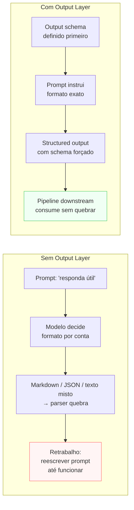

# Output Layer

> [!abstract] TL;DR
> A Output Layer define **em que formato o modelo entrega o resultado** — e por que isso é uma decisão arquitetural, não estética. Markdown para leitura humana, JSON tipado para consumo por código, schema rígido para pipelines que não toleram variação. As decisões-chave: formato primário, seções obrigatórias, como sinalizar incerteza, e se o output é ação direta ou sugestão. Sistemas que definem o contrato de saída antes do prompt conseguem encadear pipelines determinísticos; sistemas que não definem produzem texto bonito que nenhum código consegue parsear.

## O problema que a Output Layer resolve

> [!question]- Por que definir o output antes do prompt e não depois?
> Porque o prompt precisa saber o que exigir. Se você define que o output é um JSON com campos `risk_level` e `recommendation`, o prompt instrui o modelo a preencher esses campos. Se você define o output depois, frequentemente descobre que o prompt prometeu algo que o modelo não consegue manter de forma consistente — e você reescreve o prompt cinco vezes para alinhar. A ordem correta é: **contrato de saída primeiro, instrução depois**.

Você finalmente conseguiu um modelo respondendo bem. Bom. Agora o próximo passo do pipeline precisa dos dados em JSON para gravar no banco. O modelo responde em markdown com o JSON dentro de um bloco de código. O parser quebra na metade dos casos porque às vezes o modelo coloca `json` no fence e às vezes não coloca. Você adiciona uma instrução no prompt: "responda em JSON". O modelo começa a responder em JSON mas às vezes adiciona um parágrafo introdutório antes do `{`. O parser quebra de novo.

Esse é o problema da Output Layer indefinida: o formato do output é tratado como detalhe, mas quem consome o output (código, outro modelo, usuário final) precisa de uma interface previsível. "Texto em linguagem natural" é suficiente quando o consumidor é humano. Quando o consumidor é código, você precisa de um **contrato de saída**.

A Output Layer define esse contrato antes do prompt — porque sabendo o que precisa sair, você sabe o que o prompt precisa exigir.



## O que é esta camada

A Output Layer é o **contrato de saída** do sistema. Define o que sai, em qual estrutura, com quais campos obrigatórios, e como o modelo sinaliza incerteza ou casos fora do esperado.

Template mínimo (adaptado do thread @hooeem):

```yaml
output:
  primary_format: "markdown | json | xml | tabela | checklist | texto-livre"
  required_sections:
    - "<seção obrigatória 1>"
    - "<seção obrigatória 2>"
  confidence_level: "obrigatório | opcional | não-aplicável"
  uncertainty_flags:
    - "campo 'assumptions': premissas que o modelo fez"
    - "campo 'missing_data': o que faltou pra responder com certeza"
  actionability: "ação direta | sugestão com raciocínio | análise pura"
```

Para output não-trivial consumido por código, vale formalizar via JSON Schema, Pydantic ou TypeScript types. Modelos de fronteira suportam **structured outputs** que **garantem** aderência ao schema — o modelo é forçado a produzir o formato certo, não apenas instruído.

## Decisões-chave

**1. Markdown vs JSON — qual o consumidor do output.** Markdown é legível por humano; JSON é consumível por código. A escolha não é estética — é quem vai ler. Misturar ("responda em markdown, com um bloco JSON quando relevante") é o pior dos dois mundos: o humano precisa interpretar o JSON, o código precisa parsear o markdown. Quando o output vai para uma pipeline, vá direto para JSON estrito com schema validado.

**2. Schema rígido vs leve.** Schema rígido (campos obrigatórios, tipos validados, sem campos extras) reduz alucinação de campos, facilita validação downstream, mas pode penalizar quando o modelo precisa sinalizar caso fora do esperado. Schema leve (required mínimo, muitos optional) dá flexibilidade mas exige validação pós-hoc mais robusta. Regra prática: rígido para pipelines automatizados; leve para assistentes com revisão humana.

**3. Confidence como campo obrigatório muda comportamento.** Forçar o modelo a emitir um campo `confidence` (`high|medium|low`) o faz se calibrar durante a geração — ele precisa escolher um nível, o que muda como constrói a resposta. Útil como entrada para a Guardrail Layer: outputs com `confidence: low` rodam para revisão humana antes de ir à produção.

**4. Uncertainty flags nomeados previnem hedge prosaico.** Campos como `assumptions`, `missing_data` e `caveats` criam um lugar explícito para o modelo guardar incerteza. Sem eles, a incerteza vira linguagem hedgeada ("pode ser que...", "em geral...") no meio do texto útil — impossível de parsear ou filtrar.

**5. Actionability: output como ação vs como sugestão.** Output que **é** a ação (uma chamada de função pronta para executar) tem latência mais baixa e menos risco de interpretação incorreta. Output que **sugere** uma ação preserva humano-no-loop. A escolha depende de quão irreversível é a ação e de quanto você confia na qualidade atual do modelo para esse tipo de tarefa.

## Casos práticos

### Cenário 1 — O pipeline que quebra silenciosamente

Sistema de análise de contratos: modelo lê PDFs jurídicos e extrai cláusulas de risco. Output definido como "lista de riscos em markdown". Funciona bem no protótipo — um analista lê a lista e toma decisão. Na versão v2, querem automatizar: outro sistema lê a lista de riscos e dispara alertas.

O problema: "lista em markdown" tem 15 formatos possíveis (com traço, com asterisco, numerada, com sub-listas). O segundo sistema parseia com regex e quebra em 40% dos casos. A solução não é melhorar o regex — é definir o contrato de saída antes de construir o pipeline:

```json
{
  "risks": [
    {
      "clause": "string",
      "risk_level": "low|medium|high|critical",
      "description": "string",
      "recommendation": "string"
    }
  ],
  "confidence": "high|medium|low",
  "missing_data": ["string"]
}
```

Com esse schema, o segundo sistema tem uma interface estável. Mudanças no modelo não quebram o pipeline — só os campos do contrato importam.

### Cenário 2 — Confidence como roteador

Sistema de triagem de suporte que classifica tickets automaticamente. Output com `confidence` obrigatório:

```yaml
output:
  primary_format: json
  required_sections:
    - category
    - priority
    - confidence
    - reasoning
  actionability: "ação direta: auto-assign abaixo de 'medium'; revisão humana em 'low'"
```

Com `confidence: high` → o ticket é roteado automaticamente. Com `confidence: medium` → roteado automaticamente mas com flag para revisão aleatória (10% de sampling). Com `confidence: low` → vai sempre para fila de revisão humana. O mesmo modelo, o mesmo prompt — mas o output estruturado permite políticas de roteamento por confiança.

## Instruction-only vs structured outputs — quando cada um

A distinção prática entre pedir JSON no prompt versus usar structured outputs da API:

| Critério | Instruction-only ("responda em JSON") | Structured outputs (schema na API) |
|----------|---------------------------------------|------------------------------------|
| Garantia de formato | Nenhuma — o modelo pode violar | Garantida — forçada na camada de sampling |
| Edge cases | Modelo pode adicionar prosa antes do `{` | Impossível sair do schema |
| Overhead | Nenhum — só texto no prompt | Pequena latência adicional na API |
| Modelos suportados | Todos | GPT-4o/4.1, Claude 3.5+, Gemini 1.5+ |
| Quando usar | Protótipos, saída para humanos | Pipelines em produção, dados críticos |

A regra de ouro: se um humano vai ler o output e corrigir se necessário, instruction-only é suficiente. Se o output vai direto para código ou banco de dados sem revisão humana, use structured outputs.

## Armadilhas comuns

> [!warning] Definir output depois do prompt
> A ordem importa: defina o contrato de saída **antes** de escrever o system prompt. Saber o que precisa sair informa o que o prompt precisa exigir. Quando o output é definido depois, você frequentemente descobre que o prompt prometeu um formato que o modelo não consegue manter de forma consistente — e reescreve o prompt cinco vezes para corrigir.

> [!warning] Misturar markdown e JSON no mesmo output
> A instrução "responda em markdown, com blocos JSON onde relevante" parece flexível mas é um parser pesadelo. O consumidor de código vai encontrar 10 variações de como o modelo coloca o JSON dentro do markdown. Se o consumidor é código, output é JSON. Se é humano, output é markdown. Não misture — escolha baseado no consumidor, não na conveniência de escrita do prompt.

> [!warning] Não usar structured outputs quando disponível
> Instruction-only ("responda em JSON") vs structured outputs (schema forçado pela API) não são equivalentes. Com instruction-only, o modelo pode violar o formato sob pressão de contexto longo ou em edge cases. Structured outputs forçam o schema na camada de sampling — o modelo literalmente não consegue produzir tokens fora do schema. Para pipelines em produção, use structured outputs sempre que disponível.

## Como explicar em inglês

The Output Layer defines the output contract of the system — the format, required sections, uncertainty signals, and whether the output is a direct action or a suggestion. The key insight: the output format is an architectural decision, not an aesthetic one. When the consumer is code, you need structured outputs with enforced schemas, not markdown prose. The Output Layer is best defined before writing the system prompt — knowing what needs to come out tells you what the prompt needs to require.

**In a technical interview**, you might say:

> "I define the output contract before writing the system prompt — because what the prompt needs to require depends on what needs to come out. For pipelines, I use schema-enforced structured outputs rather than just telling the model to 'respond in JSON': instruction-only doesn't guarantee the format under edge cases. I also include a confidence field as an output requirement — it lets the Guardrail Layer route low-confidence outputs to human review instead of directly to production."

| PT | EN |
|----|----|
| Camada de saída | Output Layer |
| Contrato de saída | Output contract |
| Saída estruturada | Structured output |
| Schema de saída | Output schema |
| Nível de confiança | Confidence level |
| Flag de incerteza | Uncertainty flag |
| Acionabilidade | Actionability |
| Modo de ação direta | Direct action mode |
| Saídas forçadas por schema | Schema-enforced outputs |

## O que vem a seguir

Com o contrato de saída definido, você sabe o que o sistema precisa produzir. Mas e quando o modelo precisa de informação que não está nos pesos de treino — documentos internos da empresa, dados que mudam frequentemente, fontes externas verificáveis? Isso é responsabilidade da **Retrieval Layer**: define quando buscar informação externa, de quais fontes, com que hierarquia de prioridade.

- [[06 - Retrieval Layer]] — quando e como puxar conhecimento externo para o sistema
- [[Structured Outputs]] — trilha completa: schemas, Pydantic, APIs de structured outputs

## Onde aprofundar

- **[[Structured Outputs]]** — trilha completa sobre schemas tipados, Pydantic, structured outputs nas APIs dos modelos.
- **[[Dicionário de IA#structured output]]** — definição canônica e casos de uso.

## Veja também

- [[03 - Prompt Layer]] — o comportamento que produz o output
- [[04 - Context Layer]] — o conhecimento que alimenta o output
- [[09 - Evaluation Layer]] — a rubrica aplica sobre o que sai aqui
- [[10 - Guardrail Layer]] — `confidence` do output pode acionar guardrails

## Fontes

- **@hooeem** — *Become an AI Engineer*, chapter #18, Step 4 (Output layer template). X/Twitter, 2025.
- **OpenAI** — [*Structured Outputs guide*](https://platform.openai.com/docs/guides/structured-outputs). Schema enforcement na API.
- **Anthropic** — [*Tool use with Claude*](https://docs.anthropic.com/en/docs/build-with-claude/tool-use/overview). JSON schema em tool calls.


