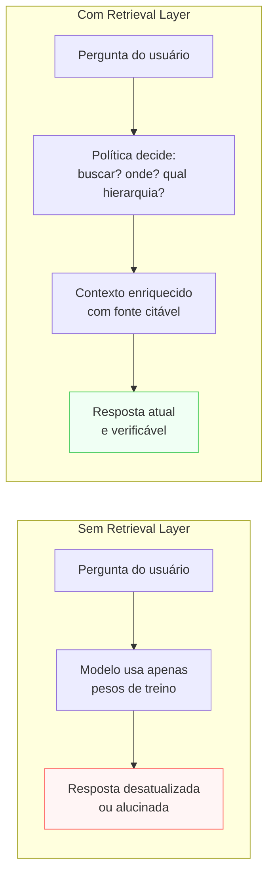

# Retrieval Layer

> [!abstract] TL;DR
> A Retrieval Layer resolve três problemas do conhecimento em LLMs: ele está **desatualizado** (cutoff de treino), é **genérico** (não conhece seus documentos), e é **não-verificável** (não dá pra apontar a fonte). A camada define quando puxar conhecimento externo, de quais fontes, em que hierarquia de prioridade, como citar e o que fazer quando nenhuma fonte responde. Implementação (RAG vetorial, BM25, web search, MCP) é decisão posterior — a política de retrieval vem antes.

> [!question]- O que acontece quando o modelo não tem a informação certa?
> Sem retrieval, o LLM usa apenas o que aprendeu durante o treinamento — dados que podem estar meses desatualizados, que não incluem seus documentos internos, e que o modelo não consegue rastrear até uma fonte específica. O resultado é confiança sem verificabilidade: respostas fluentes que podem ser completamente erradas. A Retrieval Layer é a política que define quando e como corrigir esse problema.

## O problema que a Retrieval Layer resolve

Pergunte ao modelo sobre sua política interna de licenças de software. Ele vai responder com confiança sobre o que LLMs de front-end sabem sobre políticas de licença em geral — que não é a sua política. Pergunte sobre um acontecimento da semana passada. Ele vai responder com o que sabia até o cutoff de treino — que pode ser há um ano. Pergunte sobre a versão 4.2.1 do seu framework interno. Ele vai alucinar uma documentação plausível.

O conhecimento de um LLM tem três limitações fundamentais:
1. **Desatualizado** — cutoff de treino pode ser meses atrás; dados em tempo real não existem.
2. **Genérico** — treinado em dados públicos, não nos seus documentos internos.
3. **Não-verificável** — você não consegue apontar a fonte de uma afirmação específica do modelo.

A Retrieval Layer resolve os três trazendo conhecimento **externo, atual, citável** para dentro do contexto a cada chamada. Mas retrieval não é gratuito: custa latência, custa tokens, e pode trazer ruído se mal configurado. A camada define a **política** — quando buscar, onde buscar, como usar o que foi encontrado.

## Sem retrieval vs com retrieval



## O que é esta camada

A Retrieval Layer define **quando e como** o sistema busca conhecimento externo. A implementação (vector DB, BM25, web search, MCP) é decisão da arquitetura técnica — aqui o que importa é a política.

Template mínimo (adaptado do thread @hooeem):

```yaml
retrieval:
  use_retrieval_when:
    - "informação pode ter mudado desde o cutoff de treino"
    - "claim factual com risco de alucinação"
    - "dado é interno e não está nos pesos do modelo"
    - "usuário precisa ver a fonte para confiar"
  source_hierarchy:
    - "documentação interna verificada"
    - "documentação oficial do produto/tecnologia"
    - "publicações acadêmicas revisadas"
    - "web aberta (menor confiança)"
  citation_rule: "toda claim factual cita fonte | só claims novas | nenhuma"
  conflict_rule: "fonte mais alta na hierarquia ganha | mais recente ganha | flag pro humano"
  missing_source_rule: "recusa e explica | diz 'não sei' | tenta com aviso de baixa confiança"
```

## Decisões-chave

**1. Quando NÃO usar retrieval.** Retrieval custa latência e tokens. Para tarefas onde o conhecimento do modelo basta — raciocínio matemático, programação geral, brainstorm, revisão de texto — retrieval só adiciona overhead. A regra: use quando a resposta correta **muda com o tempo** (fatos atualizáveis) ou **depende de uma fonte** (documentos internos, dados de uma API). Use o modelo "bruto" quando o raciocínio é mais importante que o fato.

**2. Hierarquia de fontes.** Em sistemas sem hierarquia explícita, o modelo dá peso igual a documentação interna cuidadosamente revisada e a um post de blog de 2019. Hierarquia explícita permite ao sistema priorizar automaticamente e — quando fontes conflitam — saber qual ganha sem precisar de intervenção humana em cada caso.

**3. Citação como contrato de confiabilidade.** "Toda claim factual deve citar a fonte" muda radicalmente o comportamento: o modelo passa a recusar afirmações que não consegue ancorar. Isso penaliza criatividade e aumenta a frequência de "não sei" — que é exatamente o trade-off correto para sistemas onde confiabilidade é mais importante que fluência.

**4. Política para conflito entre fontes.** Quando você indexa mais de uma fonte, conflitos são inevitáveis ("a documentação diz X, mas a RFC diz Y"). Três políticas comuns: (a) mais alta na hierarquia ganha; (b) mais recente ganha; (c) flag para humano quando há conflito. Sem política explícita, o modelo decide sozinho — o que pode ou não ser o comportamento desejado.

**5. Missing source: o que fazer quando não acha nada.** Esse é o caso mais perigoso. Sem regra, o modelo pode "preencher" com geração quando o retrieval não encontra nada relevante — produzindo uma resposta fluente que parece vir de uma fonte mas não vem. A regra mais segura: `missing_source_rule: "diz que não encontrou e sugere alternativa"`.

## Casos práticos

### Cenário 1 — O assistente que alucina documentação interna

Assistente de suporte técnico para produto B2B. Sem Retrieval Layer: o modelo foi treinado em dados públicos e "sabe" como APIs REST geralmente funcionam. Quando um cliente pergunta sobre o endpoint `/v2/reports/export` do produto, o modelo responde com confiança — mas o endpoint correto é `/api/v2/reports/export` (prefixo diferente) e o parâmetro `format` foi renomeado para `output_format` na v2.

Resultado: o cliente tenta o endpoint errado, falha, e culpa o suporte.

Com Retrieval Layer: o sistema indexa a documentação interna. Antes de responder sobre qualquer endpoint, consulta a documentação. Encontra `/api/v2/reports/export` com os parâmetros corretos. Responde com a fonte: "Conforme nossa documentação (link): o endpoint é `/api/v2/reports/export` com parâmetro `output_format`."

### Cenário 2 — Política de missing source em sistema de compliance

Sistema de perguntas sobre regulamentação financeira. A equipe jurídica sabe que regulações mudam frequentemente — a última coisa que querem é o modelo inventar uma regra desatualizada com ar de certeza.

```yaml
missing_source_rule: |
  Se retrieval não encontrar fonte relevante atualizada, 
  responda: "Não encontrei documentação atual sobre este ponto específico. 
  Recomendo consultar [fonte oficial] ou a equipe jurídica antes de agir."
```

Preferem um "não sei" explícito a uma resposta fluente porém incorreta. A taxa de "não sei" é uma métrica de saúde — alta demais significa que o índice de documentos precisa de atualização.

### Cenário 3 — Conflito entre fontes desatualizadas em sistema jurídico

Sistema de apoio a advogados que indexa legislação, jurisprudência e artigos de blogs jurídicos sobre um tema tributário. Em janeiro de 2023, uma lei específica sobre isenção fiscal para pequenas empresas foi revogada e substituída por uma nova redação com regras mais restritivas. O índice, porém, contém três documentos sobre o tema: (1) o texto da lei revogada, publicado em 2019; (2) o texto da nova lei, publicado em 2023; (3) um artigo de blog jurídico de 2021 que cita a lei de 2019 como se fosse vigente — porque foi escrito antes da revogação, mas nunca foi removido do índice.

Um `conflict_rule: "mais recente ganha"` ingênuo já resolveria bem entre os documentos (1) e (2) — a lei de 2023 é mais nova e vence. O problema é o documento (3): tem *data de publicação* de 2021 (mais recente que a lei revogada de 2019), mas o *conteúdo* que ele descreve ficou desatualizado em 2023. Se o retrieval ranquear por similaridade semântica pura, o artigo de blog pode aparecer nos top-k por linguagem mais próxima da pergunta do usuário — e "vencer" o conflito sem que a regra de recência capture o problema real, porque a regra compara data de publicação do documento, não a data de vigência do conteúdo que ele descreve.

A correção não é técnica de retrieval, é política: `conflict_rule` precisa compor `source_hierarchy` e não apenas recência isolada. Uma política mais segura para este caso:

```yaml
conflict_rule: |
  1. Documentos da fonte "legislação oficial" (diário oficial, portal
     do governo) sempre vencem documentos de "comentário jurídico"
     (blogs, artigos de opinião), independente de data.
  2. Entre dois documentos de legislação oficial, o mais recente vence.
  3. Se um documento de comentário jurídico for o único resultado
     relevante, cite-o com aviso explícito: "fonte secundária, não
     verificada contra a legislação vigente".
```

Sem essa hierarquia explícita, o sistema poderia citar o artigo de blog como se fosse autoritativo — e o advogado, confiando na citação, orientaria o cliente com base numa regra que não existe mais. O custo de um "não encontrei a legislação vigente, verifique diretamente no diário oficial" é baixo; o custo de uma citação errada em parecer jurídico é alto.

## Armadilhas comuns

> [!warning] Usar retrieval para tudo
> Retrieval não é gratuito. Adicionar retrieval a perguntas que o modelo responde corretamente com seu conhecimento de treino só adiciona latência e custo. Antes de ativar retrieval para um tipo de consulta, teste o modelo sem retrieval. Se a qualidade já for aceitável, não adicione a camada. Reserve retrieval para onde ele resolve um problema real: dados internos, fatos atualizáveis, exigência de citação.

> [!warning] Sem hierarquia de fontes, tudo tem o mesmo peso
> Sistemas que indexam múltiplas fontes sem hierarquia tratam a documentação interna revisada com o mesmo peso que um resultado aleatório de web search. Quando as fontes conflitam — e vão conflitar — o modelo decide arbitrariamente. Defina hierarquia antes de indexar a segunda fonte.

> [!warning] Sem `missing_source_rule`, retrieval ruim vira porta de alucinação
> O cenário mais perigoso: retrieval não encontra nada relevante, mas o modelo responde como se tivesse encontrado. Para o usuário, a resposta parece vir de uma fonte — mas foi gerada. A regra explícita para o caso de fonte não encontrada é tão importante quanto a regra para quando a fonte é encontrada.

## Sinais de que sua Retrieval Layer está mal calibrada

Como você sabe que a política de retrieval está errada? Os sintomas aparecem antes que você perceba a causa raiz.

**Retrieval disparando cedo demais (over-retrieval):** Latência alta em perguntas simples, custo de tokens desproporcional para o valor entregue, usuários reclamando que o sistema é lento para perguntas "óbvias". O modelo busca quando não precisava. Solução: adicione critérios mais restritivos ao `use_retrieval_when` — torne o gatilho mais seletivo.

**Retrieval falhando silenciosamente (under-retrieval):** Alucinações que você identifica depois, respostas fluentes sobre documentos internos que não batem com a realidade, ausência de citações em claims factuais. O modelo está respondendo do treino quando deveria estar buscando. Solução: amplie as condições de disparo e reduza o limiar de similaridade do retrieval.

**Conflito de fontes não tratado:** Respostas contraditórias para a mesma pergunta feita em dias diferentes (uma fonte mais nova foi indexada, outra ainda está no índice). Sem `conflict_rule` explícito, o modelo escolhe arbitrariamente. Sintoma claro: usuários relatam inconsistência.

**Taxa de "não sei" como métrica de saúde:** Se `missing_source_rule` está configurado para responder "não encontrei", a taxa de respostas assim é um KPI real. Taxa baixa pode indicar que o modelo está preenchendo lacunas em vez de admitir ausência. Taxa alta pode indicar índice desatualizado ou `use_retrieval_when` muito agressivo.

> [!summary] Regra prática
> Retrieval bem calibrado não é aquele que sempre busca — é aquele que busca **quando a busca resolve um problema real** e admite lacunas quando não encontra. O over-retrieval é tão custoso quanto o under-retrieval.

## Como explicar em inglês

The Retrieval Layer addresses three fundamental limitations of LLM knowledge: it's outdated (training cutoff), generic (not your documents), and unverifiable (you can't trace a specific claim to a source). The layer defines *when* to retrieve external knowledge, from *which* sources, in *what priority order*, how to cite, and what to do when nothing is found. The implementation (vector DB, BM25, web search) is a technical decision made later — the retrieval policy comes first.

Think of it as the difference between a consultant who answers from memory and one who says "let me check the latest documentation before I commit to that." The second consultant might be slower, but you can actually trust the answer — and when they say "I don't have that," you know to look elsewhere instead of acting on a guess.

In interviews, a strong signal is distinguishing *retrieval policy* from *retrieval implementation*. Most candidates jump straight to "we'd use a vector database and embeddings" — but the architectural question is: what triggers the retrieval, what's the fallback when nothing is found, and how do you handle conflicting sources? Those decisions belong to the Retrieval Layer regardless of whether the backend is a vector DB, BM25, or a web search API.

> *"The most dangerous retrieval failure isn't missing a document — it's the model silently filling the gap with something plausible."* — common framing in RAG system design reviews

| PT | EN |
|----|----|
| Camada de recuperação | Retrieval Layer |
| Geração aumentada por recuperação | Retrieval-Augmented Generation (RAG) |
| Hierarquia de fontes | Source hierarchy |
| Regra de citação | Citation rule |
| Política para fonte ausente | Missing source policy |
| Regra de conflito | Conflict resolution rule |
| Busca vetorial | Vector search |
| Cutoff de treinamento | Training cutoff |
| Recall | Recall (proporção de documentos relevantes recuperados) |

## Métricas de qualidade do retrieval

Retrieval tem suas próprias métricas — separadas da qualidade da resposta final. Entender a diferença é o que separa um sistema com "RAG ativado" de um sistema com retrieval de produção.

**Recall@k:** dos N documentos relevantes que existem no índice, quantos o sistema retornou nos K resultados? Alta prioridade quando a consequência de não recuperar um documento relevante é grave (compliance, suporte médico).

**Precision@k:** dos K resultados retornados, quantos eram de fato relevantes? Alta prioridade quando tokens e latência são caros — você quer ruído mínimo passando para o contexto do LLM.

**Mean Reciprocal Rank (MRR):** em que posição aparece o primeiro documento relevante? Relevante para sistemas de busca clássicos; no contexto de LLMs, indica se o documento mais útil está no início do contexto (onde o modelo tende a prestar mais atenção — o fenômeno "lost in the middle").

**Latência do pipeline de retrieval:** separada da latência total. Um índice mal configurado pode dominar o tempo de resposta total. Em prod, monitore p50/p95/p99 do retrieval separadamente do LLM.

**Stale retrieval rate:** proporção de queries que retornam documentos desatualizados. Relevante quando o índice precisa de atualização frequente. Se sua `source_hierarchy` inclui web search, o risco é menor — mas o custo por query é maior.

**Um exemplo numérico concreto.** Suponha um índice com 500 documentos, e uma pergunta específica para a qual existem exatamente 5 documentos relevantes no índice. O sistema busca com k=10:

- O retrieval retorna 10 documentos, dos quais **3 são relevantes** (dos 5 que existem) → **Recall@10 = 3/5 = 0,6** (60% dos documentos relevantes foram encontrados; 2 ficaram de fora).
- Desses 10 documentos retornados, **3 de 10 são relevantes** → **Precision@10 = 3/10 = 0,3** (70% do que entrou no contexto do LLM é ruído).
- O primeiro documento relevante aparece na **posição 4** do ranking → **MRR = 1/4 = 0,25** para essa query (se fosse a única query avaliada; na prática MRR é a média sobre um conjunto de queries de teste).

O que esses três números juntos revelam: o sistema *encontra* menos da metade do que precisaria encontrar (recall baixo) e, do que encontra, a maior parte é ruído posicionado à frente do que interessa (MRR baixo com precision baixa). Isso é sintoma clássico de um limiar de similaridade mal calibrado — nem restritivo o bastante para cortar ruído, nem abrangente o bastante para capturar todos os relevantes. Como referência de produção: sistemas de RAG maduros para domínios fechados (ex: base de documentação técnica de um único produto) costumam mirar recall@10 acima de 0,85 e precision@10 acima de 0,5; abaixo disso, vale investigar chunking, embedding model, ou reranking antes de aumentar k.

O alvo certo depende do domínio, não é um número universal. Um sistema de compliance jurídico (como o Cenário 3) tolera precision mais baixa em troca de recall alto — prefere trazer documento a mais no contexto (ruído que o LLM filtra) a deixar de fora a única cláusula que revoga a regra que está prestes a citar. Já um assistente de busca em release notes de produto, onde errar custa apenas uma resposta um pouco menos precisa, pode aceitar recall mais baixo em troca de latência e custo menores. Definir o alvo de recall/precision é, na prática, outra decisão de política — a mesma lógica de trade-off explícito que rege `use_retrieval_when` e `missing_source_rule`.

> [!info] O trade-off Recall × Precision é real
> Aumentar o limiar de similaridade para incluir mais documentos (melhor recall) aumenta o ruído no contexto (pior precision). Retrieval de produção requer um ponto de equilíbrio calibrado por caso de uso — não existe configuração universalmente ótima.

> [!tip] Meça antes de calibrar
> Recall@k e precision@k só significam algo com um conjunto de teste rotulado (query → documentos relevantes conhecidos). Sem esse conjunto, qualquer ajuste de limiar é palpite. Construir esse conjunto — mesmo que pequeno, 20-30 queries representativas — é o primeiro passo antes de tocar em qualquer parâmetro do índice.

## Retrieval vs Fine-tuning: quando usar cada um

Esta é a pergunta que todo arquiteto de sistema de IA vai enfrentar cedo ou tarde. A resposta curta: **retrieval para conhecimento, fine-tuning para comportamento**.

| Dimensão | Retrieval | Fine-tuning |
|---|---|---|
| Conhecimento muda com frequência | Ideal | Ruim (requer re-treino) |
| Comportamento/tom específico | Ruim | Ideal |
| Citabilidade obrigatória | Ideal | Não resolve |
| Volume de dados de treino escasso | Funciona sem dados | Exige exemplos rotulados |
| Custo operacional por query | Caro (latência + tokens) | Barato (só inferência) |
| Controle sobre o que o modelo "sabe" | Explícito e auditável | Opaco (nos pesos) |

A combinação mais comum em produção: fine-tuning para ajustar o tom/formato de resposta do modelo, retrieval para injetar o conhecimento específico. Não é ou/ou — é ambos com papéis distintos.

## O que vem a seguir

Com o contexto enriquecido por retrieval, o sistema pode precisar de mais do que conhecimento — pode precisar **agir**: buscar em uma API externa, calcular, criar um arquivo, disparar um email. Isso é responsabilidade da **Tool Layer**: define quais ações o modelo pode executar no mundo real, com que nível de aprovação requerida, e o que fazer quando uma tool falha.

- [[07 - Tool Layer]] — o que o modelo pode fazer (ações com efeito colateral)
- [[RAG e Vector Databases]] — trilha completa: embeddings, vector DBs, hybrid search, reranking

## Implementações comuns da política de retrieval

A política de retrieval (o que a camada define) se materializa em algumas implementações técnicas. Entender o mapa ajuda a não confundir política com implementação.

**RAG denso (Dense RAG):** embeddings vetoriais + similaridade semântica. Melhor para busca semântica — "qual documento fala sobre política de reembolso?" mesmo sem as palavras exatas. Custo: infraestrutura de vector DB e processo de embedding.

**BM25 / busca léxica:** indexação invertida clássica. Melhor para termos técnicos precisos, códigos de produto, IDs — onde a correspondência exata importa mais que a semântica. Custo: baixo. Ainda bate embeddings em muitos benchmarks para buscas precisas.

**Hybrid search (BM25 + denso):** combina os dois com reranking. Cobre o ponto cego de cada abordagem. É o padrão de facto para retrieval de produção serio. O reranker (ex: Cohere Rerank, cross-encoders) reordena os K primeiros resultados com um modelo mais caro mas mais preciso.

**Web search como retrieval:** para fatos em tempo real sem índice próprio. Latência mais alta, custo por query, mas elimina a necessidade de manter índice atualizado. Encaixa na `source_hierarchy` geralmente com prioridade mais baixa.

**MCP (Model Context Protocol):** protocolo padronizado para tools de retrieval. Permite que o modelo acesse retrieval como uma tool com interface consistente, auditável e intercambiável. Não é uma técnica de retrieval — é uma camada de protocolo que padroniza como o retrieval é invocado.

**Como fica um pipeline de hybrid search + reranker na prática.** O padrão de produção descrito acima — BM25 e embedding rodando em paralelo, com um cross-encoder reordenando o resultado combinado — tem essa forma esquemática:

```python
def hybrid_retrieve(query: str, k_candidates: int = 20, k_final: int = 5):
    # 1. Duas buscas em paralelo, cada uma com seu próprio ponto forte
    bm25_hits = bm25_index.search(query, top_k=k_candidates)       # match léxico exato
    dense_hits = vector_index.search(embed(query), top_k=k_candidates)  # similaridade semântica

    # 2. Fusão dos dois rankings (ex: Reciprocal Rank Fusion) —
    #    evita que um método domine só por retornar mais candidatos
    candidates = reciprocal_rank_fusion(bm25_hits, dense_hits)

    # 3. Reranking: um cross-encoder lê par (query, documento) e
    #    pontua relevância diretamente — mais caro que embeddings
    #    (não pode ser pré-computado), mas muito mais preciso
    #    porque compara query e documento juntos, não em vetores isolados
    scored = cross_encoder.rerank(query, candidates)

    # 4. Corta para o top-k final que de fato entra no contexto do LLM
    return scored[:k_final]
```

O ponto que costuma passar despercebido: BM25 e embeddings sozinhos rankeiam cada documento *sem olhar para os outros candidatos* — cada um compara query contra documento isoladamente. O cross-encoder do passo 3 é mais lento exatamente porque faz o oposto: processa o par (query, documento) junto, o que captura nuances de relevância que um vetor de embedding pré-computado não consegue (por isso reranking só é viável depois de já ter reduzido a lista para dezenas de candidatos — rodar um cross-encoder contra os 500 documentos do índice inteiro seria caro demais para latência de produção).

Em termos de orçamento de latência: BM25 e a busca vetorial rodam em paralelo e tipicamente respondem em dezenas de milissegundos cada; o cross-encoder, rodando sobre ~20 candidatos já filtrados, costuma adicionar de 50 a 200ms dependendo do tamanho do modelo. É um custo real, mas pago uma única vez por query — não por documento indexado — o que o torna viável mesmo em índices com milhões de documentos, desde que o funil (passo 1-2) já tenha reduzido a lista antes de o passo 3 rodar.

> [!example] Sequência de fallback em retrieval híbrido
> 1. Tenta BM25 com o termo exato → retorna resultado relevante → usa
> 2. Sem resultado → tenta embedding search → retorna candidatos → reranker classifica → usa top-1 se confidence > threshold
> 3. Sem resultado com confidence suficiente → aplica `missing_source_rule`

## Onde aprofundar

- **[[RAG e Vector Databases]]** — trilha completa de retrieval, da intuição ao setup de produção (13 notas).
- **[[Context Engineering]]** → [[06 - Dynamic retrieval beyond RAG]] — JIT retrieval, retrieval por agents, MCP como retrieval channel.

## Veja também

- [[04 - Context Layer]] — retrieval alimenta o contexto de cada execução
- [[07 - Tool Layer]] — web search e API queries como tools de retrieval
- [[09 - Evaluation Layer]] — recall e precision@k como métricas de qualidade de retrieval

## Fontes

- **@hooeem** — *Become an AI Engineer*, chapter #18, Step 5 (Retrieval layer template). X/Twitter, 2025.
- **Lewis et al.** — [*Retrieval-Augmented Generation for Knowledge-Intensive NLP Tasks*](https://arxiv.org/abs/2005.11401) (2020). Paper original do RAG.
- **Anthropic** — [*Contextual Retrieval*](https://www.anthropic.com/news/contextual-retrieval) (2024). Técnica de pré-processamento que melhora recall ao adicionar contexto por chunk.
