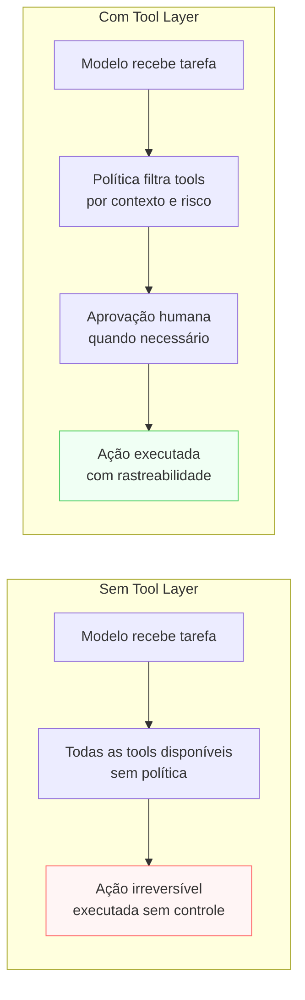

# Tool Layer

> [!abstract] TL;DR
> A Tool Layer define **o que o modelo pode fazer no mundo** — além de gerar texto. Calculadora, busca, query no banco, criar arquivo, enviar email. Cada tool é uma função tipada com efeito colateral — e efeitos colaterais são diferentes de tokens gerados: eles não se apagam. As decisões-chave: quais tools estão disponíveis, quando usar cada uma, quais precisam de aprovação humana, quais são proibidas, e o que fazer quando uma tool falha. Sem essa camada bem definida, agentes fazem ações erradas em produção e o time só descobre depois.

> [!question]- Por que tools com LLMs são diferentes de chamadas de função comuns?
> Em código convencional, quem chama a função é o programador — e ele sabe exatamente o que está chamando, quando, e com quais parâmetros. Com LLMs, quem decide chamar a tool é o modelo — com base em inferência, não em código determinístico. Isso muda radicalmente o perfil de risco: ações com efeito colateral (enviar email, deletar registro) passam a ser decisões probabilísticas, não determinísticas. A Tool Layer é o sistema de controle que mantém esse poder contido.

## O problema que a Tool Layer resolve

Gerar texto é reversível. O usuário lê, discorda, pede de novo. Mas quando o modelo clica em "confirmar compra", envia um email para 50.000 clientes, ou deleta um arquivo em produção — não tem desfazer. A Tool Layer existe porque a diferença entre "modelo que sugere ações" e "modelo que executa ações" é a diferença entre ter e não ter um sistema de controle.

Sem Tool Layer bem definida, três problemas emergem: (1) o modelo recebe tools que não deveria chamar neste contexto e as chama mesmo assim; (2) não há política de aprovação para ações de alto risco; (3) quando uma tool falha, o modelo improvisa — às vezes chamando de novo em loop, às vezes inventando o resultado como se a tool tivesse funcionado.

A Tool Layer não é sobre quais ferramentas usar — é sobre **quem decide o que, quando, com que nível de supervisão humana**.

## Sem Tool Layer vs com Tool Layer



## O que é esta camada

A Tool Layer é onde o modelo deixa de ser pura geração de texto e passa a **agir**. Cada tool é uma função tipada com schema de entrada, schema de saída — e, implicitamente, um efeito colateral no sistema real.

Template mínimo (adaptado do thread @hooeem):

```yaml
tools:
  available:
    - name: "search_knowledge_base"
      when_to_use: "quando o usuário pergunta sobre documentação interna"
      when_not_to_use: "quando a resposta está no contexto atual"
    - name: "create_ticket"
      when_to_use: "quando o usuário solicita criar um ticket de suporte"
      when_not_to_use: "quando o problema ainda não foi diagnosticado"
  allowed_without_approval:
    - "search_knowledge_base"
    - "get_user_profile"
  requires_approval:
    - "create_ticket"
    - "send_notification"
  forbidden:
    - "delete_user_data"
    - "bulk_email"
  tool_failure_behavior:
    retry: "1 vez com backoff de 2s"
    fallback: "escalar para humano com contexto"
```

O protocolo MCP padroniza o **transporte** de tools entre modelo e cliente. A trilha [[Anatomia de Agents]] cobre como o modelo **decide** chamar uma tool (loop ReAct, native tool use).

## Decisões-chave

**1. Quantas tools expor por contexto.** Modelos lidam mal com listas muito longas de tools — quanto mais tools disponíveis, mais a latência sobe e mais ruidosa fica a decisão de qual usar. Regra prática: ≤10 tools por contexto. Acima disso, agrupe tools similares, crie um roteador que seleciona o subconjunto relevante, ou use sub-agentes especializados com seus próprios conjuntos de tools.

**2. Classificar tools por efeito colateral.** Leitura (search, get, read) é geralmente segura sem aprovação — o pior caso é latência desnecessária. Escrita (write, send, create, update) precisa de gradação: por valor (criar um ticket vs enviar um email para 50k usuários), por reversibilidade (criar vs deletar), por blast radius (afetar 1 registro vs 1.000). A política de aprovação herda dessa classificação.

**3. Política de aprovação em três níveis.** **(a) Auto-approve** — modelo decide e age imediatamente (bom para leitura e ações de baixo risco). **(b) Confirm** — modelo propõe, usuário confirma antes da execução (bom para ações reversíveis de médio risco). **(c) Plan-then-execute** — modelo escreve o plano completo, usuário aprova o plano inteiro antes de qualquer ação (bom para sequências de ações de alto risco). Quanto mais irreversível ou de maior blast radius, mais alto o nível.

**4. Failure handling explícito.** Tool falha: timeout, 500, schema mismatch, permissão negada. Sem política, o modelo improvisa — às vezes chama em loop até atingir o limite de contexto, às vezes gera um resultado fictício como se a tool tivesse funcionado. Política explícita (retry com limite + backoff, fallback para tool alternativa, escalação para humano com contexto) é o que diferencia um agent robusto de um agent errático.

**5. Tool design é trabalho de engenharia.** Tool com schema mal feito gera alucinação de parâmetro — o modelo tenta preencher campos que não existem ou interpreta errado o que o campo significa. Descrições claras, exemplos no schema, erros informativos, e nomes consistentes com o domínio do problema são tão importantes quanto o código da função em si. Uma tool mal descrita é uma tool que o modelo vai usar errado.

## Casos práticos

### Cenário 1 — O agent que manda email em produção sem querer

Agent de onboarding de clientes com acesso a `send_welcome_email` sem política de aprovação. Em um teste com dados fictícios, o agent processa um arquivo CSV com 200 registros de teste — e manda email de boas-vindas para todos os 200 endereços, que eram clientes reais de um ambiente anterior.

O problema não estava no modelo (que executou o que foi desenhado para executar). Estava na Tool Layer: `send_welcome_email` estava em `allowed_without_approval` quando deveria estar em `requires_approval` com uma confirmação de contagem.

### Cenário 2 — Política de aprovação por blast radius

Sistema de automação de marketing com três categorias de tools:

```yaml
allowed_without_approval:
  - "get_campaign_status"      # leitura, sem efeito
  - "preview_email_template"   # leitura, sem efeito

requires_approval:
  - name: "schedule_email"
    condition: "destinatários ≤ 100"
    approval_type: "confirm"
  - name: "schedule_email"
    condition: "destinatários > 100"
    approval_type: "plan-then-execute com revisão da lista"

forbidden:
  - "delete_campaign"          # irreversível, vai para humano via ticket
```

O mesmo `schedule_email` tem política diferente dependendo do blast radius. O model pode agendar emails para até 100 destinatários com uma confirmação simples. Acima disso, o plano completo — lista de destinatários, assunto, horário — vai para revisão antes de qualquer execução.

## Armadilhas comuns

> [!warning] Expor todas as tools disponíveis a cada contexto
> O instinto de "dar tudo que o modelo pode precisar" resulta em contexts com 30+ tools onde o modelo fica confuso sobre qual usar — e usa a errada. A Tool Layer deve ser curada por contexto: o agent de suporte ao cliente não precisa da tool de deploy de código. Filtre o conjunto de tools disponível baseado no contexto da tarefa atual.

> [!warning] Sem política de failure, o model improvisa
> Quando uma tool retorna erro, o modelo sem política escrita vai tomar uma decisão — e pode ser uma decisão ruim: repetir em loop, usar uma tool alternativa que não deveria, ou gerar um resultado fictício como se a tool tivesse funcionado. Implemente fallback explícito para cada tool de escrita crítica. "Se `create_ticket` falhar, escale para humano" é uma linha no template, não uma feature extra.

> [!warning] Tool design negligenciado
> Engenheiros constroem a lógica da tool, escrevem uma descrição de três palavras no schema, e se surpreendem quando o modelo usa a tool errada ou com parâmetros incorretos. Descrição de tool é documentação para o modelo — como o docstring de uma função, mas lido a cada chamada. Inclua: o que a tool faz (em uma frase), quando usar, quando não usar, e um exemplo de input/output.

## Categorias de tools e suas implicações de risco

Nem toda tool tem o mesmo perfil de risco. Classificar antes de categorizar na política de aprovação evita erros grosseiros no design da camada.

**Read-only tools (leitura):** `search`, `get`, `list`, `fetch`, `preview`. Sem efeito colateral permanente — o pior caso é latência desnecessária ou dado desatualizado. Geralmente seguros para `auto-approve`. Cuidado: `fetch` de uma URL pode registrar um acesso em sistemas de analytics — não é puramente "sem efeito".

**Write tools (escrita única):** `create`, `update`, `send`, `schedule`. Efeito colateral permanente, mas escopo limitado. Geralmente: `confirm` para ações que afetam 1 registro ou 1 destinatário; `plan-then-execute` para lotes.

**Destructive tools (destruição):** `delete`, `revoke`, `cancel`, `purge`. Alta irreversibilidade. Padrão seguro: `forbidden` no agente autônomo, disponível apenas via workflow humano-no-loop explícito.

**Compute tools (computação):** `calculate`, `transform`, `generate`. Sem efeito colateral externo, mas podem ter custo computacional ou ser vetores de prompt injection se o input vier de fontes externas (web scraping, documentos de usuário).

**Integration tools (integração):** tools que chamam APIs externas — pagamentos, messaging, auth. Risco depende do que a API faz; tratar como write tools no mínimo, com blast radius avaliado caso a caso.

> [!info] Blast radius como critério de gradação
> Blast radius = número de entidades afetadas × reversibilidade. Enviar email para 1 usuário: baixo. Enviar para 50k: altíssimo — mesmo que tecnicamente seja "a mesma tool". A política deve graduar por blast radius, não só por tipo de ação.

## Quando criar uma tool vs resolver no prompt

Decisão frequente que muitos times erram por falta de critério explícito.

**Crie uma tool quando:** o modelo precisa de dado em tempo real (que não está no contexto); a ação tem efeito colateral real (escrever, enviar, criar); a computação é mais confiável feita em código do que gerada pelo modelo (cálculos numéricos, parsing de formatos complexos).

**Resolva no prompt quando:** o dado já está no contexto ou pode ser injetado no prompt; a "ação" é apenas formatação ou classificação de texto; criar a tool adicionaria latência sem melhorar confiabilidade.

**Red flag:** tool criada só para "dar ao modelo mais contexto" — isso é job da Context Layer, não da Tool Layer. Muitas tools de leitura no lugar de context management adequado é um sintoma de arquitetura confusa.

## Como explicar em inglês

The Tool Layer defines what the model can do in the real world beyond generating text: search, calculate, write files, send emails, query databases. The critical distinction from other layers: tool calls have side effects. Unlike generated text, a sent email or deleted record cannot be undone. The layer defines an approval policy (auto-approve, confirm, plan-then-execute) based on blast radius and reversibility, specifies failure handling, and sets forbidden actions. Well-designed tools also require well-written schemas — a poorly described tool is a tool the model will misuse.

Think of it as the difference between giving someone a key to every room in the building versus giving them a key only to the rooms they need for the task at hand. The second isn't about distrust — it's about preventing accidental entries into rooms with dangerous machinery. The Tool Layer is that access control system for model actions.

In interviews, the signal question is usually about approval policies and blast radius — not about which tools to build. A strong answer articulates the three-tier model (auto-approve / confirm / plan-then-execute), explains how blast radius drives the classification, and gives a concrete example of a failure mode that proper policy would have prevented.

> *"The question isn't whether your agent can call the tool — it's whether it should, with what level of human oversight, and what happens when the tool fails."* — common framing in agentic system design reviews

| PT | EN |
|----|----|
| Camada de ferramentas | Tool Layer |
| Efeito colateral | Side effect |
| Política de aprovação | Approval policy |
| Aprovação automática | Auto-approve |
| Confirmar antes de executar | Confirm before execute |
| Planejar e depois executar | Plan-then-execute |
| Raio de impacto | Blast radius |
| Irreversibilidade | Irreversibility |
| Chamada de ferramenta | Tool call |
| Schema da ferramenta | Tool schema |

## O que vem a seguir

Com tools definidas, você tem os blocos de construção de execução do sistema. A próxima decisão arquitetural é como esses blocos se conectam: o sistema vai executar um **caminho fixo e determinístico** (workflow), ou vai deixar o modelo **descobrir o caminho dinamicamente** (agent)? Essa é a pergunta da Workflow vs Agent Layer — e é a bifurcação que define a complexidade, custo e confiabilidade do sistema.

- [[08 - Workflow vs Agent Layer]] — pipeline fixo vs descoberta dinâmica de caminho
- [[Anatomia de Agents]] — trilha completa sobre tool design, loop ReAct, e arquiteturas de agent
- [[MCP]] — protocolo padrão de transporte de tools entre modelos e clientes

## Onde aprofundar

- **[[Anatomia de Agents]]** → [[03 - Tool design — princípios e categorias]] — princípios de design de tool bem descrita.
- **[[MCP]]** — Model Context Protocol, o padrão emergente para conectar tools a modelos.
- **[[Anatomia de Agents]]** → [[02 - O loop ReAct e native tool use]] — como o modelo decide chamar uma tool.

## Veja também

- [[06 - Retrieval Layer]] — retrieval por web search e APIs é um tipo de tool
- [[08 - Workflow vs Agent Layer]] — agents usam tools dinamicamente; workflows usam em passos fixos
- [[10 - Guardrail Layer]] — tools proibidas e blast radius
- [[11 - Logging Layer]] — registrar toda tool call com parâmetros e resultado

## Fontes

- **@hooeem** — *Become an AI Engineer*, chapter #18, Step 6 (Tool layer template). X/Twitter, 2025.
- **Anthropic** — [*Tool use with Claude*](https://docs.anthropic.com/en/docs/build-with-claude/tool-use/overview). Schemas, function calling, efeitos colaterais.
- **OpenAI** — [*Function calling*](https://platform.openai.com/docs/guides/function-calling). Parallel function calls e structured outputs em tools.


