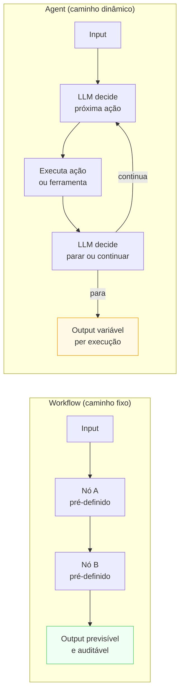

# Workflow vs Agent Layer

> [!abstract] TL;DR
> A pergunta mais consequente do stack: **caminho fixo (workflow) ou descoberto dinamicamente (agent)?** Workflow quando o passo-a-passo é conhecido e pode ser codificado — você orquestra LLMs em nós de um pipeline determinístico. Agent quando o caminho precisa ser descoberto em tempo de execução — o LLM escolhe a próxima ação em loop até decidir parar. A regra cardinal: **não construa agent por padrão**. Agent custa mais, falha de formas mais criativas, e debuga pior. Use workflow até provar que não resolve — e esse limiar é mais alto do que parece.

> [!question]- Quando realmente vale a pena construir um agent?
> A resposta honesta: quase nunca na primeira versão. Agent parece a escolha natural quando o domínio é "complexo" — mas complexidade no domínio não implica que o *caminho de solução* precisa ser descoberto em tempo de execução. Na maioria dos casos, a tarefa tem estrutura — você só não mapeou ainda. Workflows com routing e padrões intermediários resolvem ~80% dos problemas que as equipes acreditam precisar de agent. Use agent quando você puder provar que o caminho não pode ser predefinido.

## O problema que esta camada resolve

Você tem um modelo que responde bem. Você tem tools. Você tem contexto. Agora a pergunta que define a arquitetura inteira: como esses blocos se conectam?

Se a resposta é "o modelo decide em tempo de execução" — você escolheu agent. Se a resposta é "o código define a sequência de passos" — você escolheu workflow. A diferença não é de poder expressivo: qualquer coisa que um agent faz pode ser modelada como workflow com caminhos condicionais suficientes. A diferença é de **custo de engenharia, confiabilidade e debugabilidade**.

O erro mais frequente: construir agent porque o domínio parece "complexo" ou porque a demo com agent ficou impressionante. A maioria dos sistemas de produção que parecem precisar de agent funcionam bem — e melhor — como workflow com um conjunto rico de nós condicionais.

## Workflow vs Agent: o contraste

## O que é esta camada

Esta camada não produz um template YAML — produz uma **decisão arquitetural** que determina o restante do stack: tools necessárias, estilo de eval, tipo de logging, custo, latência e confiabilidade.

A taxonomia da Anthropic em *Building effective agents* (2024) é útil:

| Tipo | Definição | Quem controla o fluxo |
|------|-----------|----------------------|
| **Building block** | LLM com retrieval, tools e memória — o átomo | — |
| **Workflow** | Building blocks orquestrados em **caminho predefinido** por código | Código |
| **Agent** | LLM em loop decidindo a próxima ação até concluir | Modelo |

Os padrões intermediários — que cobrem a maioria dos sistemas de produção — são workflows com nós mais ricos:

- **Prompt chaining** — output de um LLM vira input do próximo (pipeline linear)
- **Routing** — um classificador decide qual nó executar (condicional)
- **Parallelization** — múltiplos LLMs em paralelo, resultados agregados
- **Orchestrator-workers** — um LLM coordena outros LLMs especializados
- **Evaluator-optimizer** — um LLM avalia o output do outro e solicita revisão

Esses padrões são mais confiáveis, mais baratos e mais debugáveis que agent puro.

## Decisões-chave

**1. O caminho é previsível?** Se você consegue desenhar o fluxograma inteiro antes de executar, é workflow. Se os nós e arestas dependem do input de cada etapa de formas que você não consegue prever antecipadamente, é agent. Teste: você conseguiria escrever o diagrama de sequência antes de rodar? Sim → workflow.

**2. Custo do erro vs custo da rigidez.** Agent erra de formas mais variadas (o loop pode divergir, entrar em ciclo ou parar antes de concluir) mas é flexível para casos inesperados. Workflow erra de forma previsível e em casos não cobertos, mas falha de modo limpo. Onde o custo do erro é alto — decisões financeiras, ações irreversíveis, sistemas médicos — prefira a falha previsível do workflow à falha criativa do agent.

**3. Profundidade do loop agentic.** Agent que precisa de 2-3 chamadas para resolver o problema é razoável. Agent que precisa de 30 chamadas geralmente está mascarando um workflow mal modelado — a tarefa tem um caminho, você só não o mapeou ainda. Quando o loop fica muito profundo, refatore em workflow.

**4. Debugabilidade e cost.** Workflow é debugável passo a passo: você sabe exatamente o que foi executado e em que ordem. Agent requer tracing pesado para entender por que escolheu cada ação — sem Logging Layer forte, agent é caixa-preta. Além disso, cada passo do loop é uma chamada ao modelo: agent com loop de 10 passos custa 10× o de uma única chamada.

**5. Padrões intermediários são a resposta certa na maioria dos casos.** Antes de construir agent puro, pergunte: este problema cabe em orchestrator-workers? Em evaluator-optimizer? Em routing com nós especializados? Esses padrões têm as vantagens de flexibilidade dos agents com muito mais previsibilidade de workflows.

## Casos práticos

### Cenário 1 — Agent onde workflow bastaria

Sistema de geração de relatórios financeiros. A equipe construiu um agent porque "o relatório tem seções diferentes dependendo do tipo de empresa". O agent decide em cada execução quais seções incluir, em que ordem, com quais dados.

Em produção: loop diverge em ~8% dos relatórios (agent inclui seção duplicada ou pula seção obrigatória). Debug é difícil porque cada execução toma um caminho diferente. Custo por relatório é 3× o estimado.

A solução: routing + workflow. Um classificador identifica o tipo de empresa (3 tipos) e roteia para um de 3 templates de workflow fixos. Cada template tem as seções certas, na ordem certa, com os dados certos. Taxa de erro: <0.1%. Custo: 1/3 do agent. Debugging: determinístico.

### Cenário 2 — Agent genuíno: pesquisa aberta

Sistema de pesquisa competitiva: "analise os três maiores concorrentes e identifique oportunidades de diferenciação". O número de etapas, as fontes a consultar, e as dimensões de análise dependem do que é encontrado em cada passo. Um workflow fixo seria muito rígido — há dimensões que só surgem depois de ler o primeiro relatório.

Este é um caso genuíno de agent: o caminho não pode ser predefinido porque depende do que é descoberto durante a execução. Aqui, o custo e a imprevisibilidade de agent são aceitáveis porque a flexibilidade é o valor central do sistema.

## Armadilhas comuns

> [!warning] Construir agent por padrão ou por impressão
> "A demo ficou incrível" não é critério arquitetural. Agent impressiona em demos porque parece autônomo e inteligente — em produção, essa autonomia é exatamente o que produz falhas imprevisíveis. O ônus da prova é do agent: só use quando você provar que workflow não resolve o problema.

> [!warning] Não calcular custo do loop agentic
> Cada chamada ao modelo no loop tem custo. Um agent com loop médio de 8 passos e 5.000 chamadas por dia é 40.000 chamadas ao modelo por dia — talvez 10× o orçamento previsto. Calcule custo por execução antes de escolher agent, não depois do faturamento chegar.

> [!warning] Agent sem kill switch
> Loop agentic sem condição de parada explícita pode rodar indefinidamente — ou até atingir o limite de contexto da API e falhar com erro. Defina sempre: número máximo de iterações, custo máximo por sessão, e comportamento quando esses limites são atingidos. Esses kill switches vivem na Guardrail Layer.

## Critérios objetivos para a decisão workflow vs agent

Em vez de intuição, use estas perguntas como checklist antes de decidir:

**O caminho tem estrutura previsível?**
- Sim, sempre os mesmos passos → workflow puro
- Sim, mas com condicionais → workflow com routing
- Depende do input em formas que não consigo antecipar → candidate a agent

**Qual é o custo tolerável por execução?**
- Orçamento muito apertado por query → workflow (custo fixo e previsível)
- Pode absorver variabilidade → agent pode ser aceitável

**Qual é o custo do erro?**
- Ação irreversível, impacto financeiro, segurança → workflow (falha previsível)
- Erro recuperável, ambiente exploratório → agent pode ser aceitável

**A equipe tem capacidade de debugar agent?**
- Sem Logging Layer forte e tracing → não construa agent ainda
- Instrumentação completa, observabilidade em place → agent é mais viável

**O loop precisaria de quantas iterações em média?**
- 1-3 iterações → talvez seja só um workflow com retentativas
- 4-10 → agent legítimo com kill switch
- 10+ → provavelmente um workflow mal modelado

> [!summary] Regra de ouro
> Workflow é o padrão. Agent é a exceção. O ônus da prova é sempre do agent.

## Como explicar em inglês

The Workflow vs Agent Layer is the most consequential architectural decision in the stack. Workflows are LLM-powered pipelines where the sequence of steps is predetermined by code — predictable, debuggable, cost-controlled. Agents are LLMs in a loop that decide their own next action — flexible, powerful, but expensive and harder to debug. The default should be workflow. Build agents only when you can prove the path cannot be predetermined. Most production systems that seem to need agents are actually best served by richer workflow patterns: routing, parallelization, orchestrator-workers, or evaluator-optimizer.

The nuance that separates a strong candidate in interviews: workflows can look very "smart" through rich routing and conditional logic without any agentic loop. The signal is whether the *path itself* needs to be discovered at runtime, not whether the individual steps require intelligence. A classification step that routes to one of five specialized sub-pipelines is still a workflow — the model is reasoning, but the overall structure is fixed.

> *"Most of what people call 'agents' in production are actually workflows with LLM nodes — and that's a good thing. The agentic loop should be the last resort, not the default architecture."* — Anthropic, Building effective agents (2024)

| PT | EN |
|----|----|
| Camada workflow vs agente | Workflow vs Agent Layer |
| Fluxo de trabalho | Workflow |
| Agente autônomo | Autonomous agent |
| Caminho predefinido | Predetermined path |
| Loop agentic | Agentic loop |
| Encadeamento de prompts | Prompt chaining |
| Roteamento | Routing |
| Paralelização | Parallelization |
| Orquestrador-trabalhadores | Orchestrator-workers |
| Avaliador-otimizador | Evaluator-optimizer |

## O que vem a seguir

Com a arquitetura decidida — workflow ou agent — as três próximas camadas são o **bloco de controle**: Evaluation (como saber se o output está bom), Guardrail (o que o sistema não pode fazer), e Logging (o que registrar de cada execução). Essas três camadas transformam o que você construiu em sistema confiável para produção.

A decisão mais urgente depois de workflow vs agent é a Evaluation Layer — sem rubrica de qualidade, você não tem sinal para saber se o sistema está funcionando.

- [[09 - Evaluation Layer]] — como medir se o output está bom
- [[10 - Guardrail Layer]] — o que o sistema não pode fazer
- [[Anatomia de Agents]] — trilha completa: patterns, ReAct, orchestrator-workers, planning

## Onde aprofundar

- **[[Anatomia de Agents]]** → [[10 - Workflow vs Agent — quando usar cada um]] — discussão aprofundada com critérios detalhados.
- **[[Anatomia de Agents]]** → [[08 - Patterns comuns de agents]] — orchestrator-worker, planning, ReAct.
- **Anthropic** — *Building effective agents* (2024) — a referência mais citada sobre esta distinção.

## Veja também

- [[02 - Purpose Layer — o que o sistema é]] — Purpose informa se a tarefa precisa de agent
- [[07 - Tool Layer]] — agents dependem de tools; workflows podem funcionar sem
- [[09 - Evaluation Layer]] — eval de agent é fundamentalmente mais difícil que de workflow
- [[11 - Logging Layer]] — agent sem logging forte é caixa-preta

## Fontes

- **@hooeem** — *Become an AI Engineer*, chapter #18, Step 7 (Workflow vs Agent). X/Twitter, 2025.
- **Anthropic** — [*Building effective agents*](https://www.anthropic.com/engineering/building-effective-agents) (2024). Definição de building blocks → workflows → agents + patterns intermediários.
- **Lilian Weng** — [*LLM-powered Autonomous Agents*](https://lilianweng.github.io/posts/2023-06-23-agent/) (2023). Planning, memory e tool use como componentes.

