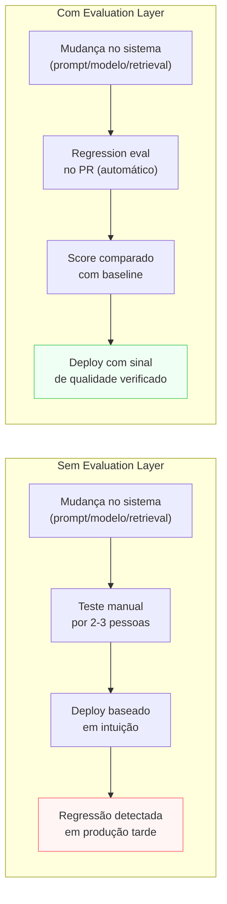

# Evaluation Layer

> [!abstract] TL;DR
> A Evaluation Layer responde **como saber se o output está bom** — de forma reproduzível, não por intuição. É uma rubrica de múltiplas dimensões (acurácia, completude, utilidade, aderência ao formato, qualidade da fonte) aplicada a um dataset curado. Sem evals, "ficou melhor" vira sentimento; com evals, vira número comparável. A regra que separa sistemas maduros de demos: o sistema que itera com sinal melhora. O que itera no escuro não sabe se está melhorando ou piorando.

> [!question]- Como você sabe se uma mudança no sistema melhorou ou piorou?
> Sem evals, a resposta é: você não sabe. Você tem impressões, você tem feedback de dois colegas, você tem o instinto do PM. Em produção com milhares de chamadas por dia, isso é como navegar um navio sem instrumentos — você sente que está indo na direção certa até bater nos recifes. A Evaluation Layer é o painel de instrumentos que transforma "parece melhor" em "melhorou X% na dimensão Y sem regredir em Z".

## O problema que a Evaluation Layer resolve

Você mudou o system prompt. O modelo parece responder melhor. Você mostra para dois colegas — um acha que melhorou, o outro acha que piorou. Como você decide?

Sem a Evaluation Layer, a resposta é: por intuição, por votação, ou pela opinião do stakeholder mais vocal na reunião. Isso funciona para um protótipo com 10 casos de uso testados manualmente. Não funciona para um sistema em produção com 10.000 chamadas por dia e 200 tipos de input diferentes.

A Evaluation Layer cria o **sinal** que permite iterar com objetividade. Sem ela, você não sabe se uma mudança de modelo, prompt ou retrieval melhorou ou piorou a qualidade do sistema. Com ela, você tem um número: a mudança moveu o score de 3.2 para 3.7 nas métricas que importam para o negócio, e não regrediu em nenhuma das condições de falha automática.

## Sem Evaluation Layer vs com Evaluation Layer



## O que é esta camada

A Evaluation Layer é a **régua** do sistema — mede qualidade do output de forma reproduzível para que mudanças possam ser comparadas com objetividade.

Template mínimo (adaptado do thread @hooeem):

```yaml
evaluation:
  success_criteria: "<herda do Purpose Layer — traduzido em dimensões mensuráveis>"
  scoring_rubric:
    accuracy: "1-5: alinhamento factual com fontes verificáveis"
    completeness: "1-5: todas as partes da pergunta foram respondidas"
    usefulness: "1-5: o output é acionável para o usuário-alvo"
    format_adherence: "1-5: segue o contrato definido na Output Layer"
    source_quality: "1-5: fontes citadas são adequadas e verificáveis"
    specificity: "1-5: resposta concreta, não genérica"
    risk_control: "1-5: sem conteúdo proibido ou potencialmente prejudicial"
  pass_threshold: "média ≥4 E nenhuma dimensão <3"
  automatic_failure_conditions:
    - "vazamento de PII"
    - "chamada de tool proibida pela Guardrail Layer"
    - "formato de output inválido (breaking change no schema)"
```

Três tipos de eval se complementam: **(a) reference-based** — compara com ground truth (bom para Q&A com resposta conhecida); **(b) reference-free** — checa propriedades intrínsecas do output (bom para verificar formato, tom, ausência de PII); **(c) LLM-as-judge** — outro modelo aplica a rubrica (bom para dimensões qualitativas em escala).

## Decisões-chave

**1. Dataset de eval é o fundamento.** Sem dataset, não há eval — só impressão. Comece com 20-50 exemplos curados manualmente, cobrindo casos fáceis, médios, difíceis, edge cases e regressões conhecidas (casos que já falharam em produção). O dataset cresce com cada incidente real: todo output problemático reportado em produção vira um caso no dataset de regressão.

**2. Rubrica com definições operacionais.** "Acurácia: 4" tem que significar a mesma coisa quando dois avaliadores diferentes aplicam a rubrica. Definições vagas degeneram para "achismo escala 1-5". Cada ponto da escala precisa de um descritor específico: "4 = informação correta com uma imprecisão menor que não afeta a conclusão".

**3. LLM-as-judge exige calibração.** Usar outro LLM para aplicar a rubrica é poderoso para escalar evals além do que revisão humana consegue cobrir — mas exige calibração contra humano em uma amostra representativa. Sem calibração, você tem dois modelos concordando entre si, não dois avaliadores chegando ao mesmo critério.

**4. Automatic failure conditions como ponte com Guardrail.** Condições que zeram a nota total — PII exposto, tool proibida chamada, schema quebrado — são o link formal entre Evaluation Layer e Guardrail Layer. Uma `automatic_failure_condition` na Evaluation é um guardrail de qualidade; se acontece com frequência, vira um guardrail de prevenção.

**5. Frequência: CI/CD de evals.** Eval que roda só "no final do projeto" não dá sinal útil. O padrão de maturidade: regression eval em cada PR (30-50 casos rápidos para checar que nada regrediu) + full eval semanalmente + live eval amostral em produção (amostragem de 1-5% dos outputs reais para monitoramento contínuo).

## Casos práticos

### Cenário 1 — O sistema que "melhorou" mas não melhorou

Time atualiza o system prompt de um assistente de redação. Avaliação manual por dois membros: ambos acham melhor. Lançam em produção. Duas semanas depois, a métrica de "usuário editou a resposta antes de usar" subiu de 40% para 65% — o sistema piorou para os usuários.

O problema: avaliação manual por dois revisores é uma amostra de tamanho 2 em 10.000 outputs. Os dois casos que avaliaram eram fáceis; os casos difíceis — onde o sistema regrediu — não foram testados.

Com a Evaluation Layer: dataset de regressão com 80 casos (incluindo os casos difíceis históricos), rubrica com dimensão "especificidade" (que a mudança de prompt degradou), regression eval no PR. A mudança teria sido bloqueada antes do lançamento.

### Cenário 2 — LLM-as-judge em escala

Sistema de suporte técnico que recebe 5.000 tickets por dia. Revisão humana de 1% = 50 casos/dia — suficiente para calibração, insuficiente para detectar degradação estatística.

Solução: rubrica definida pela equipe, calibrada contra 200 casos com avaliação humana (acordo inter-avaliador ≥80%). LLM-as-judge aplica a rubrica em 100% dos tickets (500 por hora, custo marginal baixo). Dashboard mostra scores por dimensão, por tipo de ticket, por horário. Alertas disparam quando qualquer dimensão cai >10% vs semana anterior.

A calibração é o que valida o judge. Sem ela, o dashboard seria um número que ninguém confia.

## Armadilhas comuns

> [!warning] Lançar sem dataset de eval
> "Vamos criar o dataset depois de ver os primeiros dados reais" é a armadilha mais comum. Sem dataset, você não tem baseline para comparar; sem baseline, você não sabe se os dados reais representam melhora ou degradação. O dataset mínimo viável — 20-50 casos curados à mão — deve existir antes do primeiro lançamento em ambiente compartilhado.

> [!warning] Rubrica sem definições operacionais
> "Utilidade: 1-5" sem descritor por ponto é "opinião: 1-5". Dois revisores vão dar notas diferentes para o mesmo output porque "utilidade" significa coisas diferentes para eles. O esforço de escrever os descritores antes de avaliar os primeiros casos é o que transforma a rubrica em métrica comparável.

> [!warning] LLM-as-judge sem calibração
> Usar GPT-4 para avaliar outputs de Claude (ou vice-versa) sem calibração contra avaliação humana é transferir o viés do judge para a métrica. Modelos têm viés em direção ao seu próprio estilo de output. Calibre o judge contra humano antes de confiar no número que ele produz.

## Como montar o dataset mínimo viável

O maior bloqueio na prática não é a rubrica — é "de onde vêm os exemplos do dataset?". Resposta em três passos:

**Passo 1 — Colete casos da fase de design.** Antes de ter dados reais, você tem a definição do propósito do sistema (Purpose Layer). Liste os 10-15 casos de uso mais frequentes que o sistema deve resolver. Escreva 2-4 exemplos por caso de uso — input + output esperado ou critérios de avaliação.

**Passo 2 — Adicione casos difíceis e edge cases.** Para cada caso de uso principal, adicione ao menos um caso que está no limite do escopo ("não sei" esperado), um caso ambíguo, e um caso que parece fácil mas tem um gotcha. Esses são os casos que vão revelar regressões quando o sistema mudar.

**Passo 3 — Alimente com incidentes reais.** Cada vez que um output problemático chega da produção: capture o input, o output ruim, e anote o que deveria ter sido diferente. Esse caso entra imediatamente no dataset de regressão. Com o tempo, o dataset vira a memória histórica de falhas do sistema — e cada rodada de evals garante que esses erros não se repitam.

> [!info] 20 casos bem curados > 200 casos aleatórios
> Dataset de qualidade vem de seleção deliberada, não de volume. Um dataset com 20 casos representando as dimensões críticas do sistema dá sinal mais confiável do que 200 outputs de produção aleatórios sem curadoria.

## Tipos de eval e quando usar cada um

Cada tipo de eval tem força em domínios diferentes. Na prática, um sistema maduro usa os três em combinação:

**Reference-based eval:** você tem a resposta certa. Usado para Q&A sobre documentação interna, extração de informação de contrato, classificação de intent onde o label existe. Alta objetividade, mas exige ground truth — o que nem sempre é viável.

**Reference-free eval:** você checa propriedades do output sem saber a resposta certa. Formato válido (JSON parseable, campos obrigatórios presentes), ausência de PII, comprimento dentro do range esperado, linguagem detectada. Automatizável por código, sem custo de model.

**LLM-as-judge:** um modelo aplica a rubrica em escala. Poderoso para dimensões qualitativas (utilidade, clareza, tom). Exige: (a) prompt de judge bem especificado com a rubrica completa e definições por ponto; (b) calibração contra avaliação humana em amostra representativa para validar que o judge e humanos concordam; (c) monitoramento de deriva — o judge também pode mudar com atualizações de modelo.

## Como explicar em inglês

The Evaluation Layer is the measurement system of the AI stack. It defines how to determine whether the system's output is good — through a scoring rubric applied to a curated dataset, not through intuition or manual spot-checks. The key insight: teams that iterate with evaluation scores improve predictably; teams that iterate by gut feel don't know whether they're improving or degrading. The three types of eval — reference-based, reference-free, and LLM-as-judge — complement each other. LLM-as-judge scales quality assessment beyond what human review can cover, but only after calibration against human judgment.

Think of it as the difference between a pilot flying by feel versus flying with instruments. Both might make it on a clear day — but only the pilot with instruments can fly in fog, hand off to another pilot, or know exactly what went wrong when something goes wrong. The Evaluation Layer is the instrument panel for your AI system.

In interviews, the signal question is usually: "how would you evaluate whether your system is working?" A weak answer describes manual review. A strong answer describes a rubric with specific dimensions tied to the purpose of the system, a dataset strategy (including how you collect cases from production incidents), and the role of LLM-as-judge versus reference-based eval for different types of outputs.

> *"Evals are not about catching every bug — they're about making sure you know when your system is getting better or worse."* — Eugene Yan, Evals are all you need

| PT | EN |
|----|----|
| Camada de avaliação | Evaluation Layer |
| Rubrica de avaliação | Scoring rubric |
| Conjunto de dados de avaliação | Evaluation dataset |
| LLM como juiz | LLM-as-judge |
| Avaliação de referência | Reference-based evaluation |
| Avaliação sem referência | Reference-free evaluation |
| Avaliação de regressão | Regression evaluation |
| Condição de falha automática | Automatic failure condition |
| Limiar de aprovação | Pass threshold |
| Acordo inter-avaliador | Inter-rater agreement |

## O que vem a seguir

A Evaluation Layer mede qualidade — mas medir não previne. Para o sistema parar ativamente antes de produzir output prejudicial, a próxima camada é a **Guardrail Layer**: checks determinísticos que interceptam input, output e tool calls por código, independentemente do que o modelo decidiu gerar.

Depois de Evaluation e Guardrail, a Logging Layer fecha o bloco de controle: registra tudo que passou pelas duas para que o Improvement Loop tenha dados para trabalhar.

- [[10 - Guardrail Layer]] — o que o sistema não pode fazer (imposição por código)
- [[Evaluation]] — trilha completa: datasets, LLM-as-judge, métricas por tipo de sistema

## Onde aprofundar

- **[[Evaluation]]** — trilha completa dedicada (8 notas).
- **[[Anatomia de Agents]]** → [[09 - Evaluation de agents]] — particularidades quando o sistema é agentic.
- **[[RAG e Vector Databases]]** → [[09 - Evaluation de RAG]] — recall, precision@k, faithfulness.

## Veja também

- [[02 - Purpose Layer — o que o sistema é]] — `success_criteria` descem daqui
- [[05 - Output Layer]] — a rubrica aplica sobre o que sai do modelo
- [[10 - Guardrail Layer]] — `automatic_failure_conditions` são guardrails de qualidade
- [[11 - Logging Layer]] — scores de eval entram nos logs para análise

## Fontes

- **@hooeem** — *Become an AI Engineer*, chapter #18, Step 8 (Evaluation layer template). X/Twitter, 2025.
- **Eugene Yan** — [*Evals are all you need*](https://eugeneyan.com/writing/evals/). Argumento por evals como vantagem competitiva sustentável.
- **Hamel Husain** — [*Your AI product needs evals*](https://hamel.dev/blog/posts/evals/). Guia prático de como começar com dataset mínimo.


