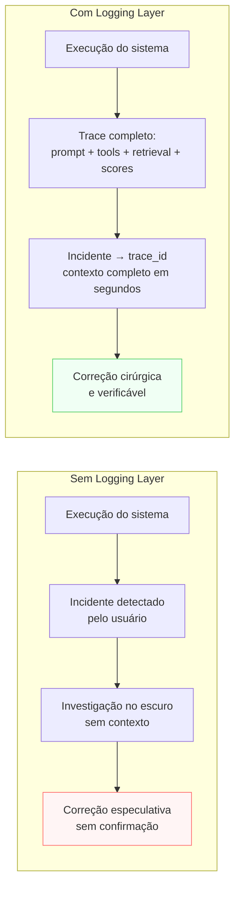

# Logging Layer

> [!abstract] TL;DR
> A Logging Layer registra **o que aconteceu em cada execução**, de forma estruturada e queryável: task, input (com PII redacted), versão do prompt, tools chamadas, fontes usadas, output, score de eval, guardrails disparados, latência e custo. Sem essa camada, o sistema é caixa-preta: você sabe que algo deu errado, mas não consegue dizer onde, quando, nem em que contexto. E sem os logs, o Improvement Loop não tem nada para ler. Observability em IA não é nice-to-have — é pré-requisito para operar.

> [!question]- O que é diferente em logging para sistemas de IA versus logging tradicional?
> Em sistemas de software convencionais, você loga eventos de infraestrutura: erro 500, latência de DB, memória. Em sistemas de IA, o que importa é o *contexto completo da execução*: qual versão do prompt foi usada, quais documentos foram recuperados, quais tools foram chamadas e com quais argumentos, e qual foi o score de qualidade do output. A dificuldade não é técnica — é conceitual: a maioria dos times de engenharia instala seu sistema de logging de software sem adaptar para o que um sistema de IA realmente precisa registrar.

## O problema que a Logging Layer resolve

Incidente em produção: o assistente de suporte respondeu algo incorreto para um cliente. Qual foi exatamente o input do usuário? Qual versão do prompt estava ativa? O modelo fez alguma tool call antes de responder? A Retrieval Layer buscou algum documento? O guardrail disparou e foi ignorado?

Sem a Logging Layer, a resposta para todas essas perguntas é: "não sabemos". Você pode ver o output errado (o usuário mandou screenshot), mas não tem o trace completo da execução. Não tem como reproduzir o problema. Não tem como saber se é bug do prompt, do retrieval, da tool, ou do modelo. E não tem como garantir que a correção que você fez resolve o problema — porque não tem como comparar com o antes.

Log pós-incidente é tão útil quanto airbag depois do acidente. A Logging Layer precisa estar configurada antes do primeiro usuário real, não depois do primeiro incidente.

## Sem Logging Layer vs com Logging Layer



## O que é esta camada

A Logging Layer é o **gravador estruturado** do sistema. Cada execução produz um registro completo com todos os elementos que produziram o output.

Template mínimo (adaptado do thread @hooeem):

```yaml
log_per_run:
  identifiers:
    - trace_id: "<UUID único por execução>"
    - span_id: "<UUID por sub-operação (model call, tool call, retrieval)>"
    - session_id: "<agrupa execuções de uma sessão do usuário>"
  inputs:
    - user_input: "<input com PII redacted se necessário>"
    - prompt_version: "v2.3.1"
    - model_version: "claude-3-5-sonnet-20241022"
    - context_template_version: "v1.1"
  steps:
    - tools_called: [{name, args_redacted, latency_ms, success, error}]
    - retrieval_queries: [{query, sources_found, top_score}]
    - intermediate_outputs: "<em pipelines multi-step>"
  result:
    - output_raw: "<output antes de qualquer post-processing>"
    - eval_score: {accuracy: 4, completeness: 3, overall: 3.7}
    - cost_usd: 0.0023
    - latency_ms: 1847
  flags:
    - guardrails_triggered: []
    - failure_type: null
    - confidence: "high"
  metadata:
    - user_id: "<hashed>"
    - environment: "production"
    - timestamp_utc: "2026-06-24T14:32:11Z"
```

O padrão emergente para a implementação é **OpenTelemetry GenAI** — semantic conventions específicas para LLMs que garantem interoperabilidade com ferramentas como Langfuse, Phoenix e Datadog.

## Decisões-chave

**1. O que NÃO logar.** Logs de IA frequentemente contêm PII em input e output — nomes, CPFs, emails, histórico de saúde. Política de redação de PII antes de gravar no log não é opcional: sem ela, o log vira ativo de risco regulatório (LGPD, GDPR). Defina quais campos recebem redação automática antes de gravar a primeira linha.

**2. Schema estruturado vs free-form.** Log em formato livre (texto puro, JSON ad-hoc) é fácil de gerar e impossível de analisar em escala. Schema estrito com campos tipados viabiliza queries, dashboards e alertas. A regra: comece com schema mínimo fixo e expanda; nunca volte de estruturado para livre.

**3. Log vs trace.** Log é um evento isolado. Trace agrupa todos os spans de uma execução: a chamada ao modelo, as tool calls, as retrieval queries, os sub-agentes — todos com relação de causa-e-efeito preservada. Sistemas simples (uma chamada ao modelo, resposta) sobrevivem com log. Sistemas com agents ou pipelines multi-step precisam de trace para reconstruir o que aconteceu.

**4. Taxa de amostragem em volume.** Logar 100% das execuções em alto volume custa caro — tanto em storage quanto em processamento. Sampling estratificado resolve: 100% de erros (sempre log os casos que falharam), 100% de guardrail disparados, e amostra aleatória de sucessos (5-10%). Esse padrão preserva sinal operacional com custo controlado.

**5. Política de retenção.** Logs com PII têm prazo legal de retenção — no Brasil, LGPD define obrigações; na Europa, GDPR. Logs sem PII podem ser retidos por mais tempo para análise de tendências e treinamento futuro. A política precisa estar definida antes de acumular volume: limpar retroativamente é muito mais difícil.

## Casos práticos

### Cenário 1 — Incidente sem trace

Sistema de recomendação de conteúdo. Um usuário reclama que o sistema recomendou conteúdo inadequado. A equipe tem: o user_id, o timestamp, e o screenshot do output. Não tem: qual versão do prompt estava ativa, quais documentos foram recuperados, qual score de relevância levou àquela recomendação, se o guardrail foi chamado e por que não bloqueou.

Investigação: 3 dias de análise manual em logs de sistema genérico. Conclusão: "provavelmente foi o documento X da base de retrieval, mas não temos certeza". Correção: especulativa. O mesmo problema pode ocorrer de novo.

Com Logging Layer: o trace_id do incidente leva direto ao log completo. Em 20 minutos, a equipe sabe: versão do prompt era v1.8.2, o retrieval buscou com query Q e retornou documentos D1, D2, D3 com scores 0.91, 0.88, 0.72. O documento D1 continha o conteúdo problemático. O guardrail de toxicidade não disparou porque o score ficou abaixo do threshold. Correção: ajuste do threshold do guardrail + remoção de D1 da base de retrieval.

### Cenário 2 — Dashboard operacional com OpenTelemetry

Sistema de suporte técnico com 8.000 chamadas/dia. Logging Layer implementada com OpenTelemetry GenAI + Langfuse como backend. Dashboard mostra em tempo real:

- Latência p50/p95/p99 por tipo de consulta
- Custo por usuário por dia (alerta quando ultrapassa orçamento)
- Taxa de guardrail disparado (spike → possível ataque)
- Eval score médio por dia (queda → possível drift do modelo)
- Tool failure rate por tool (>5% → bug na integração)

Quando a latência p95 sobe 40% em uma hora, o time investiga e descobre: retrieval está fazendo queries redundantes (bug introduzido no último deploy). Identificação: 15 minutos. Rollback: imediato. Sem o dashboard, o problema teria sido descoberto pelo usuário reclamando.

## Armadilhas comuns

> [!warning] Configurar logging depois do primeiro incidente
> "Vamos adicionar logging quando algo der errado" garante que o primeiro incidente vai ser investigado no escuro — sem trace, sem versão do prompt, sem contexto. Logging precisa estar ativo antes do primeiro usuário real. O incidente é tarde demais para instrumentar.

> [!warning] Log não-queryável
> Log em texto livre, JSON sem schema fixo, ou mistura de formatos por data é praticamente inútil para análise em volume. Você tem os dados, mas não consegue responder "qual é o eval score médio das chamadas da semana passada que tiveram guardrail disparado?" sem parsear linha a linha. Schema estruturado desde o início é investimento com retorno imediato.

> [!warning] Logar PII sem política de redação
> Logs de sistemas de IA frequentemente contêm PII sensível nos inputs e outputs dos usuários. Sem redação automática, o log se torna um arquivo de dados pessoais — com todas as obrigações legais que isso implica. Implemente redação como parte do pipeline de logging, não como step opcional.

## Métricas operacionais essenciais de uma Logging Layer madura

Logging não é só para debugging de incidentes — é o substrato de um sistema de monitoramento contínuo. As métricas que todo sistema de IA em produção deveria acompanhar:

**Latência** — separada por componente: latência da chamada ao modelo (p50/p95/p99), latência do retrieval, latência de cada tool call. Quando a latência total sobe, saber qual componente é responsável é a diferença entre debug em 10 minutos e 2 horas.

**Custo por execução** — custo de tokens (input + output), custo de tool calls, custo de retrieval (se pago). Alerta quando custo médio por execução sobe 20% vs semana anterior — pode indicar prompt crescendo sem controle, loop agentic mais profundo, ou retrieval retornando mais chunks desnecessários.

**Eval score por cohort** — score médio por tipo de query, por horário, por versão de prompt. Queda de score em cohort específico pode indicar drift de modelo, problema no retrieval para aquele tipo de query, ou prompt que funcionava para um tipo de input mas não para outro.

**Taxa de guardrail trigger** — por tipo de guardrail. Spike na taxa de prompt injection pode indicar ataque coordenado. Queda na taxa de toxicidade pode indicar false positives parando inputs legítimos. A taxa *normal* de cada guardrail é uma baseline que você precisa conhecer.

**Tool failure rate** — por tool. Taxa de erro >5% em uma tool específica geralmente indica bug de integração, mudança de API, ou schema incompatível — não problema do modelo.

**Session depth para agents** — número médio de iterações no loop agentic por sessão. Aumento súbito indica que o modelo está precisando de mais iterações para resolver o mesmo tipo de problema — pode ser regressão no modelo ou prompt, ou tarefas ficando mais complexas.

> [!example] Dashboard mínimo em produção
> Com esses 6 grupos de métricas, você tem o suficiente para: detectar degradação de qualidade antes dos usuários reclamarem, identificar componente responsável por qualquer spike de latência, estimar custo do mês com 3 dias de dados, e detectar padrões anômalos de uso (potencialmente ataque).

## Como explicar em inglês

The Logging Layer is the structured recorder of the AI system. It captures everything that happened in each execution: the versioned prompt, model parameters, tool calls (with arguments and results), retrieval queries and sources, the raw output, evaluation scores, guardrail triggers, latency, and cost. Without structured logging, the system is a black box — you can see that something went wrong, but not where, when, or why. The Improvement Layer reads logs; without them, it has nothing to work with. The emerging standard is OpenTelemetry GenAI semantic conventions, which provide interoperability with observability tools like Langfuse, Phoenix, and Datadog.

The mental model that helps: every execution of your AI system is like a surgical procedure. You need an operation record — who did what, in what order, with what instruments, and what happened at each step. The Logging Layer is that operation record. If something goes wrong, you need to be able to reconstruct exactly what happened. If it goes right, you need to be able to repeat it.

In interviews, the question that reveals maturity is: "what would you log and why?" A weak answer lists generic fields (timestamp, user_id, output). A strong answer explains the trace structure (why span_id matters for multi-step pipelines), the prompt versioning rationale, PII redaction strategy, sampling policy, and how logs feed the Improvement Loop.

> *"Observability in AI systems is not about logging what happened — it's about logging what you need to understand why it happened."* — common framing in AI engineering design reviews

| PT | EN |
|----|----|
| Camada de logging | Logging Layer |
| Rastreamento | Tracing |
| Span de execução | Execution span |
| Identificador de rastreamento | Trace ID |
| Redação de PII | PII redaction |
| Taxa de amostragem | Sampling rate |
| Política de retenção | Retention policy |
| Observabilidade | Observability |
| Deriva do modelo | Model drift |
| Dashboard operacional | Operational dashboard |

## O que vem a seguir

Com Evaluation, Guardrail e Logging em operação, o bloco de controle está completo. A última camada fecha o loop: a **Improvement Layer** lê os logs, os scores e os padrões de falha, e retroalimenta as camadas de definição — atualizando o prompt, adicionando casos ao dataset de eval, criando novos guardrails, ou revisando o escopo da Purpose Layer.

O Improvement Loop é o que transforma o sistema de uma implementação estática em um sistema vivo que evolui com o uso.

- [[12 - Improvement Layer]] — como o sistema evolui a partir do que aprende
- [[Observability]] — trilha completa: métricas, traces, alertas, dashboards para IA

## Onde aprofundar

- **[[Observability]]** — trilha completa de observabilidade para sistemas de IA (8 notas).
- **OpenTelemetry** — [*Semantic Conventions for Generative AI*](https://opentelemetry.io/docs/specs/semconv/gen-ai/). Padrão emergente.

## Veja também

- [[09 - Evaluation Layer]] — scores de eval entram nos logs
- [[10 - Guardrail Layer]] — guardrails disparados são registrados aqui
- [[12 - Improvement Layer]] — lê estes logs para alimentar melhorias
- [[08 - Workflow vs Agent Layer]] — agents precisam de trace (não só log)

## Fontes

- **@hooeem** — *Become an AI Engineer*, chapter #18, Step 10 (Logging layer template). X/Twitter, 2025.
- **OpenTelemetry** — [*Semantic Conventions for Generative AI*](https://opentelemetry.io/docs/specs/semconv/gen-ai/). Padrão emergente de instrumentação.
- **Langfuse** — [*Tracing concept*](https://langfuse.com/docs/tracing). Implementação concreta de trace para sistemas LLM.


