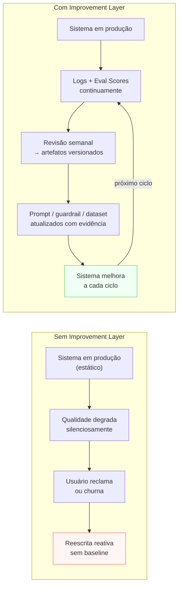

# Improvement Layer

> [!abstract] TL;DR
> A Improvement Layer transforma o sistema de IA de **implementação estática** em **sistema vivo**. Lê logs e scores de eval, identifica o que funcionou e o que falhou, e retroalimenta as camadas de definição: atualiza o prompt, adiciona casos ao dataset de eval, cria novos guardrails, revisita o escopo da Purpose Layer. É a única camada que gera a seta de feedback pontilhada no grafo do stack — e é o que separa um sistema que estagna de um sistema que melhora a cada ciclo de uso.

> [!question]- Por que um sistema de IA degrada com o tempo se ninguém mexe nele?
> Porque o sistema foi configurado para o mundo como ele era no dia do lançamento — e o mundo muda. Os usuários começam a perguntar coisas que você não antecipou. O provider do modelo atualiza silenciosamente o comportamento base. A base de documentos do retrieval envelhece. O system prompt acumula patches que eventualmente se contradizem. Sem a Improvement Layer, essas forças corroem a qualidade do sistema de forma invisível — até chegar ao usuário como incidente ou churn. O Improvement Loop não é projeto — é operação.

## O problema que a Improvement Layer resolve

O sistema foi ao ar. Funciona. Seis meses depois, o time percebe que a qualidade piorou. O que aconteceu?

Três causas comuns: **(a) distribution shift** — o tipo de input dos usuários mudou e o sistema não foi atualizado; **(b) model drift** — o provider atualizou o modelo base e o comportamento mudou sutilmente; **(c) prompt rot** — o system prompt cresceu com patches sucessivos até ficar contraditório consigo mesmo.

Sem a Improvement Layer, essas degradações são descobertas pelos usuários — por queixa, churn ou incidente. Com ela, são descobertas pelos logs e scores antes de chegar ao usuário.

A Improvement Layer não é uma fase de projeto — é um processo operacional que roda indefinidamente. Um sistema de IA sem ciclo de melhoria estruturado não é um produto maduro: é uma implementação que vai degradar até ser substituída.

## Sem Improvement Layer vs com Improvement Layer



## O que é esta camada

A Improvement Layer é o **loop fechado** do stack. Fecha o ciclo que começa no Logging e passa pelo Evaluation: registrou → mediu → aprendeu → ajustou.

Template mínimo (adaptado do thread @hooeem):

```yaml
improvement:
  review_cadence:
    incident_review: "imediato após guardrail crítico ou score abaixo do threshold"
    batch_review: "semanal — padrões de falha, drift, oportunidades de melhoria"
    strategic_review: "mensal — Purpose Layer, escopo, modelo base"
  questions_per_review:
    - "O que funcionou bem esta semana? (preservar, replicar)"
    - "O que falhou repetidamente? (padrão, não caso isolado)"
    - "O que mudar antes da próxima semana?"
  artifacts_per_cycle:
    - "prompt_version_bump: diff + motivo + scores antes/depois"
    - "new_failure_modes: adicionados ao Context Layer como known_failure_modes"
    - "eval_dataset_additions: novos casos do incidentes reais"
    - "new_guardrails: padrões novos de input problemático"
    - "purpose_layer_update: se o scope real divergiu do escopo definido"
  ownership:
    reviewer: "<quem analisa os logs>"
    decision_maker: "<quem aprova mudanças no prompt ou no escopo>"
```

## Decisões-chave

**1. Cadência tripartite.** Revisão imediata para incidentes graves (qualquer guardrail crítico disparado, score de eval abaixo do threshold de prod). Revisão batch semanal para padrões (não casos isolados). Revisão estratégica mensal para decisões que tocam a Purpose Layer ou o modelo base. Misturar as três cadências em uma reunião mensal significa que incidentes esperarão um mês para ser analisados.

**2. Insights precisam virar artefatos versionados.** Insight que fica em ata ou em mensagem de Slack morre. Melhoria só acontece quando o insight vira: diff no prompt versionado no Git, novo caso no dataset de eval, novo guardrail no template. "O modelo erra quando o usuário pergunta sobre X em contexto Y" só vira melhoria quando vai para `known_failure_modes` no Context Layer ou para um caso no dataset.

**3. O que vira prompt bump vs o que vira novo guardrail vs o que vira revisão de Purpose.** Falha de comportamento do modelo → prompt bump. Padrão de input que o modelo consistentemente mal-interpreta → novo guardrail pre-LLM. Usuários pedindo consistentemente algo fora do `not_in_scope` → revisão estratégica da Purpose Layer (talvez o escopo precise expandir, ou talvez o sistema de comunicação ao usuário precise melhorar).

**4. Versionamento de prompt com scores.** Cada mudança no prompt tem: versão semântica, motivo da mudança, scores de eval antes e depois, e autor. Isso permite rollback quando uma mudança piora o sistema, e A/B test quando você quer validar antes de fazer rollover completo.

**5. Drift detection como sinal de entrada.** O Improvement Loop precisa de triggers automáticos: alerta quando o eval score médio cai >10% vs semana anterior, alerta quando a taxa de guardrail disparo muda >20%. Sem alertas automáticos, o processo depende de alguém lembrar de verificar — o que não escala.

## Casos práticos

### Cenário 1 — O sistema que nunca melhorou

Assistente de redação jurídica lançado com avaliação manual por dois advogados. Sem Evaluation Layer, sem Logging Layer estruturado, sem Improvement Loop. Seis meses depois: o time nota que usuários estão editando 70% dos outputs antes de usar. O que mudou?

Investigação: logs genéricos mostram volume de chamadas mas nada sobre qualidade. Versão do prompt: uma única versão, nunca atualizada. Dataset de eval: não existe. Casos de falha documentados: zero.

O time não consegue identificar o que piorou nem quando. Reescreve o prompt do zero baseado em intuição — que pode ser melhor, pior, ou igual. Sem métricas de antes, não há como saber.

### Cenário 2 — Improvement Loop em ciclo regular

Mesmo tipo de sistema, equipe diferente. Revisão semanal de 30 minutos:

**Semana 3:**
- Logs mostram que 35% das falhas de qualidade ocorrem quando o usuário pede "resumo de contrato de prestação de serviços"
- Dataset tem apenas 2 casos desse tipo — subrepresentado
- Ação: adicionar 8 casos ao dataset, re-evaluar, identificar padrão de falha
- Resultado: o modelo omite as cláusulas de multa quando o contrato tem >10 páginas (atenção se dilui no final da janela de contexto)

**Semana 4:**
- Prompt bump: adiciona instrução "ao resumir contratos longos, priorize as cláusulas de multa, rescisão e SLA"
- `known_failure_modes`: adiciona "contratos >10 páginas → risco de omissão de cláusulas tardias"
- Eval score na dimensão "completude": 3.1 → 4.2 para contratos longos

O sistema melhorou de forma rastreável, com evidência de antes e depois.

## Armadilhas comuns

> [!warning] Improvement sem Logging Layer configurada
> O Improvement Loop lê logs estruturados — sem logs, não tem o que ler. "Vamos ver o que os usuários estão reclamando no Slack" não é Improvement Layer: é gestão de crise reativa. O loop precisa de logs estruturados que permitam queries como "quais chamadas desta semana tiveram score de completude < 3?". Isso exige a Logging Layer estar configurada antes do primeiro usuário.

> [!warning] Insights sem artefato versionado
> "Na revisão desta semana descobrimos que o modelo falha quando X" que não vira: (1) caso no dataset de eval, (2) entrada em `known_failure_modes` no Context, ou (3) nova instrução no prompt — é insight que morre. A próxima pessoa que entrar no sistema vai descobrir o mesmo problema daqui a 3 semanas. Cultura de Improvement Loop é cultura de externalizar conhecimento em artefatos, não de acumular memória individual.

> [!warning] Mudar o prompt sem versão e sem scores
> "Editei o prompt para ficar melhor" sem: número de versão, motivo documentado, scores de eval antes da mudança e scores depois da mudança — é mudança não rastreável. Se o sistema piorar depois, você não sabe se foi essa mudança ou algo que mudou no ambiente. Trate mudanças de prompt como commits: sempre com mensagem descritiva e com a capacidade de reverter.

## Como priorizar o que melhorar primeiro

O Improvement Loop produz mais insights do que capacidade de implementar. Como priorizar?

**Critério 1 — Frequência do padrão de falha.** Caso isolado não é prioridade. Padrão que aparece em >5% das execuções da semana é. "O modelo falha quando..." precisa ser seguido por um número: "em 8% das chamadas desta semana".

**Critério 2 — Severidade da falha.** Falha que produz output incorreto mas recuperável (usuário percebe e corrige) tem prioridade menor que falha que produz output incorreto e não é percebida (o usuário age com base em informação errada). Mapeie as dimensões de falha pelo impacto real.

**Critério 3 — Facilidade de correção.** Falha corrigível com uma linha no prompt tem custo de implementação zero comparada com falha que exige recontrução da base de retrieval. Quando dois problemas têm frequência e severidade similares, prefira o de menor custo de correção.

**Critério 4 — Relação causa-raiz.** Uma causa raiz pode estar gerando vários sintomas. "O modelo sempre omite informações no final de documentos longos" é causa raiz de múltiplos padrões de falha. Resolver a causa raiz tem ROI maior que corrigir cada sintoma individualmente.

> [!info] Regra de triagem
> Triagem da semana de revisão: (1) incidentes críticos da semana → imediato; (2) padrão de falha >5% de frequência → próximo sprint; (3) oportunidade de melhoria sem urgência → backlog priorizado. Não resolva tudo de uma vez — resolva em ordem de impacto.

## Como explicar em inglês

The Improvement Layer closes the feedback loop of the AI stack. It reads structured logs and evaluation scores, identifies patterns of success and failure, and feeds improvements back into the definition layers: prompt updates, new evaluation cases, new guardrails, or even revisions to the Purpose Layer's scope. The key principle: insight without a versioned artifact doesn't produce improvement. A discovery about system failure only becomes a fix when it's written into a prompt diff, an eval dataset entry, or a new guardrail rule — not when it's discussed in a meeting.

Think of it as the difference between a surgeon who debriefs after every procedure (identifying what to do differently next time) versus one who just moves to the next patient. The first gets better over time in a trackable, teachable way. The second relies on intuition that's invisible and non-transferable. The Improvement Layer is the structured debrief mechanism for your AI system.

In interviews, the strong signal is distinguishing *reactive* improvement (fix when users complain) from *proactive* improvement (detect degradation in logs before users notice). The former is crisis management. The latter is the Improvement Layer in practice — cadenced reviews, automatic drift alerts, and the discipline of turning insights into versioned artifacts.

> *"The teams that ship the best AI products aren't the ones who build the best initial system — they're the ones who have the tightest improvement loops."* — Hamel Husain, Your AI product needs evals

| PT | EN |
|----|----|
| Camada de melhoria | Improvement Layer |
| Loop de melhoria | Improvement loop |
| Revisão em lote | Batch review |
| Detecção de deriva | Drift detection |
| Atualização de versão do prompt | Prompt version bump |
| Modo de falha conhecido | Known failure mode |
| Mudança de distribuição | Distribution shift |
| Sistema vivo | Living system |
| Ciclo de feedback | Feedback cycle |

## O que vem a seguir

Com as 11 camadas definidas — Purpose, Prompt, Context, Output, Retrieval, Tool, Workflow vs Agent, Evaluation, Guardrail, Logging, Improvement — você tem o blueprint completo de um sistema de IA pronto para produção.

A próxima nota desta trilha mostra como as 11 camadas se conectam em um exemplo end-to-end: um sistema de geração de newsletter com IA, construído camada a camada desde a Purpose Layer até o primeiro Improvement Loop.

- [[13 - Setup completo — do zero ao sistema de produção]] — todas as 11 camadas num exemplo concreto
- [[Improvement Loop]] — trilha completa: cadência, artefatos, drift detection, A/B de prompt

## Onde aprofundar

- **[[Improvement Loop]]** — trilha completa dedicada ao ciclo de melhoria (7 notas).
- **[[Segurança e Guardrails]]** → [[10 - Métricas de qualidade AI — defect escape rate, rework ratio]] — métricas operacionais para alimentar o loop.

## Veja também

- [[09 - Evaluation Layer]] — fonte de scores para o loop
- [[11 - Logging Layer]] — fonte de detalhe e padrões para o loop
- [[02 - Purpose Layer — o que o sistema é]] — Improvement pode redefinir Purpose se a realidade exigir
- [[03 - Prompt Layer]] — principal alvo de mudança do Improvement Loop

## Fontes

- **@hooeem** — *Become an AI Engineer*, chapter #18, Step 11 (Improvement layer template). X/Twitter, 2025.
- **Hamel Husain** — [*Your AI product needs evals*](https://hamel.dev/blog/posts/evals/). Eval contínua como entrada do improvement loop.
- **Anthropic** — [*Iterative prompt engineering*](https://docs.anthropic.com/en/docs/build-with-claude/prompt-engineering/overview). Prática de versionamento e iteração com sinal.


