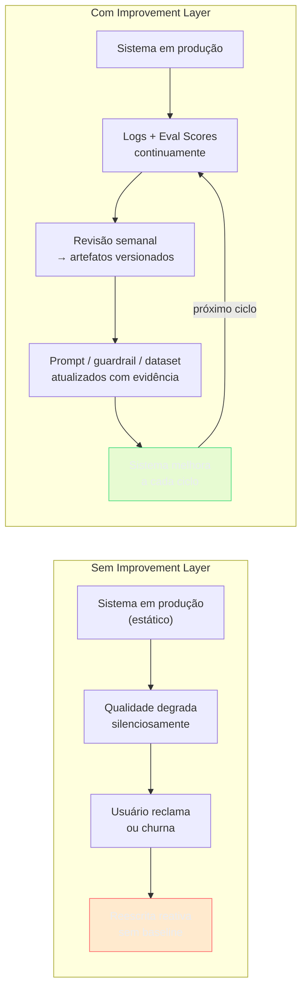

# Improvement Layer

> [!abstract] TL;DR
> A Improvement Layer transforma o sistema de IA de **implementação estática** em **sistema vivo**. Lê logs e scores de eval, identifica o que funcionou e o que falhou, e retroalimenta as camadas de definição: atualiza o prompt, adiciona casos ao dataset de eval, cria novos guardrails, revisita o escopo da Purpose Layer. É a única camada que gera a seta de feedback pontilhada no grafo do stack — e é o que separa um sistema que estagna de um sistema que melhora a cada ciclo de uso.

> [!question]- Por que um sistema de IA degrada com o tempo se ninguém mexe nele?
> Porque o sistema foi configurado para o mundo como ele era no dia do lançamento — e o mundo muda. Os usuários começam a perguntar coisas que você não antecipou. O provider do modelo atualiza silenciosamente o comportamento base. A base de documentos do retrieval envelhece. O system prompt acumula patches que eventualmente se contradizem. Sem a Improvement Layer, essas forças corroem a qualidade do sistema de forma invisível — até chegar ao usuário como incidente ou churn. O Improvement Loop não é projeto — é operação.

## O problema que a Improvement Layer resolve

O sistema foi ao ar. Funciona. Seis meses depois, o time percebe que a qualidade piorou. O que aconteceu?

Três causas comuns: **(a) distribution shift** — o tipo de input dos usuários mudou e o sistema não foi atualizado; **(b) model drift** — o provider atualizou o modelo base e o comportamento mudou sutilmente; **(c) prompt rot** — o system prompt cresceu com patches sucessivos até ficar contraditório consigo mesmo.

Sem a Improvement Layer, essas degradações são descobertas pelos usuários — por queixa, churn ou incidente. Com ela, são descobertas pelos logs e scores antes de chegar ao usuário.

A Improvement Layer não é uma fase de projeto — é um processo operacional que roda indefinidamente. Um sistema de IA sem ciclo de melhoria estruturado não é um produto maduro: é uma implementação que vai degradar até ser substituída.

## Sem Improvement Layer vs com Improvement Layer



## O que é esta camada

A Improvement Layer é o **loop fechado** do stack. Fecha o ciclo que começa no Logging e passa pelo Evaluation: registrou → mediu → aprendeu → ajustou.

Template mínimo (adaptado do thread @hooeem):

```yaml
improvement:
  review_cadence:
    incident_review: "imediato após guardrail crítico ou score abaixo do threshold"
    batch_review: "semanal — padrões de falha, drift, oportunidades de melhoria"
    strategic_review: "mensal — Purpose Layer, escopo, modelo base"
  questions_per_review:
    - "O que funcionou bem esta semana? (preservar, replicar)"
    - "O que falhou repetidamente? (padrão, não caso isolado)"
    - "O que mudar antes da próxima semana?"
  artifacts_per_cycle:
    - "prompt_version_bump: diff + motivo + scores antes/depois"
    - "new_failure_modes: adicionados ao Context Layer como known_failure_modes"
    - "eval_dataset_additions: novos casos do incidentes reais"
    - "new_guardrails: padrões novos de input problemático"
    - "purpose_layer_update: se o scope real divergiu do escopo definido"
  ownership:
    reviewer: "<quem analisa os logs>"
    decision_maker: "<quem aprova mudanças no prompt ou no escopo>"
```

## Decisões-chave

**1. Cadência tripartite.** Revisão imediata para incidentes graves (qualquer guardrail crítico disparado, score de eval abaixo do threshold de prod). Revisão batch semanal para padrões (não casos isolados). Revisão estratégica mensal para decisões que tocam a Purpose Layer ou o modelo base. Misturar as três cadências em uma reunião mensal significa que incidentes esperarão um mês para ser analisados.

**2. Insights precisam virar artefatos versionados.** Insight que fica em ata ou em mensagem de Slack morre. Melhoria só acontece quando o insight vira: diff no prompt versionado no Git, novo caso no dataset de eval, novo guardrail no template. "O modelo erra quando o usuário pergunta sobre X em contexto Y" só vira melhoria quando vai para `known_failure_modes` no Context Layer ou para um caso no dataset.

**3. O que vira prompt bump vs o que vira novo guardrail vs o que vira revisão de Purpose.** Falha de comportamento do modelo → prompt bump. Padrão de input que o modelo consistentemente mal-interpreta → novo guardrail pre-LLM. Usuários pedindo consistentemente algo fora do `not_in_scope` → revisão estratégica da Purpose Layer (talvez o escopo precise expandir, ou talvez o sistema de comunicação ao usuário precise melhorar).

**4. Versionamento de prompt com scores.** Cada mudança no prompt tem: versão semântica, motivo da mudança, scores de eval antes e depois, e autor. Isso permite rollback quando uma mudança piora o sistema, e A/B test quando você quer validar antes de fazer rollover completo.

**5. Drift detection como sinal de entrada.** O Improvement Loop precisa de triggers automáticos: alerta quando o eval score médio cai >10% vs semana anterior, alerta quando a taxa de guardrail disparo muda >20%. Sem alertas automáticos, o processo depende de alguém lembrar de verificar — o que não escala.

## Casos práticos

### Cenário 1 — O sistema que nunca melhorou

Assistente de redação jurídica lançado com avaliação manual por dois advogados. Sem Evaluation Layer, sem Logging Layer estruturado, sem Improvement Loop. Seis meses depois: o time nota que usuários estão editando 70% dos outputs antes de usar. O que mudou?

Investigação: logs genéricos mostram volume de chamadas mas nada sobre qualidade. Versão do prompt: uma única versão, nunca atualizada. Dataset de eval: não existe. Casos de falha documentados: zero.

O time não consegue identificar o que piorou nem quando. Reescreve o prompt do zero baseado em intuição — que pode ser melhor, pior, ou igual. Sem métricas de antes, não há como saber.

### Cenário 2 — Improvement Loop em ciclo regular

Mesmo tipo de sistema, equipe diferente. Revisão semanal de 30 minutos:

**Semana 3:**
- Logs mostram que 35% das falhas de qualidade ocorrem quando o usuário pede "resumo de contrato de prestação de serviços"
- Dataset tem apenas 2 casos desse tipo — subrepresentado
- Ação: adicionar 8 casos ao dataset, re-evaluar, identificar padrão de falha
- Resultado: o modelo omite as cláusulas de multa quando o contrato tem >10 páginas (atenção se dilui no final da janela de contexto)

**Semana 4:**
- Prompt bump: adiciona instrução "ao resumir contratos longos, priorize as cláusulas de multa, rescisão e SLA"
- `known_failure_modes`: adiciona "contratos >10 páginas → risco de omissão de cláusulas tardias"
- Eval score na dimensão "completude": 3.1 → 4.2 para contratos longos

O sistema melhorou de forma rastreável, com evidência de antes e depois.

### Cenário 3 — Drift detection automático

Terceira equipe, mesmo tipo de sistema, mas com um passo a mais: nenhuma das duas primeiras dependia de alguém *lembrar* de olhar os números. Aqui o loop dispara sozinho.

> [!question]- Por que não basta olhar o dashboard uma vez por semana?
> Porque entre uma revisão e outra o sistema pode degradar 15% e ninguém percebe até o incidente. Revisão manual encontra o que já virou problema visível; alerta automático encontra o desvio *antes* de virar problema. A diferença é a mesma entre auditoria contábil trimestral e um alarme de incêndio — os dois eventualmente detectam o problema, mas só um te avisa a tempo de agir.

O time configura dois tipos de alerta sobre a série temporal de scores de eval (não sobre o resultado de uma chamada isolada, mas sobre a média móvel):

- **Alerta de degradação relativa:** score médio de completude cai >10% em relação à média da semana anterior → notificação automática no canal de revisão, sem esperar o batch semanal.
- **Alerta de threshold absoluto:** qualquer chamada com score de completude <3 (na escala interna de 1-5) dispara revisão imediata se a frequência ultrapassar 5% das chamadas da hora — abaixo disso é ruído estatístico, não sinal.

**Semana 6:** o alerta de degradação relativa dispara às 14h de uma terça — completude caiu de 4.1 para 3.4 em 48h. Investigação encontra a causa em minutos, não em dias: o provider do modelo atualizou a versão base do modelo às 9h da manhã (model drift, uma das três causas do início desta nota). O time aplica um prompt bump compensatório no mesmo dia e o score volta a 4.0 na manhã seguinte.

Sem o alerta, essa degradação só apareceria na revisão semanal de sexta-feira — três dias de usuários recebendo output pior, sem que ninguém soubesse.

O alerta em si é configuração, não código customizado — a maioria das plataformas de observabilidade (seção Ferramentas, abaixo) trata score de eval como série temporal e permite declarar a regra direto:

```yaml
alerts:
  - name: "completude_degradacao_relativa"
    metric: "eval.completude.media_movel_48h"
    condition: "queda > 10% vs media_movel_7d_anterior"
    canal: "#improvement-loop"
    acao: "revisão imediata (fora da cadência semanal)"
  - name: "completude_threshold_absoluto"
    metric: "eval.completude.taxa_abaixo_de_3"
    condition: "> 5% das chamadas na última hora"
    canal: "#improvement-loop"
    acao: "revisão imediata"
```

> [!summary] O alerta automático não substitui a revisão semanal — ele comprime o tempo entre "o sistema degradou" e "alguém sabe disso" de dias para minutos.

Um risco desse mecanismo, se configurado sem cuidado: alerta demais e a equipe aprende a ignorar. Threshold calibrado apertado demais (ex: qualquer queda >2%) dispara em ruído estatístico normal — variação de dia a dia que não é degradação real — e o canal de alerta vira o rádio que ninguém mais escuta. A prática recomendada é revisar os próprios thresholds a cada mês na revisão estratégica: se o alerta disparou 10 vezes no mês e só 1 era degradação real, o threshold está calibrado errado, não o loop.

Compare com o Cenário 1: lá, a degradação existia mas nunca virou sinal — não havia eval, não havia log estruturado, não havia threshold algum. O Cenário 3 é o extremo oposto do espectro: mesma categoria de falha (qualidade caindo com o tempo), mas descoberta em minutos em vez de nunca.

## Ferramentas

Cadência e artefatos versionados (as decisões-chave acima) valem independente da ferramenta — mas alguém precisa registrar traces, calcular scores e disparar os alertas. Essa camada de instrumentação normalmente já nasce na [[11 - Logging Layer]]; a pergunta aqui é qual plataforma consome esses traces para fechar o loop. Três famílias de plataforma cobrem esse papel, cada uma com um ponto forte diferente:

| Ferramenta | Ponto forte | Modelo de hospedagem | Quando escolher |
|---|---|---|---|
| **Langfuse** | Tracing via OpenTelemetry, agnóstico de framework | Self-host (MIT, sem feature gating) ou cloud | Soberania de dados, times multi-framework, disciplina de custo |
| **Arize Phoenix** | Rigor de avaliação — drift comportamental, bias, LLM-as-judge para relevância/toxicidade | Self-host (local-first, roda em notebook/Docker) ou cloud | RAG evaluation, monitoramento unificado ML clássico + LLM |
| **Datadog LLM Observability** | Unifica traces de LLM com APM, banco de dados e infraestrutura no mesmo painel | Apenas cloud (SaaS) | Times já em Datadog que querem correlacionar falha de IA com infra |

> [!info] Não é escolha excludente
> Langfuse e Phoenix competem no mesmo espaço (tracing + eval open-source, self-hostable); Datadog compete em outra dimensão — integração com observabilidade de infraestrutura já existente. Um time que já paga Datadog para APM ganha mais com o módulo de LLM Observability integrado do que adotando uma quarta ferramenta isolada; um time greenfield sem stack de observabilidade prévia normalmente começa por Langfuse ou Phoenix pelo custo zero de self-host.

Qualquer uma das três serve de backend para os alertas do Cenário 3 acima — o que muda é onde os dados de trace já vivem e quanto custa mantê-los.

> [!question]- E se eu escolher errado — dá pra trocar depois?
> Dá, se a instrumentação inicial usar OpenTelemetry (o padrão que Langfuse adota nativamente e que Phoenix e Datadog também consomem). Trace instrumentado em OTel é portável entre backends — trocar de ferramenta vira reconfiguração de destino, não reescrita de código. Instrumentar direto no SDK proprietário de uma única plataforma é que cria lock-in: aí trocar de ferramenta significa reinstrumentar toda a aplicação.

Custo é o eixo que mais frequentemente decide entre as três: self-host de Langfuse ou Phoenix tem custo de infraestrutura (você paga o servidor, não por chamada), enquanto Datadog LLM Observability cobra por volume de requisição processada — modelo que escala bem no início e fica caro conforme o tráfego cresce, especialmente para quem já paga APM do Datadog e adicionaria o módulo de LLM por cima.

Na prática de drift detection do Cenário 3, cada ferramenta ataca o problema por um ângulo diferente:

- **Langfuse** não tem um detector de drift embutido — você define o eval customizado (score de completude, por exemplo) e configura o alerta sobre essa métrica manualmente. Flexível, mas o trabalho de definir "o que é degradação" é seu.
- **Phoenix** tem detecção de drift comportamental como recurso de primeira classe — compara a distribuição de embeddings ou respostas do período atual contra uma baseline e sinaliza divergência estatística, mesmo sem um score de eval explícito configurado.
- **Datadog** trata o score de eval como qualquer métrica de APM — herda os mecanismos de anomaly detection que o Datadog já tem para infraestrutura (baseline móvel, sazonalidade), o que é conveniente para quem já usa esses recursos em outros sistemas.

Nenhuma das três dispensa a decisão humana de *qual* threshold é degradação real vs ruído — isso é decisão de produto, não de ferramenta.

Vale notar a diferença entre os dois tipos de drift que essas ferramentas detectam: drift de **eval score** (a métrica que você mesmo define caindo) é o foco de Langfuse e Datadog; drift **comportamental** (a distribuição de respostas do modelo mudando de forma estatisticamente detectável, mesmo sem um score explícito piorar) é a especialidade de Phoenix — útil quando a causa raiz é sutil o suficiente para não aparecer ainda no score agregado.

> [!example]- Checklist rápido de escolha
> - Já tem Datadog rodando em produção e quer ver LLM ao lado de APM/infra? → **Datadog LLM Observability**.
> - Precisa manter os dados de trace dentro do seu próprio ambiente (compliance, LGPD, cliente enterprise)? → **Langfuse self-hosted**.
> - O maior risco do sistema é qualidade de RAG (retrieval ruim, contexto errado) e você já mistura modelos clássicos de ML com LLM? → **Arize Phoenix**.
> - Ainda não decidiu e quer o menor custo de entrada para prototipar o loop inteiro (tracing + eval + alerta) antes de comprometer orçamento? → comece por **Phoenix** local (Docker, zero custo) e migre depois se o volume justificar uma plataforma paga.

A escolha da ferramenta não substitui nenhuma das cinco decisões-chave da seção anterior — ela só determina onde essas decisões ficam registradas e quem recebe o alerta quando o threshold é cruzado.

Isso fecha o gancho de instrumentação: o que fica registrado nas três ferramentas acima é exatamente o que alimenta os dois tipos de alerta descritos no Cenário 3.

## Armadilhas comuns

> [!warning] Improvement sem Logging Layer configurada
> O Improvement Loop lê logs estruturados — sem logs, não tem o que ler. "Vamos ver o que os usuários estão reclamando no Slack" não é Improvement Layer: é gestão de crise reativa. O loop precisa de logs estruturados que permitam queries como "quais chamadas desta semana tiveram score de completude < 3?". Isso exige a Logging Layer estar configurada antes do primeiro usuário.
>
> **Resolução:** antes de escrever a primeira linha do Improvement Loop, confirme que a Logging Layer já grava, por chamada, no mínimo:
>
> - input e output completos (não só um resumo ou hash)
> - versão do prompt usada naquela chamada
> - timestamp e latência
> - score de eval, quando disponível (mesmo que seja amostragem parcial do tráfego)
>
> Se essa tabela não existe, o trabalho não é "montar o loop de melhoria" — é primeiro voltar para [[11 - Logging Layer]] e fechar essa lacuna. Não adianta desenhar cadência de revisão sobre dados que não existem.

> [!warning] Insights sem artefato versionado
> "Na revisão desta semana descobrimos que o modelo falha quando X" que não vira: (1) caso no dataset de eval, (2) entrada em `known_failure_modes` no Context, ou (3) nova instrução no prompt — é insight que morre. A próxima pessoa que entrar no sistema vai descobrir o mesmo problema daqui a 3 semanas. Cultura de Improvement Loop é cultura de externalizar conhecimento em artefatos, não de acumular memória individual.
>
> **Resolução:** trate toda reunião de revisão como reunião que só termina quando cada insight tem um dono e um artefato de destino anotado ali mesmo — não depois. Template mínimo de ata: "Insight → Artefato → Responsável → Prazo". Se um insight sai da reunião sem essas quatro colunas preenchidas, ele não foi capturado — foi só discutido.
>
> Exemplo de linha de ata que passa no teste: "Modelo omite valor de multa em contratos >10 páginas (8% das chamadas) → adicionar 5 casos ao dataset de eval + entrada em `known_failure_modes` → João → até sexta". Exemplo que falha o teste: "Discutimos o problema de contratos longos, vamos ver isso." — sem artefato, sem dono, sem prazo, esse insight não sobrevive à próxima sprint.

> [!warning] Mudar o prompt sem versão e sem scores
> "Editei o prompt para ficar melhor" sem: número de versão, motivo documentado, scores de eval antes da mudança e scores depois da mudança — é mudança não rastreável. Se o sistema piorar depois, você não sabe se foi essa mudança ou algo que mudou no ambiente. Trate mudanças de prompt como commits: sempre com mensagem descritiva e com a capacidade de reverter.
>
> **Resolução:** versione o prompt no mesmo repositório Git do código (arquivo `.md` ou `.yaml` dedicado), nunca só na UI do provider. Cada commit de prompt roda o dataset de eval completo antes e depois — o diff do commit inclui o diff dos scores, não só o diff do texto. Sem isso, rollback vira arqueologia: ninguém sabe qual versão anterior era "a boa".
>
> Mensagem de commit mínima: `prompt v1.4 → v1.5: adiciona instrução de priorização de cláusulas em contratos longos. Motivo: 8% das chamadas omitiam cláusula de multa (Semana 3). Eval completude: 3.1 → 4.2.` Qualquer um no time, meses depois, entende o que mudou, por quê e com que evidência — sem precisar perguntar a quem escreveu.

## Como priorizar o que melhorar primeiro

O Improvement Loop produz mais insights do que capacidade de implementar. Como priorizar?

**Critério 1 — Frequência do padrão de falha.** Caso isolado não é prioridade. Padrão que aparece em >5% das execuções da semana é. "O modelo falha quando..." precisa ser seguido por um número: "em 8% das chamadas desta semana".

**Critério 2 — Severidade da falha.** Falha que produz output incorreto mas recuperável (usuário percebe e corrige) tem prioridade menor que falha que produz output incorreto e não é percebida (o usuário age com base em informação errada). Mapeie as dimensões de falha pelo impacto real.

**Critério 3 — Facilidade de correção.** Falha corrigível com uma linha no prompt tem custo de implementação zero comparada com falha que exige recontrução da base de retrieval. Quando dois problemas têm frequência e severidade similares, prefira o de menor custo de correção.

**Critério 4 — Relação causa-raiz.** Uma causa raiz pode estar gerando vários sintomas. "O modelo sempre omite informações no final de documentos longos" é causa raiz de múltiplos padrões de falha. Resolver a causa raiz tem ROI maior que corrigir cada sintoma individualmente.

> [!info] Regra de triagem
> Triagem da semana de revisão: (1) incidentes críticos da semana → imediato; (2) padrão de falha >5% de frequência → próximo sprint; (3) oportunidade de melhoria sem urgência → backlog priorizado. Não resolva tudo de uma vez — resolva em ordem de impacto.

## Como explicar em inglês

The Improvement Layer closes the feedback loop of the AI stack. It reads structured logs and evaluation scores, identifies patterns of success and failure, and feeds improvements back into the definition layers: prompt updates, new evaluation cases, new guardrails, or even revisions to the Purpose Layer's scope. The key principle: insight without a versioned artifact doesn't produce improvement. A discovery about system failure only becomes a fix when it's written into a prompt diff, an eval dataset entry, or a new guardrail rule — not when it's discussed in a meeting.

Think of it as the difference between a surgeon who debriefs after every procedure (identifying what to do differently next time) versus one who just moves to the next patient. The first gets better over time in a trackable, teachable way. The second relies on intuition that's invisible and non-transferable. The Improvement Layer is the structured debrief mechanism for your AI system.

In interviews, the strong signal is distinguishing *reactive* improvement (fix when users complain) from *proactive* improvement (detect degradation in logs before users notice). The former is crisis management. The latter is the Improvement Layer in practice — cadenced reviews, automatic drift alerts, and the discipline of turning insights into versioned artifacts.

> *"The teams that ship the best AI products aren't the ones who build the best initial system — they're the ones who have the tightest improvement loops."* — Hamel Husain, Your AI product needs evals

| PT | EN |
|----|----|
| Camada de melhoria | Improvement Layer |
| Loop de melhoria | Improvement loop |
| Revisão em lote | Batch review |
| Detecção de deriva | Drift detection |
| Atualização de versão do prompt | Prompt version bump |
| Modo de falha conhecido | Known failure mode |
| Mudança de distribuição | Distribution shift |
| Sistema vivo | Living system |
| Ciclo de feedback | Feedback cycle |

## O que vem a seguir

Com as 11 camadas definidas — Purpose, Prompt, Context, Output, Retrieval, Tool, Workflow vs Agent, Evaluation, Guardrail, Logging, Improvement — você tem o blueprint completo de um sistema de IA pronto para produção.

A próxima nota desta trilha mostra como as 11 camadas se conectam em um exemplo end-to-end: um sistema de geração de newsletter com IA, construído camada a camada desde a Purpose Layer até o primeiro Improvement Loop.

- [[13 - Setup completo — do zero ao sistema de produção]] — todas as 11 camadas num exemplo concreto
- [[Improvement Loop]] — trilha completa: cadência, artefatos, drift detection, A/B de prompt

## Onde aprofundar

- **[[Improvement Loop]]** — trilha completa dedicada ao ciclo de melhoria (7 notas).
- **[[Segurança e Guardrails]]** → [[10 - Métricas de qualidade AI — defect escape rate, rework ratio]] — métricas operacionais para alimentar o loop.

## Veja também

- [[09 - Evaluation Layer]] — fonte de scores para o loop
- [[11 - Logging Layer]] — fonte de detalhe e padrões para o loop
- [[02 - Purpose Layer — o que o sistema é]] — Improvement pode redefinir Purpose se a realidade exigir
- [[03 - Prompt Layer]] — principal alvo de mudança do Improvement Loop

## Fontes

- **@hooeem** — *Become an AI Engineer*, chapter #18, Step 11 (Improvement layer template). X/Twitter, 2025.
- **Hamel Husain** — [*Your AI product needs evals*](https://hamel.dev/blog/posts/evals/). Eval contínua como entrada do improvement loop.
- **Anthropic** — [*Iterative prompt engineering*](https://docs.anthropic.com/en/docs/build-with-claude/prompt-engineering/overview). Prática de versionamento e iteração com sinal.
- **Confident AI** — [*Best LLM Observability Tools*](https://www.confident-ai.com/knowledge-base/compare/best-ai-observability-tools-2026) (2026). Comparação Langfuse / Arize Phoenix / Datadog LLM Observability.
- **Agenta** — [*Prompt Drift: What It Is and How to Detect It*](https://agenta.ai/blog/prompt-drift) (2026). Base para o mecanismo de alerta por threshold do Cenário 3.
- **Galileo** — [*Best LLM Output Drift Monitoring Platforms*](https://galileo.ai/blog/best-llm-output-drift-monitoring-platforms) (2026). Panorama de detecção de drift comportamental vs drift de eval score, usado na comparação da subseção Ferramentas.
